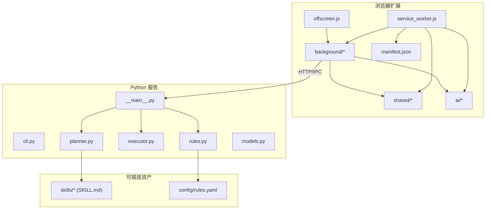
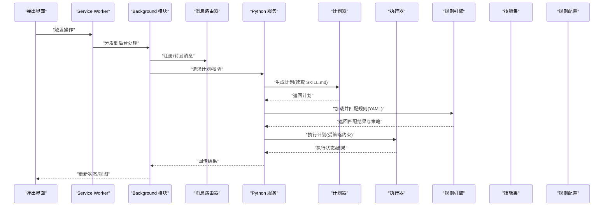
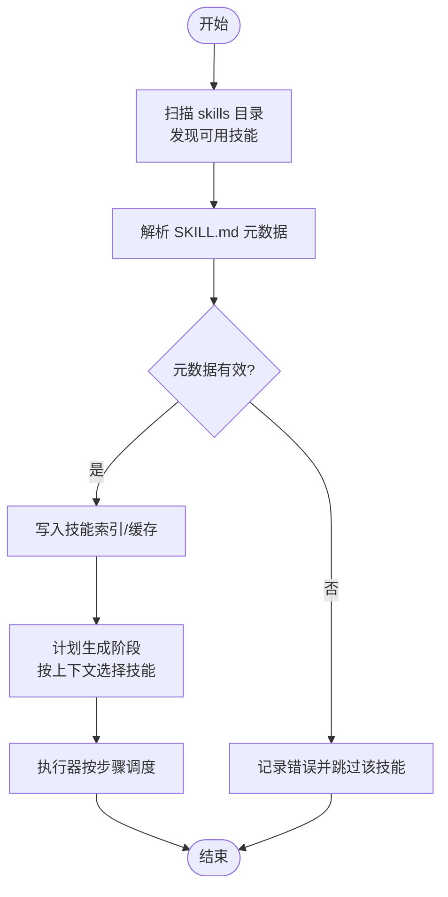
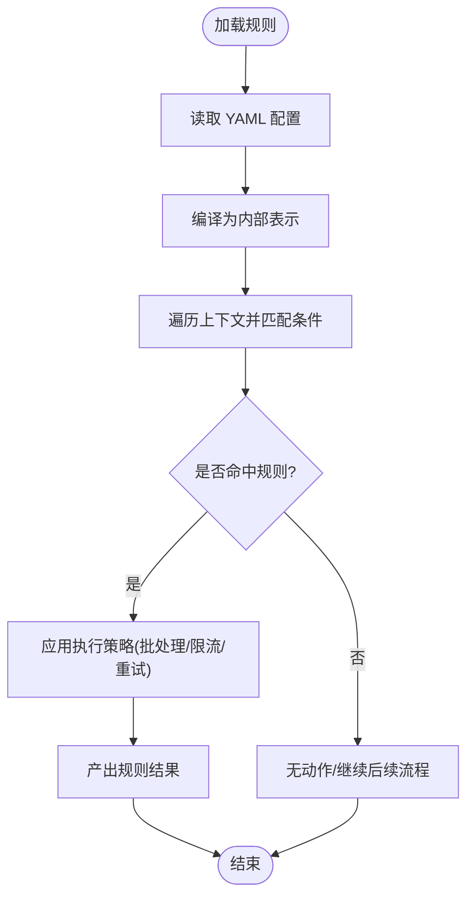
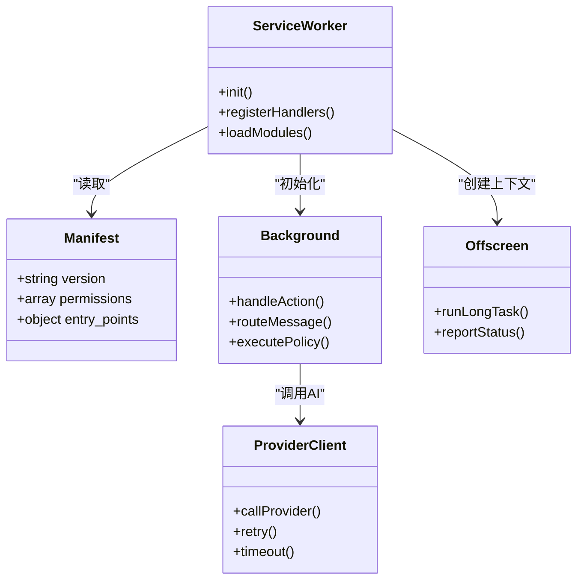
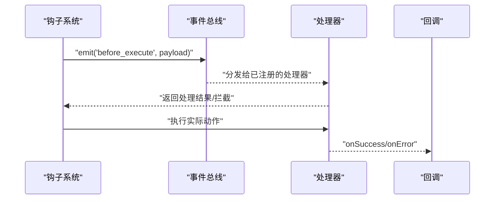
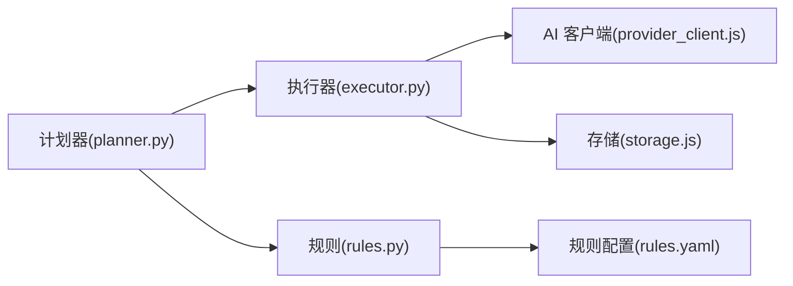
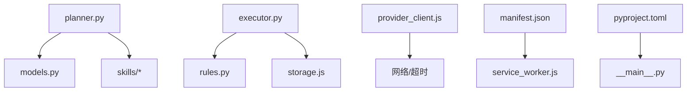

# 插件化架构

<cite>
**本文引用的文件**   
- [README.md](file://README.md)
- [AGENTS.md](file://AGENTS.md)
- [CLAUDE.md](file://CLAUDE.md)
- [pyproject.toml](file://pyproject.toml)
- [config/rules.yaml](file://config/rules.yaml)
- [extension/manifest.json](file://extension/manifest.json)
- [extension/service_worker.js](file://extension/service_worker.js)
- [extension/offscreen.js](file://extension/offscreen.js)
- [extension/background/action_handlers.js](file://extension/background/action_handlers.js)
- [extension/background/job_lifecycle.js](file://extension/background/job_lifecycle.js)
- [extension/background/execution_policy.js](file://extension/background/execution_policy.js)
- [extension/background/message_router.js](file://extension/background/message_router.js)
- [extension/shared/message_protocol.js](file://extension/shared/message_protocol.js)
- [extension/shared/storage.js](file://extension/shared/storage.js)
- [extension/ai/provider_client.js](file://extension/ai/provider_client.js)
- [extension/ai/fast_rules.js](file://extension/ai/fast_rules.js)
- [skills/bookmark-reorg/SKILL.md](file://skills/bookmark-reorg/SKILL.md)
- [skills/bookmark-url-review/SKILL.md](file://skills/bookmark-url-review/SKILL.md)
- [src/bookmark_advisor/__main__.py](file://src/bookmark_advisor/__main__.py)
- [src/bookmark_advisor/cli.py](file://src/bookmark_advisor/cli.py)
- [src/bookmark_advisor/planner.py](file://src/bookmark_advisor/planner.py)
- [src/bookmark_advisor/executor.py](file://src/bookmark_advisor/executor.py)
- [src/bookmark_advisor/rules.py](file://src/bookmark_advisor/rules.py)
- [src/bookmark_advisor/models.py](file://src/bookmark_advisor/models.py)
- [tests/test_rules.py](file://tests/test_rules.py)
</cite>

## 目录
1. [简介](#简介)
2. [项目结构](#项目结构)
3. [核心组件](#核心组件)
4. [架构总览](#架构总览)
5. [详细组件分析](#详细组件分析)
6. [依赖关系分析](#依赖关系分析)
7. [性能考虑](#性能考虑)
8. [故障排查指南](#故障排查指南)
9. [结论](#结论)
10. [附录](#附录)

## 简介
本文件面向 Edge Bookmark 的插件化架构，系统性阐述技能系统、规则引擎、插件加载机制与扩展点设计，并提供自定义技能与规则的开发指南、安全与性能建议以及故障隔离策略。文档以“渐进式复杂度”组织，既适合初学者快速上手，也便于高级用户深入实现与优化。

## 项目结构
Edge Bookmark 采用浏览器扩展（Extension）与 Python 服务（bookmark_advisor）协同的方式：
- 浏览器侧负责 UI、消息路由、任务编排、离线执行与与 AI 提供者交互；
- Python 侧提供计划生成、规则解析与执行等后端能力；
- skills 目录定义可插拔的技能描述（SKILL.md），供多代理协作与计划生成使用；
- config 目录集中管理规则配置（YAML）。

图表来源
- [extension/service_worker.js](file://extension/service_worker.js)
- [extension/offscreen.js](file://extension/offscreen.js)
- [extension/background/action_handlers.js](file://extension/background/action_handlers.js)
- [extension/background/job_lifecycle.js](file://extension/background/job_lifecycle.js)
- [extension/background/execution_policy.js](file://extension/background/execution_policy.js)
- [extension/background/message_router.js](file://extension/background/message_router.js)
- [extension/shared/message_protocol.js](file://extension/shared/message_protocol.js)
- [extension/shared/storage.js](file://extension/shared/storage.js)
- [extension/ai/provider_client.js](file://extension/ai/provider_client.js)
- [extension/ai/fast_rules.js](file://extension/ai/fast_rules.js)
- [extension/manifest.json](file://extension/manifest.json)
- [src/bookmark_advisor/__main__.py](file://src/bookmark_advisor/__main__.py)
- [src/bookmark_advisor/cli.py](file://src/bookmark_advisor/cli.py)
- [src/bookmark_advisor/planner.py](file://src/bookmark_advisor/planner.py)
- [src/bookmark_advisor/executor.py](file://src/bookmark_advisor/executor.py)
- [src/bookmark_advisor/rules.py](file://src/bookmark_advisor/rules.py)
- [src/bookmark_advisor/models.py](file://src/bookmark_advisor/models.py)
- [config/rules.yaml](file://config/rules.yaml)
- [skills/bookmark-reorg/SKILL.md](file://skills/bookmark-reorg/SKILL.md)
- [skills/bookmark-url-review/SKILL.md](file://skills/bookmark-url-review/SKILL.md)

章节来源
- [README.md](file://README.md)
- [AGENTS.md](file://AGENTS.md)
- [CLAUDE.md](file://CLAUDE.md)
- [pyproject.toml](file://pyproject.toml)

## 核心组件
本节聚焦插件化架构的关键构件及其职责边界：
- 技能系统：基于 SKILL.md 的可插拔能力描述，驱动计划生成与多代理协作。
- 规则引擎：通过 YAML 配置声明式规则，支持匹配算法与执行策略。
- 插件加载器：动态发现、依赖解析与版本管理，确保可扩展性与稳定性。
- 扩展点：钩子函数、事件系统与回调机制，贯穿消息路由与任务生命周期。

章节来源
- [skills/bookmark-reorg/SKILL.md](file://skills/bookmark-reorg/SKILL.md)
- [skills/bookmark-url-review/SKILL.md](file://skills/bookmark-url-review/SKILL.md)
- [config/rules.yaml](file://config/rules.yaml)
- [extension/manifest.json](file://extension/manifest.json)
- [extension/background/message_router.js](file://extension/background/message_router.js)
- [extension/background/job_lifecycle.js](file://extension/background/job_lifecycle.js)
- [extension/ai/fast_rules.js](file://extension/ai/fast_rules.js)
- [src/bookmark_advisor/planner.py](file://src/bookmark_advisor/planner.py)
- [src/bookmark_advisor/rules.py](file://src/bookmark_advisor/rules.py)

## 架构总览
下图展示浏览器扩展与 Python 服务之间的交互，以及插件化资源（技能与规则）如何被消费。

图表来源
- [extension/service_worker.js](file://extension/service_worker.js)
- [extension/background/message_router.js](file://extension/background/message_router.js)
- [extension/background/job_lifecycle.js](file://extension/background/job_lifecycle.js)
- [src/bookmark_advisor/__main__.py](file://src/bookmark_advisor/__main__.py)
- [src/bookmark_advisor/planner.py](file://src/bookmark_advisor/planner.py)
- [src/bookmark_advisor/executor.py](file://src/bookmark_advisor/executor.py)
- [src/bookmark_advisor/rules.py](file://src/bookmark_advisor/rules.py)
- [config/rules.yaml](file://config/rules.yaml)
- [skills/bookmark-reorg/SKILL.md](file://skills/bookmark-reorg/SKILL.md)
- [skills/bookmark-url-review/SKILL.md](file://skills/bookmark-url-review/SKILL.md)

## 详细组件分析

### 技能系统（SKILL.md 与多代理协作）
- 设计目标：将领域能力抽象为可插拔的“技能”，由计划器在生成执行计划时按需组合。
- 文件格式要点：每个技能位于独立目录，包含 SKILL.md 作为能力契约，描述输入、输出、前置条件、副作用与适用场景。
- 多代理协作：计划器根据当前上下文选择相关技能，生成步骤序列；执行器按序调用各步骤，必要时跨代理协调。
- 生命周期：发现→解析→验证→缓存→热更新（可选）→卸载。

图表来源
- [skills/bookmark-reorg/SKILL.md](file://skills/bookmark-reorg/SKILL.md)
- [skills/bookmark-url-review/SKILL.md](file://skills/bookmark-url-review/SKILL.md)
- [src/bookmark_advisor/planner.py](file://src/bookmark_advisor/planner.py)
- [src/bookmark_advisor/executor.py](file://src/bookmark_advisor/executor.py)

章节来源
- [skills/bookmark-reorg/SKILL.md](file://skills/bookmark-reorg/SKILL.md)
- [skills/bookmark-url-review/SKILL.md](file://skills/bookmark-url-review/SKILL.md)
- [src/bookmark_advisor/planner.py](file://src/bookmark_advisor/planner.py)
- [src/bookmark_advisor/executor.py](file://src/bookmark_advisor/executor.py)

### 规则引擎（YAML 配置、匹配算法与执行策略）
- 配置语法：YAML 中声明规则集合，每条规则包含标识、条件表达式、动作与优先级等字段。
- 匹配算法：自上而下或带短路逻辑的匹配流程，支持复合条件与上下文变量注入。
- 执行策略：允许对匹配到的规则进行批处理、限流、重试与幂等控制。
- 运行时集成：fast_rules.js 提供前端快速路径，Python rules.py 提供权威解析与校验。

图表来源
- [config/rules.yaml](file://config/rules.yaml)
- [extension/ai/fast_rules.js](file://extension/ai/fast_rules.js)
- [src/bookmark_advisor/rules.py](file://src/bookmark_advisor/rules.py)
- [tests/test_rules.py](file://tests/test_rules.py)

章节来源
- [config/rules.yaml](file://config/rules.yaml)
- [extension/ai/fast_rules.js](file://extension/ai/fast_rules.js)
- [src/bookmark_advisor/rules.py](file://src/bookmark_advisor/rules.py)
- [tests/test_rules.py](file://tests/test_rules.py)

### 插件加载机制（动态加载、依赖解析与版本管理）
- 动态加载：通过 manifest.json 声明扩展入口与权限，service_worker.js 启动后按需加载 background 与 offscreen 模块。
- 依赖解析：模块间通过 shared 协议与存储接口解耦，避免硬耦合；AI 客户端通过 provider_client.js 统一接入外部服务。
- 版本管理：manifest.json 指定版本号与兼容性范围；Python 包通过 pyproject.toml 管理依赖与入口点。

图表来源
- [extension/manifest.json](file://extension/manifest.json)
- [extension/service_worker.js](file://extension/service_worker.js)
- [extension/background/action_handlers.js](file://extension/background/action_handlers.js)
- [extension/background/message_router.js](file://extension/background/message_router.js)
- [extension/offscreen.js](file://extension/offscreen.js)
- [extension/ai/provider_client.js](file://extension/ai/provider_client.js)
- [pyproject.toml](file://pyproject.toml)

章节来源
- [extension/manifest.json](file://extension/manifest.json)
- [extension/service_worker.js](file://extension/service_worker.js)
- [extension/background/action_handlers.js](file://extension/background/action_handlers.js)
- [extension/background/message_router.js](file://extension/background/message_router.js)
- [extension/offscreen.js](file://extension/offscreen.js)
- [extension/ai/provider_client.js](file://extension/ai/provider_client.js)
- [pyproject.toml](file://pyproject.toml)

### 扩展点设计（钩子、事件与回调）
- 钩子函数：在关键生命周期节点（如任务创建、执行前/后、失败恢复）暴露钩子，允许插件注入行为。
- 事件系统：基于消息协议（message_protocol.js）的事件总线，支持订阅/发布模式，降低模块耦合。
- 回调机制：异步任务完成后通过回调或 Promise 链回传结果，保证 UI 与服务端状态一致。

图表来源
- [extension/background/message_router.js](file://extension/background/message_router.js)
- [extension/shared/message_protocol.js](file://extension/shared/message_protocol.js)
- [extension/background/job_lifecycle.js](file://extension/background/job_lifecycle.js)

章节来源
- [extension/background/message_router.js](file://extension/background/message_router.js)
- [extension/shared/message_protocol.js](file://extension/shared/message_protocol.js)
- [extension/background/job_lifecycle.js](file://extension/background/job_lifecycle.js)

### 自定义技能开发指南
- 目录结构：在 skills 下新建目录，放置 SKILL.md 描述能力契约。
- 元数据规范：明确输入参数、输出格式、前置条件、副作用、适用场景与依赖。
- 测试方法：编写单元测试覆盖解析与验证路径；结合端到端用例验证计划生成与执行。
- 部署流程：将新技能目录纳入版本控制，重启扩展或服务即可生效。

章节来源
- [skills/bookmark-reorg/SKILL.md](file://skills/bookmark-reorg/SKILL.md)
- [skills/bookmark-url-review/SKILL.md](file://skills/bookmark-url-review/SKILL.md)
- [src/bookmark_advisor/planner.py](file://src/bookmark_advisor/planner.py)
- [tests/test_rules.py](file://tests/test_rules.py)

### 自定义规则开发指南
- 配置模板：在 config/rules.yaml 新增规则条目，遵循字段约定（标识、条件、动作、优先级）。
- 匹配算法：理解自上而下匹配与短路逻辑，合理设置优先级以避免冲突。
- 执行策略：启用批处理、限流与重试，确保幂等与可观测性。
- 测试方法：使用 tests/test_rules.py 中的断言范式验证规则匹配与策略执行。

章节来源
- [config/rules.yaml](file://config/rules.yaml)
- [extension/ai/fast_rules.js](file://extension/ai/fast_rules.js)
- [src/bookmark_advisor/rules.py](file://src/bookmark_advisor/rules.py)
- [tests/test_rules.py](file://tests/test_rules.py)

### 多代理协作机制
- 角色划分：计划器负责决策，执行器负责调度，规则引擎负责约束，AI 客户端负责外部模型调用。
- 通信协议：通过共享消息协议与存储接口传递上下文与中间结果。
- 容错与恢复：失败重试、超时控制与状态回滚，保障长任务稳定运行。

图表来源
- [src/bookmark_advisor/planner.py](file://src/bookmark_advisor/planner.py)
- [src/bookmark_advisor/executor.py](file://src/bookmark_advisor/executor.py)
- [src/bookmark_advisor/rules.py](file://src/bookmark_advisor/rules.py)
- [extension/ai/provider_client.js](file://extension/ai/provider_client.js)
- [extension/shared/storage.js](file://extension/shared/storage.js)
- [config/rules.yaml](file://config/rules.yaml)

章节来源
- [src/bookmark_advisor/planner.py](file://src/bookmark_advisor/planner.py)
- [src/bookmark_advisor/executor.py](file://src/bookmark_advisor/executor.py)
- [src/bookmark_advisor/rules.py](file://src/bookmark_advisor/rules.py)
- [extension/ai/provider_client.js](file://extension/ai/provider_client.js)
- [extension/shared/storage.js](file://extension/shared/storage.js)
- [config/rules.yaml](file://config/rules.yaml)

## 依赖关系分析
- 模块内聚与耦合：background 模块通过 message_router.js 与 shared 协议解耦；AI 客户端封装外部依赖，降低耦合度。
- 直接/间接依赖：planner 依赖 skills 与 models；executor 依赖 rules 与 storage；provider_client 依赖网络与超时控制。
- 外部依赖：Python 包依赖通过 pyproject.toml 管理；浏览器扩展依赖通过 manifest.json 声明。

图表来源
- [src/bookmark_advisor/planner.py](file://src/bookmark_advisor/planner.py)
- [src/bookmark_advisor/models.py](file://src/bookmark_advisor/models.py)
- [src/bookmark_advisor/executor.py](file://src/bookmark_advisor/executor.py)
- [src/bookmark_advisor/rules.py](file://src/bookmark_advisor/rules.py)
- [extension/shared/storage.js](file://extension/shared/storage.js)
- [extension/ai/provider_client.js](file://extension/ai/provider_client.js)
- [extension/manifest.json](file://extension/manifest.json)
- [extension/service_worker.js](file://extension/service_worker.js)
- [pyproject.toml](file://pyproject.toml)
- [src/bookmark_advisor/__main__.py](file://src/bookmark_advisor/__main__.py)

章节来源
- [src/bookmark_advisor/planner.py](file://src/bookmark_advisor/planner.py)
- [src/bookmark_advisor/executor.py](file://src/bookmark_advisor/executor.py)
- [src/bookmark_advisor/rules.py](file://src/bookmark_advisor/rules.py)
- [extension/manifest.json](file://extension/manifest.json)
- [extension/service_worker.js](file://extension/service_worker.js)
- [pyproject.toml](file://pyproject.toml)

## 性能考虑
- 规则匹配优化：优先使用 fast_rules.js 的前端快速路径，减少往返开销；对复杂规则进行预编译与缓存。
- 批量与限流：对高并发任务启用批处理与速率限制，避免阻塞主线程与过载外部服务。
- 内存与存储：及时释放大对象引用，使用持久化存储保存中间状态，避免重复计算。
- 超时与重试：为外部调用设置合理超时与退避策略，提升鲁棒性。

[本节为通用指导，不直接分析具体文件]

## 故障排查指南
- 常见问题定位：检查 manifest.json 权限与入口点是否正确；确认 service_worker.js 是否成功初始化；核对消息路由注册是否生效。
- 日志与诊断：利用 job_lifecycle.js 的生命周期钩子输出关键状态；在 rules.py 与 fast_rules.js 中添加匹配日志以便追踪。
- 恢复策略：失败任务自动重试与回滚；对不可恢复错误进行告警与降级处理。

章节来源
- [extension/manifest.json](file://extension/manifest.json)
- [extension/service_worker.js](file://extension/service_worker.js)
- [extension/background/message_router.js](file://extension/background/message_router.js)
- [extension/background/job_lifecycle.js](file://extension/background/job_lifecycle.js)
- [src/bookmark_advisor/rules.py](file://src/bookmark_advisor/rules.py)
- [extension/ai/fast_rules.js](file://extension/ai/fast_rules.js)

## 结论
Edge Bookmark 的插件化架构通过清晰的职责分离、声明式规则与可插拔技能，实现了高扩展性与可维护性。借助消息路由、事件系统与钩子机制，系统在保持低耦合的同时提供了强大的定制能力。配合完善的测试与安全策略，可在生产环境中稳定运行并持续演进。

[本节为总结性内容，不直接分析具体文件]

## 附录
- 术语表：
  - 技能（Skill）：以 SKILL.md 描述的能力单元，用于计划生成与执行。
  - 规则（Rule）：以 YAML 声明的条件与动作集合，用于约束与增强执行流程。
  - 扩展点（Extension Point）：钩子、事件与回调构成的可插拔接口。
- 参考文件：
  - 扩展清单与入口：[extension/manifest.json](file://extension/manifest.json)、[extension/service_worker.js](file://extension/service_worker.js)
  - 规则与配置：[config/rules.yaml](file://config/rules.yaml)、[src/bookmark_advisor/rules.py](file://src/bookmark_advisor/rules.py)
  - 计划与执行：[src/bookmark_advisor/planner.py](file://src/bookmark_advisor/planner.py)、[src/bookmark_advisor/executor.py](file://src/bookmark_advisor/executor.py)
  - 技能示例：[skills/bookmark-reorg/SKILL.md](file://skills/bookmark-reorg/SKILL.md)、[skills/bookmark-url-review/SKILL.md](file://skills/bookmark-url-review/SKILL.md)

[本节为补充信息，不直接分析具体文件]