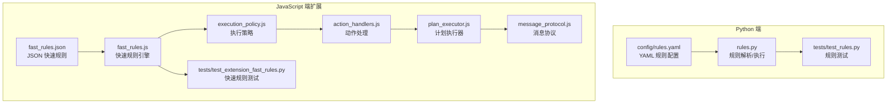
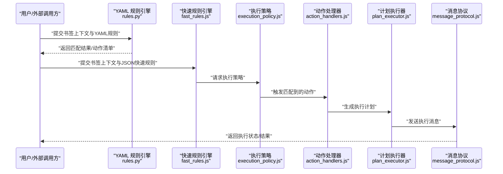
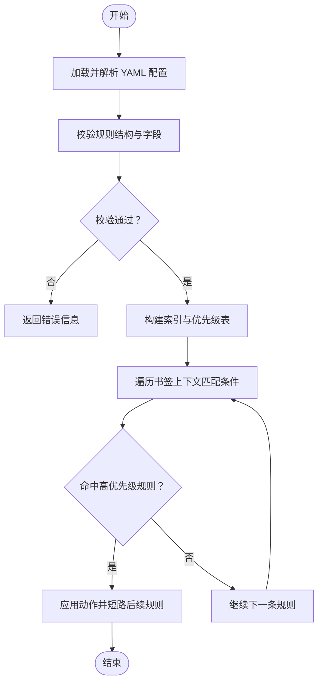
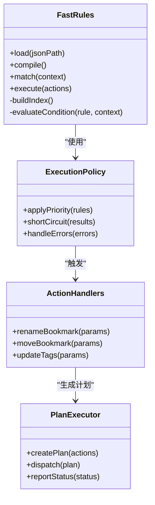
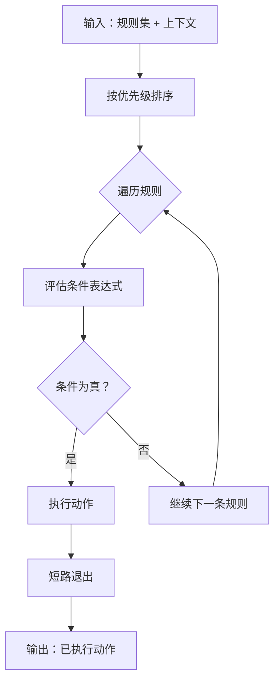
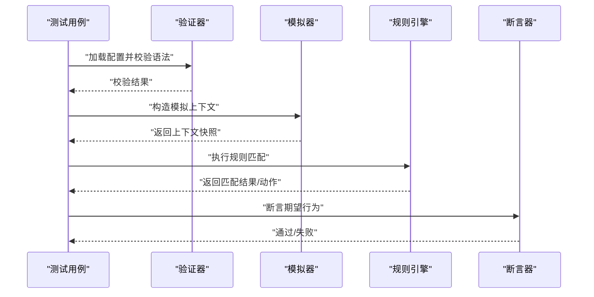
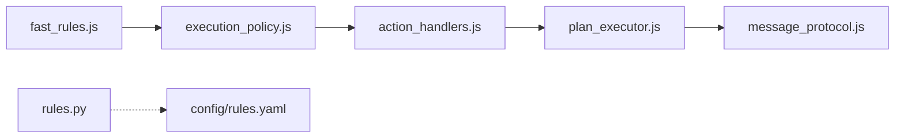

# 规则引擎

<cite>
**本文引用的文件**   
- [config/rules.yaml](file://config/rules.yaml)
- [extension/fast_rules.json](file://extension/fast_rules.json)
- [extension/ai/fast_rules.js](file://extension/ai/fast_rules.js)
- [src/bookmark_advisor/rules.py](file://src/bookmark_advisor/rules.py)
- [tests/test_rules.py](file://tests/test_rules.py)
- [tests/test_extension_fast_rules.py](file://tests/test_extension_fast_rules.py)
- [extension/background/execution_policy.js](file://extension/background/execution_policy.js)
- [extension/background/action_handlers.js](file://extension/background/action_handlers.js)
- [extension/background/plan_executor.js](file://extension/background/plan_executor.js)
- [extension/shared/message_protocol.js](file://extension/shared/message_protocol.js)
</cite>

## 目录
1. [简介](#简介)
2. [项目结构](#项目结构)
3. [核心组件](#核心组件)
4. [架构总览](#架构总览)
5. [详细组件分析](#详细组件分析)
6. [依赖分析](#依赖分析)
7. [性能考虑](#性能考虑)
8. [故障排查指南](#故障排查指南)
9. [结论](#结论)
10. [附录](#附录)

## 简介
本文件为 Edge Bookmark 的规则引擎提供系统化文档，覆盖以下方面：
- YAML 配置语法规范（规则定义、条件表达式、动作配置、变量引用）
- 规则匹配算法（优先级排序、短路逻辑、性能优化）
- 快速规则系统（JSON 格式、预编译机制、运行时执行）
- 规则验证与测试框架（语法检查、模拟执行、断言验证）
- 自定义规则开发指南（最佳实践、调试技巧、性能调优）
- 版本管理、向后兼容性与迁移策略

## 项目结构
规则引擎在仓库中由多语言实现共同构成：
- Python 侧负责规则解析、校验与执行（服务端/CLI 场景）
- JavaScript 侧提供浏览器扩展中的“快速规则”能力（JSON 格式、预编译与运行）
- 配置文件分别以 YAML（Python 侧）和 JSON（JS 侧）形式维护
- 测试覆盖两端实现，确保行为一致性与回归安全

**图表来源**
- [src/bookmark_advisor/rules.py](file://src/bookmark_advisor/rules.py)
- [config/rules.yaml](file://config/rules.yaml)
- [extension/ai/fast_rules.js](file://extension/ai/fast_rules.js)
- [extension/fast_rules.json](file://extension/fast_rules.json)
- [extension/background/execution_policy.js](file://extension/background/execution_policy.js)
- [extension/background/action_handlers.js](file://extension/background/action_handlers.js)
- [extension/background/plan_executor.js](file://extension/background/plan_executor.js)
- [extension/shared/message_protocol.js](file://extension/shared/message_protocol.js)
- [tests/test_rules.py](file://tests/test_rules.py)
- [tests/test_extension_fast_rules.py](file://tests/test_extension_fast_rules.py)

**章节来源**
- [config/rules.yaml](file://config/rules.yaml)
- [extension/fast_rules.json](file://extension/fast_rules.json)
- [extension/ai/fast_rules.js](file://extension/ai/fast_rules.js)
- [src/bookmark_advisor/rules.py](file://src/bookmark_advisor/rules.py)
- [tests/test_rules.py](file://tests/test_rules.py)
- [tests/test_extension_fast_rules.py](file://tests/test_extension_fast_rules.py)

## 核心组件
- YAML 规则配置（Python 侧）
  - 用于声明式地定义规则集合、条件与动作，便于人类阅读与维护。
  - 典型字段包括：规则标识、描述、优先级、条件表达式、动作列表、变量映射等。
- 快速规则系统（JS 侧）
  - 使用 JSON 定义轻量级规则，支持预编译与高效匹配，适合浏览器扩展的高频调用场景。
  - 包含规则加载、缓存、匹配、短路执行与结果回传。
- 规则执行策略
  - 统一调度入口，负责按优先级排序、短路判断、错误隔离与日志记录。
- 动作处理器
  - 将规则匹配结果转换为具体操作（如书签重命名、移动、标签变更等）。
- 计划执行器与消息协议
  - 将规则动作编排为可执行的计划，并通过消息协议与 UI/后台通信。

**章节来源**
- [src/bookmark_advisor/rules.py](file://src/bookmark_advisor/rules.py)
- [extension/ai/fast_rules.js](file://extension/ai/fast_rules.js)
- [extension/background/execution_policy.js](file://extension/background/execution_policy.js)
- [extension/background/action_handlers.js](file://extension/background/action_handlers.js)
- [extension/background/plan_executor.js](file://extension/background/plan_executor.js)
- [extension/shared/message_protocol.js](file://extension/shared/message_protocol.js)

## 架构总览
规则引擎采用“双通道”架构：
- YAML 通道：面向复杂业务与离线批处理，强调可读性与灵活性。
- JSON 快速规则通道：面向高频实时匹配，强调低延迟与高吞吐。

**图表来源**
- [src/bookmark_advisor/rules.py](file://src/bookmark_advisor/rules.py)
- [extension/ai/fast_rules.js](file://extension/ai/fast_rules.js)
- [extension/background/execution_policy.js](file://extension/background/execution_policy.js)
- [extension/background/action_handlers.js](file://extension/background/action_handlers.js)
- [extension/background/plan_executor.js](file://extension/background/plan_executor.js)
- [extension/shared/message_protocol.js](file://extension/shared/message_protocol.js)

## 详细组件分析

### YAML 规则配置语法规范
- 规则定义
  - 每个规则包含唯一标识、描述、优先级、条件表达式、动作列表与可选变量映射。
  - 优先级用于决定匹配顺序；数值越小通常表示越高优先级（具体以实现为准）。
- 条件表达式
  - 支持对书签属性进行布尔组合与比较，例如名称、URL、标签、路径等。
  - 表达式应幂等且无副作用，避免访问外部资源。
- 动作配置
  - 动作类型包括重命名、移动、添加/移除标签、设置标记等。
  - 动作参数通过变量引用注入，支持从上下文或规则变量中取值。
- 变量引用
  - 变量来源包括：书签上下文、全局常量、函数计算结果。
  - 引用方式需明确作用域，避免冲突与未定义错误。

**图表来源**
- [src/bookmark_advisor/rules.py](file://src/bookmark_advisor/rules.py)
- [config/rules.yaml](file://config/rules.yaml)

**章节来源**
- [config/rules.yaml](file://config/rules.yaml)
- [src/bookmark_advisor/rules.py](file://src/bookmark_advisor/rules.py)

### 快速规则系统（JSON 格式、预编译与运行时）
- JSON 格式定义
  - 规则数组，每条规则包含 id、name、priority、condition、actions 等字段。
  - condition 使用简洁的键值匹配或正则表达式；actions 指定目标操作与参数。
- 预编译机制
  - 启动时加载 JSON 规则，进行语法校验、常量折叠与索引构建。
  - 将条件表达式编译为可快速评估的结构，减少运行时开销。
- 运行时执行
  - 接收书签上下文，按优先级顺序匹配，命中后执行动作并短路。
  - 支持批量处理与并发控制，保证扩展响应性。

**图表来源**
- [extension/ai/fast_rules.js](file://extension/ai/fast_rules.js)
- [extension/background/execution_policy.js](file://extension/background/execution_policy.js)
- [extension/background/action_handlers.js](file://extension/background/action_handlers.js)
- [extension/background/plan_executor.js](file://extension/background/plan_executor.js)

**章节来源**
- [extension/fast_rules.json](file://extension/fast_rules.json)
- [extension/ai/fast_rules.js](file://extension/ai/fast_rules.js)
- [extension/background/execution_policy.js](file://extension/background/execution_policy.js)
- [extension/background/action_handlers.js](file://extension/background/action_handlers.js)
- [extension/background/plan_executor.js](file://extension/background/plan_executor.js)

### 规则匹配算法（优先级、短路与优化）
- 优先级排序
  - 所有规则按优先级升序排列，先匹配高优先级规则。
  - 若存在相同优先级，可按定义顺序或稳定排序策略执行。
- 短路逻辑
  - 一旦某条规则命中并成功执行动作，立即停止后续规则匹配。
  - 短路可减少不必要的条件评估与动作执行，提升整体性能。
- 性能优化策略
  - 预编译与索引：将常用条件编译为快速路径，建立属性到规则的倒排索引。
  - 惰性求值：仅在必要时计算变量与表达式，避免昂贵操作。
  - 批量匹配：对一批书签上下文进行向量化或并行评估。
  - 错误隔离：单条规则失败不影响其他规则执行，记录错误并继续。

**图表来源**
- [src/bookmark_advisor/rules.py](file://src/bookmark_advisor/rules.py)
- [extension/ai/fast_rules.js](file://extension/ai/fast_rules.js)
- [extension/background/execution_policy.js](file://extension/background/execution_policy.js)

**章节来源**
- [src/bookmark_advisor/rules.py](file://src/bookmark_advisor/rules.py)
- [extension/ai/fast_rules.js](file://extension/ai/fast_rules.js)
- [extension/background/execution_policy.js](file://extension/background/execution_policy.js)

### 规则验证与测试框架
- 语法检查
  - YAML：校验必填字段、类型约束与作用域合法性。
  - JSON：校验 schema、条件表达式与动作参数完整性。
- 模拟执行
  - 提供沙箱环境，注入模拟书签上下文与变量，避免真实副作用。
- 断言验证
  - 针对预期匹配结果、动作序列与最终状态进行断言。
  - 覆盖边界用例（空上下文、缺失字段、非法表达式等）。

**图表来源**
- [tests/test_rules.py](file://tests/test_rules.py)
- [tests/test_extension_fast_rules.py](file://tests/test_extension_fast_rules.py)

**章节来源**
- [tests/test_rules.py](file://tests/test_rules.py)
- [tests/test_extension_fast_rules.py](file://tests/test_extension_fast_rules.py)

### 自定义规则开发指南
- 编写最佳实践
  - 保持条件表达式纯函数化，避免外部依赖与副作用。
  - 合理拆分规则粒度，提高复用性与可维护性。
  - 使用明确的变量命名与作用域，避免冲突。
- 调试技巧
  - 启用详细日志，记录每次匹配的上下文与中间结果。
  - 使用最小复现用例定位问题，逐步缩小范围。
- 性能调优
  - 优先使用精确匹配而非正则，减少计算开销。
  - 合并相似规则，利用短路逻辑减少不必要评估。
  - 定期审查规则数量与复杂度，清理废弃规则。

**章节来源**
- [src/bookmark_advisor/rules.py](file://src/bookmark_advisor/rules.py)
- [extension/ai/fast_rules.js](file://extension/ai/fast_rules.js)

### 版本管理、向后兼容性与迁移策略
- 版本管理
  - 为规则配置引入版本号，区分不同语义与行为。
  - 在元数据中记录变更摘要与影响范围。
- 向后兼容性
  - 新增字段默认值应安全，避免破坏旧规则。
  - 废弃字段保留一段时间并提供警告提示。
- 迁移策略
  - 提供自动迁移脚本，将旧版规则转换为新版结构。
  - 在升级前进行预检与回滚预案，确保平滑过渡。

[本节为通用指导，不直接分析具体文件]

## 依赖分析
- 模块耦合
  - fast_rules.js 依赖 execution_policy.js 与 action_handlers.js，形成清晰的分层。
  - rules.py 作为独立库，被 CLI 与服务端调用，降低耦合度。
- 外部集成点
  - message_protocol.js 负责与 UI/后台通信，解耦业务逻辑与传输细节。
  - plan_executor.js 将动作编排为可执行计划，便于异步与重试。
- 潜在循环依赖
  - 当前分层清晰，未见明显循环依赖；建议持续监控导入关系。

**图表来源**
- [extension/ai/fast_rules.js](file://extension/ai/fast_rules.js)
- [extension/background/execution_policy.js](file://extension/background/execution_policy.js)
- [extension/background/action_handlers.js](file://extension/background/action_handlers.js)
- [extension/background/plan_executor.js](file://extension/background/plan_executor.js)
- [extension/shared/message_protocol.js](file://extension/shared/message_protocol.js)
- [src/bookmark_advisor/rules.py](file://src/bookmark_advisor/rules.py)
- [config/rules.yaml](file://config/rules.yaml)

**章节来源**
- [extension/ai/fast_rules.js](file://extension/ai/fast_rules.js)
- [extension/background/execution_policy.js](file://extension/background/execution_policy.js)
- [extension/background/action_handlers.js](file://extension/background/action_handlers.js)
- [extension/background/plan_executor.js](file://extension/background/plan_executor.js)
- [extension/shared/message_protocol.js](file://extension/shared/message_protocol.js)
- [src/bookmark_advisor/rules.py](file://src/bookmark_advisor/rules.py)
- [config/rules.yaml](file://config/rules.yaml)

## 性能考虑
- 预编译与索引：在启动阶段完成规则解析与索引构建，减少运行时开销。
- 短路执行：命中即停，避免多余评估与动作执行。
- 批量处理：对大量书签上下文进行批处理，提升吞吐。
- 错误隔离：单条规则失败不影响整体流程，保障稳定性。
- 资源限制：限制正则复杂度与变量计算深度，防止恶意或低效规则拖慢系统。

[本节为通用指导，不直接分析具体文件]

## 故障排查指南
- 常见问题
  - 规则未生效：检查优先级与短路逻辑，确认是否被更高优先级规则拦截。
  - 动作未执行：验证动作参数与变量引用是否正确，查看执行日志。
  - 性能退化：审查规则复杂度与数量，优化条件表达式与索引。
- 调试步骤
  - 启用详细日志，捕获上下文快照与中间结果。
  - 使用最小复现实例逐步验证，定位问题根因。
  - 对比 YAML 与 JSON 规则行为一致性，确保两端实现对齐。

**章节来源**
- [tests/test_rules.py](file://tests/test_rules.py)
- [tests/test_extension_fast_rules.py](file://tests/test_extension_fast_rules.py)

## 结论
Edge Bookmark 的规则引擎通过 YAML 与 JSON 双通道满足复杂与高性能场景需求。清晰的架构分层、严格的验证与测试、完善的性能优化策略，使其具备良好的可扩展性与可维护性。遵循本文档的最佳实践与迁移策略，可进一步提升规则质量与系统稳定性。

[本节为总结性内容，不直接分析具体文件]

## 附录
- 术语表
  - 规则：一组条件与动作的声明式定义。
  - 上下文：书签的属性集合，用于条件评估。
  - 动作：对书签执行的具体操作。
  - 短路：命中规则后立即停止后续匹配。
- 参考实现路径
  - YAML 规则解析与执行：[src/bookmark_advisor/rules.py](file://src/bookmark_advisor/rules.py)
  - 快速规则加载与运行：[extension/ai/fast_rules.js](file://extension/ai/fast_rules.js)
  - 执行策略与动作处理：[extension/background/execution_policy.js](file://extension/background/execution_policy.js)、[extension/background/action_handlers.js](file://extension/background/action_handlers.js)
  - 计划执行与消息协议：[extension/background/plan_executor.js](file://extension/background/plan_executor.js)、[extension/shared/message_protocol.js](file://extension/shared/message_protocol.js)