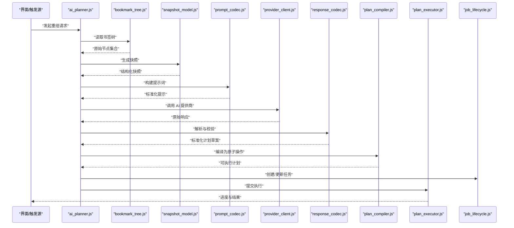
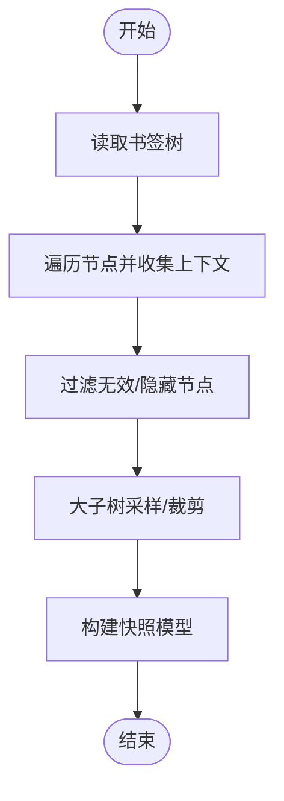
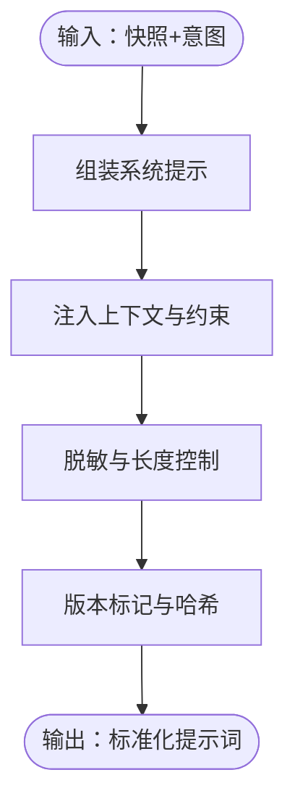
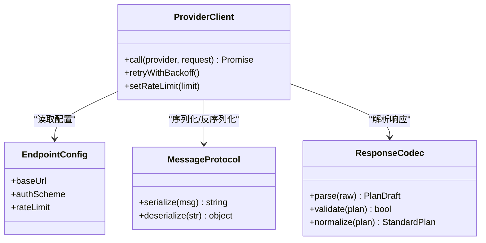
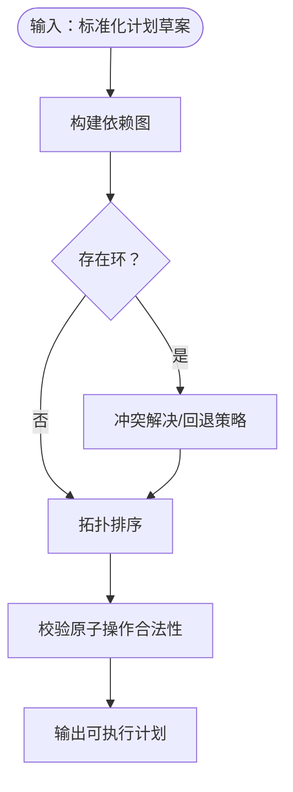
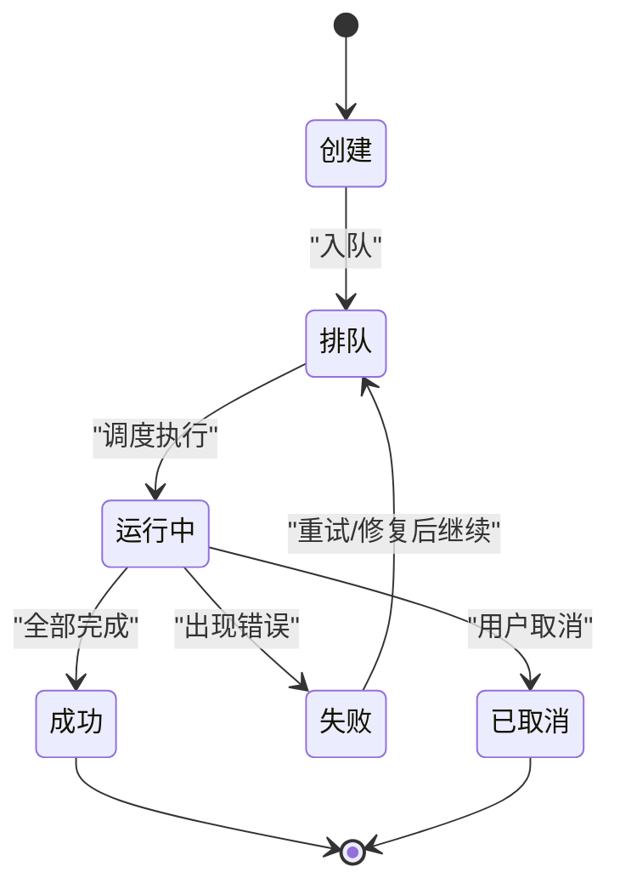
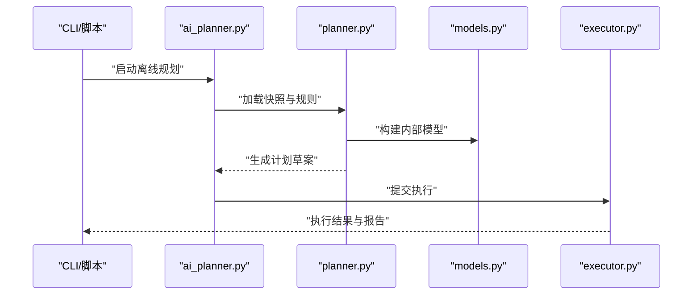
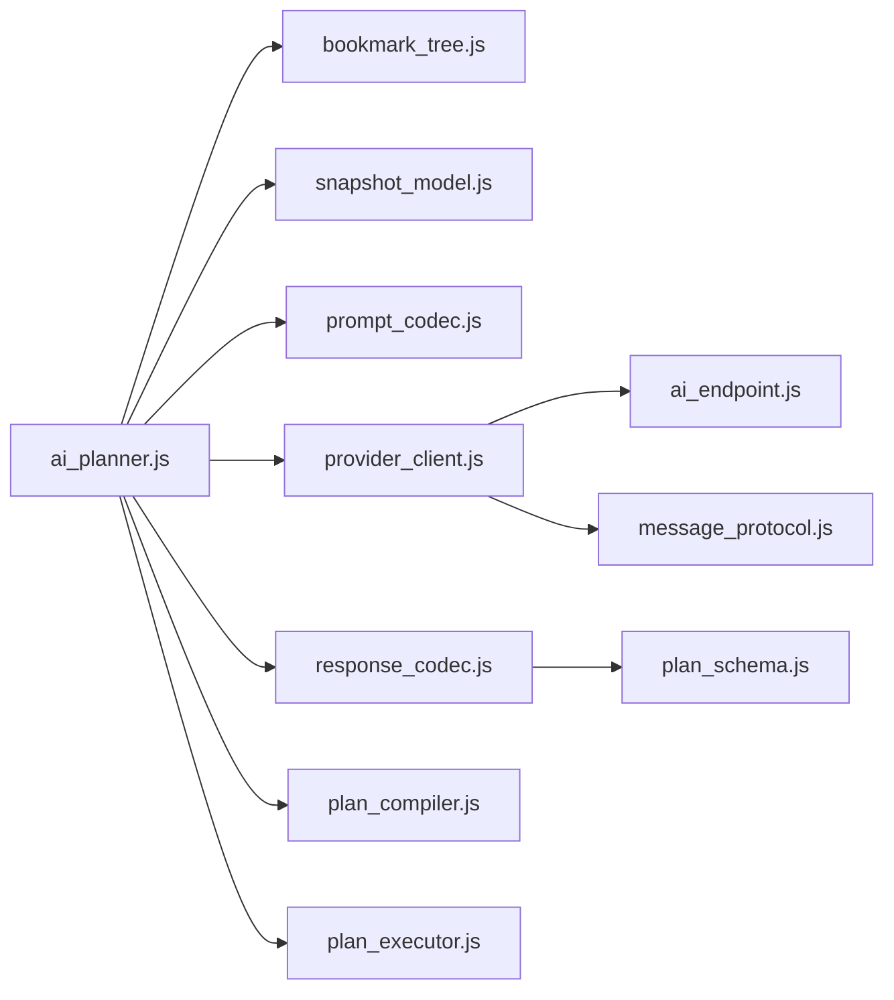

# AI 规划流

<cite>
**本文引用的文件**   
- [ai_planner.js](file://extension/ai_planner.js)
- [plan_compiler.js](file://extension/ai/plan_compiler.js)
- [provider_client.js](file://extension/ai/provider_client.js)
- [response_codec.js](file://extension/ai/response_codec.js)
- [prompt_codec.js](file://extension/ai/prompt_codec.js)
- [snapshot_model.js](file://extension/ai/snapshot_model.js)
- [bookmark_tree.js](file://extension/background/bookmark_tree.js)
- [bookmark_api.js](file://extension/background/bookmark_api.js)
- [plan_executor.js](file://extension/background/plan_executor.js)
- [job_lifecycle.js](file://extension/background/job_lifecycle.js)
- [message_protocol.js](file://extension/shared/message_protocol.js)
- [plan_schema.js](file://extension/shared/plan_schema.js)
- [ai_endpoint.js](file://extension/shared/ai_endpoint.js)
- [ai_planner.py](file://src/bookmark_advisor/ai_planner.py)
- [planner.py](file://src/bookmark_advisor/planner.py)
- [models.py](file://src/bookmark_advisor/models.py)
- [executor.py](file://src/bookmark_advisor/executor.py)
</cite>

## 目录
1. [简介](#简介)
2. [项目结构](#项目结构)
3. [核心组件](#核心组件)
4. [架构总览](#架构总览)
5. [详细组件分析](#详细组件分析)
6. [依赖关系分析](#依赖关系分析)
7. [性能考虑](#性能考虑)
8. [故障排查指南](#故障排查指南)
9. [结论](#结论)
10. [附录](#附录)

## 简介
本文件面向“AI 规划流”的数据流与处理链路，聚焦从书签状态分析到智能重组计划生成的完整过程。内容覆盖：
- 书签树结构提取与上下文信息收集
- 提示词构建与优化（含快照模型）
- 多 AI 提供商的响应处理（解析、验证、标准化）
- 计划编译与执行步骤分解算法（高层意图到原子操作序列）
- 缓存策略、重试机制与错误恢复
- 数据模型转换示例与性能优化建议

## 项目结构
本项目包含浏览器扩展端与 Python 服务端两部分，围绕“AI 规划流”的关键路径如下：
- 扩展侧负责采集书签树、构造提示词、调用 AI 提供商、解析并校验响应、编译为可执行计划、调度执行与回滚。
- Python 侧提供离线分析与计划生成能力，用于批处理或本地调试。

```mermaid
graph TB
subgraph "扩展端"
BT["bookmark_tree.js<br/>书签树提取"]
SM["snapshot_model.js<br/>快照模型"]
PC["prompt_codec.js<br/>提示词编解码"]
PRV["provider_client.js<br/>多提供商客户端"]
RC["response_codec.js<br/>响应编解码"]
PLC["plan_compiler.js<br/>计划编译器"]
PEX["plan_executor.js<br/>计划执行器"]
JLC["job_lifecycle.js<br/>任务生命周期"]
BAPI["bookmark_api.js<br/>书签 API 封装"]
end
subgraph "共享协议与模式"
MSG["message_protocol.js<br/>消息协议"]
SCHEMA["plan_schema.js<br/>计划模式"]
EP["ai_endpoint.js<br/>端点配置"]
end
subgraph "Python 服务"
APY["ai_planner.py<br/>AI 规划入口"]
PYPLN["planner.py<br/>规划逻辑"]
MODELS["models.py<br/>数据模型"]
EXE["executor.py<br/>执行器"]
end
BT --> SM --> PC --> PRV --> RC --> PLC --> PEX
JLC --> PEX
BAPI --> PEX
MSG < --> PRV
SCHEMA < --> RC
EP < --> PRV
APY --> PYPLN --> MODELS
PYPLN --> EXE
```

图表来源
- [bookmark_tree.js:1-200](file://extension/background/bookmark_tree.js#L1-L200)
- [snapshot_model.js:1-200](file://extension/ai/snapshot_model.js#L1-L200)
- [prompt_codec.js:1-200](file://extension/ai/prompt_codec.js#L1-L200)
- [provider_client.js:1-200](file://extension/ai/provider_client.js#L1-L200)
- [response_codec.js:1-200](file://extension/ai/response_codec.js#L1-L200)
- [plan_compiler.js:1-200](file://extension/ai/plan_compiler.js#L1-L200)
- [plan_executor.js:1-200](file://extension/background/plan_executor.js#L1-L200)
- [job_lifecycle.js:1-200](file://extension/background/job_lifecycle.js#L1-L200)
- [bookmark_api.js:1-200](file://extension/background/bookmark_api.js#L1-L200)
- [message_protocol.js:1-200](file://extension/shared/message_protocol.js#L1-L200)
- [plan_schema.js:1-200](file://extension/shared/plan_schema.js#L1-L200)
- [ai_endpoint.js:1-200](file://extension/shared/ai_endpoint.js#L1-L200)
- [ai_planner.py:1-200](file://src/bookmark_advisor/ai_planner.py#L1-L200)
- [planner.py:1-200](file://src/bookmark_advisor/planner.py#L1-L200)
- [models.py:1-200](file://src/bookmark_advisor/models.py#L1-L200)
- [executor.py:1-200](file://src/bookmark_advisor/executor.py#L1-L200)

章节来源
- [ai_planner.js:1-200](file://extension/ai_planner.js#L1-L200)
- [plan_compiler.js:1-200](file://extension/ai/plan_compiler.js#L1-L200)
- [provider_client.js:1-200](file://extension/ai/provider_client.js#L1-L200)
- [response_codec.js:1-200](file://extension/ai/response_codec.js#L1-L200)
- [prompt_codec.js:1-200](file://extension/ai/prompt_codec.js#L1-L200)
- [snapshot_model.js:1-200](file://extension/ai/snapshot_model.js#L1-L200)
- [bookmark_tree.js:1-200](file://extension/background/bookmark_tree.js#L1-L200)
- [bookmark_api.js:1-200](file://extension/background/bookmark_api.js#L1-L200)
- [plan_executor.js:1-200](file://extension/background/plan_executor.js#L1-L200)
- [job_lifecycle.js:1-200](file://extension/background/job_lifecycle.js#L1-L200)
- [message_protocol.js:1-200](file://extension/shared/message_protocol.js#L1-L200)
- [plan_schema.js:1-200](file://extension/shared/plan_schema.js#L1-L200)
- [ai_endpoint.js:1-200](file://extension/shared/ai_endpoint.js#L1-L200)
- [ai_planner.py:1-200](file://src/bookmark_advisor/ai_planner.py#L1-L200)
- [planner.py:1-200](file://src/bookmark_advisor/planner.py#L1-L200)
- [models.py:1-200](file://src/bookmark_advisor/models.py#L1-L200)
- [executor.py:1-200](file://src/bookmark_advisor/executor.py#L1-L200)

## 核心组件
- 书签树提取与快照：将浏览器书签树转换为结构化快照，过滤冗余字段，保留层级、标签、URL、访问统计等关键上下文。
- 提示词构建：基于快照与用户意图，组装系统提示、约束与输出格式要求，确保模型稳定返回结构化计划。
- 多提供商客户端：统一抽象不同 AI 提供商的接口差异，支持并发、限流、重试与超时控制。
- 响应编解码：对模型返回进行解析、校验与标准化，兼容多种 JSON 结构与字段命名。
- 计划编译器：将高层重组意图编译为可执行的原子操作序列，并进行依赖排序与冲突检测。
- 计划执行器：按顺序执行原子操作，记录日志、支持回滚与断点续跑。
- 任务生命周期：管理任务的创建、调度、状态推进与持久化。

章节来源
- [bookmark_tree.js:1-200](file://extension/background/bookmark_tree.js#L1-L200)
- [snapshot_model.js:1-200](file://extension/ai/snapshot_model.js#L1-L200)
- [prompt_codec.js:1-200](file://extension/ai/prompt_codec.js#L1-L200)
- [provider_client.js:1-200](file://extension/ai/provider_client.js#L1-L200)
- [response_codec.js:1-200](file://extension/ai/response_codec.js#L1-L200)
- [plan_compiler.js:1-200](file://extension/ai/plan_compiler.js#L1-L200)
- [plan_executor.js:1-200](file://extension/background/plan_executor.js#L1-L200)
- [job_lifecycle.js:1-200](file://extension/background/job_lifecycle.js#L1-L200)

## 架构总览
下图展示从书签状态到可执行计划的端到端数据流，包括提示词构建、多提供商调用、响应标准化、计划编译与执行。



图表来源
- [ai_planner.js:1-200](file://extension/ai_planner.js#L1-L200)
- [bookmark_tree.js:1-200](file://extension/background/bookmark_tree.js#L1-L200)
- [snapshot_model.js:1-200](file://extension/ai/snapshot_model.js#L1-L200)
- [prompt_codec.js:1-200](file://extension/ai/prompt_codec.js#L1-L200)
- [provider_client.js:1-200](file://extension/ai/provider_client.js#L1-L200)
- [response_codec.js:1-200](file://extension/ai/response_codec.js#L1-L200)
- [plan_compiler.js:1-200](file://extension/ai/plan_compiler.js#L1-L200)
- [plan_executor.js:1-200](file://extension/background/plan_executor.js#L1-L200)
- [job_lifecycle.js:1-200](file://extension/background/job_lifecycle.js#L1-L200)

## 详细组件分析

### 书签树提取与快照模型
- 目标：将浏览器书签树转换为轻量、稳定的结构化快照，便于后续提示词构建与模型理解。
- 关键点：
  - 遍历书签树，聚合父级路径、标签、URL、访问计数、最近访问时间等上下文。
  - 去重与裁剪：移除不可用链接、隐藏项、过大子树采样。
  - 快照模型定义：明确字段类型、必填项与可选项，保证一致性。
- 复杂度：时间 O(N)，空间 O(N)，N 为书签节点数。



图表来源
- [bookmark_tree.js:1-200](file://extension/background/bookmark_tree.js#L1-L200)
- [snapshot_model.js:1-200](file://extension/ai/snapshot_model.js#L1-L200)

章节来源
- [bookmark_tree.js:1-200](file://extension/background/bookmark_tree.js#L1-L200)
- [snapshot_model.js:1-200](file://extension/ai/snapshot_model.js#L1-L200)

### 提示词构建与优化
- 目标：将快照与用户意图转化为高质量提示词，提升模型输出稳定性与可解析性。
- 关键点：
  - 系统提示：定义角色、任务范围、输出格式与约束。
  - 上下文注入：注入书签快照、规则摘要、历史计划片段（可选）。
  - 安全与隐私：脱敏敏感 URL、限制长度、避免泄露密钥。
  - 版本化：提示词模板版本控制，便于回溯与 A/B 测试。
- 优化：
  - 动态裁剪上下文大小，优先保留高频访问与深层节点。
  - 使用占位符与参数化模板，减少重复拼接开销。



图表来源
- [prompt_codec.js:1-200](file://extension/ai/prompt_codec.js#L1-L200)
- [snapshot_model.js:1-200](file://extension/ai/snapshot_model.js#L1-L200)

章节来源
- [prompt_codec.js:1-200](file://extension/ai/prompt_codec.js#L1-L200)

### 多 AI 提供商响应处理
- 目标：统一不同提供商的接口差异，实现一致的调用、解析与错误处理。
- 关键点：
  - 端点配置：通过 ai_endpoint.js 管理不同提供商的 URL、鉴权与速率限制。
  - 请求封装：统一消息协议 message_protocol.js，支持并发与队列。
  - 响应解析：response_codec.js 兼容多种 JSON 结构，进行字段映射与校验。
  - 错误分类：网络错误、鉴权失败、配额超限、格式异常等，分别处理。
  - 重试与退避：指数退避、最大重试次数、熔断保护。



图表来源
- [provider_client.js:1-200](file://extension/ai/provider_client.js#L1-L200)
- [ai_endpoint.js:1-200](file://extension/shared/ai_endpoint.js#L1-L200)
- [message_protocol.js:1-200](file://extension/shared/message_protocol.js#L1-L200)
- [response_codec.js:1-200](file://extension/ai/response_codec.js#L1-L200)

章节来源
- [provider_client.js:1-200](file://extension/ai/provider_client.js#L1-L200)
- [ai_endpoint.js:1-200](file://extension/shared/ai_endpoint.js#L1-L200)
- [message_protocol.js:1-200](file://extension/shared/message_protocol.js#L1-L200)
- [response_codec.js:1-200](file://extension/ai/response_codec.js#L1-L200)

### 计划编译与执行步骤分解
- 目标：将高层重组意图编译为可执行的原子操作序列，确保无环依赖与幂等性。
- 关键点：
  - 输入：标准化的计划草案（包含移动、合并、删除、重命名等操作）。
  - 依赖图构建：根据父子关系与目标位置构建有向无环图（DAG）。
  - 拓扑排序：确定执行顺序，避免冲突与死锁。
  - 冲突检测：同一节点多次移动、目标位置不存在等。
  - 原子操作：最小粒度操作，支持回滚日志与断点续跑。
- 复杂度：DAG 构建 O(E+V)，拓扑排序 O(V+E)。



图表来源
- [plan_compiler.js:1-200](file://extension/ai/plan_compiler.js#L1-L200)
- [plan_schema.js:1-200](file://extension/shared/plan_schema.js#L1-L200)

章节来源
- [plan_compiler.js:1-200](file://extension/ai/plan_compiler.js#L1-L200)
- [plan_schema.js:1-200](file://extension/shared/plan_schema.js#L1-L200)

### 计划执行与任务生命周期
- 目标：可靠地执行计划，记录进度、支持回滚与错误恢复。
- 关键点：
  - 执行器：按序执行原子操作，捕获异常并记录日志。
  - 回滚：维护 undo_log，支持一键撤销。
  - 任务状态：创建、排队、运行中、成功、失败、已取消。
  - 持久化：任务状态与执行日志持久化，支持断点续跑。



图表来源
- [plan_executor.js:1-200](file://extension/background/plan_executor.js#L1-L200)
- [job_lifecycle.js:1-200](file://extension/background/job_lifecycle.js#L1-L200)

章节来源
- [plan_executor.js:1-200](file://extension/background/plan_executor.js#L1-L200)
- [job_lifecycle.js:1-200](file://extension/background/job_lifecycle.js#L1-L200)

### Python 侧离线规划与执行
- 目标：提供离线分析能力，便于批量处理与本地调试。
- 关键点：
  - ai_planner.py：入口，协调 planner 与 executor。
  - planner.py：离线规划逻辑，复用相同数据模型。
  - models.py：与扩展端一致的数据模型定义。
  - executor.py：离线执行器，模拟或真实执行操作。



图表来源
- [ai_planner.py:1-200](file://src/bookmark_advisor/ai_planner.py#L1-L200)
- [planner.py:1-200](file://src/bookmark_advisor/planner.py#L1-L200)
- [models.py:1-200](file://src/bookmark_advisor/models.py#L1-L200)
- [executor.py:1-200](file://src/bookmark_advisor/executor.py#L1-L200)

章节来源
- [ai_planner.py:1-200](file://src/bookmark_advisor/ai_planner.py#L1-L200)
- [planner.py:1-200](file://src/bookmark_advisor/planner.py#L1-L200)
- [models.py:1-200](file://src/bookmark_advisor/models.py#L1-L200)
- [executor.py:1-200](file://src/bookmark_advisor/executor.py#L1-L200)

## 依赖关系分析
- 组件耦合：
  - ai_planner.js 作为编排者，依赖 bookmark_tree.js、snapshot_model.js、prompt_codec.js、provider_client.js、response_codec.js、plan_compiler.js、plan_executor.js。
  - provider_client.js 依赖 ai_endpoint.js 与 message_protocol.js。
  - response_codec.js 依赖 plan_schema.js 进行校验。
- 外部依赖：
  - 浏览器书签 API（由 bookmark_api.js 封装）。
  - 各 AI 提供商 HTTP 接口。
- 潜在循环：
  - 当前设计分层清晰，未见直接循环依赖；需确保新增模块仅单向依赖。



图表来源
- [ai_planner.js:1-200](file://extension/ai_planner.js#L1-L200)
- [bookmark_tree.js:1-200](file://extension/background/bookmark_tree.js#L1-L200)
- [snapshot_model.js:1-200](file://extension/ai/snapshot_model.js#L1-L200)
- [prompt_codec.js:1-200](file://extension/ai/prompt_codec.js#L1-L200)
- [provider_client.js:1-200](file://extension/ai/provider_client.js#L1-L200)
- [response_codec.js:1-200](file://extension/ai/response_codec.js#L1-L200)
- [plan_compiler.js:1-200](file://extension/ai/plan_compiler.js#L1-L200)
- [plan_executor.js:1-200](file://extension/background/plan_executor.js#L1-L200)
- [ai_endpoint.js:1-200](file://extension/shared/ai_endpoint.js#L1-L200)
- [message_protocol.js:1-200](file://extension/shared/message_protocol.js#L1-L200)
- [plan_schema.js:1-200](file://extension/shared/plan_schema.js#L1-L200)

章节来源
- [ai_planner.js:1-200](file://extension/ai_planner.js#L1-L200)
- [provider_client.js:1-200](file://extension/ai/provider_client.js#L1-L200)
- [response_codec.js:1-200](file://extension/ai/response_codec.js#L1-L200)
- [plan_compiler.js:1-200](file://extension/ai/plan_compiler.js#L1-L200)
- [plan_executor.js:1-200](file://extension/background/plan_executor.js#L1-L200)

## 性能考虑
- 书签树遍历与快照：
  - 采用增量快照与懒加载，避免一次性加载超大树。
  - 采样策略：对深度大于阈值的子树进行抽样，保留代表性节点。
- 提示词构建：
  - 动态裁剪上下文长度，优先保留高权重节点（访问频率、最近时间）。
  - 模板缓存：对固定部分进行预计算与缓存。
- 多提供商调用：
  - 并发控制：限制同时请求数，避免触发速率限制。
  - 指数退避重试：对瞬时错误自动重试，设置最大次数与熔断阈值。
- 计划编译：
  - DAG 构建与拓扑排序的时间复杂度为线性于边与顶点数量，适合大规模书签。
  - 冲突检测提前进行，减少执行期失败。
- 执行阶段：
  - 批量操作合并：相邻同目标位置的移动可合并以减少 API 调用。
  - 断点续跑：记录已执行步骤，失败后从断点继续。

[本节为通用性能指导，不直接分析具体文件]

## 故障排查指南
- 常见错误分类：
  - 网络错误：连接超时、DNS 解析失败。处理：重试与切换备用端点。
  - 鉴权失败：令牌过期、权限不足。处理：刷新令牌或提示用户重新授权。
  - 配额超限：提供商限流。处理：等待退避或降级到备选提供商。
  - 格式异常：模型返回非预期结构。处理：增强解析容错与回退模板。
  - 计划冲突：目标位置不存在或环依赖。处理：冲突解决策略与人工确认。
- 诊断工具：
  - 启用详细日志：记录提示词、请求体、响应体（脱敏）、编译中间态。
  - 回放功能：保存一次失败的完整上下文，便于复现与修复。
- 恢复策略：
  - 自动重试：指数退避与最大重试次数。
  - 手动干预：提供“跳过此步”、“替换目标”、“撤销上一步”等选项。
  - 回滚：基于 undo_log 一键撤销整个计划或部分步骤。

章节来源
- [provider_client.js:1-200](file://extension/ai/provider_client.js#L1-L200)
- [response_codec.js:1-200](file://extension/ai/response_codec.js#L1-L200)
- [plan_executor.js:1-200](file://extension/background/plan_executor.js#L1-L200)
- [job_lifecycle.js:1-200](file://extension/background/job_lifecycle.js#L1-L200)

## 结论
本 AI 规划流通过清晰的模块化设计与严格的数据契约，实现了从书签状态分析到智能重组计划生成的端到端自动化。其优势在于：
- 可扩展的多提供商支持与统一的响应标准化
- 稳健的计划编译与执行机制，具备冲突检测与回滚能力
- 完善的错误处理与重试策略，保障可靠性
- 良好的性能优化与可观测性，便于规模化部署

未来可进一步引入：
- 更细粒度的上下文重要性评估与自适应裁剪
- 在线学习与反馈闭环，持续优化提示词与计划质量
- 分布式执行与并行化编译，进一步提升吞吐

[本节为总结性内容，不直接分析具体文件]

## 附录

### 数据模型转换示例（概念性）
- 书签快照到提示词：
  - 输入：书签快照（节点 ID、父路径、标签、URL、访问统计）
  - 处理：选择高权重节点，拼接系统提示与约束
  - 输出：标准化提示词（含版本标记）
- 模型响应到标准化计划：
  - 输入：提供商原始响应（可能为 JSON 字符串或流式片段）
  - 处理：解析、字段映射、校验必填项与类型
  - 输出：标准化计划草案（操作列表、依赖关系、元数据）
- 计划草案到可执行计划：
  - 输入：标准化计划草案
  - 处理：构建 DAG、拓扑排序、冲突检测
  - 输出：原子操作序列（含回滚信息）

[本节为概念性说明，不直接分析具体文件]