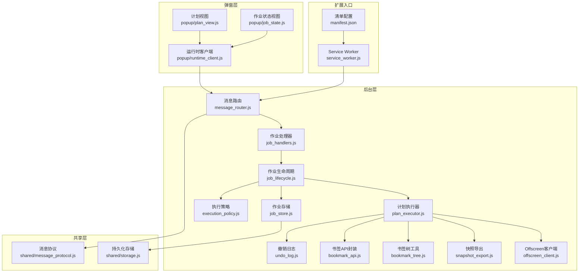
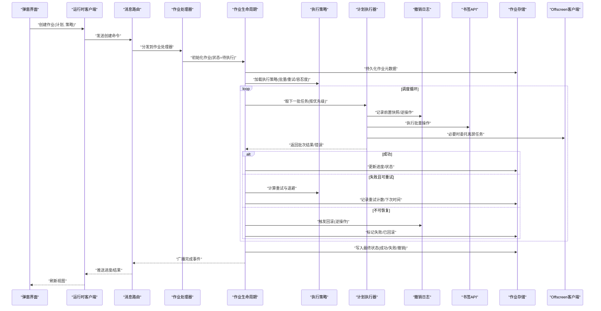
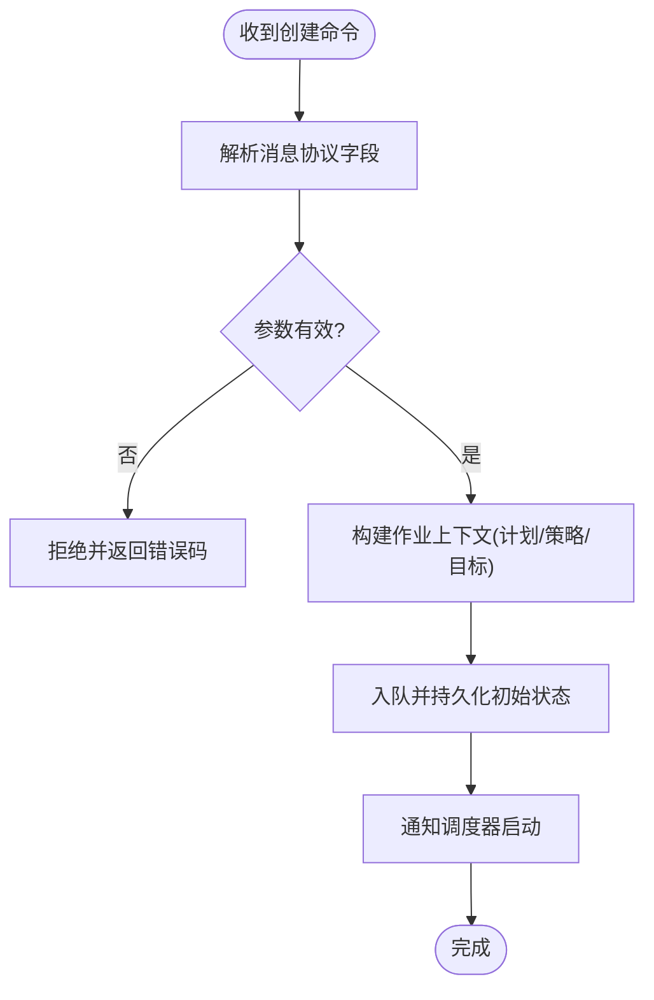
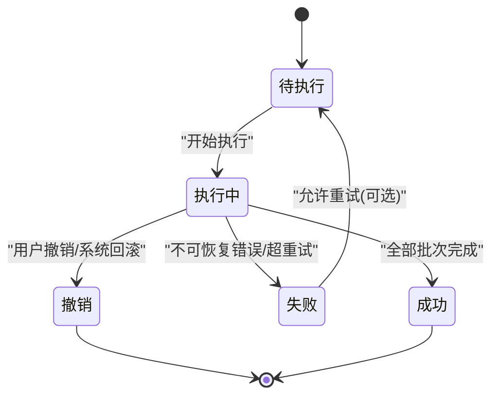
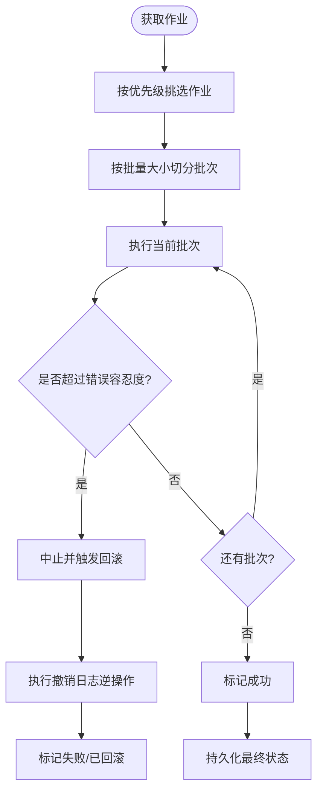
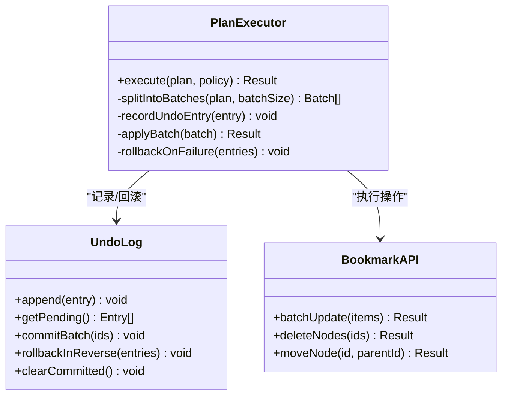
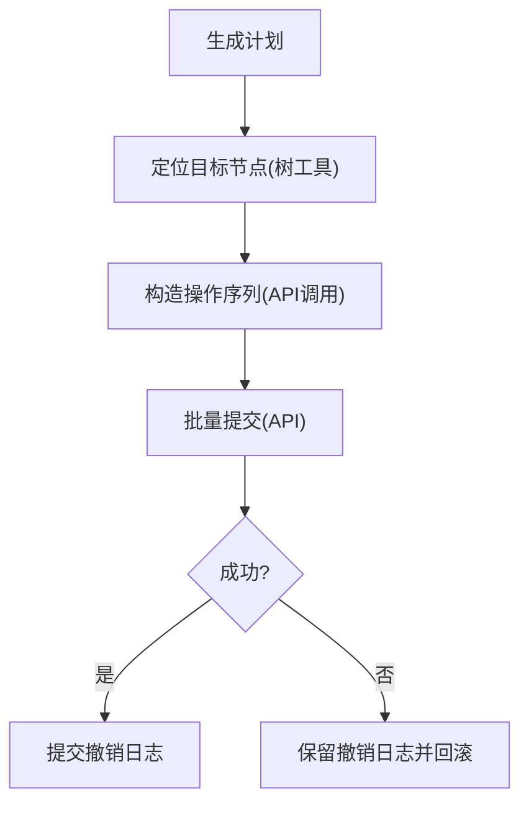
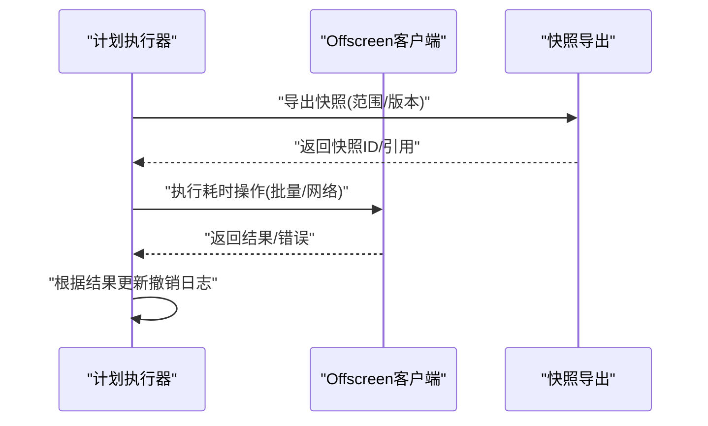
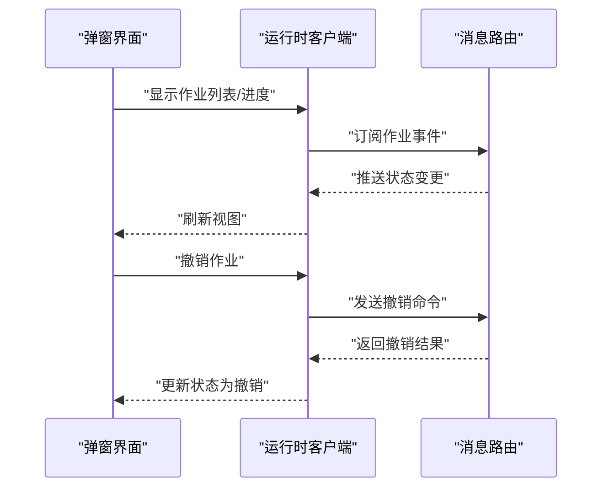
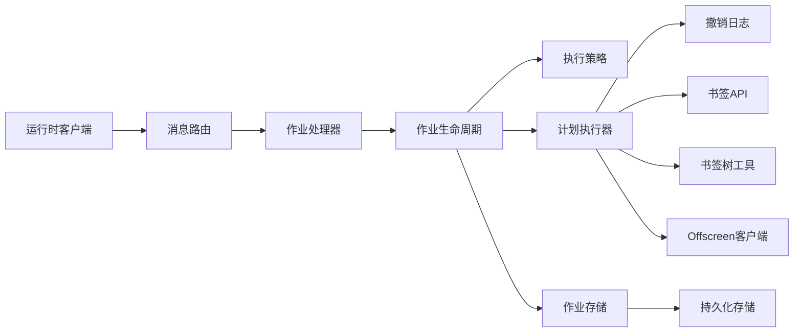

# 作业执行流

<cite>
**本文引用的文件**   
- [service_worker.js](file://extension/service_worker.js)
- [job_handlers.js](file://extension/background/job_handlers.js)
- [job_lifecycle.js](file://extension/background/job_lifecycle.js)
- [job_store.js](file://extension/background/job_store.js)
- [execution_policy.js](file://extension/background/execution_policy.js)
- [plan_executor.js](file://extension/background/plan_executor.js)
- [undo_log.js](file://extension/background/undo_log.js)
- [message_router.js](file://extension/background/message_router.js)
- [offscreen_client.js](file://extension/background/offscreen_client.js)
- [bookmark_api.js](file://extension/background/bookmark_api.js)
- [bookmark_tree.js](file://extension/background/bookmark_tree.js)
- [snapshot_export.js](file://extension/background/snapshot_export.js)
- [action_handlers.js](file://extension/background/action_handlers.js)
- [runtime_client.js](file://extension/popup/runtime_client.js)
- [job_state.js](file://extension/popup/job_state.js)
- [plan_view.js](file://extension/popup/plan_view.js)
- [message_protocol.js](file://extension/shared/message_protocol.js)
- [storage.js](file://extension/shared/storage.js)
- [manifest.json](file://extension/manifest.json)
</cite>

## 目录
1. [简介](#简介)
2. [项目结构](#项目结构)
3. [核心组件](#核心组件)
4. [架构总览](#架构总览)
5. [详细组件分析](#详细组件分析)
6. [依赖关系分析](#依赖关系分析)
7. [性能考虑](#性能考虑)
8. [故障排查指南](#故障排查指南)
9. [结论](#结论)
10. [附录](#附录)

## 简介
本文件聚焦于“作业执行流”的数据流与生命周期管理，覆盖从作业创建、调度、优先级排序、并发控制、资源管理到完成与撤销的完整链路。文档同时阐述作业状态机（待执行、执行中、成功、失败、撤销）的状态转换逻辑，解释执行策略（批量大小、错误容忍度、重试机制）的配置与应用，并说明撤销日志记录与回滚机制如何保障原子性与一致性。此外，提供进度跟踪、监控指标与诊断方法，以及队列管理与性能调优的最佳实践。

## 项目结构
本项目采用浏览器扩展架构，后台服务由 Service Worker 驱动，通过 Offscreen Document 执行耗时任务；弹窗界面负责用户交互与可视化。作业相关能力集中在 background 模块，包括作业处理、生命周期、存储、执行策略、计划执行器、撤销日志等。共享协议与存储抽象位于 shared 模块，popup 模块提供运行时客户端与视图。

图表来源
- [service_worker.js](file://extension/service_worker.js)
- [manifest.json](file://extension/manifest.json)
- [message_router.js](file://extension/background/message_router.js)
- [job_handlers.js](file://extension/background/job_handlers.js)
- [job_lifecycle.js](file://extension/background/job_lifecycle.js)
- [job_store.js](file://extension/background/job_store.js)
- [execution_policy.js](file://extension/background/execution_policy.js)
- [plan_executor.js](file://extension/background/plan_executor.js)
- [undo_log.js](file://extension/background/undo_log.js)
- [bookmark_api.js](file://extension/background/bookmark_api.js)
- [bookmark_tree.js](file://extension/background/bookmark_tree.js)
- [snapshot_export.js](file://extension/background/snapshot_export.js)
- [offscreen_client.js](file://extension/background/offscreen_client.js)
- [runtime_client.js](file://extension/popup/runtime_client.js)
- [job_state.js](file://extension/popup/job_state.js)
- [plan_view.js](file://extension/popup/plan_view.js)
- [message_protocol.js](file://extension/shared/message_protocol.js)
- [storage.js](file://extension/shared/storage.js)

章节来源
- [service_worker.js](file://extension/service_worker.js)
- [manifest.json](file://extension/manifest.json)
- [message_router.js](file://extension/background/message_router.js)
- [job_handlers.js](file://extension/background/job_handlers.js)
- [job_lifecycle.js](file://extension/background/job_lifecycle.js)
- [job_store.js](file://extension/background/job_store.js)
- [execution_policy.js](file://extension/background/execution_policy.js)
- [plan_executor.js](file://extension/background/plan_executor.js)
- [undo_log.js](file://extension/background/undo_log.js)
- [bookmark_api.js](file://extension/background/bookmark_api.js)
- [bookmark_tree.js](file://extension/background/bookmark_tree.js)
- [snapshot_export.js](file://extension/background/snapshot_export.js)
- [offscreen_client.js](file://extension/background/offscreen_client.js)
- [runtime_client.js](file://extension/popup/runtime_client.js)
- [job_state.js](file://extension/popup/job_state.js)
- [plan_view.js](file://extension/popup/plan_view.js)
- [message_protocol.js](file://extension/shared/message_protocol.js)
- [storage.js](file://extension/shared/storage.js)

## 核心组件
- 作业处理器：接收来自弹窗或外部触发的作业请求，进行参数校验、上下文准备与入队。
- 作业生命周期：维护作业状态机，协调调度、执行、重试、撤销与最终落盘。
- 作业存储：持久化作业元数据、进度与结果，保证跨会话恢复。
- 执行策略：定义批量大小、错误容忍度、重试次数与退避策略，供调度器与执行器使用。
- 计划执行器：将高层计划分解为可执行的原子操作序列，按策略分批执行，记录撤销日志。
- 撤销日志：记录每一步操作的逆操作，支持事务式回滚与一致性保障。
- 书签API与树工具：封装底层书签读写与树形结构遍历，提供高效批量接口。
- Offscreen客户端：将耗时IO与网络调用迁移至离屏文档，避免阻塞主线程。
- 消息路由与协议：统一前后端通信契约，确保事件与命令的可追踪性。
- 弹窗运行时客户端与视图：向用户暴露作业创建、查询、撤销与进度展示能力。

章节来源
- [job_handlers.js](file://extension/background/job_handlers.js)
- [job_lifecycle.js](file://extension/background/job_lifecycle.js)
- [job_store.js](file://extension/background/job_store.js)
- [execution_policy.js](file://extension/background/execution_policy.js)
- [plan_executor.js](file://extension/background/plan_executor.js)
- [undo_log.js](file://extension/background/undo_log.js)
- [bookmark_api.js](file://extension/background/bookmark_api.js)
- [bookmark_tree.js](file://extension/background/bookmark_tree.js)
- [offscreen_client.js](file://extension/background/offscreen_client.js)
- [message_router.js](file://extension/background/message_router.js)
- [message_protocol.js](file://extension/shared/message_protocol.js)
- [runtime_client.js](file://extension/popup/runtime_client.js)
- [job_state.js](file://extension/popup/job_state.js)
- [plan_view.js](file://extension/popup/plan_view.js)

## 架构总览
下图展示了作业从创建到完成的端到端数据流，包括消息路由、生命周期编排、策略决策、执行批处理、撤销日志与持久化。

图表来源
- [message_router.js](file://extension/background/message_router.js)
- [job_handlers.js](file://extension/background/job_handlers.js)
- [job_lifecycle.js](file://extension/background/job_lifecycle.js)
- [execution_policy.js](file://extension/background/execution_policy.js)
- [plan_executor.js](file://extension/background/plan_executor.js)
- [undo_log.js](file://extension/background/undo_log.js)
- [bookmark_api.js](file://extension/background/bookmark_api.js)
- [offscreen_client.js](file://extension/background/offscreen_client.js)
- [job_store.js](file://extension/background/job_store.js)
- [runtime_client.js](file://extension/popup/runtime_client.js)

## 详细组件分析

### 作业处理器与消息路由
- 职责：解析消息协议中的作业创建命令，校验输入，构造作业上下文，交由生命周期管理。
- 关键点：
  - 基于消息协议进行强类型约束，减少歧义。
  - 对非法输入快速失败，避免无效作业进入队列。
  - 在入队前预分配ID与初始状态，便于后续追踪。

图表来源
- [message_protocol.js](file://extension/shared/message_protocol.js)
- [message_router.js](file://extension/background/message_router.js)
- [job_handlers.js](file://extension/background/job_handlers.js)
- [job_store.js](file://extension/background/job_store.js)

章节来源
- [message_protocol.js](file://extension/shared/message_protocol.js)
- [message_router.js](file://extension/background/message_router.js)
- [job_handlers.js](file://extension/background/job_handlers.js)
- [job_store.js](file://extension/background/job_store.js)

### 作业生命周期与状态机
- 状态集合：待执行、执行中、成功、失败、撤销。
- 转换规则：
  - 待执行 → 执行中：调度器选取作业并开始第一批执行。
  - 执行中 → 成功：所有批次均成功提交，无未决重试。
  - 执行中 → 失败：出现不可恢复错误或超过最大重试次数。
  - 执行中 → 撤销：用户主动撤销或系统判定需回滚。
  - 失败/撤销 → 待执行：允许重新提交（可选）。
- 关键行为：
  - 每步执行前记录撤销日志，失败时按逆序回滚。
  - 进度与中间状态持久化，支持断点续跑。
  - 与执行策略联动，决定批量大小、重试与退避。

图表来源
- [job_lifecycle.js](file://extension/background/job_lifecycle.js)
- [job_store.js](file://extension/background/job_store.js)
- [undo_log.js](file://extension/background/undo_log.js)

章节来源
- [job_lifecycle.js](file://extension/background/job_lifecycle.js)
- [job_store.js](file://extension/background/job_store.js)
- [undo_log.js](file://extension/background/undo_log.js)

### 执行策略与调度
- 策略项：
  - 批量大小：单次批次的任务数量上限，平衡吞吐与风险面。
  - 错误容忍度：允许失败的批次比例或绝对阈值，超出则中止。
  - 重试机制：最大重试次数、退避策略（固定/指数）、抖动因子。
- 调度流程：
  - 根据优先级选择下一个作业（如创建时间、优先级权重）。
  - 按策略切分任务为批次，依次执行。
  - 遇到错误时依据策略决定是否重试或回滚。

图表来源
- [execution_policy.js](file://extension/background/execution_policy.js)
- [job_lifecycle.js](file://extension/background/job_lifecycle.js)
- [plan_executor.js](file://extension/background/plan_executor.js)
- [undo_log.js](file://extension/background/undo_log.js)

章节来源
- [execution_policy.js](file://extension/background/execution_policy.js)
- [job_lifecycle.js](file://extension/background/job_lifecycle.js)
- [plan_executor.js](file://extension/background/plan_executor.js)
- [undo_log.js](file://extension/background/undo_log.js)

### 计划执行器与撤销日志
- 计划执行器：
  - 将高层计划转换为原子操作序列。
  - 与撤销日志协作，在执行前记录必要的前置状态与逆操作。
  - 支持批量提交与部分失败时的细粒度回滚。
- 撤销日志：
  - 每条记录包含：操作标识、前置快照、逆操作描述、时间戳。
  - 支持事务式提交：当整批成功才提交日志；失败则保留以便回滚。
  - 回滚顺序严格逆序，确保一致性。

图表来源
- [plan_executor.js](file://extension/background/plan_executor.js)
- [undo_log.js](file://extension/background/undo_log.js)
- [bookmark_api.js](file://extension/background/bookmark_api.js)

章节来源
- [plan_executor.js](file://extension/background/plan_executor.js)
- [undo_log.js](file://extension/background/undo_log.js)
- [bookmark_api.js](file://extension/background/bookmark_api.js)

### 书签API与树工具
- 书签API：
  - 封装浏览器书签API，提供批量更新、删除、移动等接口。
  - 内部实现幂等与去重，降低重复操作带来的副作用。
- 树工具：
  - 提供树形结构的遍历、查找与路径计算，辅助生成计划与验证目标范围。

图表来源
- [bookmark_tree.js](file://extension/background/bookmark_tree.js)
- [bookmark_api.js](file://extension/background/bookmark_api.js)
- [plan_executor.js](file://extension/background/plan_executor.js)
- [undo_log.js](file://extension/background/undo_log.js)

章节来源
- [bookmark_tree.js](file://extension/background/bookmark_tree.js)
- [bookmark_api.js](file://extension/background/bookmark_api.js)
- [plan_executor.js](file://extension/background/plan_executor.js)
- [undo_log.js](file://extension/background/undo_log.js)

### Offscreen客户端与快照导出
- Offscreen客户端：
  - 将耗时IO与网络调用迁移至离屏文档，避免阻塞主线程。
  - 通过消息通道与后台服务通信，支持异步回调与错误传播。
- 快照导出：
  - 在执行前导出目标范围的书签快照，用于对比与回滚。
  - 快照格式与撤销日志兼容，便于快速重建状态。

图表来源
- [offscreen_client.js](file://extension/background/offscreen_client.js)
- [snapshot_export.js](file://extension/background/snapshot_export.js)
- [plan_executor.js](file://extension/background/plan_executor.js)

章节来源
- [offscreen_client.js](file://extension/background/offscreen_client.js)
- [snapshot_export.js](file://extension/background/snapshot_export.js)
- [plan_executor.js](file://extension/background/plan_executor.js)

### 弹窗运行时客户端与视图
- 运行时客户端：
  - 封装与后台的消息通道，提供创建、查询、撤销作业的API。
  - 订阅进度与完成事件，驱动UI更新。
- 作业状态视图：
  - 渲染作业列表、状态、进度条与错误信息。
  - 支持用户发起撤销与重试操作。
- 计划视图：
  - 展示计划的步骤与依赖关系，辅助用户理解执行路径。

图表来源
- [runtime_client.js](file://extension/popup/runtime_client.js)
- [job_state.js](file://extension/popup/job_state.js)
- [plan_view.js](file://extension/popup/plan_view.js)
- [message_router.js](file://extension/background/message_router.js)

章节来源
- [runtime_client.js](file://extension/popup/runtime_client.js)
- [job_state.js](file://extension/popup/job_state.js)
- [plan_view.js](file://extension/popup/plan_view.js)
- [message_router.js](file://extension/background/message_router.js)

## 依赖关系分析
- 耦合与内聚：
  - 作业处理器与生命周期高内聚，职责清晰。
  - 执行器与撤销日志紧密协作，形成事务边界。
  - 书签API与树工具作为基础设施，被执行器广泛依赖。
- 外部依赖：
  - 浏览器书签API与离屏文档通信。
  - 持久化存储抽象屏蔽底层差异。
- 潜在循环依赖：
  - 通过消息路由解耦前后端，避免直接循环导入。
  - 执行器不直接依赖UI，仅通过事件与存储交互。

图表来源
- [job_handlers.js](file://extension/background/job_handlers.js)
- [job_lifecycle.js](file://extension/background/job_lifecycle.js)
- [execution_policy.js](file://extension/background/execution_policy.js)
- [plan_executor.js](file://extension/background/plan_executor.js)
- [undo_log.js](file://extension/background/undo_log.js)
- [bookmark_api.js](file://extension/background/bookmark_api.js)
- [bookmark_tree.js](file://extension/background/bookmark_tree.js)
- [offscreen_client.js](file://extension/background/offscreen_client.js)
- [job_store.js](file://extension/background/job_store.js)
- [storage.js](file://extension/shared/storage.js)
- [runtime_client.js](file://extension/popup/runtime_client.js)
- [message_router.js](file://extension/background/message_router.js)

章节来源
- [job_handlers.js](file://extension/background/job_handlers.js)
- [job_lifecycle.js](file://extension/background/job_lifecycle.js)
- [execution_policy.js](file://extension/background/execution_policy.js)
- [plan_executor.js](file://extension/background/plan_executor.js)
- [undo_log.js](file://extension/background/undo_log.js)
- [bookmark_api.js](file://extension/background/bookmark_api.js)
- [bookmark_tree.js](file://extension/background/bookmark_tree.js)
- [offscreen_client.js](file://extension/background/offscreen_client.js)
- [job_store.js](file://extension/background/job_store.js)
- [storage.js](file://extension/shared/storage.js)
- [runtime_client.js](file://extension/popup/runtime_client.js)
- [message_router.js](file://extension/background/message_router.js)

## 性能考虑
- 批量大小调优：
  - 根据书签规模与API限流调整批次大小，避免超时与内存峰值。
  - 大作业建议拆分为多阶段，降低单批失败成本。
- 并发控制：
  - 限制并发执行器数量，避免争用书签API与磁盘IO。
  - 使用背压机制，当撤销日志增长过快时暂停新批次。
- 重试与退避：
  - 采用指数退避与随机抖动，降低雪崩风险。
  - 对瞬时错误（网络抖动）设置较短重试间隔，对持久错误延长间隔。
- 持久化优化：
  - 合并小写操作，减少频繁I/O。
  - 使用增量快照与差异日志，缩短回滚时间。
- 离屏任务：
  - 将耗时操作迁移至离屏文档，保持主线程响应。
  - 合理划分任务边界，避免长时间占用离屏上下文。

[本节为通用指导，无需特定文件来源]

## 故障排查指南
- 常见问题定位：
  - 作业卡在“执行中”：检查策略的重试与退避配置，查看撤销日志是否堆积。
  - 批量失败：核对书签API返回码与错误容忍度阈值，确认是否触发回滚。
  - 撤销失败：验证撤销日志完整性与逆操作正确性，检查快照版本兼容性。
- 诊断手段：
  - 启用详细日志，记录每批任务的开始/结束时间与错误堆栈。
  - 导出作业快照与撤销日志，离线分析失败原因。
  - 监控指标：批次成功率、平均执行时长、重试次数、回滚率。
- 恢复策略：
  - 对于可恢复错误，自动重试并更新下次执行时间。
  - 对于不可恢复错误，执行回滚并通知用户，提供手动干预入口。

章节来源
- [job_lifecycle.js](file://extension/background/job_lifecycle.js)
- [execution_policy.js](file://extension/background/execution_policy.js)
- [undo_log.js](file://extension/background/undo_log.js)
- [job_store.js](file://extension/background/job_store.js)

## 结论
本作业执行流以生命周期为核心，结合执行策略与撤销日志，实现了高可靠、可回滚的作业处理能力。通过消息路由与离屏客户端，系统在可扩展性与用户体验之间取得平衡。合理的批量大小、错误容忍度与重试机制保障了吞吐与稳定性，而快照与撤销日志确保了操作的原子性与一致性。配合完善的监控与诊断手段，可在复杂场景下快速定位与恢复问题。

[本节为总结性内容，无需特定文件来源]

## 附录
- 最佳实践：
  - 将大作业拆分为多个子作业，提升并行度与容错性。
  - 为关键操作设置更严格的错误容忍度与更短的重试间隔。
  - 定期清理已提交的撤销日志，释放存储空间。
  - 在UI中提供清晰的进度反馈与错误提示，提升用户信任度。
- 参考文件：
  - 消息协议与运行时客户端：[message_protocol.js](file://extension/shared/message_protocol.js)、[runtime_client.js](file://extension/popup/runtime_client.js)
  - 作业处理与生命周期：[job_handlers.js](file://extension/background/job_handlers.js)、[job_lifecycle.js](file://extension/background/job_lifecycle.js)
  - 执行策略与计划执行器：[execution_policy.js](file://extension/background/execution_policy.js)、[plan_executor.js](file://extension/background/plan_executor.js)
  - 撤销日志与书签API：[undo_log.js](file://extension/background/undo_log.js)、[bookmark_api.js](file://extension/background/bookmark_api.js)
  - 离屏客户端与快照导出：[offscreen_client.js](file://extension/background/offscreen_client.js)、[snapshot_export.js](file://extension/background/snapshot_export.js)
  - 作业存储与持久化：[job_store.js](file://extension/background/job_store.js)、[storage.js](file://extension/shared/storage.js)
  - 弹窗视图与状态：[job_state.js](file://extension/popup/job_state.js)、[plan_view.js](file://extension/popup/plan_view.js)
  - 入口与清单：[service_worker.js](file://extension/service_worker.js)、[manifest.json](file://extension/manifest.json)