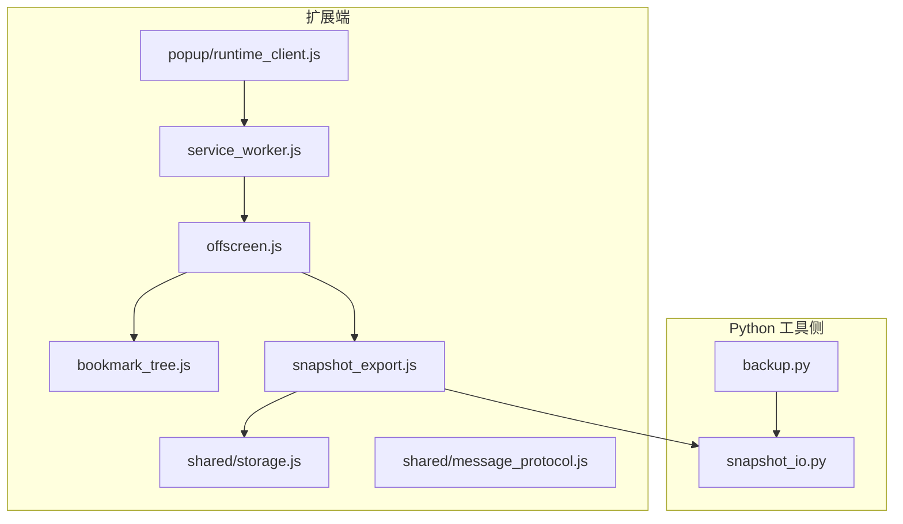
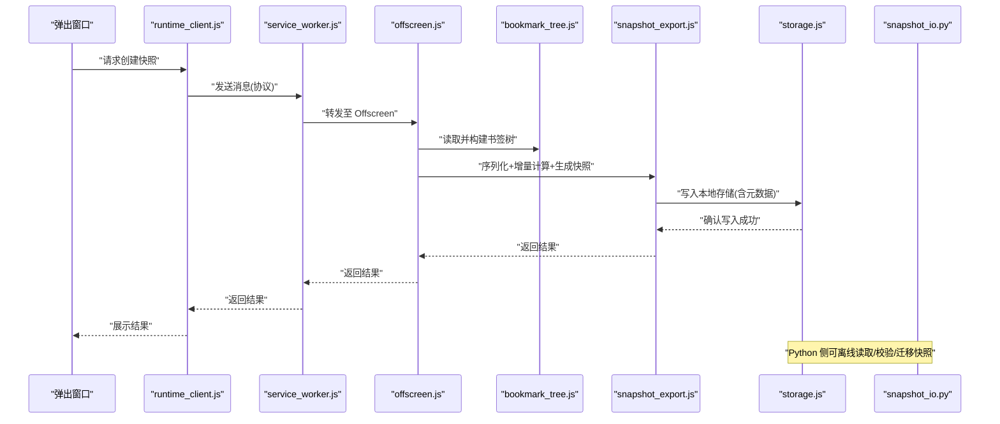
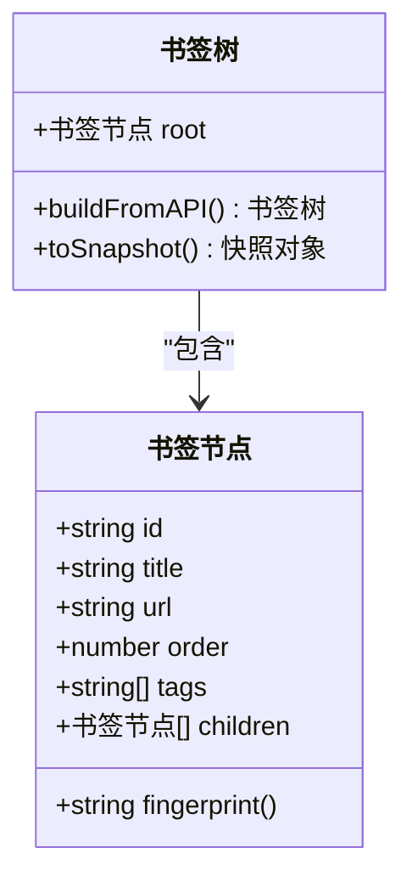
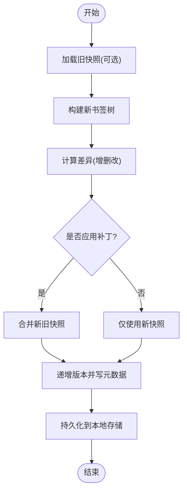
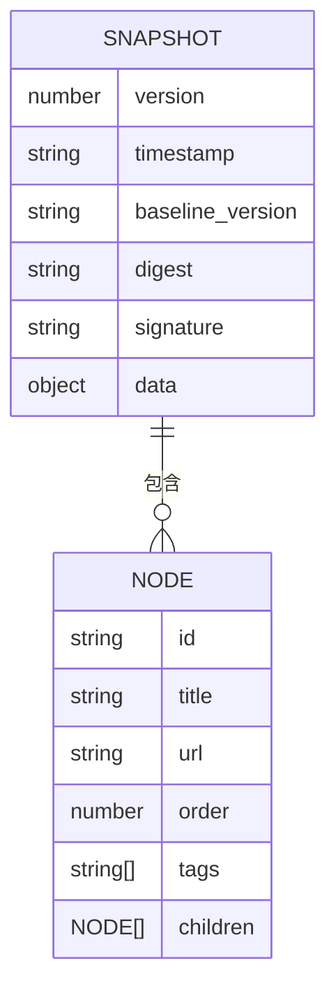
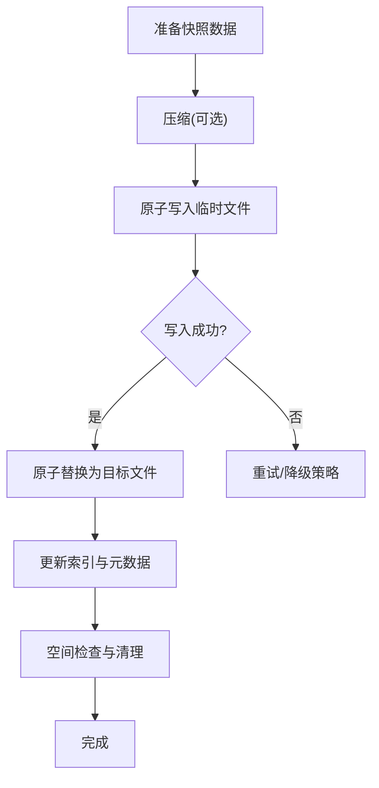
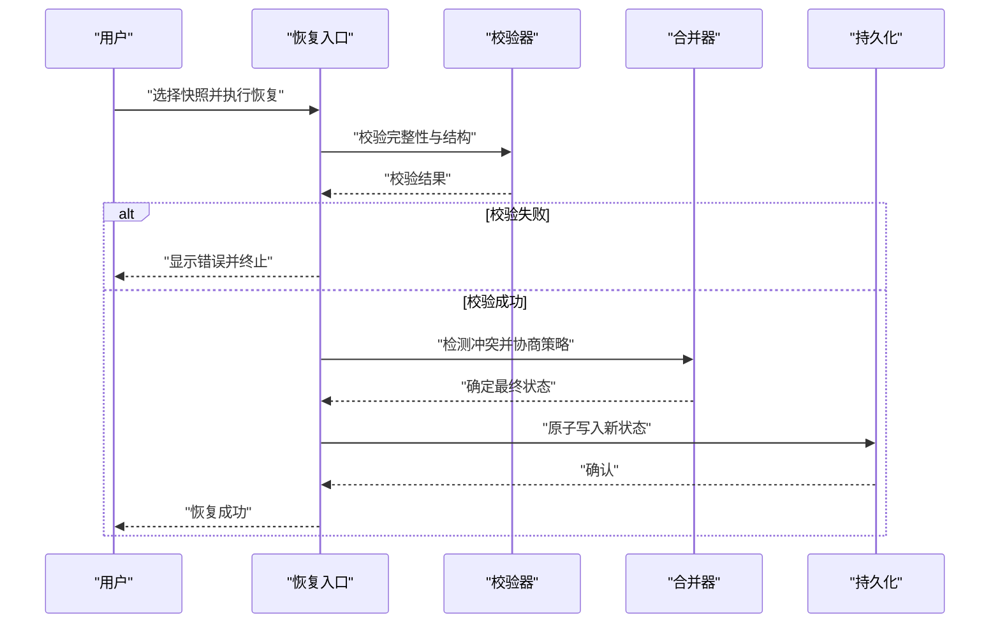
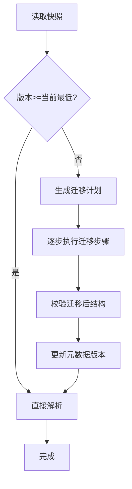
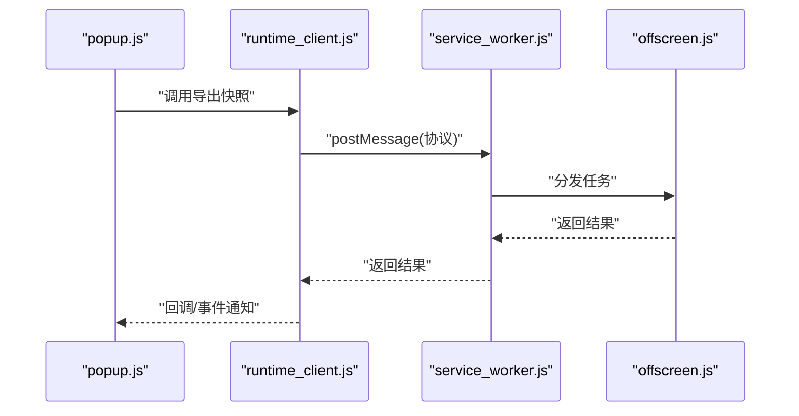
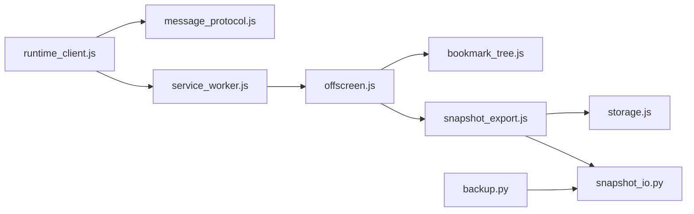

# 快照备份流

<cite>
**本文引用的文件**   
- [extension/background/snapshot_export.js](file://extension/background/snapshot_export.js)
- [src/bookmark_advisor/snapshot_io.py](file://src/bookmark_advisor/snapshot_io.py)
- [src/bookmark_advisor/backup.py](file://src/bookmark_advisor/backup.py)
- [extension/background/bookmark_tree.js](file://extension/background/bookmark_tree.js)
- [extension/shared/storage.js](file://extension/shared/storage.js)
- [extension/offscreen.js](file://extension/offscreen.js)
- [extension/service_worker.js](file://extension/service_worker.js)
- [extension/popup/runtime_client.js](file://extension/popup/runtime_client.js)
- [extension/shared/message_protocol.js](file://extension/shared/message_protocol.js)
- [tests/test_extension_background_snapshot.py](file://tests/test_extension_background_snapshot.py)
</cite>

## 目录
1. [简介](#简介)
2. [项目结构](#项目结构)
3. [核心组件](#核心组件)
4. [架构总览](#架构总览)
5. [详细组件分析](#详细组件分析)
6. [依赖分析](#依赖分析)
7. [性能考虑](#性能考虑)
8. [故障排查指南](#故障排查指南)
9. [结论](#结论)
10. [附录](#附录)

## 简介
本文件围绕“书签状态快照”的完整数据流进行系统化说明，覆盖以下关键主题：
- 书签树结构的序列化与增量更新算法
- 版本控制机制与向后兼容策略
- 数据导出格式设计（JSON 结构、元数据记录、兼容性处理）
- 快照存储策略（本地文件管理、压缩优化、存储空间控制）
- 快照恢复机制（完整性验证、冲突解决、回滚操作）
- 数据迁移与版本升级处理
- 大数据量场景下的性能优化技巧

目标读者包括扩展开发者、后端维护人员以及需要理解或二次开发快照能力的工程师。

## 项目结构
本项目包含浏览器扩展侧与 Python 工具侧两部分，分别承担采集、导出、存储与恢复的职责：
- 扩展侧负责从浏览器书签 API 读取树结构、构建内部表示、生成快照并持久化到本地存储；同时提供消息协议与后台脚本通信。
- Python 侧提供快照 I/O、备份编排、模型定义等能力，用于离线处理、校验与迁移。

图表来源
- [extension/service_worker.js](file://extension/service_worker.js)
- [extension/offscreen.js](file://extension/offscreen.js)
- [extension/background/bookmark_tree.js](file://extension/background/bookmark_tree.js)
- [extension/background/snapshot_export.js](file://extension/background/snapshot_export.js)
- [extension/shared/storage.js](file://extension/shared/storage.js)
- [extension/shared/message_protocol.js](file://extension/shared/message_protocol.js)
- [extension/popup/runtime_client.js](file://extension/popup/runtime_client.js)
- [src/bookmark_advisor/snapshot_io.py](file://src/bookmark_advisor/snapshot_io.py)
- [src/bookmark_advisor/backup.py](file://src/bookmark_advisor/backup.py)

章节来源
- [extension/service_worker.js](file://extension/service_worker.js)
- [extension/offscreen.js](file://extension/offscreen.js)
- [extension/background/bookmark_tree.js](file://extension/background/bookmark_tree.js)
- [extension/background/snapshot_export.js](file://extension/background/snapshot_export.js)
- [extension/shared/storage.js](file://extension/shared/storage.js)
- [extension/shared/message_protocol.js](file://extension/shared/message_protocol.js)
- [extension/popup/runtime_client.js](file://extension/popup/runtime_client.js)
- [src/bookmark_advisor/snapshot_io.py](file://src/bookmark_advisor/snapshot_io.py)
- [src/bookmark_advisor/backup.py](file://src/bookmark_advisor/backup.py)

## 核心组件
- 书签树构建器：负责将浏览器书签 API 返回的数据转换为内部树形结构，便于后续序列化与增量计算。
- 快照导出器：负责将书签树序列化为 JSON 快照，附加元数据（版本、时间戳、摘要），并写入本地存储。
- 快照 I/O（Python）：提供读写、校验、合并、迁移等能力，作为离线处理与跨平台一致性保障。
- 存储抽象：封装本地存储读写、原子写入、空间限制与清理策略。
- 消息协议：定义扩展各模块间以及与弹出窗口的交互契约，确保调用方与被调用方对数据结构一致。

章节来源
- [extension/background/bookmark_tree.js](file://extension/background/bookmark_tree.js)
- [extension/background/snapshot_export.js](file://extension/background/snapshot_export.js)
- [src/bookmark_advisor/snapshot_io.py](file://src/bookmark_advisor/snapshot_io.py)
- [extension/shared/storage.js](file://extension/shared/storage.js)
- [extension/shared/message_protocol.js](file://extension/shared/message_protocol.js)

## 架构总览
下图展示了从触发快照到落盘的关键流程，以及 Python 侧在离线阶段的作用。

图表来源
- [extension/popup/runtime_client.js](file://extension/popup/runtime_client.js)
- [extension/shared/message_protocol.js](file://extension/shared/message_protocol.js)
- [extension/service_worker.js](file://extension/service_worker.js)
- [extension/offscreen.js](file://extension/offscreen.js)
- [extension/background/bookmark_tree.js](file://extension/background/bookmark_tree.js)
- [extension/background/snapshot_export.js](file://extension/background/snapshot_export.js)
- [extension/shared/storage.js](file://extension/shared/storage.js)
- [src/bookmark_advisor/snapshot_io.py](file://src/bookmark_advisor/snapshot_io.py)

## 详细组件分析

### 书签树结构与序列化
- 树节点通常包含标识、标题、URL、子节点列表、排序位置、标签等字段。
- 序列化过程会遍历整棵树，输出稳定的 JSON 结构，保证键顺序稳定、空值规范化、时间戳统一格式。
- 为支持增量更新，会在节点上保留变更指纹（如基于内容哈希或版本号）。

图表来源
- [extension/background/bookmark_tree.js](file://extension/background/bookmark_tree.js)

章节来源
- [extension/background/bookmark_tree.js](file://extension/background/bookmark_tree.js)

### 增量更新算法与版本控制
- 增量更新通过比较新旧快照的差异，仅记录新增、修改、删除的节点集合，减少体积与传输开销。
- 版本控制以“快照版本”为核心，每次导出递增版本号，并在元数据中记录基线版本，以便应用补丁。
- 合并策略采用“最后写入优先”或“按时间戳合并”，并提供冲突标记供用户选择。

图表来源
- [extension/background/snapshot_export.js](file://extension/background/snapshot_export.js)
- [src/bookmark_advisor/snapshot_io.py](file://src/bookmark_advisor/snapshot_io.py)

章节来源
- [extension/background/snapshot_export.js](file://extension/background/snapshot_export.js)
- [src/bookmark_advisor/snapshot_io.py](file://src/bookmark_advisor/snapshot_io.py)

### 数据导出格式设计（JSON 结构、元数据、兼容性）
- 根对象包含元数据与数据体两部分：
  - 元数据：版本、时间戳、摘要、基线版本、签名（可选）、语言/区域信息。
  - 数据体：书签树根节点及其子节点。
- 兼容性处理：
  - 向前兼容：新版本忽略未知字段。
  - 向后兼容：旧版本遇到未知字段时跳过并记录告警。
  - 字段弃用：通过元数据中的“弃用清单”提示迁移路径。
- 校验：
  - 结构校验（必填字段、类型约束）。
  - 完整性校验（摘要/签名）。
  - 语义校验（URL 合法性、去重规则）。

图表来源
- [extension/background/snapshot_export.js](file://extension/background/snapshot_export.js)
- [src/bookmark_advisor/snapshot_io.py](file://src/bookmark_advisor/snapshot_io.py)

章节来源
- [extension/background/snapshot_export.js](file://extension/background/snapshot_export.js)
- [src/bookmark_advisor/snapshot_io.py](file://src/bookmark_advisor/snapshot_io.py)

### 快照存储策略（本地文件管理、压缩优化、空间控制）
- 存储位置：
  - 扩展侧使用本地存储接口，按命名空间隔离，避免与其他扩展数据冲突。
  - Python 侧支持文件系统路径，便于归档与共享。
- 原子写入：
  - 先写入临时文件，再原子替换，防止部分写入导致损坏。
- 压缩优化：
  - 文本型 JSON 可使用 gzip/zstd 压缩，权衡 CPU 与空间。
  - 大文件分片存储，按需解压。
- 空间控制：
  - 保留最近 N 个快照，超过阈值按策略清理（LRU、时间衰减）。
  - 单文件大小上限与总量上限监控。

图表来源
- [extension/shared/storage.js](file://extension/shared/storage.js)
- [src/bookmark_advisor/snapshot_io.py](file://src/bookmark_advisor/snapshot_io.py)

章节来源
- [extension/shared/storage.js](file://extension/shared/storage.js)
- [src/bookmark_advisor/snapshot_io.py](file://src/bookmark_advisor/snapshot_io.py)

### 快照恢复机制（完整性验证、冲突解决、回滚）
- 完整性验证：
  - 校验摘要/签名，失败则拒绝恢复。
  - 校验 JSON 结构与必填字段。
- 冲突解决：
  - 当恢复目标存在未保存变更时，提示用户选择“覆盖/合并/取消”。
  - 合并策略支持按时间戳、按优先级或手动选择。
- 回滚操作：
  - 恢复前创建当前状态的“预快照”，失败时自动回滚。
  - 提供一键恢复到上一个已知良好版本的能力。

图表来源
- [src/bookmark_advisor/snapshot_io.py](file://src/bookmark_advisor/snapshot_io.py)
- [extension/background/snapshot_export.js](file://extension/background/snapshot_export.js)

章节来源
- [src/bookmark_advisor/snapshot_io.py](file://src/bookmark_advisor/snapshot_io.py)
- [extension/background/snapshot_export.js](file://extension/background/snapshot_export.js)

### 数据迁移与版本升级（向后兼容）
- 迁移入口：
  - 读取快照元数据中的版本，判断是否需要迁移。
  - 针对每个废弃字段提供映射规则与默认值。
- 迁移策略：
  - 幂等性：多次迁移不改变结果。
  - 可逆性：尽量保留原始字段，必要时提供反向映射。
  - 渐进式：小步迁移，每步可独立回滚。
- 兼容性测试：
  - 使用历史快照回归测试，确保不同版本的读写一致。

图表来源
- [src/bookmark_advisor/snapshot_io.py](file://src/bookmark_advisor/snapshot_io.py)
- [src/bookmark_advisor/backup.py](file://src/bookmark_advisor/backup.py)

章节来源
- [src/bookmark_advisor/snapshot_io.py](file://src/bookmark_advisor/snapshot_io.py)
- [src/bookmark_advisor/backup.py](file://src/bookmark_advisor/backup.py)

### 扩展端消息与调用链
- 弹出窗口通过运行时客户端向 Service Worker 发起消息，Service Worker 转发至 Offscreen 页面执行实际工作。
- 消息协议定义了方法名、参数与返回值结构，确保两端一致。

图表来源
- [extension/popup/runtime_client.js](file://extension/popup/runtime_client.js)
- [extension/shared/message_protocol.js](file://extension/shared/message_protocol.js)
- [extension/service_worker.js](file://extension/service_worker.js)
- [extension/offscreen.js](file://extension/offscreen.js)

章节来源
- [extension/popup/runtime_client.js](file://extension/popup/runtime_client.js)
- [extension/shared/message_protocol.js](file://extension/shared/message_protocol.js)
- [extension/service_worker.js](file://extension/service_worker.js)
- [extension/offscreen.js](file://extension/offscreen.js)

## 依赖分析
- 扩展端依赖关系：
  - runtime_client 依赖 message_protocol 与 service_worker。
  - offscreen 依赖 bookmark_tree 与 snapshot_export。
  - snapshot_export 依赖 storage 与 snapshot_io（Python 侧可通过命令行或库调用）。
- Python 端依赖关系：
  - backup 依赖 snapshot_io 进行读写与迁移。
  - snapshot_io 提供统一的 I/O 接口，屏蔽底层实现差异。

图表来源
- [extension/popup/runtime_client.js](file://extension/popup/runtime_client.js)
- [extension/shared/message_protocol.js](file://extension/shared/message_protocol.js)
- [extension/service_worker.js](file://extension/service_worker.js)
- [extension/offscreen.js](file://extension/offscreen.js)
- [extension/background/bookmark_tree.js](file://extension/background/bookmark_tree.js)
- [extension/background/snapshot_export.js](file://extension/background/snapshot_export.js)
- [extension/shared/storage.js](file://extension/shared/storage.js)
- [src/bookmark_advisor/snapshot_io.py](file://src/bookmark_advisor/snapshot_io.py)
- [src/bookmark_advisor/backup.py](file://src/bookmark_advisor/backup.py)

章节来源
- [extension/popup/runtime_client.js](file://extension/popup/runtime_client.js)
- [extension/shared/message_protocol.js](file://extension/shared/message_protocol.js)
- [extension/service_worker.js](file://extension/service_worker.js)
- [extension/offscreen.js](file://extension/offscreen.js)
- [extension/background/bookmark_tree.js](file://extension/background/bookmark_tree.js)
- [extension/background/snapshot_export.js](file://extension/background/snapshot_export.js)
- [extension/shared/storage.js](file://extension/shared/storage.js)
- [src/bookmark_advisor/snapshot_io.py](file://src/bookmark_advisor/snapshot_io.py)
- [src/bookmark_advisor/backup.py](file://src/bookmark_advisor/backup.py)

## 性能考虑
- 增量计算：
  - 使用指纹或版本号快速定位变更节点，避免全量比对。
  - 对大规模树结构采用分层对比与懒加载。
- 序列化优化：
  - 稳定键序、去除冗余字段、统一时间格式，提升压缩率。
  - 对大数组进行分块序列化，降低内存峰值。
- 存储优化：
  - 启用压缩并设置合理压缩级别，平衡 CPU 与空间。
  - 分片存储与索引分离，提高随机访问效率。
- 并发与异步：
  - 导出与写入采用异步流水线，避免阻塞主线程。
  - 使用队列限流，防止频繁写入造成抖动。
- 大数据量方案：
  - 分页导出与增量合并，降低单次处理压力。
  - 引入外部存储（如对象存储）进行长期归档，本地仅保留热数据。

[本节为通用指导，无需特定文件来源]

## 故障排查指南
- 常见问题定位：
  - 导出失败：检查消息协议是否正确、Offscreen 上下文是否可用、存储权限是否授予。
  - 恢复失败：检查快照完整性、版本兼容性、冲突策略是否明确。
  - 空间不足：检查存储配额、清理策略是否生效。
- 日志与诊断：
  - 记录关键步骤的时间戳与耗时，定位瓶颈。
  - 输出摘要与指纹，辅助比对差异。
- 回归测试：
  - 使用历史快照进行端到端测试，确保迁移与恢复稳定。

章节来源
- [tests/test_extension_background_snapshot.py](file://tests/test_extension_background_snapshot.py)

## 结论
本快照备份流通过清晰的职责划分与严格的版本控制，实现了可扩展、可迁移、可恢复的书签状态管理能力。结合增量更新、压缩与原子写入等优化手段，能够在大数据量场景下保持良好性能与稳定性。建议在生产环境中配合自动化测试与监控，持续验证兼容性与可靠性。

[本节为总结性内容，无需特定文件来源]

## 附录
- 术语表：
  - 快照：某一时刻书签树的完整或增量表示。
  - 增量：相对于基线的变更集合。
  - 元数据：描述快照的版本、时间戳、摘要等信息。
- 参考实现路径：
  - 书签树构建：[extension/background/bookmark_tree.js](file://extension/background/bookmark_tree.js)
  - 快照导出与元数据：[extension/background/snapshot_export.js](file://extension/background/snapshot_export.js)
  - 本地存储与原子写入：[extension/shared/storage.js](file://extension/shared/storage.js)
  - Python 快照 I/O 与迁移：[src/bookmark_advisor/snapshot_io.py](file://src/bookmark_advisor/snapshot_io.py)
  - 备份编排：[src/bookmark_advisor/backup.py](file://src/bookmark_advisor/backup.py)
  - 消息协议与调用链：[extension/shared/message_protocol.js](file://extension/shared/message_protocol.js)、[extension/popup/runtime_client.js](file://extension/popup/runtime_client.js)、[extension/service_worker.js](file://extension/service_worker.js)、[extension/offscreen.js](file://extension/offscreen.js)