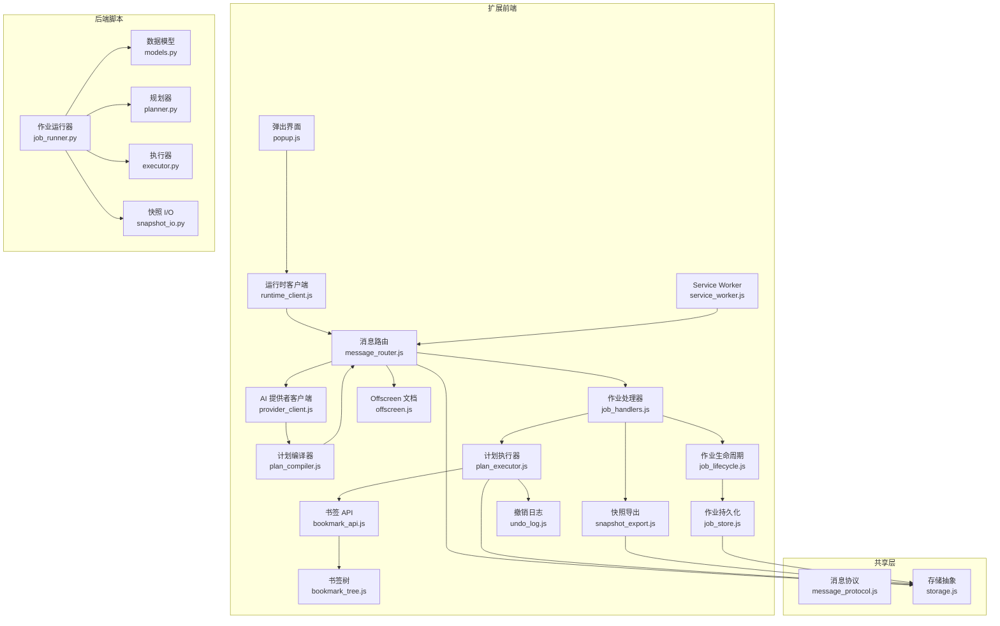
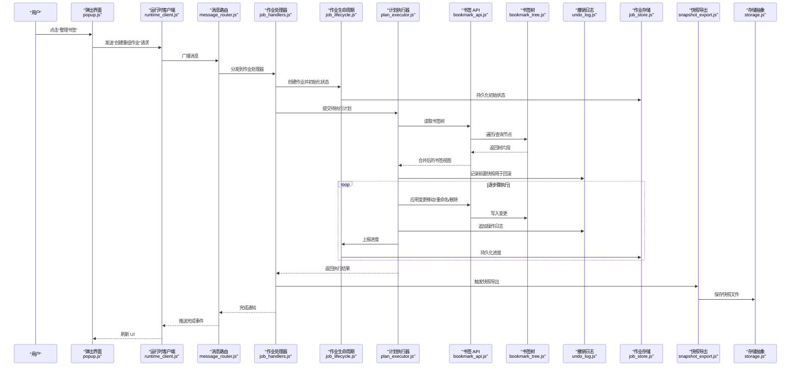
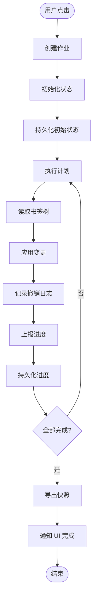
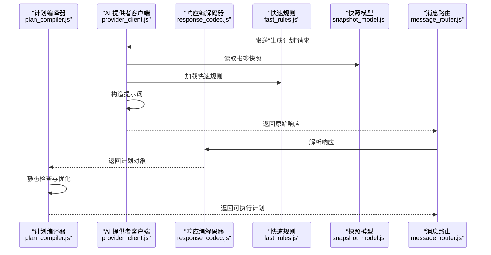
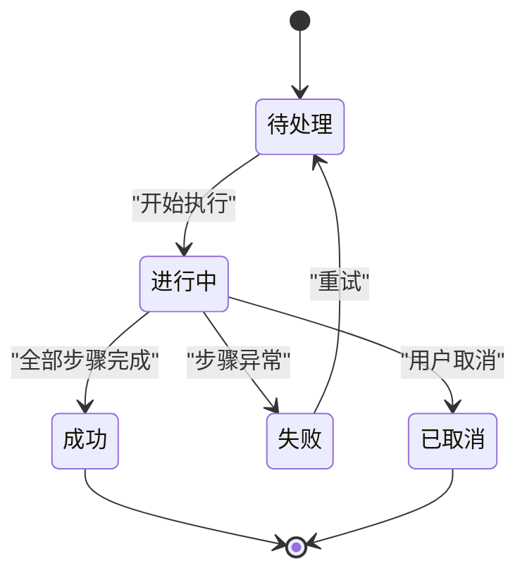
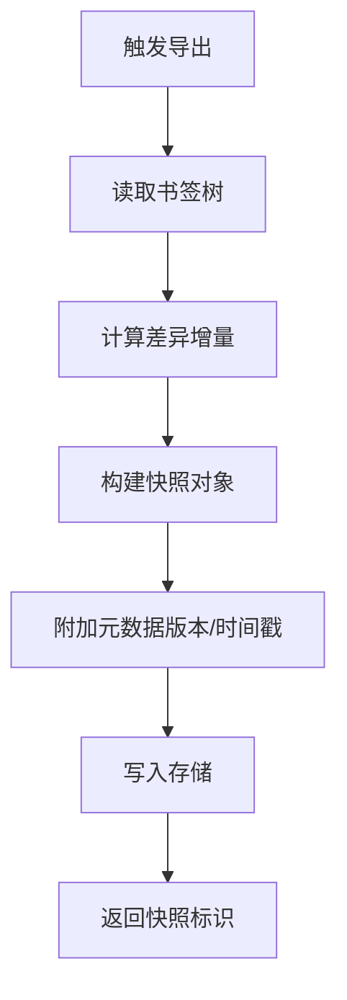
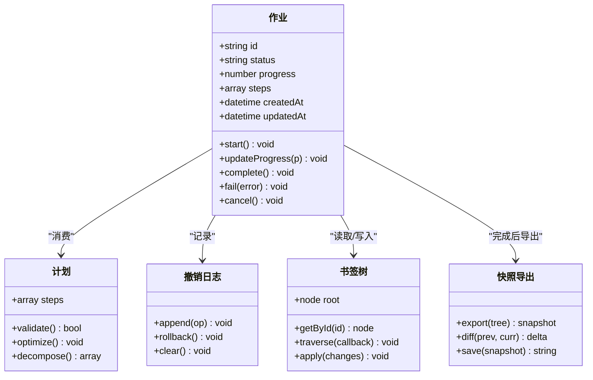
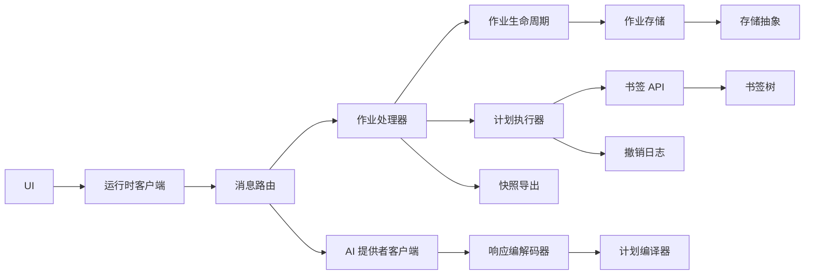

# 数据流设计

<cite>
**本文引用的文件**   
- [extension/background/bookmark_api.js](file://extension/background/bookmark_api.js)
- [extension/background/bookmark_tree.js](file://extension/background/bookmark_tree.js)
- [extension/background/plan_executor.js](file://extension/background/plan_executor.js)
- [extension/background/job_handlers.js](file://extension/background/job_handlers.js)
- [extension/background/job_lifecycle.js](file://extension/background/job_lifecycle.js)
- [extension/background/job_store.js](file://extension/background/job_store.js)
- [extension/background/snapshot_export.js](file://extension/background/snapshot_export.js)
- [extension/background/undo_log.js](file://extension/background/undo_log.js)
- [extension/popup/runtime_client.js](file://extension/popup/runtime_client.js)
- [extension/shared/message_protocol.js](file://extension/shared/message_protocol.js)
- [extension/shared/storage.js](file://extension/shared/storage.js)
- [extension/ai/provider_client.js](file://extension/ai/provider_client.js)
- [extension/ai/response_codec.js](file://extension/ai/response_codec.js)
- [extension/ai/plan_compiler.js](file://extension/ai/plan_compiler.js)
- [extension/ai/batching.js](file://extension/ai/batching.js)
- [extension/ai/snapshot_model.js](file://extension/ai/snapshot_model.js)
- [extension/ai/fast_rules.js](file://extension/ai/fast_rules.js)
- [extension/ai/prompt_codec.js](file://extension/ai/prompt_codec.js)
- [extension/offscreen.js](file://extension/offscreen.js)
- [extension/service_worker.js](file://extension/service_worker.js)
- [src/bookmark_advisor/models.py](file://src/bookmark_advisor/models.py)
- [src/bookmark_advisor/planner.py](file://src/bookmark_advisor/planner.py)
- [src/bookmark_advisor/executor.py](file://src/bookmark_advisor/executor.py)
- [src/bookmark_advisor/job_runner.py](file://src/bookmark_advisor/job_runner.py)
- [src/bookmark_advisor/snapshot_io.py](file://src/bookmark_advisor/snapshot_io.py)
</cite>

## 目录
1. [简介](#简介)
2. [项目结构](#项目结构)
3. [核心组件](#核心组件)
4. [架构总览](#架构总览)
5. [详细组件分析](#详细组件分析)
6. [依赖关系分析](#依赖关系分析)
7. [性能考量](#性能考量)
8. [故障排查指南](#故障排查指南)
9. [结论](#结论)
10. [附录](#附录)

## 简介
本文件面向 Edge Bookmark 的数据流设计，聚焦以下目标：
- 用户操作流：从 UI 交互到书签操作的端到端处理路径。
- AI 规划流：书签状态分析、智能重组计划生成与执行步骤分解。
- 作业执行流：任务调度、进度跟踪与结果反馈的状态管理。
- 快照备份流：书签树序列化、增量更新与版本控制。
- 一致性、事务与错误恢复策略。
- 提供数据流架构图与时序图，展示关键数据模型在系统中的流转过程。

## 项目结构
Edge Bookmark 采用“扩展前端 + 后台服务 + 可选离线脚本”的分层架构：
- 扩展侧（浏览器）：UI（popup）、消息路由、AI 客户端、计划编译与执行、作业生命周期、书签树与导出、撤销日志等。
- 后端脚本（Python）：模型定义、规划器、执行器、作业运行器、快照 I/O。
- 共享协议：消息协议、存储抽象、路径工具等。

图表来源
- [extension/popup/runtime_client.js](file://extension/popup/runtime_client.js)
- [extension/background/message_router.js](file://extension/background/message_router.js)
- [extension/background/job_handlers.js](file://extension/background/job_handlers.js)
- [extension/background/plan_executor.js](file://extension/background/plan_executor.js)
- [extension/background/bookmark_api.js](file://extension/background/bookmark_api.js)
- [extension/background/bookmark_tree.js](file://extension/background/bookmark_tree.js)
- [extension/background/undo_log.js](file://extension/background/undo_log.js)
- [extension/background/job_lifecycle.js](file://extension/background/job_lifecycle.js)
- [extension/background/job_store.js](file://extension/background/job_store.js)
- [extension/background/snapshot_export.js](file://extension/background/snapshot_export.js)
- [extension/ai/provider_client.js](file://extension/ai/provider_client.js)
- [extension/ai/plan_compiler.js](file://extension/ai/plan_compiler.js)
- [extension/offscreen.js](file://extension/offscreen.js)
- [extension/service_worker.js](file://extension/service_worker.js)
- [extension/shared/message_protocol.js](file://extension/shared/message_protocol.js)
- [extension/shared/storage.js](file://extension/shared/storage.js)
- [src/bookmark_advisor/models.py](file://src/bookmark_advisor/models.py)
- [src/bookmark_advisor/planner.py](file://src/bookmark_advisor/planner.py)
- [src/bookmark_advisor/executor.py](file://src/bookmark_advisor/executor.py)
- [src/bookmark_advisor/job_runner.py](file://src/bookmark_advisor/job_runner.py)
- [src/bookmark_advisor/snapshot_io.py](file://src/bookmark_advisor/snapshot_io.py)

章节来源
- [extension/popup/runtime_client.js](file://extension/popup/runtime_client.js)
- [extension/background/message_router.js](file://extension/background/message_router.js)
- [extension/background/job_handlers.js](file://extension/background/job_handlers.js)
- [extension/background/plan_executor.js](file://extension/background/plan_executor.js)
- [extension/background/bookmark_api.js](file://extension/background/bookmark_api.js)
- [extension/background/bookmark_tree.js](file://extension/background/bookmark_tree.js)
- [extension/background/undo_log.js](file://extension/background/undo_log.js)
- [extension/background/job_lifecycle.js](file://extension/background/job_lifecycle.js)
- [extension/background/job_store.js](file://extension/background/job_store.js)
- [extension/background/snapshot_export.js](file://extension/background/snapshot_export.js)
- [extension/ai/provider_client.js](file://extension/ai/provider_client.js)
- [extension/ai/plan_compiler.js](file://extension/ai/plan_compiler.js)
- [extension/offscreen.js](file://extension/offscreen.js)
- [extension/service_worker.js](file://extension/service_worker.js)
- [extension/shared/message_protocol.js](file://extension/shared/message_protocol.js)
- [extension/shared/storage.js](file://extension/shared/storage.js)
- [src/bookmark_advisor/models.py](file://src/bookmark_advisor/models.py)
- [src/bookmark_advisor/planner.py](file://src/bookmark_advisor/planner.py)
- [src/bookmark_advisor/executor.py](file://src/bookmark_advisor/executor.py)
- [src/bookmark_advisor/job_runner.py](file://src/bookmark_advisor/job_runner.py)
- [src/bookmark_advisor/snapshot_io.py](file://src/bookmark_advisor/snapshot_io.py)

## 核心组件
- 消息协议与路由：统一消息格式、跨上下文通信（popup、background、offscreen、SW）。
- 书签 API 与树：封装浏览器书签读写、树形结构与批量操作。
- AI 规划与编译：调用外部 AI 服务、解析响应、将自然语言意图转换为可执行计划。
- 计划执行器：按步骤执行计划，维护撤销日志，回滚失败分支。
- 作业生命周期与存储：创建、调度、追踪、持久化作业状态。
- 快照导出：序列化书签树为快照，支持增量与版本控制。
- 后端脚本：模型定义、规划器、执行器、作业运行器、快照 I/O，用于离线批处理或辅助流程。

章节来源
- [extension/shared/message_protocol.js](file://extension/shared/message_protocol.js)
- [extension/background/message_router.js](file://extension/background/message_router.js)
- [extension/background/bookmark_api.js](file://extension/background/bookmark_api.js)
- [extension/background/bookmark_tree.js](file://extension/background/bookmark_tree.js)
- [extension/ai/provider_client.js](file://extension/ai/provider_client.js)
- [extension/ai/response_codec.js](file://extension/ai/response_codec.js)
- [extension/ai/plan_compiler.js](file://extension/ai/plan_compiler.js)
- [extension/background/plan_executor.js](file://extension/background/plan_executor.js)
- [extension/background/undo_log.js](file://extension/background/undo_log.js)
- [extension/background/job_handlers.js](file://extension/background/job_handlers.js)
- [extension/background/job_lifecycle.js](file://extension/background/job_lifecycle.js)
- [extension/background/job_store.js](file://extension/background/job_store.js)
- [extension/background/snapshot_export.js](file://extension/background/snapshot_export.js)
- [src/bookmark_advisor/models.py](file://src/bookmark_advisor/models.py)
- [src/bookmark_advisor/planner.py](file://src/bookmark_advisor/planner.py)
- [src/bookmark_advisor/executor.py](file://src/bookmark_advisor/executor.py)
- [src/bookmark_advisor/job_runner.py](file://src/bookmark_advisor/job_runner.py)
- [src/bookmark_advisor/snapshot_io.py](file://src/bookmark_advisor/snapshot_io.py)

## 架构总览
下图展示了从用户触发到最终落盘的关键数据流与组件协作。

图表来源
- [extension/popup/runtime_client.js](file://extension/popup/runtime_client.js)
- [extension/background/message_router.js](file://extension/background/message_router.js)
- [extension/background/job_handlers.js](file://extension/background/job_handlers.js)
- [extension/background/job_lifecycle.js](file://extension/background/job_lifecycle.js)
- [extension/background/plan_executor.js](file://extension/background/plan_executor.js)
- [extension/background/bookmark_api.js](file://extension/background/bookmark_api.js)
- [extension/background/bookmark_tree.js](file://extension/background/bookmark_tree.js)
- [extension/background/undo_log.js](file://extension/background/undo_log.js)
- [extension/background/job_store.js](file://extension/background/job_store.js)
- [extension/background/snapshot_export.js](file://extension/background/snapshot_export.js)
- [extension/shared/storage.js](file://extension/shared/storage.js)

## 详细组件分析

### 用户操作流（UI → 书签操作）
- 入口：弹出界面发起“创建重组作业”请求。
- 路由：运行时客户端通过消息协议将请求转发至作业处理器。
- 作业：作业处理器协调生命周期与存储，创建作业并进入“进行中”。
- 执行：计划执行器读取书签树，逐步应用变更，记录撤销日志，上报进度。
- 完成：作业处理器触发快照导出，持久化结果，并通过消息路由通知 UI。

图表来源
- [extension/popup/runtime_client.js](file://extension/popup/runtime_client.js)
- [extension/background/message_router.js](file://extension/background/message_router.js)
- [extension/background/job_handlers.js](file://extension/background/job_handlers.js)
- [extension/background/job_lifecycle.js](file://extension/background/job_lifecycle.js)
- [extension/background/plan_executor.js](file://extension/background/plan_executor.js)
- [extension/background/bookmark_api.js](file://extension/background/bookmark_api.js)
- [extension/background/bookmark_tree.js](file://extension/background/bookmark_tree.js)
- [extension/background/undo_log.js](file://extension/background/undo_log.js)
- [extension/background/job_store.js](file://extension/background/job_store.js)
- [extension/background/snapshot_export.js](file://extension/background/snapshot_export.js)

章节来源
- [extension/popup/runtime_client.js](file://extension/popup/runtime_client.js)
- [extension/background/message_router.js](file://extension/background/message_router.js)
- [extension/background/job_handlers.js](file://extension/background/job_handlers.js)
- [extension/background/job_lifecycle.js](file://extension/background/job_lifecycle.js)
- [extension/background/plan_executor.js](file://extension/background/plan_executor.js)
- [extension/background/bookmark_api.js](file://extension/background/bookmark_api.js)
- [extension/background/bookmark_tree.js](file://extension/background/bookmark_tree.js)
- [extension/background/undo_log.js](file://extension/background/undo_log.js)
- [extension/background/job_store.js](file://extension/background/job_store.js)
- [extension/background/snapshot_export.js](file://extension/background/snapshot_export.js)

### AI 规划流（状态分析 → 计划生成 → 执行分解）
- 输入：当前书签快照（由快照模型构建），结合规则与提示词模板。
- 调用：AI 提供者客户端向外部服务发送请求，接收结构化响应。
- 解析：响应编解码器校验并转换为内部计划结构。
- 编译：计划编译器对计划进行静态检查、优化与步骤分解。
- 输出：可执行的计划列表，供计划执行器消费。

图表来源
- [extension/ai/provider_client.js](file://extension/ai/provider_client.js)
- [extension/ai/response_codec.js](file://extension/ai/response_codec.js)
- [extension/ai/plan_compiler.js](file://extension/ai/plan_compiler.js)
- [extension/ai/fast_rules.js](file://extension/ai/fast_rules.js)
- [extension/ai/snapshot_model.js](file://extension/ai/snapshot_model.js)
- [extension/background/message_router.js](file://extension/background/message_router.js)

章节来源
- [extension/ai/provider_client.js](file://extension/ai/provider_client.js)
- [extension/ai/response_codec.js](file://extension/ai/response_codec.js)
- [extension/ai/plan_compiler.js](file://extension/ai/plan_compiler.js)
- [extension/ai/fast_rules.js](file://extension/ai/fast_rules.js)
- [extension/ai/snapshot_model.js](file://extension/ai/snapshot_model.js)
- [extension/ai/batching.js](file://extension/ai/batching.js)
- [extension/ai/prompt_codec.js](file://extension/ai/prompt_codec.js)
- [extension/background/message_router.js](file://extension/background/message_router.js)

### 作业执行流（状态管理、调度、进度与反馈）
- 状态机：作业包含“待处理、进行中、成功、失败、已取消”等状态，由生命周期模块驱动。
- 调度：作业处理器根据优先级与资源可用性安排执行顺序。
- 进度：执行器每步完成后上报进度，生命周期持久化最新状态。
- 反馈：通过消息路由向 UI 推送实时状态；失败时触发回滚或重试策略。

图表来源
- [extension/background/job_lifecycle.js](file://extension/background/job_lifecycle.js)
- [extension/background/job_handlers.js](file://extension/background/job_handlers.js)
- [extension/background/job_store.js](file://extension/background/job_store.js)
- [extension/background/plan_executor.js](file://extension/background/plan_executor.js)

章节来源
- [extension/background/job_lifecycle.js](file://extension/background/job_lifecycle.js)
- [extension/background/job_handlers.js](file://extension/background/job_handlers.js)
- [extension/background/job_store.js](file://extension/background/job_store.js)
- [extension/background/plan_executor.js](file://extension/background/plan_executor.js)

### 快照备份流（序列化、增量与版本控制）
- 序列化：快照导出模块将书签树序列化为结构化快照，附带元数据（时间戳、版本、摘要）。
- 增量：基于差异计算仅保存变更部分，减少体积与 IO 开销。
- 版本：每次导出生成新版本，支持回溯与对比。
- 持久化：通过存储抽象写入本地存储或文件系统。

图表来源
- [extension/background/snapshot_export.js](file://extension/background/snapshot_export.js)
- [extension/background/bookmark_tree.js](file://extension/background/bookmark_tree.js)
- [extension/shared/storage.js](file://extension/shared/storage.js)
- [src/bookmark_advisor/snapshot_io.py](file://src/bookmark_advisor/snapshot_io.py)

章节来源
- [extension/background/snapshot_export.js](file://extension/background/snapshot_export.js)
- [extension/background/bookmark_tree.js](file://extension/background/bookmark_tree.js)
- [extension/shared/storage.js](file://extension/shared/storage.js)
- [src/bookmark_advisor/snapshot_io.py](file://src/bookmark_advisor/snapshot_io.py)

### 数据模型与类关系（代码级）

图表来源
- [extension/background/job_lifecycle.js](file://extension/background/job_lifecycle.js)
- [extension/background/plan_executor.js](file://extension/background/plan_executor.js)
- [extension/background/bookmark_tree.js](file://extension/background/bookmark_tree.js)
- [extension/background/undo_log.js](file://extension/background/undo_log.js)
- [extension/background/snapshot_export.js](file://extension/background/snapshot_export.js)

章节来源
- [extension/background/job_lifecycle.js](file://extension/background/job_lifecycle.js)
- [extension/background/plan_executor.js](file://extension/background/plan_executor.js)
- [extension/background/bookmark_tree.js](file://extension/background/bookmark_tree.js)
- [extension/background/undo_log.js](file://extension/background/undo_log.js)
- [extension/background/snapshot_export.js](file://extension/background/snapshot_export.js)

## 依赖关系分析
- 低耦合高内聚：各模块通过消息协议与接口契约交互，避免直接强依赖。
- 关键依赖链：
  - UI → 运行时客户端 → 消息路由 → 作业处理器 → 计划执行器 → 书签 API/树。
  - AI 提供者 → 响应编解码器 → 计划编译器 → 作业处理器。
  - 作业生命周期 → 作业存储 → 存储抽象。
  - 计划执行器 → 撤销日志 → 存储抽象。
  - 作业处理器 → 快照导出 → 存储抽象。

图表来源
- [extension/popup/runtime_client.js](file://extension/popup/runtime_client.js)
- [extension/background/message_router.js](file://extension/background/message_router.js)
- [extension/background/job_handlers.js](file://extension/background/job_handlers.js)
- [extension/background/job_lifecycle.js](file://extension/background/job_lifecycle.js)
- [extension/background/job_store.js](file://extension/background/job_store.js)
- [extension/background/plan_executor.js](file://extension/background/plan_executor.js)
- [extension/background/bookmark_api.js](file://extension/background/bookmark_api.js)
- [extension/background/bookmark_tree.js](file://extension/background/bookmark_tree.js)
- [extension/background/undo_log.js](file://extension/background/undo_log.js)
- [extension/background/snapshot_export.js](file://extension/background/snapshot_export.js)
- [extension/ai/provider_client.js](file://extension/ai/provider_client.js)
- [extension/ai/response_codec.js](file://extension/ai/response_codec.js)
- [extension/ai/plan_compiler.js](file://extension/ai/plan_compiler.js)
- [extension/shared/storage.js](file://extension/shared/storage.js)

章节来源
- [extension/popup/runtime_client.js](file://extension/popup/runtime_client.js)
- [extension/background/message_router.js](file://extension/background/message_router.js)
- [extension/background/job_handlers.js](file://extension/background/job_handlers.js)
- [extension/background/job_lifecycle.js](file://extension/background/job_lifecycle.js)
- [extension/background/job_store.js](file://extension/background/job_store.js)
- [extension/background/plan_executor.js](file://extension/background/plan_executor.js)
- [extension/background/bookmark_api.js](file://extension/background/bookmark_api.js)
- [extension/background/bookmark_tree.js](file://extension/background/bookmark_tree.js)
- [extension/background/undo_log.js](file://extension/background/undo_log.js)
- [extension/background/snapshot_export.js](file://extension/background/snapshot_export.js)
- [extension/ai/provider_client.js](file://extension/ai/provider_client.js)
- [extension/ai/response_codec.js](file://extension/ai/response_codec.js)
- [extension/ai/plan_compiler.js](file://extension/ai/plan_compiler.js)
- [extension/shared/storage.js](file://extension/shared/storage.js)

## 性能考量
- 批量与节流：AI 请求使用批处理与速率限制，降低网络抖动与配额压力。
- 增量快照：仅保存差异，减少 IO 与存储占用。
- 分块执行：计划执行器按批次应用变更，避免长时间阻塞主线程。
- 异步与并发：消息路由与作业调度采用异步队列，提升吞吐。
- 缓存与复用：书签树局部缓存热点节点，减少重复遍历。

[本节为通用指导，不直接分析具体文件]

## 故障排查指南
- 常见错误类型：
  - 网络超时/配额不足：AI 提供者客户端需实现重试与退避。
  - 计划校验失败：计划编译器应返回详细错误位置与修复建议。
  - 书签写入冲突：书签 API 需检测并发修改并合并或回滚。
  - 持久化失败：作业存储与快照导出需捕获异常并降级。
- 诊断手段：
  - 查看作业状态与进度：通过作业存储查询最近作业。
  - 检查撤销日志：定位最后成功状态以回滚。
  - 导出调试快照：对比前后快照差异。
  - 启用详细日志：在消息路由与执行器中增加日志级别。

章节来源
- [extension/background/job_handlers.js](file://extension/background/job_handlers.js)
- [extension/background/job_lifecycle.js](file://extension/background/job_lifecycle.js)
- [extension/background/job_store.js](file://extension/background/job_store.js)
- [extension/background/plan_executor.js](file://extension/background/plan_executor.js)
- [extension/background/undo_log.js](file://extension/background/undo_log.js)
- [extension/background/snapshot_export.js](file://extension/background/snapshot_export.js)
- [extension/ai/provider_client.js](file://extension/ai/provider_client.js)
- [extension/ai/plan_compiler.js](file://extension/ai/plan_compiler.js)

## 结论
本数据流设计围绕“用户操作—AI 规划—作业执行—快照备份”的主线展开，通过清晰的消息协议与模块化职责划分，实现了可扩展、可观测、可恢复的书签管理系统。关键保障包括：
- 数据一致性：通过撤销日志与原子性步骤执行保证中间状态安全。
- 事务处理：作业生命周期驱动状态转换，失败时可回滚或重试。
- 错误恢复：多层次的容错与重试机制，配合快照与差异导出便于回溯。
- 性能优化：批处理、增量快照与异步调度提升整体吞吐与用户体验。

[本节为总结，不直接分析具体文件]

## 附录
- 相关脚本（Python）：
  - 模型定义：用于规范数据结构与约束。
  - 规划器与执行器：离线场景下的计划生成与执行。
  - 作业运行器：编排规划与执行，集成快照 I/O。
  - 快照 I/O：读写快照文件，支持版本与差异。

章节来源
- [src/bookmark_advisor/models.py](file://src/bookmark_advisor/models.py)
- [src/bookmark_advisor/planner.py](file://src/bookmark_advisor/planner.py)
- [src/bookmark_advisor/executor.py](file://src/bookmark_advisor/executor.py)
- [src/bookmark_advisor/job_runner.py](file://src/bookmark_advisor/job_runner.py)
- [src/bookmark_advisor/snapshot_io.py](file://src/bookmark_advisor/snapshot_io.py)