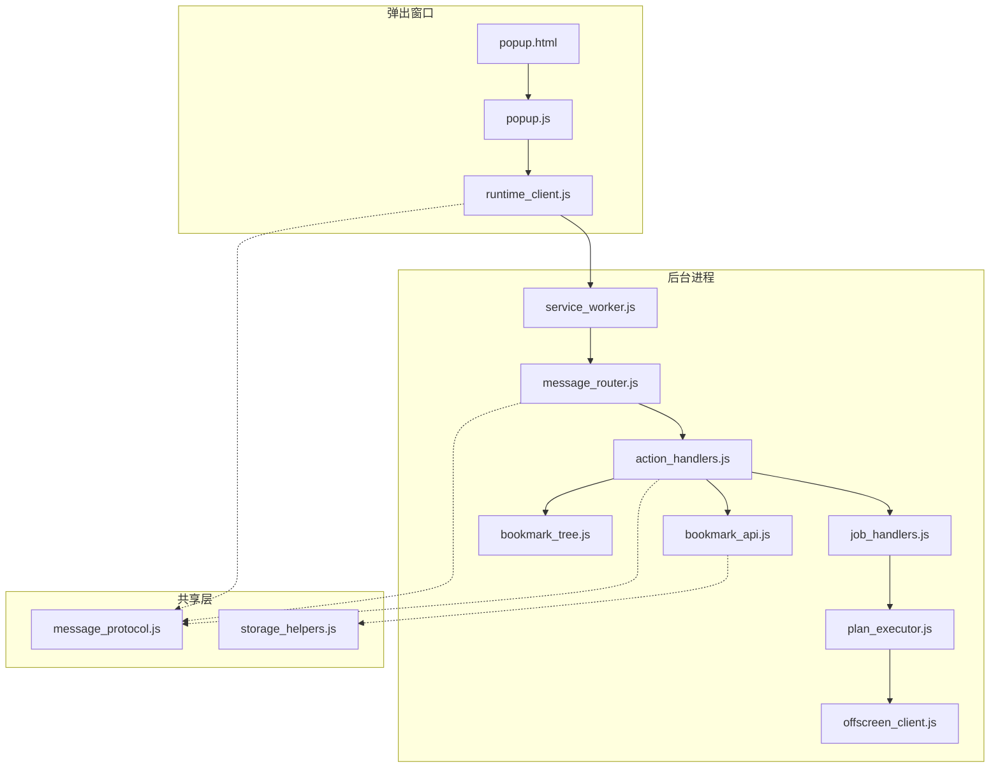
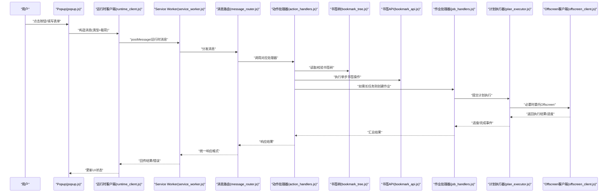
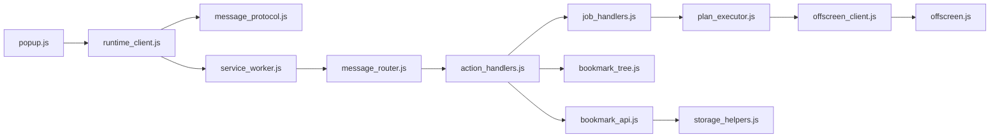
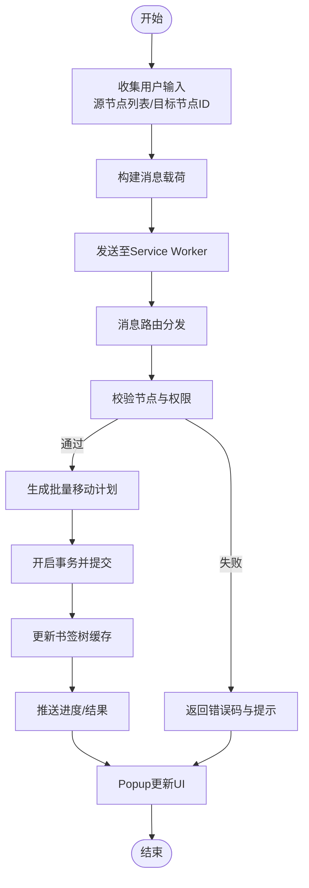

# 用户操作流

<cite>
**本文引用的文件**   
- [manifest.json](file://extension/manifest.json)
- [service_worker.js](file://extension/service_worker.js)
- [popup.html](file://extension/popup.html)
- [popup.js](file://extension/popup.js)
- [runtime_client.js](file://extension/popup/runtime_client.js)
- [message_protocol.js](file://extension/shared/message_protocol.js)
- [message_router.js](file://extension/background/message_router.js)
- [action_handlers.js](file://extension/background/action_handlers.js)
- [bookmark_api.js](file://extension/background/bookmark_api.js)
- [bookmark_tree.js](file://extension/background/bookmark_tree.js)
- [job_handlers.js](file://extension/background/job_handlers.js)
- [plan_executor.js](file://extension/background/plan_executor.js)
- [offscreen_client.js](file://extension/background/offscreen_client.js)
- [offscreen.js](file://extension/offscreen.js)
- [storage_helpers.js](file://extension/storage_helpers.js)
</cite>

## 目录
1. [简介](#简介)
2. [项目结构](#项目结构)
3. [核心组件](#核心组件)
4. [架构总览](#架构总览)
5. [详细组件分析](#详细组件分析)
6. [依赖关系分析](#依赖关系分析)
7. [性能考虑](#性能考虑)
8. [故障排查指南](#故障排查指南)
9. [结论](#结论)
10. [附录](#附录)

## 简介
本文件面向“用户操作流”的数据流与交互路径，聚焦从 Popup 界面到书签操作的完整链路：用户输入、消息路由、后台服务处理、异步状态同步与最终书签 API 调用。文档同时覆盖事件监听与消息传递机制、错误处理与用户提示策略，并通过关键数据转换的示例路径说明如何保证 UI 状态与书签实际状态的一致性。

## 项目结构
该扩展采用浏览器扩展标准架构：Popup 页面负责用户交互；Service Worker 作为后台进程承载消息路由、任务编排与书签 API 访问；可选 Offscreen Document 用于执行受限或长时间运行的任务；共享协议定义前后端消息契约。

图表来源
- [popup.html:1-200](file://extension/popup.html#L1-L200)
- [popup.js:1-200](file://extension/popup.js#L1-L200)
- [runtime_client.js:1-200](file://extension/popup/runtime_client.js#L1-L200)
- [service_worker.js:1-200](file://extension/service_worker.js#L1-L200)
- [message_router.js:1-200](file://extension/background/message_router.js#L1-L200)
- [action_handlers.js:1-200](file://extension/background/action_handlers.js#L1-L200)
- [bookmark_api.js:1-200](file://extension/background/bookmark_api.js#L1-L200)
- [bookmark_tree.js:1-200](file://extension/background/bookmark_tree.js#L1-L200)
- [job_handlers.js:1-200](file://extension/background/job_handlers.js#L1-L200)
- [plan_executor.js:1-200](file://extension/background/plan_executor.js#L1-L200)
- [offscreen_client.js:1-200](file://extension/background/offscreen_client.js#L1-L200)
- [message_protocol.js:1-200](file://extension/shared/message_protocol.js#L1-L200)
- [storage_helpers.js:1-200](file://extension/storage_helpers.js#L1-L200)

章节来源
- [manifest.json:1-200](file://extension/manifest.json#L1-L200)
- [service_worker.js:1-200](file://extension/service_worker.js#L1-L200)
- [popup.html:1-200](file://extension/popup.html#L1-L200)
- [popup.js:1-200](file://extension/popup.js#L1-L200)
- [runtime_client.js:1-200](file://extension/popup/runtime_client.js#L1-L200)
- [message_protocol.js:1-200](file://extension/shared/message_protocol.js#L1-L200)
- [message_router.js:1-200](file://extension/background/message_router.js#L1-L200)
- [action_handlers.js:1-200](file://extension/background/action_handlers.js#L1-L200)
- [bookmark_api.js:1-200](file://extension/background/bookmark_api.js#L1-L200)
- [bookmark_tree.js:1-200](file://extension/background/bookmark_tree.js#L1-L200)
- [job_handlers.js:1-200](file://extension/background/job_handlers.js#L1-L200)
- [plan_executor.js:1-200](file://extension/background/plan_executor.js#L1-L200)
- [offscreen_client.js:1-200](file://extension/background/offscreen_client.js#L1-L200)
- [storage_helpers.js:1-200](file://extension/storage_helpers.js#L1-L200)

## 核心组件
- 弹出窗口（Popup）
  - 负责渲染用户界面、收集用户输入、发起请求并展示结果与错误。
  - 通过运行时客户端向 Service Worker 发送结构化消息。
- 消息协议（Message Protocol）
  - 统一消息类型、载荷结构与回调约定，确保前后端一致。
- 消息路由（Message Router）
  - 在 Service Worker 中注册处理器，按消息类型分发到具体动作处理器。
- 动作处理器（Action Handlers）
  - 实现具体业务逻辑，如读取/更新书签树、创建/执行计划任务等。
- 书签 API（Bookmark API）
  - 封装浏览器书签 API 的读写、批量操作与事务语义。
- 书签树（Bookmark Tree）
  - 维护本地缓存的书签树视图，提供高效查询与增量更新。
- 作业处理器（Job Handlers）
  - 管理长耗时任务的创建、调度、进度上报与完成回调。
- 计划执行器（Plan Executor）
  - 解析并执行由 AI 生成的重组计划，协调多步书签变更。
- Offscreen 客户端与服务
  - 将受限或长时间运行任务卸载至 Offscreen Document，避免阻塞主线程。
- 存储辅助（Storage Helpers）
  - 提供持久化与跨上下文的状态同步工具。

章节来源
- [popup.js:1-200](file://extension/popup.js#L1-L200)
- [runtime_client.js:1-200](file://extension/popup/runtime_client.js#L1-L200)
- [message_protocol.js:1-200](file://extension/shared/message_protocol.js#L1-L200)
- [message_router.js:1-200](file://extension/background/message_router.js#L1-L200)
- [action_handlers.js:1-200](file://extension/background/action_handlers.js#L1-L200)
- [bookmark_api.js:1-200](file://extension/background/bookmark_api.js#L1-L200)
- [bookmark_tree.js:1-200](file://extension/background/bookmark_tree.js#L1-L200)
- [job_handlers.js:1-200](file://extension/background/job_handlers.js#L1-L200)
- [plan_executor.js:1-200](file://extension/background/plan_executor.js#L1-L200)
- [offscreen_client.js:1-200](file://extension/background/offscreen_client.js#L1-L200)
- [offscreen.js:1-200](file://extension/offscreen.js#L1-L200)
- [storage_helpers.js:1-200](file://extension/storage_helpers.js#L1-L200)

## 架构总览
下图展示了从用户点击到书签落盘的端到端数据流，包括消息路由、作业生命周期与状态回传。

图表来源
- [popup.js:1-200](file://extension/popup.js#L1-L200)
- [runtime_client.js:1-200](file://extension/popup/runtime_client.js#L1-L200)
- [service_worker.js:1-200](file://extension/service_worker.js#L1-L200)
- [message_router.js:1-200](file://extension/background/message_router.js#L1-L200)
- [action_handlers.js:1-200](file://extension/background/action_handlers.js#L1-L200)
- [bookmark_tree.js:1-200](file://extension/background/bookmark_tree.js#L1-L200)
- [bookmark_api.js:1-200](file://extension/background/bookmark_api.js#L1-L200)
- [job_handlers.js:1-200](file://extension/background/job_handlers.js#L1-L200)
- [plan_executor.js:1-200](file://extension/background/plan_executor.js#L1-L200)
- [offscreen_client.js:1-200](file://extension/background/offscreen_client.js#L1-L200)

## 详细组件分析

### 弹出窗口与运行时客户端
- 职责
  - 捕获用户输入，构建符合消息协议的消息对象，发送到 Service Worker。
  - 接收响应后更新 UI，显示成功、失败与中间状态。
- 关键点
  - 消息类型与载荷字段需严格遵循共享协议。
  - 对网络/系统异常进行兜底处理，避免 UI 卡死。
  - 使用去抖/节流减少重复提交。

章节来源
- [popup.js:1-200](file://extension/popup.js#L1-L200)
- [runtime_client.js:1-200](file://extension/popup/runtime_client.js#L1-L200)
- [message_protocol.js:1-200](file://extension/shared/message_protocol.js#L1-L200)

### 消息协议与路由
- 职责
  - 定义消息类型、载荷结构、回调约定与错误码。
  - 在 Service Worker 中注册处理器映射，按类型分发。
- 关键点
  - 所有跨上下文通信必须携带类型标识与必要字段。
  - 路由层应记录日志与超时控制，便于排障。

章节来源
- [message_protocol.js:1-200](file://extension/shared/message_protocol.js#L1-L200)
- [message_router.js:1-200](file://extension/background/message_router.js#L1-L200)
- [service_worker.js:1-200](file://extension/service_worker.js#L1-L200)

### 动作处理器与书签 API
- 职责
  - 根据消息类型执行业务逻辑：读取/校验书签树、执行单步变更、触发作业。
  - 调用书签 API 完成实际的增删改查。
- 关键点
  - 对批量操作使用事务语义，保证一致性。
  - 对权限不足、节点不存在等边界条件给出明确错误码。

章节来源
- [action_handlers.js:1-200](file://extension/background/action_handlers.js#L1-L200)
- [bookmark_api.js:1-200](file://extension/background/bookmark_api.js#L1-L200)
- [bookmark_tree.js:1-200](file://extension/background/bookmark_tree.js#L1-L200)

### 作业处理器与计划执行器
- 职责
  - 管理长耗时任务的生命周期：创建、调度、进度上报、完成/失败回调。
  - 解析并执行计划，协调多步书签变更，必要时委托 Offscreen。
- 关键点
  - 进度事件需稳定回传，供 UI 展示百分比或步骤信息。
  - 失败重试与幂等性设计，避免重复执行造成副作用。

章节来源
- [job_handlers.js:1-200](file://extension/background/job_handlers.js#L1-L200)
- [plan_executor.js:1-200](file://extension/background/plan_executor.js#L1-L200)
- [offscreen_client.js:1-200](file://extension/background/offscreen_client.js#L1-L200)
- [offscreen.js:1-200](file://extension/offscreen.js#L1-L200)

### 存储辅助与状态同步
- 职责
  - 提供持久化读写、跨上下文状态同步与版本兼容。
- 关键点
  - 写入前做最小差异计算，降低 I/O 压力。
  - 冲突解决策略与回滚机制保障 UI 与后端一致。

章节来源
- [storage_helpers.js:1-200](file://extension/storage_helpers.js#L1-L200)

## 依赖关系分析
- 耦合关系
  - Popup 仅依赖运行时客户端与消息协议，保持轻耦合。
  - Service Worker 内部通过消息路由解耦各处理器。
  - 动作处理器依赖书签 API 与书签树，作业处理器依赖计划执行器与 Offscreen 客户端。
- 外部依赖
  - 浏览器书签 API、运行时消息通道、Offscreen Document API。

图表来源
- [popup.js:1-200](file://extension/popup.js#L1-L200)
- [runtime_client.js:1-200](file://extension/popup/runtime_client.js#L1-L200)
- [message_protocol.js:1-200](file://extension/shared/message_protocol.js#L1-L200)
- [service_worker.js:1-200](file://extension/service_worker.js#L1-L200)
- [message_router.js:1-200](file://extension/background/message_router.js#L1-L200)
- [action_handlers.js:1-200](file://extension/background/action_handlers.js#L1-L200)
- [bookmark_api.js:1-200](file://extension/background/bookmark_api.js#L1-L200)
- [bookmark_tree.js:1-200](file://extension/background/bookmark_tree.js#L1-L200)
- [job_handlers.js:1-200](file://extension/background/job_handlers.js#L1-L200)
- [plan_executor.js:1-200](file://extension/background/plan_executor.js#L1-L200)
- [offscreen_client.js:1-200](file://extension/background/offscreen_client.js#L1-L200)
- [offscreen.js:1-200](file://extension/offscreen.js#L1-L200)
- [storage_helpers.js:1-200](file://extension/storage_helpers.js#L1-L200)

章节来源
- [manifest.json:1-200](file://extension/manifest.json#L1-L200)
- [service_worker.js:1-200](file://extension/service_worker.js#L1-L200)

## 性能考虑
- 批量操作合并：将多次小变更合并为一次事务，减少书签 API 调用次数。
- 懒加载与增量更新：按需加载书签子树，变更时仅推送差异。
- Offscreen 卸载：将 CPU 密集或长时间任务移至 Offscreen，避免阻塞 UI。
- 去抖与防重：对高频用户输入与重复提交进行限流与幂等处理。
- 进度反馈：对长任务提供稳定的进度事件，提升用户体验。

[本节为通用指导，不直接分析具体文件]

## 故障排查指南
- 常见问题定位
  - 消息未到达：检查消息类型与载荷是否符合协议，确认路由是否注册。
  - 权限不足：确认扩展权限与目标节点可写性。
  - 节点不存在：校验父节点 ID 与路径有效性。
  - 并发冲突：观察作业队列与锁机制，避免重复执行。
- 错误处理与用户提示
  - 统一错误码与人类可读消息，Popup 侧分类展示。
  - 对可恢复错误提供重试入口，对不可恢复错误提供导出与反馈渠道。
- 调试建议
  - 在路由与处理器层增加结构化日志。
  - 使用离线回放与快照对比定位不一致问题。

章节来源
- [message_protocol.js:1-200](file://extension/shared/message_protocol.js#L1-L200)
- [message_router.js:1-200](file://extension/background/message_router.js#L1-L200)
- [action_handlers.js:1-200](file://extension/background/action_handlers.js#L1-L200)
- [bookmark_api.js:1-200](file://extension/background/bookmark_api.js#L1-L200)
- [job_handlers.js:1-200](file://extension/background/job_handlers.js#L1-L200)

## 结论
通过清晰的消息协议与路由机制，Popup 与后台服务实现了松耦合协作；书签 API 与书签树共同保证了数据一致性与高性能；作业处理器与计划执行器支撑了复杂场景下的可靠执行；Offscreen 进一步提升了可扩展性与稳定性。配合完善的错误处理与用户提示，整体用户操作流具备高可用与良好体验。

[本节为总结性内容，不直接分析具体文件]

## 附录

### 关键数据转换流程（以“批量移动书签”为例）
- 输入阶段
  - Popup 收集源节点列表与目标节点 ID，生成消息载荷。
- 校验阶段
  - 动作处理器校验节点存在性与可写性，必要时从书签树拉取最新视图。
- 执行阶段
  - 将批量移动转换为一系列原子操作，并在事务中提交。
- 同步阶段
  - 更新本地书签树缓存，向 Popup 推送进度与最终结果。
- 反馈阶段
  - Popup 根据结果更新 UI，显示成功或错误详情。

图表来源
- [popup.js:1-200](file://extension/popup.js#L1-L200)
- [runtime_client.js:1-200](file://extension/popup/runtime_client.js#L1-L200)
- [message_protocol.js:1-200](file://extension/shared/message_protocol.js#L1-L200)
- [message_router.js:1-200](file://extension/background/message_router.js#L1-L200)
- [action_handlers.js:1-200](file://extension/background/action_handlers.js#L1-L200)
- [bookmark_tree.js:1-200](file://extension/background/bookmark_tree.js#L1-L200)
- [bookmark_api.js:1-200](file://extension/background/bookmark_api.js#L1-L200)

章节来源
- [popup.js:1-200](file://extension/popup.js#L1-L200)
- [runtime_client.js:1-200](file://extension/popup/runtime_client.js#L1-L200)
- [message_protocol.js:1-200](file://extension/shared/message_protocol.js#L1-L200)
- [message_router.js:1-200](file://extension/background/message_router.js#L1-L200)
- [action_handlers.js:1-200](file://extension/background/action_handlers.js#L1-L200)
- [bookmark_tree.js:1-200](file://extension/background/bookmark_tree.js#L1-L200)
- [bookmark_api.js:1-200](file://extension/background/bookmark_api.js#L1-L200)