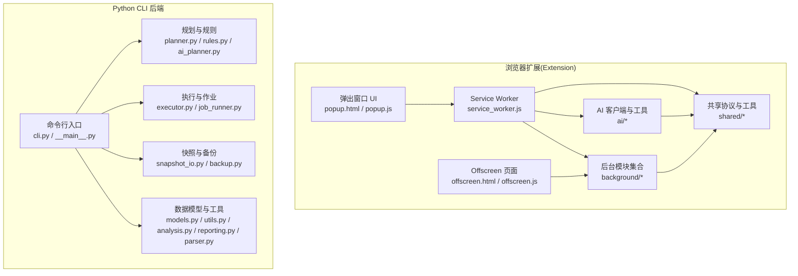
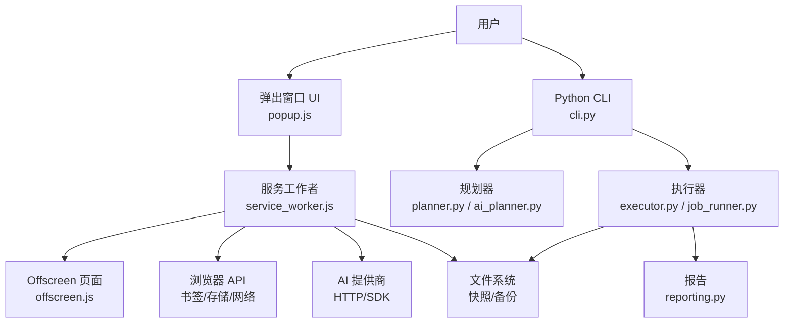
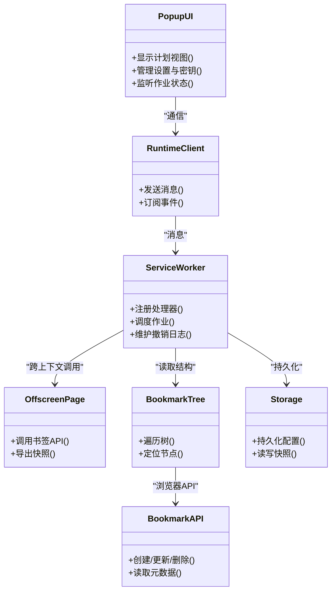
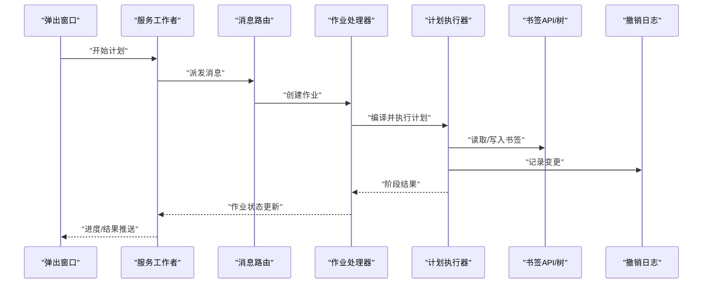
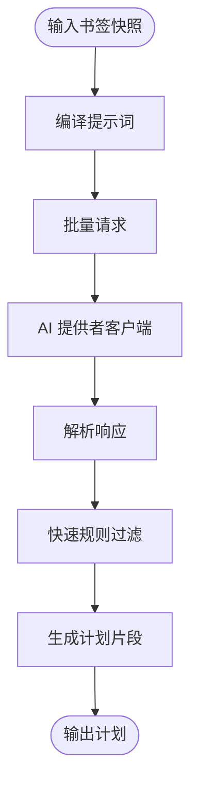
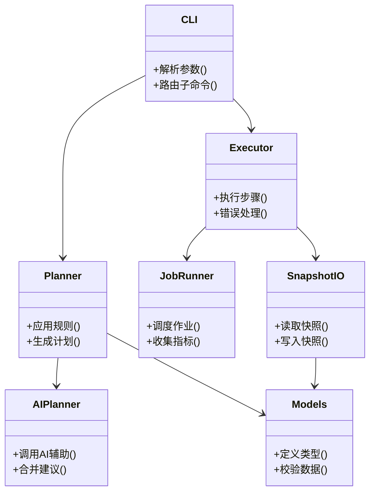
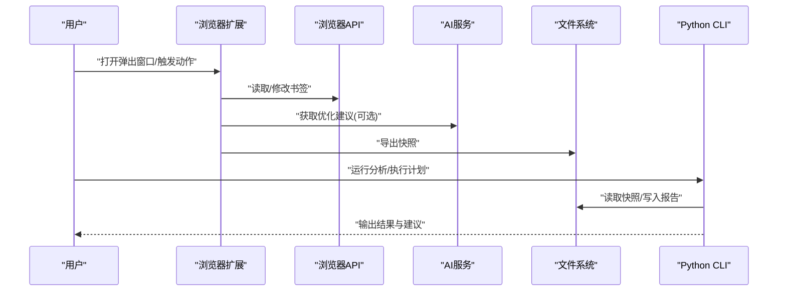
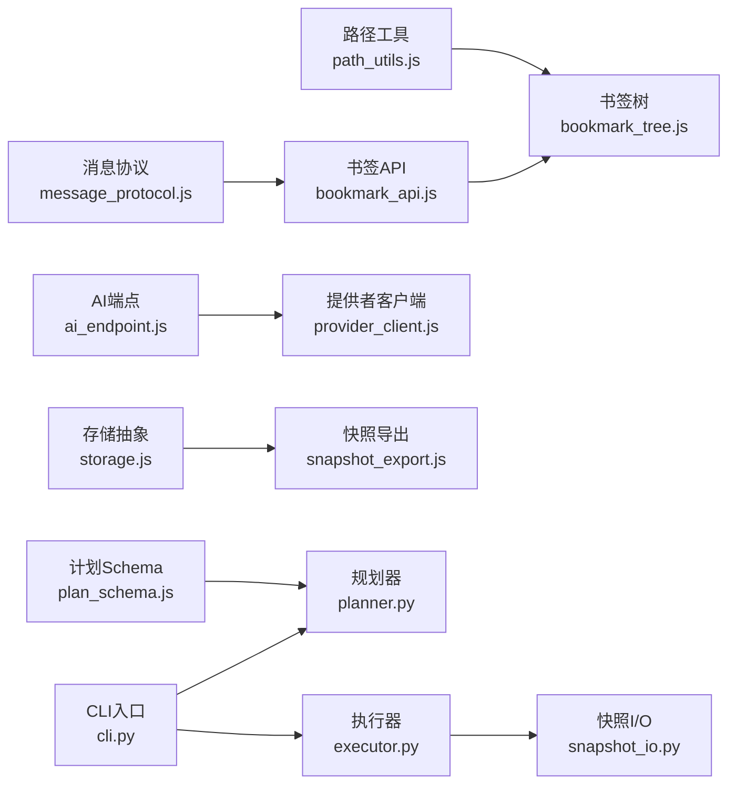

# 整体架构概览

<cite>
**本文引用的文件**   
- [README.md](file://README.md)
- [manifest.json](file://extension/manifest.json)
- [service_worker.js](file://extension/service_worker.js)
- [offscreen.html](file://extension/offscreen.html)
- [offscreen.js](file://extension/offscreen.js)
- [action_handlers.js](file://extension/background/action_handlers.js)
- [bookmark_api.js](file://extension/background/bookmark_api.js)
- [bookmark_tree.js](file://extension/background/bookmark_tree.js)
- [execution_policy.js](file://extension/background/execution_policy.js)
- [job_handlers.js](file://extension/background/job_handlers.js)
- [job_lifecycle.js](file://extension/background/job_lifecycle.js)
- [job_store.js](file://extension/background/job_store.js)
- [message_router.js](file://extension/background/message_router.js)
- [plan_executor.js](file://extension/background/plan_executor.js)
- [snapshot_export.js](file://extension/background/snapshot_export.js)
- [undo_log.js](file://extension/background/undo_log.js)
- [popup.html](file://extension/popup.html)
- [popup.js](file://extension/popup.js)
- [runtime_client.js](file://extension/popup/runtime_client.js)
- [settings_store.js](file://extension/popup/settings_store.js)
- [secrets.js](file://extension/popup/secrets.js)
- [i18n.js](file://extension/popup/i18n.js)
- [job_state.js](file://extension/popup/job_state.js)
- [plan_view.js](file://extension/popup/plan_view.js)
- [ai_endpoint.js](file://extension/shared/ai_endpoint.js)
- [message_protocol.js](file://extension/shared/message_protocol.js)
- [path_utils.js](file://extension/shared/path_utils.js)
- [plan_schema.js](file://extension/shared/plan_schema.js)
- [storage.js](file://extension/shared/storage.js)
- [ai_planner.js](file://extension/ai_planner.js)
- [batching.js](file://extension/ai/batching.js)
- [fast_rules.js](file://extension/ai/fast_rules.js)
- [plan_compiler.js](file://extension/ai/plan_compiler.js)
- [prompt_codec.js](file://extension/ai/prompt_codec.js)
- [provider_client.js](file://extension/ai/provider_client.js)
- [response_codec.js](file://extension/ai/response_codec.js)
- [snapshot_model.js](file://extension/ai/snapshot_model.js)
- [cli.py](file://src/bookmark_advisor/cli.py)
- [__main__.py](file://src/bookmark_advisor/__main__.py)
- [ai_planner.py](file://src/bookmark_advisor/ai_planner.py)
- [analysis.py](file://src/bookmark_advisor/analysis.py)
- [backup.py](file://src/bookmark_advisor/backup.py)
- [executor.py](file://src/bookmark_advisor/executor.py)
- [job_runner.py](file://src/bookmark_advisor/job_runner.py)
- [models.py](file://src/bookmark_advisor/models.py)
- [parser.py](file://src/bookmark_advisor/parser.py)
- [planner.py](file://src/bookmark_advisor/planner.py)
- [reporting.py](file://src/bookmark_advisor/reporting.py)
- [rules.py](file://src/bookmark_advisor/rules.py)
- [snapshot_io.py](file://src/bookmark_advisor/snapshot_io.py)
- [utils.py](file://src/bookmark_advisor/utils.py)
</cite>

## 目录
1. [简介](#简介)
2. [项目结构](#项目结构)
3. [核心组件](#核心组件)
4. [架构总览](#架构总览)
5. [详细组件分析](#详细组件分析)
6. [依赖关系分析](#依赖关系分析)
7. [性能与可扩展性](#性能与可扩展性)
8. [故障排查指南](#故障排查指南)
9. [结论](#结论)
10. [附录](#附录)

## 简介
本文件为 Edge Bookmark 的整体架构概览，聚焦双端（浏览器扩展前端 + Python CLI 后端）的分层设计与职责划分。系统采用清晰的分层模式：UI 层、业务逻辑层、数据访问层分离；通过共享协议与消息路由实现前后端解耦；以 JavaScript/TypeScript 构建浏览器侧交互与计划执行，Python 提供离线批处理、AI 规划与报告能力。文档同时说明技术栈选择原因、系统边界与外部依赖，并提供高层架构图与可扩展性建议。

## 项目结构
仓库按“前端扩展”和“后端工具”两大域组织：
- extension：Edge 浏览器扩展源码，包含 Service Worker、Offscreen 页面、Popup UI、背景任务、AI 客户端与共享协议等。
- src/bookmark_advisor：Python CLI 包，提供命令行入口、计划生成、规则解析、快照 I/O、执行器与报告等。
- tests：覆盖前后端关键路径的测试用例。
- docs：设计文档与审计记录。

图表来源
- [service_worker.js](file://extension/service_worker.js)
- [offscreen.html](file://extension/offscreen.html)
- [offscreen.js](file://extension/offscreen.js)
- [popup.html](file://extension/popup.html)
- [popup.js](file://extension/popup.js)
- [action_handlers.js](file://extension/background/action_handlers.js)
- [bookmark_api.js](file://extension/background/bookmark_api.js)
- [bookmark_tree.js](file://extension/background/bookmark_tree.js)
- [execution_policy.js](file://extension/background/execution_policy.js)
- [job_handlers.js](file://extension/background/job_handlers.js)
- [job_lifecycle.js](file://extension/background/job_lifecycle.js)
- [job_store.js](file://extension/background/job_store.js)
- [message_router.js](file://extension/background/message_router.js)
- [plan_executor.js](file://extension/background/plan_executor.js)
- [snapshot_export.js](file://extension/background/snapshot_export.js)
- [undo_log.js](file://extension/background/undo_log.js)
- [runtime_client.js](file://extension/popup/runtime_client.js)
- [settings_store.js](file://extension/popup/settings_store.js)
- [secrets.js](file://extension/popup/secrets.js)
- [i18n.js](file://extension/popup/i18n.js)
- [job_state.js](file://extension/popup/job_state.js)
- [plan_view.js](file://extension/popup/plan_view.js)
- [ai_endpoint.js](file://extension/shared/ai_endpoint.js)
- [message_protocol.js](file://extension/shared/message_protocol.js)
- [path_utils.js](file://extension/shared/path_utils.js)
- [plan_schema.js](file://extension/shared/plan_schema.js)
- [storage.js](file://extension/shared/storage.js)
- [batching.js](file://extension/ai/batching.js)
- [fast_rules.js](file://extension/ai/fast_rules.js)
- [plan_compiler.js](file://extension/ai/plan_compiler.js)
- [prompt_codec.js](file://extension/ai/prompt_codec.js)
- [provider_client.js](file://extension/ai/provider_client.js)
- [response_codec.js](file://extension/ai/response_codec.js)
- [snapshot_model.js](file://extension/ai/snapshot_model.js)
- [cli.py](file://src/bookmark_advisor/cli.py)
- [__main__.py](file://src/bookmark_advisor/__main__.py)
- [ai_planner.py](file://src/bookmark_advisor/ai_planner.py)
- [analysis.py](file://src/bookmark_advisor/analysis.py)
- [backup.py](file://src/bookmark_advisor/backup.py)
- [executor.py](file://src/bookmark_advisor/executor.py)
- [job_runner.py](file://src/bookmark_advisor/job_runner.py)
- [models.py](file://src/bookmark_advisor/models.py)
- [parser.py](file://src/bookmark_advisor/parser.py)
- [planner.py](file://src/bookmark_advisor/planner.py)
- [reporting.py](file://src/bookmark_advisor/reporting.py)
- [rules.py](file://src/bookmark_advisor/rules.py)
- [snapshot_io.py](file://src/bookmark_advisor/snapshot_io.py)
- [utils.py](file://src/bookmark_advisor/utils.py)

章节来源
- [README.md](file://README.md)
- [manifest.json](file://extension/manifest.json)

## 核心组件
- 浏览器扩展前端
  - UI 层：弹出窗口负责用户交互、设置管理、多语言与密钥管理、计划可视化与作业状态展示。
  - 业务逻辑层：Service Worker 与 Offscreen 页面承载后台任务编排、计划执行策略、作业生命周期与撤销日志。
  - 数据访问层：书签树与 API 封装、本地存储与快照导出、路径与 Schema 校验。
  - AI 客户端：批量请求、提示词编解码、响应解析、快照模型与快速规则匹配。
- Python CLI 后端
  - 命令入口与参数解析。
  - 规划与规则引擎：基于规则与可选 AI 辅助生成优化计划。
  - 执行器与作业运行器：驱动计划落地并产出报告。
  - 快照与备份：读写结构化快照，支持导入导出。
  - 数据模型与工具：统一类型定义、通用工具与分析报表。

章节来源
- [service_worker.js](file://extension/service_worker.js)
- [offscreen.js](file://extension/offscreen.js)
- [popup.js](file://extension/popup.js)
- [action_handlers.js](file://extension/background/action_handlers.js)
- [bookmark_api.js](file://extension/background/bookmark_api.js)
- [bookmark_tree.js](file://extension/background/bookmark_tree.js)
- [execution_policy.js](file://extension/background/execution_policy.js)
- [job_handlers.js](file://extension/background/job_handlers.js)
- [job_lifecycle.js](file://extension/background/job_lifecycle.js)
- [job_store.js](file://extension/background/job_store.js)
- [message_router.js](file://extension/background/message_router.js)
- [plan_executor.js](file://extension/background/plan_executor.js)
- [snapshot_export.js](file://extension/background/snapshot_export.js)
- [undo_log.js](file://extension/background/undo_log.js)
- [runtime_client.js](file://extension/popup/runtime_client.js)
- [settings_store.js](file://extension/popup/settings_store.js)
- [secrets.js](file://extension/popup/secrets.js)
- [i18n.js](file://extension/popup/i18n.js)
- [job_state.js](file://extension/popup/job_state.js)
- [plan_view.js](file://extension/popup/plan_view.js)
- [ai_endpoint.js](file://extension/shared/ai_endpoint.js)
- [message_protocol.js](file://extension/shared/message_protocol.js)
- [path_utils.js](file://extension/shared/path_utils.js)
- [plan_schema.js](file://extension/shared/plan_schema.js)
- [storage.js](file://extension/shared/storage.js)
- [batching.js](file://extension/ai/batching.js)
- [fast_rules.js](file://extension/ai/fast_rules.js)
- [plan_compiler.js](file://extension/ai/plan_compiler.js)
- [prompt_codec.js](file://extension/ai/prompt_codec.js)
- [provider_client.js](file://extension/ai/provider_client.js)
- [response_codec.js](file://extension/ai/response_codec.js)
- [snapshot_model.js](file://extension/ai/snapshot_model.js)
- [cli.py](file://src/bookmark_advisor/cli.py)
- [__main__.py](file://src/bookmark_advisor/__main__.py)
- [ai_planner.py](file://src/bookmark_advisor/ai_planner.py)
- [analysis.py](file://src/bookmark_advisor/analysis.py)
- [backup.py](file://src/bookmark_advisor/backup.py)
- [executor.py](file://src/bookmark_advisor/executor.py)
- [job_runner.py](file://src/bookmark_advisor/job_runner.py)
- [models.py](file://src/bookmark_advisor/models.py)
- [parser.py](file://src/bookmark_advisor/parser.py)
- [planner.py](file://src/bookmark_advisor/planner.py)
- [reporting.py](file://src/bookmark_advisor/reporting.py)
- [rules.py](file://src/bookmark_advisor/rules.py)
- [snapshot_io.py](file://src/bookmark_advisor/snapshot_io.py)
- [utils.py](file://src/bookmark_advisor/utils.py)

## 架构总览
系统采用“前端在浏览器内即时交互 + 后端离线批处理”的双端架构。前端通过 Service Worker 协调 Offscreen 页面完成受限权限操作，使用共享协议与 Popup 通信；后端通过 CLI 暴露规划、执行与报告能力。两者通过“计划/快照/规则”等契约进行松耦合协作。

图表来源
- [service_worker.js](file://extension/service_worker.js)
- [offscreen.js](file://extension/offscreen.js)
- [popup.js](file://extension/popup.js)
- [bookmark_api.js](file://extension/background/bookmark_api.js)
- [ai_endpoint.js](file://extension/shared/ai_endpoint.js)
- [provider_client.js](file://extension/ai/provider_client.js)
- [snapshot_export.js](file://extension/background/snapshot_export.js)
- [cli.py](file://src/bookmark_advisor/cli.py)
- [planner.py](file://src/bookmark_advisor/planner.py)
- [ai_planner.py](file://src/bookmark_advisor/ai_planner.py)
- [executor.py](file://src/bookmark_advisor/executor.py)
- [job_runner.py](file://src/bookmark_advisor/job_runner.py)
- [reporting.py](file://src/bookmark_advisor/reporting.py)
- [snapshot_io.py](file://src/bookmark_advisor/snapshot_io.py)

## 详细组件分析

### 浏览器扩展前端分层
- UI 层
  - 弹出窗口负责渲染计划视图、作业状态、设置与密钥管理、国际化。
  - 运行时客户端用于与服务工作者通信，触发动作与查询状态。
- 业务逻辑层
  - Service Worker 作为中枢，分发消息、编排作业生命周期、执行计划、维护撤销日志。
  - Offscreen 页面承担需要 DOM/书签 API 的操作，降低主线程阻塞风险。
- 数据访问层
  - 书签树与 API 封装对浏览器书签进行增删改查与树形遍历。
  - 本地存储与快照导出提供持久化与迁移能力。
  - 路径与 Schema 工具确保数据结构一致性。

图表来源
- [popup.js](file://extension/popup.js)
- [runtime_client.js](file://extension/popup/runtime_client.js)
- [service_worker.js](file://extension/service_worker.js)
- [offscreen.js](file://extension/offscreen.js)
- [bookmark_tree.js](file://extension/background/bookmark_tree.js)
- [bookmark_api.js](file://extension/background/bookmark_api.js)
- [storage.js](file://extension/shared/storage.js)

章节来源
- [popup.html](file://extension/popup.html)
- [popup.js](file://extension/popup.js)
- [runtime_client.js](file://extension/popup/runtime_client.js)
- [settings_store.js](file://extension/popup/settings_store.js)
- [secrets.js](file://extension/popup/secrets.js)
- [i18n.js](file://extension/popup/i18n.js)
- [job_state.js](file://extension/popup/job_state.js)
- [plan_view.js](file://extension/popup/plan_view.js)
- [service_worker.js](file://extension/service_worker.js)
- [offscreen.html](file://extension/offscreen.html)
- [offscreen.js](file://extension/offscreen.js)
- [bookmark_tree.js](file://extension/background/bookmark_tree.js)
- [bookmark_api.js](file://extension/background/bookmark_api.js)
- [storage.js](file://extension/shared/storage.js)

### 计划执行与作业生命周期
- 消息路由将来自 UI 的请求转发到具体处理器。
- 作业处理器根据执行策略决定并发度、重试与回滚。
- 计划编译器将高层意图编译为可执行步骤，执行器逐步推进。
- 撤销日志记录变更以便失败恢复。

图表来源
- [message_router.js](file://extension/background/message_router.js)
- [job_handlers.js](file://extension/background/job_handlers.js)
- [plan_executor.js](file://extension/background/plan_executor.js)
- [bookmark_api.js](file://extension/background/bookmark_api.js)
- [bookmark_tree.js](file://extension/background/bookmark_tree.js)
- [undo_log.js](file://extension/background/undo_log.js)
- [job_lifecycle.js](file://extension/background/job_lifecycle.js)
- [execution_policy.js](file://extension/background/execution_policy.js)

章节来源
- [message_router.js](file://extension/background/message_router.js)
- [job_handlers.js](file://extension/background/job_handlers.js)
- [plan_executor.js](file://extension/background/plan_executor.js)
- [bookmark_api.js](file://extension/background/bookmark_api.js)
- [bookmark_tree.js](file://extension/background/bookmark_tree.js)
- [undo_log.js](file://extension/background/undo_log.js)
- [job_lifecycle.js](file://extension/background/job_lifecycle.js)
- [execution_policy.js](file://extension/background/execution_policy.js)

### AI 客户端与快速规则
- 提示词与响应编解码保证与后端一致的语义。
- 提供者客户端抽象不同 AI 服务的接口，支持批量与重试。
- 快照模型与快速规则用于预筛选与加速决策。

图表来源
- [prompt_codec.js](file://extension/ai/prompt_codec.js)
- [response_codec.js](file://extension/ai/response_codec.js)
- [provider_client.js](file://extension/ai/provider_client.js)
- [batching.js](file://extension/ai/batching.js)
- [fast_rules.js](file://extension/ai/fast_rules.js)
- [snapshot_model.js](file://extension/ai/snapshot_model.js)
- [plan_compiler.js](file://extension/ai/plan_compiler.js)
- [ai_endpoint.js](file://extension/shared/ai_endpoint.js)

章节来源
- [prompt_codec.js](file://extension/ai/prompt_codec.js)
- [response_codec.js](file://extension/ai/response_codec.js)
- [provider_client.js](file://extension/ai/provider_client.js)
- [batching.js](file://extension/ai/batching.js)
- [fast_rules.js](file://extension/ai/fast_rules.js)
- [snapshot_model.js](file://extension/ai/snapshot_model.js)
- [plan_compiler.js](file://extension/ai/plan_compiler.js)
- [ai_endpoint.js](file://extension/shared/ai_endpoint.js)

### Python CLI 后端分层
- 命令层：解析参数、加载配置、调度子命令。
- 规划层：规则引擎与可选 AI 辅助生成计划。
- 执行层：作业运行器驱动计划落地，聚合报告。
- 数据层：快照 I/O、备份与模型定义。

图表来源
- [cli.py](file://src/bookmark_advisor/cli.py)
- [__main__.py](file://src/bookmark_advisor/__main__.py)
- [planner.py](file://src/bookmark_advisor/planner.py)
- [ai_planner.py](file://src/bookmark_advisor/ai_planner.py)
- [executor.py](file://src/bookmark_advisor/executor.py)
- [job_runner.py](file://src/bookmark_advisor/job_runner.py)
- [snapshot_io.py](file://src/bookmark_advisor/snapshot_io.py)
- [models.py](file://src/bookmark_advisor/models.py)

章节来源
- [cli.py](file://src/bookmark_advisor/cli.py)
- [__main__.py](file://src/bookmark_advisor/__main__.py)
- [planner.py](file://src/bookmark_advisor/planner.py)
- [ai_planner.py](file://src/bookmark_advisor/ai_planner.py)
- [executor.py](file://src/bookmark_advisor/executor.py)
- [job_runner.py](file://src/bookmark_advisor/job_runner.py)
- [snapshot_io.py](file://src/bookmark_advisor/snapshot_io.py)
- [models.py](file://src/bookmark_advisor/models.py)

### 概念性总览
下图展示了从用户操作到最终结果的端到端流程，涵盖前后端协作与外部依赖。

[此图为概念流程示意，不直接映射具体源文件]

## 依赖关系分析
- 内部依赖
  - 前端各模块通过共享协议与消息路由解耦，避免循环依赖。
  - 后端模块按职责分层，模型与工具被多处复用。
- 外部依赖
  - 浏览器 API：书签、存储、网络、Offscreen 页面。
  - AI 服务：通过提供者客户端抽象，支持多种后端。
  - 文件系统：快照与备份文件的读写。

图表来源
- [message_protocol.js](file://extension/shared/message_protocol.js)
- [plan_schema.js](file://extension/shared/plan_schema.js)
- [path_utils.js](file://extension/shared/path_utils.js)
- [storage.js](file://extension/shared/storage.js)
- [bookmark_api.js](file://extension/background/bookmark_api.js)
- [bookmark_tree.js](file://extension/background/bookmark_tree.js)
- [ai_endpoint.js](file://extension/shared/ai_endpoint.js)
- [provider_client.js](file://extension/ai/provider_client.js)
- [snapshot_export.js](file://extension/background/snapshot_export.js)
- [cli.py](file://src/bookmark_advisor/cli.py)
- [planner.py](file://src/bookmark_advisor/planner.py)
- [executor.py](file://src/bookmark_advisor/executor.py)
- [snapshot_io.py](file://src/bookmark_advisor/snapshot_io.py)

章节来源
- [message_protocol.js](file://extension/shared/message_protocol.js)
- [plan_schema.js](file://extension/shared/plan_schema.js)
- [path_utils.js](file://extension/shared/path_utils.js)
- [storage.js](file://extension/shared/storage.js)
- [bookmark_api.js](file://extension/background/bookmark_api.js)
- [bookmark_tree.js](file://extension/background/bookmark_tree.js)
- [ai_endpoint.js](file://extension/shared/ai_endpoint.js)
- [provider_client.js](file://extension/ai/provider_client.js)
- [snapshot_export.js](file://extension/background/snapshot_export.js)
- [cli.py](file://src/bookmark_advisor/cli.py)
- [planner.py](file://src/bookmark_advisor/planner.py)
- [executor.py](file://src/bookmark_advisor/executor.py)
- [snapshot_io.py](file://src/bookmark_advisor/snapshot_io.py)

## 性能与可扩展性
- 性能特性
  - 批量请求与快速规则在前端减少不必要的 AI 调用与计算开销。
  - Offscreen 页面隔离高代价操作，避免主线程阻塞。
  - 作业执行器支持策略控制（并发、重试、回滚），提升鲁棒性。
- 可扩展性
  - 新增 AI 提供者：实现统一客户端接口即可接入。
  - 新增计划步骤：在计划编译器与执行器中注册新动作。
  - 新增规则：在规则模块中扩展条件与动作。
  - 插件化：通过消息路由与共享协议，未来可引入插件机制扩展功能。

[本节为通用指导，不直接分析具体文件]

## 故障排查指南
- 常见问题定位
  - 消息未到达：检查消息路由注册与协议字段是否一致。
  - 计划执行失败：查看撤销日志与作业状态，确认执行策略与权限。
  - AI 调用异常：核对端点配置、鉴权与限流策略。
  - 快照读写错误：验证路径合法性与文件格式是否符合 Schema。
- 调试建议
  - 启用详细日志与断点，结合作业生命周期回调定位阶段。
  - 使用最小快照复现问题，逐步缩小范围。
  - 对比前后端提示词与响应编解码一致性。

章节来源
- [message_router.js](file://extension/background/message_router.js)
- [job_lifecycle.js](file://extension/background/job_lifecycle.js)
- [execution_policy.js](file://extension/background/execution_policy.js)
- [ai_endpoint.js](file://extension/shared/ai_endpoint.js)
- [provider_client.js](file://extension/ai/provider_client.js)
- [snapshot_export.js](file://extension/background/snapshot_export.js)
- [plan_schema.js](file://extension/shared/plan_schema.js)

## 结论
Edge Bookmark 通过清晰的前后端分层与解耦的消息协议，实现了高内聚、低耦合的可维护架构。前端专注于实时交互与计划执行，后端专注于离线分析与报告。借助批量与快速规则、Offscreen 隔离与策略化执行，系统在可用性与性能之间取得平衡。未来可通过插件化与更多 AI 提供者接入持续演进。

## 附录
- 技术栈选择依据
  - 浏览器扩展使用 JavaScript/TypeScript：原生集成浏览器 API、开发体验成熟、生态完善。
  - Python 用于后端：丰富的数据处理与脚本能力、易于构建 CLI 工具链与自动化流水线。
- 系统边界与外部依赖
  - 浏览器 API：书签、存储、网络、Offscreen。
  - AI 服务：通过抽象客户端适配不同提供商。
  - 文件系统：快照与备份文件的持久化。

[本节为概念性总结，不直接分析具体文件]