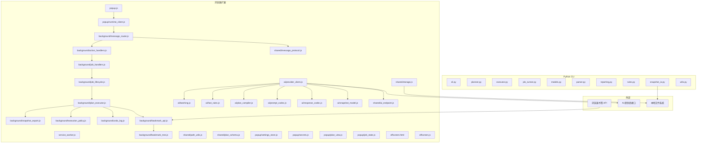
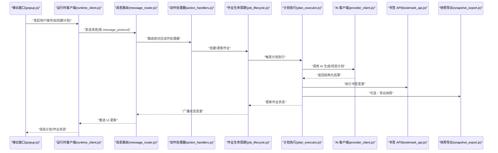
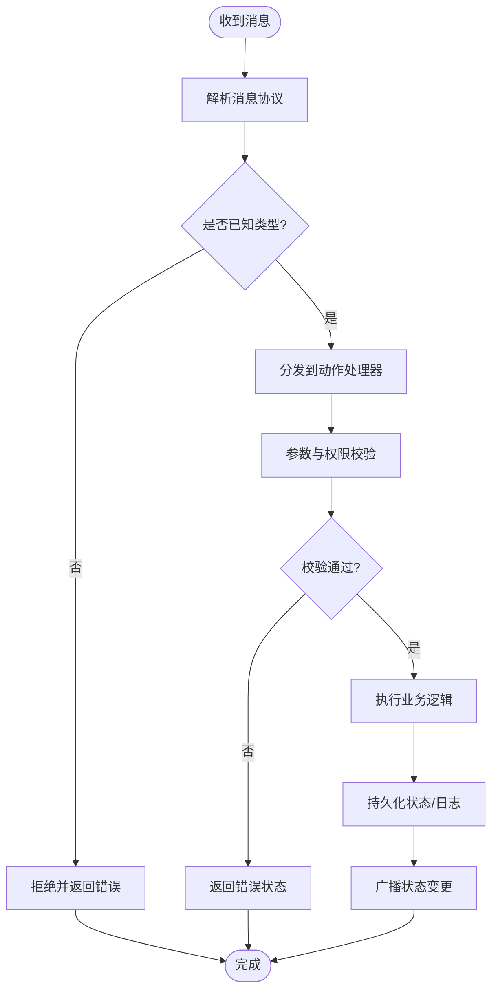
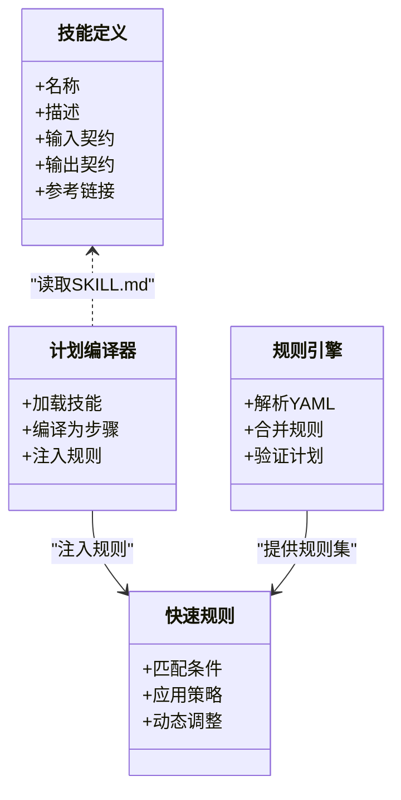
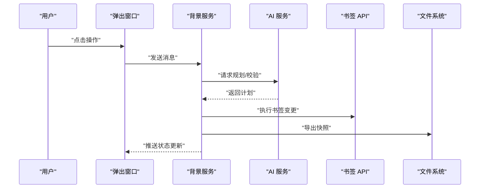
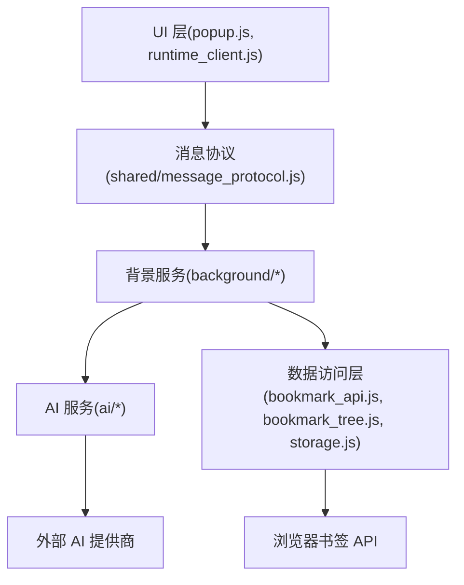
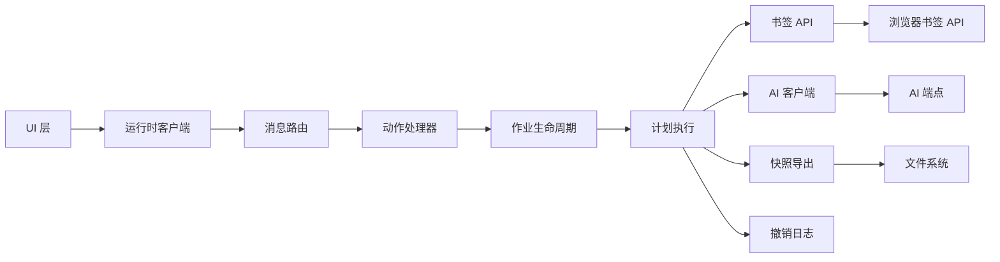

# 架构设计

<cite>
**本文引用的文件**   
- [extension/manifest.json](file://extension/manifest.json)
- [extension/service_worker.js](file://extension/service_worker.js)
- [extension/offscreen.html](file://extension/offscreen.html)
- [extension/offscreen.js](file://extension/offscreen.js)
- [extension/popup.js](file://extension/popup.js)
- [extension/background/message_router.js](file://extension/background/message_router.js)
- [extension/background/action_handlers.js](file://extension/background/action_handlers.js)
- [extension/background/bookmark_api.js](file://extension/background/bookmark_api.js)
- [extension/background/bookmark_tree.js](file://extension/background/bookmark_tree.js)
- [extension/background/job_lifecycle.js](file://extension/background/job_lifecycle.js)
- [extension/background/job_store.js](file://extension/background/job_store.js)
- [extension/background/job_handlers.js](file://extension/background/job_handlers.js)
- [extension/background/plan_executor.js](file://extension/background/plan_executor.js)
- [extension/background/snapshot_export.js](file://extension/background/snapshot_export.js)
- [extension/background/execution_policy.js](file://extension/background/execution_policy.js)
- [extension/background/undo_log.js](file://extension/background/undo_log.js)
- [extension/ai/provider_client.js](file://extension/ai/provider_client.js)
- [extension/ai/batching.js](file://extension/ai/batching.js)
- [extension/ai/fast_rules.js](file://extension/ai/fast_rules.js)
- [extension/ai/plan_compiler.js](file://extension/ai/plan_compiler.js)
- [extension/ai/prompt_codec.js](file://extension/ai/prompt_codec.js)
- [extension/ai/response_codec.js](file://extension/ai/response_codec.js)
- [extension/ai/snapshot_model.js](file://extension/ai/snapshot_model.js)
- [extension/shared/message_protocol.js](file://extension/shared/message_protocol.js)
- [extension/shared/storage.js](file://extension/shared/storage.js)
- [extension/shared/path_utils.js](file://extension/shared/path_utils.js)
- [extension/shared/plan_schema.js](file://extension/shared/plan_schema.js)
- [extension/shared/ai_endpoint.js](file://extension/shared/ai_endpoint.js)
- [extension/popup/runtime_client.js](file://extension/popup/runtime_client.js)
- [extension/popup/settings_store.js](file://extension/popup/settings_store.js)
- [extension/popup/secrets.js](file://extension/popup/secrets.js)
- [extension/popup/plan_view.js](file://extension/popup/plan_view.js)
- [extension/popup/job_state.js](file://extension/popup/job_state.js)
- [src/bookmark_advisor/cli.py](file://src/bookmark_advisor/cli.py)
- [src/bookmark_advisor/planner.py](file://src/bookmark_advisor/planner.py)
- [src/bookmark_advisor/executor.py](file://src/bookmark_advisor/executor.py)
- [src/bookmark_advisor/job_runner.py](file://src/bookmark_advisor/job_runner.py)
- [src/bookmark_advisor/models.py](file://src/bookmark_advisor/models.py)
- [src/bookmark_advisor/parser.py](file://src/bookmark_advisor/parser.py)
- [src/bookmark_advisor/reporting.py](file://src/bookmark_advisor/reporting.py)
- [src/bookmark_advisor/rules.py](file://src/bookmark_advisor/rules.py)
- [src/bookmark_advisor/snapshot_io.py](file://src/bookmark_advisor/snapshot_io.py)
- [src/bookmark_advisor/utils.py](file://src/bookmark_advisor/utils.py)
- [config/rules.yaml](file://config/rules.yaml)
</cite>

## 目录
1. [简介](#简介)
2. [项目结构](#项目结构)
3. [核心组件](#核心组件)
4. [架构总览](#架构总览)
5. [详细组件分析](#详细组件分析)
6. [依赖关系分析](#依赖关系分析)
7. [性能考量](#性能考量)
8. [故障排查指南](#故障排查指南)
9. [结论](#结论)
10. [附录](#附录)

## 简介
本架构设计文档面向 Edge Bookmark 系统，覆盖浏览器扩展与 Python CLI 双端协同的整体架构。文档重点阐述：
- 分层架构（UI 层、业务逻辑层、数据访问层）的职责划分
- 事件驱动的消息传递机制与跨上下文通信协议
- 插件化架构（技能系统与规则引擎）的扩展点设计
- 数据流设计（用户操作流、AI 规划流、作业执行流、快照备份流）
- 核心组件关系与交互模式（背景服务、AI 服务、UI 层、共享模块）

## 项目结构
Edge Bookmark 由两部分组成：
- 浏览器扩展（extension）：负责 UI、消息路由、书签树与作业生命周期管理、计划执行、快照导出、与 AI 服务交互等
- Python CLI（src/bookmark_advisor）：提供命令行入口、规划器、执行器、作业运行器、模型与规则解析、快照 I/O 与报告输出

图表来源
- [extension/service_worker.js](file://extension/service_worker.js)
- [extension/background/message_router.js](file://extension/background/message_router.js)
- [extension/background/action_handlers.js](file://extension/background/action_handlers.js)
- [extension/background/job_handlers.js](file://extension/background/job_handlers.js)
- [extension/background/job_lifecycle.js](file://extension/background/job_lifecycle.js)
- [extension/background/plan_executor.js](file://extension/background/plan_executor.js)
- [extension/background/snapshot_export.js](file://extension/background/snapshot_export.js)
- [extension/background/execution_policy.js](file://extension/background/execution_policy.js)
- [extension/background/undo_log.js](file://extension/background/undo_log.js)
- [extension/background/bookmark_api.js](file://extension/background/bookmark_api.js)
- [extension/background/bookmark_tree.js](file://extension/background/bookmark_tree.js)
- [extension/ai/provider_client.js](file://extension/ai/provider_client.js)
- [extension/ai/batching.js](file://extension/ai/batching.js)
- [extension/ai/fast_rules.js](file://extension/ai/fast_rules.js)
- [extension/ai/plan_compiler.js](file://extension/ai/plan_compiler.js)
- [extension/ai/prompt_codec.js](file://extension/ai/prompt_codec.js)
- [extension/ai/response_codec.js](file://extension/ai/response_codec.js)
- [extension/ai/snapshot_model.js](file://extension/ai/snapshot_model.js)
- [extension/shared/message_protocol.js](file://extension/shared/message_protocol.js)
- [extension/shared/storage.js](file://extension/shared/storage.js)
- [extension/shared/path_utils.js](file://extension/shared/path_utils.js)
- [extension/shared/plan_schema.js](file://extension/shared/plan_schema.js)
- [extension/shared/ai_endpoint.js](file://extension/shared/ai_endpoint.js)
- [extension/popup.js](file://extension/popup.js)
- [extension/popup/runtime_client.js](file://extension/popup/runtime_client.js)
- [extension/popup/settings_store.js](file://extension/popup/settings_store.js)
- [extension/popup/secrets.js](file://extension/popup/secrets.js)
- [extension/popup/plan_view.js](file://extension/popup/plan_view.js)
- [extension/popup/job_state.js](file://extension/popup/job_state.js)
- [extension/offscreen.html](file://extension/offscreen.html)
- [extension/offscreen.js](file://extension/offscreen.js)
- [src/bookmark_advisor/cli.py](file://src/bookmark_advisor/cli.py)
- [src/bookmark_advisor/planner.py](file://src/bookmark_advisor/planner.py)
- [src/bookmark_advisor/executor.py](file://src/bookmark_advisor/executor.py)
- [src/bookmark_advisor/job_runner.py](file://src/bookmark_advisor/job_runner.py)
- [src/bookmark_advisor/models.py](file://src/bookmark_advisor/models.py)
- [src/bookmark_advisor/parser.py](file://src/bookmark_advisor/parser.py)
- [src/bookmark_advisor/reporting.py](file://src/bookmark_advisor/reporting.py)
- [src/bookmark_advisor/rules.py](file://src/bookmark_advisor/rules.py)
- [src/bookmark_advisor/snapshot_io.py](file://src/bookmark_advisor/snapshot_io.py)
- [src/bookmark_advisor/utils.py](file://src/bookmark_advisor/utils.py)

章节来源
- [extension/manifest.json](file://extension/manifest.json)
- [extension/service_worker.js](file://extension/service_worker.js)
- [extension/offscreen.html](file://extension/offscreen.html)
- [extension/offscreen.js](file://extension/offscreen.js)
- [extension/popup.js](file://extension/popup.js)

## 核心组件
- 背景服务（Background Service）
  - 职责：全局状态、消息路由、动作处理、作业生命周期、计划执行、快照导出、撤销日志、执行策略、书签树与 API 封装
  - 关键文件：message_router.js、action_handlers.js、job_handlers.js、job_lifecycle.js、plan_executor.js、snapshot_export.js、execution_policy.js、undo_log.js、bookmark_api.js、bookmark_tree.js
- AI 服务（AI Service）
  - 职责：与 AI 提供商通信、批量请求、快速规则匹配、计划编译、提示词编解码、响应解码、快照模型转换
  - 关键文件：provider_client.js、batching.js、fast_rules.js、plan_compiler.js、prompt_codec.js、response_codec.js、snapshot_model.js
- UI 层（Popup）
  - 职责：设置存储、密钥管理、运行时客户端、计划视图、作业状态展示
  - 关键文件：popup.js、runtime_client.js、settings_store.js、secrets.js、plan_view.js、job_state.js
- 共享模块（Shared）
  - 职责：消息协议、持久化存储、路径工具、计划 Schema、AI 端点配置
  - 关键文件：message_protocol.js、storage.js、path_utils.js、plan_schema.js、ai_endpoint.js
- Python CLI
  - 职责：命令行入口、规划器、执行器、作业运行器、模型定义、规则解析、快照 I/O、报告输出、通用工具
  - 关键文件：cli.py、planner.py、executor.py、job_runner.py、models.py、parser.py、snapshot_io.py、reporting.py、rules.py、utils.py

章节来源
- [extension/background/message_router.js](file://extension/background/message_router.js)
- [extension/background/action_handlers.js](file://extension/background/action_handlers.js)
- [extension/background/job_handlers.js](file://extension/background/job_handlers.js)
- [extension/background/job_lifecycle.js](file://extension/background/job_lifecycle.js)
- [extension/background/plan_executor.js](file://extension/background/plan_executor.js)
- [extension/background/snapshot_export.js](file://extension/background/snapshot_export.js)
- [extension/background/execution_policy.js](file://extension/background/execution_policy.js)
- [extension/background/undo_log.js](file://extension/background/undo_log.js)
- [extension/background/bookmark_api.js](file://extension/background/bookmark_api.js)
- [extension/background/bookmark_tree.js](file://extension/background/bookmark_tree.js)
- [extension/ai/provider_client.js](file://extension/ai/provider_client.js)
- [extension/ai/batching.js](file://extension/ai/batching.js)
- [extension/ai/fast_rules.js](file://extension/ai/fast_rules.js)
- [extension/ai/plan_compiler.js](file://extension/ai/plan_compiler.js)
- [extension/ai/prompt_codec.js](file://extension/ai/prompt_codec.js)
- [extension/ai/response_codec.js](file://extension/ai/response_codec.js)
- [extension/ai/snapshot_model.js](file://extension/ai/snapshot_model.js)
- [extension/shared/message_protocol.js](file://extension/shared/message_protocol.js)
- [extension/shared/storage.js](file://extension/shared/storage.js)
- [extension/shared/path_utils.js](file://extension/shared/path_utils.js)
- [extension/shared/plan_schema.js](file://extension/shared/plan_schema.js)
- [extension/shared/ai_endpoint.js](file://extension/shared/ai_endpoint.js)
- [extension/popup/runtime_client.js](file://extension/popup/runtime_client.js)
- [extension/popup/settings_store.js](file://extension/popup/settings_store.js)
- [extension/popup/secrets.js](file://extension/popup/secrets.js)
- [extension/popup/plan_view.js](file://extension/popup/plan_view.js)
- [extension/popup/job_state.js](file://extension/popup/job_state.js)
- [src/bookmark_advisor/cli.py](file://src/bookmark_advisor/cli.py)
- [src/bookmark_advisor/planner.py](file://src/bookmark_advisor/planner.py)
- [src/bookmark_advisor/executor.py](file://src/bookmark_advisor/executor.py)
- [src/bookmark_advisor/job_runner.py](file://src/bookmark_advisor/job_runner.py)
- [src/bookmark_advisor/models.py](file://src/bookmark_advisor/models.py)
- [src/bookmark_advisor/parser.py](file://src/bookmark_advisor/parser.py)
- [src/bookmark_advisor/reporting.py](file://src/bookmark_advisor/reporting.py)
- [src/bookmark_advisor/rules.py](file://src/bookmark_advisor/rules.py)
- [src/bookmark_advisor/snapshot_io.py](file://src/bookmark_advisor/snapshot_io.py)
- [src/bookmark_advisor/utils.py](file://src/bookmark_advisor/utils.py)

## 架构总览
系统采用“浏览器扩展 + Python CLI”的双端架构，通过统一的消息协议进行跨进程/跨语言通信。扩展侧负责 UI 交互、任务编排与书签操作；CLI 侧负责离线规划、批量执行与快照管理。

图表来源
- [extension/popup.js](file://extension/popup.js)
- [extension/popup/runtime_client.js](file://extension/popup/runtime_client.js)
- [extension/background/message_router.js](file://extension/background/message_router.js)
- [extension/background/action_handlers.js](file://extension/background/action_handlers.js)
- [extension/background/job_lifecycle.js](file://extension/background/job_lifecycle.js)
- [extension/background/plan_executor.js](file://extension/background/plan_executor.js)
- [extension/ai/provider_client.js](file://extension/ai/provider_client.js)
- [extension/background/bookmark_api.js](file://extension/background/bookmark_api.js)
- [extension/background/snapshot_export.js](file://extension/background/snapshot_export.js)
- [extension/shared/message_protocol.js](file://extension/shared/message_protocol.js)

## 详细组件分析

### 分层架构与职责划分
- UI 层（Popup）
  - 负责用户输入、可视化展示与交互反馈
  - 通过运行时客户端向背景服务发送消息
  - 关键文件：popup.js、runtime_client.js、plan_view.js、job_state.js、settings_store.js、secrets.js
- 业务逻辑层（Background）
  - 消息路由与动作分发、作业生命周期管理、计划执行、策略控制、撤销日志
  - 关键文件：message_router.js、action_handlers.js、job_handlers.js、job_lifecycle.js、plan_executor.js、execution_policy.js、undo_log.js
- 数据访问层（Background + Shared）
  - 书签 API 封装、书签树构建、持久化存储、路径工具、Schema 校验
  - 关键文件：bookmark_api.js、bookmark_tree.js、storage.js、path_utils.js、plan_schema.js

章节来源
- [extension/popup/runtime_client.js](file://extension/popup/runtime_client.js)
- [extension/background/message_router.js](file://extension/background/message_router.js)
- [extension/background/action_handlers.js](file://extension/background/action_handlers.js)
- [extension/background/job_lifecycle.js](file://extension/background/job_lifecycle.js)
- [extension/background/plan_executor.js](file://extension/background/plan_executor.js)
- [extension/background/bookmark_api.js](file://extension/background/bookmark_api.js)
- [extension/background/bookmark_tree.js](file://extension/background/bookmark_tree.js)
- [extension/shared/storage.js](file://extension/shared/storage.js)
- [extension/shared/path_utils.js](file://extension/shared/path_utils.js)
- [extension/shared/plan_schema.js](file://extension/shared/plan_schema.js)

### 事件驱动的消息传递机制
- 跨上下文通信协议
  - 使用统一消息协议定义消息类型、字段与语义
  - 消息路由根据类型将消息分派给相应处理器
  - 关键文件：message_protocol.js、message_router.js
- 异步任务处理模式
  - 作业生命周期管理作业状态机（创建、执行、完成、失败、回滚）
  - 作业处理器协调计划执行与快照导出
  - 关键文件：job_lifecycle.js、job_handlers.js、plan_executor.js、snapshot_export.js

图表来源
- [extension/shared/message_protocol.js](file://extension/shared/message_protocol.js)
- [extension/background/message_router.js](file://extension/background/message_router.js)
- [extension/background/action_handlers.js](file://extension/background/action_handlers.js)
- [extension/background/job_lifecycle.js](file://extension/background/job_lifecycle.js)

章节来源
- [extension/shared/message_protocol.js](file://extension/shared/message_protocol.js)
- [extension/background/message_router.js](file://extension/background/message_router.js)
- [extension/background/action_handlers.js](file://extension/background/action_handlers.js)
- [extension/background/job_lifecycle.js](file://extension/background/job_lifecycle.js)

### 插件化架构（技能系统与规则引擎）
- 技能系统
  - 以 SKILL.md 描述技能契约与参考规范，作为可扩展的业务能力单元
  - 通过计划编译器与快速规则匹配将技能转化为可执行步骤
  - 关键文件：skills/bookmark-reorg/SKILL.md、skills/bookmark-url-review/SKILL.md、ai/plan_compiler.js、ai/fast_rules.js
- 规则引擎
  - 支持 YAML 规则配置与运行时解析，用于约束与指导计划生成与执行
  - 关键文件：config/rules.yaml、ai/fast_rules.js、src/bookmark_advisor/rules.py

图表来源
- [extension/ai/plan_compiler.js](file://extension/ai/plan_compiler.js)
- [extension/ai/fast_rules.js](file://extension/ai/fast_rules.js)
- [config/rules.yaml](file://config/rules.yaml)
- [src/bookmark_advisor/rules.py](file://src/bookmark_advisor/rules.py)

章节来源
- [extension/ai/plan_compiler.js](file://extension/ai/plan_compiler.js)
- [extension/ai/fast_rules.js](file://extension/ai/fast_rules.js)
- [config/rules.yaml](file://config/rules.yaml)
- [src/bookmark_advisor/rules.py](file://src/bookmark_advisor/rules.py)

### 数据流设计
- 用户操作流
  - 用户在弹出窗口中触发操作，运行时客户端发送消息，背景服务接收并路由至动作处理器，更新作业状态并反馈 UI
  - 关键文件：popup.js、runtime_client.js、message_router.js、action_handlers.js、job_lifecycle.js
- AI 规划流
  - 计划编译器收集上下文与规则，提示词编码器构造请求，AI 客户端调用提供商接口，响应解码器解析结果，计划执行器落地执行
  - 关键文件：plan_compiler.js、prompt_codec.js、provider_client.js、response_codec.js、plan_executor.js
- 作业执行流
  - 作业处理器协调计划执行、书签 API 调用、快照导出与撤销日志记录，确保幂等与可回滚
  - 关键文件：job_handlers.js、plan_executor.js、bookmark_api.js、snapshot_export.js、undo_log.js
- 快照备份流
  - 快照导出模块序列化书签树，写入本地文件系统，供离线分析与恢复
  - 关键文件：snapshot_export.js、snapshot_io.py、storage.js

图表来源
- [extension/popup.js](file://extension/popup.js)
- [extension/background/message_router.js](file://extension/background/message_router.js)
- [extension/ai/provider_client.js](file://extension/ai/provider_client.js)
- [extension/background/plan_executor.js](file://extension/background/plan_executor.js)
- [extension/background/bookmark_api.js](file://extension/background/bookmark_api.js)
- [extension/background/snapshot_export.js](file://extension/background/snapshot_export.js)
- [src/bookmark_advisor/snapshot_io.py](file://src/bookmark_advisor/snapshot_io.py)

章节来源
- [extension/popup.js](file://extension/popup.js)
- [extension/background/message_router.js](file://extension/background/message_router.js)
- [extension/ai/provider_client.js](file://extension/ai/provider_client.js)
- [extension/background/plan_executor.js](file://extension/background/plan_executor.js)
- [extension/background/bookmark_api.js](file://extension/background/bookmark_api.js)
- [extension/background/snapshot_export.js](file://extension/background/snapshot_export.js)
- [src/bookmark_advisor/snapshot_io.py](file://src/bookmark_advisor/snapshot_io.py)

### 核心组件关系与交互模式
- 背景服务
  - 负责全局消息路由、动作分发、作业生命周期、计划执行、快照导出、撤销日志与执行策略
  - 关键文件：message_router.js、action_handlers.js、job_handlers.js、job_lifecycle.js、plan_executor.js、snapshot_export.js、execution_policy.js、undo_log.js
- AI 服务
  - 负责与 AI 提供商通信、批量请求优化、快速规则匹配、计划编译、提示词与响应编解码、快照模型转换
  - 关键文件：provider_client.js、batching.js、fast_rules.js、plan_compiler.js、prompt_codec.js、response_codec.js、snapshot_model.js
- UI 层
  - 负责设置存储、密钥管理、运行时客户端、计划视图与作业状态展示
  - 关键文件：popup.js、runtime_client.js、settings_store.js、secrets.js、plan_view.js、job_state.js
- 共享模块
  - 负责消息协议、持久化存储、路径工具、计划 Schema、AI 端点配置
  - 关键文件：message_protocol.js、storage.js、path_utils.js、plan_schema.js、ai_endpoint.js

图表来源
- [extension/popup.js](file://extension/popup.js)
- [extension/popup/runtime_client.js](file://extension/popup/runtime_client.js)
- [extension/shared/message_protocol.js](file://extension/shared/message_protocol.js)
- [extension/background/message_router.js](file://extension/background/message_router.js)
- [extension/ai/provider_client.js](file://extension/ai/provider_client.js)
- [extension/background/bookmark_api.js](file://extension/background/bookmark_api.js)
- [extension/background/bookmark_tree.js](file://extension/background/bookmark_tree.js)
- [extension/shared/storage.js](file://extension/shared/storage.js)

章节来源
- [extension/background/message_router.js](file://extension/background/message_router.js)
- [extension/ai/provider_client.js](file://extension/ai/provider_client.js)
- [extension/background/bookmark_api.js](file://extension/background/bookmark_api.js)
- [extension/background/bookmark_tree.js](file://extension/background/bookmark_tree.js)
- [extension/shared/storage.js](file://extension/shared/storage.js)

## 依赖关系分析
- 组件耦合与内聚
  - 背景服务内部高内聚（消息路由、作业生命周期、计划执行），对外通过消息协议暴露稳定接口
  - AI 服务与外部提供商解耦，通过 provider_client 抽象通信细节
  - UI 层仅依赖运行时客户端与共享协议，避免直接访问底层实现
- 直接与间接依赖
  - 直接依赖：UI -> 运行时客户端 -> 消息路由 -> 动作处理器 -> 作业生命周期 -> 计划执行 -> 书签 API/AI 服务
  - 间接依赖：快照导出与撤销日志在计划执行阶段被调用，保证可观测性与可回滚性
- 外部依赖与集成点
  - 浏览器书签 API、AI 提供商接口、本地文件系统
- 接口契约与实现细节
  - 消息协议与计划 Schema 作为跨模块契约，确保一致的数据结构与语义

图表来源
- [extension/popup/runtime_client.js](file://extension/popup/runtime_client.js)
- [extension/background/message_router.js](file://extension/background/message_router.js)
- [extension/background/action_handlers.js](file://extension/background/action_handlers.js)
- [extension/background/job_lifecycle.js](file://extension/background/job_lifecycle.js)
- [extension/background/plan_executor.js](file://extension/background/plan_executor.js)
- [extension/background/bookmark_api.js](file://extension/background/bookmark_api.js)
- [extension/ai/provider_client.js](file://extension/ai/provider_client.js)
- [extension/background/snapshot_export.js](file://extension/background/snapshot_export.js)
- [extension/background/undo_log.js](file://extension/background/undo_log.js)
- [extension/shared/ai_endpoint.js](file://extension/shared/ai_endpoint.js)

章节来源
- [extension/popup/runtime_client.js](file://extension/popup/runtime_client.js)
- [extension/background/message_router.js](file://extension/background/message_router.js)
- [extension/background/action_handlers.js](file://extension/background/action_handlers.js)
- [extension/background/job_lifecycle.js](file://extension/background/job_lifecycle.js)
- [extension/background/plan_executor.js](file://extension/background/plan_executor.js)
- [extension/background/bookmark_api.js](file://extension/background/bookmark_api.js)
- [extension/ai/provider_client.js](file://extension/ai/provider_client.js)
- [extension/background/snapshot_export.js](file://extension/background/snapshot_export.js)
- [extension/background/undo_log.js](file://extension/background/undo_log.js)
- [extension/shared/ai_endpoint.js](file://extension/shared/ai_endpoint.js)

## 性能考量
- 批量请求与缓存
  - 使用批量客户端减少网络往返，结合快速规则降低 AI 调用频率
  - 关键文件：ai/batching.js、ai/fast_rules.js
- 异步与并发
  - 作业生命周期与计划执行采用异步模式，避免阻塞 UI 与主线程
  - 关键文件：job_lifecycle.js、plan_executor.js
- 存储与 I/O
  - 使用持久化存储与路径工具优化读写效率，快照导出采用增量或批量化策略
  - 关键文件：shared/storage.js、shared/path_utils.js、background/snapshot_export.js

[本节为通用性能建议，不直接分析具体文件]

## 故障排查指南
- 消息路由与协议
  - 检查消息类型是否正确、字段是否符合协议定义
  - 关键文件：shared/message_protocol.js、background/message_router.js
- 作业生命周期
  - 确认作业状态机转换合法，异常时进入失败分支并记录撤销日志
  - 关键文件：background/job_lifecycle.js、background/undo_log.js
- AI 服务
  - 检查端点配置、鉴权信息、请求编码与响应解码流程
  - 关键文件：shared/ai_endpoint.js、ai/provider_client.js、ai/prompt_codec.js、ai/response_codec.js
- 书签 API 与快照
  - 验证书签树构建与导出序列化正确性，定位文件系统权限问题
  - 关键文件：background/bookmark_tree.js、background/snapshot_export.js

章节来源
- [extension/shared/message_protocol.js](file://extension/shared/message_protocol.js)
- [extension/background/message_router.js](file://extension/background/message_router.js)
- [extension/background/job_lifecycle.js](file://extension/background/job_lifecycle.js)
- [extension/background/undo_log.js](file://extension/background/undo_log.js)
- [extension/shared/ai_endpoint.js](file://extension/shared/ai_endpoint.js)
- [extension/ai/provider_client.js](file://extension/ai/provider_client.js)
- [extension/ai/prompt_codec.js](file://extension/ai/prompt_codec.js)
- [extension/ai/response_codec.js](file://extension/ai/response_codec.js)
- [extension/background/bookmark_tree.js](file://extension/background/bookmark_tree.js)
- [extension/background/snapshot_export.js](file://extension/background/snapshot_export.js)

## 结论
Edge Bookmark 采用清晰的分层与事件驱动架构，通过统一消息协议连接 UI 与背景服务，借助 AI 服务实现智能规划与执行，同时以插件化的技能系统与规则引擎提供可扩展能力。数据流覆盖用户操作、AI 规划、作业执行与快照备份全链路，确保系统具备高内聚、低耦合、可观测与可回滚的工程特性。

## 附录
- Python CLI 与扩展的协作
  - CLI 提供离线规划与批量执行能力，扩展负责在线交互与实时执行
  - 关键文件：src/bookmark_advisor/cli.py、src/bookmark_advisor/planner.py、src/bookmark_advisor/executor.py、src/bookmark_advisor/job_runner.py、src/bookmark_advisor/models.py、src/bookmark_advisor/parser.py、src/bookmark_advisor/reporting.py、src/bookmark_advisor/rules.py、src/bookmark_advisor/snapshot_io.py、src/bookmark_advisor/utils.py

章节来源
- [src/bookmark_advisor/cli.py](file://src/bookmark_advisor/cli.py)
- [src/bookmark_advisor/planner.py](file://src/bookmark_advisor/planner.py)
- [src/bookmark_advisor/executor.py](file://src/bookmark_advisor/executor.py)
- [src/bookmark_advisor/job_runner.py](file://src/bookmark_advisor/job_runner.py)
- [src/bookmark_advisor/models.py](file://src/bookmark_advisor/models.py)
- [src/bookmark_advisor/parser.py](file://src/bookmark_advisor/parser.py)
- [src/bookmark_advisor/reporting.py](file://src/bookmark_advisor/reporting.py)
- [src/bookmark_advisor/rules.py](file://src/bookmark_advisor/rules.py)
- [src/bookmark_advisor/snapshot_io.py](file://src/bookmark_advisor/snapshot_io.py)
- [src/bookmark_advisor/utils.py](file://src/bookmark_advisor/utils.py)