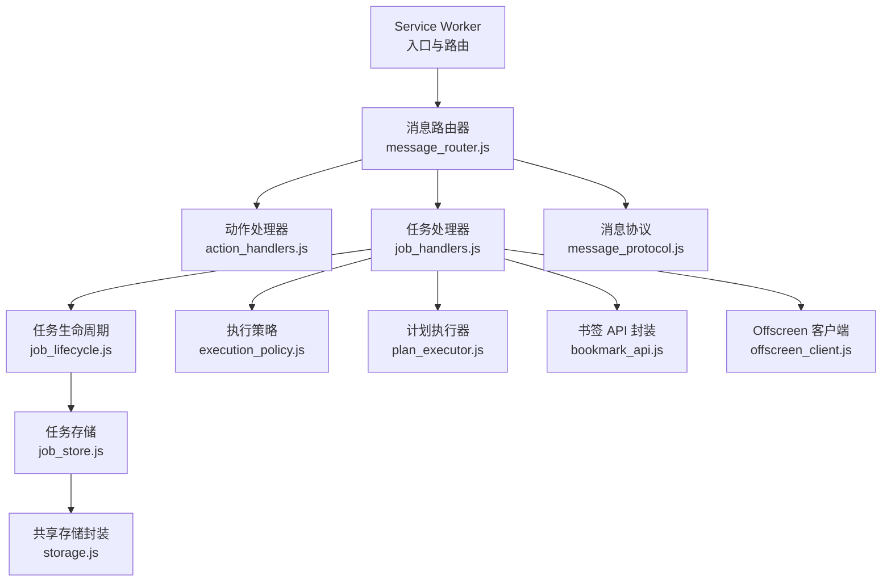
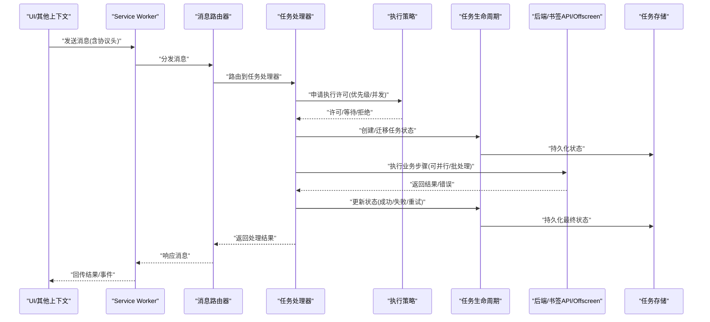
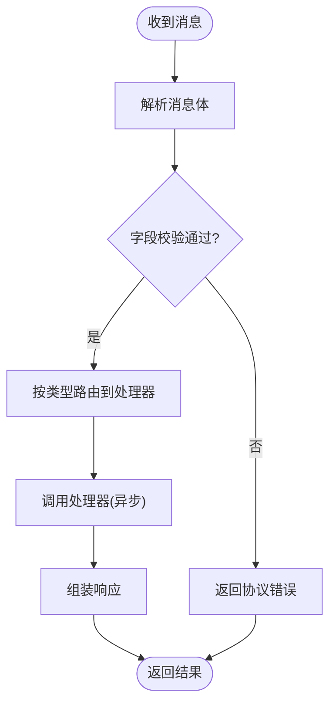
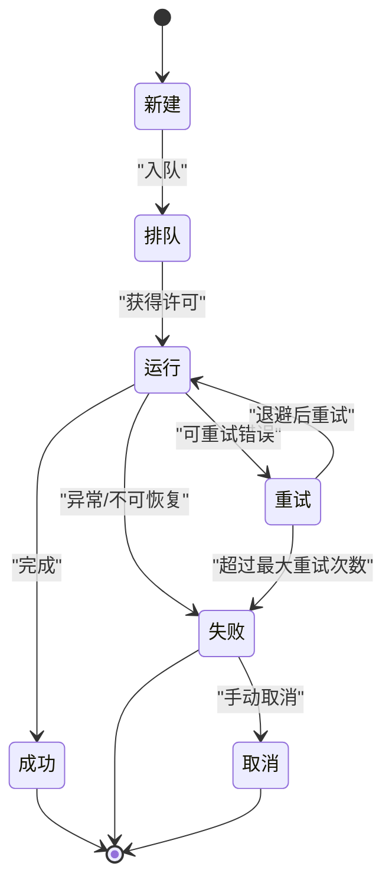
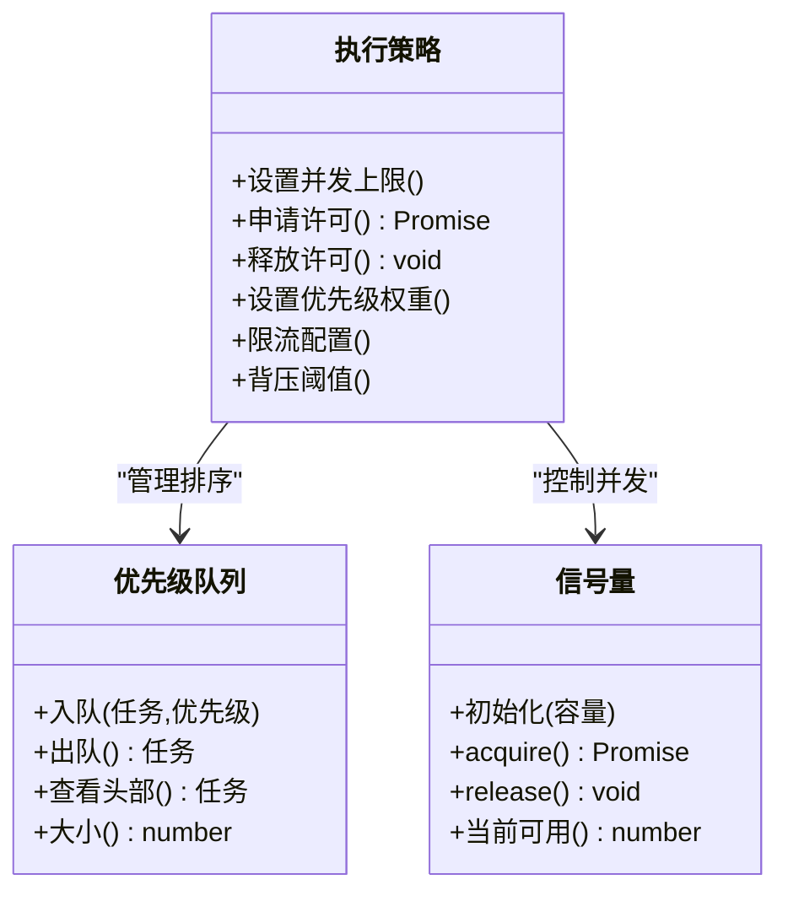
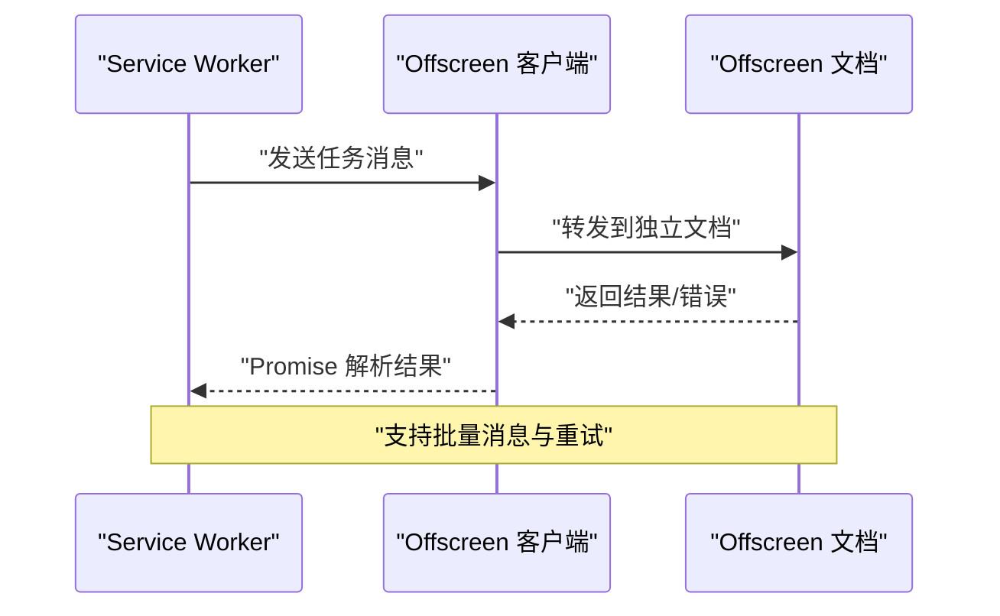
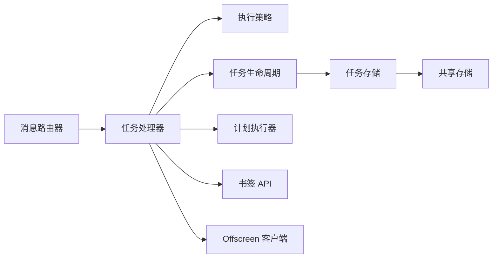

# 异步消息处理

<cite>
**本文引用的文件**   
- [service_worker.js](file://extension/service_worker.js)
- [message_router.js](file://extension/background/message_router.js)
- [action_handlers.js](file://extension/background/action_handlers.js)
- [job_handlers.js](file://extension/background/job_handlers.js)
- [job_lifecycle.js](file://extension/background/job_lifecycle.js)
- [job_store.js](file://extension/background/job_store.js)
- [execution_policy.js](file://extension/background/execution_policy.js)
- [offscreen_client.js](file://extension/background/offscreen_client.js)
- [bookmark_api.js](file://extension/background/bookmark_api.js)
- [plan_executor.js](file://extension/background/plan_executor.js)
- [message_protocol.js](file://extension/shared/message_protocol.js)
- [storage.js](file://extension/shared/storage.js)
</cite>

## 目录
1. [简介](#简介)
2. [项目结构](#项目结构)
3. [核心组件](#核心组件)
4. [架构总览](#架构总览)
5. [详细组件分析](#详细组件分析)
6. [依赖关系分析](#依赖关系分析)
7. [性能考虑](#性能考虑)
8. [故障排查指南](#故障排查指南)
9. [结论](#结论)
10. [附录](#附录)

## 简介
本文件面向 Edge Bookmark 的异步消息处理系统，系统性阐述以下主题：
- 异步消息处理模式：Promise 链式调用、async/await、事件驱动架构
- 消息队列管理：优先级队列、死信队列、批量处理机制
- 并发控制策略：信号量模式、限流算法、背压处理
- 错误处理与恢复：异常捕获、重试策略、补偿事务
- 性能优化：消息批处理、连接复用、资源池管理
- 异步编程最佳实践与常见陷阱规避

本说明以扩展后台（Service Worker）与 Offscreen Document 之间的跨上下文通信为主线，结合任务生命周期、执行策略与存储层，构建端到端的异步消息处理体系。

## 项目结构
Edge Bookmark 的异步消息处理主要分布在以下模块：
- Service Worker 入口与路由：负责监听消息、分发到处理器、编排任务生命周期
- 背景脚本：实现具体业务处理器、任务状态机、持久化与执行策略
- 共享协议与存储：定义消息协议、封装持久化访问
- Offscreen 客户端：在独立文档中执行耗时或受限操作，并通过消息通道与 Service Worker 交互

图示来源
- [service_worker.js](file://extension/service_worker.js)
- [message_router.js](file://extension/background/message_router.js)
- [action_handlers.js](file://extension/background/action_handlers.js)
- [job_handlers.js](file://extension/background/job_handlers.js)
- [job_lifecycle.js](file://extension/background/job_lifecycle.js)
- [execution_policy.js](file://extension/background/execution_policy.js)
- [plan_executor.js](file://extension/background/plan_executor.js)
- [bookmark_api.js](file://extension/background/bookmark_api.js)
- [offscreen_client.js](file://extension/background/offscreen_client.js)
- [message_protocol.js](file://extension/shared/message_protocol.js)
- [job_store.js](file://extension/background/job_store.js)
- [storage.js](file://extension/shared/storage.js)

章节来源
- [service_worker.js](file://extension/service_worker.js)
- [message_router.js](file://extension/background/message_router.js)
- [message_protocol.js](file://extension/shared/message_protocol.js)

## 核心组件
- 消息路由器：统一接收来自 UI、Offscreen 或其他上下文的请求，按类型路由至对应处理器；维护消息协议版本与字段校验。
- 动作处理器：将用户界面动作转换为内部任务或命令，触发后续异步流程。
- 任务处理器：编排任务的创建、调度、执行、重试、失败与完成；与执行策略和任务生命周期协作。
- 任务生命周期：维护任务状态机（如新建、排队、运行、成功、失败、取消），并驱动状态迁移与副作用。
- 执行策略：控制并发度、优先级、限流与退避；提供信号量与背压能力。
- 计划执行器：解析与执行“计划”类任务，协调多个子步骤与外部 API 调用。
- Offscreen 客户端：在独立文档中执行受限或耗时操作，通过消息通道与 Service Worker 同步结果。
- 书签 API：对浏览器书签 API 进行封装，屏蔽差异并提供统一的异步接口。
- 任务存储：持久化任务元数据与中间状态，支持查询与增量更新。
- 共享存储：对本地存储进行统一封装，提供读写原子性与错误处理。

章节来源
- [message_router.js](file://extension/background/message_router.js)
- [action_handlers.js](file://extension/background/action_handlers.js)
- [job_handlers.js](file://extension/background/job_handlers.js)
- [job_lifecycle.js](file://extension/background/job_lifecycle.js)
- [execution_policy.js](file://extension/background/execution_policy.js)
- [plan_executor.js](file://extension/background/plan_executor.js)
- [offscreen_client.js](file://extension/background/offscreen_client.js)
- [bookmark_api.js](file://extension/background/bookmark_api.js)
- [job_store.js](file://extension/background/job_store.js)
- [storage.js](file://extension/shared/storage.js)

## 架构总览
下图展示了从消息入站到落地的完整链路，包括路由、处理器、执行策略、生命周期与存储的交互。

图示来源
- [service_worker.js](file://extension/service_worker.js)
- [message_router.js](file://extension/background/message_router.js)
- [job_handlers.js](file://extension/background/job_handlers.js)
- [execution_policy.js](file://extension/background/execution_policy.js)
- [job_lifecycle.js](file://extension/background/job_lifecycle.js)
- [job_store.js](file://extension/background/job_store.js)

## 详细组件分析

### 消息路由器与协议
- 职责：解析消息协议、校验字段、根据类型路由到处理器；维护消息版本兼容与错误码映射。
- 关键点：
  - 使用 Promise 链式调用确保解析与校验顺序执行
  - 对未知类型或非法字段进行快速失败，避免进入深层处理
  - 为每个请求分配唯一 ID，便于追踪与超时控制

图示来源
- [message_router.js](file://extension/background/message_router.js)
- [message_protocol.js](file://extension/shared/message_protocol.js)

章节来源
- [message_router.js](file://extension/background/message_router.js)
- [message_protocol.js](file://extension/shared/message_protocol.js)

### 动作处理器
- 职责：将 UI 动作转化为内部任务或命令，触发后续异步流程。
- 关键点：
  - 使用 async/await 组织多步逻辑，保持可读性
  - 对关键步骤进行幂等设计，防止重复提交导致副作用
  - 将 UI 反馈与后台任务解耦，采用事件或回调通知

章节来源
- [action_handlers.js](file://extension/background/action_handlers.js)

### 任务处理器与生命周期
- 职责：编排任务创建、调度、执行、重试、失败与完成；与生命周期协同推进状态机。
- 关键点：
  - 任务状态机包含：新建、排队、运行、成功、失败、取消等
  - 与执行策略协作，获取并发许可与优先级
  - 与任务存储协作，持久化状态与中间结果
  - 支持批量任务合并与去重，减少重复工作

图示来源
- [job_lifecycle.js](file://extension/background/job_lifecycle.js)
- [job_handlers.js](file://extension/background/job_handlers.js)

章节来源
- [job_handlers.js](file://extension/background/job_handlers.js)
- [job_lifecycle.js](file://extension/background/job_lifecycle.js)

### 执行策略（并发控制、优先级、限流、背压）
- 并发控制：
  - 信号量模式：限制同时运行的任务数，避免资源争用
  - 令牌桶/漏桶：平滑突发流量，保护后端与 I/O
- 优先级队列：
  - 高优先级任务优先出队，低优先级任务延迟或降级
  - 支持动态调整优先级，基于任务类型或用户意图
- 背压处理：
  - 当消费者慢于生产者时，暂停入队或丢弃低优先级任务
  - 通过监控队列长度与处理速率，自动调节入队速率

图示来源
- [execution_policy.js](file://extension/background/execution_policy.js)

章节来源
- [execution_policy.js](file://extension/background/execution_policy.js)

### Offscreen 客户端
- 职责：在独立文档中执行受限或耗时操作，通过消息通道与 Service Worker 同步结果。
- 关键点：
  - 使用 Promise 包装消息往返，简化调用方代码
  - 支持批量消息以减少往返开销
  - 对断开连接、超时与错误进行重试与降级

图示来源
- [offscreen_client.js](file://extension/background/offscreen_client.js)

章节来源
- [offscreen_client.js](file://extension/background/offscreen_client.js)

### 计划执行器
- 职责：解析与执行“计划”类任务，协调多个子步骤与外部 API 调用。
- 关键点：
  - 将复杂任务分解为可重试的子步骤
  - 支持部分成功与补偿逻辑，保证整体一致性
  - 与执行策略协作，控制子步骤并发度

章节来源
- [plan_executor.js](file://extension/background/plan_executor.js)

### 书签 API 封装
- 职责：对浏览器书签 API 进行封装，屏蔽差异并提供统一的异步接口。
- 关键点：
  - 统一错误码与异常类型
  - 支持批量操作与事务语义
  - 缓存热点数据，减少重复读取

章节来源
- [bookmark_api.js](file://extension/background/bookmark_api.js)

### 任务存储与共享存储
- 任务存储：持久化任务元数据与中间状态，支持查询与增量更新。
- 共享存储：对本地存储进行统一封装，提供读写原子性与错误处理。

章节来源
- [job_store.js](file://extension/background/job_store.js)
- [storage.js](file://extension/shared/storage.js)

## 依赖关系分析
- 松耦合：消息路由器仅依赖协议与处理器接口，降低耦合度
- 内聚性：任务处理器集中编排任务流程，职责清晰
- 外部依赖：浏览器 API、Offscreen 文档、本地存储
- 潜在循环：应避免处理器之间直接相互调用，必要时通过事件或存储桥接

图示来源
- [message_router.js](file://extension/background/message_router.js)
- [job_handlers.js](file://extension/background/job_handlers.js)
- [execution_policy.js](file://extension/background/execution_policy.js)
- [job_lifecycle.js](file://extension/background/job_lifecycle.js)
- [plan_executor.js](file://extension/background/plan_executor.js)
- [bookmark_api.js](file://extension/background/bookmark_api.js)
- [offscreen_client.js](file://extension/background/offscreen_client.js)
- [job_store.js](file://extension/background/job_store.js)
- [storage.js](file://extension/shared/storage.js)

章节来源
- [message_router.js](file://extension/background/message_router.js)
- [job_handlers.js](file://extension/background/job_handlers.js)
- [execution_policy.js](file://extension/background/execution_policy.js)
- [job_lifecycle.js](file://extension/background/job_lifecycle.js)
- [plan_executor.js](file://extension/background/plan_executor.js)
- [bookmark_api.js](file://extension/background/bookmark_api.js)
- [offscreen_client.js](file://extension/background/offscreen_client.js)
- [job_store.js](file://extension/background/job_store.js)
- [storage.js](file://extension/shared/storage.js)

## 性能考虑
- 消息批处理：
  - 将多条小消息合并为批量请求，减少往返与序列化开销
  - 在 Offscreen 客户端与书签 API 层面启用批量接口
- 连接复用：
  - 复用 Offscreen 文档与存储连接，避免频繁创建销毁
  - 对网络请求进行连接池管理，提升吞吐
- 资源池管理：
  - 对 CPU 密集或 I/O 密集任务使用线程/Worker 池
  - 合理设置并发上限与队列长度，避免内存膨胀
- 背压与限流：
  - 监控队列长度与处理速率，动态调整入队速率
  - 对高负载场景实施降级策略，保障核心功能可用

[本节为通用指导，不直接分析具体文件]

## 故障排查指南
- 常见问题定位：
  - 消息未到达：检查 Service Worker 是否存活、消息路由是否正确、协议版本是否匹配
  - 任务卡住：查看任务状态机与执行策略日志，确认是否被背压或限流阻塞
  - 重复执行：确认动作处理器是否幂等，任务 ID 是否唯一
- 错误分类与处理：
  - 可重试错误：网络超时、临时服务不可用，采用指数退避重试
  - 不可恢复错误：权限不足、数据损坏，记录死信并告警
  - 部分失败：对计划任务进行补偿事务，回滚已变更状态
- 调试建议：
  - 为每个消息分配唯一 ID，贯穿整个处理链路
  - 记录关键路径的耗时与错误堆栈，便于定位瓶颈
  - 使用离线日志与快照，辅助复现问题

章节来源
- [job_lifecycle.js](file://extension/background/job_lifecycle.js)
- [job_handlers.js](file://extension/background/job_handlers.js)
- [execution_policy.js](file://extension/background/execution_policy.js)

## 结论
Edge Bookmark 的异步消息处理系统以消息路由器为核心，结合任务处理器、执行策略与生命周期管理，构建了可扩展、可观测、可恢复的消息处理体系。通过优先级队列、信号量、限流与背压，系统在资源受限环境下仍能保持稳定与高效。配合批处理、连接复用与资源池管理，进一步提升了吞吐与用户体验。建议在后续迭代中持续完善死信队列与补偿事务，增强系统的韧性与自愈能力。

[本节为总结性内容，不直接分析具体文件]

## 附录
- 异步编程最佳实践：
  - 使用 async/await 组织复杂流程，避免深层嵌套
  - 对 Promise 链进行错误边界处理，防止未捕获异常
  - 为长时间运行的任务提供取消与超时机制
- 常见陷阱与规避：
  - 避免在 Service Worker 中持有长生命周期对象，注意上下文重启
  - 谨慎使用全局状态，优先通过存储与事件传递数据
  - 对第三方 API 调用增加重试与降级，防止雪崩效应

[本节为通用指导，不直接分析具体文件]