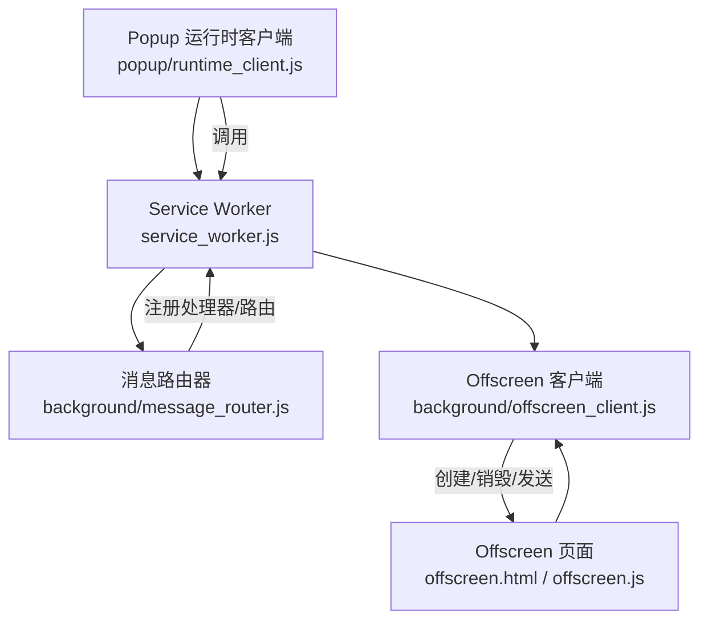
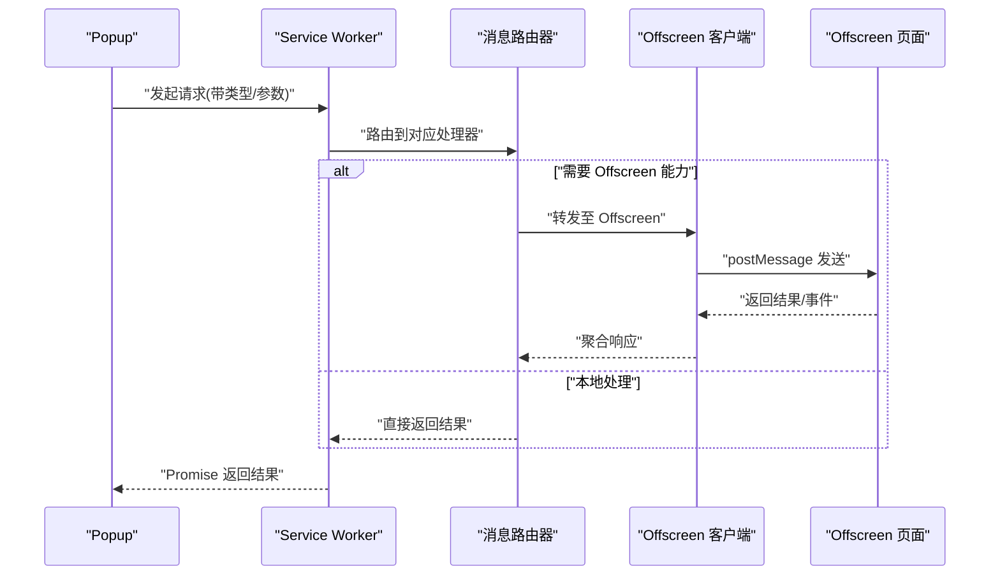
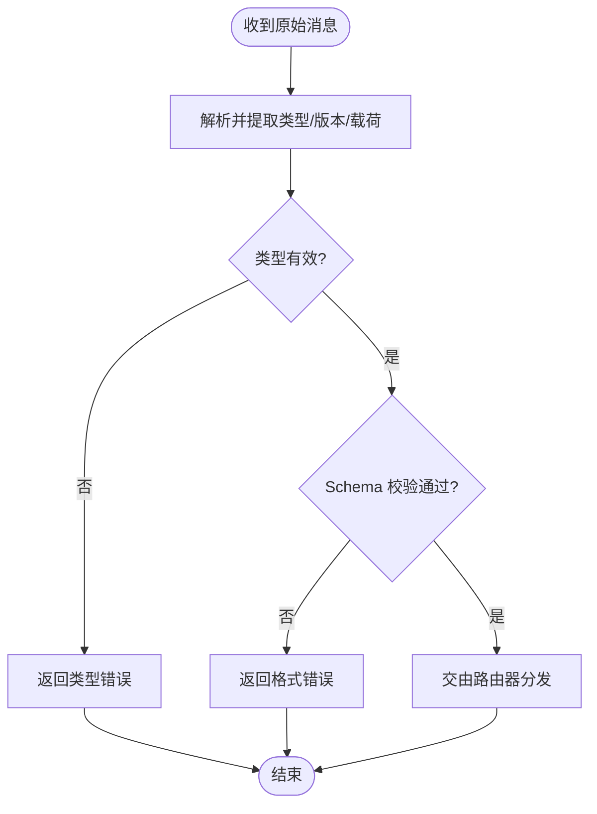
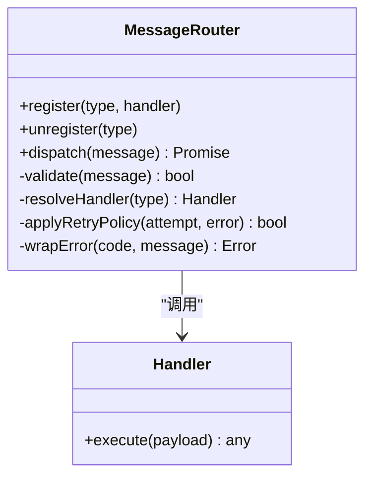
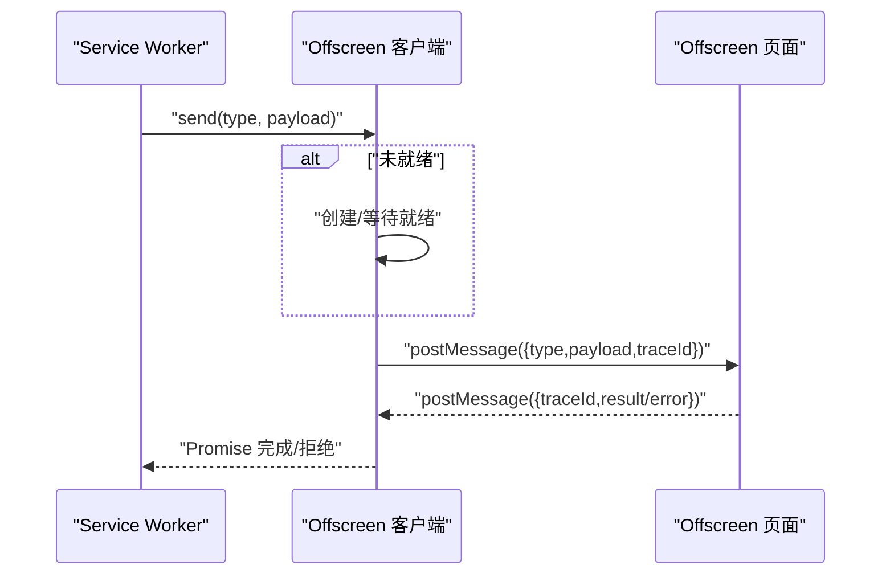
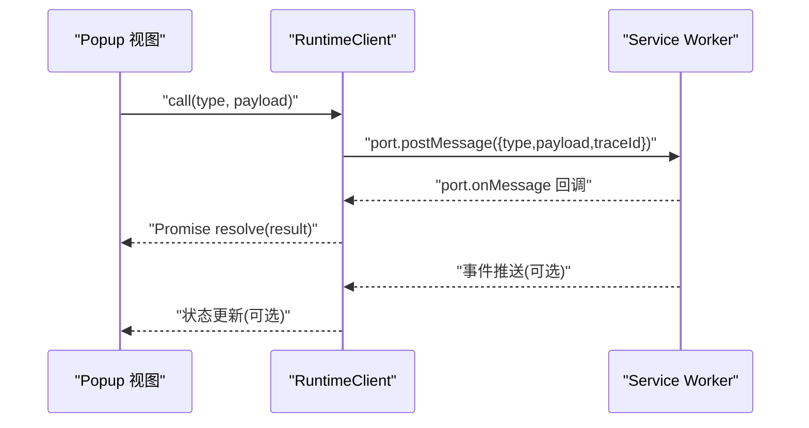
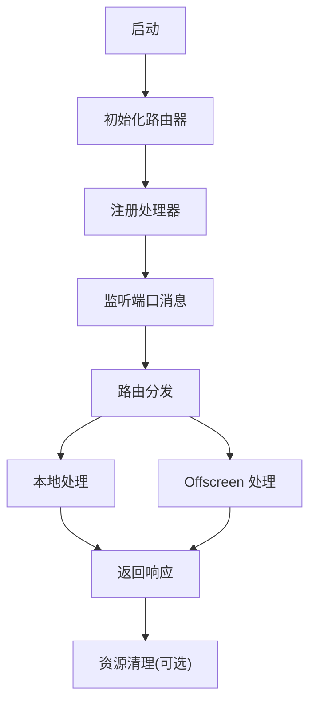
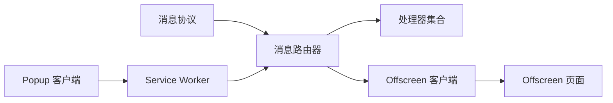

# 消息传递机制

<cite>
**本文引用的文件**   
- [service_worker.js](file://extension/service_worker.js)
- [message_router.js](file://extension/background/message_router.js)
- [offscreen_client.js](file://extension/background/offscreen_client.js)
- [runtime_client.js](file://extension/popup/runtime_client.js)
- [message_protocol.js](file://extension/shared/message_protocol.js)
- [offscreen.html](file://extension/offscreen.html)
- [offscreen.js](file://extension/offscreen.js)
- [popup.html](file://extension/popup.html)
- [manifest.json](file://extension/manifest.json)
</cite>

## 目录
1. [简介](#简介)
2. [项目结构](#项目结构)
3. [核心组件](#核心组件)
4. [架构总览](#架构总览)
5. [详细组件分析](#详细组件分析)
6. [依赖关系分析](#依赖关系分析)
7. [性能考虑](#性能考虑)
8. [故障排查指南](#故障排查指南)
9. [结论](#结论)
10. [附录](#附录)

## 简介
本文件面向 Edge Bookmark 扩展的消息传递机制，聚焦跨上下文通信协议与实现：Service Worker、Popup、Offscreen Document 三者之间的消息路由、编解码、异步处理、错误处理与重试策略。文档提供完整的流程图与时序图，并给出最佳实践与调试方法，帮助开发者快速理解与扩展该机制。

## 项目结构
Edge Bookmark 的消息传递涉及以下关键位置：
- Service Worker：作为后台主控制器，负责消息分发、任务编排与状态协调
- Popup：用户界面入口，发起请求并渲染结果
- Offscreen Document：承载需要 DOM 或浏览器 API 的离线工作负载
- Shared 协议层：定义消息类型、版本与校验规则

图表来源
- [service_worker.js](file://extension/service_worker.js)
- [message_router.js](file://extension/background/message_router.js)
- [offscreen_client.js](file://extension/background/offscreen_client.js)
- [runtime_client.js](file://extension/popup/runtime_client.js)
- [offscreen.html](file://extension/offscreen.html)
- [offscreen.js](file://extension/offscreen.js)

章节来源
- [manifest.json](file://extension/manifest.json)

## 核心组件
- 消息协议（shared/message_protocol.js）
  - 定义消息类型、字段约束、版本号与兼容性策略
  - 提供序列化/反序列化工具与可选的 JSON Schema 校验
- 消息路由器（background/message_router.js）
  - 维护消息类型到处理器的映射
  - 负责入站消息解析、鉴权、路由、超时与重试
- Offscreen 客户端（background/offscreen_client.js）
  - 管理 Offscreen Document 生命周期
  - 封装与 Offscreen 页面的双向通信
- Popup 运行时客户端（popup/runtime_client.js）
  - 为 UI 提供 Promise 风格的调用接口
  - 统一错误包装与重试策略
- Service Worker（service_worker.js）
  - 初始化路由器与全局监听器
  - 协调各模块协作与资源清理

章节来源
- [message_protocol.js](file://extension/shared/message_protocol.js)
- [message_router.js](file://extension/background/message_router.js)
- [offscreen_client.js](file://extension/background/offscreen_client.js)
- [runtime_client.js](file://extension/popup/runtime_client.js)
- [service_worker.js](file://extension/service_worker.js)

## 架构总览
下图展示跨上下文消息流与控制面：

图表来源
- [service_worker.js](file://extension/service_worker.js)
- [message_router.js](file://extension/background/message_router.js)
- [offscreen_client.js](file://extension/background/offscreen_client.js)
- [offscreen.js](file://extension/offscreen.js)
- [runtime_client.js](file://extension/popup/runtime_client.js)

## 详细组件分析

### 消息协议与编解码（shared/message_protocol.js）
- 设计要点
  - 消息类型枚举：为每个业务场景定义唯一类型标识
  - 字段契约：通过结构化描述约束请求/响应体，便于前后端一致性校验
  - 版本兼容：在协议中声明最小支持版本，接收方可根据版本选择兼容路径
  - 序列化优化：优先使用可传输对象；对大对象采用分块或引用传递策略
- 校验流程
  - 入站消息先进行类型与必填字段检查
  - 可选启用 JSON Schema 校验，失败则返回标准化错误
  - 成功则进入路由阶段

图表来源
- [message_protocol.js](file://extension/shared/message_protocol.js)

章节来源
- [message_protocol.js](file://extension/shared/message_protocol.js)

### 消息路由器（background/message_router.js）
- 职责
  - 注册/注销处理器
  - 解析入站消息并匹配处理器
  - 执行超时控制、重试与降级
  - 统一错误包装与日志上报
- 路由规则
  - 基于消息类型精确匹配
  - 支持通配前缀或命名空间（如按功能域划分）
  - 优先级策略：更具体的处理器优先
- 错误处理
  - 分类错误码：参数错误、权限不足、服务不可用、超时等
  - 幂等性：对可重试操作携带请求 ID，避免重复执行副作用
- 重试策略
  - 指数退避 + 抖动
  - 最大重试次数与熔断阈值
  - 仅对可重试错误触发重试

图表来源
- [message_router.js](file://extension/background/message_router.js)

章节来源
- [message_router.js](file://extension/background/message_router.js)

### Offscreen 客户端（background/offscreen_client.js）
- 生命周期管理
  - 按需创建 Offscreen Document
  - 空闲回收与资源释放
  - 连接健康检查与自动重连
- 通信封装
  - 将 postMessage 抽象为 Promise 风格接口
  - 自动附加会话/追踪 ID，便于链路追踪
  - 统一错误转换与重试

图表来源
- [offscreen_client.js](file://extension/background/offscreen_client.js)
- [offscreen.js](file://extension/offscreen.js)
- [offscreen.html](file://extension/offscreen.html)

章节来源
- [offscreen_client.js](file://extension/background/offscreen_client.js)
- [offscreen.js](file://extension/offscreen.js)
- [offscreen.html](file://extension/offscreen.html)

### Popup 运行时客户端（popup/runtime_client.js）
- 对外接口
  - 暴露与 Service Worker 交互的 Promise API
  - 自动注入 traceId、时间戳与上下文信息
- 错误与重试
  - 捕获网络/端口异常并转换为领域错误
  - 对瞬时错误应用重试策略
- 状态同步
  - 订阅来自 Service Worker 的事件推送
  - 局部更新 UI 状态，避免全量刷新

图表来源
- [runtime_client.js](file://extension/popup/runtime_client.js)
- [service_worker.js](file://extension/service_worker.js)

章节来源
- [runtime_client.js](file://extension/popup/runtime_client.js)
- [service_worker.js](file://extension/service_worker.js)

### Service Worker（service_worker.js）
- 启动流程
  - 初始化消息路由器与全局监听器
  - 注册必要处理器与事件订阅
  - 配置 Offscreen 客户端与默认策略
- 控制流
  - 接收来自 Popup 的请求，委派给路由器
  - 协调 Offscreen 任务与本地逻辑
  - 统一错误与日志输出

图表来源
- [service_worker.js](file://extension/service_worker.js)
- [message_router.js](file://extension/background/message_router.js)

章节来源
- [service_worker.js](file://extension/service_worker.js)

## 依赖关系分析
- 内聚与耦合
  - 路由器与处理器松耦合，新增类型只需注册新处理器
  - Offscreen 客户端屏蔽底层 postMessage 细节，降低耦合
  - Popup 客户端只依赖协议与服务端接口，不感知内部实现
- 外部依赖
  - 浏览器扩展 API（端口、Offscreen 文档）
  - 可选的 JSON Schema 校验库
- 潜在循环依赖
  - 路由器不应反向依赖具体处理器实现，应通过接口解耦

图表来源
- [message_protocol.js](file://extension/shared/message_protocol.js)
- [message_router.js](file://extension/background/message_router.js)
- [offscreen_client.js](file://extension/background/offscreen_client.js)
- [offscreen.js](file://extension/offscreen.js)
- [runtime_client.js](file://extension/popup/runtime_client.js)
- [service_worker.js](file://extension/service_worker.js)

章节来源
- [message_protocol.js](file://extension/shared/message_protocol.js)
- [message_router.js](file://extension/background/message_router.js)
- [offscreen_client.js](file://extension/background/offscreen_client.js)
- [offscreen.js](file://extension/offscreen.js)
- [runtime_client.js](file://extension/popup/runtime_client.js)
- [service_worker.js](file://extension/service_worker.js)

## 性能考虑
- 批量与合并
  - 对高频小消息进行批处理，减少端口开销
  - 对 Offscreen 任务合并提交，降低创建/销毁频率
- 序列化优化
  - 避免在热点路径上频繁深拷贝
  - 对大对象采用分块传输或共享内存（若可用）
- 超时与背压
  - 合理设置超时与队列长度，防止雪崩
  - 对非关键路径启用延迟加载与懒初始化
- 缓存与去重
  - 对幂等操作引入请求级去重
  - 对读多写少数据增加短期缓存

[本节为通用指导，无需代码来源]

## 故障排查指南
- 常见问题定位
  - 端口未建立：检查 Service Worker 是否已初始化监听器
  - 路由未命中：确认消息类型与处理器注册一致
  - Offscreen 不可用：验证页面创建与就绪信号
  - 校验失败：核对协议版本与字段约束
- 诊断手段
  - 开启 traceId 并在两端打印日志
  - 记录入站/出站消息摘要（脱敏）
  - 使用浏览器 DevTools 的 Console 与 Network 面板
- 恢复策略
  - 自动重连与指数退避
  - 降级到本地能力或返回友好提示
  - 熔断后暂停新请求，等待恢复

章节来源
- [message_router.js](file://extension/background/message_router.js)
- [offscreen_client.js](file://extension/background/offscreen_client.js)
- [runtime_client.js](file://extension/popup/runtime_client.js)
- [service_worker.js](file://extension/service_worker.js)

## 结论
Edge Bookmark 的消息传递机制以“协议先行、路由驱动、异步可靠”为核心原则，通过清晰的分层与解耦，实现了 Service Worker、Popup 与 Offscreen Document 之间的高效通信。遵循本文档的设计与最佳实践，可在保证稳定性的同时持续扩展新的消息类型与处理能力。

[本节为总结，无需代码来源]

## 附录

### 常见使用模式
- 请求-响应模式
  - Popup 调用 Service Worker，后者经路由器分发并返回 Promise 结果
- 事件推送模式
  - Service Worker 主动推送状态变更，Popup 订阅并增量更新 UI
- 长任务模式
  - 复杂任务委托 Offscreen 执行，完成后回调通知

[本节为概念说明，无需代码来源]

### 最佳实践清单
- 始终为消息指定类型与版本，保持向后兼容
- 为所有外部调用设置超时与重试上限
- 使用 traceId 贯穿整条链路，便于排障
- 对副作用操作确保幂等性与事务边界
- 对敏感数据进行最小化传输与脱敏

[本节为概念说明，无需代码来源]