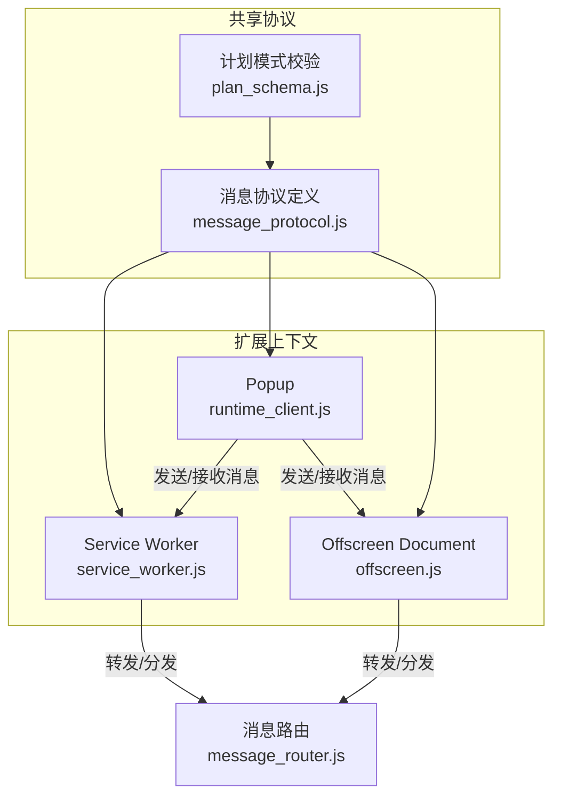
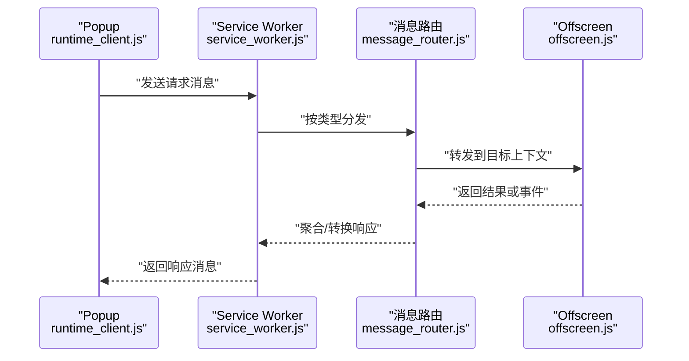
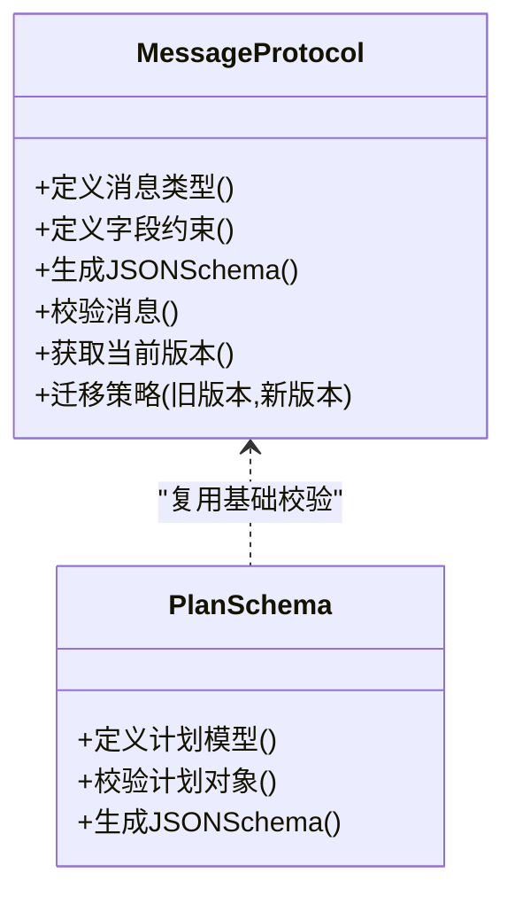
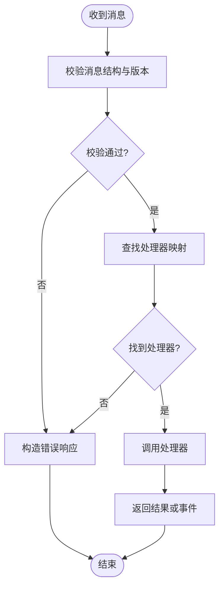
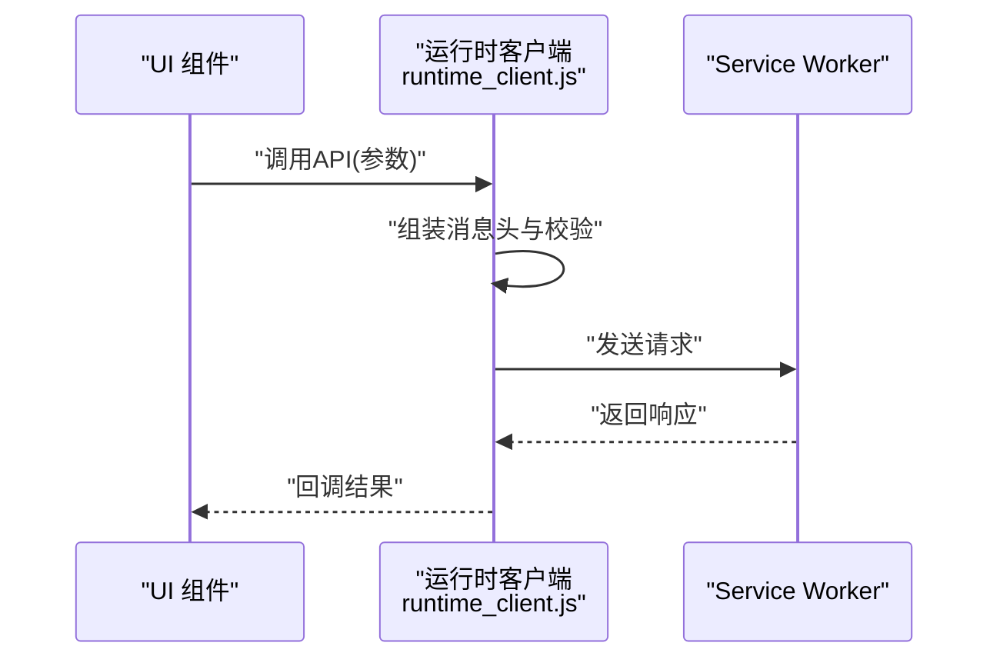
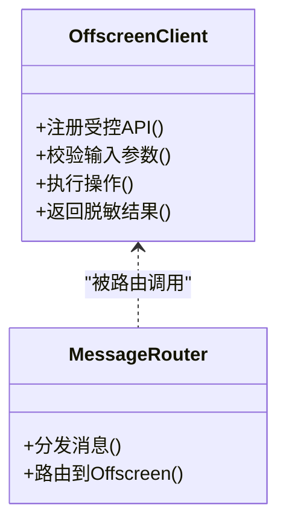
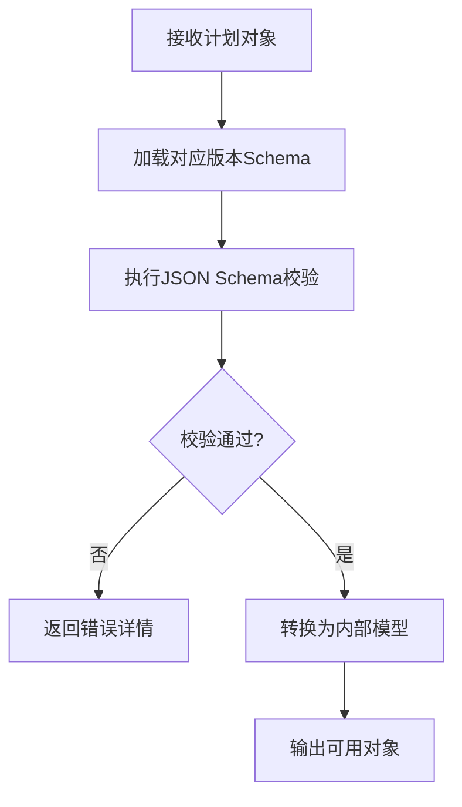
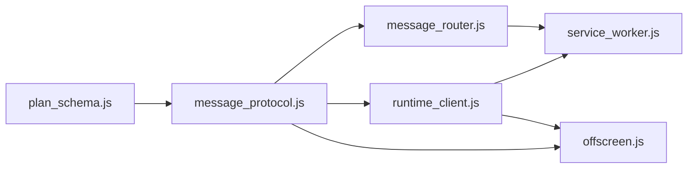

# 消息协议设计

<cite>
**本文引用的文件**   
- [extension/shared/message_protocol.js](file://extension/shared/message_protocol.js)
- [extension/background/message_router.js](file://extension/background/message_router.js)
- [extension/popup/runtime_client.js](file://extension/popup/runtime_client.js)
- [extension/offscreen.js](file://extension/offscreen.js)
- [extension/service_worker.js](file://extension/service_worker.js)
- [extension/manifest.json](file://extension/manifest.json)
- [extension/shared/plan_schema.js](file://extension/shared/plan_schema.js)
- [tests/test_extension_shared_contracts.js](file://tests/test_extension_shared_contracts.js)
</cite>

## 目录
1. [简介](#简介)
2. [项目结构](#项目结构)
3. [核心组件](#核心组件)
4. [架构总览](#架构总览)
5. [详细组件分析](#详细组件分析)
6. [依赖关系分析](#依赖关系分析)
7. [性能考虑](#性能考虑)
8. [故障排查指南](#故障排查指南)
9. [结论](#结论)
10. [附录](#附录)

## 简介
本文件为 Edge Bookmark 扩展的消息协议设计文档，聚焦跨上下文通信（Service Worker、Popup、Offscreen Document）的协议规范。内容涵盖：
- 消息类型定义与数据结构规范
- JSON Schema 验证规则、必填与可选字段
- 版本管理机制与向后兼容策略
- 消息生命周期管理（创建、发送、接收、清理）
- 安全考虑（验证、权限控制、数据加密）
- 完整消息类型参考（请求/响应、事件、错误处理）
- 协议扩展机制与兼容性保证

## 项目结构
Edge Bookmark 扩展采用多上下文架构：
- Service Worker：后台任务调度、持久化存储、计划执行
- Popup：用户界面交互、运行时客户端封装
- Offscreen Document：DOM 访问与浏览器 API 调用（如书签树、快照导出等）

消息在以上上下文之间通过浏览器 runtime 通道进行交换，由共享层统一定义协议与校验逻辑。

**图示来源**
- [extension/service_worker.js](file://extension/service_worker.js)
- [extension/popup/runtime_client.js](file://extension/popup/runtime_client.js)
- [extension/offscreen.js](file://extension/offscreen.js)
- [extension/shared/message_protocol.js](file://extension/shared/message_protocol.js)
- [extension/shared/plan_schema.js](file://extension/shared/plan_schema.js)
- [extension/background/message_router.js](file://extension/background/message_router.js)

**章节来源**
- [extension/shared/message_protocol.js](file://extension/shared/message_protocol.js)
- [extension/shared/plan_schema.js](file://extension/shared/plan_schema.js)
- [extension/background/message_router.js](file://extension/background/message_router.js)
- [extension/popup/runtime_client.js](file://extension/popup/runtime_client.js)
- [extension/offscreen.js](file://extension/offscreen.js)
- [extension/service_worker.js](file://extension/service_worker.js)

## 核心组件
- 消息协议定义模块：集中声明消息类型、字段约束、版本字段与校验规则，供所有上下文复用。
- 消息路由模块：负责将入站消息按类型分发到对应处理器，并维护监听器注册表。
- 运行时客户端（Popup）：封装向 Service Worker 和 Offscreen 发送请求、订阅事件、处理响应的能力。
- Offscreen 客户端：提供 DOM 相关能力的桥接，暴露受控接口给其他上下文。
- 计划模式校验：对复杂业务对象（如“计划”）进行结构化校验，确保跨上下文数据一致性。

**章节来源**
- [extension/shared/message_protocol.js](file://extension/shared/message_protocol.js)
- [extension/background/message_router.js](file://extension/background/message_router.js)
- [extension/popup/runtime_client.js](file://extension/popup/runtime_client.js)
- [extension/offscreen.js](file://extension/offscreen.js)
- [extension/shared/plan_schema.js](file://extension/shared/plan_schema.js)

## 架构总览
下图展示跨上下文消息流的关键路径：Popup 发起请求，Service Worker 路由至具体处理器或转发至 Offscreen；Offscreen 完成操作后返回结果，再由 Service Worker 回传至 Popup。

**图示来源**
- [extension/popup/runtime_client.js](file://extension/popup/runtime_client.js)
- [extension/service_worker.js](file://extension/service_worker.js)
- [extension/background/message_router.js](file://extension/background/message_router.js)
- [extension/offscreen.js](file://extension/offscreen.js)

## 详细组件分析

### 消息协议定义（message_protocol.js）
- 职责
  - 定义消息类型常量与命名空间
  - 声明每个消息类型的字段集合、数据类型、是否必填
  - 提供 JSON Schema 描述与校验函数
  - 维护协议版本号与迁移策略
- 关键设计点
  - 所有消息包含通用头部字段（如消息类型、时间戳、会话标识、版本）
  - 使用严格模式校验，拒绝未知字段以增强健壮性
  - 对敏感字段提供掩码或最小化传输策略
- 版本管理
  - 消息体携带协议版本字段
  - 服务端根据版本选择解析器或降级策略
  - 废弃字段保留但标记为不推荐，避免破坏旧客户端

**图示来源**
- [extension/shared/message_protocol.js](file://extension/shared/message_protocol.js)
- [extension/shared/plan_schema.js](file://extension/shared/plan_schema.js)

**章节来源**
- [extension/shared/message_protocol.js](file://extension/shared/message_protocol.js)
- [extension/shared/plan_schema.js](file://extension/shared/plan_schema.js)

### 消息路由（message_router.js）
- 职责
  - 注册消息处理器映射
  - 接收来自各上下文的入站消息
  - 依据消息类型与目标上下文进行分发
  - 处理超时、重试与错误包装
- 关键设计点
  - 支持一次性处理器与长期监听器两种模式
  - 提供限流与去抖机制，防止风暴式消息
  - 记录审计日志用于问题定位
- 错误处理
  - 标准化错误码与错误信息
  - 区分可恢复与不可恢复错误，指导上层重试或告警

**图示来源**
- [extension/background/message_router.js](file://extension/background/message_router.js)

**章节来源**
- [extension/background/message_router.js](file://extension/background/message_router.js)

### 运行时客户端（runtime_client.js）
- 职责
  - 封装向 Service Worker 与 Offscreen 的请求方法
  - 提供事件订阅与取消订阅能力
  - 自动附加通用头部（会话、版本、签名）
- 关键设计点
  - 请求-响应模式使用唯一 ID 关联
  - 事件模式基于频道订阅，支持批量与过滤
  - 失败自动重试与退避策略
- 生命周期
  - 初始化时建立连接与监听
  - 页面关闭时主动释放资源与取消订阅

**图示来源**
- [extension/popup/runtime_client.js](file://extension/popup/runtime_client.js)
- [extension/service_worker.js](file://extension/service_worker.js)

**章节来源**
- [extension/popup/runtime_client.js](file://extension/popup/runtime_client.js)

### Offscreen 客户端（offscreen.js）
- 职责
  - 提供 DOM 与浏览器 API 的受限访问
  - 暴露受控接口给 Service Worker 与 Popup
  - 隔离敏感操作，仅返回必要数据
- 关键设计点
  - 白名单机制限制可调用的 API
  - 输入参数严格校验，输出数据脱敏
  - 长耗时任务异步执行并返回进度

**图示来源**
- [extension/offscreen.js](file://extension/offscreen.js)
- [extension/background/message_router.js](file://extension/background/message_router.js)

**章节来源**
- [extension/offscreen.js](file://extension/offscreen.js)

### 计划模式校验（plan_schema.js）
- 职责
  - 定义“计划”对象的 JSON Schema
  - 校验计划的结构、字段类型与取值范围
  - 提供序列化/反序列化工具
- 关键设计点
  - 强类型约束，减少运行时异常
  - 可扩展字段通过元数据标注，保持向前兼容
  - 与消息协议版本联动，支持多版本并存

**图示来源**
- [extension/shared/plan_schema.js](file://extension/shared/plan_schema.js)

**章节来源**
- [extension/shared/plan_schema.js](file://extension/shared/plan_schema.js)

## 依赖关系分析
- 耦合度
  - 消息协议模块为低耦合基础设施，被所有上下文引用
  - 消息路由模块集中编排，降低上下文间直接依赖
- 外部依赖
  - 浏览器 runtime 通道用于跨上下文通信
  - JSON Schema 库用于数据校验
- 潜在循环依赖
  - 通过分层与接口抽象避免循环引用

**图示来源**
- [extension/shared/message_protocol.js](file://extension/shared/message_protocol.js)
- [extension/background/message_router.js](file://extension/background/message_router.js)
- [extension/popup/runtime_client.js](file://extension/popup/runtime_client.js)
- [extension/offscreen.js](file://extension/offscreen.js)
- [extension/service_worker.js](file://extension/service_worker.js)
- [extension/shared/plan_schema.js](file://extension/shared/plan_schema.js)

**章节来源**
- [extension/shared/message_protocol.js](file://extension/shared/message_protocol.js)
- [extension/background/message_router.js](file://extension/background/message_router.js)
- [extension/popup/runtime_client.js](file://extension/popup/runtime_client.js)
- [extension/offscreen.js](file://extension/offscreen.js)
- [extension/service_worker.js](file://extension/service_worker.js)
- [extension/shared/plan_schema.js](file://extension/shared/plan_schema.js)

## 性能考虑
- 消息批处理：合并高频小消息以降低通道开销
- 懒加载与按需订阅：仅在需要时建立监听器
- 超时与重试：合理设置超时阈值与退避策略
- 数据最小化：仅传输必要字段，避免大对象频繁往返
- 缓存热点数据：在服务端缓存常用查询结果

[本节为通用指导，无需特定文件来源]

## 故障排查指南
- 常见问题
  - 消息未到达：检查路由映射与监听器注册
  - 校验失败：核对 JSON Schema 与必填字段
  - 版本不匹配：确认客户端与服务端版本兼容
  - 权限不足：检查白名单与权限策略
- 诊断步骤
  - 启用调试日志，记录消息头与负载摘要
  - 复现最小用例，逐步缩小范围
  - 使用测试套件验证契约一致性

**章节来源**
- [tests/test_extension_shared_contracts.js](file://tests/test_extension_shared_contracts.js)

## 结论
本消息协议通过统一的协议定义、严格的校验与清晰的路由机制，实现了跨上下文稳定、可扩展的通信。配合版本管理与向后兼容策略，可在演进中保持系统稳定性与安全性。建议在生产环境持续完善监控与审计，确保问题可快速定位与修复。

[本节为总结，无需特定文件来源]

## 附录

### 消息类型参考
- 请求/响应模式
  - 典型字段：消息类型、请求ID、时间戳、版本、载荷
  - 响应字段：状态码、数据、错误信息、追踪ID
- 事件模式
  - 典型字段：事件类型、时间戳、版本、源上下文、载荷
  - 订阅与取消订阅：频道名、过滤器、回调ID
- 错误处理模式
  - 错误码分类：客户端错误、服务端错误、网络错误、业务错误
  - 错误信息：人类可读消息、技术细节、建议操作

[本节为概念性说明，无需特定文件来源]

### 版本管理与向后兼容
- 版本字段：消息头中的协议版本
- 迁移策略：服务端根据版本选择解析器，支持降级
- 废弃字段：保留但不推荐使用，避免破坏旧客户端
- 兼容性矩阵：明确支持的版本范围与升级路径

**章节来源**
- [extension/shared/message_protocol.js](file://extension/shared/message_protocol.js)

### 安全考虑
- 消息验证：JSON Schema 校验、签名校验、来源验证
- 权限控制：白名单 API、最小权限原则、上下文隔离
- 数据加密：敏感字段加密传输、密钥轮换策略
- 审计日志：记录关键操作与异常，便于追溯

**章节来源**
- [extension/manifest.json](file://extension/manifest.json)
- [extension/shared/message_protocol.js](file://extension/shared/message_protocol.js)