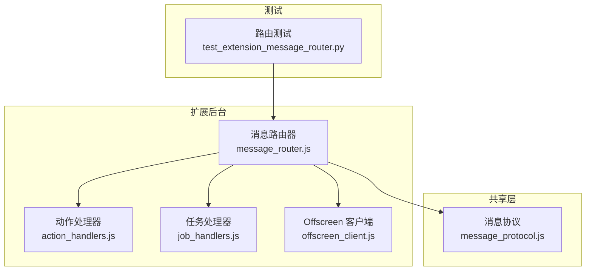
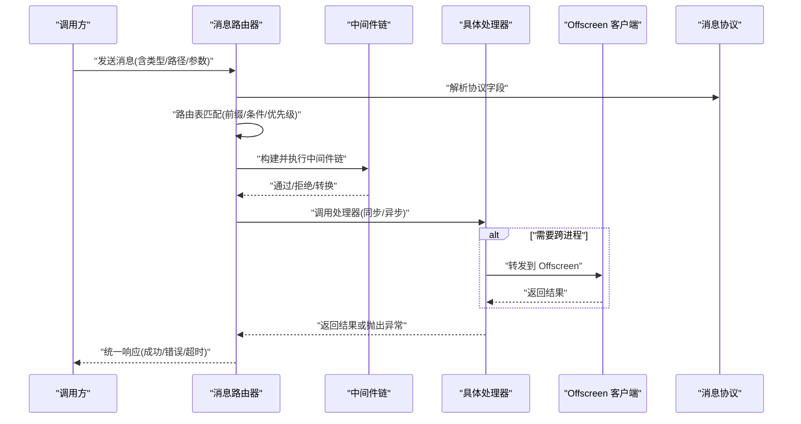
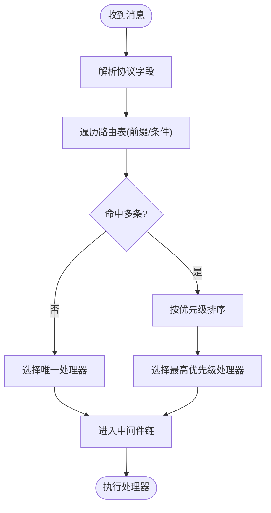
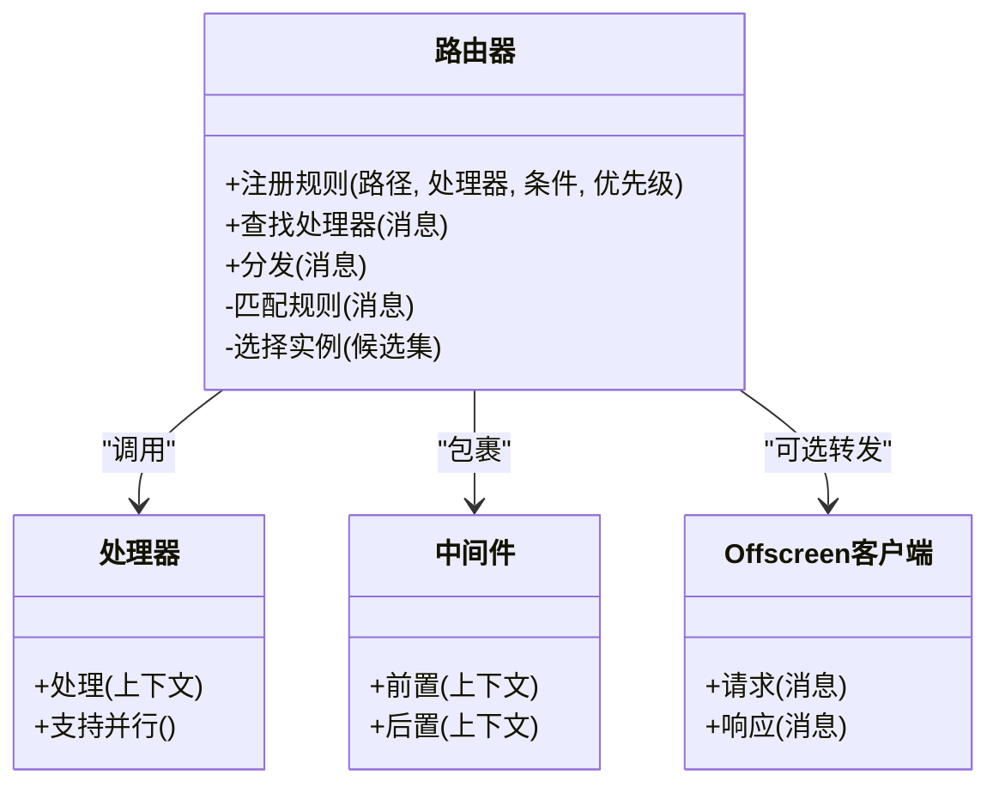
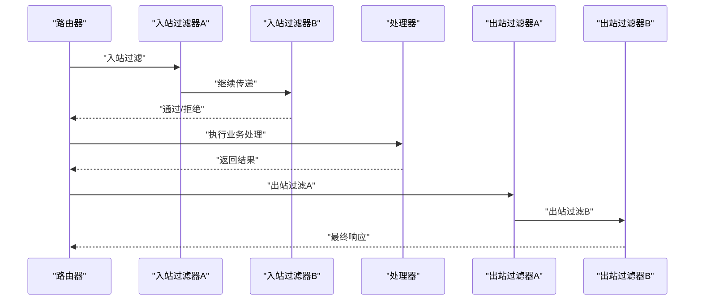
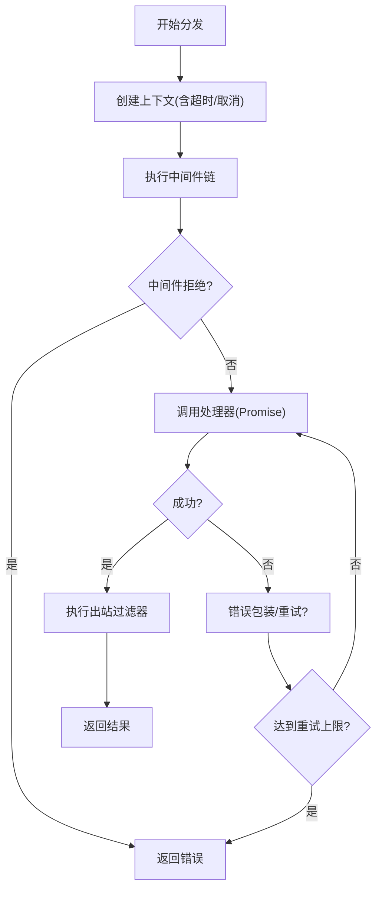
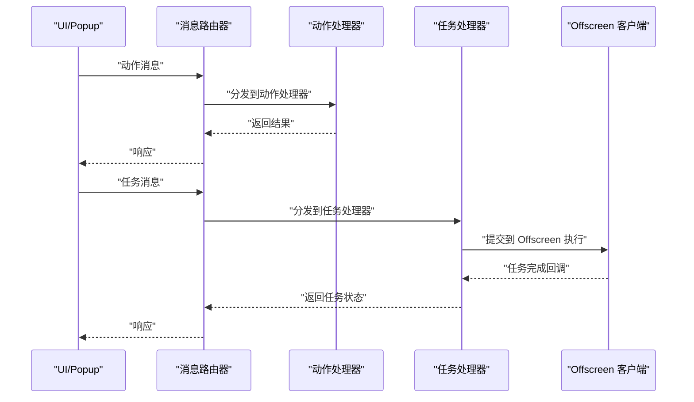
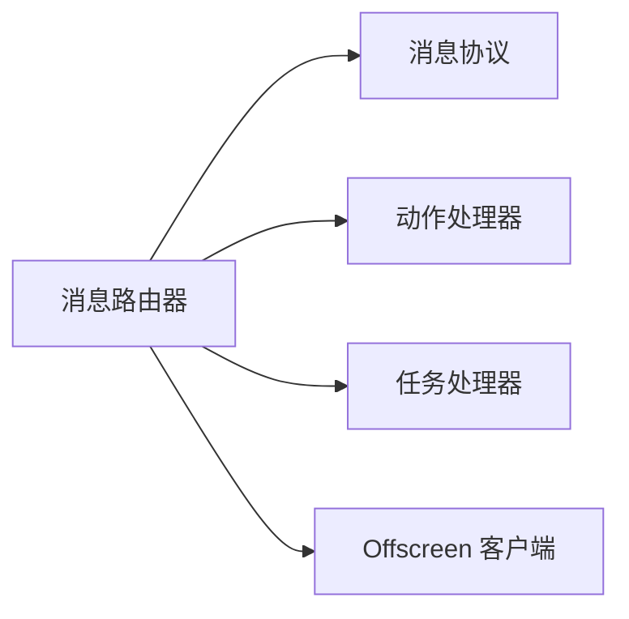

# 消息路由器

<cite>
**本文引用的文件**   
- [message_router.js](file://extension/background/message_router.js)
- [message_protocol.js](file://extension/shared/message_protocol.js)
- [action_handlers.js](file://extension/background/action_handlers.js)
- [job_handlers.js](file://extension/background/job_handlers.js)
- [offscreen_client.js](file://extension/background/offscreen_client.js)
- [test_extension_message_router.py](file://tests/test_extension_message_router.py)
</cite>

## 目录
1. [简介](#简介)
2. [项目结构](#项目结构)
3. [核心组件](#核心组件)
4. [架构总览](#架构总览)
5. [详细组件分析](#详细组件分析)
6. [依赖关系分析](#依赖关系分析)
7. [性能考虑](#性能考虑)
8. [故障排查指南](#故障排查指南)
9. [结论](#结论)
10. [附录](#附录)

## 简介
本文件为 Edge Bookmark 的消息路由器组件提供系统化文档，聚焦以下目标：
- 路由表管理与注册机制
- 消息分发算法与负载均衡策略
- 路由规则配置（路径匹配、条件路由、优先级）
- 消息处理管道（中间件模式、过滤器链、转换处理器）
- 异步处理模式（Promise 链式调用、错误传播、超时控制）
- 性能优化（缓存、连接池、内存使用）
- 监控与调试工具使用方法

该组件位于扩展后台脚本中，负责统一接收来自 UI/Popup、Offscreen 页面或其他模块的消息，按类型与路径进行分发，并协调各业务处理器完成工作。

## 项目结构
消息路由器相关文件与职责概览：
- 路由核心实现：extension/background/message_router.js
- 消息协议定义：extension/shared/message_protocol.js
- 动作处理器集合：extension/background/action_handlers.js
- 任务处理器集合：extension/background/job_handlers.js
- Offscreen 客户端通信：extension/background/offscreen_client.js
- 单元测试：tests/test_extension_message_router.py

图表来源
- [message_router.js](file://extension/background/message_router.js)
- [message_protocol.js](file://extension/shared/message_protocol.js)
- [action_handlers.js](file://extension/background/action_handlers.js)
- [job_handlers.js](file://extension/background/job_handlers.js)
- [offscreen_client.js](file://extension/background/offscreen_client.js)
- [test_extension_message_router.py](file://tests/test_extension_message_router.py)

章节来源
- [message_router.js](file://extension/background/message_router.js)
- [message_protocol.js](file://extension/shared/message_protocol.js)
- [action_handlers.js](file://extension/background/action_handlers.js)
- [job_handlers.js](file://extension/background/job_handlers.js)
- [offscreen_client.js](file://extension/background/offscreen_client.js)
- [test_extension_message_router.py](file://tests/test_extension_message_router.py)

## 核心组件
- 路由表管理
  - 支持按“通道/动作”或“路径前缀”注册处理器
  - 支持条件路由与优先级排序，确保更具体的规则优先命中
- 消息分发算法
  - 基于协议字段解析消息类型与参数
  - 采用最长前缀匹配与优先级权重选择最佳处理器
- 负载均衡策略
  - 对可并行处理的处理器提供轮询或随机选择
  - 针对 I/O 密集型任务通过 Offscreen 客户端分流
- 中间件与过滤器链
  - 在处理器执行前后插入通用逻辑（鉴权、限流、日志、重试等）
  - 支持转换处理器对入参/出参进行标准化
- 异步处理模式
  - 基于 Promise 的链式调用，统一错误传播与超时控制
  - 支持取消与降级策略

章节来源
- [message_router.js](file://extension/background/message_router.js)
- [message_protocol.js](file://extension/shared/message_protocol.js)

## 架构总览
消息从入口进入路由器后，依次经过协议校验、路由匹配、中间件链、处理器执行与结果封装返回。

图表来源
- [message_router.js](file://extension/background/message_router.js)
- [message_protocol.js](file://extension/shared/message_protocol.js)
- [offscreen_client.js](file://extension/background/offscreen_client.js)

## 详细组件分析

### 路由表与规则配置
- 路由表结构
  - 维护“路径/动作 -> 处理器”映射，支持多级路径与前缀匹配
  - 每条规则包含：路径模板、条件表达式、优先级权重、是否可并行标记
- 路径匹配
  - 支持静态段、动态段与通配符；优先匹配更具体的路径
- 条件路由
  - 基于消息体字段（如用户角色、环境标志）决定分支
- 优先级处理
  - 当多条规则同时命中时，按权重降序选择；权重相同则按注册顺序

图表来源
- [message_router.js](file://extension/background/message_router.js)
- [message_protocol.js](file://extension/shared/message_protocol.js)

章节来源
- [message_router.js](file://extension/background/message_router.js)
- [message_protocol.js](file://extension/shared/message_protocol.js)

### 消息分发算法与负载均衡
- 分发流程
  - 解析消息类型与目标路径
  - 计算候选处理器集合
  - 应用条件与优先级筛选
  - 若处理器支持并行，则根据负载策略选择实例
- 负载均衡策略
  - 轮询：适合无状态处理器
  - 随机：简单且分散热点
  - 最少活跃：结合 Offscreen 队列长度选择空闲实例
- 失败转移
  - 单个处理器失败时，尝试同组其他实例或回退默认处理器

图表来源
- [message_router.js](file://extension/background/message_router.js)
- [offscreen_client.js](file://extension/background/offscreen_client.js)

章节来源
- [message_router.js](file://extension/background/message_router.js)
- [offscreen_client.js](file://extension/background/offscreen_client.js)

### 消息处理管道（中间件与过滤器）
- 中间件模式
  - 每个中间件可访问上下文对象，具备前置/后置钩子
  - 常见中间件：鉴权、限流、审计日志、指标上报、重试包装
- 过滤器链
  - 入站过滤器：参数校验、敏感信息脱敏、格式转换
  - 出站过滤器：结果规范化、错误码映射、压缩
- 转换处理器
  - 将外部协议转换为内部模型，或将内部模型序列化为外部协议

图表来源
- [message_router.js](file://extension/background/message_router.js)

章节来源
- [message_router.js](file://extension/background/message_router.js)

### 异步处理模式（Promise、错误传播、超时）
- Promise 链式调用
  - 所有处理器返回 Promise，路由器统一 await 并捕获异常
- 错误传播
  - 中间件可包装错误为统一错误对象，携带错误码与上下文
- 超时控制
  - 为每次分发设置全局/局部超时阈值，超时触发降级或重试
- 取消与幂等
  - 支持传入取消令牌，处理器应检查并提前退出
  - 关键操作需保证幂等，避免重复执行造成副作用

图表来源
- [message_router.js](file://extension/background/message_router.js)

章节来源
- [message_router.js](file://extension/background/message_router.js)

### 处理器集成示例（动作与任务）
- 动作处理器
  - 用于短耗时、即时响应的操作（如查询书签树、更新标签）
- 任务处理器
  - 用于长耗时、可批量的操作（如批量迁移、快照导出），通常通过 Offscreen 客户端执行

图表来源
- [message_router.js](file://extension/background/message_router.js)
- [action_handlers.js](file://extension/background/action_handlers.js)
- [job_handlers.js](file://extension/background/job_handlers.js)
- [offscreen_client.js](file://extension/background/offscreen_client.js)

章节来源
- [action_handlers.js](file://extension/background/action_handlers.js)
- [job_handlers.js](file://extension/background/job_handlers.js)
- [offscreen_client.js](file://extension/background/offscreen_client.js)

## 依赖关系分析
- 直接依赖
  - 消息协议：用于解析与序列化消息
  - 动作/任务处理器：业务逻辑的具体实现
  - Offscreen 客户端：跨进程执行与资源隔离
- 间接依赖
  - 存储与书签树：由处理器内部使用，不直接影响路由器
- 潜在循环依赖
  - 路由器不应反向依赖具体处理器实现细节，仅通过接口契约交互

图表来源
- [message_router.js](file://extension/background/message_router.js)
- [message_protocol.js](file://extension/shared/message_protocol.js)
- [action_handlers.js](file://extension/background/action_handlers.js)
- [job_handlers.js](file://extension/background/job_handlers.js)
- [offscreen_client.js](file://extension/background/offscreen_client.js)

章节来源
- [message_router.js](file://extension/background/message_router.js)
- [message_protocol.js](file://extension/shared/message_protocol.js)
- [action_handlers.js](file://extension/background/action_handlers.js)
- [job_handlers.js](file://extension/background/job_handlers.js)
- [offscreen_client.js](file://extension/background/offscreen_client.js)

## 性能考虑
- 缓存策略
  - 对只读查询结果进行短期缓存，减少重复计算
  - 使用 LRU 或时间窗口淘汰策略，避免内存膨胀
- 连接池管理
  - 对外部服务（如 AI 端点）建立连接池，复用连接降低握手开销
  - 合理设置最大连接数与空闲回收时间
- 内存使用优化
  - 大对象分块处理，避免一次性加载
  - 及时释放中间态引用，避免闭包泄漏
- 并发与背压
  - 限制并发度，防止阻塞事件循环
  - 对慢处理器引入队列与背压，保护整体吞吐

[本节为通用指导，无需特定文件来源]

## 故障排查指南
- 常见问题定位
  - 路由未命中：检查路径模板与条件表达式是否正确注册
  - 处理器超时：确认超时阈值与重试策略是否合理
  - 中间件拒绝：查看入站过滤器日志，定位参数校验失败原因
- 调试技巧
  - 启用详细日志，记录消息 ID、路径、处理器名称与耗时
  - 使用测试套件验证路由规则与边界情况
- 监控指标
  - 分发成功率、P95/P99 延迟、错误码分布、处理器负载
  - Offscreen 任务队列长度与积压率

章节来源
- [test_extension_message_router.py](file://tests/test_extension_message_router.py)

## 结论
消息路由器作为扩展后台的核心枢纽，通过清晰的路由表、灵活的中间件链与稳健的异步处理模式，实现了高内聚、低耦合的消息分发能力。配合合理的性能优化与完善的监控调试手段，可在复杂场景下保持高可用与高性能。

[本节为总结性内容，无需特定文件来源]

## 附录
- 术语
  - 通道：消息的逻辑分组，便于权限与版本管理
  - 动作：短耗时、即时响应的操作
  - 任务：长耗时、可异步执行的操作
- 最佳实践
  - 明确处理器职责边界，单一职责
  - 为所有外部调用设置超时与重试上限
  - 使用统一的错误模型与日志规范

[本节为补充说明，无需特定文件来源]