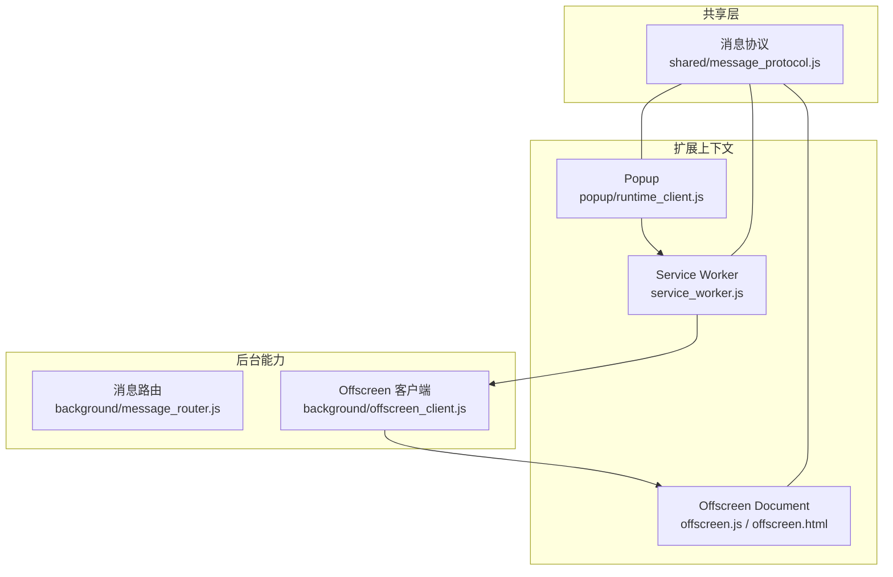
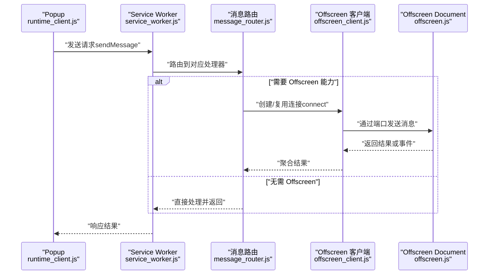
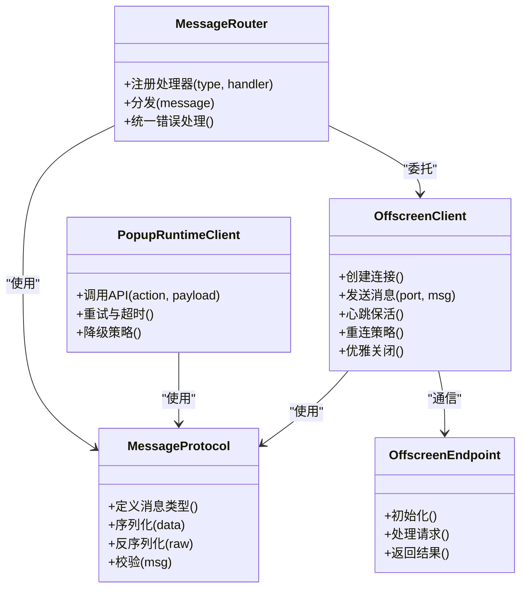
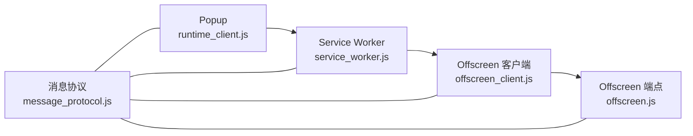
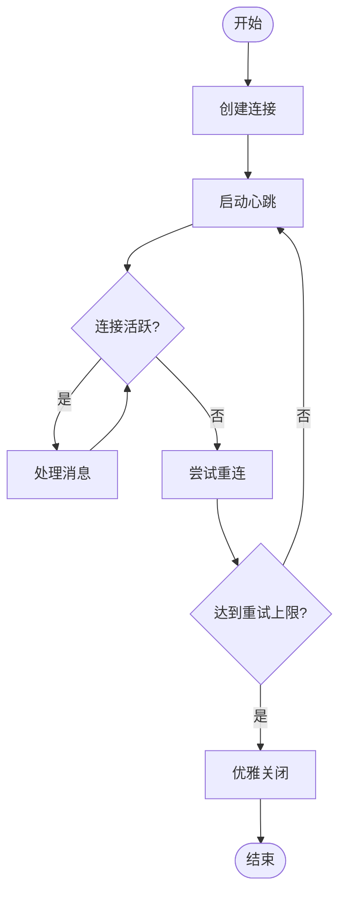

# 跨上下文通信

<cite>
**本文引用的文件**   
- [manifest.json](file://extension/manifest.json)
- [service_worker.js](file://extension/service_worker.js)
- [offscreen.html](file://extension/offscreen.html)
- [offscreen.js](file://extension/offscreen.js)
- [background/message_router.js](file://extension/background/message_router.js)
- [background/offscreen_client.js](file://extension/background/offscreen_client.js)
- [popup/runtime_client.js](file://extension/popup/runtime_client.js)
- [shared/message_protocol.js](file://extension/shared/message_protocol.js)
</cite>

## 目录
1. [简介](#简介)
2. [项目结构](#项目结构)
3. [核心组件](#核心组件)
4. [架构总览](#架构总览)
5. [详细组件分析](#详细组件分析)
6. [依赖关系分析](#依赖关系分析)
7. [性能考虑](#性能考虑)
8. [故障排查指南](#故障排查指南)
9. [结论](#结论)
10. [附录](#附录)

## 简介
本文件聚焦 Edge Bookmark 扩展在 Service Worker、Popup 与 Offscreen Document 之间的跨上下文通信机制。文档从架构设计、消息协议、连接管理、状态同步、错误处理与重试策略、以及性能监控与调试等方面，系统性阐述各上下文间的交互方式与安全边界，并提供最佳实践建议，帮助开发者稳定高效地实现跨上下文调用。

## 项目结构
Edge Bookmark 的跨上下文通信主要涉及以下模块：
- 清单与入口：定义扩展能力与上下文（Service Worker、Offscreen）
- Service Worker：作为后台协调者，负责路由消息、维护连接、调度任务
- Popup：用户界面侧，发起请求并展示结果
- Offscreen Document：承载需要 DOM 或浏览器页面 API 的重型任务
- 共享协议：统一的消息类型与字段约定，确保上下文间契约一致

图表来源
- [manifest.json](file://extension/manifest.json)
- [service_worker.js](file://extension/service_worker.js)
- [offscreen.html](file://extension/offscreen.html)
- [offscreen.js](file://extension/offscreen.js)
- [background/message_router.js](file://extension/background/message_router.js)
- [background/offscreen_client.js](file://extension/background/offscreen_client.js)
- [popup/runtime_client.js](file://extension/popup/runtime_client.js)
- [shared/message_protocol.js](file://extension/shared/message_protocol.js)

章节来源
- [manifest.json](file://extension/manifest.json)
- [service_worker.js](file://extension/service_worker.js)
- [offscreen.html](file://extension/offscreen.html)
- [offscreen.js](file://extension/offscreen.js)
- [background/message_router.js](file://extension/background/message_router.js)
- [background/offscreen_client.js](file://extension/background/offscreen_client.js)
- [popup/runtime_client.js](file://extension/popup/runtime_client.js)
- [shared/message_protocol.js](file://extension/shared/message_protocol.js)

## 核心组件
- 消息协议（shared/message_protocol.js）
  - 定义所有跨上下文消息的类型、字段与校验规则，是各上下文通信的“契约”。
  - 包含请求/响应结构、事件类型、错误码等，确保不同上下文的序列化与反序列化一致。
- 消息路由（background/message_router.js）
  - 在 Service Worker 中注册监听器，按消息类型分发到具体处理器。
  - 提供统一的错误包装与超时控制，保证调用方获得一致的失败语义。
- Offscreen 客户端（background/offscreen_client.js）
  - 封装与 Offscreen Document 的连接建立、保持活跃、优雅关闭。
  - 对 chrome.runtime.connect 进行高层抽象，提供幂等的重连与心跳机制。
- Popup 运行时客户端（popup/runtime_client.js）
  - 面向 UI 的轻量调用封装，屏蔽底层 sendMessage/connect 细节。
  - 提供重试、降级与超时策略，便于上层业务逻辑简洁可靠。
- Offscreen 端点（offscreen.js / offscreen.html）
  - 在 Offscreen 上下文中加载必要脚本，接收来自 Service Worker 的请求并执行需要 DOM/页面 API 的任务。
  - 通过 runtime 端口回传结果或事件流。

章节来源
- [shared/message_protocol.js](file://extension/shared/message_protocol.js)
- [background/message_router.js](file://extension/background/message_router.js)
- [background/offscreen_client.js](file://extension/background/offscreen_client.js)
- [popup/runtime_client.js](file://extension/popup/runtime_client.js)
- [offscreen.js](file://extension/offscreen.js)
- [offscreen.html](file://extension/offscreen.html)

## 架构总览
下图展示了典型的一次跨上下文调用流程：Popup 通过 Service Worker 路由，必要时经由 Offscreen 客户端与 Offscreen Document 协作完成工作，最终将结果返回给 Popup。

图表来源
- [popup/runtime_client.js](file://extension/popup/runtime_client.js)
- [service_worker.js](file://extension/service_worker.js)
- [background/message_router.js](file://extension/background/message_router.js)
- [background/offscreen_client.js](file://extension/background/offscreen_client.js)
- [offscreen.js](file://extension/offscreen.js)

## 详细组件分析

### 消息协议（shared/message_protocol.js）
- 职责
  - 统一定义消息类型、字段名、必填项与可选项。
  - 提供序列化/反序列化工具，减少上下文间数据格式差异。
  - 定义错误码与异常结构，使错误可诊断。
- 关键要点
  - 使用稳定的枚举值表示动作类型，避免字符串漂移。
  - 为大型负载提供分片或压缩提示（若适用）。
  - 明确超时与重试字段，供调用方参考。

章节来源
- [shared/message_protocol.js](file://extension/shared/message_protocol.js)

### 消息路由（background/message_router.js）
- 职责
  - 在 Service Worker 中集中注册消息监听器。
  - 根据消息类型选择处理器，支持同步/异步处理。
  - 统一捕获异常，转换为协议定义的响应结构。
- 关键要点
  - 处理器应幂等，避免重复投递导致副作用。
  - 对耗时操作设置超时，防止长时间占用 Service Worker。
  - 记录结构化日志，便于定位问题。

章节来源
- [background/message_router.js](file://extension/background/message_router.js)

### Offscreen 客户端（background/offscreen_client.js）
- 职责
  - 管理 Offscreen 页面的生命周期：创建、激活、销毁。
  - 维护长连接（chrome.runtime.connect），实现心跳保活。
  - 提供自动重连与退避策略，提升稳定性。
- 关键要点
  - 连接池：复用已有连接，避免频繁创建销毁。
  - 心跳：周期性发送 ping，检测远端存活。
  - 优雅关闭：先停止新请求，等待进行中请求完成后再断开。

章节来源
- [background/offscreen_client.js](file://extension/background/offscreen_client.js)

### Popup 运行时客户端（popup/runtime_client.js）
- 职责
  - 向 Service Worker 发送请求，封装重试、超时与降级。
  - 暴露简洁 API，隐藏 connect/sendMessage 的差异。
- 关键要点
  - 重试策略：指数退避 + 最大重试次数。
  - 降级方案：当 Offscreen 不可用时，退回轻量路径或返回友好错误。
  - 取消机制：支持请求取消，避免无效等待。

章节来源
- [popup/runtime_client.js](file://extension/popup/runtime_client.js)

### Offscreen 端点（offscreen.js / offscreen.html）
- 职责
  - 在 Offscreen 上下文中初始化运行环境，加载必要脚本。
  - 监听来自 Service Worker 的消息，执行业务逻辑并返回结果。
  - 处理连接断开与重连，保持状态一致性。
- 关键要点
  - 最小化资源加载，按需引入脚本。
  - 对长任务进行分片或节流，避免阻塞主线程。
  - 输出结构化日志与指标，便于远程诊断。

章节来源
- [offscreen.js](file://extension/offscreen.js)
- [offscreen.html](file://extension/offscreen.html)

### 类图：关键对象与关系

图表来源
- [shared/message_protocol.js](file://extension/shared/message_protocol.js)
- [background/message_router.js](file://extension/background/message_router.js)
- [background/offscreen_client.js](file://extension/background/offscreen_client.js)
- [popup/runtime_client.js](file://extension/popup/runtime_client.js)
- [offscreen.js](file://extension/offscreen.js)

## 依赖关系分析
- 上下文隔离
  - Service Worker、Popup、Offscreen 各自拥有独立作用域，仅能通过 chrome.runtime 提供的 API 通信。
- 直接依赖
  - Popup 依赖 Service Worker 的消息接口。
  - Service Worker 依赖 Offscreen 客户端以访问 Offscreen 能力。
  - 各组件均依赖共享消息协议以确保契约一致。
- 潜在循环依赖
  - 通过分层与单向依赖避免循环：UI -> 后台 -> Offscreen；协议层被多方引用但不反向依赖。

图表来源
- [popup/runtime_client.js](file://extension/popup/runtime_client.js)
- [service_worker.js](file://extension/service_worker.js)
- [background/offscreen_client.js](file://extension/background/offscreen_client.js)
- [offscreen.js](file://extension/offscreen.js)
- [shared/message_protocol.js](file://extension/shared/message_protocol.js)

章节来源
- [popup/runtime_client.js](file://extension/popup/runtime_client.js)
- [service_worker.js](file://extension/service_worker.js)
- [background/offscreen_client.js](file://extension/background/offscreen_client.js)
- [offscreen.js](file://extension/offscreen.js)
- [shared/message_protocol.js](file://extension/shared/message_protocol.js)

## 性能考虑
- 连接复用
  - 优先复用已建立的 Offscreen 连接，避免频繁创建销毁带来的开销。
- 批量与合并
  - 对高频小消息进行批处理，降低 IPC 次数。
- 超时与取消
  - 合理设置超时时间，及时释放资源；支持请求取消以减少无效等待。
- 按需加载
  - Offscreen 端按需引入脚本与资源，缩短启动时间。
- 指标采集
  - 统计请求时延、成功率、重连次数等指标，用于持续优化。

[本节为通用指导，不直接分析具体文件]

## 故障排查指南
- 常见问题
  - 连接丢失：检查心跳是否成功、远端是否崩溃或卸载。
  - 消息未到达：确认路由是否正确注册、消息类型是否匹配。
  - 超时失败：评估任务耗时、调整超时阈值或拆分任务。
- 定位技巧
  - 在 Service Worker 与 Offscreen 端输出结构化日志，包含消息类型、ID、耗时与错误堆栈。
  - 使用浏览器开发者工具查看 runtime 连接与端口状态。
- 恢复策略
  - 自动重连与退避，限制最大重试次数。
  - 优雅关闭：停止接受新请求，等待进行中请求完成后断开连接。

章节来源
- [background/message_router.js](file://extension/background/message_router.js)
- [background/offscreen_client.js](file://extension/background/offscreen_client.js)
- [offscreen.js](file://extension/offscreen.js)

## 结论
通过统一的消息协议、清晰的分层与可靠的连接管理，Edge Bookmark 实现了 Service Worker、Popup 与 Offscreen Document 之间的高效、安全通信。遵循本文的最佳实践与排障建议，可在复杂场景下保持稳定与高性能。

[本节为总结性内容，不直接分析具体文件]

## 附录

### 连接管理与生命周期控制
- 连接建立
  - 首次调用时创建连接，缓存连接实例以便复用。
- 保持活跃
  - 定期发送心跳，检测远端存活；远端收到心跳后回复确认。
- 优雅关闭
  - 停止接收新请求，等待进行中请求完成，再主动断开连接并清理资源。

图表来源
- [background/offscreen_client.js](file://extension/background/offscreen_client.js)

章节来源
- [background/offscreen_client.js](file://extension/background/offscreen_client.js)

### 状态同步机制
- 共享状态管理
  - 由 Service Worker 作为权威源，维护全局状态；其他上下文通过请求获取最新状态。
- 变更监听
  - 通过事件或轮询机制通知相关上下文状态变化。
- 冲突解决
  - 采用版本号或时间戳进行冲突检测，后写覆盖或合并策略依据业务需求确定。

[本节为概念性说明，不直接分析具体文件]

### 跨上下文调用的最佳实践
- 错误处理
  - 统一错误码与错误信息结构，便于前端展示与后端诊断。
- 重试策略
  - 指数退避 + 抖动，限制最大重试次数；区分可重试与不可重试错误。
- 降级方案
  - 当 Offscreen 不可用时，退回轻量路径或返回友好提示，保障用户体验。

[本节为通用指导，不直接分析具体文件]

### 性能监控与调试技巧
- 指标采集
  - 记录请求时延、成功率、重连次数、内存占用等。
- 调试技巧
  - 在关键路径添加结构化日志；使用浏览器开发者工具观察连接与端口状态。
- 压测与回归
  - 模拟高并发与异常场景，验证系统鲁棒性与恢复能力。

[本节为通用指导，不直接分析具体文件]