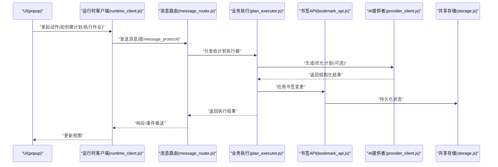
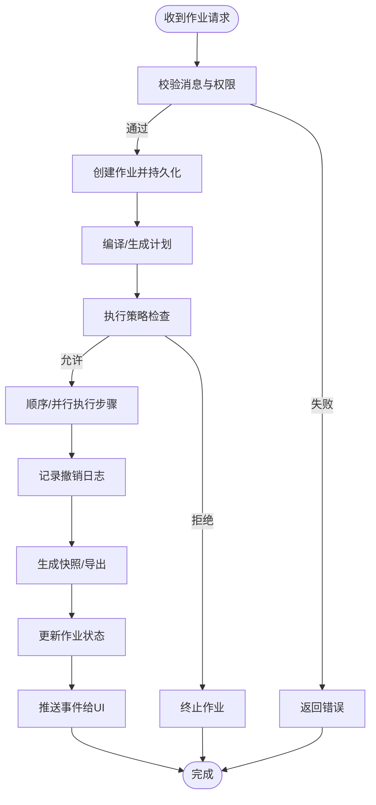
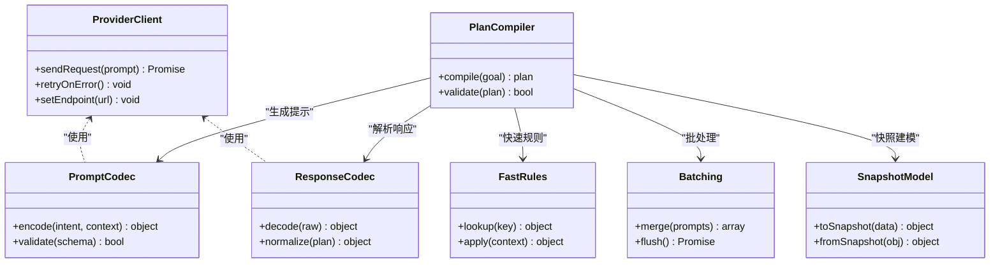
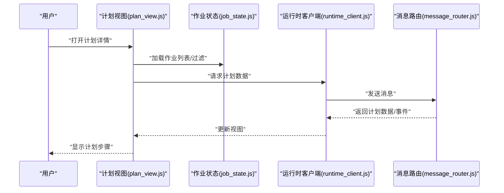
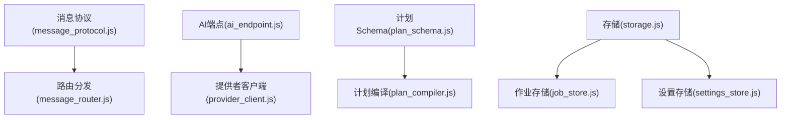
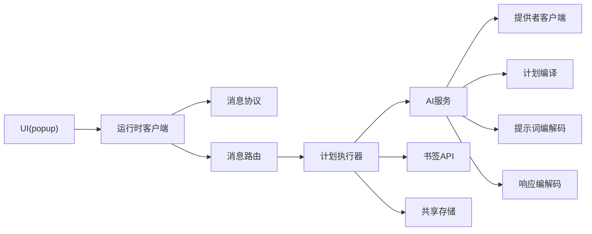

# 组件交互模式

<cite>
**本文引用的文件**   
- [service_worker.js](file://extension/service_worker.js)
- [offscreen.js](file://extension/offscreen.js)
- [message_router.js](file://extension/background/message_router.js)
- [bookmark_api.js](file://extension/background/bookmark_api.js)
- [bookmark_tree.js](file://extension/background/bookmark_tree.js)
- [plan_executor.js](file://extension/background/plan_executor.js)
- [job_handlers.js](file://extension/background/job_handlers.js)
- [job_lifecycle.js](file://extension/background/job_lifecycle.js)
- [job_store.js](file://extension/background/job_store.js)
- [undo_log.js](file://extension/background/undo_log.js)
- [snapshot_export.js](file://extension/background/snapshot_export.js)
- [execution_policy.js](file://extension/background/execution_policy.js)
- [action_handlers.js](file://extension/background/action_handlers.js)
- [offscreen_client.js](file://extension/background/offscreen_client.js)
- [runtime_client.js](file://extension/popup/runtime_client.js)
- [job_state.js](file://extension/popup/job_state.js)
- [plan_view.js](file://extension/popup/plan_view.js)
- [settings_store.js](file://extension/popup/settings_store.js)
- [secrets.js](file://extension/popup/secrets.js)
- [i18n.js](file://extension/popup/i18n.js)
- [ai_endpoint.js](file://extension/shared/ai_endpoint.js)
- [message_protocol.js](file://extension/shared/message_protocol.js)
- [path_utils.js](file://extension/shared/path_utils.js)
- [plan_schema.js](file://extension/shared/plan_schema.js)
- [storage.js](file://extension/shared/storage.js)
- [provider_client.js](file://extension/ai/provider_client.js)
- [prompt_codec.js](file://extension/ai/prompt_codec.js)
- [response_codec.js](file://extension/ai/response_codec.js)
- [batching.js](file://extension/ai/batching.js)
- [fast_rules.js](file://extension/ai/fast_rules.js)
- [plan_compiler.js](file://extension/ai/plan_compiler.js)
- [snapshot_model.js](file://extension/ai/snapshot_model.js)
- [manifest.json](file://extension/manifest.json)
</cite>

## 目录
1. [简介](#简介)
2. [项目结构](#项目结构)
3. [核心组件](#核心组件)
4. [架构总览](#架构总览)
5. [详细组件分析](#详细组件分析)
6. [依赖关系分析](#依赖关系分析)
7. [性能考量](#性能考量)
8. [故障排查指南](#故障排查指南)
9. [结论](#结论)
10. [附录](#附录)

## 简介
本文件聚焦于 Edge Bookmark 的“组件交互模式”，围绕背景服务、AI 服务、UI 层与共享模块的职责边界、通信机制（同步调用、异步通知、事件订阅）、状态管理（全局同步、局部隔离、持久化）、依赖注入与模块化设计（初始化顺序、循环依赖处理、接口抽象）进行系统化说明。文档同时提供时序图与序列图，展示典型场景下的协作过程，并总结解耦原则、接口设计与向后兼容性策略。

## 项目结构
Edge Bookmark 采用分层与按功能域结合的目录组织方式：
- extension/background：浏览器后台进程逻辑，负责消息路由、书签树与 API、计划执行、作业生命周期与存储、撤销日志、快照导出、执行策略、Offscreen 客户端等。
- extension/popup：弹出式 UI 侧逻辑，包含运行时客户端、作业状态视图、计划视图、设置存储、密钥访问、国际化等。
- extension/ai：AI 相关能力，包括提供者客户端、提示词编解码、响应编解码、批处理、快速规则、计划编译、快照模型等。
- extension/shared：跨上下文共享协议与工具，如消息协议、AI 端点、路径工具、计划 Schema、通用存储封装等。
- extension：入口与清单，含 service worker、offscreen 页面、popup 页面及 manifest。

```mermaid
graph TB
subgraph "扩展入口"
SW["service_worker.js"]
OS["offscreen.js"]
MAN["manifest.json"]
end
subgraph "背景服务"
MR["background/message_router.js"]
BA["background/bookmark_api.js"]
BT["background/bookmark_tree.js"]
PE["background/plan_executor.js"]
JH["background/job_handlers.js"]
JL["background/job_lifecycle.js"]
JS["background/job_store.js"]
UL["background/undo_log.js"]
SE["background/snapshot_export.js"]
EP["background/execution_policy.js"]
AH["background/action_handlers.js"]
OC["background/offscreen_client.js"]
end
subgraph "UI 层"
RC["popup/runtime_client.js"]
JST["popup/job_state.js"]
PV["popup/plan_view.js"]
SS["popup/settings_store.js"]
SEC["popup/secrets.js"]
I18N["popup/i18n.js"]
end
subgraph "AI 服务"
PC["ai/provider_client.js"]
PRC["ai/prompt_codec.js"]
RSC["ai/response_codec.js"]
BAT["ai/batching.js"]
FR["ai/fast_rules.js"]
PLC["ai/plan_compiler.js"]
SM["ai/snapshot_model.js"]
end
subgraph "共享模块"
MP["shared/message_protocol.js"]
AE["shared/ai_endpoint.js"]
PU["shared/path_utils.js"]
PS["shared/plan_schema.js"]
ST["shared/storage.js"]
end
SW --> MR
SW --> OC
OS --> OC
MR --> BA
MR --> PE
MR --> JH
MR --> JL
MR --> JS
MR --> UL
MR --> SE
MR --> EP
MR --> AH
MR --> OC
RC --> MR
RC --> AE
RC --> ST
RC --> PS
PE --> PC
PE --> PLC
PE --> FR
PE --> BAT
PE --> RSC
PE --> PRC
PE --> SM
BA --> BT
BA --> ST
BA --> PS
BA --> PU
JH --> JL
JH --> JS
JH --> UL
JH --> SE
JH --> EP
```

图表来源
- [service_worker.js](file://extension/service_worker.js)
- [offscreen.js](file://extension/offscreen.js)
- [manifest.json](file://extension/manifest.json)
- [message_router.js](file://extension/background/message_router.js)
- [bookmark_api.js](file://extension/background/bookmark_api.js)
- [bookmark_tree.js](file://extension/background/bookmark_tree.js)
- [plan_executor.js](file://extension/background/plan_executor.js)
- [job_handlers.js](file://extension/background/job_handlers.js)
- [job_lifecycle.js](file://extension/background/job_lifecycle.js)
- [job_store.js](file://extension/background/job_store.js)
- [undo_log.js](file://extension/background/undo_log.js)
- [snapshot_export.js](file://extension/background/snapshot_export.js)
- [execution_policy.js](file://extension/background/execution_policy.js)
- [action_handlers.js](file://extension/background/action_handlers.js)
- [offscreen_client.js](file://extension/background/offscreen_client.js)
- [runtime_client.js](file://extension/popup/runtime_client.js)
- [ai_endpoint.js](file://extension/shared/ai_endpoint.js)
- [message_protocol.js](file://extension/shared/message_protocol.js)
- [path_utils.js](file://extension/shared/path_utils.js)
- [plan_schema.js](file://extension/shared/plan_schema.js)
- [storage.js](file://extension/shared/storage.js)
- [provider_client.js](file://extension/ai/provider_client.js)
- [prompt_codec.js](file://extension/ai/prompt_codec.js)
- [response_codec.js](file://extension/ai/response_codec.js)
- [batching.js](file://extension/ai/batching.js)
- [fast_rules.js](file://extension/ai/fast_rules.js)
- [plan_compiler.js](file://extension/ai/plan_compiler.js)
- [snapshot_model.js](file://extension/ai/snapshot_model.js)

章节来源
- [manifest.json](file://extension/manifest.json)

## 核心组件
- 背景服务（Background）
  - 消息路由：统一接收来自 UI 与 Offscreen 的消息，按协议分发到具体处理器。
  - 书签 API/树：封装对浏览器书签的读取、变更与树形结构维护。
  - 计划执行器：将用户意图或 AI 生成的计划转换为可执行的步骤，协调各子任务。
  - 作业系统：定义作业生命周期、持久化、撤销日志、快照导出与执行策略。
  - Offscreen 客户端：与 Offscreen 页面通信，承载需要 DOM/渲染能力的操作。
- AI 服务（AI）
  - 提供者客户端：与外部 AI 服务交互，支持重试、超时、鉴权等。
  - 提示词/响应编解码：对输入输出进行结构化编码与校验。
  - 批处理与快速规则：提升吞吐与降低延迟的策略。
  - 计划编译与快照模型：将高层目标编译为可执行计划，并对快照数据进行建模。
- UI 层（Popup）
  - 运行时客户端：向背景服务发送请求、监听状态更新。
  - 作业状态与计划视图：展示作业进度、计划详情与结果。
  - 设置存储与密钥访问：读写用户配置与安全敏感信息。
  - 国际化：多语言文案管理。
- 共享模块（Shared）
  - 消息协议：定义跨上下文的请求/响应/事件契约。
  - AI 端点：集中管理 AI 服务地址与版本兼容。
  - 路径工具与计划 Schema：通用工具与数据模型约束。
  - 存储封装：统一的持久化访问接口。

章节来源
- [message_router.js](file://extension/background/message_router.js)
- [bookmark_api.js](file://extension/background/bookmark_api.js)
- [bookmark_tree.js](file://extension/background/bookmark_tree.js)
- [plan_executor.js](file://extension/background/plan_executor.js)
- [job_handlers.js](file://extension/background/job_handlers.js)
- [job_lifecycle.js](file://extension/background/job_lifecycle.js)
- [job_store.js](file://extension/background/job_store.js)
- [undo_log.js](file://extension/background/undo_log.js)
- [snapshot_export.js](file://extension/background/snapshot_export.js)
- [execution_policy.js](file://extension/background/execution_policy.js)
- [offscreen_client.js](file://extension/background/offscreen_client.js)
- [runtime_client.js](file://extension/popup/runtime_client.js)
- [job_state.js](file://extension/popup/job_state.js)
- [plan_view.js](file://extension/popup/plan_view.js)
- [settings_store.js](file://extension/popup/settings_store.js)
- [secrets.js](file://extension/popup/secrets.js)
- [i18n.js](file://extension/popup/i18n.js)
- [provider_client.js](file://extension/ai/provider_client.js)
- [prompt_codec.js](file://extension/ai/prompt_codec.js)
- [response_codec.js](file://extension/ai/response_codec.js)
- [batching.js](file://extension/ai/batching.js)
- [fast_rules.js](file://extension/ai/fast_rules.js)
- [plan_compiler.js](file://extension/ai/plan_compiler.js)
- [snapshot_model.js](file://extension/ai/snapshot_model.js)
- [message_protocol.js](file://extension/shared/message_protocol.js)
- [ai_endpoint.js](file://extension/shared/ai_endpoint.js)
- [path_utils.js](file://extension/shared/path_utils.js)
- [plan_schema.js](file://extension/shared/plan_schema.js)
- [storage.js](file://extension/shared/storage.js)

## 架构总览
整体架构遵循“UI 通过运行时客户端发起请求 → 背景服务消息路由分发 → 领域处理器执行业务逻辑 → 必要时调用 AI 服务 → 结果回写存储/返回 UI”的分层模型。共享模块提供跨上下文契约与通用能力；Offscreen 作为专用渲染/DOM 上下文被背景服务按需调用。

图表来源
- [runtime_client.js](file://extension/popup/runtime_client.js)
- [message_router.js](file://extension/background/message_router.js)
- [plan_executor.js](file://extension/background/plan_executor.js)
- [bookmark_api.js](file://extension/background/bookmark_api.js)
- [provider_client.js](file://extension/ai/provider_client.js)
- [storage.js](file://extension/shared/storage.js)
- [message_protocol.js](file://extension/shared/message_protocol.js)

## 详细组件分析

### 背景服务：消息路由与作业编排
- 职责边界
  - 消息路由：解析消息协议、鉴权与限流、分发到处理器、聚合响应与错误。
  - 作业编排：基于计划执行器驱动步骤，结合执行策略与撤销日志保证幂等与可回滚。
  - 书签 API：屏蔽底层书签差异，提供树形结构与批量操作。
- 关键流程
  - 作业创建与执行：由 UI 触发，经路由进入作业处理器，写入作业存储，启动生命周期，逐步执行计划步骤，记录撤销日志，最终导出快照或更新状态。
  - 撤销与恢复：在执行前记录快照，失败时按撤销日志回滚。
- 通信模式
  - 同步调用：UI 请求 → 路由 → 处理器 → 返回响应。
  - 异步通知：作业状态变更通过事件通道推送至 UI。
  - 事件订阅：UI 订阅作业/计划事件以刷新界面。

图表来源
- [message_router.js](file://extension/background/message_router.js)
- [job_handlers.js](file://extension/background/job_handlers.js)
- [job_lifecycle.js](file://extension/background/job_lifecycle.js)
- [job_store.js](file://extension/background/job_store.js)
- [plan_executor.js](file://extension/background/plan_executor.js)
- [execution_policy.js](file://extension/background/execution_policy.js)
- [undo_log.js](file://extension/background/undo_log.js)
- [snapshot_export.js](file://extension/background/snapshot_export.js)

章节来源
- [message_router.js](file://extension/background/message_router.js)
- [job_handlers.js](file://extension/background/job_handlers.js)
- [job_lifecycle.js](file://extension/background/job_lifecycle.js)
- [job_store.js](file://extension/background/job_store.js)
- [plan_executor.js](file://extension/background/plan_executor.js)
- [execution_policy.js](file://extension/background/execution_policy.js)
- [undo_log.js](file://extension/background/undo_log.js)
- [snapshot_export.js](file://extension/background/snapshot_export.js)

### AI 服务：提示词、响应与计划编译
- 职责边界
  - 提示词编解码：将用户意图与上下文编码为结构化提示，确保字段完整与类型安全。
  - 响应编解码：校验与规范化 AI 返回，映射为内部计划模型。
  - 提供者客户端：封装网络请求、重试、超时、鉴权与速率限制。
  - 批处理与快速规则：合并请求、缓存热点规则以降低延迟与成本。
  - 计划编译：将高层目标分解为可执行步骤，并与计划 Schema 对齐。
- 通信模式
  - 同步调用：计划执行器在需要时调用 AI 生成/优化计划。
  - 异步回调：长耗时任务完成后通过事件通知执行器继续后续步骤。
- 容错与降级
  - 失败重试、退避、熔断；当 AI 不可用时回退到本地规则或快速路径。

图表来源
- [provider_client.js](file://extension/ai/provider_client.js)
- [prompt_codec.js](file://extension/ai/prompt_codec.js)
- [response_codec.js](file://extension/ai/response_codec.js)
- [batching.js](file://extension/ai/batching.js)
- [fast_rules.js](file://extension/ai/fast_rules.js)
- [plan_compiler.js](file://extension/ai/plan_compiler.js)
- [snapshot_model.js](file://extension/ai/snapshot_model.js)

章节来源
- [provider_client.js](file://extension/ai/provider_client.js)
- [prompt_codec.js](file://extension/ai/prompt_codec.js)
- [response_codec.js](file://extension/ai/response_codec.js)
- [batching.js](file://extension/ai/batching.js)
- [fast_rules.js](file://extension/ai/fast_rules.js)
- [plan_compiler.js](file://extension/ai/plan_compiler.js)
- [snapshot_model.js](file://extension/ai/snapshot_model.js)

### UI 层：运行时客户端与视图状态
- 职责边界
  - 运行时客户端：封装与背景服务的消息收发、错误处理、重连与去抖。
  - 作业状态：维护当前作业列表、选中项与过滤条件。
  - 计划视图：渲染计划步骤、状态与结果摘要。
  - 设置存储与密钥：读写用户偏好与安全信息。
  - 国际化：根据语言切换文案。
- 通信模式
  - 同步调用：点击按钮后等待响应更新视图。
  - 事件订阅：监听作业状态变化、计划更新、错误告警。
  - 局部状态隔离：每个视图维护自身状态，避免跨视图耦合。

图表来源
- [plan_view.js](file://extension/popup/plan_view.js)
- [job_state.js](file://extension/popup/job_state.js)
- [runtime_client.js](file://extension/popup/runtime_client.js)
- [message_router.js](file://extension/background/message_router.js)

章节来源
- [runtime_client.js](file://extension/popup/runtime_client.js)
- [job_state.js](file://extension/popup/job_state.js)
- [plan_view.js](file://extension/popup/plan_view.js)
- [settings_store.js](file://extension/popup/settings_store.js)
- [secrets.js](file://extension/popup/secrets.js)
- [i18n.js](file://extension/popup/i18n.js)

### 共享模块：协议、端点与存储
- 消息协议：定义消息类型、字段约束、版本号与兼容性策略。
- AI 端点：集中管理不同环境与服务版本的 URL，支持动态切换与灰度。
- 路径工具与计划 Schema：提供路径解析与计划结构的强类型约束。
- 存储封装：统一读写接口，支持键空间隔离、序列化与迁移。

图表来源
- [message_protocol.js](file://extension/shared/message_protocol.js)
- [ai_endpoint.js](file://extension/shared/ai_endpoint.js)
- [plan_schema.js](file://extension/shared/plan_schema.js)
- [storage.js](file://extension/shared/storage.js)
- [message_router.js](file://extension/background/message_router.js)
- [provider_client.js](file://extension/ai/provider_client.js)
- [plan_compiler.js](file://extension/ai/plan_compiler.js)
- [job_store.js](file://extension/background/job_store.js)
- [settings_store.js](file://extension/popup/settings_store.js)

章节来源
- [message_protocol.js](file://extension/shared/message_protocol.js)
- [ai_endpoint.js](file://extension/shared/ai_endpoint.js)
- [plan_schema.js](file://extension/shared/plan_schema.js)
- [storage.js](file://extension/shared/storage.js)

## 依赖关系分析
- 直接依赖
  - UI 依赖共享协议与运行时客户端；运行时客户端依赖消息路由。
  - 背景服务依赖书签 API、计划执行器、作业系统、撤销日志、快照导出、执行策略与 Offscreen 客户端。
  - AI 服务依赖提供者客户端、提示词/响应编解码、批处理、快速规则、计划编译与快照模型。
- 间接依赖
  - 共享存储贯穿作业存储、设置存储与快照导出。
  - 计划 Schema 贯穿计划编译与计划视图。
- 潜在循环依赖
  - 建议通过消息协议与接口抽象解耦，避免模块间直接双向引用。
  - 若存在循环，应引入中间层（如事件总线或协议层）打破环。

图表来源
- [runtime_client.js](file://extension/popup/runtime_client.js)
- [message_protocol.js](file://extension/shared/message_protocol.js)
- [message_router.js](file://extension/background/message_router.js)
- [plan_executor.js](file://extension/background/plan_executor.js)
- [provider_client.js](file://extension/ai/provider_client.js)
- [plan_compiler.js](file://extension/ai/plan_compiler.js)
- [prompt_codec.js](file://extension/ai/prompt_codec.js)
- [response_codec.js](file://extension/ai/response_codec.js)
- [bookmark_api.js](file://extension/background/bookmark_api.js)
- [storage.js](file://extension/shared/storage.js)

章节来源
- [runtime_client.js](file://extension/popup/runtime_client.js)
- [message_protocol.js](file://extension/shared/message_protocol.js)
- [message_router.js](file://extension/background/message_router.js)
- [plan_executor.js](file://extension/background/plan_executor.js)
- [provider_client.js](file://extension/ai/provider_client.js)
- [plan_compiler.js](file://extension/ai/plan_compiler.js)
- [prompt_codec.js](file://extension/ai/prompt_codec.js)
- [response_codec.js](file://extension/ai/response_codec.js)
- [bookmark_api.js](file://extension/background/bookmark_api.js)
- [storage.js](file://extension/shared/storage.js)

## 性能考量
- 批处理与缓存
  - 利用批处理合并多次 AI 请求，减少网络往返。
  - 对热点规则与计划片段进行缓存，降低重复计算。
- 异步与并发
  - 非阻塞执行计划步骤，合理控制并发度以避免资源争用。
  - 使用事件推送替代轮询，减少 UI 抖动与带宽消耗。
- 存储与序列化
  - 对大对象（如快照）进行压缩与增量更新，避免全量写入。
  - 使用键空间隔离与索引优化查询性能。
- 容错与降级
  - 对 AI 服务增加重试与退避策略，失败时回退到本地规则。
  - 对网络异常进行断线重连与状态恢复。

[本节为通用指导，不直接分析具体文件]

## 故障排查指南
- 常见问题定位
  - 消息协议不一致：检查消息类型、字段与版本号是否匹配。
  - AI 服务不可用：查看提供者客户端的错误码与重试次数，确认端点配置。
  - 作业卡住：检查作业生命周期状态与撤销日志，确认是否存在未完成的步骤。
  - 书签变更未生效：验证书签 API 调用链路与存储一致性。
- 调试建议
  - 在消息路由层打印入站/出站消息摘要（脱敏）。
  - 在计划执行器中记录步骤开始/结束时间与错误堆栈。
  - 在存储层记录写入前后的差异，便于对比与回滚。

章节来源
- [message_protocol.js](file://extension/shared/message_protocol.js)
- [provider_client.js](file://extension/ai/provider_client.js)
- [job_lifecycle.js](file://extension/background/job_lifecycle.js)
- [undo_log.js](file://extension/background/undo_log.js)
- [bookmark_api.js](file://extension/background/bookmark_api.js)
- [storage.js](file://extension/shared/storage.js)

## 结论
Edge Bookmark 的组件交互模式以“清晰分层、明确边界、协议驱动、事件协同”为核心。背景服务承担编排与持久化，AI 服务专注智能生成与优化，UI 层负责呈现与交互，共享模块提供契约与通用能力。通过消息协议与接口抽象实现解耦，借助事件与异步机制提升响应性，配合撤销日志与快照导出保障可靠性与可恢复性。建议在演进中持续强化向后兼容与测试覆盖，确保系统在复杂场景下的稳定性与可维护性。

[本节为总结性内容，不直接分析具体文件]

## 附录
- 典型场景时序图
  - 用户创建计划并执行：见“架构总览”中的序列图。
  - 作业失败回滚：参考“背景服务：消息路由与作业编排”流程图。
  - AI 生成计划：参考“AI 服务：提示词、响应与计划编译”类图。

[本节为概念性补充，不直接分析具体文件]