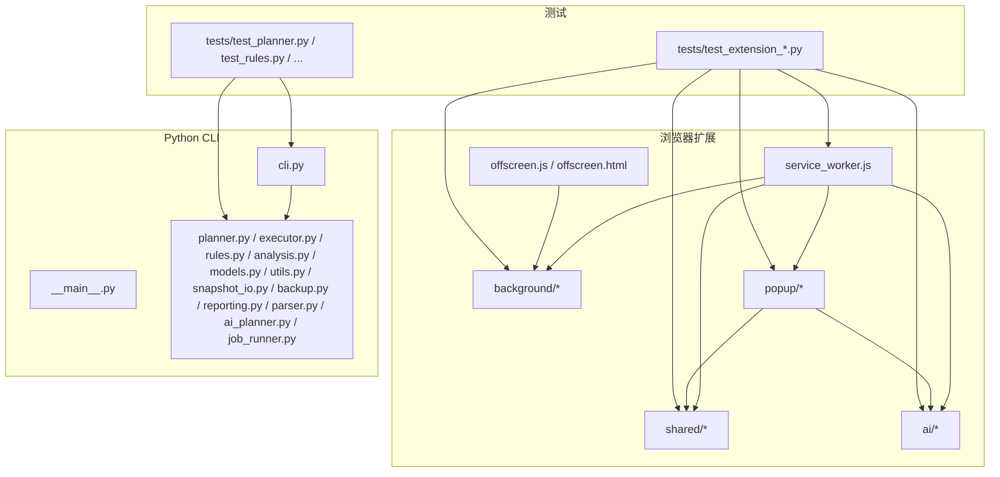
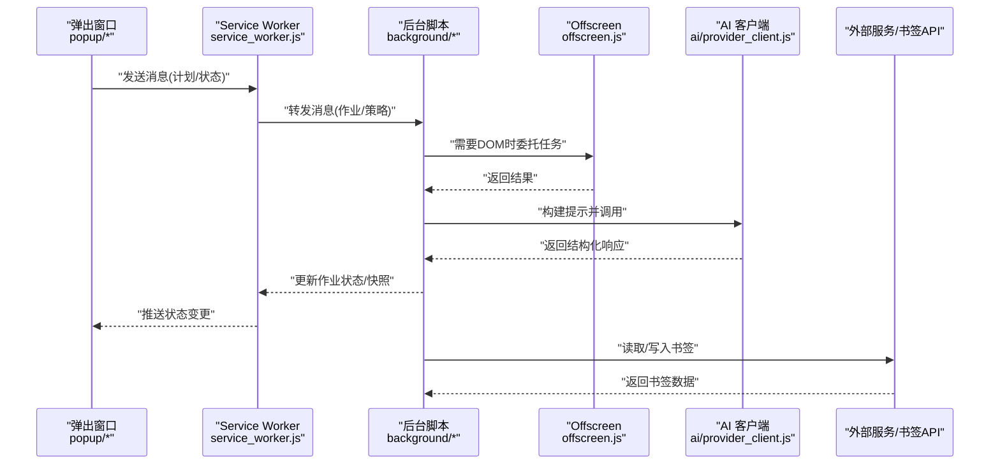
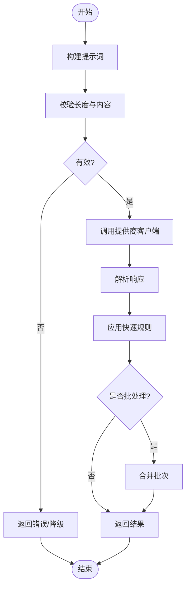
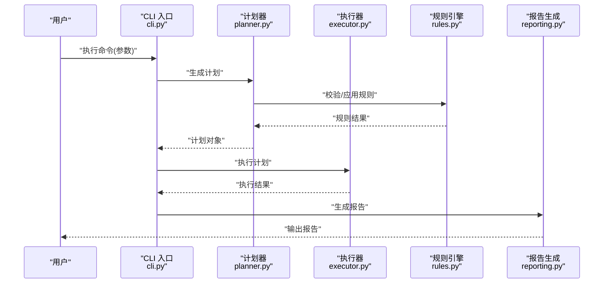
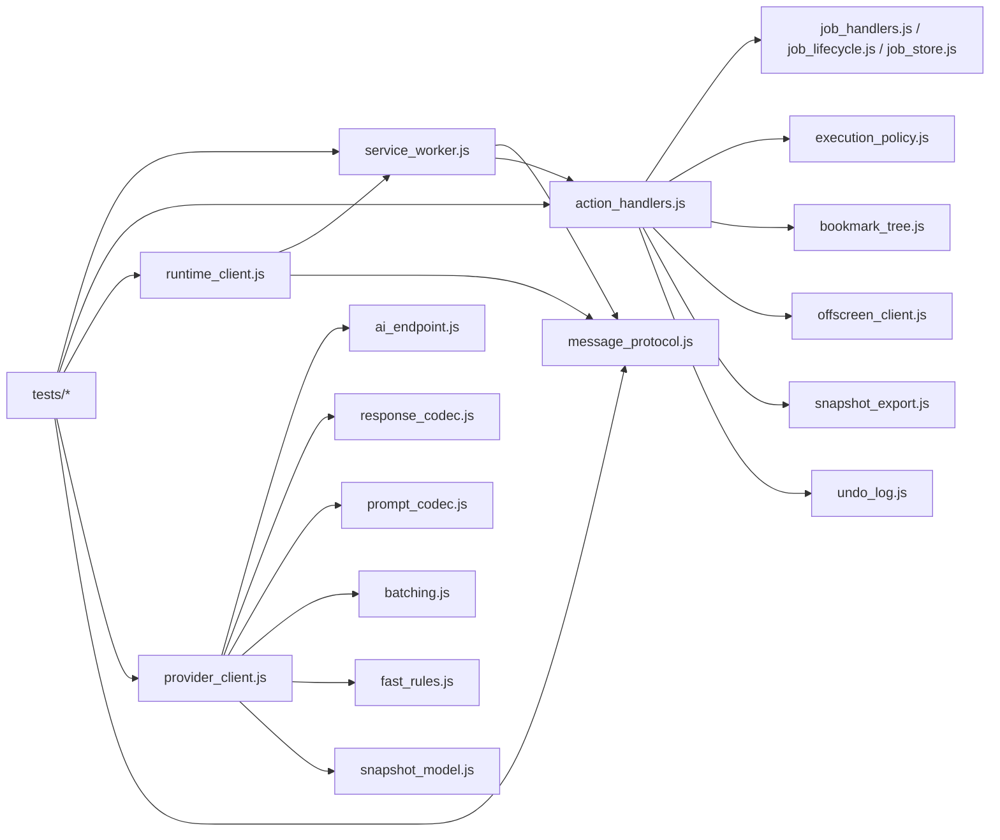

# 测试策略

<cite>
**本文引用的文件**   
- [README.md](file://README.md)
- [pyproject.toml](file://pyproject.toml)
- [extension/manifest.json](file://extension/manifest.json)
- [extension/service_worker.js](file://extension/service_worker.js)
- [extension/offscreen.html](file://extension/offscreen.html)
- [extension/offscreen.js](file://extension/offscreen.js)
- [extension/background/action_handlers.js](file://extension/background/action_handlers.js)
- [extension/background/bookmark_api.js](file://extension/background/bookmark_api.js)
- [extension/background/bookmark_tree.js](file://extension/background/bookmark_tree.js)
- [extension/background/execution_policy.js](file://extension/background/execution_policy.js)
- [extension/background/job_handlers.js](file://extension/background/job_handlers.js)
- [extension/background/job_lifecycle.js](file://extension/background/job_lifecycle.js)
- [extension/background/job_store.js](file://extension/background/job_store.js)
- [extension/background/message_router.js](file://extension/background/message_router.js)
- [extension/background/offscreen_client.js](file://extension/background/offscreen_client.js)
- [extension/background/plan_executor.js](file://extension/background/plan_executor.js)
- [extension/background/snapshot_export.js](file://extension/background/snapshot_export.js)
- [extension/background/undo_log.js](file://extension/background/undo_log.js)
- [extension/popup/i18n.js](file://extension/popup/i18n.js)
- [extension/popup/job_state.js](file://extension/popup/job_state.js)
- [extension/popup/plan_view.js](file://extension/popup/plan_view.js)
- [extension/popup/runtime_client.js](file://extension/popup/runtime_client.js)
- [extension/popup/secrets.js](file://extension/popup/secrets.js)
- [extension/popup/settings_store.js](file://extension/popup/settings_store.js)
- [extension/shared/ai_endpoint.js](file://extension/shared/ai_endpoint.js)
- [extension/shared/message_protocol.js](file://extension/shared/message_protocol.js)
- [extension/shared/path_utils.js](file://extension/shared/path_utils.js)
- [extension/shared/plan_schema.js](file://extension/shared/plan_schema.js)
- [extension/shared/storage.js](file://extension/shared/storage.js)
- [extension/ai/batching.js](file://extension/ai/batching.js)
- [extension/ai/fast_rules.js](file://extension/ai/fast_rules.js)
- [extension/ai/plan_compiler.js](file://extension/ai/plan_compiler.js)
- [extension/ai/prompt_codec.js](file://extension/ai/prompt_codec.js)
- [extension/ai/provider_client.js](file://extension/ai/provider_client.js)
- [extension/ai/response_codec.js](file://extension/ai/response_codec.js)
- [extension/ai/snapshot_model.js](file://extension/ai/snapshot_model.js)
- [src/bookmark_advisor/__main__.py](file://src/bookmark_advisor/__main__.py)
- [src/bookmark_advisor/cli.py](file://src/bookmark_advisor/cli.py)
- [src/bookmark_advisor/ai_planner.py](file://src/bookmark_advisor/ai_planner.py)
- [src/bookmark_advisor/analysis.py](file://src/bookmark_advisor/analysis.py)
- [src/bookmark_advisor/backup.py](file://src/bookmark_advisor/backup.py)
- [src/bookmark_advisor/executor.py](file://src/bookmark_advisor/executor.py)
- [src/bookmark_advisor/job_runner.py](file://src/bookmark_advisor/job_runner.py)
- [src/bookmark_advisor/models.py](file://src/bookmark_advisor/models.py)
- [src/bookmark_advisor/parser.py](file://src/bookmark_advisor/parser.py)
- [src/bookmark_advisor/planner.py](file://src/bookmark_advisor/planner.py)
- [src/bookmark_advisor/reporting.py](file://src/bookmark_advisor/reporting.py)
- [src/bookmark_advisor/rules.py](file://src/bookmark_advisor/rules.py)
- [src/bookmark_advisor/snapshot_io.py](file://src/bookmark_advisor/snapshot_io.py)
- [src/bookmark_advisor/utils.py](file://src/bookmark_advisor/utils.py)
- [tests/test_extension_action_handlers.py](file://tests/test_extension_action_handlers.py)
- [tests/test_extension_ai_batching.py](file://tests/test_extension_ai_batching.py)
- [tests/test_extension_ai_prompt_codec.py](file://tests/test_extension_ai_prompt_codec.py)
- [tests/test_extension_ai_provider_client.py](file://tests/test_extension_ai_provider_client.py)
- [tests/test_extension_ai_response_codec.py](file://tests/test_extension_ai_response_codec.py)
- [tests/test_extension_ai_snapshot_model.py](file://tests/test_extension_ai_snapshot_model.py)
- [tests/test_extension_background_snapshot.py](file://tests/test_extension_background_snapshot.py)
- [tests/test_extension_bookmark_tree.py](file://tests/test_extension_bookmark_tree.py)
- [tests/test_extension_boot_order.py](file://tests/test_extension_boot_order.py)
- [tests/test_extension_endpoint_urls.py](file://tests/test_extension_endpoint_urls.py)
- [tests/test_extension_execution_policy.py](file://tests/test_extension_execution_policy.py)
- [tests/test_extension_fast_rules.py](file://tests/test_extension_fast_rules.py)
- [tests/test_extension_job_handlers.py](file://tests/test_extension_job_handlers.py)
- [tests/test_extension_job_lifecycle.py](file://tests/test_extension_job_lifecycle.py)
- [tests/test_extension_job_store.py](file://tests/test_extension_job_store.py)
- [tests/test_extension_message_router.py](file://tests/test_extension_message_router.py)
- [tests/test_extension_offscreen_client.py](file://tests/test_extension_offscreen_client.py)
- [tests/test_extension_plan_compiler.py](file://tests/test_extension_plan编译器.py)
- [tests/test_extension_plan_executor_module.py](file://tests/test_extension_plan_executor_module.py)
- [tests/test_extension_plan_lint.py](file://tests/test_extension_plan_lint.py)
- [tests/test_extension_popup_job_state.py](file://tests/test_extension_popup_job_state.py)
- [tests/test_extension_popup_plan_view.py](file://tests/test_extension_popup_plan_view.py)
- [tests/test_extension_popup_runtime_client.py](file://tests/test_extension_popup_runtime_client.py)
- [tests/test_extension_popup_secrets.py](file://tests/test_extension_popup_secrets.py)
- [tests/test_extension_popup_settings_store.py](file://tests/test_extension_popup_settings_store.py)
- [tests/test_extension_popup_state.py](file://tests/test_extension_popup_state.py)
- [tests/test_extension_service_worker_state.py](file://tests/test_extension_service_worker_state.py)
- [tests/test_extension_shared_contracts.py](file://tests/test_extension_shared_contracts.py)
- [tests/test_extension_undo_log.py](file://tests/test_extension_undo_log.py)
- [tests/test_planner.py](file://tests/test_planner.py)
- [tests/test_prompt_parity.py](file://tests/test_prompt_parity.py)
- [tests/test_prompt_sanitization.py](file://tests/test_prompt_sanitization.py)
- [tests/test_reorg_job.py](file://tests/test_reorg_job.py)
- [tests/test_rules.py](file://tests/test_rules.py)
- [tests/test_rules_parity.py](file://tests/test_rules_parity.py)
- [tests/test_semantic_flow.py](file://tests/test_semantic_flow.py)
- [tests/test_url_parity.py](file://tests/test_url_parity.py)
- [tests/test_utils.py](file://tests/test_utils.py)
</cite>

## 目录
1. [简介](#简介)
2. [项目结构](#项目结构)
3. [核心组件](#核心组件)
4. [架构总览](#架构总览)
5. [详细组件分析](#详细组件分析)
6. [依赖分析](#依赖分析)
7. [性能考虑](#性能考虑)
8. [故障排查指南](#故障排查指南)
9. [结论](#结论)
10. [附录](#附录)

## 简介
本测试策略文档面向 Edge 书签助手项目的整体质量保障，覆盖单元测试、集成测试与端到端测试的分层设计；针对浏览器扩展（Service Worker/Offscreen/Popup/Background）、AI 服务集成与 Python CLI 工具分别给出可落地的测试方法与最佳实践。同时提供测试工具链配置建议、持续集成自动化与性能测试实施方案，帮助团队在保持高迭代速度的同时确保稳定性与兼容性。

## 项目结构
仓库采用“前端扩展 + 后端 CLI”的双栈组织方式：
- 浏览器扩展位于 extension 目录，包含 Service Worker、Offscreen、Background、Popup、共享模块与 AI 子模块。
- Python CLI 位于 src/bookmark_advisor，提供命令行入口、计划器、执行器、规则与分析等能力。
- 测试用例集中于 tests 目录，按功能域划分，覆盖扩展各模块与 CLI 逻辑。

图表来源
- [extension/service_worker.js](file://extension/service_worker.js)
- [extension/offscreen.js](file://extension/offscreen.js)
- [extension/offscreen.html](file://extension/offscreen.html)
- [extension/background/action_handlers.js](file://extension/background/action_handlers.js)
- [extension/popup/runtime_client.js](file://extension/popup/runtime_client.js)
- [extension/shared/message_protocol.js](file://extension/shared/message_protocol.js)
- [extension/ai/provider_client.js](file://extension/ai/provider_client.js)
- [src/bookmark_advisor/__main__.py](file://src/bookmark_advisor/__main__.py)
- [src/bookmark_advisor/cli.py](file://src/bookmark_advisor/cli.py)

章节来源
- [README.md](file://README.md)
- [extension/manifest.json](file://extension/manifest.json)

## 核心组件
- 浏览器扩展
  - Service Worker：作为扩展的入口，负责消息路由、生命周期管理与跨上下文通信。
  - Offscreen：承载需要 DOM 或特定 API 的任务，通过消息协议与主进程交互。
  - Background：处理书签树、作业调度、执行策略、撤销日志、快照导出等。
  - Popup：用户界面侧，展示计划、状态、设置与密钥管理，并通过运行时客户端与后台通信。
  - Shared：跨上下文共享的消息协议、存储抽象、路径与计划模式校验等。
  - AI：提示词编解码、响应解析、批量请求、快速规则匹配、模型快照等。
- Python CLI
  - 命令入口与参数解析，调用计划器、执行器、规则引擎、分析与报告生成，支持快照 I/O 与备份。
- 测试套件
  - 针对扩展各模块与 CLI 逻辑编写大量单测与集成用例，覆盖消息协议、AI 编解码、作业生命周期、规则与语义流等。

章节来源
- [extension/service_worker.js](file://extension/service_worker.js)
- [extension/offscreen.js](file://extension/offscreen.js)
- [extension/background/action_handlers.js](file://extension/background/action_handlers.js)
- [extension/popup/runtime_client.js](file://extension/popup/runtime_client.js)
- [extension/shared/message_protocol.js](file://extension/shared/message_protocol.js)
- [extension/ai/provider_client.js](file://extension/ai/provider_client.js)
- [src/bookmark_advisor/__main__.py](file://src/bookmark_advisor/__main__.py)
- [src/bookmark_advisor/cli.py](file://src/bookmark_advisor/cli.py)

## 架构总览
下图展示了从 UI 到后台再到外部服务的端到端数据流，以及 CLI 与本地文件的交互路径。

图表来源
- [extension/popup/runtime_client.js](file://extension/popup/runtime_client.js)
- [extension/service_worker.js](file://extension/service_worker.js)
- [extension/background/action_handlers.js](file://extension/background/action_handlers.js)
- [extension/background/offscreen_client.js](file://extension/background/offscreen_client.js)
- [extension/ai/provider_client.js](file://extension/ai/provider_client.js)
- [extension/background/bookmark_api.js](file://extension/background/bookmark_api.js)

## 详细组件分析

### 分层测试策略
- 单元测试
  - 目标：验证纯函数、数据结构与边界条件，如提示词编解码、响应解析、路径工具、规则匹配、计划模式校验等。
  - 方法：使用轻量断言与固定输入输出表驱动测试；对异步逻辑使用 Promise 断言与超时控制。
  - 覆盖范围：ai/*、shared/*、部分 background 工具函数。
- 集成测试
  - 目标：验证模块间协作与协议一致性，如消息路由、作业生命周期、快照导出、计划编译与执行。
  - 方法：构造最小运行环境，Mock 外部依赖（书签 API、AI 服务），注入可控状态，断言中间产物与最终状态。
  - 覆盖范围：background/*、ai/*、shared/* 的交互面。
- 端到端测试
  - 目标：验证完整用户流程，包括从弹出窗口触发计划、后台执行、AI 参与、书签操作与撤销回滚。
  - 方法：基于浏览器扩展测试框架或自动化脚本，模拟真实用户操作，断言 UI 状态与持久化结果。
  - 覆盖范围：popup/*、service_worker、background、offscreen 的全链路。

章节来源
- [tests/test_extension_ai_prompt_codec.py](file://tests/test_extension_ai_prompt_codec.py)
- [tests/test_extension_ai_response_codec.py](file://tests/test_extension_ai_response_codec.py)
- [tests/test_extension_message_router.py](file://tests/test_extension_message_router.py)
- [tests/test_extension_job_lifecycle.py](file://tests/test_extension_job_lifecycle.py)
- [tests/test_extension_background_snapshot.py](file://tests/test_extension_background_snapshot.py)

### 浏览器扩展测试方法
- Mock API
  - 对书签 API 与外部网络请求进行替换，返回确定性数据，避免真实环境波动。
  - 在背景脚本中拦截 API 调用，注入期望结果，断言后续行为。
- 模拟环境
  - 使用最小化的 Service Worker/Offscreen 环境，注入共享存储与消息通道，隔离外部副作用。
  - 对 popup 的运行时客户端进行桩实现，捕获消息往返。
- 异步测试
  - 对 Promise 与事件驱动的异步流程使用显式等待与超时保护，避免竞态导致的偶发失败。
  - 对长耗时任务（如快照导出）采用分阶段断言与进度回调验证。

章节来源
- [extension/background/bookmark_api.js](file://extension/background/bookmark_api.js)
- [extension/background/offscreen_client.js](file://extension/background/offscreen_client.js)
- [extension/popup/runtime_client.js](file://extension/popup/runtime_client.js)
- [extension/shared/message_protocol.js](file://extension/shared/message_protocol.js)
- [tests/test_extension_offscreen_client.py](file://tests/test_extension_offscreen_client.py)
- [tests/test_extension_message_router.py](file://tests/test_extension_message_router.py)
- [tests/test_extension_background_snapshot.py](file://tests/test_extension_background_snapshot.py)

### AI 服务集成测试策略
- 提示词测试
  - 验证提示词模板渲染、占位符替换与长度限制，确保不同上下文的兼容性与安全性。
- 响应模拟
  - 对 AI 提供商客户端进行桩实现，返回结构化响应，断言解析器与业务逻辑的一致性。
- 兼容性验证
  - 对比不同版本/供应商的响应格式差异，建立契约测试，防止上游变更破坏下游。
- 批处理与快速规则
  - 验证批量请求合并与去重策略，确保快速规则命中后的短路路径正确。

图表来源
- [extension/ai/prompt_codec.js](file://extension/ai/prompt_codec.js)
- [extension/ai/provider_client.js](file://extension/ai/provider_client.js)
- [extension/ai/response_codec.js](file://extension/ai/response_codec.js)
- [extension/ai/fast_rules.js](file://extension/ai/fast_rules.js)
- [extension/ai/batching.js](file://extension/ai/batching.js)

章节来源
- [tests/test_extension_ai_prompt_codec.py](file://tests/test_extension_ai_prompt_codec.py)
- [tests/test_extension_ai_response_codec.py](file://tests/test_extension_ai_response_codec.py)
- [tests/test_extension_ai_provider_client.py](file://tests/test_extension_ai_provider_client.py)
- [tests/test_extension_ai_batching.py](file://tests/test_extension_ai_batching.py)
- [tests/test_prompt_parity.py](file://tests/test_prompt_parity.py)
- [tests/test_prompt_sanitization.py](file://tests/test_prompt_sanitization.py)

### Python CLI 工具测试方法
- 命令测试
  - 验证命令行参数解析、子命令路由与退出码，确保在不同组合下行为一致。
- 数据处理验证
  - 对计划器、执行器、规则引擎与分析报告进行输入输出断言，覆盖边界与异常路径。
- 插件测试
  - 若存在可扩展点（如自定义规则或执行器），通过插件接口注入测试实现，验证加载与调用链。

图表来源
- [src/bookmark_advisor/cli.py](file://src/bookmark_advisor/cli.py)
- [src/bookmark_advisor/planner.py](file://src/bookmark_advisor/planner.py)
- [src/bookmark_advisor/executor.py](file://src/bookmark_advisor/executor.py)
- [src/bookmark_advisor/rules.py](file://src/bookmark_advisor/rules.py)
- [src/bookmark_advisor/reporting.py](file://src/bookmark_advisor/reporting.py)

章节来源
- [tests/test_planner.py](file://tests/test_planner.py)
- [tests/test_rules.py](file://tests/test_rules.py)
- [tests/test_reorg_job.py](file://tests/test_reorg_job.py)
- [tests/test_semantic_flow.py](file://tests/test_semantic_flow.py)

### 测试工具链配置
- 测试框架
  - Python 侧建议使用 pytest，结合 pytest-asyncio 处理异步测试；JS 侧可使用 Jest 或 Mocha，配合浏览器扩展测试适配器。
- Mock 库
  - Python 使用 unittest.mock 或 pytest-mock；JS 使用 sinon 或原生 fetch/MessageChannel 桩。
- 覆盖率统计
  - Python 使用 coverage 或 pytest-cov，设定阈值与排除无关代码；JS 使用 jest --coverage 或 istanbul。
- 配置要点
  - 在 pyproject.toml 中声明测试依赖与运行选项；为扩展提供最小 manifest 与沙箱环境。

章节来源
- [pyproject.toml](file://pyproject.toml)
- [extension/manifest.json](file://extension/manifest.json)

### 测试编写最佳实践
- 测试用例设计
  - 以用户故事与关键路径为导向，优先覆盖高风险与易变区域（AI 编解码、消息协议、作业生命周期）。
  - 使用表驱动测试减少重复，明确输入输出与预期状态。
- 断言方法
  - 对结构化数据使用深度比较；对时间相关逻辑使用近似断言；对异步流程使用显式等待。
- 测试数据管理
  - 集中管理样本数据与契约定义，避免硬编码；对敏感信息使用环境变量或加密存储。
- 可维护性
  - 将共享夹具与辅助函数抽取为独立模块；为复杂流程提供可读的步骤描述。

[本节为通用指导，不直接分析具体文件]

### 持续集成中的测试自动化与性能测试
- 自动化
  - 在 CI 中并行运行单元与集成测试，缓存依赖与构建产物；对扩展测试使用无头浏览器或专用测试容器。
- 性能测试
  - 对 AI 批量请求与快照导出进行基准测试，监控 P95/P99 延迟与吞吐；回归阈值告警。
- 质量门禁
  - 覆盖率阈值、静态检查与测试失败阻断合并；对偶发失败进行重试与隔离。

[本节为通用指导，不直接分析具体文件]

## 依赖分析
扩展内部依赖关系与测试映射如下：

图表来源
- [extension/service_worker.js](file://extension/service_worker.js)
- [extension/shared/message_protocol.js](file://extension/shared/message_protocol.js)
- [extension/background/action_handlers.js](file://extension/background/action_handlers.js)
- [extension/background/job_handlers.js](file://extension/background/job_handlers.js)
- [extension/background/job_lifecycle.js](file://extension/background/job_lifecycle.js)
- [extension/background/job_store.js](file://extension/background/job_store.js)
- [extension/background/execution_policy.js](file://extension/background/execution_policy.js)
- [extension/background/bookmark_tree.js](file://extension/background/bookmark_tree.js)
- [extension/background/offscreen_client.js](file://extension/background/offscreen_client.js)
- [extension/background/snapshot_export.js](file://extension/background/snapshot_export.js)
- [extension/background/undo_log.js](file://extension/background/undo_log.js)
- [extension/popup/runtime_client.js](file://extension/popup/runtime_client.js)
- [extension/ai/provider_client.js](file://extension/ai/provider_client.js)
- [extension/shared/ai_endpoint.js](file://extension/shared/ai_endpoint.js)
- [extension/ai/response_codec.js](file://extension/ai/response_codec.js)
- [extension/ai/prompt_codec.js](file://extension/ai/prompt_codec.js)
- [extension/ai/batching.js](file://extension/ai/batching.js)
- [extension/ai/fast_rules.js](file://extension/ai/fast_rules.js)
- [extension/ai/snapshot_model.js](file://extension/ai/snapshot_model.js)
- [tests/test_extension_message_router.py](file://tests/test_extension_message_router.py)
- [tests/test_extension_job_handlers.py](file://tests/test_extension_job_handlers.py)
- [tests/test_extension_job_lifecycle.py](file://tests/test_extension_job_lifecycle.py)
- [tests/test_extension_job_store.py](file://tests/test_extension_job_store.py)
- [tests/test_extension_execution_policy.py](file://tests/test_extension_execution_policy.py)
- [tests/test_extension_bookmark_tree.py](file://tests/test_extension_bookmark_tree.py)
- [tests/test_extension_offscreen_client.py](file://tests/test_extension_offscreen_client.py)
- [tests/test_extension_background_snapshot.py](file://tests/test_extension_background_snapshot.py)
- [tests/test_extension_undo_log.py](file://tests/test_extension_undo_log.py)
- [tests/test_extension_popup_runtime_client.py](file://tests/test_extension_popup_runtime_client.py)
- [tests/test_extension_ai_provider_client.py](file://tests/test_extension_ai_provider_client.py)
- [tests/test_extension_ai_response_codec.py](file://tests/test_extension_ai_response_codec.py)
- [tests/test_extension_ai_prompt_codec.py](file://tests/test_extension_ai_prompt_codec.py)
- [tests/test_extension_ai_batching.py](file://tests/test_extension_ai_batching.py)
- [tests/test_extension_fast_rules.py](file://tests/test_extension_fast_rules.py)
- [tests/test_extension_ai_snapshot_model.py](file://tests/test_extension_ai_snapshot_model.py)

章节来源
- [extension/shared/message_protocol.js](file://extension/shared/message_protocol.js)
- [extension/background/job_handlers.js](file://extension/background/job_handlers.js)
- [extension/background/job_lifecycle.js](file://extension/background/job_lifecycle.js)
- [extension/background/job_store.js](file://extension/background/job_store.js)
- [extension/ai/provider_client.js](file://extension/ai/provider_client.js)
- [extension/ai/response_codec.js](file://extension/ai/response_codec.js)
- [extension/ai/prompt_codec.js](file://extension/ai/prompt_codec.js)
- [extension/ai/batching.js](file://extension/ai/batching.js)
- [extension/ai/fast_rules.js](file://extension/ai/fast_rules.js)
- [extension/ai/snapshot_model.js](file://extension/ai/snapshot_model.js)

## 性能考虑
- 批量与缓存
  - 对 AI 请求进行批处理与去重，减少网络开销；对频繁访问的数据（如书签树）引入内存缓存与失效策略。
- 异步与背压
  - 对长耗时任务采用队列与限流，避免阻塞主线程；对 UI 反馈使用增量更新。
- 资源占用
  - 控制快照体积与导出频率，避免磁盘与内存压力；对大对象进行分块处理。

[本节为通用指导，不直接分析具体文件]

## 故障排查指南
- 常见问题定位
  - 消息协议不一致：核对 shared/message_protocol 的契约与测试用例，确认字段命名与类型。
  - AI 响应解析失败：检查 response_codec 的容错分支与 fallback 逻辑，补充异常用例。
  - 作业状态不同步：审查 job_lifecycle 与 job_store 的状态转换，增加并发与中断场景。
  - Offscreen 通信异常：验证 offscreen_client 的初始化与消息路由，添加超时与重试。
- 调试技巧
  - 启用详细日志与追踪 ID，关联跨上下文消息；对偶发问题录制会话与回放。
  - 使用最小复现用例隔离问题，逐步缩小范围。

章节来源
- [extension/shared/message_protocol.js](file://extension/shared/message_protocol.js)
- [extension/ai/response_codec.js](file://extension/ai/response_codec.js)
- [extension/background/job_lifecycle.js](file://extension/background/job_lifecycle.js)
- [extension/background/job_store.js](file://extension/background/job_store.js)
- [extension/background/offscreen_client.js](file://extension/background/offscreen_client.js)

## 结论
本测试策略围绕“分层清晰、依赖可控、可观测性强”的原则，构建了覆盖扩展与 CLI 的完整测试体系。通过 Mock 与契约测试降低外部依赖风险，借助异步与并发测试提升鲁棒性，并在 CI 中固化质量门禁与性能基线。建议持续完善测试数据与样例，定期复盘偶发失败与回归缺陷，推动测试左移与自动化闭环。

[本节为总结性内容，不直接分析具体文件]

## 附录
- 术语
  - Service Worker：浏览器扩展的主控脚本，负责生命周期与消息分发。
  - Offscreen：承载需要 DOM 或受限 API 的任务页面。
  - 契约测试：验证接口约定（如消息协议、AI 响应格式）的稳定性的测试。
- 参考
  - 扩展清单与权限：extension/manifest.json
  - CLI 入口与命令：src/bookmark_advisor/__main__.py、src/bookmark_advisor/cli.py

[本节为概念性说明，不直接分析具体文件]