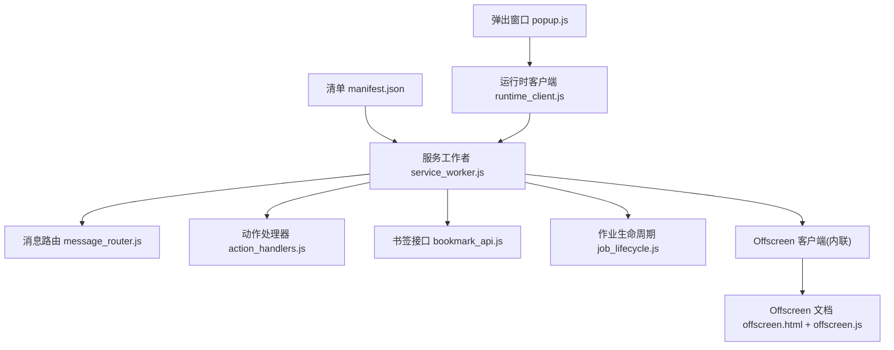
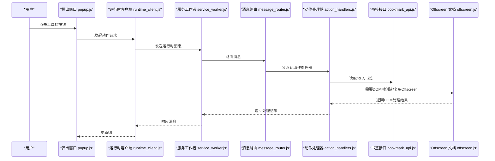
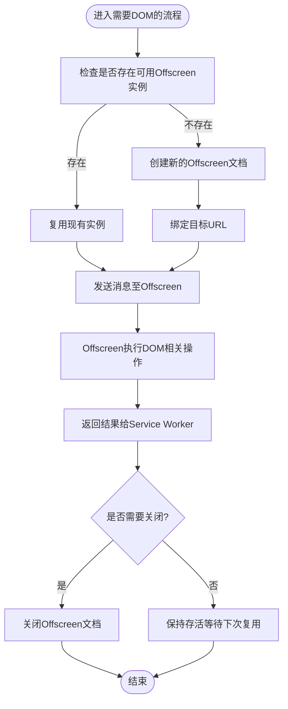
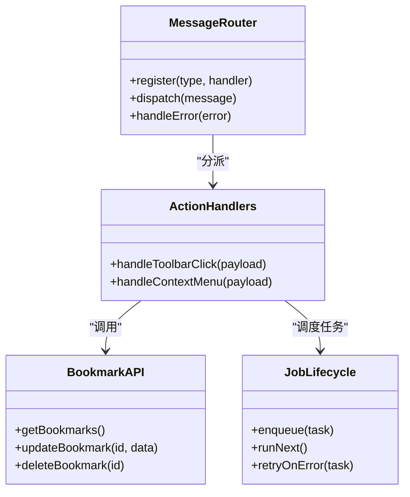
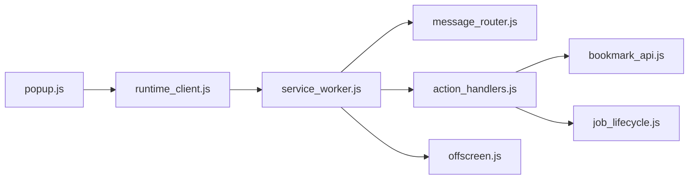

# Manifest V3 架构

<cite>
**本文引用的文件**   
- [extension/manifest.json](file://extension/manifest.json)
- [extension/service_worker.js](file://extension/service_worker.js)
- [extension/offscreen.html](file://extension/offscreen.html)
- [extension/offscreen.js](file://extension/offscreen.js)
- [extension/background/message_router.js](file://extension/background/message_router.js)
- [extension/background/action_handlers.js](file://extension/background/action_handlers.js)
- [extension/background/bookmark_api.js](file://extension/background/bookmark_api.js)
- [extension/background/job_lifecycle.js](file://extension/background/job_lifecycle.js)
- [extension/popup/runtime_client.js](file://extension/popup/runtime_client.js)
</cite>

## 目录
1. [简介](#简介)
2. [项目结构](#项目结构)
3. [核心组件](#核心组件)
4. [架构总览](#架构总览)
5. [详细组件分析](#详细组件分析)
6. [依赖关系分析](#依赖关系分析)
7. [性能考虑](#性能考虑)
8. [故障排查指南](#故障排查指南)
9. [结论](#结论)
10. [附录](#附录)

## 简介
本文件围绕 Manifest V3（MV3）在扩展中的落地实践，结合仓库中实际实现，系统阐述 MV3 的核心概念、与 V2 的关键差异、Service Worker 生命周期管理、Offscreen Document 的使用场景与生命周期、以及清单配置要点。文档同时提供面向开发者的最佳实践与安全建议，帮助读者在 MV3 环境下构建高性能、可维护的扩展。

## 项目结构
该扩展采用 MV3 架构，关键入口与职责如下：
- 清单文件：定义扩展元数据、权限、背景脚本、内容脚本、图标等。
- Service Worker：作为后台进程，负责消息路由、任务编排、与浏览器 API 交互。
- Offscreen Document：承载需要 DOM 能力的页面，供 Service Worker 按需创建与销毁。
- Popup：用户界面，通过运行时消息与 Service Worker 通信。
- background 模块：按功能拆分的服务与处理器，如书签操作、动作处理、作业生命周期管理等。

图表来源
- [extension/manifest.json](file://extension/manifest.json)
- [extension/service_worker.js](file://extension/service_worker.js)
- [extension/offscreen.html](file://extension/offscreen.html)
- [extension/offscreen.js](file://extension/offscreen.js)
- [extension/background/message_router.js](file://extension/background/message_router.js)
- [extension/background/action_handlers.js](file://extension/background/action_handlers.js)
- [extension/background/bookmark_api.js](file://extension/background/bookmark_api.js)
- [extension/background/job_lifecycle.js](file://extension/background/job_lifecycle.js)
- [extension/popup/runtime_client.js](file://extension/popup/runtime_client.js)

章节来源
- [extension/manifest.json](file://extension/manifest.json)
- [extension/service_worker.js](file://extension/service_worker.js)
- [extension/offscreen.html](file://extension/offscreen.html)
- [extension/offscreen.js](file://extension/offscreen.js)
- [extension/background/message_router.js](file://extension/background/message_router.js)
- [extension/background/action_handlers.js](file://extension/background/action_handlers.js)
- [extension/background/bookmark_api.js](file://extension/background/bookmark_api.js)
- [extension/background/job_lifecycle.js](file://extension/background/job_lifecycle.js)
- [extension/popup/runtime_client.js](file://extension/popup/runtime_client.js)

## 核心组件
- 清单 manifest.json
  - 声明版本为 MV3，注册 Service Worker 作为背景脚本，配置权限、图标、弹窗等。
  - 典型字段包括：version、manifest_version、name、description、permissions、host_permissions、background.service_worker、action、icons、offscreen 等。
- Service Worker service_worker.js
  - 作为 MV3 的背景执行环境，替代 V2 的 Background Pages。
  - 负责监听事件、初始化模块、转发消息、协调 Offscreen 文档。
- Offscreen 文档 offscreen.html + offscreen.js
  - 提供受限的 DOM 能力，用于需要访问 DOM 的场景（例如渲染或解析 HTML）。
  - 由 Service Worker 按需创建、复用与关闭，避免常驻内存。
- 消息路由 message_router.js
  - 集中式消息分发器，将来自 Popup、Offscreen、Content Scripts 的消息路由到具体处理器。
- 动作处理器 action_handlers.js
  - 响应工具栏按钮点击、右键菜单等用户动作，触发业务逻辑。
- 书签接口 bookmark_api.js
  - 封装对浏览器书签 API 的调用，统一错误处理与重试策略。
- 作业生命周期 job_lifecycle.js
  - 管理异步任务的启动、状态推进、失败重试与清理。
- 运行时客户端 runtime_client.js
  - Popup 侧的运行时通信封装，向 Service Worker 发送请求并接收结果。

章节来源
- [extension/manifest.json](file://extension/manifest.json)
- [extension/service_worker.js](file://extension/service_worker.js)
- [extension/offscreen.html](file://extension/offscreen.html)
- [extension/offscreen.js](file://extension/offscreen.js)
- [extension/background/message_router.js](file://extension/background/message_router.js)
- [extension/background/action_handlers.js](file://extension/background/action_handlers.js)
- [extension/background/bookmark_api.js](file://extension/background/bookmark_api.js)
- [extension/background/job_lifecycle.js](file://extension/background/job_lifecycle.js)
- [extension/popup/runtime_client.js](file://extension/popup/runtime_client.js)

## 架构总览
MV3 下，扩展以 Service Worker 为中心，Popup 与 Offscreen 文档通过运行时消息与之协作。Service Worker 无持久 UI，需遵循“短生命周期”原则；当需要 DOM 时，通过 Offscreen 文档临时加载。

图表来源
- [extension/popup/runtime_client.js](file://extension/popup/runtime_client.js)
- [extension/service_worker.js](file://extension/service_worker.js)
- [extension/background/message_router.js](file://extension/background/message_router.js)
- [extension/background/action_handlers.js](file://extension/background/action_handlers.js)
- [extension/background/bookmark_api.js](file://extension/background/bookmark_api.js)
- [extension/offscreen.js](file://extension/offscreen.js)

## 详细组件分析

### 清单配置与权限模型
- 版本与入口
  - manifest_version 设置为 3，使用 background.service_worker 指向 Service Worker 入口。
- 权限声明
  - permissions：基础权限，如 storage、alarms、contextMenus 等。
  - host_permissions：跨域访问所需的主机权限，仅对需要的域名精确授权。
- 图标与弹窗
  - icons 提供多尺寸图标；action 定义工具栏按钮行为与默认标题。
- Offscreen 文档
  - 若需要 DOM，需在清单中声明 offscreen.document，并在代码中按需创建。
- 内容脚本
  - content_scripts 指定匹配规则与注入时机，注意隔离与沙箱限制。

章节来源
- [extension/manifest.json](file://extension/manifest.json)

### Service Worker 生命周期管理
- 启动
  - 首次安装或收到事件（如 onMessage、onInstalled、onStartup）时激活。
- 休眠
  - 长时间无活动后，浏览器会终止 Service Worker 以节省资源。
- 重启
  - 再次有事件发生时自动恢复，保持状态需借助持久化存储。
- 最佳实践
  - 避免长驻循环与阻塞操作；将耗时任务拆分为作业并通过 job_lifecycle 管理。
  - 使用 alarms 或队列在唤醒后继续工作。

章节来源
- [extension/service_worker.js](file://extension/service_worker.js)
- [extension/background/job_lifecycle.js](file://extension/background/job_lifecycle.js)

### Offscreen 文档的创建与管理
- 何时使用
  - 需要访问 DOM、HTML 解析、Canvas 等受限能力时。
- 创建与复用
  - 通过运行时 API 创建并绑定目标 URL；尽量复用已有实例，避免频繁创建销毁。
- 通信
  - 与 Service Worker 之间通过 postMessage 或运行时消息通道进行双向通信。
- 关闭
  - 任务完成后及时关闭，释放内存。

图表来源
- [extension/service_worker.js](file://extension/service_worker.js)
- [extension/offscreen.html](file://extension/offscreen.html)
- [extension/offscreen.js](file://extension/offscreen.js)

章节来源
- [extension/offscreen.html](file://extension/offscreen.html)
- [extension/offscreen.js](file://extension/offscreen.js)
- [extension/service_worker.js](file://extension/service_worker.js)

### 消息路由与动作处理
- 消息路由
  - 集中式路由根据消息类型分发到对应处理器，降低耦合度。
- 动作处理
  - 对用户动作（如点击工具栏）进行校验、参数解析、调用业务接口。
- 错误处理
  - 统一捕获异常，记录上下文，向上层返回结构化错误信息。

图表来源
- [extension/background/message_router.js](file://extension/background/message_router.js)
- [extension/background/action_handlers.js](file://extension/background/action_handlers.js)
- [extension/background/bookmark_api.js](file://extension/background/bookmark_api.js)
- [extension/background/job_lifecycle.js](file://extension/background/job_lifecycle.js)

章节来源
- [extension/background/message_router.js](file://extension/background/message_router.js)
- [extension/background/action_handlers.js](file://extension/background/action_handlers.js)
- [extension/background/bookmark_api.js](file://extension/background/bookmark_api.js)
- [extension/background/job_lifecycle.js](file://extension/background/job_lifecycle.js)

### Popup 与运行时客户端
- 职责
  - 展示用户界面，收集输入，向 Service Worker 发起请求并渲染结果。
- 通信
  - 通过运行时客户端封装消息发送与回调处理，简化调用方逻辑。
- 错误与重试
  - 对网络或服务不可用情况进行友好提示与重试策略。

章节来源
- [extension/popup/runtime_client.js](file://extension/popup/runtime_client.js)

## 依赖关系分析
- 松耦合设计
  - Service Worker 通过消息路由解耦各处理器，便于测试与维护。
- 外部依赖
  - 主要依赖浏览器扩展 API（如 bookmarks、runtime、offscreen、storage 等）。
- 潜在风险
  - 过度依赖全局状态可能导致 Service Worker 重启后状态丢失；应优先使用持久化存储。
  - Offscreen 文档频繁创建/销毁会影响性能，应建立复用池。

图表来源
- [extension/service_worker.js](file://extension/service_worker.js)
- [extension/background/message_router.js](file://extension/background/message_router.js)
- [extension/background/action_handlers.js](file://extension/background/action_handlers.js)
- [extension/background/bookmark_api.js](file://extension/background/bookmark_api.js)
- [extension/background/job_lifecycle.js](file://extension/background/job_lifecycle.js)
- [extension/offscreen.js](file://extension/offscreen.js)
- [extension/popup/runtime_client.js](file://extension/popup/runtime_client.js)

章节来源
- [extension/service_worker.js](file://extension/service_worker.js)
- [extension/background/message_router.js](file://extension/background/message_router.js)
- [extension/background/action_handlers.js](file://extension/background/action_handlers.js)
- [extension/background/bookmark_api.js](file://extension/background/bookmark_api.js)
- [extension/background/job_lifecycle.js](file://extension/background/job_lifecycle.js)
- [extension/offscreen.js](file://extension/offscreen.js)
- [extension/popup/runtime_client.js](file://extension/popup/runtime_client.js)

## 性能考虑
- Service Worker 轻量化
  - 避免在启动阶段执行重计算；延迟初始化非关键模块。
- Offscreen 文档复用
  - 缓存已创建的 Offscreen 实例，减少创建开销。
- 批量与节流
  - 对高频操作（如大量书签更新）进行批处理与节流。
- 存储优化
  - 使用增量更新与压缩策略，减少 I/O 次数。
- 错误快速失败
  - 对不可恢复错误尽早返回，避免阻塞主流程。

[本节为通用指导，不直接分析具体文件]

## 故障排查指南
- 常见问题
  - Service Worker 未启动：检查清单是否正确注册 background.service_worker。
  - Offscreen 无法创建：确认权限与 URL 白名单，确保目标页面可被加载。
  - 消息未到达：核对消息类型与路由注册是否一致。
- 定位步骤
  - 在 Service Worker 与 Offscreen 中添加结构化日志，记录消息收发与异常堆栈。
  - 使用浏览器开发者工具的 Application 面板查看 Service Worker 状态与 Offscreen 实例。
- 恢复策略
  - 对失败任务实施指数退避重试；必要时触发人工干预提示。

章节来源
- [extension/service_worker.js](file://extension/service_worker.js)
- [extension/offscreen.js](file://extension/offscreen.js)
- [extension/background/message_router.js](file://extension/background/message_router.js)

## 结论
Manifest V3 通过 Service Worker 与 Offscreen 文档的组合，实现了更安全、更高效的扩展运行模型。合理划分职责、严格权限控制、谨慎管理生命周期，是构建高质量 MV3 扩展的关键。建议在项目中持续完善消息协议、错误处理与监控机制，以提升稳定性与可维护性。

[本节为总结性内容，不直接分析具体文件]

## 附录
- 清单配置示例要点
  - 设置 manifest_version 为 3。
  - 使用 background.service_worker 指向入口。
  - 按需声明 permissions 与 host_permissions。
  - 如需 DOM，声明 offscreen.document 并在代码中动态创建。
- 安全建议
  - 最小权限原则：仅申请必要权限。
  - 输入校验：对所有外部输入进行严格校验。
  - 内容脚本隔离：避免泄露敏感数据到网页上下文。

[本节为通用指导，不直接分析具体文件]