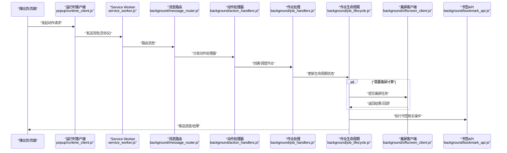
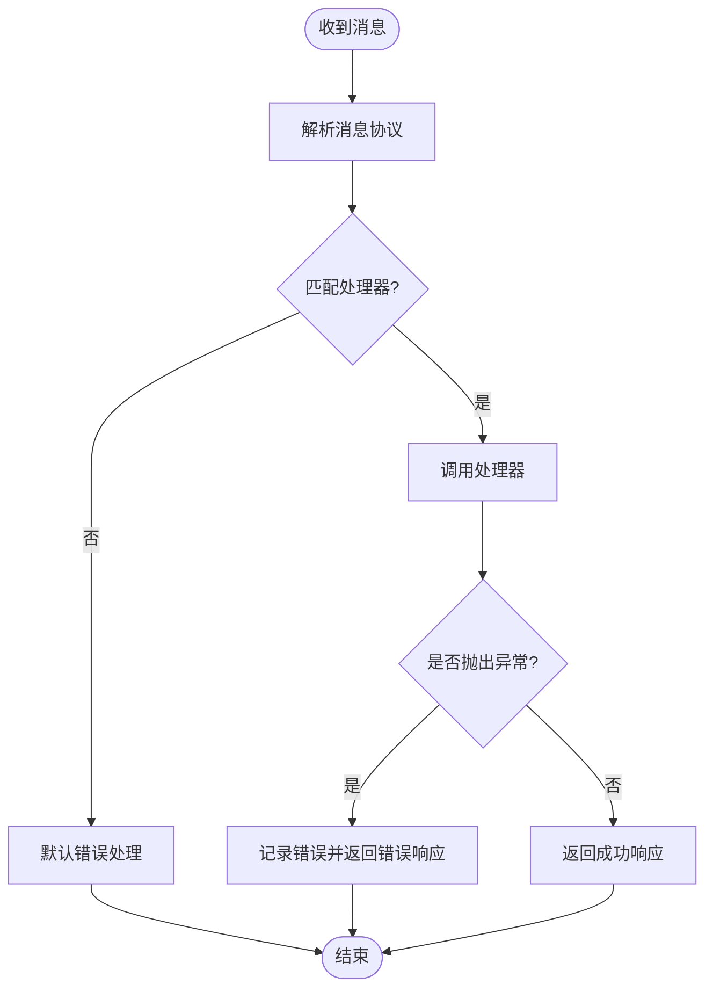
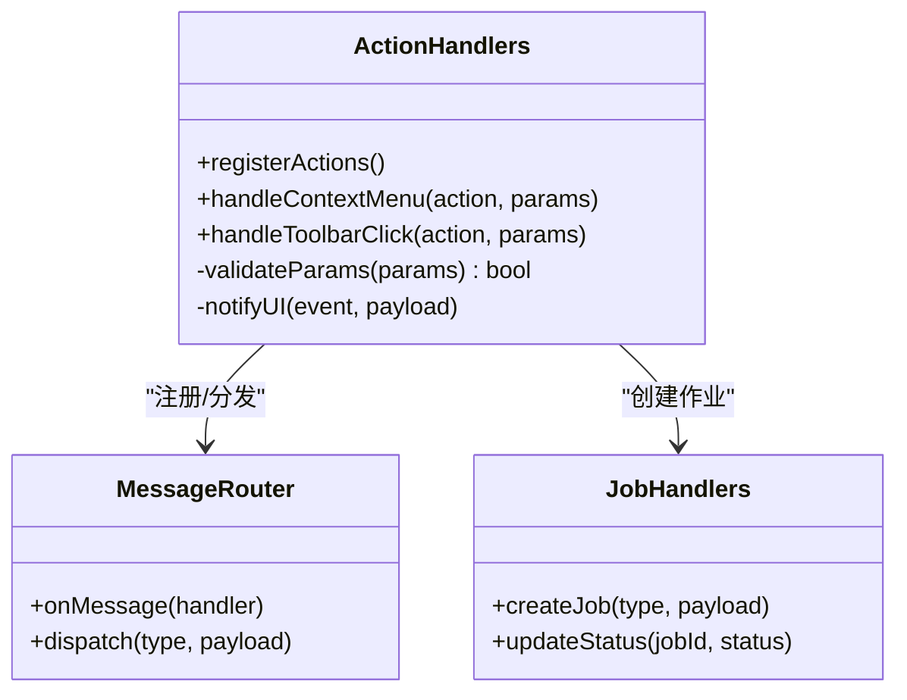
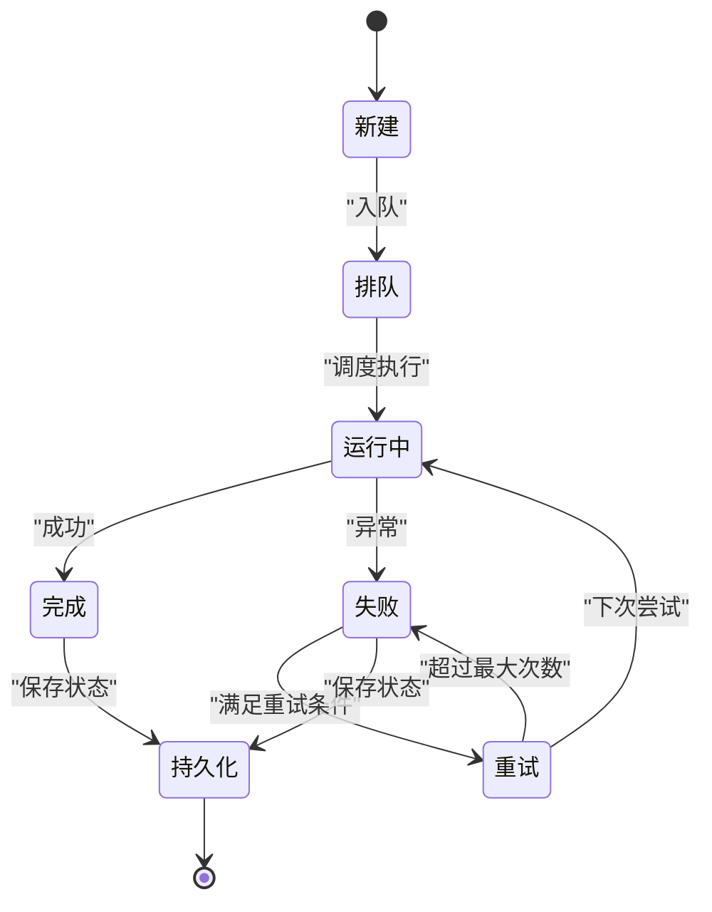
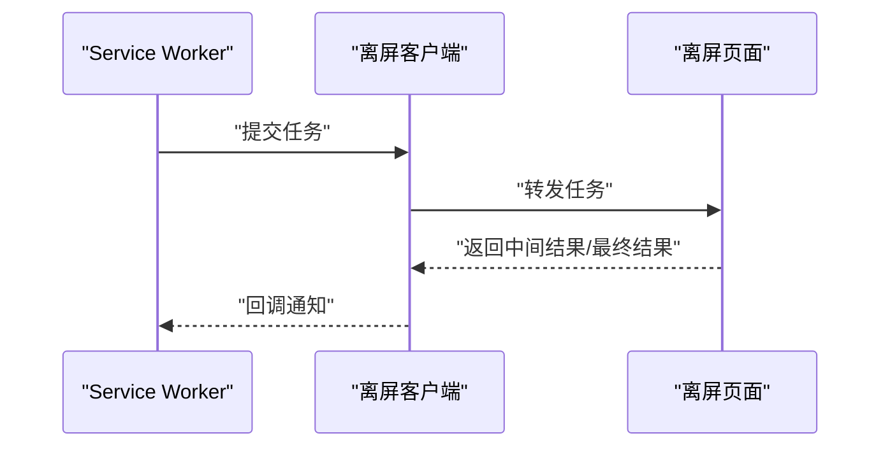
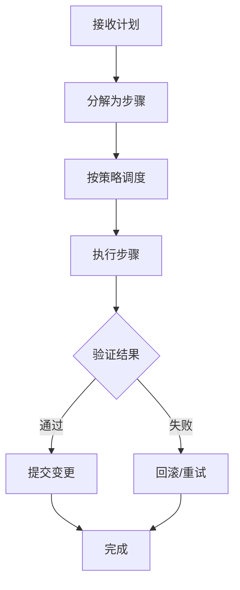
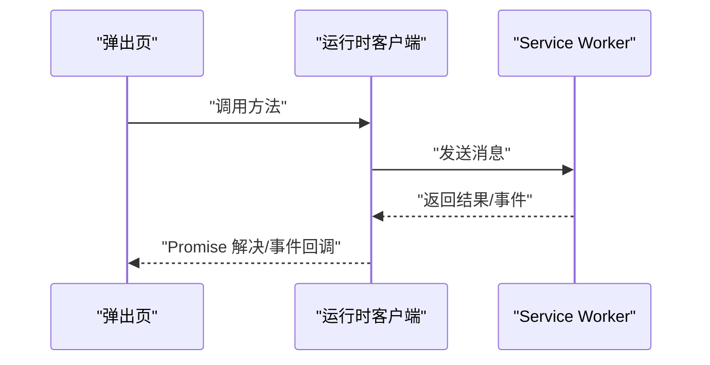
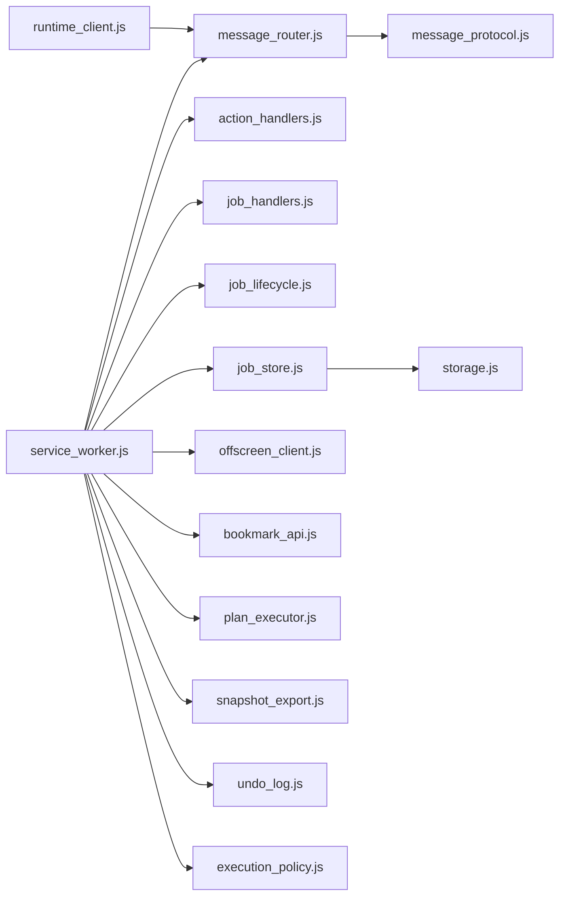

# Service Worker 开发

<cite>
**本文引用的文件**   
- [service_worker.js](file://extension/service_worker.js)
- [manifest.json](file://extension/manifest.json)
- [message_router.js](file://extension/background/message_router.js)
- [action_handlers.js](file://extension/background/action_handlers.js)
- [job_handlers.js](file://extension/background/job_handlers.js)
- [job_lifecycle.js](file://extension/background/job_lifecycle.js)
- [job_store.js](file://extension/background/job_store.js)
- [offscreen_client.js](file://extension/background/offscreen_client.js)
- [bookmark_api.js](file://extension/background/bookmark_api.js)
- [plan_executor.js](file://extension/background/plan_executor.js)
- [snapshot_export.js](file://extension/background/snapshot_export.js)
- [undo_log.js](file://extension/background/undo_log.js)
- [execution_policy.js](file://extension/background/execution_policy.js)
- [runtime_client.js](file://extension/popup/runtime_client.js)
- [message_protocol.js](file://extension/shared/message_protocol.js)
- [storage.js](file://extension/shared/storage.js)
</cite>

## 目录
1. [简介](#简介)
2. [项目结构](#项目结构)
3. [核心组件](#核心组件)
4. [架构总览](#架构总览)
5. [详细组件分析](#详细组件分析)
6. [依赖关系分析](#依赖关系分析)
7. [性能考虑](#性能考虑)
8. [故障排查指南](#故障排查指南)
9. [结论](#结论)
10. [附录](#附录)

## 简介
本指南面向浏览器扩展开发者，围绕 Service Worker 在扩展中的作用与工作原理展开，重点覆盖：
- 事件驱动模型与生命周期管理
- 消息路由机制（监听器注册、分发、错误处理）
- 动作处理器（Action Handlers）设计模式（右键菜单、工具栏按钮等）
- 异步任务处理与错误恢复（重试策略、状态持久化）
- 调试技巧与性能优化（内存管理与资源清理）
- 实际代码示例与常见开发模式

本项目采用 Manifest V3 的 Service Worker 作为后台进程，通过模块化背景脚本组织业务逻辑，使用共享协议进行跨上下文通信。

## 项目结构
Service Worker 入口位于 extension/service_worker.js，负责初始化消息路由、注册动作处理器、启动后台任务与存储子系统。背景模块集中在 extension/background 下，按职责拆分：消息路由、动作处理、作业编排、书签 API、离屏客户端、快照导出、撤销日志、执行策略等。popup 侧通过 runtime_client 与 Service Worker 通信，共享协议定义于 shared/message_protocol.js。

```mermaid
graph TB
SW["Service Worker<br/>extension/service_worker.js"] --> MR["消息路由<br/>background/message_router.js"]
SW --> AH["动作处理器<br/>background/action_handlers.js"]
SW --> JH["作业处理<br/>background/job_handlers.js"]
SW --> JL["作业生命周期<br/>background/job_lifecycle.js"]
SW --> JS["作业存储<br/>background/job_store.js"]
SW --> OC["离屏客户端<br/>background/offscreen_client.js"]
SW --> BA["书签API<br/>background/bookmark_api.js"]
SW --> PE["计划执行器<br/>background/plan_executor.js"]
SW --> SE["快照导出<br/>background/snapshot_export.js"]
SW --> UL["撤销日志<br/>background/undo_log.js"]
SW --> EP["执行策略<br/>background/execution_policy.js"]
Popup["弹出页运行时客户端<br/>popup/runtime_client.js"] --> |消息协议| MR
Shared["共享协议/存储<br/>shared/*"] --> MR
```

图表来源
- [service_worker.js](file://extension/service_worker.js)
- [message_router.js](file://extension/background/message_router.js)
- [action_handlers.js](file://extension/background/action_handlers.js)
- [job_handlers.js](file://extension/background/job_handlers.js)
- [job_lifecycle.js](file://extension/background/job_lifecycle.js)
- [job_store.js](file://extension/background/job_store.js)
- [offscreen_client.js](file://extension/background/offscreen_client.js)
- [bookmark_api.js](file://extension/background/bookmark_api.js)
- [plan_executor.js](file://extension/background/plan_executor.js)
- [snapshot_export.js](file://extension/background/snapshot_export.js)
- [undo_log.js](file://extension/background/undo_log.js)
- [execution_policy.js](file://extension/background/execution_policy.js)
- [runtime_client.js](file://extension/popup/runtime_client.js)
- [message_protocol.js](file://extension/shared/message_protocol.js)
- [storage.js](file://extension/shared/storage.js)

章节来源
- [service_worker.js](file://extension/service_worker.js)
- [manifest.json](file://extension/manifest.json)

## 核心组件
- 消息路由：集中式消息分发中心，统一注册监听器并按类型路由到对应处理器；提供错误捕获与超时控制。
- 动作处理器：将用户交互（右键菜单、工具栏按钮等）映射为内部动作，触发相应业务流程。
- 作业系统：以“作业”为单位编排异步任务，包含创建、调度、执行、完成、失败、重试与持久化。
- 离屏客户端：与离屏页面通信，承载重计算或长耗时任务，避免阻塞主线程。
- 书签 API：封装对浏览器书签树的操作，提供增删改查与批量操作能力。
- 计划执行器：解析并执行计划任务，协调各子任务与策略。
- 快照导出与撤销日志：用于数据一致性保障与可回滚操作。
- 执行策略：控制并发、限流、重试与幂等性。

章节来源
- [message_router.js](file://extension/background/message_router.js)
- [action_handlers.js](file://extension/background/action_handlers.js)
- [job_handlers.js](file://extension/background/job_handlers.js)
- [job_lifecycle.js](file://extension/background/job_lifecycle.js)
- [job_store.js](file://extension/background/job_store.js)
- [offscreen_client.js](file://extension/background/offscreen_client.js)
- [bookmark_api.js](file://extension/background/bookmark_api.js)
- [plan_executor.js](file://extension/background/plan_executor.js)
- [snapshot_export.js](file://extension/background/snapshot_export.js)
- [undo_log.js](file://extension/background/undo_log.js)
- [execution_policy.js](file://extension/background/execution_policy.js)

## 架构总览
下图展示了从 UI 到 Service Worker 再到外部资源的端到端调用路径，包括消息协议、动作处理、作业编排与离屏任务。

图表来源
- [runtime_client.js](file://extension/popup/runtime_client.js)
- [service_worker.js](file://extension/service_worker.js)
- [message_router.js](file://extension/background/message_router.js)
- [action_handlers.js](file://extension/background/action_handlers.js)
- [job_handlers.js](file://extension/background/job_handlers.js)
- [job_lifecycle.js](file://extension/background/job_lifecycle.js)
- [offscreen_client.js](file://extension/background/offscreen_client.js)
- [bookmark_api.js](file://extension/background/bookmark_api.js)

## 详细组件分析

### 消息路由机制
- 监听器注册：提供统一的注册接口，支持按消息类型绑定处理器，支持优先级与命名空间隔离。
- 路由分发：根据消息协议中的类型字段匹配处理器，若未命中则走默认错误分支。
- 错误处理：捕获处理器抛出的异常，记录上下文信息，返回标准化错误响应；支持超时与取消。
- 协议契约：基于 shared/message_protocol.js 定义的消息结构与常量，确保跨上下文一致。

图表来源
- [message_router.js](file://extension/background/message_router.js)
- [message_protocol.js](file://extension/shared/message_protocol.js)

章节来源
- [message_router.js](file://extension/background/message_router.js)
- [message_protocol.js](file://extension/shared/message_protocol.js)

### 动作处理器（Action Handlers）
- 设计模式：将用户交互抽象为“动作”，由 action_handlers.js 统一映射到具体业务逻辑。
- 典型场景：右键菜单项点击、工具栏按钮点击、快捷键触发等。
- 参数校验：在进入处理器前进行输入校验与权限检查，减少无效调用。
- 反馈机制：向 UI 推送进度与结果，保证用户体验。

图表来源
- [action_handlers.js](file://extension/background/action_handlers.js)
- [message_router.js](file://extension/background/message_router.js)
- [job_handlers.js](file://extension/background/job_handlers.js)

章节来源
- [action_handlers.js](file://extension/background/action_handlers.js)

### 作业系统与生命周期
- 作业创建：由动作处理器或定时任务创建作业，携带类型、参数与策略。
- 生命周期：新建 -> 排队 -> 运行中 -> 完成/失败 -> 重试（可选）-> 持久化。
- 状态持久化：通过 job_store.js 持久化作业状态，确保重启后恢复。
- 重试策略：基于 execution_policy.js 配置指数退避、最大重试次数与幂等键。
- 撤销与快照：在执行关键变更前写入 undo_log.js，必要时回滚；snapshot_export.js 提供快照导出。

图表来源
- [job_handlers.js](file://extension/background/job_handlers.js)
- [job_lifecycle.js](file://extension/background/job_lifecycle.js)
- [job_store.js](file://extension/background/job_store.js)
- [execution_policy.js](file://extension/background/execution_policy.js)
- [undo_log.js](file://extension/background/undo_log.js)
- [snapshot_export.js](file://extension/background/snapshot_export.js)

章节来源
- [job_handlers.js](file://extension/background/job_handlers.js)
- [job_lifecycle.js](file://extension/background/job_lifecycle.js)
- [job_store.js](file://extension/background/job_store.js)
- [execution_policy.js](file://extension/background/execution_policy.js)
- [undo_log.js](file://extension/background/undo_log.js)
- [snapshot_export.js](file://extension/background/snapshot_export.js)

### 离屏客户端与重任务
- 用途：将 CPU 密集或长时间运行的任务卸载到离屏页面，避免阻塞 Service Worker。
- 通信：通过 offscreen_client.js 与 offscreen.html/js 建立通道，传递任务与回调。
- 错误恢复：网络中断或离屏页面崩溃时，自动重试或降级到本地缓存。

图表来源
- [offscreen_client.js](file://extension/background/offscreen_client.js)

章节来源
- [offscreen_client.js](file://extension/background/offscreen_client.js)

### 书签 API 与计划执行器
- 书签 API：封装增删改查、批量移动与合并等操作，提供事务性与幂等性保障。
- 计划执行器：解析计划任务，分解为原子步骤，结合执行策略进行调度与监控。

图表来源
- [plan_executor.js](file://extension/background/plan_executor.js)
- [bookmark_api.js](file://extension/background/bookmark_api.js)
- [execution_policy.js](file://extension/background/execution_policy.js)

章节来源
- [plan_executor.js](file://extension/background/plan_executor.js)
- [bookmark_api.js](file://extension/background/bookmark_api.js)
- [execution_policy.js](file://extension/background/execution_policy.js)

### 弹出页与运行时客户端
- 运行时客户端：封装与 Service Worker 的消息收发，提供 Promise 风格的调用接口。
- 状态同步：订阅作业状态变化，实时更新 UI。

图表来源
- [runtime_client.js](file://extension/popup/runtime_client.js)
- [message_protocol.js](file://extension/shared/message_protocol.js)

章节来源
- [runtime_client.js](file://extension/popup/runtime_client.js)
- [message_protocol.js](file://extension/shared/message_protocol.js)

## 依赖关系分析
- 松耦合：消息路由解耦了 UI 与后台逻辑，动作处理器仅关注业务映射。
- 内聚性：作业系统围绕生命周期与存储形成高内聚模块。
- 外部依赖：主要依赖浏览器扩展 API（如 bookmarks、runtime、storage），并通过 shared 模块保持协议一致。

图表来源
- [service_worker.js](file://extension/service_worker.js)
- [message_router.js](file://extension/background/message_router.js)
- [action_handlers.js](file://extension/background/action_handlers.js)
- [job_handlers.js](file://extension/background/job_handlers.js)
- [job_lifecycle.js](file://extension/background/job_lifecycle.js)
- [job_store.js](file://extension/background/job_store.js)
- [offscreen_client.js](file://extension/background/offscreen_client.js)
- [bookmark_api.js](file://extension/background/bookmark_api.js)
- [plan_executor.js](file://extension/background/plan_executor.js)
- [snapshot_export.js](file://extension/background/snapshot_export.js)
- [undo_log.js](file://extension/background/undo_log.js)
- [execution_policy.js](file://extension/background/execution_policy.js)
- [runtime_client.js](file://extension/popup/runtime_client.js)
- [message_protocol.js](file://extension/shared/message_protocol.js)
- [storage.js](file://extension/shared/storage.js)

章节来源
- [manifest.json](file://extension/manifest.json)

## 性能考虑
- 内存管理
  - 及时释放不再使用的对象引用，避免闭包持有大对象。
  - 使用弱引用或缓存失效策略管理大型数据结构。
- 资源清理
  - 在作业完成后清理临时文件与离屏任务句柄。
  - 定期归档或压缩历史作业状态，降低存储体积。
- 并发与限流
  - 通过执行策略限制并发度，避免 I/O 风暴。
  - 对批量操作进行分片与节流。
- 缓存与去重
  - 利用幂等键避免重复执行。
  - 缓存热点数据，缩短响应时间。
- 离屏任务优化
  - 将 CPU 密集型任务迁移至离屏页面，减少主线程压力。
  - 合理划分任务粒度，避免单次任务过大导致超时。

[本节为通用指导，不直接分析具体文件]

## 故障排查指南
- 常见问题
  - 消息未路由：检查消息协议类型与路由注册是否匹配。
  - 作业卡住：查看作业状态与重试计数，确认是否存在死锁或外部依赖不可用。
  - 离屏任务失败：检查离屏页面健康状态与通信通道。
- 定位手段
  - 启用详细日志，记录消息上下文与堆栈。
  - 使用断点与单步调试，观察状态机转换。
  - 导出快照与撤销日志，对比变更前后差异。
- 恢复策略
  - 自动重试与指数退避。
  - 手动触发重新执行或回滚。
  - 降级到本地缓存或只读模式。

章节来源
- [job_lifecycle.js](file://extension/background/job_lifecycle.js)
- [job_store.js](file://extension/background/job_store.js)
- [execution_policy.js](file://extension/background/execution_policy.js)
- [undo_log.js](file://extension/background/undo_log.js)
- [snapshot_export.js](file://extension/background/snapshot_export.js)

## 结论
本指南围绕 Service Worker 的事件驱动模型、消息路由、动作处理器、作业系统与错误恢复等方面进行了系统化梳理。通过模块化设计与清晰的协议契约，扩展具备良好的可维护性与可扩展性。建议在实际开发中遵循幂等、可观测与可恢复原则，持续优化性能与稳定性。

[本节为总结性内容，不直接分析具体文件]

## 附录
- 最佳实践清单
  - 明确消息协议与错误码规范
  - 为每个动作处理器编写单元测试
  - 对关键路径增加审计日志
  - 使用幂等键与版本控制避免冲突
  - 定期演练灾难恢复流程
- 参考实现路径
  - 消息路由与协议：见 message_router.js 与 message_protocol.js
  - 动作处理与作业编排：见 action_handlers.js、job_handlers.js、job_lifecycle.js
  - 离屏任务与书签 API：见 offscreen_client.js、bookmark_api.js
  - 计划执行与策略：见 plan_executor.js、execution_policy.js
  - 快照与撤销：见 snapshot_export.js、undo_log.js
  - 运行时客户端：见 runtime_client.js

[本节为补充信息，不直接分析具体文件]