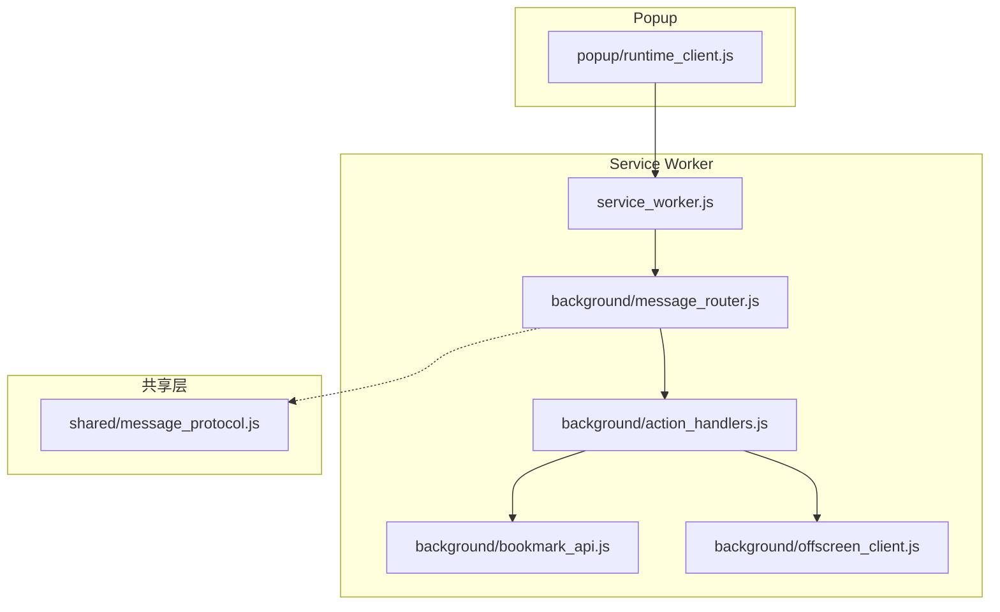
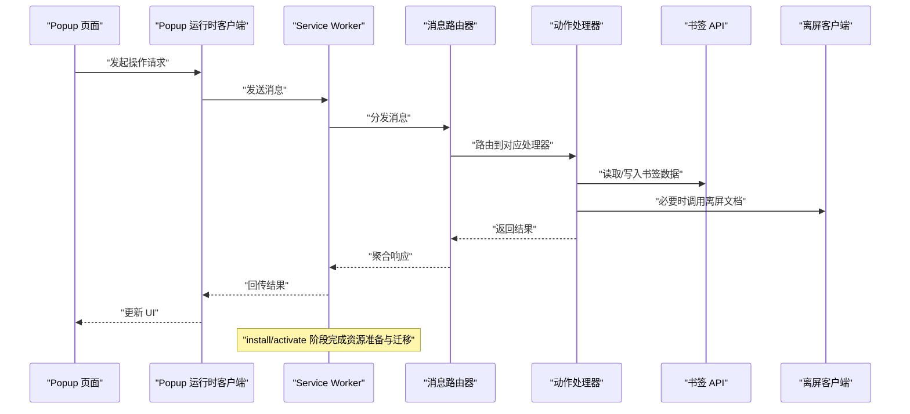
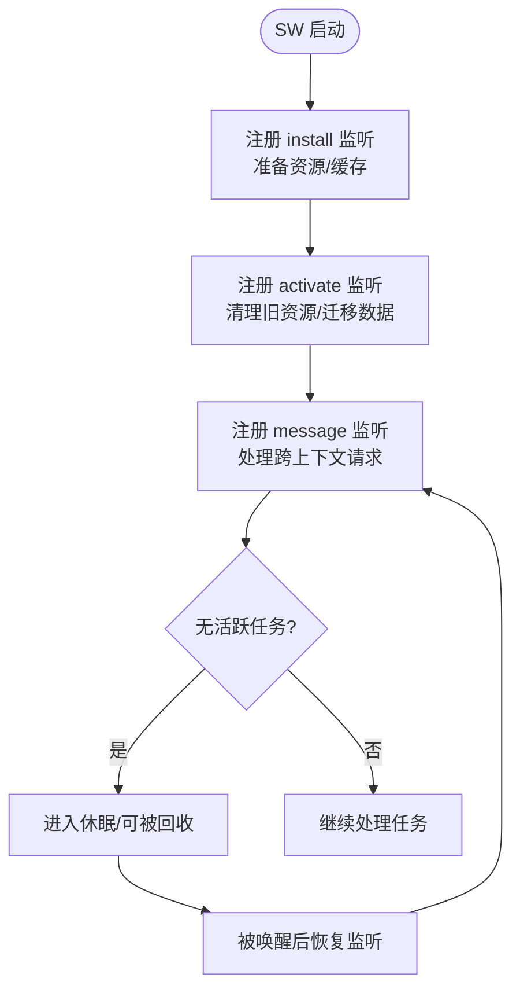
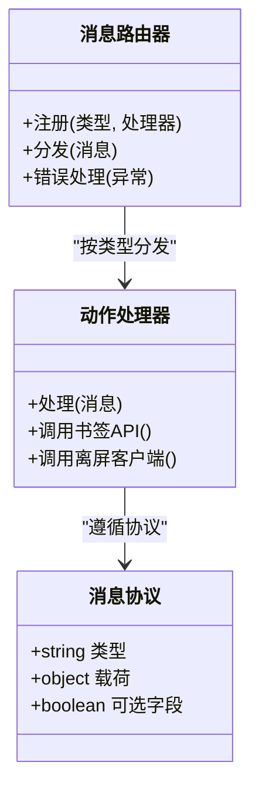
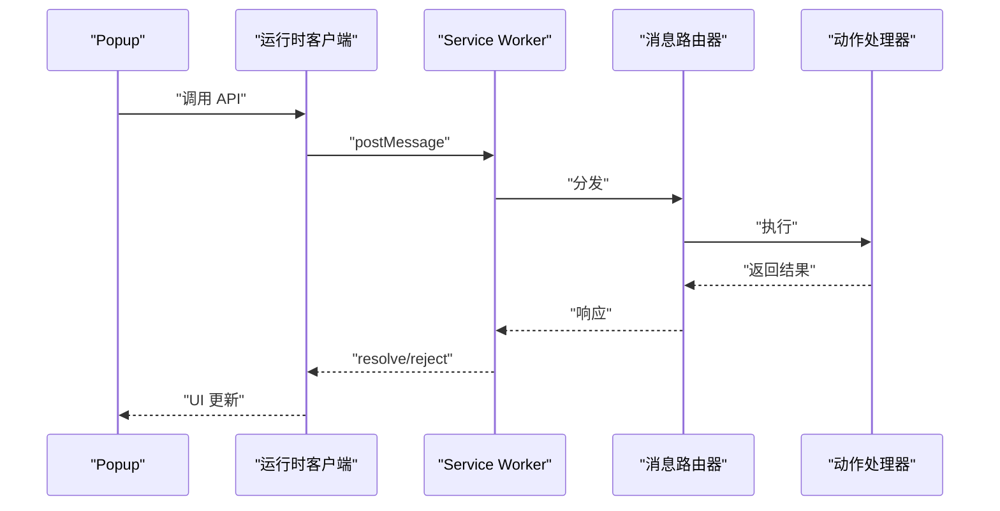
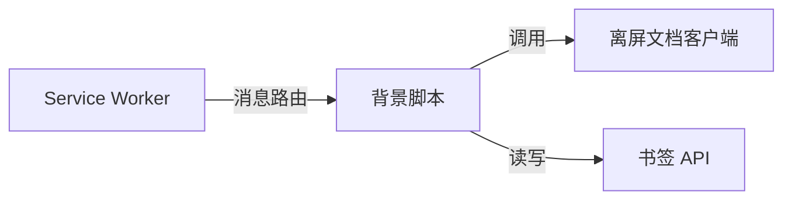
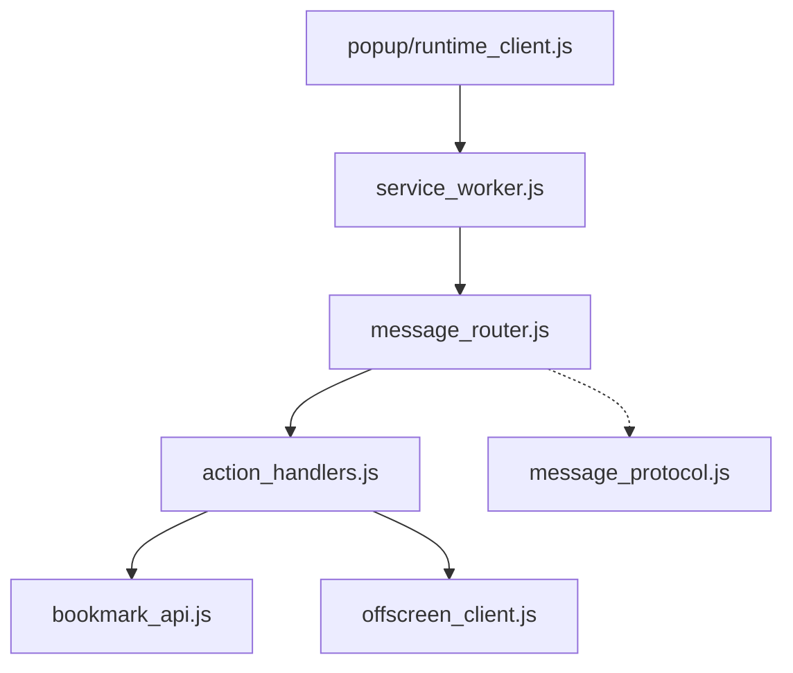

# Service Worker 生命周期管理

<cite>
**本文引用的文件**   
- [service_worker.js](file://extension/service_worker.js)
- [manifest.json](file://extension/manifest.json)
- [background/message_router.js](file://extension/background/message_router.js)
- [background/action_handlers.js](file://extension/background/action_handlers.js)
- [background/bookmark_api.js](file://extension/background/bookmark_api.js)
- [background/offscreen_client.js](file://extension/background/offscreen_client.js)
- [popup/runtime_client.js](file://extension/popup/runtime_client.js)
- [shared/message_protocol.js](file://extension/shared/message_protocol.js)
</cite>

## 目录
1. [简介](#简介)
2. [项目结构](#项目结构)
3. [核心组件](#核心组件)
4. [架构总览](#架构总览)
5. [详细组件分析](#详细组件分析)
6. [依赖关系分析](#依赖关系分析)
7. [性能与内存优化](#性能与内存优化)
8. [故障排查指南](#故障排查指南)
9. [结论](#结论)
10. [附录](#附录)

## 简介
本文件围绕浏览器扩展中的 Service Worker（SW）生命周期管理，系统阐述其在扩展中的启动、激活与销毁过程，事件监听器的注册时机与状态转换；深入解析安装事件（install）、激活事件（activate）与消息事件（message）的处理机制；给出内存管理与资源清理策略，避免内存泄漏并优化性能；说明与 Popup 页面、背景脚本及其他扩展组件的通信模式；并提供调试技巧与常见问题排查方法。

## 项目结构
该扩展采用基于 Service Worker 的现代 Manifest V3 架构：
- service_worker.js 作为 SW 入口，负责全局初始化、事件监听器注册与跨上下文通信路由。
- background/* 提供业务逻辑与 API 封装，包括消息路由、动作处理、书签数据访问、离屏文档客户端等。
- popup/* 为弹出界面逻辑，通过运行时 API 与 SW 通信。
- shared/* 定义跨模块共享协议与工具函数。

图表来源
- [service_worker.js](file://extension/service_worker.js)
- [background/message_router.js](file://extension/background/message_router.js)
- [background/action_handlers.js](file://extension/background/action_handlers.js)
- [background/bookmark_api.js](file://extension/background/bookmark_api.js)
- [background/offscreen_client.js](file://extension/background/offscreen_client.js)
- [popup/runtime_client.js](file://extension/popup/runtime_client.js)
- [shared/message_protocol.js](file://extension/shared/message_protocol.js)

章节来源
- [service_worker.js](file://extension/service_worker.js)
- [manifest.json](file://extension/manifest.json)

## 核心组件
- Service Worker 入口与事件注册：在 SW 中完成 install、activate、message 等关键事件的监听与调度，确保扩展可用性与版本升级后的迁移执行。
- 消息路由与协议：集中式消息路由将来自不同上下文的请求分发到具体处理器，统一消息协议便于维护与测试。
- 动作处理与数据访问：对扩展动作进行响应，调用书签 API 或离屏文档客户端完成复杂任务。
- Popup 运行时客户端：为弹出页提供与 SW 通信的便捷接口。

章节来源
- [service_worker.js](file://extension/service_worker.js)
- [background/message_router.js](file://extension/background/message_router.js)
- [background/action_handlers.js](file://extension/background/action_handlers.js)
- [background/bookmark_api.js](file://extension/background/bookmark_api.js)
- [background/offscreen_client.js](file://extension/background/offscreen_client.js)
- [popup/runtime_client.js](file://extension/popup/runtime_client.js)
- [shared/message_protocol.js](file://extension/shared/message_protocol.js)

## 架构总览
下图展示了从 Popup 发起请求到 SW 内部处理的端到端流程，以及 SW 生命周期事件的关键路径。

图表来源
- [service_worker.js](file://extension/service_worker.js)
- [background/message_router.js](file://extension/background/message_router.js)
- [background/action_handlers.js](file://extension/background/action_handlers.js)
- [background/bookmark_api.js](file://extension/background/bookmark_api.js)
- [background/offscreen_client.js](file://extension/background/offscreen_client.js)
- [popup/runtime_client.js](file://extension/popup/runtime_client.js)

## 详细组件分析

### Service Worker 生命周期与事件处理
- 启动与激活
  - install 事件：用于预取资源、构建缓存或初始化必要状态，确保首次运行时的可用性。
  - activate 事件：用于清理旧版本缓存、执行数据库或存储迁移，保证新版本平滑上线。
- 消息事件
  - message 事件：接收来自 Popup、其他扩展页面或后台任务的请求，交由消息路由器分发至具体处理器。
- 销毁与休眠
  - 在无活跃任务且超时后，SW 可能被浏览器回收；再次需要时由浏览器重新唤醒。应避免在 SW 中持有长驻连接或全局大对象。

图表来源
- [service_worker.js](file://extension/service_worker.js)

章节来源
- [service_worker.js](file://extension/service_worker.js)

### 消息路由与协议
- 消息协议
  - 使用统一的协议定义消息类型、字段与校验规则，确保各组件间契约稳定。
- 路由机制
  - 集中式路由器根据消息类型分发到相应处理器，支持错误码与重试语义。
- 典型流程
  - 上游发送消息 → 路由器匹配处理器 → 执行业务逻辑 → 返回结果或错误。

图表来源
- [background/message_router.js](file://extension/background/message_router.js)
- [background/action_handlers.js](file://extension/background/action_handlers.js)
- [shared/message_protocol.js](file://extension/shared/message_protocol.js)

章节来源
- [background/message_router.js](file://extension/background/message_router.js)
- [background/action_handlers.js](file://extension/background/action_handlers.js)
- [shared/message_protocol.js](file://extension/shared/message_protocol.js)

### 与 Popup 的通信模式
- 通信入口
  - Popup 通过运行时客户端向 SW 发送消息，等待异步响应。
- 可靠性
  - 建议设置超时与重试策略，处理 SW 休眠导致的延迟或失败。
- 错误处理
  - 统一错误码与提示，便于前端展示与日志记录。

图表来源
- [popup/runtime_client.js](file://extension/popup/runtime_client.js)
- [service_worker.js](file://extension/service_worker.js)
- [background/message_router.js](file://extension/background/message_router.js)
- [background/action_handlers.js](file://extension/background/action_handlers.js)

章节来源
- [popup/runtime_client.js](file://extension/popup/runtime_client.js)
- [service_worker.js](file://extension/service_worker.js)
- [background/message_router.js](file://extension/background/message_router.js)
- [background/action_handlers.js](file://extension/background/action_handlers.js)

### 与背景脚本及离屏文档的协作
- 背景脚本
  - 通过消息路由器与 SW 协同，封装复杂业务逻辑，如计划执行、作业生命周期管理等。
- 离屏文档
  - 对于长时间运行的任务，可通过离屏文档承载工作负载，SW 仅做协调与状态同步。

图表来源
- [background/message_router.js](file://extension/background/message_router.js)
- [background/offscreen_client.js](file://extension/background/offscreen_client.js)
- [background/bookmark_api.js](file://extension/background/bookmark_api.js)

章节来源
- [background/offscreen_client.js](file://extension/background/offscreen_client.js)
- [background/bookmark_api.js](file://extension/background/bookmark_api.js)
- [background/message_router.js](file://extension/background/message_router.js)

## 依赖关系分析
- 内聚与耦合
  - SW 入口低耦合于具体业务，通过消息路由器解耦上游调用方与下游处理器。
  - 动作处理器依赖书签 API 与离屏客户端，职责清晰。
- 外部依赖
  - 浏览器扩展运行时 API（消息、存储、书签、离屏文档）。
- 潜在循环依赖
  - 通过协议与路由器分层，避免直接相互引用造成的循环。

图表来源
- [service_worker.js](file://extension/service_worker.js)
- [background/message_router.js](file://extension/background/message_router.js)
- [background/action_handlers.js](file://extension/background/action_handlers.js)
- [background/bookmark_api.js](file://extension/background/bookmark_api.js)
- [background/offscreen_client.js](file://extension/background/offscreen_client.js)
- [popup/runtime_client.js](file://extension/popup/runtime_client.js)
- [shared/message_protocol.js](file://extension/shared/message_protocol.js)

章节来源
- [service_worker.js](file://extension/service_worker.js)
- [background/message_router.js](file://extension/background/message_router.js)
- [background/action_handlers.js](file://extension/background/action_handlers.js)
- [background/bookmark_api.js](file://extension/background/bookmark_api.js)
- [background/offscreen_client.js](file://extension/background/offscreen_client.js)
- [popup/runtime_client.js](file://extension/popup/runtime_client.js)
- [shared/message_protocol.js](file://extension/shared/message_protocol.js)

## 性能与内存优化
- 事件与监听器
  - 仅在 install/activate 阶段执行一次性任务，避免在每次唤醒时重复初始化。
  - 保持 message 监听器轻量，复杂逻辑下沉到处理器。
- 资源清理
  - activate 中清理旧缓存与临时文件，释放磁盘与内存占用。
  - 及时关闭离屏文档与网络请求，避免悬挂句柄。
- 数据结构
  - 避免在 SW 全局持有大对象或闭包引用；按需加载与惰性初始化。
- 并发与批处理
  - 合并频繁的小请求，减少上下文切换与序列化开销。
- 超时与重试
  - 为远程调用设置合理超时与指数退避重试，提升鲁棒性。

[本节为通用指导，不直接分析具体文件]

## 故障排查指南
- 常见问题
  - 消息未到达：检查 manifest 配置是否正确声明 SW，确认消息类型与路由是否一致。
  - 激活失败：查看 activate 中的迁移逻辑是否抛出异常，必要时回滚或降级。
  - 内存泄漏：定位全局变量、定时器、事件监听器未清理的情况。
  - 离屏文档不可用：确认离屏文档已创建且权限正确。
- 调试技巧
  - 在 SW 控制台输出关键路径日志，区分 install/activate/message 阶段。
  - 使用扩展诊断页面查看 SW 状态、最近活动与错误堆栈。
  - 对消息协议增加版本号与校验，快速定位兼容性问题。

章节来源
- [manifest.json](file://extension/manifest.json)
- [service_worker.js](file://extension/service_worker.js)
- [background/message_router.js](file://extension/background/message_router.js)
- [background/action_handlers.js](file://extension/background/action_handlers.js)
- [background/offscreen_client.js](file://extension/background/offscreen_client.js)

## 结论
通过将生命周期事件与消息路由解耦，并在激活阶段完成资源清理与迁移，可在保证扩展稳定性的同时获得良好的性能表现。配合严格的协议与错误处理策略，可有效降低内存泄漏风险并提升用户体验。

[本节为总结性内容，不直接分析具体文件]

## 附录
- 最佳实践清单
  - 在 install 中准备静态资源与缓存；在 activate 中清理旧资源与执行迁移。
  - 使用统一的消息协议与路由器，避免硬编码分发逻辑。
  - 为所有外部调用设置超时与重试，捕获并上报错误。
  - 避免在 SW 中持有长连接与大对象，按需加载与惰性初始化。
  - 对离屏文档进行健康检查与优雅降级。

[本节为通用指导，不直接分析具体文件]