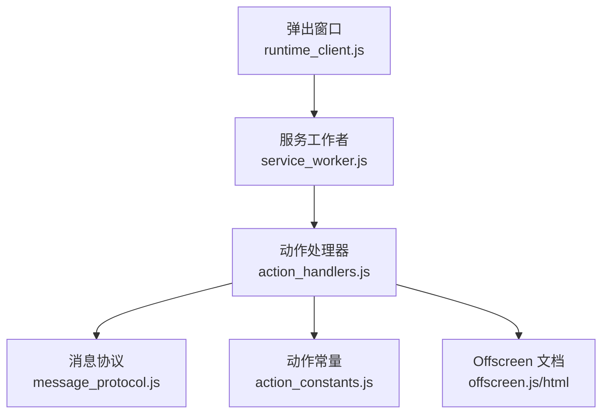
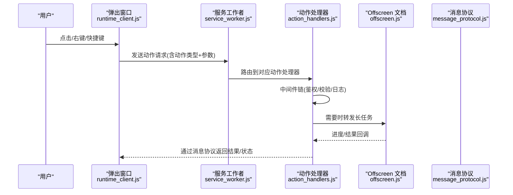
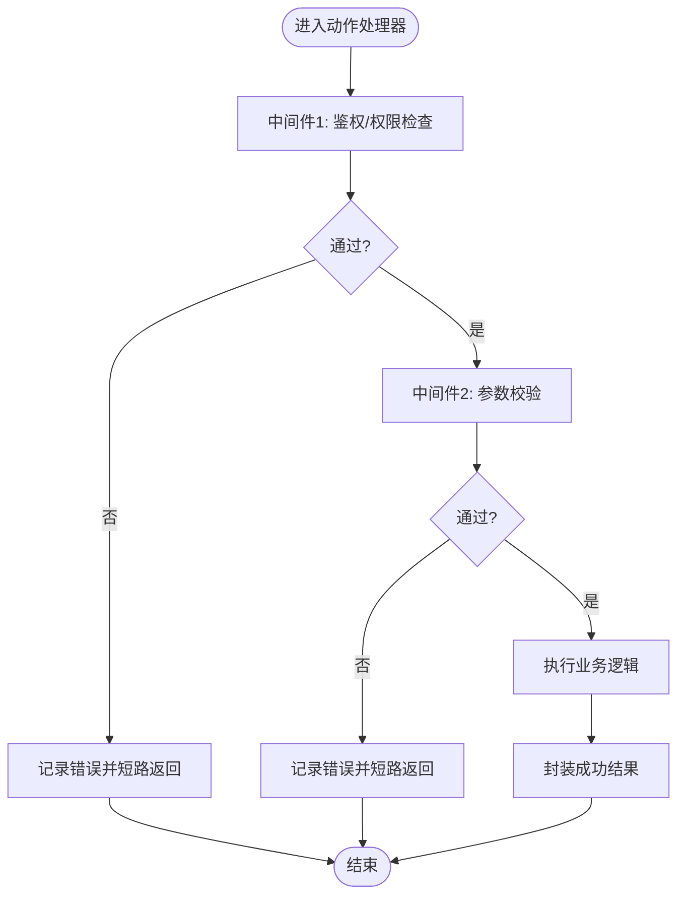
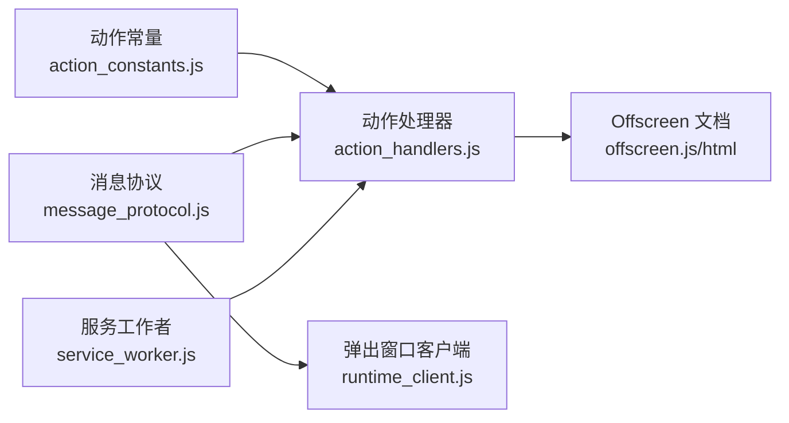

# 动作处理器

<cite>
**本文引用的文件**   
- [extension/background/action_handlers.js](file://extension/background/action_handlers.js)
- [extension/action_constants.js](file://extension/action_constants.js)
- [extension/service_worker.js](file://extension/service_worker.js)
- [extension/popup/runtime_client.js](file://extension/popup/runtime_client.js)
- [extension/shared/message_protocol.js](file://extension/shared/message_protocol.js)
- [extension/offscreen.js](file://extension/offscreen.js)
- [extension/offscreen.html](file://extension/offscreen.html)
- [tests/test_extension_action_handlers.js](file://tests/test_extension_action_handlers.js)
</cite>

## 目录
1. [简介](#简介)
2. [项目结构](#项目结构)
3. [核心组件](#核心组件)
4. [架构总览](#架构总览)
5. [详细组件分析](#详细组件分析)
6. [依赖关系分析](#依赖关系分析)
7. [性能考虑](#性能考虑)
8. [故障排查指南](#故障排查指南)
9. [结论](#结论)
10. [附录](#附录)

## 简介
本文件面向扩展开发者，系统化阐述“动作处理器”的设计与实现。内容覆盖：
- 统一的用户交互入口：右键菜单、工具栏按钮、快捷键等通过同一套动作协议路由到后台处理逻辑
- 动作常量定义与管理：动作类型枚举、参数规范、返回值约定
- 注册机制与调用链：中间件模式、错误传播、异步执行与状态同步
- 进度反馈与界面更新：从后台到弹出窗口的状态流转
- 自定义动作处理器开发指南与测试方法：集成模式、示例路径与最佳实践

## 项目结构
本项目采用分层组织方式，动作相关代码主要分布在以下位置：
- 动作常量定义：extension/action_constants.js
- 消息协议与类型契约：extension/shared/message_protocol.js
- 服务工作者入口与事件绑定：extension/service_worker.js
- 后台动作处理器与中间件：extension/background/action_handlers.js
- 弹出窗口运行时客户端（UI侧）：extension/popup/runtime_client.js
- Offscreen 文档（可选的长任务执行环境）：extension/offscreen.js / extension/offscreen.html
- 单元测试：tests/test_extension_action_handlers.js

图表来源
- [extension/service_worker.js](file://extension/service_worker.js)
- [extension/background/action_handlers.js](file://extension/background/action_handlers.js)
- [extension/shared/message_protocol.js](file://extension/shared/message_protocol.js)
- [extension/action_constants.js](file://extension/action_constants.js)
- [extension/offscreen.js](file://extension/offscreen.js)
- [extension/offscreen.html](file://extension/offscreen.html)

章节来源
- [extension/action_constants.js](file://extension/action_constants.js)
- [extension/shared/message_protocol.js](file://extension/shared/message_protocol.js)
- [extension/service_worker.js](file://extension/service_worker.js)
- [extension/background/action_handlers.js](file://extension/background/action_handlers.js)
- [extension/popup/runtime_client.js](file://extension/popup/runtime_client.js)
- [extension/offscreen.js](file://extension/offscreen.js)
- [extension/offscreen.html](file://extension/offscreen.html)

## 核心组件
- 动作常量：集中定义所有可触发的动作类型、参数键名、返回字段等，确保前后端一致
- 消息协议：定义跨上下文通信的消息格式、事件名、载荷结构与校验规则
- 服务工作者：作为浏览器事件（右键菜单、工具栏点击、快捷键）的统一入口，将事件转换为动作请求并路由
- 动作处理器：基于中间件链对动作进行预处理、鉴权、参数校验、业务执行、结果封装与错误传播
- 弹出窗口客户端：负责发起动作请求、订阅状态变更、渲染进度与结果
- Offscreen 文档：承载耗时或受限操作，避免阻塞主线程

章节来源
- [extension/action_constants.js](file://extension/action_constants.js)
- [extension/shared/message_protocol.js](file://extension/shared/message_protocol.js)
- [extension/service_worker.js](file://extension/service_worker.js)
- [extension/background/action_handlers.js](file://extension/background/action_handlers.js)
- [extension/popup/runtime_client.js](file://extension/popup/runtime_client.js)
- [extension/offscreen.js](file://extension/offscreen.js)

## 架构总览
动作从用户交互触发，经服务工作者路由至动作处理器，再由中间件链完成校验与执行，必要时委托 Offscreen 文档执行长任务，最终通过消息协议将结果与状态推送给弹出窗口。

图表来源
- [extension/service_worker.js](file://extension/service_worker.js)
- [extension/background/action_handlers.js](file://extension/background/action_handlers.js)
- [extension/shared/message_protocol.js](file://extension/shared/message_protocol.js)
- [extension/popup/runtime_client.js](file://extension/popup/runtime_client.js)
- [extension/offscreen.js](file://extension/offscreen.js)

## 详细组件分析

### 动作常量与参数规范
- 动作类型枚举：在动作常量文件中集中声明，供 UI 与服务端共同引用，避免硬编码字符串
- 参数规范：每个动作定义其输入参数的键名、类型、是否必填、默认值与取值范围
- 返回值约定：统一的成功/失败结构，包含状态码、消息、数据体；错误对象包含错误码、堆栈摘要、可重试标志
- 版本兼容：为动作常量预留版本号或兼容性标记，便于后续演进

章节来源
- [extension/action_constants.js](file://extension/action_constants.js)

### 消息协议与跨上下文通信
- 消息命名空间：按模块划分事件名，避免冲突
- 载荷结构：严格遵循协议定义的字段，提供序列化/反序列化工具
- 错误传播：错误信息以结构化形式传递，支持前端展示与后端追踪
- 进度事件：针对长任务，使用独立事件名上报进度百分比与阶段描述

章节来源
- [extension/shared/message_protocol.js](file://extension/shared/message_protocol.js)

### 服务工作者与事件路由
- 事件源统一：右键菜单、工具栏按钮、快捷键均转换为内部动作请求
- 路由策略：根据动作类型分发到对应的处理器；未匹配则返回标准错误
- 权限控制：在服务工作者层做基础白名单校验，减少无效调用

章节来源
- [extension/service_worker.js](file://extension/service_worker.js)

### 动作处理器与中间件模式
- 中间件链：每个中间件负责单一职责（如鉴权、参数校验、限流、日志），按顺序执行
- 短路机制：任一中间件返回错误即终止后续处理，并将错误沿调用链回传
- 上下文对象：中间件共享一个上下文，用于携带请求元数据、临时状态与结果
- 错误传播：错误对象贯穿链路，最终由顶层处理器统一格式化返回

图表来源
- [extension/background/action_handlers.js](file://extension/background/action_handlers.js)

章节来源
- [extension/background/action_handlers.js](file://extension/background/action_handlers.js)

### 异步动作执行与状态同步
- 异步模型：动作执行可能涉及网络 I/O、磁盘 I/O 或 Offscreen 长任务，全部以异步方式处理
- 进度反馈：通过消息协议周期性上报进度，UI 实时更新进度条与阶段提示
- 状态同步：动作完成后，向 UI 广播最终状态，保证界面与后台一致
- 取消与超时：支持取消信号与超时控制，避免资源泄漏

章节来源
- [extension/shared/message_protocol.js](file://extension/shared/message_protocol.js)
- [extension/offscreen.js](file://extension/offscreen.js)
- [extension/popup/runtime_client.js](file://extension/popup/runtime_client.js)

### 自定义动作处理器开发指南
- 步骤概览
  - 在动作常量中新增动作类型与参数/返回定义
  - 在消息协议中补充必要的事件名与载荷结构
  - 在服务工作者中添加路由映射（若为新事件源）
  - 在动作处理器中注册新中间件与业务逻辑
  - 在弹出窗口客户端添加请求与状态监听
  - 编写单测验证正常流程与异常分支
- 关键注意事项
  - 保持参数与返回结构的向后兼容
  - 中间件幂等与可重入性
  - 错误信息需对用户友好且便于定位问题
  - 长任务尽量下沉到 Offscreen 文档执行

章节来源
- [extension/action_constants.js](file://extension/action_constants.js)
- [extension/shared/message_protocol.js](file://extension/shared/message_protocol.js)
- [extension/service_worker.js](file://extension/service_worker.js)
- [extension/background/action_handlers.js](file://extension/background/action_handlers.js)
- [extension/popup/runtime_client.js](file://extension/popup/runtime_client.js)

### 测试方法与集成模式
- 单元测试要点
  - 覆盖中间件链的正常与异常路径
  - 模拟消息协议载荷，验证解析与校验逻辑
  - 模拟 Offscreen 回调，验证进度与结果合并
  - 断言错误对象结构与传播行为
- 集成测试建议
  - 端到端验证从 UI 到后台再到 Offscreen 的完整链路
  - 注入不同配置与边界条件，验证鲁棒性

章节来源
- [tests/test_extension_action_handlers.js](file://tests/test_extension_action_handlers.js)

## 依赖关系分析
- 低耦合高内聚：动作常量与消息协议作为契约层，被多处复用
- 明确边界：服务工作者仅负责事件接收与路由，不承载业务逻辑
- 可扩展性：中间件模式允许在不改动核心逻辑的前提下增加横切能力

图表来源
- [extension/action_constants.js](file://extension/action_constants.js)
- [extension/shared/message_protocol.js](file://extension/shared/message_protocol.js)
- [extension/service_worker.js](file://extension/service_worker.js)
- [extension/background/action_handlers.js](file://extension/background/action_handlers.js)
- [extension/popup/runtime_client.js](file://extension/popup/runtime_client.js)
- [extension/offscreen.js](file://extension/offscreen.js)
- [extension/offscreen.html](file://extension/offscreen.html)

章节来源
- [extension/action_constants.js](file://extension/action_constants.js)
- [extension/shared/message_protocol.js](file://extension/shared/message_protocol.js)
- [extension/service_worker.js](file://extension/service_worker.js)
- [extension/background/action_handlers.js](file://extension/background/action_handlers.js)
- [extension/popup/runtime_client.js](file://extension/popup/runtime_client.js)
- [extension/offscreen.js](file://extension/offscreen.js)
- [extension/offscreen.html](file://extension/offscreen.html)

## 性能考虑
- 避免在主线程执行耗时操作，优先使用 Offscreen 文档
- 批量与去抖：对高频 UI 事件进行合并与节流
- 缓存热点数据：减少重复计算与网络请求
- 错误快速失败：尽早校验与短路，降低无效开销

[本节为通用指导，无需具体文件来源]

## 故障排查指南
- 常见问题
  - 动作类型未注册：检查服务工作者路由与动作常量一致性
  - 参数校验失败：核对消息协议与动作常量中的字段定义
  - 进度不更新：确认 Offscreen 回调与消息协议事件名是否正确
  - 错误信息不完整：检查中间件链的错误传播与格式化逻辑
- 调试技巧
  - 在服务工作者与动作处理器中增加结构化日志
  - 使用单测模拟边界条件与异常路径
  - 在弹出窗口客户端打印消息载荷与响应

章节来源
- [extension/service_worker.js](file://extension/service_worker.js)
- [extension/background/action_handlers.js](file://extension/background/action_handlers.js)
- [extension/shared/message_protocol.js](file://extension/shared/message_protocol.js)
- [extension/popup/runtime_client.js](file://extension/popup/runtime_client.js)

## 结论
动作处理器通过统一的常量与协议、清晰的路由与中间件链，实现了多入口用户交互的一致化处理。结合 Offscreen 文档与消息协议，系统具备良好的可扩展性与可维护性。遵循本文的开发指南与测试方法，可高效地扩展新的动作能力并保持整体质量。

[本节为总结性内容，无需具体文件来源]

## 附录
- 术语表
  - 动作：一次用户意图触发的可执行单元
  - 中间件：围绕动作执行的横切逻辑组件
  - Offscreen 文档：独立的无头页面，用于执行耗时任务
- 参考路径
  - 动作常量定义：[extension/action_constants.js](file://extension/action_constants.js)
  - 消息协议定义：[extension/shared/message_protocol.js](file://extension/shared/message_protocol.js)
  - 服务工作者入口：[extension/service_worker.js](file://extension/service_worker.js)
  - 动作处理器实现：[extension/background/action_handlers.js](file://extension/background/action_handlers.js)
  - 弹出窗口客户端：[extension/popup/runtime_client.js](file://extension/popup/runtime_client.js)
  - Offscreen 文档：[extension/offscreen.js](file://extension/offscreen.js), [extension/offscreen.html](file://extension/offscreen.html)
  - 单元测试：[tests/test_extension_action_handlers.js](file://tests/test_extension_action_handlers.js)