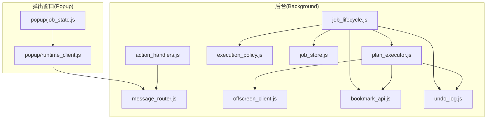
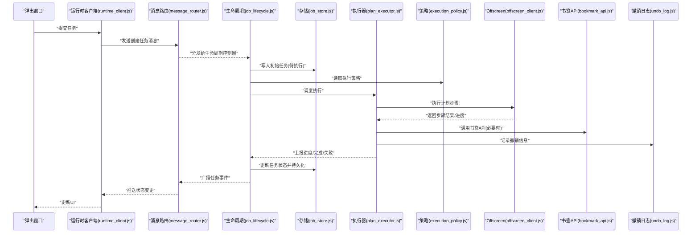
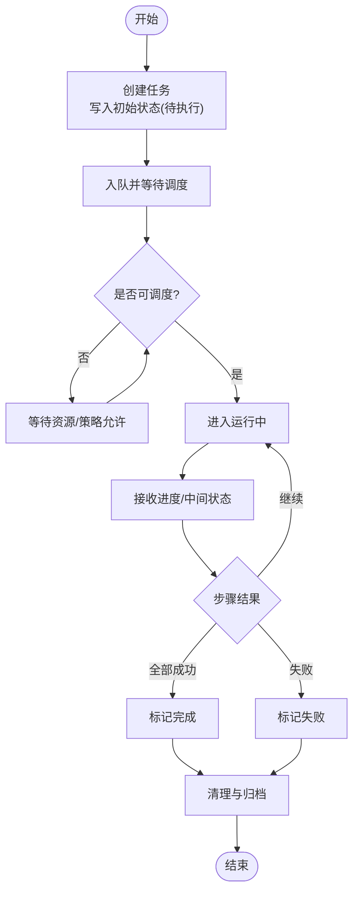
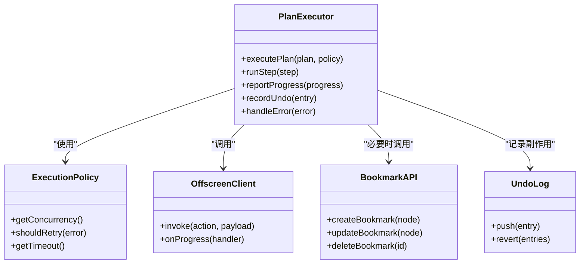
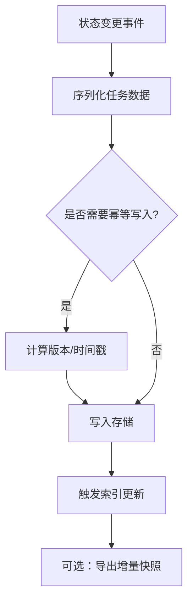
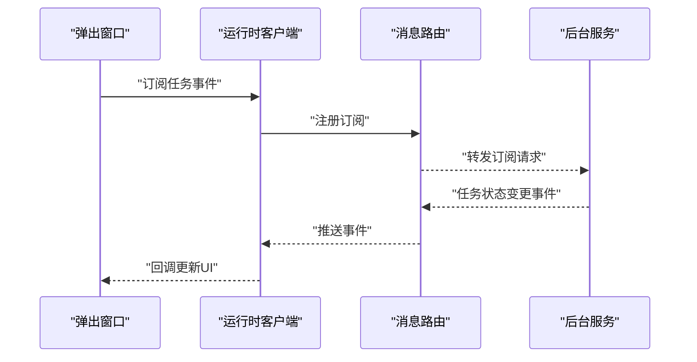
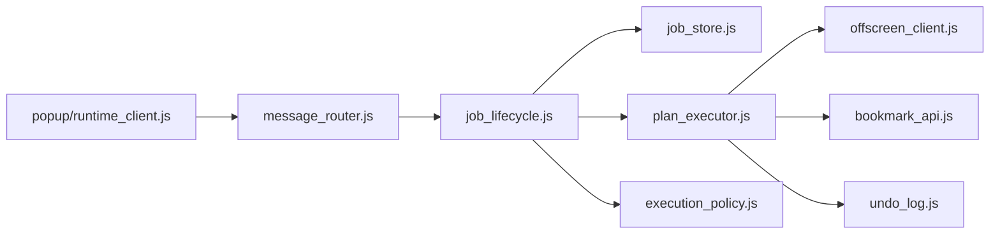

# 任务生命周期管理

<cite>
**本文引用的文件**   
- [job_lifecycle.js](file://extension/background/job_lifecycle.js)
- [job_store.js](file://extension/background/job_store.js)
- [job_handlers.js](file://extension/background/job_handlers.js)
- [plan_executor.js](file://extension/background/plan_executor.js)
- [execution_policy.js](file://extension/background/execution_policy.js)
- [message_router.js](file://extension/background/message_router.js)
- [offscreen_client.js](file://extension/background/offscreen_client.js)
- [action_handlers.js](file://extension/background/action_handlers.js)
- [bookmark_api.js](file://extension/background/bookmark_api.js)
- [undo_log.js](file://extension/background/undo_log.js)
- [job_state.js](file://extension/popup/job_state.js)
- [runtime_client.js](file://extension/popup/runtime_client.js)
- [test_extension_job_lifecycle.js](file://tests/test_extension_job_lifecycle.js)
- [test_extension_job_store.js](file://tests/test_extension_job_store.js)
- [test_extension_job_handlers.js](file://tests/test_extension_job_handlers.js)
</cite>

## 目录
1. [简介](#简介)
2. [项目结构](#项目结构)
3. [核心组件](#核心组件)
4. [架构总览](#架构总览)
5. [详细组件分析](#详细组件分析)
6. [依赖关系分析](#依赖关系分析)
7. [性能考虑](#性能考虑)
8. [故障排查指南](#故障排查指南)
9. [结论](#结论)
10. [附录](#附录)

## 简介
本文件围绕“任务生命周期管理”展开，聚焦于任务从创建到销毁的完整流程：初始化、排队、执行、完成与清理。文档重点说明状态跟踪机制（持久化、同步与一致性）、进度报告与回调（实时进度、错误通知、完成事件），以及监控与调试方法（状态流转图、常见问题诊断）。内容基于扩展后台脚本与弹出窗口的实现，结合测试用例进行验证性说明。

## 项目结构
与任务生命周期直接相关的模块主要位于 extension/background 与 extension/popup 下，并通过消息路由在 Service Worker/Offscreen 与 UI 之间通信。关键职责划分如下：
- 任务编排与执行：job_lifecycle.js、plan_executor.js、execution_policy.js
- 任务存储与持久化：job_store.js
- 外部交互与副作用：bookmark_api.js、undo_log.js
- 进程间通信：message_router.js、offscreen_client.js
- 用户界面状态与订阅：popup/job_state.js、popup/runtime_client.js
- 入口与动作分发：service_worker.js、action_handlers.js

图表来源
- [job_lifecycle.js](file://extension/background/job_lifecycle.js)
- [plan_executor.js](file://extension/background/plan_executor.js)
- [execution_policy.js](file://extension/background/execution_policy.js)
- [job_store.js](file://extension/background/job_store.js)
- [message_router.js](file://extension/background/message_router.js)
- [offscreen_client.js](file://extension/background/offscreen_client.js)
- [action_handlers.js](file://extension/background/action_handlers.js)
- [bookmark_api.js](file://extension/background/bookmark_api.js)
- [undo_log.js](file://extension/background/undo_log.js)
- [job_state.js](file://extension/popup/job_state.js)
- [runtime_client.js](file://extension/popup/runtime_client.js)

章节来源
- [job_lifecycle.js](file://extension/background/job_lifecycle.js)
- [job_store.js](file://extension/background/job_store.js)
- [job_handlers.js](file://extension/background/job_handlers.js)
- [plan_executor.js](file://extension/background/plan_executor.js)
- [execution_policy.js](file://extension/background/execution_policy.js)
- [message_router.js](file://extension/background/message_router.js)
- [offscreen_client.js](file://extension/background/offscreen_client.js)
- [action_handlers.js](file://extension/background/action_handlers.js)
- [bookmark_api.js](file://extension/background/bookmark_api.js)
- [undo_log.js](file://extension/background/undo_log.js)
- [job_state.js](file://extension/popup/job_state.js)
- [runtime_client.js](file://extension/popup/runtime_client.js)

## 核心组件
- 任务生命周期控制器：负责创建任务、入队、调度执行、处理完成与失败、触发清理与持久化。
- 任务执行器：根据策略将计划步骤转换为可执行操作，协调 Offscreen 与书签 API，记录撤销日志。
- 任务存储：提供任务的增删改查、快照与恢复能力，保证状态持久化与一致性。
- 执行策略：控制并发度、重试、超时、幂等与回滚策略。
- 消息路由：统一封装跨上下文的消息收发，支持请求/响应与事件广播。
- 弹出窗口状态：订阅任务状态变更，驱动 UI 渲染与用户交互。

章节来源
- [job_lifecycle.js](file://extension/background/job_lifecycle.js)
- [plan_executor.js](file://extension/background/plan_executor.js)
- [execution_policy.js](file://extension/background/execution_policy.js)
- [job_store.js](file://extension/background/job_store.js)
- [message_router.js](file://extension/background/message_router.js)
- [offscreen_client.js](file://extension/background/offscreen_client.js)
- [job_state.js](file://extension/popup/job_state.js)
- [runtime_client.js](file://extension/popup/runtime_client.js)

## 架构总览
下图展示了任务从创建到销毁的关键路径与组件交互。

图表来源
- [job_lifecycle.js](file://extension/background/job_lifecycle.js)
- [job_store.js](file://extension/background/job_store.js)
- [plan_executor.js](file://extension/background/plan_executor.js)
- [execution_policy.js](file://extension/background/execution_policy.js)
- [offscreen_client.js](file://extension/background/offscreen_client.js)
- [bookmark_api.js](file://extension/background/bookmark_api.js)
- [undo_log.js](file://extension/background/undo_log.js)
- [message_router.js](file://extension/background/message_router.js)
- [runtime_client.js](file://extension/popup/runtime_client.js)

## 详细组件分析

### 任务生命周期控制器
职责与流程
- 创建任务：接收来自消息路由的任务创建请求，生成唯一ID，写入初始状态为“待执行”，并持久化。
- 入队与调度：根据执行策略决定并发度与优先级，将任务加入内部队列；空闲时取出任务交由执行器。
- 执行阶段：监听执行器的进度与结果，实时更新任务状态（运行中、部分成功、失败等）并持久化。
- 完成与清理：任务完成后，触发清理逻辑（如释放资源、归档日志），最终状态落盘。

状态转换要点
- 待执行 → 运行中：调度成功后进入运行中。
- 运行中 → 完成：所有步骤成功且无未决副作用。
- 运行中 → 失败：出现不可恢复错误或策略判定失败。
- 运行中 → 暂停/恢复：由策略或外部信号触发（若实现）。
- 完成/失败 → 已清理：清理完成后标记为已清理。

图表来源
- [job_lifecycle.js](file://extension/background/job_lifecycle.js)
- [execution_policy.js](file://extension/background/execution_policy.js)
- [job_store.js](file://extension/background/job_store.js)

章节来源
- [job_lifecycle.js](file://extension/background/job_lifecycle.js)
- [execution_policy.js](file://extension/background/execution_policy.js)
- [job_store.js](file://extension/background/job_store.js)

### 任务执行器
职责与流程
- 解析计划：将高层计划分解为原子步骤，按策略排序与分组。
- 执行步骤：通过 Offscreen 客户端调用底层能力，必要时访问书签 API。
- 副作用管理：对可能改变书签结构的步骤记录撤销日志，确保可回滚。
- 进度上报：周期性向生命周期控制器上报进度与中间状态。

图表来源
- [plan_executor.js](file://extension/background/plan_executor.js)
- [execution_policy.js](file://extension/background/execution_policy.js)
- [offscreen_client.js](file://extension/background/offscreen_client.js)
- [bookmark_api.js](file://extension/background/bookmark_api.js)
- [undo_log.js](file://extension/background/undo_log.js)

章节来源
- [plan_executor.js](file://extension/background/plan_executor.js)
- [execution_policy.js](file://extension/background/execution_policy.js)
- [offscreen_client.js](file://extension/background/offscreen_client.js)
- [bookmark_api.js](file://extension/background/bookmark_api.js)
- [undo_log.js](file://extension/background/undo_log.js)

### 任务存储与持久化
职责与特性
- 提供任务的增删改查接口，支持批量查询与过滤。
- 持久化策略：每次状态变更后立即落盘，保证崩溃恢复后状态一致。
- 一致性保障：采用事务式更新或幂等写入，避免竞态条件导致的状态覆盖。
- 快照与恢复：支持导出当前任务集快照，并在启动时恢复。

图表来源
- [job_store.js](file://extension/background/job_store.js)

章节来源
- [job_store.js](file://extension/background/job_store.js)

### 消息路由与进程间通信
职责与特性
- 统一封装请求/响应与事件广播，屏蔽跨上下文细节。
- 支持超时与重试，保证可靠性。
- 为弹出窗口提供轻量客户端，用于订阅任务状态变更。

图表来源
- [message_router.js](file://extension/background/message_router.js)
- [runtime_client.js](file://extension/popup/runtime_client.js)

章节来源
- [message_router.js](file://extension/background/message_router.js)
- [runtime_client.js](file://extension/popup/runtime_client.js)

### 动作分发与入口
职责与特性
- 将用户动作（如点击按钮）映射为任务创建或取消请求。
- 校验输入参数，构造最小必要负载，降低无效任务开销。

章节来源
- [action_handlers.js](file://extension/background/action_handlers.js)
- [job_handlers.js](file://extension/background/job_handlers.js)

## 依赖关系分析
- 低耦合高内聚：生命周期控制器仅依赖存储、执行器与策略，不直接操作书签 API。
- 明确边界：执行器负责副作用与进度上报，存储负责持久化，路由负责通信。
- 潜在循环依赖：应避免执行器反向依赖生命周期控制器，改为事件驱动。

图表来源
- [job_lifecycle.js](file://extension/background/job_lifecycle.js)
- [job_store.js](file://extension/background/job_store.js)
- [plan_executor.js](file://extension/background/plan_executor.js)
- [execution_policy.js](file://extension/background/execution_policy.js)
- [offscreen_client.js](file://extension/background/offscreen_client.js)
- [bookmark_api.js](file://extension/background/bookmark_api.js)
- [undo_log.js](file://extension/background/undo_log.js)
- [message_router.js](file://extension/background/message_router.js)
- [runtime_client.js](file://extension/popup/runtime_client.js)

章节来源
- [job_lifecycle.js](file://extension/background/job_lifecycle.js)
- [job_store.js](file://extension/background/job_store.js)
- [plan_executor.js](file://extension/background/plan_executor.js)
- [execution_policy.js](file://extension/background/execution_policy.js)
- [message_router.js](file://extension/background/message_router.js)
- [offscreen_client.js](file://extension/background/offscreen_client.js)
- [bookmark_api.js](file://extension/background/bookmark_api.js)
- [undo_log.js](file://extension/background/undo_log.js)
- [runtime_client.js](file://extension/popup/runtime_client.js)

## 性能考虑
- 并发控制：通过执行策略限制并行度，避免书签 API 过载。
- 批处理与合并：对频繁的小步操作进行合并，减少 I/O 次数。
- 进度节流：限制进度上报频率，避免 UI 抖动与消息风暴。
- 持久化优化：采用增量写入与压缩快照，缩短恢复时间。
- 内存占用：及时释放已完成任务的中间数据，防止泄漏。

[本节为通用指导，无需具体文件引用]

## 故障排查指南
常见问题与定位方法
- 任务卡在“运行中”
  - 检查执行器是否收到进度或完成事件。
  - 查看执行策略是否设置了过长超时或过多重试。
  - 确认 Offscreen 调用是否返回异常或未响应。
- 状态不一致
  - 核对存储写入是否幂等，是否存在并发覆盖。
  - 检查消息路由是否丢失事件或重复投递。
- 副作用未回滚
  - 审查撤销日志是否完整记录，回滚顺序是否正确。
- UI 未更新
  - 确认弹出窗口订阅是否生效，消息路由是否转发事件。

建议的诊断手段
- 启用详细日志：在生命周期控制器与执行器增加关键节点日志。
- 导出任务快照：对比前后快照定位差异。
- 回放执行序列：基于撤销日志重放以复现问题。
- 断点与单测：参考测试用例快速验证假设。

章节来源
- [test_extension_job_lifecycle.js](file://tests/test_extension_job_lifecycle.js)
- [test_extension_job_store.js](file://tests/test_extension_job_store.js)
- [test_extension_job_handlers.js](file://tests/test_extension_job_handlers.js)

## 结论
本方案通过清晰的分层与事件驱动模型，实现了任务从创建到销毁的全生命周期管理。借助策略化执行、幂等持久化与可靠的消息路由，系统在正确性、可观测性与可扩展性方面具备良好基础。配合完善的测试与诊断工具，可有效支撑复杂场景下的稳定运行。

[本节为总结性内容，无需具体文件引用]

## 附录
- 术语
  - 任务：一次完整的计划执行单元，包含多个步骤。
  - 步骤：最小可执行单位，通常对应一次书签操作。
  - 撤销日志：记录副作用以便回滚的数据结构。
  - 进度：任务执行的中间状态，用于实时反馈。
- 最佳实践
  - 保持步骤幂等，便于重试与回滚。
  - 合理设置超时与重试上限，避免雪崩。
  - 对敏感操作进行二次确认与审计。
  - 定期导出快照，便于灾难恢复。

[本节为概念性内容，无需具体文件引用]