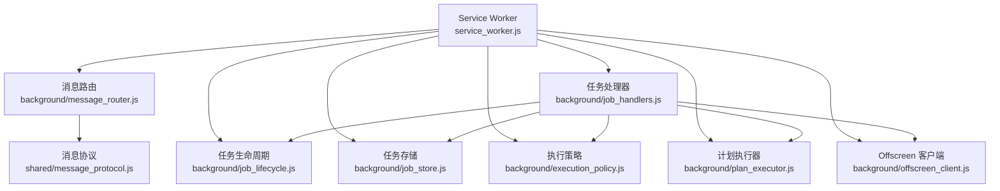
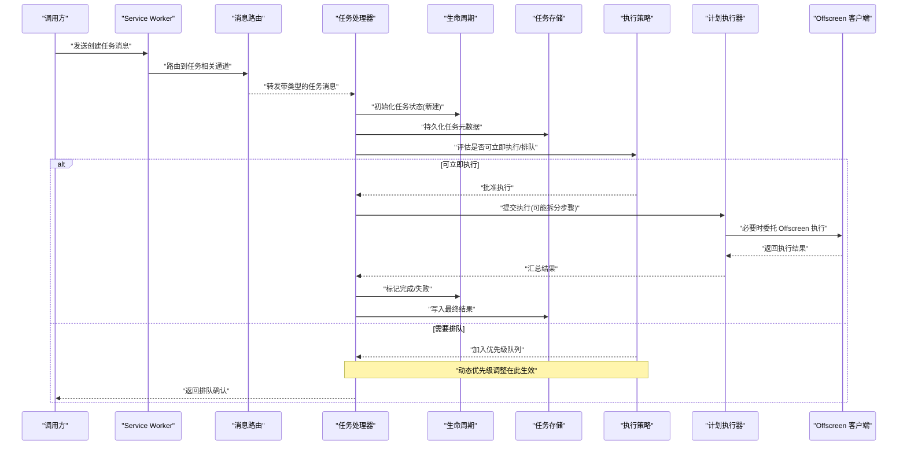
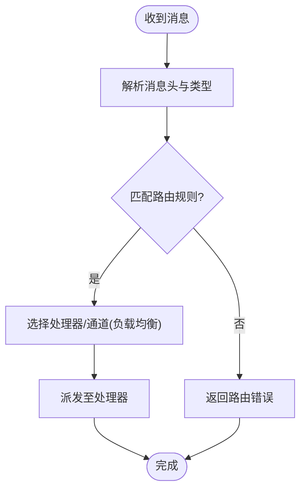
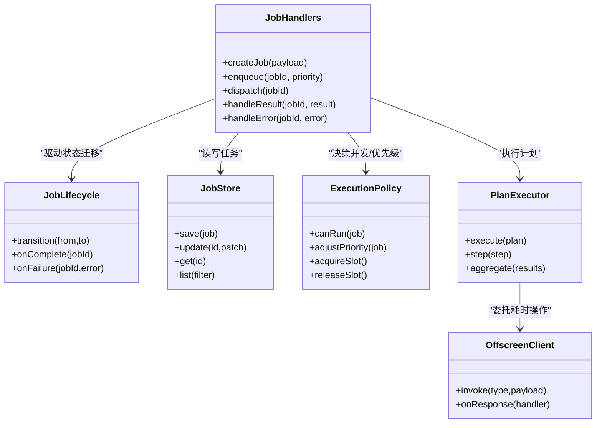
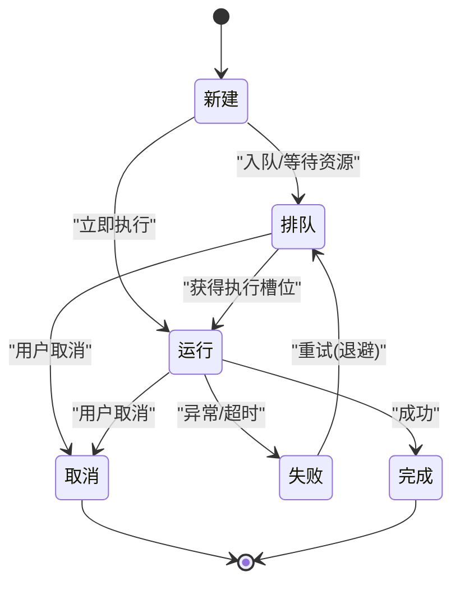
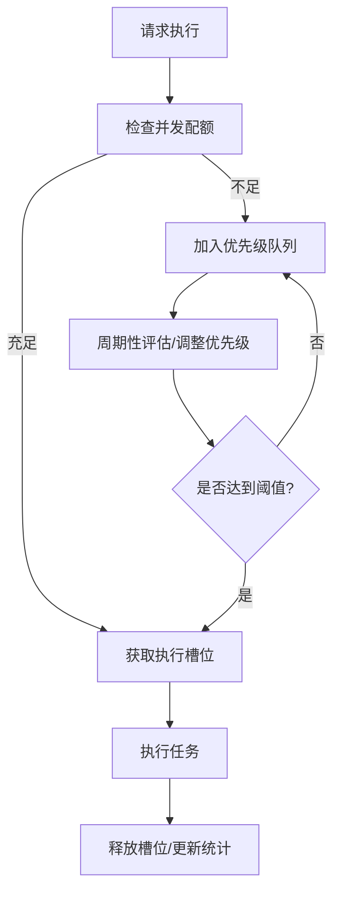
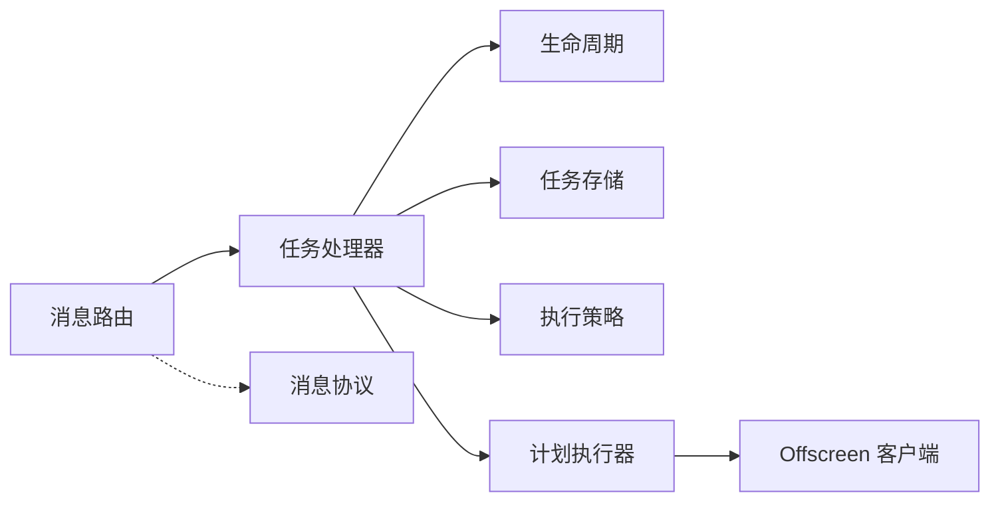

# 任务调度机制

<cite>
**本文引用的文件**   
- [service_worker.js](file://extension/service_worker.js)
- [message_router.js](file://extension/background/message_router.js)
- [job_handlers.js](file://extension/background/job_handlers.js)
- [job_lifecycle.js](file://extension/background/job_lifecycle.js)
- [job_store.js](file://extension/background/job_store.js)
- [execution_policy.js](file://extension/background/execution_policy.js)
- [plan_executor.js](file://extension/background/plan_executor.js)
- [offscreen_client.js](file://extension/background/offscreen_client.js)
- [message_protocol.js](file://extension/shared/message_protocol.js)
- [manifest.json](file://extension/manifest.json)
</cite>

## 目录
1. [简介](#简介)
2. [项目结构](#项目结构)
3. [核心组件](#核心组件)
4. [架构总览](#架构总览)
5. [详细组件分析](#详细组件分析)
6. [依赖关系分析](#依赖关系分析)
7. [性能考虑](#性能考虑)
8. [故障排除指南](#故障排除指南)
9. [结论](#结论)
10. [附录](#附录)

## 简介
本文件围绕“任务调度机制”展开，聚焦以下目标：
- 任务的创建、入队与调度算法（含优先级队列与动态优先级调整）
- 消息路由系统对异步任务分发的处理（类型识别、路由规则匹配、负载均衡）
- 并发控制（最大并发数、资源竞争、死锁预防）
- 配置选项与性能调优（含示例与排障方法）

该机制主要实现于浏览器扩展的 Service Worker 与 Offscreen Document 之间，通过统一的消息协议进行跨上下文通信，并由后台模块负责任务生命周期管理、执行策略与持久化。

## 项目结构
与任务调度相关的代码集中在 extension 目录下的 background 与 shared 子目录中，并通过 manifest.json 声明 Service Worker 与 Offscreen 页面能力。

图表来源
- [service_worker.js](file://extension/service_worker.js)
- [message_router.js](file://extension/background/message_router.js)
- [job_handlers.js](file://extension/background/job_handlers.js)
- [job_lifecycle.js](file://extension/background/job_lifecycle.js)
- [job_store.js](file://extension/background/job_store.js)
- [execution_policy.js](file://extension/background/execution_policy.js)
- [plan_executor.js](file://extension/background/plan_executor.js)
- [offscreen_client.js](file://extension/background/offscreen_client.js)
- [message_protocol.js](file://extension/shared/message_protocol.js)

章节来源
- [manifest.json](file://extension/manifest.json)
- [service_worker.js](file://extension/service_worker.js)

## 核心组件
- 消息路由（Message Router）
  - 职责：接收来自 UI、其他扩展页面或 Offscreen 的消息，按消息类型分发到对应处理器；维护路由表与匹配规则。
  - 关键点：消息类型识别、路由规则匹配、错误回传。
- 任务处理器（Job Handlers）
  - 职责：根据消息中的任务类型选择具体执行逻辑；协调生命周期、存储、策略与执行器。
  - 关键点：任务类型解析、参数校验、结果封装。
- 任务生命周期（Job Lifecycle）
  - 职责：定义任务状态机（如新建、排队、运行、完成、失败、重试等），驱动状态迁移与回调。
  - 关键点：幂等性、超时与重试、状态持久化。
- 任务存储（Job Store）
  - 职责：持久化任务元数据与执行结果；提供查询、更新、清理接口。
  - 关键点：事务性更新、索引设计、一致性。
- 执行策略（Execution Policy）
  - 职责：决定何时、以何种并发度执行任务；支持优先级、限流、退避与抢占策略。
  - 关键点：最大并发、动态优先级、资源配额。
- 计划执行器（Plan Executor）
  - 职责：将高层“计划”拆解为可执行的原子步骤，顺序/并行执行并聚合结果。
  - 关键点：步骤编排、错误恢复、中间态快照。
- Offscreen 客户端（Offscreen Client）
  - 职责：在 Offscreen 文档中执行耗时或受限操作，通过消息与 Service Worker 交互。
  - 关键点：长时任务隔离、内存与 CPU 限制规避。

章节来源
- [message_router.js](file://extension/background/message_router.js)
- [job_handlers.js](file://extension/background/job_handlers.js)
- [job_lifecycle.js](file://extension/background/job_lifecycle.js)
- [job_store.js](file://extension/background/job_store.js)
- [execution_policy.js](file://extension/background/execution_policy.js)
- [plan_executor.js](file://extension/background/plan_executor.js)
- [offscreen_client.js](file://extension/background/offscreen_client.js)

## 架构总览
下图展示了从“任务创建”到“执行与完成”的整体流程，以及各组件之间的交互。

图表来源
- [service_worker.js](file://extension/service_worker.js)
- [message_router.js](file://extension/background/message_router.js)
- [job_handlers.js](file://extension/background/job_handlers.js)
- [job_lifecycle.js](file://extension/background/job_lifecycle.js)
- [job_store.js](file://extension/background/job_store.js)
- [execution_policy.js](file://extension/background/execution_policy.js)
- [plan_executor.js](file://extension/background/plan_executor.js)
- [offscreen_client.js](file://extension/background/offscreen_client.js)

## 详细组件分析

### 消息路由系统（类型识别、规则匹配、负载均衡）
- 类型识别
  - 基于消息协议中的固定字段标识任务类别，路由层据此选择处理器。
- 规则匹配
  - 支持前缀/通配/精确匹配的组合规则，便于扩展新任务类型而不改动核心路由。
- 负载均衡
  - 当同一类任务存在多个处理器实例或不同 Offscreen 通道时，采用轮询或最少活跃连接策略分配。
- 错误处理
  - 未匹配路由返回标准错误码；处理器抛错时由路由层捕获并包装为统一响应格式。

图表来源
- [message_router.js](file://extension/background/message_router.js)
- [message_protocol.js](file://extension/shared/message_protocol.js)

章节来源
- [message_router.js](file://extension/background/message_router.js)
- [message_protocol.js](file://extension/shared/message_protocol.js)

### 任务处理器（任务创建、入队与调度入口）
- 任务创建
  - 校验输入、生成唯一 ID、填充默认属性、落库。
- 入队与调度
  - 根据执行策略决定是否立即执行或进入优先级队列；支持延迟执行与条件触发。
- 结果与回调
  - 统一封装成功/失败响应，记录审计日志，通知调用方。

图表来源
- [job_handlers.js](file://extension/background/job_handlers.js)
- [job_lifecycle.js](file://extension/background/job_lifecycle.js)
- [job_store.js](file://extension/background/job_store.js)
- [execution_policy.js](file://extension/background/execution_policy.js)
- [plan_executor.js](file://extension/background/plan_executor.js)
- [offscreen_client.js](file://extension/background/offscreen_client.js)

章节来源
- [job_handlers.js](file://extension/background/job_handlers.js)
- [job_lifecycle.js](file://extension/background/job_lifecycle.js)
- [job_store.js](file://extension/background/job_store.js)
- [execution_policy.js](file://extension/background/execution_policy.js)
- [plan_executor.js](file://extension/background/plan_executor.js)
- [offscreen_client.js](file://extension/background/offscreen_client.js)

### 任务生命周期（状态机与幂等）
- 典型状态
  - 新建、排队、运行、完成、失败、重试、取消。
- 迁移约束
  - 仅允许合法迁移路径；每次迁移需写库并触发回调。
- 幂等与去重
  - 基于任务 ID 与关键键值避免重复执行；失败重试具备指数退避。

图表来源
- [job_lifecycle.js](file://extension/background/job_lifecycle.js)

章节来源
- [job_lifecycle.js](file://extension/background/job_lifecycle.js)

### 任务存储（持久化与一致性）
- 数据结构
  - 任务元数据（ID、类型、优先级、状态、时间戳）、执行上下文、结果摘要。
- 一致性
  - 使用事务性更新保证状态与结果的一致性；失败回滚。
- 查询与清理
  - 基于状态与时间的索引；定期清理已完成/失败超时的任务。

章节来源
- [job_store.js](file://extension/background/job_store.js)

### 执行策略（并发控制、优先级与动态调整）
- 最大并发数
  - 全局或按任务类型划分并发上限；通过信号量/令牌桶控制。
- 资源竞争
  - 互斥锁保护共享资源；避免长时间持有锁；短临界区。
- 死锁预防
  - 固定加锁顺序、超时释放、检测长等待并降级。
- 动态优先级
  - 基于等待时长、剩余预算、系统负载等因素实时调整优先级，防止饥饿。

图表来源
- [execution_policy.js](file://extension/background/execution_policy.js)

章节来源
- [execution_policy.js](file://extension/background/execution_policy.js)

### 计划执行器（步骤编排与聚合）
- 步骤编排
  - 支持顺序、并行、条件分支与重试。
- 错误恢复
  - 单步失败可局部重试或整体回滚；保留中间快照以便断点续跑。
- 结果聚合
  - 合并多步骤输出，形成最终任务结果。

章节来源
- [plan_executor.js](file://extension/background/plan_executor.js)

### Offscreen 客户端（长时任务隔离）
- 作用
  - 将高 CPU/IO 或受限于 Service Worker 生命周期的任务迁移到 Offscreen 文档执行。
- 通信
  - 通过消息协议与 Service Worker 同步/异步交换数据。
- 容错
  - 心跳/保活、自动重连、任务迁移与恢复。

章节来源
- [offscreen_client.js](file://extension/background/offscreen_client.js)
- [message_protocol.js](file://extension/shared/message_protocol.js)

## 依赖关系分析
- 松耦合
  - 路由层与处理器解耦，新增任务类型仅需注册路由与处理器。
- 内聚性
  - 生命周期与存储紧密协作，确保状态一致。
- 外部依赖
  - 浏览器 API（Service Worker、Offscreen、Storage）。
- 潜在循环
  - 处理器不应直接依赖路由层，避免反向调用造成循环。

图表来源
- [message_router.js](file://extension/background/message_router.js)
- [job_handlers.js](file://extension/background/job_handlers.js)
- [job_lifecycle.js](file://extension/background/job_lifecycle.js)
- [job_store.js](file://extension/background/job_store.js)
- [execution_policy.js](file://extension/background/execution_policy.js)
- [plan_executor.js](file://extension/background/plan_executor.js)
- [offscreen_client.js](file://extension/background/offscreen_client.js)
- [message_protocol.js](file://extension/shared/message_protocol.js)

章节来源
- [manifest.json](file://extension/manifest.json)

## 性能考虑
- 优先级队列
  - 使用堆结构实现 O(log n) 插入与弹出；批量入队时优先构建堆再下沉。
- 动态优先级
  - 引入等待时间惩罚项与系统负载因子，避免低优先级任务长期饥饿。
- 并发控制
  - 令牌桶/漏桶平滑突发流量；按任务类型设置独立配额。
- 批处理与合并
  - 对 I/O 密集任务进行批处理，减少上下文切换与磁盘访问。
- Offscreen 利用
  - 将计算密集型任务卸载到 Offscreen，降低主线程压力。
- 缓存与去重
  - 对相同输入的任务做短期去重，避免重复执行。

[本节为通用指导，不直接分析具体文件]

## 故障排除指南
- 常见问题
  - 任务卡住：检查生命周期状态是否停留在“运行”，查看执行策略是否无法获取槽位。
  - 优先级倒置：观察动态优先级调整是否生效，是否存在长时间占用资源的任务。
  - 路由失败：核对消息协议字段与路由规则，确认处理器已正确注册。
  - Offscreen 断开：检查心跳与重连逻辑，确认 Offscreen 页面未被回收。
- 定位手段
  - 启用详细日志，记录任务 ID、状态迁移、策略决策与错误栈。
  - 导出任务存储快照，分析排队长度与执行耗时分布。
- 修复建议
  - 缩短临界区、增加超时与重试退避、优化批大小与并发上限。
  - 对热点任务类型单独扩容并发配额。

章节来源
- [job_lifecycle.js](file://extension/background/job_lifecycle.js)
- [execution_policy.js](file://extension/background/execution_policy.js)
- [message_router.js](file://extension/background/message_router.js)
- [offscreen_client.js](file://extension/background/offscreen_client.js)

## 结论
本任务调度机制通过清晰的分层与职责划分，实现了可扩展的任务类型、可控的并发与优先级、稳定的状态管理与可靠的跨上下文执行。配合动态优先级与 Offscreen 卸载，可在复杂场景下保持高吞吐与低延迟。建议在上线前结合业务特征校准并发上限、优先级权重与批处理策略，并建立完善的监控与告警体系。

[本节为总结性内容，不直接分析具体文件]

## 附录
- 配置项建议
  - 最大并发数（全局/按类型）
  - 优先级权重（等待时长、剩余预算、系统负载）
  - 重试次数与退避策略
  - Offscreen 任务白名单与超时
- 示例流程
  - 创建任务 -> 路由分发 -> 策略评估 -> 入队/执行 -> 结果落库 -> 回调通知
- 参考文件
  - 消息协议定义、Manifest 声明、各模块实现

[本节为补充信息，不直接分析具体文件]