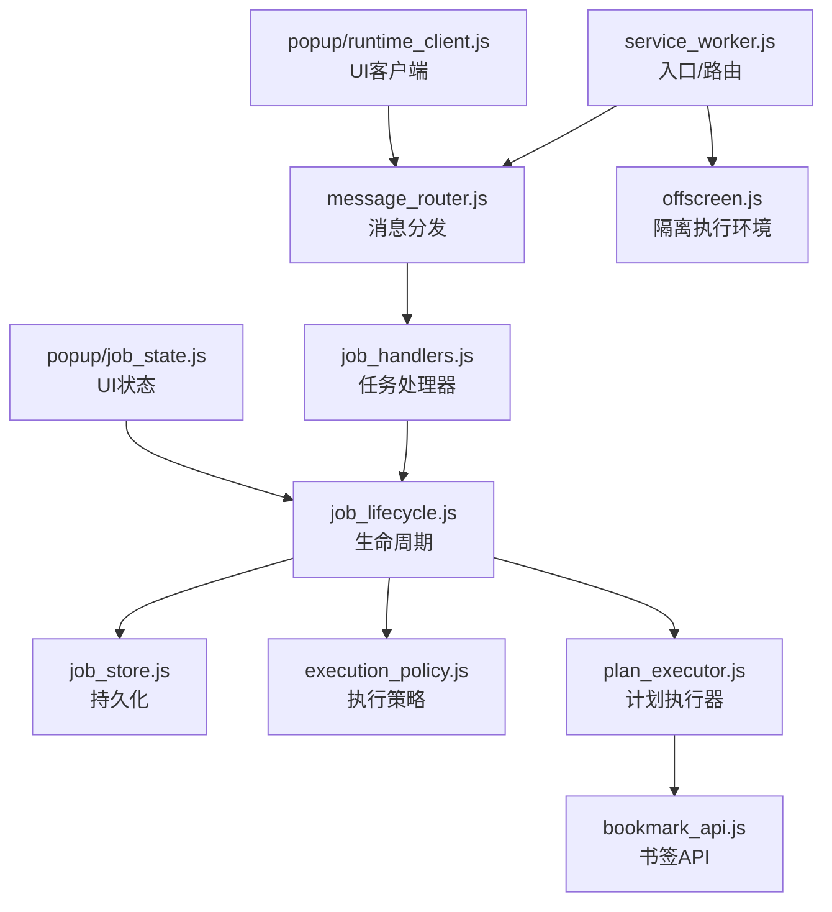
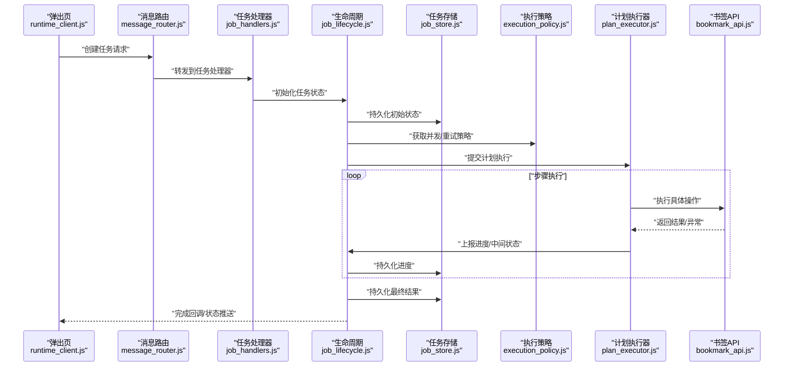
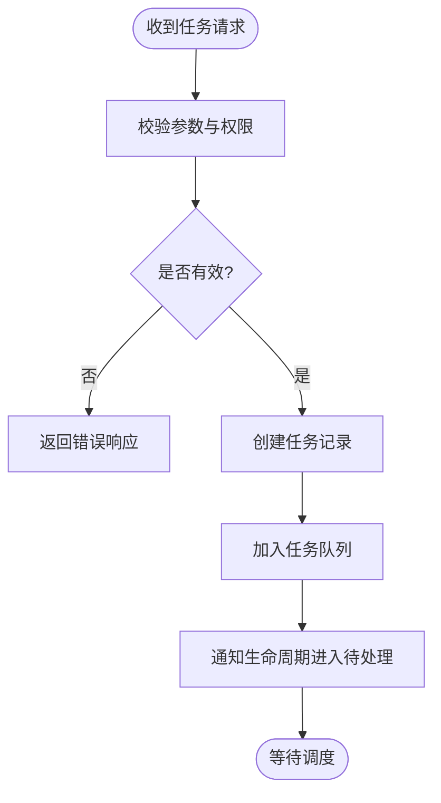
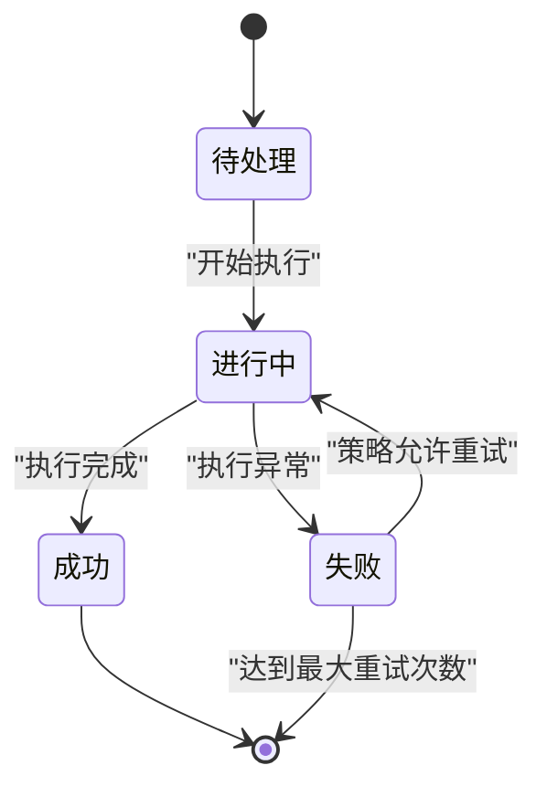
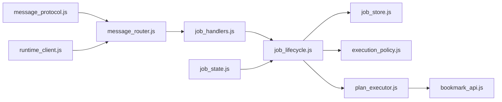

# 异步任务管理

<cite>
**本文引用的文件**   
- [service_worker.js](file://extension/service_worker.js)
- [offscreen.js](file://extension/offscreen.js)
- [job_handlers.js](file://extension/background/job_handlers.js)
- [job_lifecycle.js](file://extension/background/job_lifecycle.js)
- [job_store.js](file://extension/background/job_store.js)
- [execution_policy.js](file://extension/background/execution_policy.js)
- [plan_executor.js](file://extension/background/plan_executor.js)
- [message_router.js](file://extension/background/message_router.js)
- [bookmark_api.js](file://extension/background/bookmark_api.js)
- [action_handlers.js](file://extension/background/action_handlers.js)
- [runtime_client.js](file://extension/popup/runtime_client.js)
- [job_state.js](file://extension/popup/job_state.js)
- [message_protocol.js](file://extension/shared/message_protocol.js)
</cite>

## 目录
1. [简介](#简介)
2. [项目结构](#项目结构)
3. [核心组件](#核心组件)
4. [架构总览](#架构总览)
5. [详细组件分析](#详细组件分析)
6. [依赖关系分析](#依赖关系分析)
7. [性能考虑](#性能考虑)
8. [故障排查指南](#故障排查指南)
9. [结论](#结论)
10. [附录](#附录)

## 简介
本指南围绕浏览器扩展中的异步任务管理，系统性阐述任务的创建、调度与执行机制，包括任务队列与优先级控制、生命周期管理（状态跟踪、进度上报、完成回调）、执行策略配置（并发控制、超时处理、失败重试）、持久化与崩溃恢复，以及最佳实践与性能优化技巧。文档面向开发者，既提供高层架构说明，也给出代码级分析与图示，帮助快速上手并构建健壮的任务系统。

## 项目结构
本项目采用分层组织：共享协议与工具位于 shared；后台服务与任务编排位于 background；弹出界面交互位于 popup；入口与跨上下文通信由 service_worker 与 offscreen 承担。关键路径如下：
- 入口层：service_worker 负责消息路由与页面生命周期；offscreen 承载重计算或受限 API 的隔离执行环境。
- 任务编排层：job_handlers 接收任务请求，job_lifecycle 管理任务状态机，job_store 负责持久化，execution_policy 定义并发与重试策略，plan_executor 驱动具体计划步骤执行。
- 数据与能力层：bookmark_api 封装书签相关操作；message_router 统一消息分发；shared/message_protocol 定义跨上下文消息契约。
- 前端展示层：popup 通过 runtime_client 与后台通信，job_state 维护 UI 侧任务视图。

图表来源
- [service_worker.js](file://extension/service_worker.js)
- [message_router.js](file://extension/background/message_router.js)
- [offscreen.js](file://extension/offscreen.js)
- [job_handlers.js](file://extension/background/job_handlers.js)
- [job_lifecycle.js](file://extension/background/job_lifecycle.js)
- [job_store.js](file://extension/background/job_store.js)
- [execution_policy.js](file://extension/background/execution_policy.js)
- [plan_executor.js](file://extension/background/plan_executor.js)
- [bookmark_api.js](file://extension/background/bookmark_api.js)
- [runtime_client.js](file://extension/popup/runtime_client.js)
- [job_state.js](file://extension/popup/job_state.js)

章节来源
- [service_worker.js](file://extension/service_worker.js)
- [message_router.js](file://extension/background/message_router.js)
- [offscreen.js](file://extension/offscreen.js)
- [job_handlers.js](file://extension/background/job_handlers.js)
- [job_lifecycle.js](file://extension/background/job_lifecycle.js)
- [job_store.js](file://extension/background/job_store.js)
- [execution_policy.js](file://extension/background/execution_policy.js)
- [plan_executor.js](file://extension/background/plan_executor.js)
- [bookmark_api.js](file://extension/background/bookmark_api.js)
- [runtime_client.js](file://extension/popup/runtime_client.js)
- [job_state.js](file://extension/popup/job_state.js)

## 核心组件
- 任务处理器 job_handlers：解析来自 UI 或外部触发的任务请求，校验参数，入队并触发生命周期流转。
- 生命周期 job_lifecycle：维护任务状态机（如待处理、进行中、成功、失败），推进状态变更，触发进度与完成回调。
- 任务存储 job_store：对任务元数据与状态进行持久化，支持查询、更新与恢复。
- 执行策略 execution_policy：定义并发上限、重试次数、退避间隔、超时等策略，供调度器使用。
- 计划执行器 plan_executor：将高层计划分解为可执行的步骤序列，协调各步骤的执行顺序与错误传播。
- 书签 API bookmark_api：封装底层书签读写能力，作为任务执行的具体 I/O 边界。
- 消息协议 message_protocol：定义跨上下文消息类型、字段与约束，确保前后端一致。
- 运行时客户端 runtime_client：在弹出页中发送任务请求、订阅状态更新、处理完成回调。
- 消息路由 message_router：集中注册与分发消息，解耦调用方与被调用方。
- Offscreen offscreen.js：在独立文档上下文中运行耗时或受限任务，避免主线程阻塞。

章节来源
- [job_handlers.js](file://extension/background/job_handlers.js)
- [job_lifecycle.js](file://extension/background/job_lifecycle.js)
- [job_store.js](file://extension/background/job_store.js)
- [execution_policy.js](file://extension/background/execution_policy.js)
- [plan_executor.js](file://extension/background/plan_executor.js)
- [bookmark_api.js](file://extension/background/bookmark_api.js)
- [message_protocol.js](file://extension/shared/message_protocol.js)
- [runtime_client.js](file://extension/popup/runtime_client.js)
- [message_router.js](file://extension/background/message_router.js)
- [offscreen.js](file://extension/offscreen.js)

## 架构总览
整体采用“消息驱动 + 状态机 + 策略化调度”的架构：
- 入口与路由：service_worker 监听消息事件，交由 message_router 分派到对应处理器。
- 任务编排：job_handlers 接收任务后，委托 job_lifecycle 推进状态，并通过 execution_policy 控制并发与重试。
- 执行与持久化：plan_executor 驱动步骤执行，job_store 同步保存任务状态与进度，保证崩溃后可恢复。
- 前端交互：popup 通过 runtime_client 发起任务并订阅状态变化，job_state 渲染当前任务视图。

图表来源
- [runtime_client.js](file://extension/popup/runtime_client.js)
- [message_router.js](file://extension/background/message_router.js)
- [job_handlers.js](file://extension/background/job_handlers.js)
- [job_lifecycle.js](file://extension/background/job_lifecycle.js)
- [job_store.js](file://extension/background/job_store.js)
- [execution_policy.js](file://extension/background/execution_policy.js)
- [plan_executor.js](file://extension/background/plan_executor.js)
- [bookmark_api.js](file://extension/background/bookmark_api.js)

## 详细组件分析

### 任务处理器 job_handlers
职责与流程
- 接收来自消息路由的任务请求，校验参数与权限。
- 生成任务标识，写入默认状态，入队并通知生命周期进入待处理。
- 根据任务类型选择执行策略与执行器。

关键点
- 参数校验失败应直接返回错误响应，避免无效任务入队。
- 任务标识需具备唯一性与可追踪性，便于后续查询与日志关联。

图表来源
- [job_handlers.js](file://extension/background/job_handlers.js)
- [message_router.js](file://extension/background/message_router.js)

章节来源
- [job_handlers.js](file://extension/background/job_handlers.js)
- [message_router.js](file://extension/background/message_router.js)

### 生命周期 job_lifecycle
职责与流程
- 维护任务状态机，包含待处理、进行中、成功、失败等状态。
- 在状态转换时触发进度上报与完成回调。
- 与执行策略协作，决定重试与超时行为。

状态转换要点
- 从待处理到进行中：开始执行前持久化状态。
- 进行中到成功/失败：执行完成后持久化最终结果。
- 失败到进行中：按策略进行重试。

图表来源
- [job_lifecycle.js](file://extension/background/job_lifecycle.js)
- [execution_policy.js](file://extension/background/execution_policy.js)
- [job_store.js](file://extension/background/job_store.js)

章节来源
- [job_lifecycle.js](file://extension/background/job_lifecycle.js)
- [execution_policy.js](file://extension/background/execution_policy.js)
- [job_store.js](file://extension/background/job_store.js)

### 任务存储 job_store
职责与特性
- 提供任务的增删改查接口，支持按状态、优先级、时间范围筛选。
- 在关键状态点落盘，确保崩溃后可恢复。
- 提供事务式更新，避免部分写导致的脏数据。

设计建议
- 使用幂等更新键，防止重复写入造成不一致。
- 对高频进度更新做批处理或节流，降低 I/O 压力。

章节来源
- [job_store.js](file://extension/background/job_store.js)

### 执行策略 execution_policy
职责与配置项
- 并发控制：限制同时运行的任务数量，避免资源争用。
- 超时处理：为单个任务或步骤设置超时阈值，超时自动中断并标记失败。
- 失败重试：定义最大重试次数与退避间隔，支持指数退避与抖动。
- 优先级：高优先级任务优先调度，低优先级任务在资源空闲时执行。

策略应用
- 调度器在拉取下一个任务时依据策略排序与限流。
- 执行器在执行步骤时遵循超时与重试规则。

章节来源
- [execution_policy.js](file://extension/background/execution_policy.js)

### 计划执行器 plan_executor
职责与流程
- 将高层计划拆解为步骤序列，按序或并行执行。
- 收集每步执行结果，汇总为任务最终结果。
- 与生命周期协作，上报进度与异常。

执行模式
- 串行执行：适用于强依赖的步骤。
- 有限并行：在策略允许的范围内并行执行无依赖步骤。

章节来源
- [plan_executor.js](file://extension/background/plan_executor.js)
- [job_lifecycle.js](file://extension/background/job_lifecycle.js)

### 书签 API bookmark_api
职责与边界
- 封装书签读取、修改、批量操作等能力。
- 对外暴露稳定的接口，屏蔽底层实现细节。
- 对异常进行规范化包装，便于上层统一处理。

章节来源
- [bookmark_api.js](file://extension/background/bookmark_api.js)

### 消息协议 message_protocol
职责与约定
- 定义任务创建、状态查询、进度上报、完成回调的消息格式。
- 明确必填字段、枚举值与错误码，确保跨上下文一致性。
- 提供版本兼容策略，支持渐进升级。

章节来源
- [message_protocol.js](file://extension/shared/message_protocol.js)

### 运行时客户端 runtime_client
职责与用法
- 在弹出页中发送任务创建请求，订阅任务状态更新。
- 处理完成回调，刷新 UI 并提示用户。
- 提供重试与取消操作的便捷方法。

章节来源
- [runtime_client.js](file://extension/popup/runtime_client.js)
- [job_state.js](file://extension/popup/job_state.js)

### 消息路由 message_router
职责与机制
- 集中注册消息处理器，按消息类型分发到对应模块。
- 支持拦截器与鉴权逻辑，增强安全性与可观测性。
- 提供调试开关，输出详细的消息链路日志。

章节来源
- [message_router.js](file://extension/background/message_router.js)

### Offscreen offscreen.js
职责与场景
- 在独立文档上下文中运行耗时任务，避免主线程阻塞。
- 与 service_worker 通过消息通信，保持轻量与隔离。
- 适合需要访问受限 API 或长时间运行的任务。

章节来源
- [offscreen.js](file://extension/offscreen.js)
- [service_worker.js](file://extension/service_worker.js)

## 依赖关系分析
组件间依赖清晰，层次分明：
- 入口与路由依赖消息协议，解耦调用方与被调用方。
- 任务处理器依赖生命周期与存储，负责入队与状态初始化。
- 生命周期依赖策略与执行器，负责状态推进与执行协调。
- 执行器依赖具体 API（如书签 API），完成实际业务操作。
- 前端客户端依赖路由与协议，负责发起请求与展示状态。

图表来源
- [message_protocol.js](file://extension/shared/message_protocol.js)
- [message_router.js](file://extension/background/message_router.js)
- [job_handlers.js](file://extension/background/job_handlers.js)
- [job_lifecycle.js](file://extension/background/job_lifecycle.js)
- [job_store.js](file://extension/background/job_store.js)
- [execution_policy.js](file://extension/background/execution_policy.js)
- [plan_executor.js](file://extension/background/plan_executor.js)
- [bookmark_api.js](file://extension/background/bookmark_api.js)
- [runtime_client.js](file://extension/popup/runtime_client.js)
- [job_state.js](file://extension/popup/job_state.js)

章节来源
- [message_protocol.js](file://extension/shared/message_protocol.js)
- [message_router.js](file://extension/background/message_router.js)
- [job_handlers.js](file://extension/background/job_handlers.js)
- [job_lifecycle.js](file://extension/background/job_lifecycle.js)
- [job_store.js](file://extension/background/job_store.js)
- [execution_policy.js](file://extension/background/execution_policy.js)
- [plan_executor.js](file://extension/background/plan_executor.js)
- [bookmark_api.js](file://extension/background/bookmark_api.js)
- [runtime_client.js](file://extension/popup/runtime_client.js)
- [job_state.js](file://extension/popup/job_state.js)

## 性能考虑
- 并发控制：合理设置最大并发数，避免过多任务导致内存与 I/O 竞争。
- 进度批处理：对频繁的状态更新进行合并与节流，减少持久化开销。
- 超时与重试：为长耗时步骤设置超时，配合指数退避降低瞬时压力。
- 优先级调度：高优先级任务优先执行，低优先级任务在空闲时段处理。
- 内存管理：及时释放不再使用的对象引用，避免闭包持有大对象。
- 错误处理：统一异常包装与错误码，便于定位与监控。
- 调试方法：启用消息链路日志，结合任务 ID 追踪问题。

[本节为通用指导，不直接分析具体文件]

## 故障排查指南
常见问题与定位思路
- 任务未启动：检查消息路由是否正确注册处理器，确认任务入队成功。
- 状态不同步：核对持久化写入时机与幂等键，避免重复或遗漏更新。
- 执行超时：查看策略配置的超时阈值与步骤耗时，必要时拆分步骤。
- 重试风暴：调整退避间隔与最大重试次数，避免雪崩效应。
- UI 不更新：确认完成回调与状态推送是否正常，检查前端订阅逻辑。

章节来源
- [message_router.js](file://extension/background/message_router.js)
- [job_handlers.js](file://extension/background/job_handlers.js)
- [job_lifecycle.js](file://extension/background/job_lifecycle.js)
- [job_store.js](file://extension/background/job_store.js)
- [execution_policy.js](file://extension/background/execution_policy.js)
- [runtime_client.js](file://extension/popup/runtime_client.js)

## 结论
本指南基于现有代码库梳理了异步任务管理的核心机制与实践要点。通过消息驱动、状态机与策略化调度的组合，实现了可扩展、可恢复且高性能的任务系统。建议在开发中严格遵循协议约定、完善持久化与错误处理，并结合监控与日志持续优化性能与稳定性。

[本节为总结性内容，不直接分析具体文件]

## 附录
- 示例：创建一个书签整理任务
  - 在弹出页通过运行时客户端发起任务创建请求。
  - 后台处理器校验参数并入队，生命周期推进至待处理。
  - 执行器按策略执行计划步骤，期间上报进度并持久化。
  - 完成后回调通知前端，UI 显示结果并提供重试选项。

[本节为概念性示例，不直接分析具体文件]