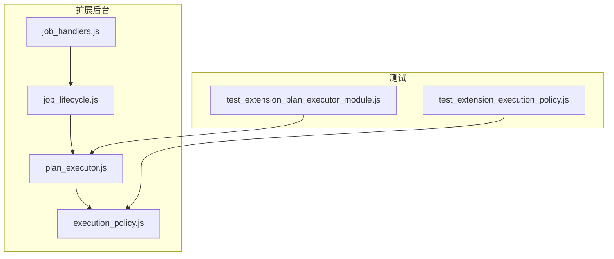
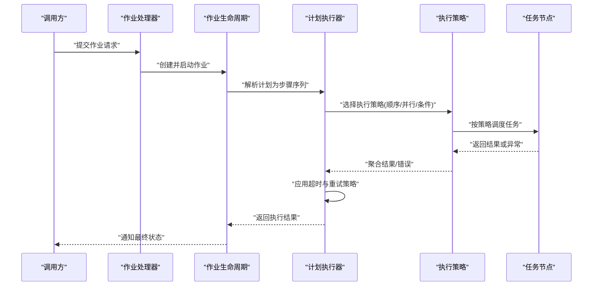
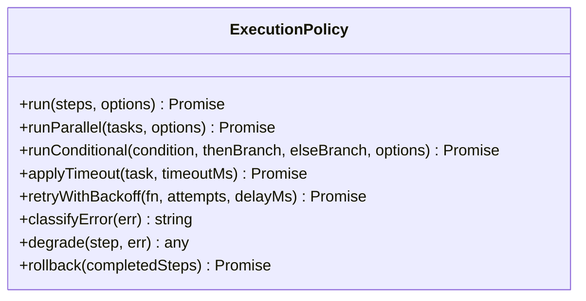
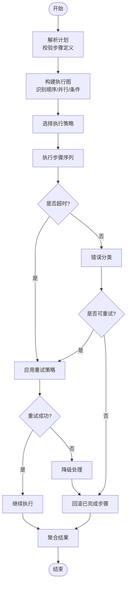
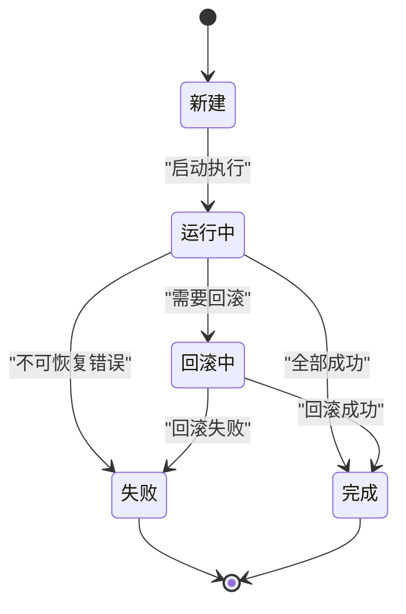
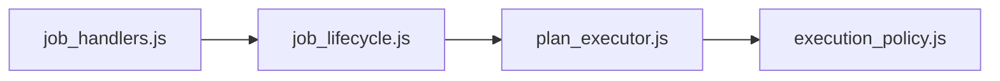

# 执行策略配置

<cite>
**本文引用的文件**   
- [execution_policy.js](file://extension/background/execution_policy.js)
- [plan_executor.js](file://extension/background/plan_executor.js)
- [job_lifecycle.js](file://extension/background/job_lifecycle.js)
- [job_handlers.js](file://extension/background/job_handlers.js)
- [test_extension_execution_policy.js](file://tests/test_extension_execution_policy.js)
- [test_extension_plan_executor_module.js](file://tests/test_extension_plan_executor_module.js)
</cite>

## 目录
1. [简介](#简介)
2. [项目结构](#项目结构)
3. [核心组件](#核心组件)
4. [架构总览](#架构总览)
5. [详细组件分析](#详细组件分析)
6. [依赖关系分析](#依赖关系分析)
7. [性能考虑](#性能考虑)
8. [故障排查指南](#故障排查指南)
9. [结论](#结论)
10. [附录](#附录)

## 简介
本文件围绕“执行策略配置”展开，系统化说明顺序执行、并行执行与条件执行的策略模式；详述超时处理（全局超时、任务级超时、重试策略）；阐述失败处理与恢复机制（错误分类、自动重试、降级与回滚）；并提供自定义执行策略的开发指南（接口定义、注册与组合），辅以实际使用示例与最佳实践。内容基于仓库中扩展后台模块的执行策略与计划执行相关实现进行提炼与归纳。

## 项目结构
与执行策略相关的代码主要位于扩展后台模块与测试用例中：
- 执行策略核心：extension/background/execution_policy.js
- 计划执行器：extension/background/plan_executor.js
- 作业生命周期：extension/background/job_lifecycle.js
- 作业处理器：extension/background/job_handlers.js
- 相关测试：tests/test_extension_execution_policy.js、tests/test_extension_plan_executor_module.js

图表来源
- [execution_policy.js](file://extension/background/execution_policy.js)
- [plan_executor.js](file://extension/background/plan_executor.js)
- [job_lifecycle.js](file://extension/background/job_lifecycle.js)
- [job_handlers.js](file://extension/background/job_handlers.js)
- [test_extension_execution_policy.js](file://tests/test_extension_execution_policy.js)
- [test_extension_plan_executor_module.js](file://tests/test_extension_plan_executor_module.js)

章节来源
- [execution_policy.js](file://extension/background/execution_policy.js)
- [plan_executor.js](file://extension/background/plan_executor.js)
- [job_lifecycle.js](file://extension/background/job_lifecycle.js)
- [job_handlers.js](file://extension/background/job_handlers.js)
- [test_extension_execution_policy.js](file://tests/test_extension_execution_policy.js)
- [test_extension_plan_executor_module.js](file://tests/test_extension_plan_executor_module.js)

## 核心组件
- 执行策略（ExecutionPolicy）：封装顺序、并行、条件等策略的抽象与默认实现，提供统一的执行入口与结果聚合。
- 计划执行器（PlanExecutor）：负责将计划转换为可执行步骤序列，结合策略进行调度、超时控制与错误处理。
- 作业生命周期（JobLifecycle）：管理作业的创建、运行、状态推进与清理，串联策略与执行器。
- 作业处理器（JobHandlers）：接收外部消息并触发作业流程，协调策略与执行器的调用。

章节来源
- [execution_policy.js](file://extension/background/execution_policy.js)
- [plan_executor.js](file://extension/background/plan_executor.js)
- [job_lifecycle.js](file://extension/background/job_lifecycle.js)
- [job_handlers.js](file://extension/background/job_handlers.js)

## 架构总览
下图展示了从作业触发到策略执行的整体流程，包括超时与重试、失败处理与回滚的关键路径。

图表来源
- [job_handlers.js](file://extension/background/job_handlers.js)
- [job_lifecycle.js](file://extension/background/job_lifecycle.js)
- [plan_executor.js](file://extension/background/plan_executor.js)
- [execution_policy.js](file://extension/background/execution_policy.js)

## 详细组件分析

### 执行策略（ExecutionPolicy）
- 职责
  - 定义统一策略接口（如 run、runParallel、runConditional）。
  - 提供默认顺序执行、并行执行与条件执行实现。
  - 支持策略组合（例如在并行执行中嵌套条件分支）。
- 关键能力
  - 顺序执行：按步骤顺序依次执行，遇到失败立即中止或根据配置继续。
  - 并行执行：并发执行多个子任务，支持最大并发度与短路失败策略。
  - 条件执行：依据前置结果或外部条件动态决定是否执行某分支。
- 超时与重试
  - 支持任务级超时与全局超时叠加。
  - 支持指数退避或固定间隔的重试策略，并可针对特定错误类型启用。
- 失败处理与恢复
  - 错误分类：区分可重试与不可重试错误。
  - 降级处理：在部分失败时采用备选路径或返回兜底结果。
  - 回滚操作：对已完成的副作用步骤进行补偿性撤销。

图表来源
- [execution_policy.js](file://extension/background/execution_policy.js)

章节来源
- [execution_policy.js](file://extension/background/execution_policy.js)
- [test_extension_execution_policy.js](file://tests/test_extension_execution_policy.js)

### 计划执行器（PlanExecutor）
- 职责
  - 将高层计划编译为可执行步骤序列。
  - 结合执行策略进行调度与编排。
  - 集成超时、重试、降级与回滚的统一控制。
- 关键流程
  - 解析计划：校验与规范化步骤定义。
  - 构建执行图：识别顺序、并行与条件节点。
  - 执行编排：委托给执行策略完成具体调度。
  - 结果聚合：汇总成功与失败信息，生成最终报告。

图表来源
- [plan_executor.js](file://extension/background/plan_executor.js)
- [execution_policy.js](file://extension/background/execution_policy.js)

章节来源
- [plan_executor.js](file://extension/background/plan_executor.js)
- [test_extension_plan_executor_module.js](file://tests/test_extension_plan_executor_module.js)

### 作业生命周期（JobLifecycle）
- 职责
  - 管理作业从创建到完成的全生命周期。
  - 维护作业状态机（新建、运行中、完成、失败、回滚中等）。
  - 协调执行器与策略，确保资源清理与日志记录。
- 关键点
  - 状态推进：在每一步执行后更新状态。
  - 异常捕获：统一捕获未预期异常并转为失败状态。
  - 清理与审计：记录执行轨迹，便于问题定位。

图表来源
- [job_lifecycle.js](file://extension/background/job_lifecycle.js)

章节来源
- [job_lifecycle.js](file://extension/background/job_lifecycle.js)

### 作业处理器（JobHandlers）
- 职责
  - 接收外部消息（如来自弹出窗口或其他模块的请求）。
  - 触发作业生命周期，传递参数与上下文。
  - 转发执行结果与状态变更事件。
- 关键点
  - 参数校验：确保输入合法后再进入生命周期。
  - 错误透传：将底层错误包装为统一格式返回。
  - 异步处理：避免阻塞主线程，保证响应性。

章节来源
- [job_handlers.js](file://extension/background/job_handlers.js)

## 依赖关系分析
- 耦合关系
  - JobHandlers 依赖 JobLifecycle 以驱动作业流程。
  - JobLifecycle 依赖 PlanExecutor 以编排执行。
  - PlanExecutor 依赖 ExecutionPolicy 以选择与执行策略。
- 外部集成点
  - 通过消息协议与前端交互（由 job_handlers 暴露）。
  - 可能访问存储或书签 API（由上层模块注入）。

图表来源
- [job_handlers.js](file://extension/background/job_handlers.js)
- [job_lifecycle.js](file://extension/background/job_lifecycle.js)
- [plan_executor.js](file://extension/background/plan_executor.js)
- [execution_policy.js](file://extension/background/execution_policy.js)

章节来源
- [job_handlers.js](file://extension/background/job_handlers.js)
- [job_lifecycle.js](file://extension/background/job_lifecycle.js)
- [plan_executor.js](file://extension/background/plan_executor.js)
- [execution_policy.js](file://extension/background/execution_policy.js)

## 性能考虑
- 并行度控制：合理设置最大并发数，避免资源争用与抖动。
- 超时阈值：全局与任务级超时应分层设置，防止长尾任务拖慢整体。
- 重试策略：优先使用指数退避，限制最大重试次数，避免雪崩。
- 降级与回滚：仅在必要时触发，减少额外开销。
- 结果缓存：对幂等操作引入缓存，降低重复计算成本。

[本节为通用指导，不直接分析具体文件]

## 故障排查指南
- 常见问题
  - 超时频繁：检查全局与任务级超时配置是否过短，评估网络与IO瓶颈。
  - 重试风暴：确认重试上限与退避间隔，避免对不稳定服务造成压力。
  - 回滚失败：核查回滚逻辑的幂等性与补偿完整性。
- 诊断建议
  - 开启详细日志，记录每步执行时间与错误堆栈。
  - 使用测试用例复现问题，逐步缩小范围。
  - 对关键路径增加监控指标（成功率、P95/P99延迟）。

章节来源
- [test_extension_execution_policy.js](file://tests/test_extension_execution_policy.js)
- [test_extension_plan_executor_module.js](file://tests/test_extension_plan_executor_module.js)

## 结论
通过统一的执行策略抽象与计划执行器编排，系统实现了灵活的顺序、并行与条件执行模式，并结合超时、重试、降级与回滚形成稳健的失败处理闭环。建议在业务侧按需组合策略，严格设定超时与重试边界，完善降级与回滚路径，以获得高可用与高性能的执行体验。

[本节为总结性内容，不直接分析具体文件]

## 附录

### 自定义执行策略开发指南
- 策略接口定义
  - 定义统一方法：run、runParallel、runConditional、applyTimeout、retryWithBackoff、classifyError、degrade、rollback。
  - 约定返回值与异常格式，确保上层一致消费。
- 策略注册
  - 提供注册表或工厂函数，按名称或类型获取策略实例。
  - 支持覆盖默认实现，便于扩展与替换。
- 策略组合模式
  - 将多个策略作为装饰器或中间件链式组合。
  - 在并行执行中嵌入条件分支，或在顺序执行中插入重试层。
- 使用示例与最佳实践
  - 示例一：为外部API调用添加重试与超时保护。
  - 示例二：在批量任务中启用并行执行并设置最大并发度。
  - 示例三：对敏感操作启用回滚，确保数据一致性。
  - 最佳实践：明确错误分类、限制重试次数、谨慎使用降级、保持回滚幂等。

章节来源
- [execution_policy.js](file://extension/background/execution_policy.js)
- [plan_executor.js](file://extension/background/plan_executor.js)
- [test_extension_execution_policy.js](file://tests/test_extension_execution_policy.js)
- [test_extension_plan_executor_module.js](file://tests/test_extension_plan_executor_module.js)