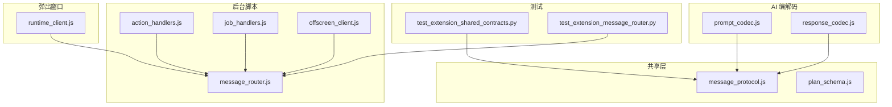
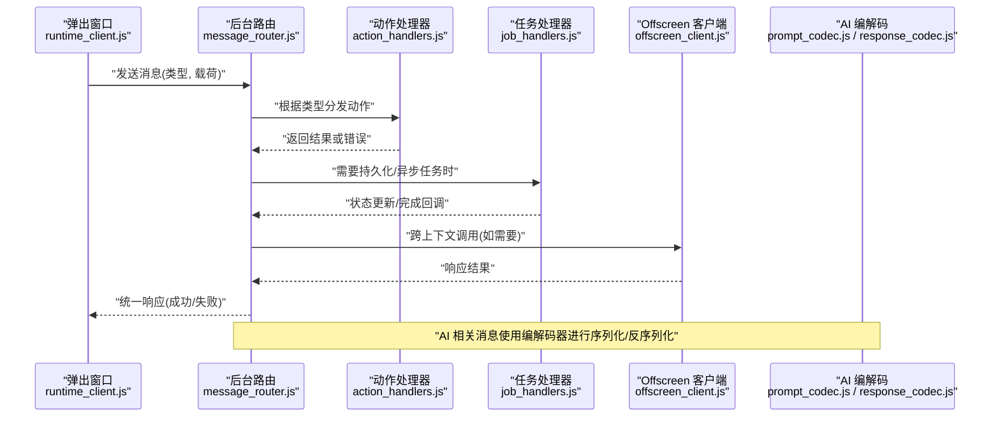
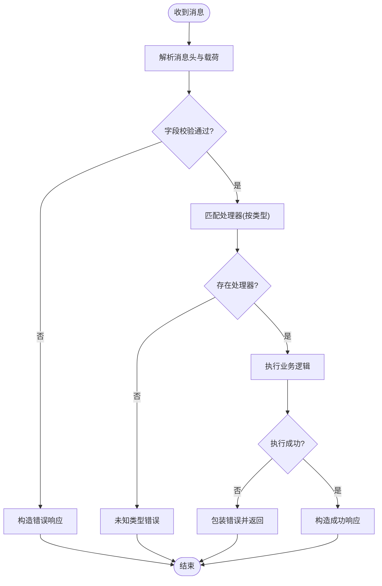
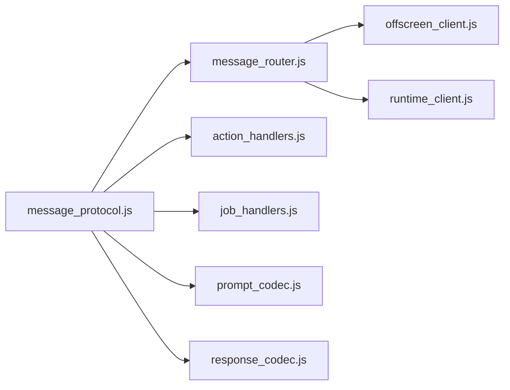

# 消息协议设计

<cite>
**本文引用的文件**   
- [message_protocol.js](file://extension/shared/message_protocol.js)
- [message_router.js](file://extension/background/message_router.js)
- [offscreen_client.js](file://extension/background/offscreen_client.js)
- [runtime_client.js](file://extension/popup/runtime_client.js)
- [action_handlers.js](file://extension/background/action_handlers.js)
- [job_handlers.js](file://extension/background/job_handlers.js)
- [plan_schema.js](file://extension/shared/plan_schema.js)
- [prompt_codec.js](file://extension/ai/prompt_codec.js)
- [response_codec.js](file://extension/ai/response_codec.js)
- [test_extension_shared_contracts.py](file://tests/test_extension_shared_contracts.py)
- [test_extension_message_router.py](file://tests/test_extension_message_router.py)
</cite>

## 目录
1. [简介](#简介)
2. [项目结构](#项目结构)
3. [核心组件](#核心组件)
4. [架构总览](#架构总览)
5. [详细组件分析](#详细组件分析)
6. [依赖关系分析](#依赖关系分析)
7. [性能考虑](#性能考虑)
8. [故障排查指南](#故障排查指南)
9. [结论](#结论)
10. [附录](#附录)

## 简介
本文件面向扩展内部的消息通信协议，覆盖消息格式规范、类型与字段定义、数据验证规则、版本管理与向后兼容策略、序列化/反序列化实现（含数据类型映射与编码格式）、完整消息类型参考、以及扩展机制与自定义消息开发指南。目标读者包括前端扩展开发者、插件作者与维护者。

## 项目结构
消息协议相关代码主要分布在以下位置：
- 共享层：消息协议定义、计划模式等
- 后台脚本：消息路由、动作处理、任务处理、Offscreen 客户端
- 弹出窗口：运行时客户端
- AI 编解码：提示词与响应编解码器
- 测试：契约与路由行为校验

图表来源
- [message_protocol.js](file://extension/shared/message_protocol.js)
- [message_router.js](file://extension/background/message_router.js)
- [offscreen_client.js](file://extension/background/offscreen_client.js)
- [runtime_client.js](file://extension/popup/runtime_client.js)
- [action_handlers.js](file://extension/background/action_handlers.js)
- [job_handlers.js](file://extension/background/job_handlers.js)
- [plan_schema.js](file://extension/shared/plan_schema.js)
- [prompt_codec.js](file://extension/ai/prompt_codec.js)
- [response_codec.js](file://extension/ai/response_codec.js)
- [test_extension_shared_contracts.py](file://tests/test_extension_shared_contracts.py)
- [test_extension_message_router.py](file://tests/test_extension_message_router.py)

章节来源
- [message_protocol.js](file://extension/shared/message_protocol.js)
- [message_router.js](file://extension/background/message_router.js)
- [offscreen_client.js](file://extension/background/offscreen_client.js)
- [runtime_client.js](file://extension/popup/runtime_client.js)
- [action_handlers.js](file://extension/background/action_handlers.js)
- [job_handlers.js](file://extension/background/job_handlers.js)
- [plan_schema.js](file://extension/shared/plan_schema.js)
- [prompt_codec.js](file://extension/ai/prompt_codec.js)
- [response_codec.js](file://extension/ai/response_codec.js)
- [test_extension_shared_contracts.py](file://tests/test_extension_shared_contracts.py)
- [test_extension_message_router.py](file://tests/test_extension_message_router.py)

## 核心组件
- 消息协议定义：集中声明消息类型常量、字段约束、版本信息、默认值与校验规则，供各模块统一引用。
- 消息路由：负责在 Service Worker、Offscreen 文档、Popup 之间转发消息，维护通道与生命周期。
- Offscreen 客户端：封装对 Offscreen 页面的请求/响应模型，提供统一的调用接口。
- 运行时客户端：为 Popup 提供与后台逻辑交互的 API。
- 动作与任务处理器：将业务动作与任务编排接入消息协议，按类型分发执行。
- AI 编解码器：将提示词与响应对象序列化为协议可承载的数据结构，并做必要转换。
- 计划模式：描述计划数据结构与约束，作为消息体的一部分参与传输与校验。

章节来源
- [message_protocol.js](file://extension/shared/message_protocol.js)
- [message_router.js](file://extension/background/message_router.js)
- [offscreen_client.js](file://extension/background/offscreen_client.js)
- [runtime_client.js](file://extension/popup/runtime_client.js)
- [action_handlers.js](file://extension/background/action_handlers.js)
- [job_handlers.js](file://extension/background/job_handlers.js)
- [plan_schema.js](file://extension/shared/plan_schema.js)
- [prompt_codec.js](file://extension/ai/prompt_codec.js)
- [response_codec.js](file://extension/ai/response_codec.js)

## 架构总览
下图展示了消息在扩展内外的流转路径与关键参与者。

图表来源
- [runtime_client.js](file://extension/popup/runtime_client.js)
- [message_router.js](file://extension/background/message_router.js)
- [action_handlers.js](file://extension/background/action_handlers.js)
- [job_handlers.js](file://extension/background/job_handlers.js)
- [offscreen_client.js](file://extension/background/offscreen_client.js)
- [prompt_codec.js](file://extension/ai/prompt_codec.js)
- [response_codec.js](file://extension/ai/response_codec.js)

## 详细组件分析

### 消息协议定义与字段规范
- 消息类型：通过集中常量管理，避免硬编码字符串导致的拼写不一致。
- 字段结构：每条消息包含标准头部（如类型、版本、时间戳、追踪ID）与业务载荷；载荷由具体消息类型决定。
- 数据验证：在接收端对必填字段、类型、取值范围进行校验，不合法则拒绝并返回结构化错误。
- 版本管理：消息头携带协议版本号；路由层根据版本选择解析器或降级策略，确保向后兼容。
- 默认值与可选字段：对可选字段提供默认值，降低旧版本与新版本的差异影响。

章节来源
- [message_protocol.js](file://extension/shared/message_protocol.js)
- [message_router.js](file://extension/background/message_router.js)

### 消息路由与分发
- 路由职责：解析消息头、匹配处理器、转发到对应动作或任务处理器、聚合结果并回传。
- 生命周期：维护不同上下文间的连接（Service Worker、Offscreen、Popup），处理重连与超时。
- 错误传播：将底层异常包装为统一错误码与消息，便于上层处理与日志记录。

图表来源
- [message_router.js](file://extension/background/message_router.js)
- [action_handlers.js](file://extension/background/action_handlers.js)
- [job_handlers.js](file://extension/background/job_handlers.js)

章节来源
- [message_router.js](file://extension/background/message_router.js)
- [action_handlers.js](file://extension/background/action_handlers.js)
- [job_handlers.js](file://extension/background/job_handlers.js)

### Offscreen 客户端与跨上下文通信
- 封装调用：提供统一的请求/响应方法，屏蔽底层通道细节。
- 重试与超时：对网络不稳定或页面重建场景提供重试与超时控制。
- 错误归一化：将跨上下文异常转换为协议错误结构。

章节来源
- [offscreen_client.js](file://extension/background/offscreen_client.js)
- [message_router.js](file://extension/background/message_router.js)

### 运行时客户端（Popup）
- 对外暴露：为 UI 提供简洁的 API，隐藏消息协议细节。
- 参数校验：在发送前对入参进行基础校验，减少无效请求。
- 结果映射：将协议响应映射为领域对象，便于 UI 消费。

章节来源
- [runtime_client.js](file://extension/popup/runtime_client.js)
- [message_protocol.js](file://extension/shared/message_protocol.js)

### AI 编解码器（提示词与响应）
- 提示词编解码：将自然语言提示词与结构化元数据组合为协议载荷，并进行必要的转义与压缩。
- 响应编解码：将外部模型响应转换为内部统一结构，提取关键信息并填充标准字段。
- 兼容性：当上游模型输出变更时，通过编解码器适配，保持协议稳定。

章节来源
- [prompt_codec.js](file://extension/ai/prompt_codec.js)
- [response_codec.js](file://extension/ai/response_codec.js)
- [message_protocol.js](file://extension/shared/message_protocol.js)

### 计划模式与数据模型
- 计划结构：定义计划实体、步骤、依赖、状态机等核心字段与约束。
- 校验规则：在创建与更新时进行完整性与一致性检查。
- 序列化：计划对象通过协议载荷传输，保证跨上下文一致。

章节来源
- [plan_schema.js](file://extension/shared/plan_schema.js)
- [message_protocol.js](file://extension/shared/message_protocol.js)

## 依赖关系分析
- 低耦合：消息协议定义位于共享层，被多模块引用，避免重复定义。
- 明确边界：路由层仅关注分发与错误包装，业务逻辑下沉至动作与任务处理器。
- 可扩展性：新增消息类型只需注册处理器与编解码器，不影响既有流程。

图表来源
- [message_protocol.js](file://extension/shared/message_protocol.js)
- [message_router.js](file://extension/background/message_router.js)
- [action_handlers.js](file://extension/background/action_handlers.js)
- [job_handlers.js](file://extension/background/job_handlers.js)
- [prompt_codec.js](file://extension/ai/prompt_codec.js)
- [response_codec.js](file://extension/ai/response_codec.js)
- [offscreen_client.js](file://extension/background/offscreen_client.js)
- [runtime_client.js](file://extension/popup/runtime_client.js)

章节来源
- [message_protocol.js](file://extension/shared/message_protocol.js)
- [message_router.js](file://extension/background/message_router.js)
- [action_handlers.js](file://extension/background/action_handlers.js)
- [job_handlers.js](file://extension/background/job_handlers.js)
- [prompt_codec.js](file://extension/ai/prompt_codec.js)
- [response_codec.js](file://extension/ai/response_codec.js)
- [offscreen_client.js](file://extension/background/offscreen_client.js)
- [runtime_client.js](file://extension/popup/runtime_client.js)

## 性能考虑
- 批量与合并：对高频小消息进行批处理，减少通道开销。
- 懒加载：按需引入处理器与编解码器，缩短启动时间。
- 缓存与去重：对幂等请求进行去重，避免重复计算。
- 超时与限流：防止慢下游拖垮整体链路。

[本节为通用指导，无需源码引用]

## 故障排查指南
- 常见错误码：未识别类型、字段缺失、类型不匹配、版本不兼容、超时、权限不足等。
- 定位步骤：
  - 检查消息头是否包含类型与版本
  - 核对载荷字段是否符合校验规则
  - 查看路由日志确认处理器是否注册
  - 对 AI 相关消息，检查编解码器输入输出
- 回归测试：使用契约测试与路由行为测试覆盖关键路径。

章节来源
- [test_extension_shared_contracts.py](file://tests/test_extension_shared_contracts.py)
- [test_extension_message_router.py](file://tests/test_extension_message_router.py)

## 结论
本协议以“集中定义、严格校验、清晰路由、可演进”为核心原则，通过版本管理与编解码器实现向后兼容与平滑升级。建议在新功能开发中遵循现有约定，优先扩展而非破坏既有契约，并通过测试保障稳定性。

[本节为总结，无需源码引用]

## 附录

### 消息类型参考（摘要）
- 通用消息头
  - 类型：标识消息类别
  - 版本：协议版本
  - 时间戳：消息生成时间
  - 追踪ID：用于链路追踪
- 典型消息族
  - 计划相关：创建、查询、更新、删除、同步
  - 任务相关：提交、状态查询、取消、重试
  - 动作相关：书签操作、规则应用、快照导出
  - AI 相关：提示词生成、响应获取、模型配置
- 字段约束
  - 必填/可选：依据消息类型定义
  - 类型：字符串、数字、布尔、数组、对象
  - 取值范围：枚举、正则、长度限制
- 示例
  - 请参见契约测试与处理器用例中的构造方式，以了解实际载荷结构与用法。

章节来源
- [message_protocol.js](file://extension/shared/message_protocol.js)
- [test_extension_shared_contracts.py](file://tests/test_extension_shared_contracts.py)

### 版本管理与向后兼容策略
- 版本协商：客户端与服务端在握手阶段交换支持的版本区间。
- 渐进式迁移：新字段标记为可选，旧字段保留默认值；路由层根据版本选择解析器。
- 废弃策略：提前公告废弃字段，提供过渡期与自动迁移工具。
- 回滚支持：在出现严重问题时，快速回退到上一稳定版本。

章节来源
- [message_protocol.js](file://extension/shared/message_protocol.js)
- [message_router.js](file://extension/background/message_router.js)

### 序列化与反序列化实现
- 数据类型映射：JS 原生类型与协议字段的映射关系在协议定义中集中管理。
- 编码格式：JSON 为主，必要时对大文本进行压缩或分片。
- 编解码器：针对复杂对象（如计划、AI 响应）提供专用编解码器，确保跨上下文一致。
- 校验时机：在反序列化后立即进行字段校验，尽早失败。

章节来源
- [message_protocol.js](file://extension/shared/message_protocol.js)
- [prompt_codec.js](file://extension/ai/prompt_codec.js)
- [response_codec.js](file://extension/ai/response_codec.js)
- [plan_schema.js](file://extension/shared/plan_schema.js)

### 扩展机制与自定义消息开发指南
- 新增消息类型
  - 在协议定义中注册类型常量与字段约束
  - 在路由层注册处理器函数
  - 如需复杂载荷，编写编解码器
- 兼容性要求
  - 新增字段必须可选并提供默认值
  - 禁止修改已有字段语义
  - 更新版本区间并补充契约测试
- 最佳实践
  - 使用追踪ID贯穿调用链
  - 对幂等操作进行去重
  - 对敏感字段进行脱敏与最小化传输

章节来源
- [message_protocol.js](file://extension/shared/message_protocol.js)
- [message_router.js](file://extension/background/message_router.js)
- [prompt_codec.js](file://extension/ai/prompt_codec.js)
- [response_codec.js](file://extension/ai/response_codec.js)
- [test_extension_shared_contracts.py](file://tests/test_extension_shared_contracts.py)