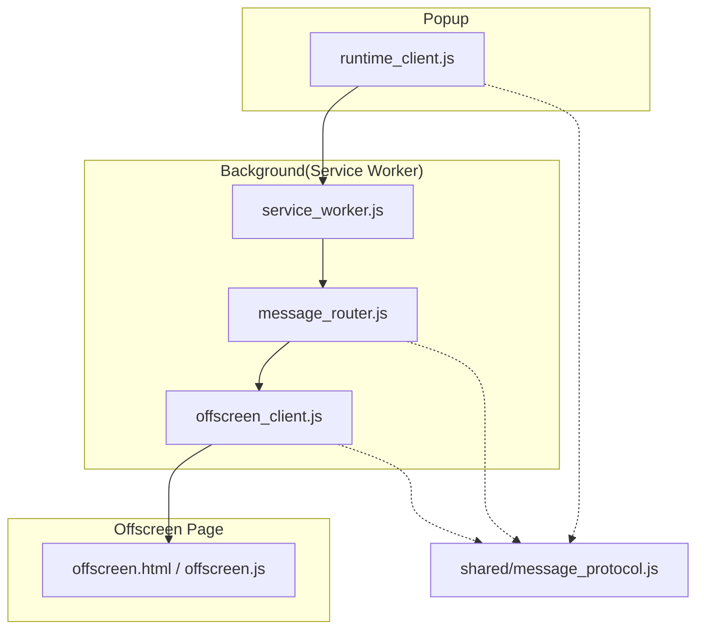
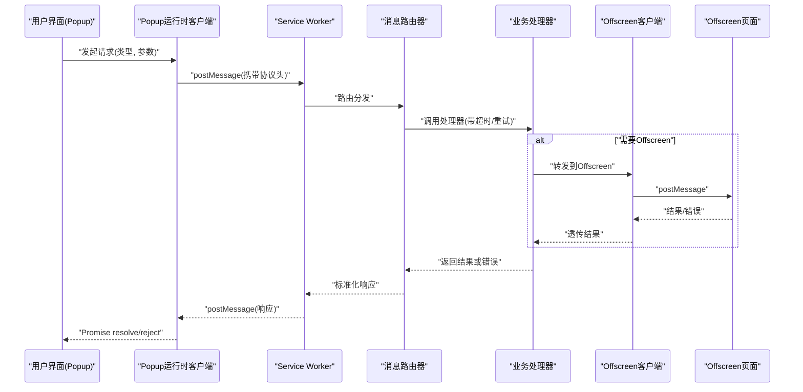
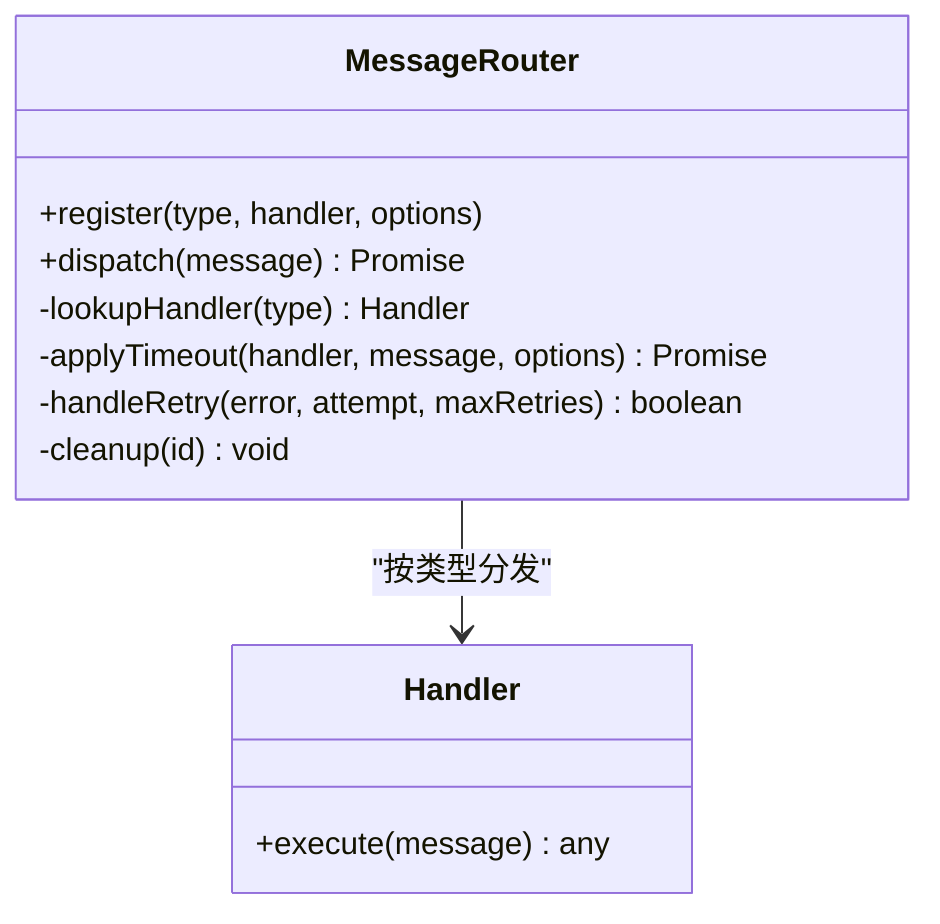
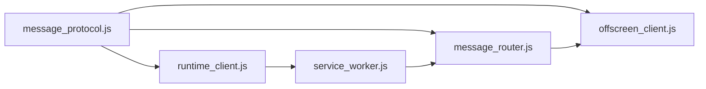

# 消息路由系统

<cite>
**本文引用的文件**   
- [extension/background/message_router.js](file://extension/background/message_router.js)
- [extension/shared/message_protocol.js](file://extension/shared/message_protocol.js)
- [extension/popup/runtime_client.js](file://extension/popup/runtime_client.js)
- [extension/background/offscreen_client.js](file://extension/background/offscreen_client.js)
- [extension/service_worker.js](file://extension/service_worker.js)
- [extension/manifest.json](file://extension/manifest.json)
- [tests/test_extension_message_router.js](file://tests/test_extension_message_router.js)
</cite>

## 目录
1. [简介](#简介)
2. [项目结构](#项目结构)
3. [核心组件](#核心组件)
4. [架构总览](#架构总览)
5. [详细组件分析](#详细组件分析)
6. [依赖关系分析](#依赖关系分析)
7. [性能考虑](#性能考虑)
8. [故障排查指南](#故障排查指南)
9. [结论](#结论)
10. [附录：API 参考与使用示例](#附录api-参考与使用示例)

## 简介
本指南面向扩展开发者，系统化阐述 Edge 书签管理扩展中的“消息路由系统”。内容覆盖：
- 消息协议设计原理与数据格式规范（类型定义、参数校验、响应格式）
- 消息路由器实现架构（监听器注册、路由分发、错误处理）
- 异步消息处理与超时管理（重试逻辑、故障恢复）
- 跨上下文通信（Popup → Background、Background → Offscreen）
- 调试工具与性能监控方法
- 完整 API 参考与使用示例

## 项目结构
消息路由相关代码主要分布在以下模块：
- 共享协议层：定义消息类型、字段约束与序列化/反序列化规则
- 背景服务层：提供消息路由器、监听器注册、分发与超时控制
- Popup 客户端：封装对 Background 的调用
- Offscreen 客户端：封装 Background 到 Offscreen 页面的通信
- Service Worker：初始化并挂载路由入口
- Manifest：声明 Offscreen 页面及权限

图表来源
- [extension/background/message_router.js](file://extension/background/message_router.js)
- [extension/shared/message_protocol.js](file://extension/shared/message_protocol.js)
- [extension/popup/runtime_client.js](file://extension/popup/runtime_client.js)
- [extension/background/offscreen_client.js](file://extension/background/offscreen_client.js)
- [extension/service_worker.js](file://extension/service_worker.js)

章节来源
- [extension/background/message_router.js](file://extension/background/message_router.js)
- [extension/shared/message_protocol.js](file://extension/shared/message_protocol.js)
- [extension/popup/runtime_client.js](file://extension/popup/runtime_client.js)
- [extension/background/offscreen_client.js](file://extension/background/offscreen_client.js)
- [extension/service_worker.js](file://extension/service_worker.js)
- [extension/manifest.json](file://extension/manifest.json)

## 核心组件
- 消息协议（shared/message_protocol.js）
  - 定义消息类型常量、请求/响应结构、字段校验规则
  - 提供序列化工具与错误码约定
- 消息路由器（background/message_router.js）
  - 监听器注册表、按类型分发、超时与重试策略、错误包装与上报
- Popup 运行时客户端（popup/runtime_client.js）
  - 向 Background 发送请求、等待响应、处理超时与重试
- Offscreen 客户端（background/offscreen_client.js）
  - 在 Background 中创建/复用 Offscreen 页面通道，转发消息
- Service Worker（service_worker.js）
  - 启动时注册全局消息入口，挂载路由器
- Manifest（manifest.json）
  - 声明 Offscreen 页面、权限与能力

章节来源
- [extension/shared/message_protocol.js](file://extension/shared/message_protocol.js)
- [extension/background/message_router.js](file://extension/background/message_router.js)
- [extension/popup/runtime_client.js](file://extension/popup/runtime_client.js)
- [extension/background/offscreen_client.js](file://extension/background/offscreen_client.js)
- [extension/service_worker.js](file://extension/service_worker.js)
- [extension/manifest.json](file://extension/manifest.json)

## 架构总览
整体采用“协议先行 + 路由器中心”的分层架构。Popup 通过运行时 API 向 Background 发消息；Background 的消息路由器根据消息类型分发给具体处理器；需要 UI 隔离或长任务时，Background 通过 Offscreen 客户端将消息转发至 Offscreen 页面执行，结果回传。

图表来源
- [extension/popup/runtime_client.js](file://extension/popup/runtime_client.js)
- [extension/service_worker.js](file://extension/service_worker.js)
- [extension/background/message_router.js](file://extension/background/message_router.js)
- [extension/background/offscreen_client.js](file://extension/background/offscreen_client.js)

## 详细组件分析

### 消息协议（shared/message_protocol.js）
- 设计原则
  - 强类型：所有消息类型以常量集中管理，避免硬编码字符串
  - 结构化载荷：请求包含 type、id、timestamp、payload；响应包含 id、status、data/error
  - 可演进：预留扩展字段，向后兼容
- 关键职责
  - 类型枚举与版本信息
  - 请求/响应模式定义
  - 字段校验与错误码映射
  - 序列化/反序列化辅助函数
- 复杂度与性能
  - 校验为 O(n) 线性于字段数量，建议保持 payload 精简
  - 使用轻量对象字面量，避免深层嵌套
- 错误处理
  - 统一错误码与消息体，便于上层聚合统计与告警

章节来源
- [extension/shared/message_protocol.js](file://extension/shared/message_protocol.js)

### 消息路由器（background/message_router.js）
- 架构要点
  - 监听器注册：按消息类型绑定处理器，支持优先级与命名空间
  - 路由分发：O(1) 哈希查找，失败时走默认处理器
  - 超时控制：每个处理器可配置超时阈值，未响应则返回超时错误
  - 重试策略：指数退避与最大重试次数，区分可重试错误
  - 错误处理：包装业务异常为协议错误，记录上下文与追踪 ID
- 数据结构
  - 监听器表：type -> handler
  - 运行期状态：活跃请求表（id -> {timeoutId, retries}）
- 性能特性
  - 路由查找常数时间
  - 超时清理基于定时器，注意内存泄漏防护
- 可扩展性
  - 插件式处理器注册
  - 中间件式拦截（鉴权、限流、审计）

图表来源
- [extension/background/message_router.js](file://extension/background/message_router.js)

章节来源
- [extension/background/message_router.js](file://extension/background/message_router.js)

### Popup 运行时客户端（popup/runtime_client.js）
- 职责
  - 构造符合协议的请求对象
  - 通过 runtime API 发送至 Background
  - 维护本地超时与重试
  - 解析响应并转换为 Promise
- 关键流程
  - 生成唯一请求 ID
  - 设置超时计时器
  - 收到响应后清理资源并 resolve
  - 超时或网络错误触发重试或拒绝
- 错误语义
  - 超时错误、协议错误、未知错误分类返回

章节来源
- [extension/popup/runtime_client.js](file://extension/popup/runtime_client.js)

### Offscreen 客户端（background/offscreen_client.js）
- 职责
  - 在 Background 侧创建/复用 Offscreen 页面
  - 建立持久化通道，转发消息
  - 处理页面不可用时的重建与重连
- 关键点
  - 生命周期管理：按需创建、空闲回收
  - 错误恢复：连接断开自动重连
  - 背压与队列：防止突发流量导致页面崩溃

章节来源
- [extension/background/offscreen_client.js](file://extension/background/offscreen_client.js)

### Service Worker 入口（service_worker.js）
- 职责
  - 初始化消息路由器
  - 注册全局消息入口，将 runtime 事件委派给路由器
  - 暴露健康检查与调试接口
- 注意事项
  - 单例路由器实例，避免重复注册
  - 优雅关闭时清理定时器与监听器

章节来源
- [extension/service_worker.js](file://extension/service_worker.js)

### Manifest 与 Offscreen 声明（manifest.json）
- 作用
  - 声明 Offscreen 页面用途与权限
  - 确保 Background 可访问所需 API
- 关注点
  - 最小权限原则
  - 按需加载 Offscreen 页面

章节来源
- [extension/manifest.json](file://extension/manifest.json)

## 依赖关系分析
- 内聚与耦合
  - 协议层独立，被各端引用，低耦合高内聚
  - 路由器仅依赖协议与处理器抽象，易于替换实现
- 外部依赖
  - Chrome/Edge runtime API
  - Offscreen 文档 API
- 潜在循环依赖
  - 避免在协议层引入路由器或客户端实现

图表来源
- [extension/shared/message_protocol.js](file://extension/shared/message_protocol.js)
- [extension/background/message_router.js](file://extension/background/message_router.js)
- [extension/popup/runtime_client.js](file://extension/popup/runtime_client.js)
- [extension/background/offscreen_client.js](file://extension/background/offscreen_client.js)
- [extension/service_worker.js](file://extension/service_worker.js)

章节来源
- [extension/shared/message_protocol.js](file://extension/shared/message_protocol.js)
- [extension/background/message_router.js](file://extension/background/message_router.js)
- [extension/popup/runtime_client.js](file://extension/popup/runtime_client.js)
- [extension/background/offscreen_client.js](file://extension/background/offscreen_client.js)
- [extension/service_worker.js](file://extension/service_worker.js)

## 性能考虑
- 路由查找
  - 使用哈希表进行 O(1) 类型分发，避免线性扫描
- 超时与重试
  - 合理设置超时阈值与最大重试次数，避免雪崩
  - 指数退避降低瞬时压力
- Offscreen 页面
  - 复用页面实例，减少创建销毁开销
  - 批量处理与节流，避免频繁 postMessage
- 内存管理
  - 及时清理定时器与监听器
  - 限制活跃请求上限，防止内存膨胀

[本节为通用指导，不直接分析具体文件]

## 故障排查指南
- 常见问题
  - 消息未到达：检查 Service Worker 是否已注册全局入口
  - 路由未命中：确认消息类型与注册名一致
  - 超时频繁：评估处理器耗时与超时阈值
  - Offscreen 不可用：检查 manifest 声明与页面可用性
- 定位手段
  - 启用调试日志，输出请求 ID、类型、耗时
  - 使用测试用例复现问题路径
- 恢复策略
  - 自动重试与降级
  - 断线重连与页面重建

章节来源
- [tests/test_extension_message_router.js](file://tests/test_extension_message_router.js)

## 结论
该消息路由系统以协议为中心、路由器为核心，结合 Popup/Background/Offscreen 的多上下文协作，实现了可扩展、可观测、可恢复的跨进程通信机制。通过严格的类型与校验、完善的超时重试与错误包装，系统在复杂场景下仍保持稳定与高性能。

[本节为总结性内容，不直接分析具体文件]

## 附录：API 参考与使用示例

### 协议层 API
- 类型与常量
  - 消息类型枚举：用于标识不同业务操作
  - 版本与兼容性字段：用于向前/向后兼容
- 请求/响应结构
  - 请求：type、id、timestamp、payload
  - 响应：id、status、data 或 error
- 校验与序列化
  - 字段必填与类型约束
  - 安全转义与非法值过滤

章节来源
- [extension/shared/message_protocol.js](file://extension/shared/message_protocol.js)

### 路由器 API
- register(type, handler, options)
  - 功能：注册指定类型的处理器
  - 选项：超时、重试、命名空间等
- dispatch(message)
  - 功能：根据类型分发到对应处理器
  - 返回：Promise，成功返回 data，失败抛出协议错误
- 内部方法
  - lookupHandler：按类型查找处理器
  - applyTimeout：应用超时控制
  - handleRetry：判断是否可重试并计算退避
  - cleanup：清理活跃请求资源

章节来源
- [extension/background/message_router.js](file://extension/background/message_router.js)

### Popup 客户端 API
- request(type, payload, options)
  - 功能：向 Background 发送请求并等待响应
  - 选项：超时、重试次数
  - 返回：Promise，resolve 为 data，reject 为错误对象
- 错误处理
  - 超时错误、协议错误、未知错误分类

章节来源
- [extension/popup/runtime_client.js](file://extension/popup/runtime_client.js)

### Offscreen 客户端 API
- createChannel()
  - 功能：创建或复用 Offscreen 页面通道
- send(type, payload)
  - 功能：通过 Offscreen 通道发送消息
- reconnect()
  - 功能：在连接断开时重建通道

章节来源
- [extension/background/offscreen_client.js](file://extension/background/offscreen_client.js)

### Service Worker 集成
- 初始化路由器
  - 在入口文件中创建路由器实例
- 注册全局入口
  - 监听 runtime 事件并委派给路由器
- 健康检查
  - 暴露调试接口，便于外部探测

章节来源
- [extension/service_worker.js](file://extension/service_worker.js)

### 使用示例（步骤说明）
- 定义协议
  - 在协议文件中新增消息类型与字段约束
- 注册处理器
  - 在路由器中注册新类型的处理器，配置超时与重试
- Popup 调用
  - 使用客户端 request 方法发送请求，处理 Promise 结果
- Offscreen 处理
  - 在需要时通过 Offscreen 客户端转发到 Offscreen 页面执行

章节来源
- [extension/shared/message_protocol.js](file://extension/shared/message_protocol.js)
- [extension/background/message_router.js](file://extension/background/message_router.js)
- [extension/popup/runtime_client.js](file://extension/popup/runtime_client.js)
- [extension/background/offscreen_client.js](file://extension/background/offscreen_client.js)