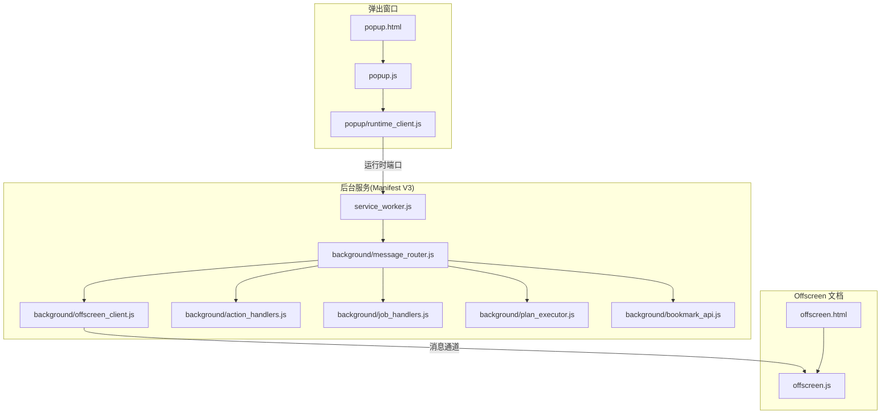
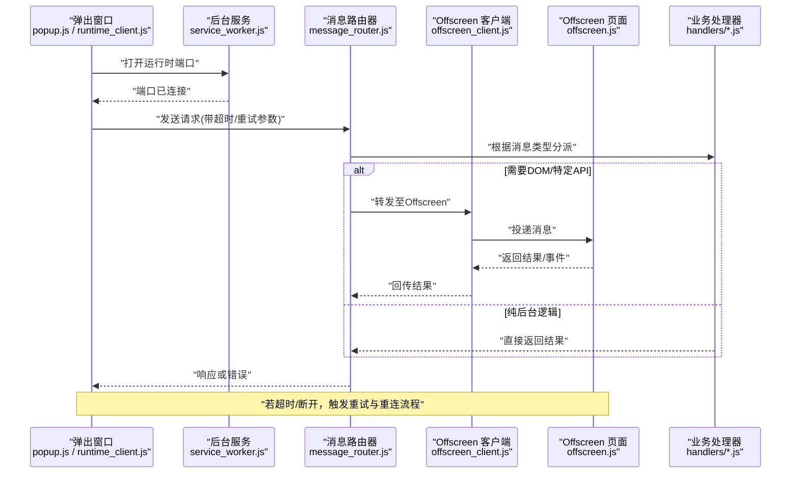
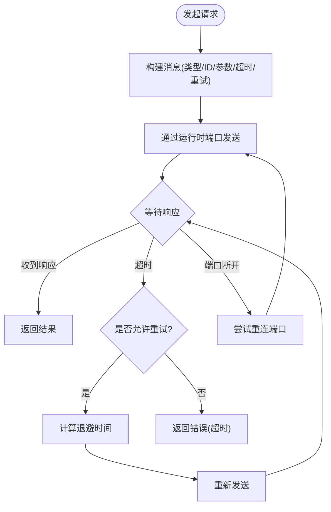
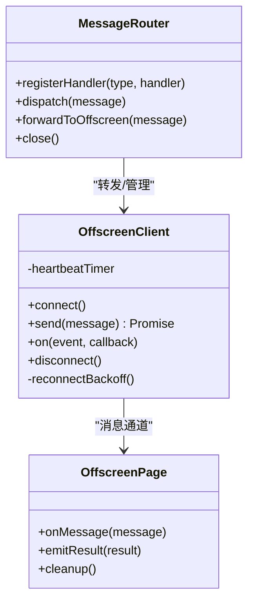
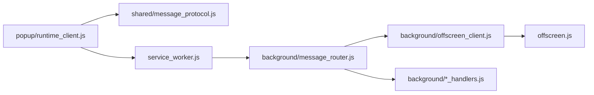

# 跨上下文通信

<cite>
**本文引用的文件**   
- [manifest.json](file://extension/manifest.json)
- [service_worker.js](file://extension/service_worker.js)
- [offscreen.html](file://extension/offscreen.html)
- [offscreen.js](file://extension/offscreen.js)
- [popup.html](file://extension/popup.html)
- [popup.js](file://extension/popup.js)
- [runtime_client.js](file://extension/popup/runtime_client.js)
- [message_router.js](file://extension/background/message_router.js)
- [offscreen_client.js](file://extension/background/offscreen_client.js)
- [action_handlers.js](file://extension/background/action_handlers.js)
- [job_handlers.js](file://extension/background/job_handlers.js)
- [plan_executor.js](file://extension/background/plan_executor.js)
- [bookmark_api.js](file://extension/background/bookmark_api.js)
- [message_protocol.js](file://extension/shared/message_protocol.js)
</cite>

## 目录
1. [简介](#简介)
2. [项目结构](#项目结构)
3. [核心组件](#核心组件)
4. [架构总览](#架构总览)
5. [详细组件分析](#详细组件分析)
6. [依赖关系分析](#依赖关系分析)
7. [性能考虑](#性能考虑)
8. [故障排查指南](#故障排查指南)
9. [结论](#结论)
10. [附录](#附录)

## 简介
本指南聚焦于浏览器扩展中不同执行上下文之间的跨上下文通信实现，覆盖以下关键主题：
- Popup 页面到 Background Service Worker 的消息传递
- Background 到 Offscreen 页面的消息传递
- 连接建立与维护（含状态监控与自动重连）
- 传输可靠性（超时、重试、失败恢复）
- 安全与权限控制
- 完整通信模式示例与最佳实践

该扩展采用 Manifest V3 的 Service Worker 作为后台进程，并通过 Offscreen Document 承载需要 DOM 或特定 API 的工作负载。Popup 通过运行时端口与 Service Worker 交互，Service Worker 再与 Offscreen 页面进行消息路由。

## 项目结构
从跨上下文通信视角，关键文件分布如下：
- 入口与清单：manifest.json、service_worker.js、offscreen.html、offscreen.js、popup.html、popup.js
- 通信客户端与服务端：popup/runtime_client.js、background/message_router.js、background/offscreen_client.js
- 业务处理器：background/action_handlers.js、background/job_handlers.js、background/plan_executor.js、background/bookmark_api.js
- 协议定义：shared/message_protocol.js

图表来源
- [manifest.json:1-200](file://extension/manifest.json#L1-L200)
- [service_worker.js:1-200](file://extension/service_worker.js#L1-L200)
- [offscreen.html:1-200](file://extension/offscreen.html#L1-L200)
- [offscreen.js:1-200](file://extension/offscreen.js#L1-L200)
- [popup.html:1-200](file://extension/popup.html#L1-L200)
- [popup.js:1-200](file://extension/popup.js#L1-L200)
- [runtime_client.js:1-200](file://extension/popup/runtime_client.js#L1-L200)
- [message_router.js:1-200](file://extension/background/message_router.js#L1-L200)
- [offscreen_client.js:1-200](file://extension/background/offscreen_client.js#L1-L200)
- [action_handlers.js:1-200](file://extension/background/action_handlers.js#L1-L200)
- [job_handlers.js:1-200](file://extension/background/job_handlers.js#L1-L200)
- [plan_executor.js:1-200](file://extension/background/plan_executor.js#L1-L200)
- [bookmark_api.js:1-200](file://extension/background/bookmark_api.js#L1-L200)
- [message_protocol.js:1-200](file://extension/shared/message_protocol.js#L1-200)

章节来源
- [manifest.json:1-200](file://extension/manifest.json#L1-L200)
- [service_worker.js:1-200](file://extension/service_worker.js#L1-L200)
- [offscreen.html:1-200](file://extension/offscreen.html#L1-L200)
- [offscreen.js:1-200](file://extension/offscreen.js#L1-L200)
- [popup.html:1-200](file://extension/popup.html#L1-L200)
- [popup.js:1-200](file://extension/popup.js#L1-L200)
- [runtime_client.js:1-200](file://extension/popup/runtime_client.js#L1-L200)
- [message_router.js:1-200](file://extension/background/message_router.js#L1-L200)
- [offscreen_client.js:1-200](file://extension/background/offscreen_client.js#L1-L200)
- [action_handlers.js:1-200](file://extension/background/action_handlers.js#L1-L200)
- [job_handlers.js:1-200](file://extension/background/job_handlers.js#L1-L200)
- [plan_executor.js:1-200](file://extension/background/plan_executor.js#L1-L200)
- [bookmark_api.js:1-200](file://extension/background/bookmark_api.js#L1-L200)
- [message_protocol.js:1-200](file://extension/shared/message_protocol.js#L1-200)

## 核心组件
- 运行时客户端（Popup 侧）
  - 负责与 Service Worker 建立并维护运行时端口，封装发送请求、处理响应与错误、超时与重试等逻辑。
  - 典型职责：端口生命周期管理、消息序列化/反序列化、去抖与节流、幂等键生成。
- 消息路由器（Background 侧）
  - 接收来自 Popup 的请求，按消息类型路由到具体处理器；同时负责与 Offscreen 的连接管理与转发。
  - 典型职责：注册处理器、分发消息、连接池管理、错误聚合与上报。
- Offscreen 客户端（Background 侧）
  - 管理到 Offscreen 页面的连接，提供统一的 send/receive 接口，封装断线检测与自动重连。
  - 典型职责：创建/销毁 Offscreen 文档、心跳保活、重连退避、队列缓冲。
- 业务处理器
  - action_handlers.js、job_handlers.js、plan_executor.js、bookmark_api.js 分别处理动作、任务、计划执行与书签操作。
- 协议定义
  - message_protocol.js 统一消息格式、字段约束、版本兼容策略与校验规则。

章节来源
- [runtime_client.js:1-200](file://extension/popup/runtime_client.js#L1-L200)
- [message_router.js:1-200](file://extension/background/message_router.js#L1-L200)
- [offscreen_client.js:1-200](file://extension/background/offscreen_client.js#L1-L200)
- [action_handlers.js:1-200](file://extension/background/action_handlers.js#L1-L200)
- [job_handlers.js:1-200](file://extension/background/job_handlers.js#L1-L200)
- [plan_executor.js:1-200](file://extension/background/plan_executor.js#L1-L200)
- [bookmark_api.js:1-200](file://extension/background/bookmark_api.js#L1-L200)
- [message_protocol.js:1-200](file://extension/shared/message_protocol.js#L1-200)

## 架构总览
下图展示了从 Popup 到 Background 再到 Offscreen 的端到端调用链，以及错误与超时的回流路径。

图表来源
- [service_worker.js:1-200](file://extension/service_worker.js#L1-L200)
- [message_router.js:1-200](file://extension/background/message_router.js#L1-L200)
- [offscreen_client.js:1-200](file://extension/background/offscreen_client.js#L1-L200)
- [offscreen.js:1-200](file://extension/offscreen.js#L1-L200)
- [runtime_client.js:1-200](file://extension/popup/runtime_client.js#L1-L200)
- [action_handlers.js:1-200](file://extension/background/action_handlers.js#L1-L200)
- [job_handlers.js:1-200](file://extension/background/job_handlers.js#L1-L200)
- [plan_executor.js:1-200](file://extension/background/plan_executor.js#L1-L200)
- [bookmark_api.js:1-200](file://extension/background/bookmark_api.js#L1-L200)

## 详细组件分析

### Popup 到 Background 的运行时端口通信
- 连接建立
  - Popup 在初始化时打开到 Service Worker 的运行时端口，监听连接成功与关闭事件。
  - Service Worker 侧维护端口集合，确保多实例隔离与资源回收。
- 请求-响应模型
  - 每个请求携带唯一 ID、消息类型、版本号与可选的重试/超时配置。
  - 响应包含数据或错误对象，支持分页与流式事件回调。
- 超时与重试
  - 客户端为每次请求设置超时计时器；超时后按指数退避策略重试，最多 N 次。
  - 幂等键用于避免重复提交导致副作用。
- 错误处理
  - 网络层错误、协议校验错误、业务错误分层处理，统一转换为标准错误码。
  - 对不可恢复错误立即失败，可恢复错误走重试。

图表来源
- [runtime_client.js:1-200](file://extension/popup/runtime_client.js#L1-L200)
- [service_worker.js:1-200](file://extension/service_worker.js#L1-L200)
- [message_protocol.js:1-200](file://extension/shared/message_protocol.js#L1-200)

章节来源
- [runtime_client.js:1-200](file://extension/popup/runtime_client.js#L1-L200)
- [service_worker.js:1-200](file://extension/service_worker.js#L1-L200)
- [message_protocol.js:1-200](file://extension/shared/message_protocol.js#L1-200)

### Background 到 Offscreen 的消息传递
- 连接管理
  - Service Worker 按需创建 Offscreen 文档，建立单向/双向消息通道。
  - 使用心跳机制维持长连接，检测远端存活。
- 路由与转发
  - 消息路由器将需要 DOM/渲染的任务转发给 Offscreen 客户端，后者投递到 Offscreen 页面。
  - Offscreen 页面完成后回传结果，路由器再转发给调用方。
- 断线与重连
  - 检测到连接丢失时，记录原因并启动重连；采用指数退避与最大重试上限。
  - 重连期间缓冲消息，待连接恢复后批量投递，保证顺序性。
- 资源释放
  - 空闲超时后主动关闭 Offscreen 文档，释放内存与 CPU。

图表来源
- [message_router.js:1-200](file://extension/background/message_router.js#L1-L200)
- [offscreen_client.js:1-200](file://extension/background/offscreen_client.js#L1-L200)
- [offscreen.js:1-200](file://extension/offscreen.js#L1-L200)

章节来源
- [message_router.js:1-200](file://extension/background/message_router.js#L1-L200)
- [offscreen_client.js:1-200](file://extension/background/offscreen_client.js#L1-L200)
- [offscreen.js:1-200](file://extension/offscreen.js#L1-L200)

### 消息协议与校验
- 消息结构
  - 统一字段：id、type、version、payload、timestamp、traceId。
  - 响应结构：data、error、meta（分页、耗时、缓存命中）。
- 版本兼容
  - 客户端与服务端均声明最小/最大兼容版本，不兼容时拒绝并提示升级。
- 校验与清洗
  - 对 payload 进行白名单校验与类型检查，防止注入与越权访问。
- 追踪与诊断
  - traceId 贯穿整条链路，便于日志关联与问题定位。

章节来源
- [message_protocol.js:1-200](file://extension/shared/message_protocol.js#L1-200)

### 业务处理器集成
- 动作处理器（action_handlers.js）
  - 处理用户触发的动作，如打开面板、切换模式等。
- 任务处理器（job_handlers.js）
  - 管理任务的创建、调度、状态更新与取消。
- 计划执行器（plan_executor.js）
  - 解析与执行复杂计划，协调多个子步骤与外部依赖。
- 书签 API（bookmark_api.js）
  - 封装书签树读取、修改与同步，必要时委托 Offscreen 完成。

章节来源
- [action_handlers.js:1-200](file://extension/background/action_handlers.js#L1-L200)
- [job_handlers.js:1-200](file://extension/background/job_handlers.js#L1-L200)
- [plan_executor.js:1-200](file://extension/background/plan_executor.js#L1-L200)
- [bookmark_api.js:1-200](file://extension/background/bookmark_api.js#L1-L200)

## 依赖关系分析
- 模块耦合
  - Popup 仅依赖运行时客户端与协议定义，保持低耦合。
  - Background 的消息路由器集中编排，降低各处理器间的直接依赖。
  - Offscreen 客户端屏蔽底层连接细节，对外暴露稳定接口。
- 外部依赖
  - 浏览器扩展 API（运行时、Offscreen、存储、书签等）。
  - 协议与工具库（序列化、校验、日志）。

图表来源
- [runtime_client.js:1-200](file://extension/popup/runtime_client.js#L1-L200)
- [message_protocol.js:1-200](file://extension/shared/message_protocol.js#L1-200)
- [service_worker.js:1-200](file://extension/service_worker.js#L1-L200)
- [message_router.js:1-200](file://extension/background/message_router.js#L1-L200)
- [offscreen_client.js:1-200](file://extension/background/offscreen_client.js#L1-L200)
- [offscreen.js:1-200](file://extension/offscreen.js#L1-L200)
- [action_handlers.js:1-200](file://extension/background/action_handlers.js#L1-L200)
- [job_handlers.js:1-200](file://extension/background/job_handlers.js#L1-L200)
- [plan_executor.js:1-200](file://extension/background/plan_executor.js#L1-L200)
- [bookmark_api.js:1-200](file://extension/background/bookmark_api.js#L1-L200)

章节来源
- [runtime_client.js:1-200](file://extension/popup/runtime_client.js#L1-L200)
- [message_protocol.js:1-200](file://extension/shared/message_protocol.js#L1-200)
- [service_worker.js:1-200](file://extension/service_worker.js#L1-L200)
- [message_router.js:1-200](file://extension/background/message_router.js#L1-L200)
- [offscreen_client.js:1-200](file://extension/background/offscreen_client.js#L1-L200)
- [offscreen.js:1-200](file://extension/offscreen.js#L1-L200)
- [action_handlers.js:1-200](file://extension/background/action_handlers.js#L1-L200)
- [job_handlers.js:1-200](file://extension/background/job_handlers.js#L1-L200)
- [plan_executor.js:1-200](file://extension/background/plan_executor.js#L1-L200)
- [bookmark_api.js:1-200](file://extension/background/bookmark_api.js#L1-L200)

## 性能考虑
- 连接复用
  - 复用运行时端口与 Offscreen 连接，减少频繁创建/销毁开销。
- 批处理与合并
  - 对高频小消息进行批处理，降低总线压力。
- 懒加载与按需创建
  - Offscreen 文档按需创建并在空闲后释放，避免常驻占用。
- 超时与退避
  - 合理设置超时阈值与重试退避，避免雪崩效应。
- 缓存与幂等
  - 对读多写少的操作引入缓存；对写操作使用幂等键避免重复执行。

[本节为通用指导，无需源码引用]

## 故障排查指南
- 常见问题
  - 端口未连接：检查 Popup 初始化时机与 Service Worker 激活状态。
  - 消息未到达：确认路由器是否正确注册处理器与消息类型。
  - Offscreen 断线：查看心跳与重连日志，确认资源释放策略。
  - 超时频繁：评估业务处理耗时与超时阈值，优化慢查询。
- 诊断手段
  - 启用 traceId 追踪全链路日志。
  - 在关键节点输出耗时与状态快照。
  - 使用浏览器开发者工具的“应用”与“控制台”观察端口与消息。

章节来源
- [message_router.js:1-200](file://extension/background/message_router.js#L1-L200)
- [offscreen_client.js:1-200](file://extension/background/offscreen_client.js#L1-L200)
- [runtime_client.js:1-200](file://extension/popup/runtime_client.js#L1-L200)

## 结论
通过统一的协议定义、健壮的路由与连接管理、完善的超时重试与错误处理，本项目实现了 Popup、Background 与 Offscreen 之间高效可靠的跨上下文通信。遵循本文的最佳实践，可在保证安全与性能的前提下，快速扩展新的消息类型与处理能力。

[本节为总结，无需源码引用]

## 附录

### 安全与权限控制
- 最小权限原则
  - 仅在 manifest.json 中声明必要的权限，限制作用域。
- 输入校验与白名单
  - 对所有入参进行严格校验，拒绝非法类型与越界值。
- 身份与来源验证
  - 校验消息来源是否为受信任上下文，防止恶意注入。
- 敏感信息保护
  - 不在日志中输出敏感数据，必要时脱敏或哈希。

章节来源
- [manifest.json:1-200](file://extension/manifest.json#L1-L200)
- [message_protocol.js:1-200](file://extension/shared/message_protocol.js#L1-200)

### 通信模式示例与最佳实践
- 请求-响应模式
  - 适用于一次性操作，如读取配置、获取书签列表。
  - 建议：设置合理超时、开启幂等键、记录 traceId。
- 事件订阅模式
  - 适用于状态变更通知，如任务进度、系统事件。
  - 建议：服务端推送、客户端去重、断线重连后拉取最新状态。
- 流式处理模式
  - 适用于大数据量或长时间任务，分片传输与进度回调。
  - 建议：背压控制、分段确认、异常中断恢复。
- 最佳实践清单
  - 明确消息契约与版本策略
  - 统一错误码与错误语义
  - 连接健康检查与优雅降级
  - 限流与熔断，防止过载
  - 完善日志与可观测性

章节来源
- [message_protocol.js:1-200](file://extension/shared/message_protocol.js#L1-200)
- [message_router.js:1-200](file://extension/background/message_router.js#L1-L200)
- [offscreen_client.js:1-200](file://extension/background/offscreen_client.js#L1-L200)
- [runtime_client.js:1-200](file://extension/popup/runtime_client.js#L1-L200)