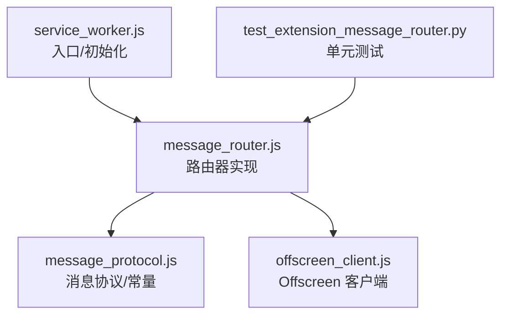
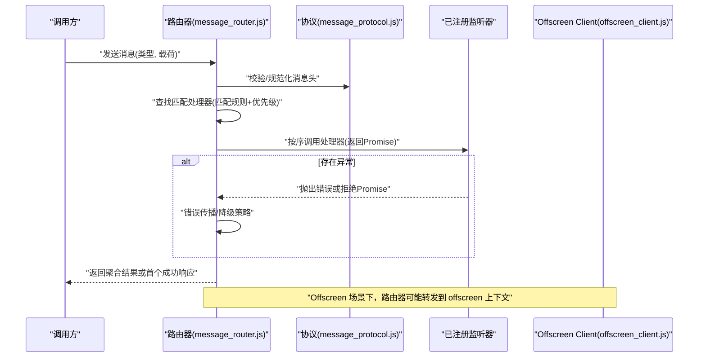
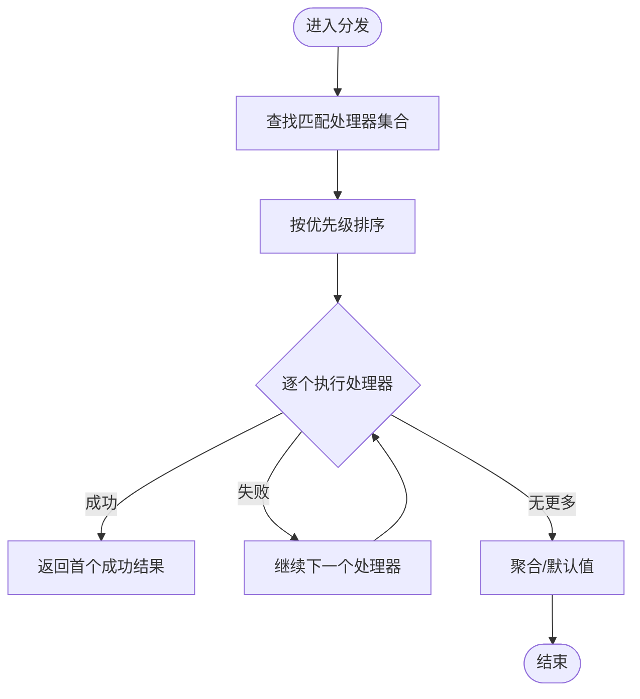
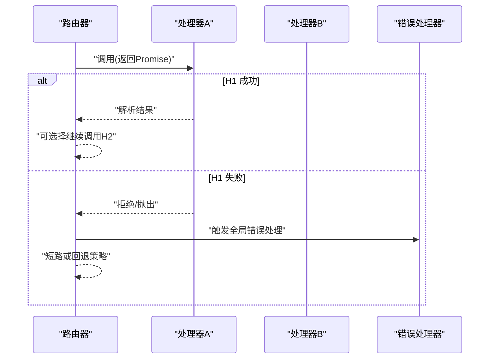
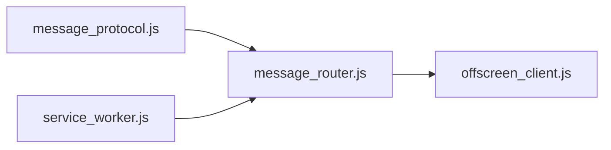

# 路由器实现

<cite>
**本文引用的文件**   
- [message_router.js](file://extension/background/message_router.js)
- [message_protocol.js](file://extension/shared/message_protocol.js)
- [service_worker.js](file://extension/service_worker.js)
- [offscreen_client.js](file://extension/background/offscreen_client.js)
- [test_extension_message_router.py](file://tests/test_extension_message_router.py)
</cite>

## 目录
1. [简介](#简介)
2. [项目结构](#项目结构)
3. [核心组件](#核心组件)
4. [架构总览](#架构总览)
5. [详细组件分析](#详细组件分析)
6. [依赖分析](#依赖分析)
7. [性能考虑](#性能考虑)
8. [故障排查指南](#故障排查指南)
9. [结论](#结论)
10. [附录：API 参考与示例](#附录api-参考与示例)

## 简介
本文件围绕消息路由器的实现，系统性阐述其核心架构、监听器注册机制、路由表管理、分发算法、消息匹配规则与优先级处理、异步消息处理模式（Promise 链式调用与错误传播）、生命周期管理与资源清理策略，以及配置选项与扩展方法。文档同时提供 API 参考与实际使用示例，帮助读者快速理解并正确使用该路由器。

## 项目结构
本项目采用按功能域组织的方式，消息路由器位于后台脚本模块中，并通过共享协议定义消息契约。服务工作者作为入口负责初始化与挂载路由实例；Offscreen Client 在需要时通过路由器进行跨上下文通信。测试用例覆盖路由器的关键路径。

图表来源
- [service_worker.js](file://extension/service_worker.js)
- [message_router.js](file://extension/background/message_router.js)
- [message_protocol.js](file://extension/shared/message_protocol.js)
- [offscreen_client.js](file://extension/background/offscreen_client.js)
- [test_extension_message_router.py](file://tests/test_extension_message_router.py)

章节来源
- [service_worker.js](file://extension/service_worker.js)
- [message_router.js](file://extension/background/message_router.js)
- [message_protocol.js](file://extension/shared/message_protocol.js)
- [offscreen_client.js](file://extension/background/offscreen_client.js)
- [test_extension_message_router.py](file://tests/test_extension_message_router.py)

## 核心组件
- 路由器实例：维护监听器集合、路由表、匹配与分发逻辑、生命周期钩子与配置项。
- 监听器注册：支持同步与异步处理器，可指定匹配条件与优先级。
- 路由表管理：以类型/命名空间为键组织处理器列表，支持动态增删改查。
- 分发算法：根据消息类型选择候选处理器，按优先级排序后依次执行，支持短路或聚合结果。
- 消息匹配规则：基于精确匹配、前缀匹配、通配符或正则等策略（由协议与实现共同约束）。
- 异步处理模式：处理器返回 Promise，路由器统一编排执行顺序与错误传播。
- 生命周期管理：启动、停止、销毁阶段的事件与资源释放。
- 配置与扩展：允许注入自定义匹配器、拦截器、日志与限流策略。

章节来源
- [message_router.js](file://extension/background/message_router.js)
- [message_protocol.js](file://extension/shared/message_protocol.js)

## 架构总览
下图展示了路由器在系统中的位置及主要交互关系。服务工作者负责创建并暴露路由器实例；业务模块通过路由器注册监听器；消息从任意上下文发出后，经路由器匹配并分发给对应处理器；Offscreen Client 通过路由器与后台能力通信。

图表来源
- [message_router.js](file://extension/background/message_router.js)
- [message_protocol.js](file://extension/shared/message_protocol.js)
- [offscreen_client.js](file://extension/background/offscreen_client.js)

## 详细组件分析

### 监听器注册机制
- 注册接口：支持为特定消息类型注册处理器，可附带匹配条件与优先级参数。
- 去重与覆盖：相同类型与条件的重复注册会触发覆盖或合并策略（取决于实现）。
- 生命周期绑定：监听器可在路由器销毁时自动注销，避免悬挂引用。
- 扩展点：可通过中间件/拦截器对注册行为进行审计或限制。

章节来源
- [message_router.js](file://extension/background/message_router.js)

### 路由表管理与分发算法
- 路由表结构：以消息类型为键，存储处理器数组，每个处理器包含匹配函数、优先级与回调。
- 匹配流程：遍历候选处理器，应用匹配规则（如类型相等、前缀匹配、通配符），收集命中列表。
- 优先级排序：按优先级从高到低排序，同优先级保持注册顺序。
- 执行策略：
  - 首次成功：遇到第一个成功返回的处理器即终止后续执行。
  - 全部执行：可选模式，收集所有处理器结果并聚合。
  - 短路失败：任一处理器抛出异常则中断并向上层传播。
- 并发控制：可按需限制并发度，避免阻塞事件循环。

图表来源
- [message_router.js](file://extension/background/message_router.js)

章节来源
- [message_router.js](file://extension/background/message_router.js)

### 消息匹配规则与优先级处理
- 匹配规则：
  - 精确匹配：消息类型完全一致。
  - 前缀匹配：以某前缀开头的类型命中。
  - 通配符/正则：更灵活的匹配策略（若实现支持）。
- 优先级：
  - 数值越小优先级越高（或相反，取决于实现约定）。
  - 同优先级按注册先后顺序执行。
- 冲突解决：当多个处理器同时命中时，依据优先级与执行策略决定最终结果。

章节来源
- [message_router.js](file://extension/background/message_router.js)
- [message_protocol.js](file://extension/shared/message_protocol.js)

### 异步消息处理模式（Promise 链式调用与错误传播）
- 处理器签名：统一返回 Promise，便于异步编排。
- 链式调用：路由器内部将处理器串联，支持前置/后置拦截器。
- 错误传播：
  - 单个处理器拒绝：根据策略短路或继续。
  - 全局错误处理器：捕获未处理异常并记录/上报。
- 超时与重试：可配置超时时间与重试次数，增强健壮性。

图表来源
- [message_router.js](file://extension/background/message_router.js)

章节来源
- [message_router.js](file://extension/background/message_router.js)

### 生命周期管理与资源清理
- 启动：初始化路由表、加载默认监听器、注册系统级处理器。
- 运行：接收消息、匹配分发、记录指标。
- 停止：取消待处理任务、关闭连接、释放定时器。
- 销毁：注销所有监听器、清空缓存、解除外部引用，防止内存泄漏。

章节来源
- [message_router.js](file://extension/background/message_router.js)

### 配置选项与自定义扩展
- 配置项：
  - 匹配策略：精确/前缀/通配符/正则开关。
  - 执行策略：首次成功/全部执行/短路失败。
  - 并发限制：最大并行处理器数。
  - 超时与重试：全局默认值与每处理器覆盖。
  - 日志级别：调试/信息/警告/错误。
- 扩展点：
  - 自定义匹配器：注入新的匹配函数。
  - 拦截器：在分发前后插入横切逻辑（鉴权、限流、埋点）。
  - 错误策略：自定义错误传播与恢复行为。
  - 持久化：将路由表与统计信息持久化以便重启恢复。

章节来源
- [message_router.js](file://extension/background/message_router.js)

## 依赖分析
路由器依赖消息协议定义的消息头与类型常量，并在必要时与 Offscreen Client 协作完成跨上下文通信。服务工作者负责创建路由器实例并将其暴露给其他模块。

图表来源
- [message_protocol.js](file://extension/shared/message_protocol.js)
- [message_router.js](file://extension/background/message_router.js)
- [offscreen_client.js](file://extension/background/offscreen_client.js)
- [service_worker.js](file://extension/service_worker.js)

章节来源
- [message_protocol.js](file://extension/shared/message_protocol.js)
- [message_router.js](file://extension/background/message_router.js)
- [offscreen_client.js](file://extension/background/offscreen_client.js)
- [service_worker.js](file://extension/service_worker.js)

## 性能考虑
- 匹配复杂度：尽量使用精确匹配以减少扫描开销；前缀/通配符匹配应谨慎使用。
- 处理器数量：合理拆分路由，避免单类型处理器过多导致排序与遍历成本上升。
- 并发控制：在高吞吐场景下限制并发度，避免阻塞事件循环。
- 结果聚合：仅在必要时启用“全部执行”模式，减少不必要的计算。
- 日志与监控：在生产环境降低日志级别，仅保留必要指标。

[本节为通用指导，不直接分析具体文件]

## 故障排查指南
- 常见症状：
  - 消息未被任何处理器接收：检查类型是否匹配、是否存在覆盖注册。
  - 处理器未按预期顺序执行：确认优先级设置与同优先级注册顺序。
  - 异步错误未传播：检查全局错误处理器是否注册，Promise 是否正确拒绝。
  - 内存泄漏：确认路由器销毁时是否清除了监听器与定时器。
- 定位步骤：
  - 开启调试日志，观察匹配与分发过程。
  - 使用最小复现用例验证单一处理器链路。
  - 检查协议常量是否与消息头一致。
  - 在 Offscreen 场景下，确认跨上下文通道是否正常建立。

章节来源
- [message_router.js](file://extension/background/message_router.js)
- [message_protocol.js](file://extension/shared/message_protocol.js)
- [offscreen_client.js](file://extension/background/offscreen_client.js)

## 结论
该路由器以清晰的注册-匹配-分发模型为核心，结合灵活的匹配规则与优先级机制，提供了稳定可靠的异步消息处理能力。通过完善的生命周期管理与扩展点，开发者可以按需定制行为以满足复杂业务需求。建议在生产环境中结合监控与日志，持续优化匹配与执行策略。

[本节为总结性内容，不直接分析具体文件]

## 附录：API 参考与示例

### 路由器 API 参考
- 构造函数
  - 输入：配置对象（匹配策略、执行策略、并发限制、超时、重试、日志级别等）
  - 输出：路由器实例
- 注册监听器
  - 输入：消息类型、匹配条件（可选）、优先级（可选）、处理器函数（返回 Promise）
  - 行为：加入路由表并按优先级排序
- 发送消息
  - 输入：消息类型、载荷
  - 输出：Promise，解析为处理器返回的结果或聚合结果
- 注销监听器
  - 输入：消息类型、处理器标识或引用
  - 行为：从路由表中移除对应条目
- 生命周期钩子
  - 启动/停止/销毁：用于初始化与资源清理

章节来源
- [message_router.js](file://extension/background/message_router.js)

### 实际使用示例（概念性）
- 注册一个精确匹配处理器：
  - 为特定消息类型注册处理器，返回 Promise，处理完成后解析结果。
- 注册带优先级的处理器：
  - 为同一类型注册多个处理器，通过优先级控制执行顺序。
- 发送消息并处理错误：
  - 调用发送接口，捕获 Promise 拒绝，触发全局错误处理器进行兜底。
- Offscreen 场景通信：
  - 通过路由器向 Offscreen 上下文发送请求，等待响应并处理异常。

章节来源
- [message_router.js](file://extension/background/message_router.js)
- [offscreen_client.js](file://extension/background/offscreen_client.js)

### 测试要点（来自测试文件）
- 基本注册与分发：验证处理器被正确调用与结果返回。
- 优先级与匹配：验证不同匹配规则下的处理器选择与顺序。
- 异步与错误传播：验证 Promise 拒绝与全局错误处理。
- 生命周期：验证销毁后不再分发且资源已释放。

章节来源
- [test_extension_message_router.py](file://tests/test_extension_message_router.py)