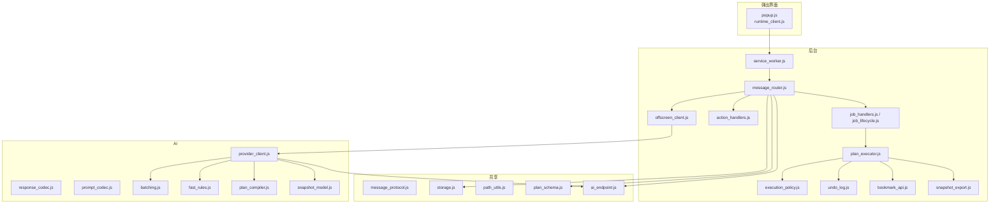
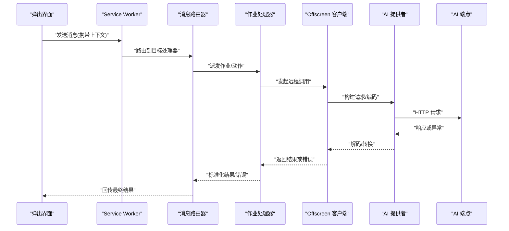
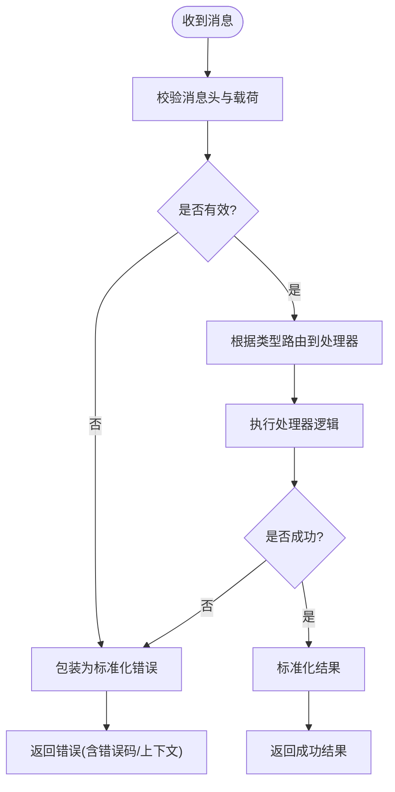
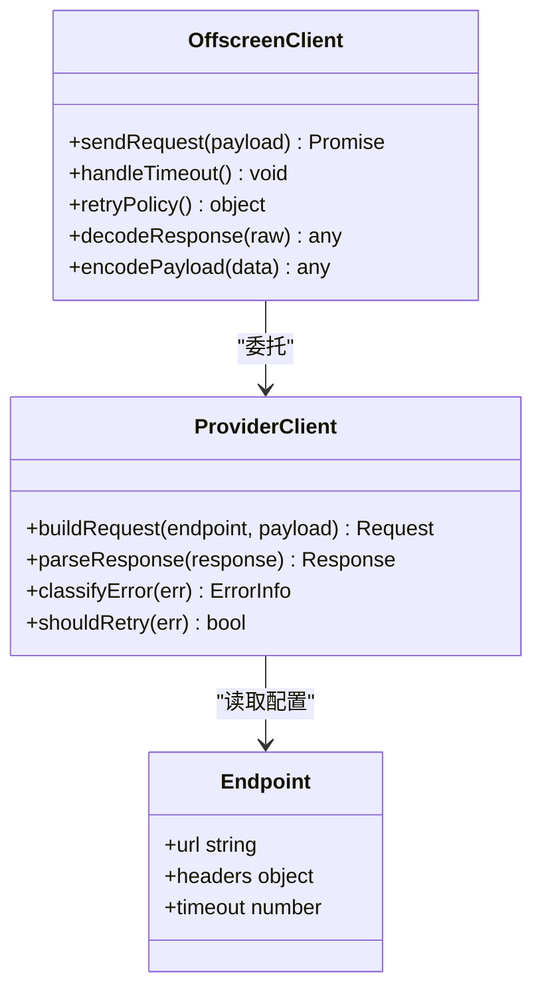
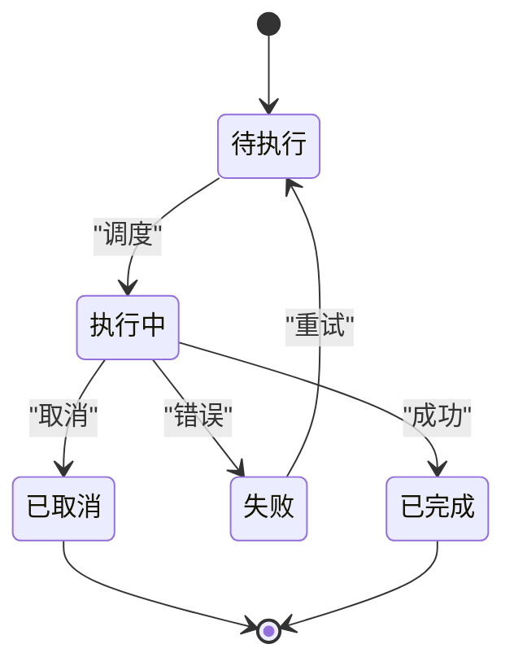
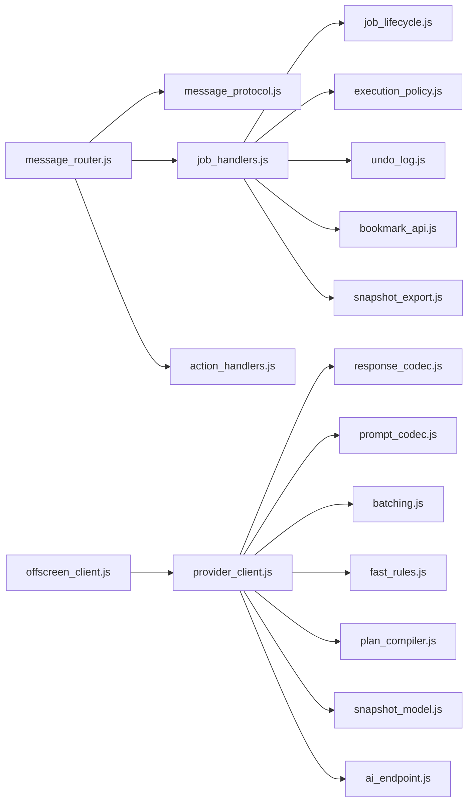

# 错误处理和调试

<cite>
**本文引用的文件**   
- [extension/background/message_router.js](file://extension/background/message_router.js)
- [extension/shared/message_protocol.js](file://extension/shared/message_protocol.js)
- [extension/offscreen_client.js](file://extension/offscreen_client.js)
- [extension/service_worker.js](file://extension/service_worker.js)
- [extension/popup/runtime_client.js](file://extension/popup/runtime_client.js)
- [extension/ai/provider_client.js](file://extension/ai/provider_client.js)
- [extension/ai/response_codec.js](file://extension/ai/response_codec.js)
- [extension/ai/prompt_codec.js](file://extension/ai/prompt_codec.js)
- [extension/background/job_handlers.js](file://extension/background/job_handlers.js)
- [extension/background/job_lifecycle.js](file://extension/background/job_lifecycle.js)
- [extension/background/action_handlers.js](file://extension/background/action_handlers.js)
- [extension/background/bookmark_api.js](file://extension/background/bookmark_api.js)
- [extension/background/snapshot_export.js](file://extension/background/snapshot_export.js)
- [extension/background/execution_policy.js](file://extension/background/execution_policy.js)
- [extension/background/plan_executor.js](file://extension/background/plan_executor.js)
- [extension/background/undo_log.js](file://extension/background/undo_log.js)
- [extension/popup/job_state.js](file://extension/popup/job_state.js)
- [extension/popup/settings_store.js](file://extension/popup/settings_store.js)
- [extension/popup/secrets.js](file://extension/popup/secrets.js)
- [extension/ai/batching.js](file://extension/ai/batching.js)
- [extension/ai/fast_rules.js](file://extension/ai/fast_rules.js)
- [extension/ai/plan_compiler.js](file://extension/ai/plan_compiler.js)
- [extension/ai/snapshot_model.js](file://extension/ai/snapshot_model.js)
- [extension/shared/storage.js](file://extension/shared/storage.js)
- [extension/shared/path_utils.js](file://extension/shared/path_utils.js)
- [extension/shared/plan_schema.js](file://extension/shared/plan_schema.js)
- [extension/shared/ai_endpoint.js](file://extension/shared/ai_endpoint.js)
- [tests/test_extension_message_router.js](file://tests/test_extension_message_router.js)
- [tests/test_extension_offscreen_client.js](file://tests/test_extension_offscreen_client.js)
- [tests/test_extension_ai_provider_client.js](file://tests/test_extension_ai_provider_client.js)
- [tests/test_extension_ai_response_codec.js](file://tests/test_extension_ai_response_codec.js)
- [tests/test_extension_job_handlers.js](file://tests/test_extension_job_handlers.js)
- [tests/test_extension_job_lifecycle.js](file://tests/test_extension_job_lifecycle.js)
</cite>

## 目录
1. [简介](#简介)
2. [项目结构](#项目结构)
3. [核心组件](#核心组件)
4. [架构总览](#架构总览)
5. [详细组件分析](#详细组件分析)
6. [依赖关系分析](#依赖关系分析)
7. [性能考虑](#性能考虑)
8. [故障排查指南](#故障排查指南)
9. [结论](#结论)
10. [附录：错误代码与恢复策略参考](#附录错误代码与恢复策略参考)

## 简介
本指南聚焦于消息系统的错误处理与调试，覆盖网络错误、超时错误、序列化错误等常见类型；阐述日志记录与追踪机制（上下文信息、堆栈跟踪）；提供调试工具与方法（消息流监控、性能分析与诊断技巧）；说明错误恢复与容错策略（重试、降级）；并给出完整的错误代码参考与排障清单。读者无需深入源码即可理解系统如何定位和修复问题。

## 项目结构
本项目采用浏览器扩展架构，包含后台脚本、弹出界面、Offscreen 文档以及共享协议与 AI 客户端模块。消息系统贯穿这些模块，负责跨上下文通信、任务调度与外部服务调用。

图表来源
- [extension/background/message_router.js](file://extension/background/message_router.js)
- [extension/shared/message_protocol.js](file://extension/shared/message_protocol.js)
- [extension/offscreen_client.js](file://extension/offscreen_client.js)
- [extension/service_worker.js](file://extension/service_worker.js)
- [extension/popup/runtime_client.js](file://extension/popup/runtime_client.js)
- [extension/ai/provider_client.js](file://extension/ai/provider_client.js)
- [extension/ai/response_codec.js](file://extension/ai/response_codec.js)
- [extension/ai/prompt_codec.js](file://extension/ai/prompt_codec.js)
- [extension/background/job_handlers.js](file://extension/background/job_handlers.js)
- [extension/background/job_lifecycle.js](file://extension/background/job_lifecycle.js)
- [extension/background/action_handlers.js](file://extension/background/action_handlers.js)
- [extension/background/bookmark_api.js](file://extension/background/bookmark_api.js)
- [extension/background/snapshot_export.js](file://extension/background/snapshot_export.js)
- [extension/background/execution_policy.js](file://extension/background/execution_policy.js)
- [extension/background/plan_executor.js](file://extension/background/plan_executor.js)
- [extension/background/undo_log.js](file://extension/background/undo_log.js)
- [extension/shared/storage.js](file://extension/shared/storage.js)
- [extension/shared/path_utils.js](file://extension/shared/path_utils.js)
- [extension/shared/plan_schema.js](file://extension/shared/plan_schema.js)
- [extension/shared/ai_endpoint.js](file://extension/shared/ai_endpoint.js)

章节来源
- [extension/background/message_router.js](file://extension/background/message_router.js)
- [extension/shared/message_protocol.js](file://extension/shared/message_protocol.js)
- [extension/offscreen_client.js](file://extension/offscreen_client.js)
- [extension/service_worker.js](file://extension/service_worker.js)
- [extension/popup/runtime_client.js](file://extension/popup/runtime_client.js)
- [extension/ai/provider_client.js](file://extension/ai/provider_client.js)
- [extension/ai/response_codec.js](file://extension/ai/response_codec.js)
- [extension/ai/prompt_codec.js](file://extension/ai/prompt_codec.js)
- [extension/background/job_handlers.js](file://extension/background/job_handlers.js)
- [extension/background/job_lifecycle.js](file://extension/background/job_lifecycle.js)
- [extension/background/action_handlers.js](file://extension/background/action_handlers.js)
- [extension/background/bookmark_api.js](file://extension/background/bookmark_api.js)
- [extension/background/snapshot_export.js](file://extension/background/snapshot_export.js)
- [extension/background/execution_policy.js](file://extension/background/execution_policy.js)
- [extension/background/plan_executor.js](file://extension/background/plan_executor.js)
- [extension/background/undo_log.js](file://extension/background/undo_log.js)
- [extension/shared/storage.js](file://extension/shared/storage.js)
- [extension/shared/path_utils.js](file://extension/shared/path_utils.js)
- [extension/shared/plan_schema.js](file://extension/shared/plan_schema.js)
- [extension/shared/ai_endpoint.js](file://extension/shared/ai_endpoint.js)

## 核心组件
- 消息路由与协议
  - 负责在弹出界面、Service Worker、Offscreen 文档之间转发消息，统一消息格式与生命周期。
  - 关键职责：消息分发、参数校验、错误包装、结果回传。
- Offscreen 客户端与 AI 提供者
  - 封装对外部 AI 服务的请求、批处理、编解码与重试逻辑。
  - 关键职责：HTTP 调用、超时控制、错误分类、响应解析、失败降级。
- 作业执行与策略
  - 将业务动作编排为可执行的作业，结合执行策略进行幂等、撤销与状态管理。
  - 关键职责：作业调度、状态机、回滚、持久化。
- 共享协议与存储
  - 定义消息契约、计划模型、路径工具与本地存储访问。
  - 关键职责：数据一致性、版本兼容、读写隔离。

章节来源
- [extension/background/message_router.js](file://extension/background/message_router.js)
- [extension/shared/message_protocol.js](file://extension/shared/message_protocol.js)
- [extension/offscreen_client.js](file://extension/offscreen_client.js)
- [extension/ai/provider_client.js](file://extension/ai/provider_client.js)
- [extension/background/job_handlers.js](file://extension/background/job_handlers.js)
- [extension/background/job_lifecycle.js](file://extension/background/job_lifecycle.js)
- [extension/background/execution_policy.js](file://extension/background/execution_policy.js)
- [extension/shared/plan_schema.js](file://extension/shared/plan_schema.js)
- [extension/shared/storage.js](file://extension/shared/storage.js)

## 架构总览
下图展示了从用户操作到外部 AI 服务调用的端到端流程，以及错误在各层传播与归一化的路径。

图表来源
- [extension/popup/runtime_client.js](file://extension/popup/runtime_client.js)
- [extension/service_worker.js](file://extension/service_worker.js)
- [extension/background/message_router.js](file://extension/background/message_router.js)
- [extension/background/job_handlers.js](file://extension/background/job_handlers.js)
- [extension/offscreen_client.js](file://extension/offscreen_client.js)
- [extension/ai/provider_client.js](file://extension/ai/provider_client.js)
- [extension/shared/ai_endpoint.js](file://extension/shared/ai_endpoint.js)

## 详细组件分析

### 消息路由与协议（错误边界与上下文）
- 错误边界
  - 入口校验：对消息类型、必需字段进行快速拒绝，避免下游无效处理。
  - 错误包装：将底层异常转换为标准错误对象，附带错误码、上下文与时间戳。
  - 回传规范：无论成功或失败，均通过统一通道返回，确保上层可观测。
- 上下文与追踪
  - 每个消息携带唯一 ID、来源上下文、时间戳与链路标签，便于聚合与检索。
  - 关键路径打点：路由命中、处理器选择、耗时统计、错误分类计数。
- 协议契约
  - 消息头包含类型、版本、优先级、重试标志等元数据。
  - 载荷遵循共享模式定义，保证跨模块一致。

图表来源
- [extension/background/message_router.js](file://extension/background/message_router.js)
- [extension/shared/message_protocol.js](file://extension/shared/message_protocol.js)

章节来源
- [extension/background/message_router.js](file://extension/background/message_router.js)
- [extension/shared/message_protocol.js](file://extension/shared/message_protocol.js)

### Offscreen 客户端与 AI 提供者（网络与序列化错误）
- 网络错误
  - 分类：连接失败、DNS 解析失败、证书错误、代理错误、服务器不可达等。
  - 处理：区分可重试与不可重试；对瞬态错误实施指数退避重试；对限流错误使用等待窗口。
- 超时错误
  - 分层超时：连接超时、读超时、写超时；整体请求上限。
  - 行为：超时即中断并标记为超时错误，触发重试或降级。
- 序列化错误
  - 入参编码：对复杂对象进行安全序列化，缺失字段或缺失类型时快速失败。
  - 出参解码：严格模式解析，未知字段忽略或告警；解析失败转为结构化错误。
- 重试与降级
  - 重试条件：仅对幂等操作且错误类型为瞬态时重试。
  - 降级策略：当连续失败超过阈值，切换至缓存/默认值或提示用户稍后重试。

图表来源
- [extension/offscreen_client.js](file://extension/offscreen_client.js)
- [extension/ai/provider_client.js](file://extension/ai/provider_client.js)
- [extension/shared/ai_endpoint.js](file://extension/shared/ai_endpoint.js)

章节来源
- [extension/offscreen_client.js](file://extension/offscreen_client.js)
- [extension/ai/provider_client.js](file://extension/ai/provider_client.js)
- [extension/ai/response_codec.js](file://extension/ai/response_codec.js)
- [extension/ai/prompt_codec.js](file://extension/ai/prompt_codec.js)
- [extension/shared/ai_endpoint.js](file://extension/shared/ai_endpoint.js)

### 作业执行与策略（幂等、回滚与状态）
- 作业生命周期
  - 创建、调度、执行、完成、失败、取消、重试。
  - 状态变更需持久化，支持崩溃恢复与断点续跑。
- 执行策略
  - 并发限制、资源配额、优先级队列。
  - 幂等键与去重，避免重复执行。
- 回滚与撤销
  - 记录操作前快照，失败时按顺序回滚。
  - 撤销日志用于审计与人工干预。

图表来源
- [extension/background/job_lifecycle.js](file://extension/background/job_lifecycle.js)
- [extension/background/execution_policy.js](file://extension/background/execution_policy.js)
- [extension/background/undo_log.js](file://extension/background/undo_log.js)

章节来源
- [extension/background/job_handlers.js](file://extension/background/job_handlers.js)
- [extension/background/job_lifecycle.js](file://extension/background/job_lifecycle.js)
- [extension/background/execution_policy.js](file://extension/background/execution_policy.js)
- [extension/background/undo_log.js](file://extension/background/undo_log.js)

### 书签与快照（I/O 错误与一致性）
- I/O 错误
  - 文件系统/存储权限不足、空间不足、写入冲突。
  - 处理：捕获并转换为结构化错误，必要时提示用户检查权限或清理空间。
- 一致性
  - 原子写入与事务性更新，失败时回滚。
  - 快照导出与导入的校验与完整性检查。

章节来源
- [extension/background/bookmark_api.js](file://extension/background/bookmark_api.js)
- [extension/background/snapshot_export.js](file://extension/background/snapshot_export.js)
- [extension/shared/storage.js](file://extension/shared/storage.js)

### 弹窗与运行时客户端（前端可见的错误反馈）
- 错误展示
  - 将后端标准化错误映射为用户可读提示，保留错误码以便支持人员定位。
- 状态同步
  - 作业状态变化实时推送，失败时自动刷新与重试入口。

章节来源
- [extension/popup/runtime_client.js](file://extension/popup/runtime_client.js)
- [extension/popup/job_state.js](file://extension/popup/job_state.js)

## 依赖关系分析
- 耦合与内聚
  - 消息路由与协议高内聚，作为所有跨上下文通信的统一入口。
  - AI 提供者与端点配置解耦，便于替换与测试。
- 外部依赖
  - HTTP 客户端、JSON 编解码器、本地存储 API。
- 潜在循环
  - 通过接口与事件总线降低直接引用，避免循环依赖。

图表来源
- [extension/background/message_router.js](file://extension/background/message_router.js)
- [extension/shared/message_protocol.js](file://extension/shared/message_protocol.js)
- [extension/background/job_handlers.js](file://extension/background/job_handlers.js)
- [extension/background/job_lifecycle.js](file://extension/background/job_lifecycle.js)
- [extension/background/execution_policy.js](file://extension/background/execution_policy.js)
- [extension/background/undo_log.js](file://extension/background/undo_log.js)
- [extension/background/bookmark_api.js](file://extension/background/bookmark_api.js)
- [extension/background/snapshot_export.js](file://extension/background/snapshot_export.js)
- [extension/offscreen_client.js](file://extension/offscreen_client.js)
- [extension/ai/provider_client.js](file://extension/ai/provider_client.js)
- [extension/ai/response_codec.js](file://extension/ai/response_codec.js)
- [extension/ai/prompt_codec.js](file://extension/ai/prompt_codec.js)
- [extension/ai/batching.js](file://extension/ai/batching.js)
- [extension/ai/fast_rules.js](file://extension/ai/fast_rules.js)
- [extension/ai/plan_compiler.js](file://extension/ai/plan_compiler.js)
- [extension/ai/snapshot_model.js](file://extension/ai/snapshot_model.js)
- [extension/shared/ai_endpoint.js](file://extension/shared/ai_endpoint.js)

## 性能考虑
- 批处理与合并
  - 对高频小请求进行批处理，减少网络往返与 CPU 抖动。
- 超时与节流
  - 合理设置分层超时，避免长尾阻塞；对热点接口进行速率限制。
- 缓存与降级
  - 对只读数据启用短期缓存；服务端不可用时返回默认值或离线能力。
- 资源回收
  - 及时释放大对象与句柄，避免内存泄漏导致崩溃。

[本节为通用指导，不直接分析具体文件]

## 故障排查指南
- 快速定位
  - 查看错误码与上下文：优先依据错误码分类（网络/超时/序列化/权限/配额）。
  - 核对链路 ID：在消息头中查找唯一 ID，关联前后端日志。
- 日志与追踪
  - 关键打点：路由命中、处理器耗时、网络请求耗时、解码耗时。
  - 堆栈跟踪：捕获并附带调用栈与最近一次输入摘要（脱敏）。
- 复现与最小用例
  - 构造最小消息载荷，固定环境变量与端点配置，逐步缩小范围。
- 工具与方法
  - 消息流监控：在路由层输出进入/离开事件与耗时。
  - 性能分析：使用浏览器开发者工具的 Network 与 Performance 面板。
  - 单元测试：针对编解码、重试策略、状态机编写用例。

章节来源
- [extension/background/message_router.js](file://extension/background/message_router.js)
- [extension/ai/provider_client.js](file://extension/ai/provider_client.js)
- [extension/ai/response_codec.js](file://extension/ai/response_codec.js)
- [extension/ai/prompt_codec.js](file://extension/ai/prompt_codec.js)
- [extension/background/job_lifecycle.js](file://extension/background/job_lifecycle.js)
- [extension/popup/runtime_client.js](file://extension/popup/runtime_client.js)

## 结论
通过统一的消息协议、标准化的错误包装与上下文追踪、严格的编解码与重试策略，系统在复杂交互场景下具备较强的可观测性与可恢复性。建议持续完善错误码体系、增强自动化测试覆盖，并结合线上指标优化重试与降级策略。

## 附录：错误代码与恢复策略参考
- 网络类
  - 连接失败：立即重试（指数退避），多次失败后降级。
  - DNS 解析失败：提示用户检查网络与代理，不进行重试。
  - 证书错误：终止并提示管理员介入。
- 超时类
  - 连接/读/写超时：按层级重试，达到上限后降级或返回部分结果。
- 序列化类
  - 入参缺失/类型不符：快速失败，返回明确字段级错误。
  - 出参解析失败：记录原始片段（脱敏），尝试宽松解析或回退默认值。
- 权限与存储类
  - 权限不足：引导用户授权或切换到可用存储。
  - 空间不足：提示清理并暂停批量操作。
- 限流与配额
  - 429/配额耗尽：等待窗口后重试，必要时排队与分批。
- 幂等与回滚
  - 幂等键冲突：去重并返回已有结果。
  - 部分失败：按逆序回滚已执行步骤，保持系统一致。

章节来源
- [extension/ai/provider_client.js](file://extension/ai/provider_client.js)
- [extension/ai/response_codec.js](file://extension/ai/response_codec.js)
- [extension/ai/prompt_codec.js](file://extension/ai/prompt_codec.js)
- [extension/background/execution_policy.js](file://extension/background/execution_policy.js)
- [extension/background/undo_log.js](file://extension/background/undo_log.js)
- [extension/shared/storage.js](file://extension/shared/storage.js)