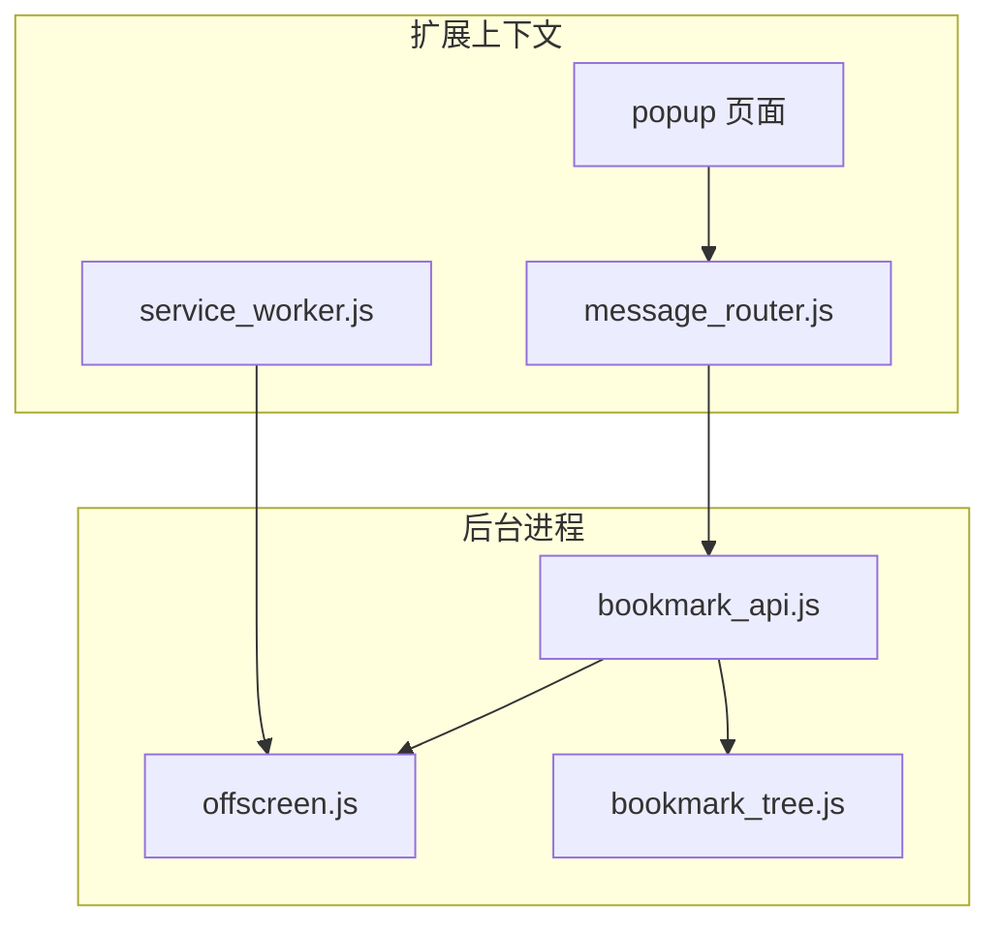
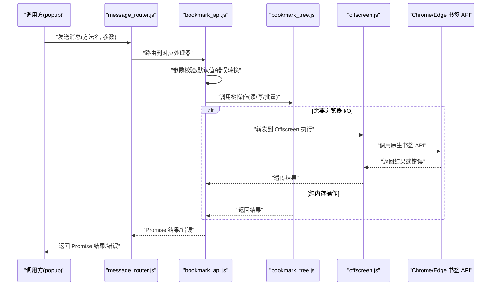
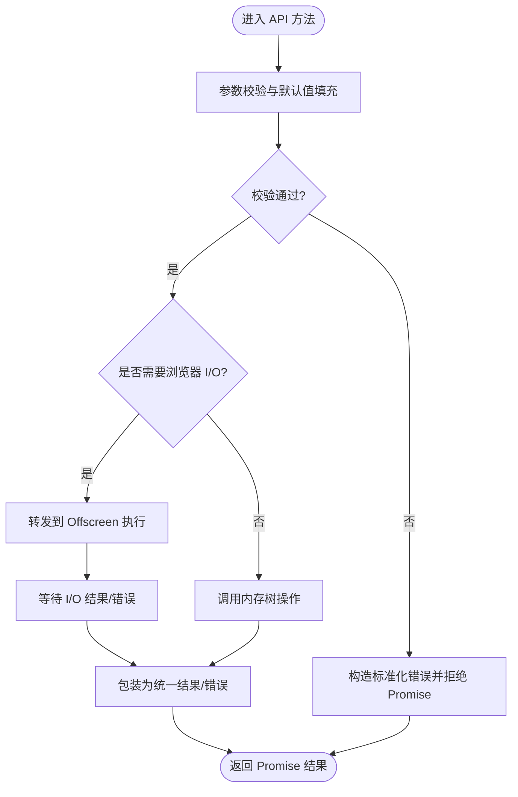
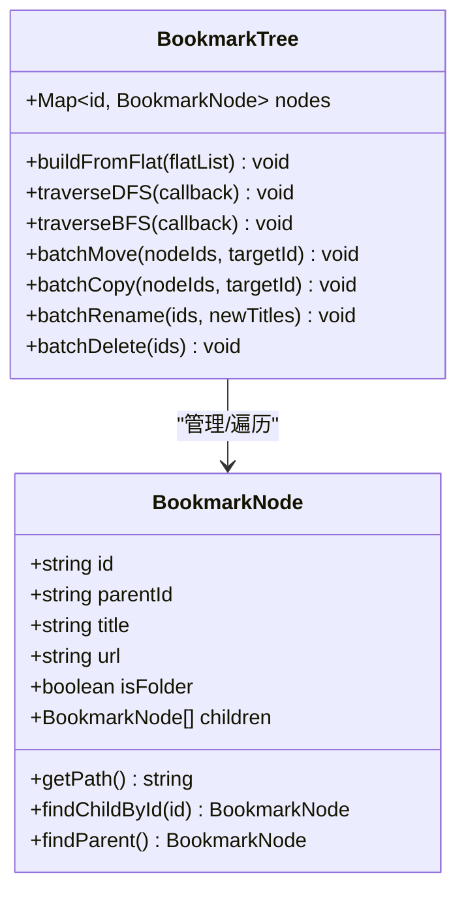
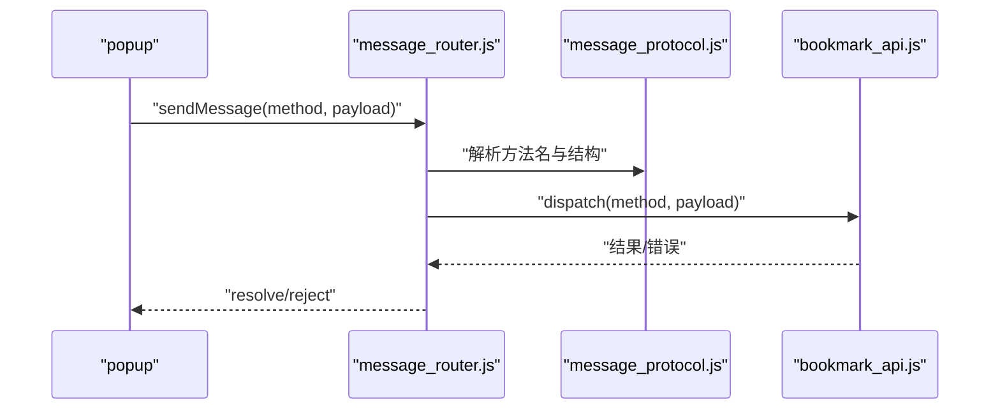
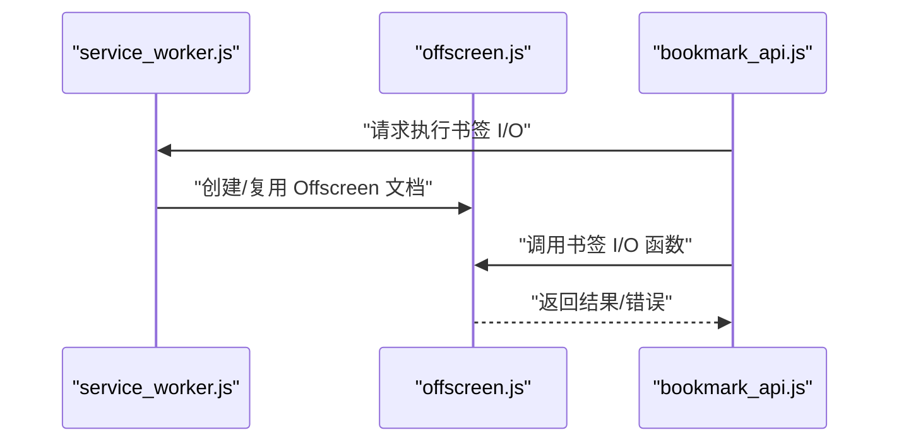
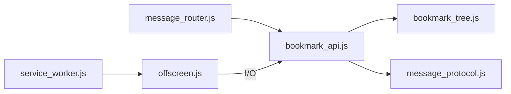

# 书签 API 封装

<cite>
**本文引用的文件**   
- [extension/background/bookmark_api.js](file://extension/background/bookmark_api.js)
- [extension/background/bookmark_tree.js](file://extension/background/bookmark_tree.js)
- [extension/background/message_router.js](file://extension/background/message_router.js)
- [extension/shared/message_protocol.js](file://extension/shared/message_protocol.js)
- [extension/offscreen.js](file://extension/offscreen.js)
- [extension/service_worker.js](file://extension/service_worker.js)
- [tests/test_extension_bookmark_tree.js](file://tests/test_extension_bookmark_tree.js)
</cite>

## 目录
1. [简介](#简介)
2. [项目结构](#项目结构)
3. [核心组件](#核心组件)
4. [架构总览](#架构总览)
5. [详细组件分析](#详细组件分析)
6. [依赖关系分析](#依赖关系分析)
7. [性能考虑](#性能考虑)
8. [故障排查指南](#故障排查指南)
9. [结论](#结论)
10. [附录：API 参考与使用示例](#附录api-参考与使用示例)

## 简介
本文件面向扩展开发者，系统化梳理对 Chrome/Edge 书签 API 的封装设计与实现。重点覆盖以下方面：
- 异步操作的 Promise 化封装与错误处理机制
- 书签树结构的读取、遍历与父子关系维护
- 批量操作方法与事务性保证
- 统一的 CRUD 接口设计
- 搜索与过滤能力（按标题、URL、文件夹等）
- 原子性与一致性保障策略
- 最佳实践（性能优化、错误恢复）
- 完整的 API 参考与使用示例

## 项目结构
本项目采用“背景脚本 + Offscreen 文档”的双进程模式，将浏览器原生书签 API 的调用集中在后台侧，并通过消息协议向弹出层或其他上下文暴露统一接口。关键文件职责如下：
- background/bookmark_api.js：对外暴露的书签 API 封装，负责 Promise 化、参数校验、错误转换与路由转发
- background/bookmark_tree.js：书签树构建、节点遍历、父子关系维护与批量操作
- background/message_router.js：消息路由分发，协调不同模块间的通信
- shared/message_protocol.js：消息协议定义（方法名、请求/响应结构）
- offscreen.js：Offscreen 文档入口，承载书签相关 I/O 任务
- service_worker.js：Service Worker 生命周期管理，按需创建/复用 Offscreen 文档
- tests/test_extension_bookmark_tree.js：书签树逻辑的单元测试

图表来源
- [extension/background/message_router.js](file://extension/background/message_router.js)
- [extension/background/bookmark_api.js](file://extension/background/bookmark_api.js)
- [extension/background/bookmark_tree.js](file://extension/background/bookmark_tree.js)
- [extension/offscreen.js](file://extension/offscreen.js)
- [extension/service_worker.js](file://extension/service_worker.js)

章节来源
- [extension/background/bookmark_api.js](file://extension/background/bookmark_api.js)
- [extension/background/bookmark_tree.js](file://extension/background/bookmark_tree.js)
- [extension/background/message_router.js](file://extension/background/message_router.js)
- [extension/shared/message_protocol.js](file://extension/shared/message_protocol.js)
- [extension/offscreen.js](file://extension/offscreen.js)
- [extension/service_worker.js](file://extension/service_worker.js)

## 核心组件
- 书签 API 封装层（Promise 化与错误处理）
  - 将浏览器异步 API 包装为返回 Promise 的统一接口
  - 规范化错误对象，提供可诊断的错误码与消息
  - 在必要时进行参数校验与默认值填充
- 书签树模型与遍历
  - 从浏览器获取扁平节点列表并构建树形结构
  - 维护父子关系索引，支持高效查找与路径计算
  - 提供批量移动、复制、重命名等操作
- 消息路由与协议
  - 通过共享协议定义方法名与数据结构
  - 路由分发到具体实现，屏蔽跨上下文细节
- Offscreen 集成
  - 将书签读写迁移至 Offscreen 文档执行，避免 Service Worker 休眠限制
  - 由 Service Worker 负责生命周期管理与按需唤醒

章节来源
- [extension/background/bookmark_api.js](file://extension/background/bookmark_api.js)
- [extension/background/bookmark_tree.js](file://extension/background/bookmark_tree.js)
- [extension/shared/message_protocol.js](file://extension/shared/message_protocol.js)
- [extension/offscreen.js](file://extension/offscreen.js)
- [extension/service_worker.js](file://extension/service_worker.js)

## 架构总览
下图展示了从调用方到浏览器书签 API 的完整调用链，包括 Promise 化、路由转发与 Offscreen 执行。

图表来源
- [extension/background/message_router.js](file://extension/background/message_router.js)
- [extension/background/bookmark_api.js](file://extension/background/bookmark_api.js)
- [extension/background/bookmark_tree.js](file://extension/background/bookmark_tree.js)
- [extension/offscreen.js](file://extension/offscreen.js)

## 详细组件分析

### 组件 A：书签 API 封装层（Promise 化与错误处理）
- 设计要点
  - 所有对外方法均返回 Promise，便于 async/await 风格调用
  - 统一错误对象结构，包含错误码、消息与可选上下文信息
  - 对浏览器 API 抛出的异常进行捕获与转换，避免未处理拒绝
  - 在必要处进行参数校验（如必填字段、类型检查），失败时快速返回明确错误
- 典型流程
  - 接收消息或内部调用 -> 参数校验 -> 调用树/IO 层 -> 结果包装 -> 返回 Promise
- 与 Offscreen 的协作
  - 当操作涉及浏览器 I/O 时，封装层将请求转发给 Offscreen 文档执行，并在完成后回传结果
- 事务与原子性
  - 对于多步写入，封装层组织为“预检 -> 批量提交 -> 回滚/补偿”的流程，确保数据一致性

图表来源
- [extension/background/bookmark_api.js](file://extension/background/bookmark_api.js)
- [extension/offscreen.js](file://extension/offscreen.js)

章节来源
- [extension/background/bookmark_api.js](file://extension/background/bookmark_api.js)
- [extension/offscreen.js](file://extension/offscreen.js)

### 组件 B：书签树模型与遍历
- 数据结构
  - 以节点 ID 为键的映射表，记录每个节点的元数据与子节点集合
  - 维护父指针与路径缓存，加速父子关系查询与路径生成
- 核心能力
  - 从浏览器扁平列表构建有根树
  - 深度优先/广度优先遍历，支持条件过滤
  - 批量移动、复制、重命名、删除等复合操作
- 复杂度与优化
  - 构建树 O(n)，查找子节点 O(1)，路径计算 O(h)（h 为树高）
  - 批量操作尽量合并浏览器调用，减少往返次数
- 测试覆盖
  - 针对树构建、遍历顺序、父子关系、批量移动等进行断言

图表来源
- [extension/background/bookmark_tree.js](file://extension/background/bookmark_tree.js)

章节来源
- [extension/background/bookmark_tree.js](file://extension/background/bookmark_tree.js)
- [tests/test_extension_bookmark_tree.js](file://tests/test_extension_bookmark_tree.js)

### 组件 C：消息路由与协议
- 协议定义
  - 集中声明方法名、请求体结构与响应体结构，确保跨上下文一致
- 路由分发
  - 根据方法名将消息分派到 bookmark_api.js 的具体处理器
  - 对未知方法或缺少参数的请求返回明确的协议级错误
- 与 Offscreen 的边界
  - 路由层不关心具体实现位置，仅负责转发；是否走 Offscreen 由 API 层决定

图表来源
- [extension/background/message_router.js](file://extension/background/message_router.js)
- [extension/shared/message_protocol.js](file://extension/shared/message_protocol.js)
- [extension/background/bookmark_api.js](file://extension/background/bookmark_api.js)

章节来源
- [extension/background/message_router.js](file://extension/background/message_router.js)
- [extension/shared/message_protocol.js](file://extension/shared/message_protocol.js)
- [extension/background/bookmark_api.js](file://extension/background/bookmark_api.js)

### 组件 D：Offscreen 集成与服务工作者
- Offscreen 文档
  - 作为书签 I/O 的执行环境，避免 Service Worker 休眠导致的超时
  - 暴露与 API 层一致的函数，供后台直接调用
- Service Worker
  - 负责按需创建/销毁 Offscreen 文档，管理其生命周期
  - 在首次书签操作前预热，降低首调延迟

图表来源
- [extension/service_worker.js](file://extension/service_worker.js)
- [extension/offscreen.js](file://extension/offscreen.js)
- [extension/background/bookmark_api.js](file://extension/background/bookmark_api.js)

章节来源
- [extension/service_worker.js](file://extension/service_worker.js)
- [extension/offscreen.js](file://extension/offscreen.js)
- [extension/background/bookmark_api.js](file://extension/background/bookmark_api.js)

## 依赖关系分析
- 内聚与耦合
  - bookmark_api.js 对内聚合 bookmark_tree.js 与 message_protocol.js，对外通过 message_router.js 暴露
  - offscreen.js 与 service_worker.js 解耦，通过约定好的函数接口交互
- 外部依赖
  - 浏览器书签 API 仅在 Offscreen 中直接调用，其他层通过 Promise 化接口间接访问
- 潜在循环依赖
  - 当前分层清晰，未发现循环导入；若新增功能，建议保持“API 层不反向依赖路由层”的原则

图表来源
- [extension/background/bookmark_api.js](file://extension/background/bookmark_api.js)
- [extension/background/bookmark_tree.js](file://extension/background/bookmark_tree.js)
- [extension/background/message_router.js](file://extension/background/message_router.js)
- [extension/shared/message_protocol.js](file://extension/shared/message_protocol.js)
- [extension/offscreen.js](file://extension/offscreen.js)
- [extension/service_worker.js](file://extension/service_worker.js)

章节来源
- [extension/background/bookmark_api.js](file://extension/background/bookmark_api.js)
- [extension/background/bookmark_tree.js](file://extension/background/bookmark_tree.js)
- [extension/background/message_router.js](file://extension/background/message_router.js)
- [extension/shared/message_protocol.js](file://extension/shared/message_protocol.js)
- [extension/offscreen.js](file://extension/offscreen.js)
- [extension/service_worker.js](file://extension/service_worker.js)

## 性能考虑
- 批量操作优先
  - 使用批量移动/复制/重命名接口，减少浏览器调用次数
- 懒加载与分页
  - 对大规模树结构，优先按需加载子树，避免一次性全量构建
- 缓存热点路径
  - 对频繁访问的路径或节点建立本地缓存，命中后跳过 I/O
- 并发控制
  - 对并发写入进行排队与去重，避免竞态导致的不一致
- 错误重试与退避
  - 对网络或系统瞬时错误实施指数退避重试，设置最大重试次数

[本节为通用指导，无需代码引用]

## 故障排查指南
- 常见错误分类
  - 参数错误：缺少必填字段、类型不符、ID 不存在
  - 权限/状态错误：Offscreen 未就绪、Service Worker 被终止
  - 浏览器 API 错误：配额超限、同步冲突
- 定位步骤
  - 检查消息协议与方法名是否正确
  - 查看 API 层日志中的标准化错误对象（含错误码与上下文）
  - 确认 Offscreen 文档是否成功创建并可通信
- 恢复策略
  - 对幂等操作进行重试；对非幂等操作先做预检与快照
  - 遇到不可恢复错误时，提示用户并提供降级方案（如只读模式）

章节来源
- [extension/background/bookmark_api.js](file://extension/background/bookmark_api.js)
- [extension/offscreen.js](file://extension/offscreen.js)

## 结论
本封装通过清晰的层次划分与统一的 Promise 接口，屏蔽了浏览器书签 API 的异步复杂性，提供了可扩展的树模型与批量操作能力。结合 Offscreen 与 Service Worker 的生命周期管理，既保证了性能，也提升了稳定性。遵循本文的最佳实践，可在复杂场景下获得一致且高效的书签管理能力。

[本节为总结，无需代码引用]

## 附录：API 参考与使用示例

### 统一接口概览
- 读取类
  - 获取书签树：返回根节点及子树
  - 按条件遍历：支持按标题、URL、文件夹等过滤
- 写入类
  - 创建：在指定父节点下新建书签或文件夹
  - 更新：修改标题、URL、排序等属性
  - 删除：删除单个或批量节点
  - 移动/复制：将节点移动到目标文件夹
- 批量与事务
  - 批量移动/复制/重命名/删除
  - 事务提交与回滚，确保一致性

章节来源
- [extension/background/bookmark_api.js](file://extension/background/bookmark_api.js)
- [extension/background/bookmark_tree.js](file://extension/background/bookmark_tree.js)

### 使用示例（概念性）
- 读取整棵树并打印节点数量
- 按标题模糊匹配搜索书签
- 批量将多个书签移动到目标文件夹
- 在事务中执行“重命名 + 移动”，失败自动回滚

[本节为概念性示例，不展示具体代码]