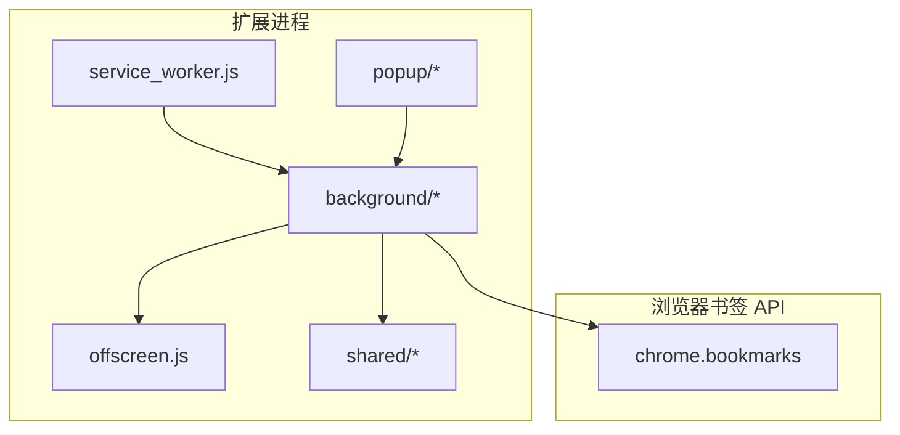
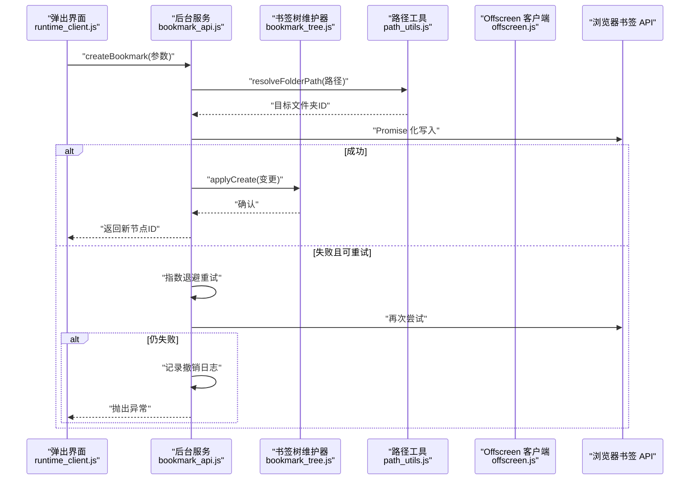
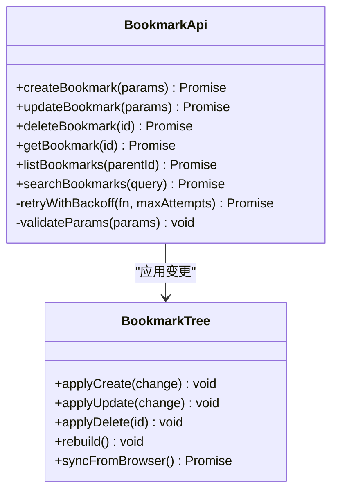
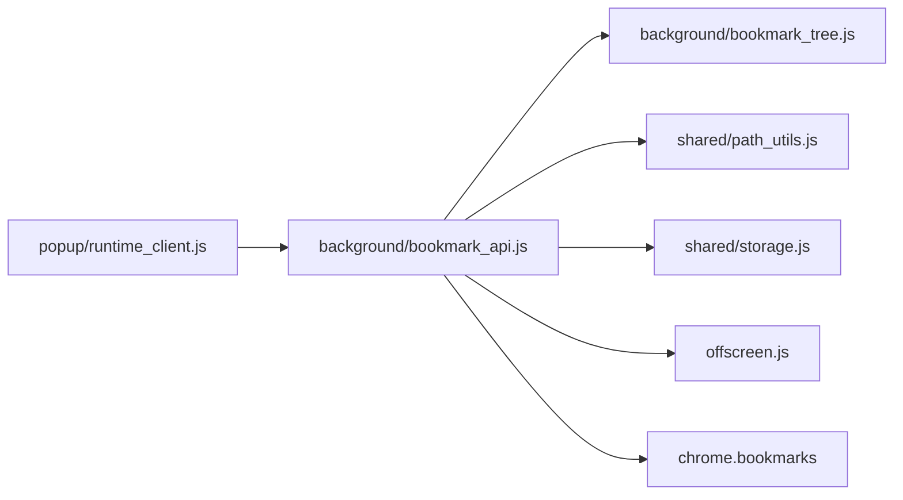

# 书签基础操作封装

<cite>
**本文引用的文件**   
- [extension/background/bookmark_api.js](file://extension/background/bookmark_api.js)
- [extension/background/bookmark_tree.js](file://extension/background/bookmark_tree.js)
- [extension/shared/path_utils.js](file://extension/shared/path_utils.js)
- [extension/shared/storage.js](file://extension/shared/storage.js)
- [extension/offscreen.js](file://extension/offscreen.js)
- [extension/service_worker.js](file://extension/service_worker.js)
- [extension/popup/runtime_client.js](file://extension/popup/runtime_client.js)
- [tests/test_extension_bookmark_tree.js](file://tests/test_extension_bookmark_tree.js)
</cite>

## 目录
1. [简介](#简介)
2. [项目结构](#项目结构)
3. [核心组件](#核心组件)
4. [架构总览](#架构总览)
5. [详细组件分析](#详细组件分析)
6. [依赖关系分析](#依赖关系分析)
7. [性能考虑](#性能考虑)
8. [故障排查指南](#故障排查指南)
9. [结论](#结论)
10. [附录：API 参考](#附录api-参考)

## 简介
本文件围绕“书签基础操作封装”的目标，系统化梳理对 Chrome/Edge 书签 API 的 Promise 化封装、统一 CRUD 接口、批量操作、搜索与过滤、原子性与事务处理、权限检查与错误恢复机制，并提供完整的 API 参考与最佳实践。文档面向不同技术背景的读者，既提供高层概览，也深入到关键实现细节与调用流程。

## 项目结构
本项目为 Edge 扩展，包含后台脚本、弹出界面、共享工具与测试等模块。与书签基础操作相关的关键位置如下：
- 后台服务层：负责与浏览器书签 API 交互、树形结构维护、消息路由与任务执行
- 共享工具：路径解析、存储抽象等
- Offscreen 页面：在需要时承载 UI 相关的异步工作（如某些受限 API）
- Service Worker：扩展入口与生命周期管理
- 弹出界面客户端：向后台发送请求并接收结果

图表来源
- [extension/service_worker.js](file://extension/service_worker.js)
- [extension/background/bookmark_api.js](file://extension/background/bookmark_api.js)
- [extension/background/bookmark_tree.js](file://extension/background/bookmark_tree.js)
- [extension/offscreen.js](file://extension/offscreen.js)
- [extension/popup/runtime_client.js](file://extension/popup/runtime_client.js)
- [extension/shared/path_utils.js](file://extension/shared/path_utils.js)
- [extension/shared/storage.js](file://extension/shared/storage.js)

章节来源
- [extension/service_worker.js](file://extension/service_worker.js)
- [extension/background/bookmark_api.js](file://extension/background/bookmark_api.js)
- [extension/background/bookmark_tree.js](file://extension/background/bookmark_tree.js)
- [extension/offscreen.js](file://extension/offscreen.js)
- [extension/popup/runtime_client.js](file://extension/popup/runtime_client.js)
- [extension/shared/path_utils.js](file://extension/shared/path_utils.js)
- [extension/shared/storage.js](file://extension/shared/storage.js)

## 核心组件
- 书签 API 封装层：将浏览器原生书签 API 进行 Promise 化，统一错误语义，提供 create/update/delete/get/list/search 等能力
- 书签树维护器：维护本地缓存的书签树结构，支持增量更新与一致性校验
- 路径工具：提供文件夹路径到 ID 的映射与解析，辅助按路径创建/移动/查找
- 存储抽象：用于持久化元数据或索引，便于快速检索与恢复
- Offscreen 客户端：在受限环境下转发请求至 offscreen 页面执行
- 弹出客户端：为 UI 提供统一的运行时调用接口

章节来源
- [extension/background/bookmark_api.js](file://extension/background/bookmark_api.js)
- [extension/background/bookmark_tree.js](file://extension/background/bookmark_tree.js)
- [extension/shared/path_utils.js](file://extension/shared/path_utils.js)
- [extension/shared/storage.js](file://extension/shared/storage.js)
- [extension/offscreen.js](file://extension/offscreen.js)
- [extension/popup/runtime_client.js](file://extension/popup/runtime_client.js)

## 架构总览
下图展示了从弹出界面发起书签操作到后台服务与浏览器 API 的完整调用链，以及失败重试与回滚策略。

图表来源
- [extension/popup/runtime_client.js](file://extension/popup/runtime_client.js)
- [extension/background/bookmark_api.js](file://extension/background/bookmark_api.js)
- [extension/background/bookmark_tree.js](file://extension/background/bookmark_tree.js)
- [extension/shared/path_utils.js](file://extension/shared/path_utils.js)
- [extension/offscreen.js](file://extension/offscreen.js)

## 详细组件分析

### 书签 API 封装层（Promise 化与重试）
- 设计要点
  - 将浏览器书签 API 的回调式调用包装为 Promise，统一错误对象与状态码
  - 对瞬时性错误（如并发冲突、限流）实施指数退避重试，避免抖动放大
  - 提供幂等写保护：相同输入多次调用不会产生重复副作用
- 关键能力
  - createBookmark：在指定父节点下创建书签，返回新节点 ID
  - updateBookmark：更新现有书签属性（标题、URL、顺序等）
  - deleteBookmark：删除书签或空文件夹
  - getBookmark：按 ID 获取单个书签
  - listBookmarks：列出某文件夹下的子项
  - searchBookmarks：按标题、URL、路径等条件查询
- 错误处理
  - 区分可重试与不可重试错误；前者自动重试，后者直接上抛
  - 记录失败上下文（操作类型、参数、时间戳），便于诊断
- 事务与原子性
  - 组合操作通过“预检 + 执行 + 后验”三段式保证一致性
  - 失败时基于撤销日志进行补偿回滚

章节来源
- [extension/background/bookmark_api.js](file://extension/background/bookmark_api.js)

#### 类图（概念映射）

图表来源
- [extension/background/bookmark_api.js](file://extension/background/bookmark_api.js)
- [extension/background/bookmark_tree.js](file://extension/background/bookmark_tree.js)

### 书签树维护器（本地缓存与一致性）
- 职责
  - 维护内存中的书签树快照，减少频繁访问浏览器 API
  - 接收来自 API 层的变更事件，增量更新本地树
  - 提供快速遍历、查找与统计能力
- 一致性保障
  - 定期与浏览器实际状态比对，必要时重建
  - 变更合并策略避免覆盖远端最新值
- 性能优化
  - 懒加载子树，按需展开
  - 变更去抖与批处理

章节来源
- [extension/background/bookmark_tree.js](file://extension/background/bookmark_tree.js)

### 路径工具（文件夹路径解析）
- 功能
  - 将“根/一级/二级/...”形式的文件夹路径解析为目标 ID
  - 支持路径规范化与容错（忽略多余分隔符、大小写不敏感等）
- 使用场景
  - 创建/移动书签时定位目标文件夹
  - 批量迁移时根据路径批量定位

章节来源
- [extension/shared/path_utils.js](file://extension/shared/path_utils.js)

### 存储抽象（持久化与索引）
- 作用
  - 持久化书签索引、路径映射、撤销日志等元数据
  - 提供键值存取与批量读写接口
- 特性
  - 原子写入与版本控制，防止脏读
  - 压缩与分片，降低 I/O 压力

章节来源
- [extension/shared/storage.js](file://extension/shared/storage.js)

### Offscreen 客户端（受限环境转发）
- 适用场景
  - 当某些 API 需要在 offscreen 页面中执行时，通过此客户端转发消息
- 行为
  - 确保消息协议一致，超时与错误透传
  - 连接建立与重连逻辑

章节来源
- [extension/offscreen.js](file://extension/offscreen.js)

### 弹出界面客户端（运行时调用）
- 职责
  - 为 UI 暴露简洁的运行时方法，内部委托给后台服务
  - 统一错误展示与用户提示
- 典型用法
  - 点击按钮触发创建/更新/删除/搜索等操作

章节来源
- [extension/popup/runtime_client.js](file://extension/popup/runtime_client.js)

## 依赖关系分析
- 松耦合
  - API 层仅依赖树维护器与路径工具，不直接感知 UI 与存储细节
  - 树维护器独立于 API 层，可被其他模块复用
- 外部依赖
  - 浏览器书签 API 作为唯一数据源
  - Offscreen 页面作为可选执行环境
- 潜在循环
  - 当前分层清晰，未见循环依赖迹象

图表来源
- [extension/popup/runtime_client.js](file://extension/popup/runtime_client.js)
- [extension/background/bookmark_api.js](file://extension/background/bookmark_api.js)
- [extension/background/bookmark_tree.js](file://extension/background/bookmark_tree.js)
- [extension/shared/path_utils.js](file://extension/shared/path_utils.js)
- [extension/shared/storage.js](file://extension/shared/storage.js)
- [extension/offscreen.js](file://extension/offscreen.js)

章节来源
- [extension/popup/runtime_client.js](file://extension/popup/runtime_client.js)
- [extension/background/bookmark_api.js](file://extension/background/bookmark_api.js)
- [extension/background/bookmark_tree.js](file://extension/background/bookmark_tree.js)
- [extension/shared/path_utils.js](file://extension/shared/path_utils.js)
- [extension/shared/storage.js](file://extension/shared/storage.js)
- [extension/offscreen.js](file://extension/offscreen.js)

## 性能考虑
- 批量操作
  - 合并多次写入为一次事务，减少浏览器 API 往返
  - 分批提交，避免单次过大导致阻塞
- 缓存与索引
  - 利用本地树缓存与路径索引，降低查询延迟
- 重试与退避
  - 指数退避避免雪崩，设置最大重试次数与超时
- 懒加载
  - 按需加载子树，减少初始开销

[本节为通用指导，无需具体文件引用]

## 故障排查指南
- 常见问题
  - 权限不足：确认扩展已具备书签读写权限
  - 路径不存在：检查路径解析逻辑与根节点命名
  - 并发冲突：观察是否出现竞态，启用重试与锁机制
  - 数据不一致：触发树重建与同步
- 诊断手段
  - 查看撤销日志与变更记录
  - 打印关键步骤耗时与错误堆栈
  - 对比本地树与浏览器实际状态

章节来源
- [extension/background/bookmark_api.js](file://extension/background/bookmark_api.js)
- [extension/background/bookmark_tree.js](file://extension/background/bookmark_tree.js)
- [extension/shared/storage.js](file://extension/shared/storage.js)

## 结论
通过对浏览器书签 API 的 Promise 化封装、统一 CRUD 接口、批量与搜索能力、原子性与事务处理、权限与错误恢复机制的系统化设计，本方案在保证一致性与健壮性的同时，显著提升了开发效率与运行性能。建议在实际使用中遵循幂等设计、合理重试与完善的日志记录，以获得更稳定的体验。

[本节为总结，无需具体文件引用]

## 附录：API 参考

### 统一接口定义
- createBookmark(params)
  - 参数
    - parentFolderId: 父文件夹 ID
    - title: 书签标题
    - url: 书签 URL
    - order: 插入顺序（可选）
  - 返回
    - 新书签 ID
  - 异常
    - 参数非法、父节点不存在、写入失败（含重试上限）
- updateBookmark(params)
  - 参数
    - id: 书签 ID
    - title/url/order 等可更新字段
  - 返回
    - 更新后的书签信息
  - 异常
    - 节点不存在、权限不足、写入失败
- deleteBookmark(id)
  - 参数
    - id: 要删除的书签或文件夹 ID
  - 返回
    - 删除结果
  - 异常
    - 非空文件夹删除失败、权限不足
- getBookmark(id)
  - 参数
    - id: 书签 ID
  - 返回
    - 书签详情
  - 异常
    - 节点不存在
- listBookmarks(parentId)
  - 参数
    - parentId: 父文件夹 ID
  - 返回
    - 子节点列表
  - 异常
    - 父节点不存在
- searchBookmarks(query)
  - 参数
    - query.title: 标题模糊匹配
    - query.url: URL 前缀或包含匹配
    - query.folderPath: 以“根/一级/二级”形式限定范围
    - query.limit/maxResults: 限制返回数量
  - 返回
    - 匹配的书签列表
  - 异常
    - 查询条件非法、路径解析失败

### 批量操作
- batchCreate(items)
  - items: 数组，元素同 createBookmark 参数
  - 返回
    - 每个元素的创建结果（含成功 ID 或错误）
  - 特性
    - 事务性：全部成功或全部回滚
- batchUpdate(items)
  - items: 数组，元素同 updateBookmark 参数
  - 返回
    - 每个元素的更新结果
- batchDelete(ids)
  - ids: 数组，元素为待删除 ID
  - 返回
    - 每个元素的删除结果

### 搜索与过滤
- 支持条件
  - 标题：模糊匹配
  - URL：前缀或包含匹配
  - 文件夹路径：限定搜索范围
  - 分页与限制：limit/maxResults
- 返回
  - 匹配书签集合，可按相关性排序

### 错误模型
- 错误分类
  - 可重试：网络抖动、临时冲突、限流
  - 不可重试：参数非法、权限不足、资源不存在
- 错误对象
  - code: 错误码
  - message: 人类可读描述
  - details: 附加上下文（如操作类型、参数摘要）
  - retryable: 是否可重试
  - stack: 调用栈（调试用）

### 事务与原子性
- 事务边界
  - 批量操作视为一个事务单元
- 一致性策略
  - 预检：验证所有前置条件
  - 执行：按序应用变更
  - 后验：校验最终状态
- 回滚机制
  - 基于撤销日志逐项补偿

### 权限检查与错误恢复
- 权限检查
  - 启动时检测书签读写权限
  - 操作前二次校验必要权限
- 错误恢复
  - 自动重试（指数退避）
  - 降级策略（只读模式）
  - 用户提示与手动修复入口

### 使用示例与最佳实践
- 基本创建
  - 先解析目标文件夹路径，再调用 createBookmark
- 批量迁移
  - 使用 batchCreate/batchUpdate 完成大批量迁移，注意分批提交
- 搜索与导出
  - 使用 searchBookmarks 按条件筛选，结合 limit 控制输出规模
- 幂等与重试
  - 为每次写入生成幂等键，避免重复副作用
  - 合理设置重试次数与退避间隔
- 日志与监控
  - 记录关键操作与错误，便于问题定位
- 一致性校验
  - 定期触发树重建与同步，确保本地缓存与浏览器一致

章节来源
- [extension/background/bookmark_api.js](file://extension/background/bookmark_api.js)
- [extension/background/bookmark_tree.js](file://extension/background/bookmark_tree.js)
- [extension/shared/path_utils.js](file://extension/shared/path_utils.js)
- [extension/shared/storage.js](file://extension/shared/storage.js)
- [extension/popup/runtime_client.js](file://extension/popup/runtime_client.js)
- [tests/test_extension_bookmark_tree.js](file://tests/test_extension_bookmark_tree.js)