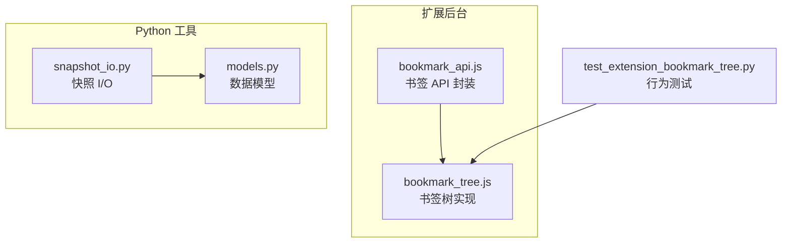
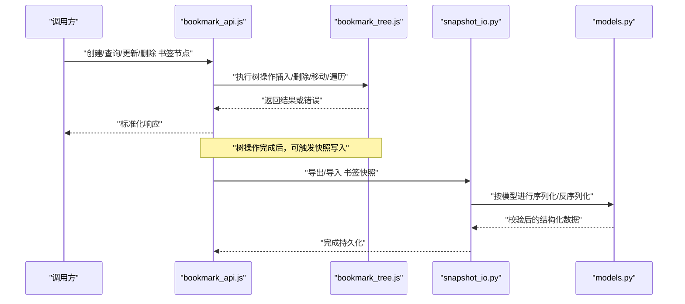
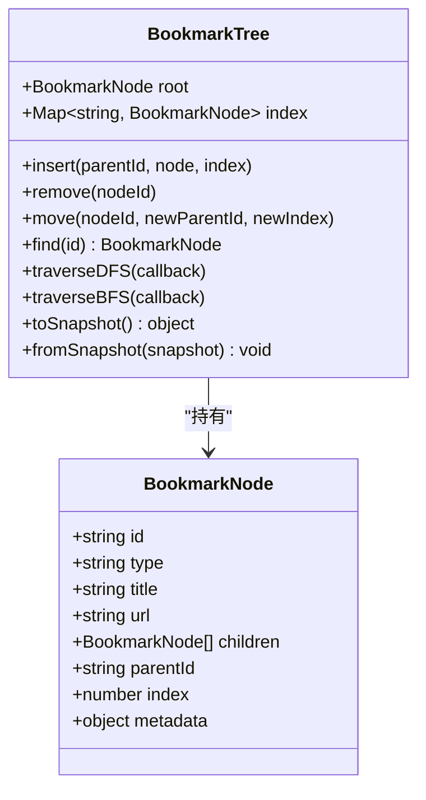
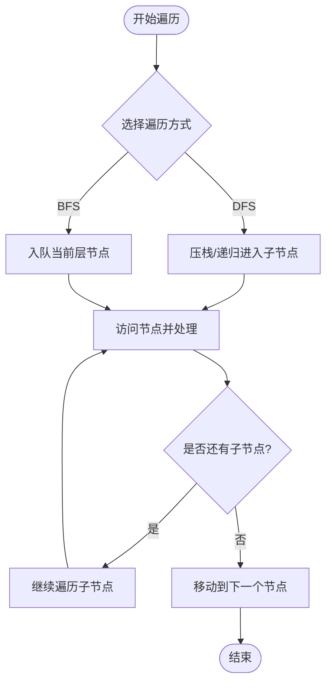
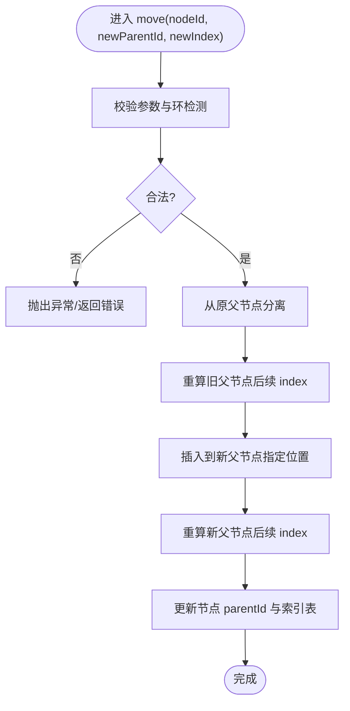
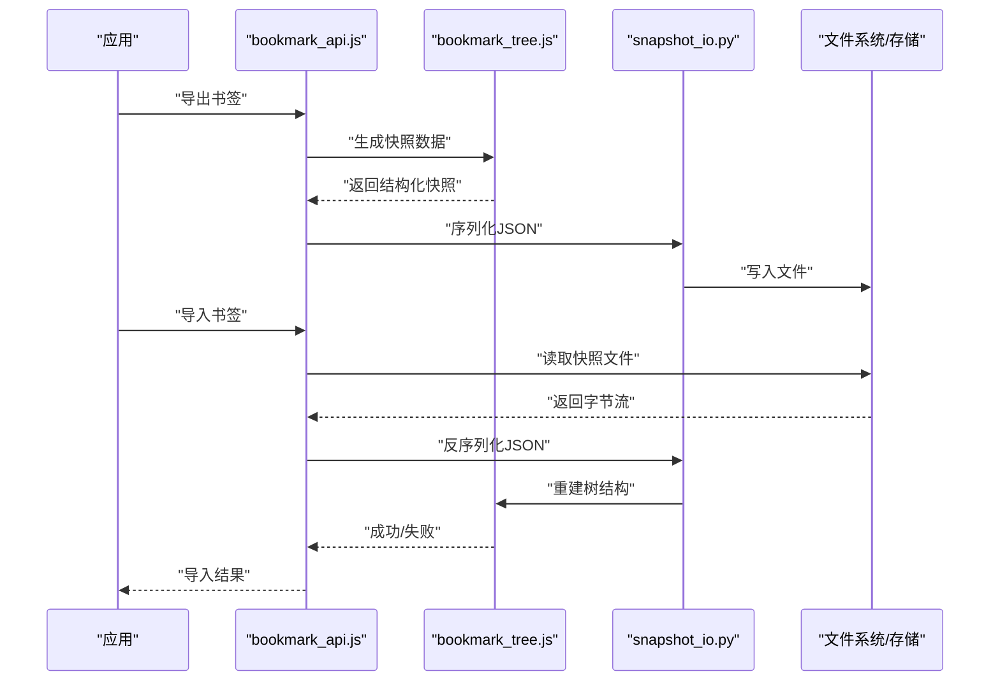
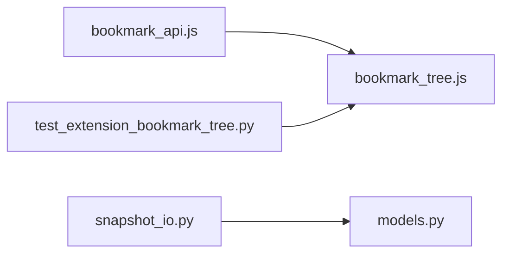

# 书签树管理

<cite>
**本文引用的文件**   
- [extension/background/bookmark_tree.js](file://extension/background/bookmark_tree.js)
- [extension/background/bookmark_api.js](file://extension/background/bookmark_api.js)
- [tests/test_extension_bookmark_tree.py](file://tests/test_extension_bookmark_tree.py)
- [src/bookmark_advisor/models.py](file://src/bookmark_advisor/models.py)
- [src/bookmark_advisor/snapshot_io.py](file://src/bookmark_advisor/snapshot_io.py)
</cite>

## 目录
1. [简介](#简介)
2. [项目结构](#项目结构)
3. [核心组件](#核心组件)
4. [架构总览](#架构总览)
5. [详细组件分析](#详细组件分析)
6. [依赖关系分析](#依赖关系分析)
7. [性能考虑](#性能考虑)
8. [故障排查指南](#故障排查指南)
9. [结论](#结论)
10. [附录：API 参考与示例](#附录api-参考与示例)

## 简介
本文件围绕“书签树管理”展开，聚焦以下目标：
- 解释书签树的数据模型设计，尤其是节点类与树形结构的维护机制。
- 说明书签节点的遍历算法（深度优先、广度优先等）。
- 阐述父子关系的建立与维护，包括插入、删除、移动对树的影响。
- 介绍缓存机制与性能优化策略。
- 解释序列化和反序列化过程，支持数据持久化。
- 提供完整的 API 参考与实际使用示例。

## 项目结构
本项目包含浏览器扩展侧的书签树实现与 Python 侧的书签快照处理模块。与书签树直接相关的核心文件如下：
- extension/background/bookmark_tree.js：书签树的内存数据结构与操作实现。
- extension/background/bookmark_api.js：对外暴露的书签 API 封装，调用底层树操作。
- tests/test_extension_bookmark_tree.py：针对书签树行为的测试用例。
- src/bookmark_advisor/models.py：Python 侧的书签数据模型定义。
- src/bookmark_advisor/snapshot_io.py：书签快照的序列化和反序列化逻辑。

图表来源
- [extension/background/bookmark_tree.js](file://extension/background/bookmark_tree.js)
- [extension/background/bookmark_api.js](file://extension/background/bookmark_api.js)
- [tests/test_extension_bookmark_tree.py](file://tests/test_extension_bookmark_tree.py)
- [src/bookmark_advisor/models.py](file://src/bookmark_advisor/models.py)
- [src/bookmark_advisor/snapshot_io.py](file://src/bookmark_advisor/snapshot_io.py)

章节来源
- [extension/background/bookmark_tree.js](file://extension/background/bookmark_tree.js)
- [extension/background/bookmark_api.js](file://extension/background/bookmark_api.js)
- [tests/test_extension_bookmark_tree.py](file://tests/test_extension_bookmark_tree.py)
- [src/bookmark_advisor/models.py](file://src/bookmark_advisor/models.py)
- [src/bookmark_advisor/snapshot_io.py](file://src/bookmark_advisor/snapshot_io.py)

## 核心组件
- 书签节点与树结构：在扩展侧由 bookmark_tree.js 提供，负责节点对象、父子关系、索引与遍历。
- 书签 API：bookmark_api.js 将浏览器书签 API 与内部树结构解耦，统一暴露增删改查、批量操作等方法。
- Python 数据模型与快照：models.py 定义跨语言一致的数据结构；snapshot_io.py 负责 JSON 序列化/反序列化，用于持久化与迁移。

章节来源
- [extension/background/bookmark_tree.js](file://extension/background/bookmark_tree.js)
- [extension/background/bookmark_api.js](file://extension/background/bookmark_api.js)
- [src/bookmark_advisor/models.py](file://src/bookmark_advisor/models.py)
- [src/bookmark_advisor/snapshot_io.py](file://src/bookmark_advisor/snapshot_io.py)

## 架构总览
下图展示了从上层 API 到树实现的调用路径，以及快照 I/O 与数据模型的交互。

图表来源
- [extension/background/bookmark_api.js](file://extension/background/bookmark_api.js)
- [extension/background/bookmark_tree.js](file://extension/background/bookmark_tree.js)
- [src/bookmark_advisor/snapshot_io.py](file://src/bookmark_advisor/snapshot_io.py)
- [src/bookmark_advisor/models.py](file://src/bookmark_advisor/models.py)

## 详细组件分析

### 书签树数据模型与节点类
- 节点属性
  - id：唯一标识符，通常来自浏览器书签 ID。
  - type：节点类型（文件夹/书签）。
  - title：显示名称。
  - url：当类型为书签时有效。
  - children：子节点列表（仅文件夹有效）。
  - parentId：父节点引用，便于快速向上查找。
  - index：在同级中的顺序，保证插入位置稳定。
  - metadata：扩展元信息（如标签、分组等）。
- 树维护
  - 根节点：通常为“书签栏”、“其他书签”等容器。
  - 索引表：以 id 为键的映射，支持 O(1) 查找。
  - 父子关系：通过 children 数组与 parentId 双向维护，确保一致性。
  - 顺序保持：插入/删除/移动后重新计算同级 index，避免错位。

章节来源
- [extension/background/bookmark_tree.js](file://extension/background/bookmark_tree.js)

#### 类图（概念映射）

图表来源
- [extension/background/bookmark_tree.js](file://extension/background/bookmark_tree.js)

### 遍历算法
- 深度优先搜索（DFS）
  - 先访问当前节点，再递归访问其子节点。
  - 适用于需要完整子树上下文的操作（如批量重命名、统计）。
- 广度优先搜索（BFS）
  - 逐层访问，适合层级相关展示或限制深度的操作。
- 迭代器与回调
  - 提供统一的遍历接口，回调函数接收节点与路径信息，便于外部定制处理逻辑。

图表来源
- [extension/background/bookmark_tree.js](file://extension/background/bookmark_tree.js)

章节来源
- [extension/background/bookmark_tree.js](file://extension/background/bookmark_tree.js)

### 父子关系维护（插入、删除、移动）
- 插入
  - 指定父节点与插入位置 index，更新被插入节点及其后续节点的 index。
  - 同步更新新节点的 parentId 与父节点的 children 列表。
- 删除
  - 从父节点 children 中移除目标节点，调整后续节点 index。
  - 清理索引表条目，必要时级联释放资源。
- 移动
  - 先从原父节点 children 移除，再插入到新父节点指定位置。
  - 更新所有受影响节点的 index 与 parentId。
  - 若涉及跨层级移动，需确保不产生环（禁止将节点移动到其自身后代下）。

图表来源
- [extension/background/bookmark_tree.js](file://extension/background/bookmark_tree.js)

章节来源
- [extension/background/bookmark_tree.js](file://extension/background/bookmark_tree.js)

### 缓存机制与性能优化
- 索引缓存
  - 以 id 为键的哈希表，O(1) 定位节点，减少全树扫描。
- 局部重算
  - 插入/删除/移动仅重算受影响区间的 index，避免整树重建。
- 惰性加载
  - 按需构建子树或延迟解析大分支，降低初始开销。
- 批量操作
  - 合并多次变更，减少中间状态与重复计算。
- 不可变快照
  - 导出快照时使用只读视图，避免并发修改导致的不一致。

章节来源
- [extension/background/bookmark_tree.js](file://extension/background/bookmark_tree.js)

### 序列化与反序列化（持久化）
- 序列化
  - 将树转换为扁平或嵌套的 JSON 结构，保留 id、type、title、url、children、parentId、index、metadata 等字段。
  - 可选压缩或分片存储，提升大体积书签的读写效率。
- 反序列化
  - 读取快照，重建索引表与父子关系，校验完整性（无环、id 唯一、parent 引用有效）。
  - 失败回滚：若校验失败，丢弃本次导入，保持原树不变。
- 版本兼容
  - 快照中包含 schema 版本，升级时做字段映射与默认值填充。

图表来源
- [extension/background/bookmark_tree.js](file://extension/background/bookmark_tree.js)
- [src/bookmark_advisor/snapshot_io.py](file://src/bookmark_advisor/snapshot_io.py)
- [src/bookmark_advisor/models.py](file://src/bookmark_advisor/models.py)

章节来源
- [extension/background/bookmark_tree.js](file://extension/background/bookmark_tree.js)
- [src/bookmark_advisor/snapshot_io.py](file://src/bookmark_advisor/snapshot_io.py)
- [src/bookmark_advisor/models.py](file://src/bookmark_advisor/models.py)

### 对外 API 参考（bookmark_api.js）
以下为典型公共方法（具体签名以源码为准）：
- createFolder(title, parentId?, options?)
- createBookmark(title, url, parentId?, options?)
- updateNode(nodeId, updates)
- deleteNode(nodeId)
- moveNode(nodeId, newParentId, newIndex)
- getDescendants(nodeId, depthLimit?)
- traverseDFS(callback)
- traverseBFS(callback)
- exportSnapshot(options?)
- importSnapshot(snapshot)
- getNodeById(nodeId)
- getParent(nodeId)
- getChildren(nodeId)

章节来源
- [extension/background/bookmark_api.js](file://extension/background/bookmark_api.js)

### 实际使用示例（步骤式）
- 创建文件夹并在其中插入书签
  - 步骤：创建文件夹 -> 获取新文件夹 id -> 在该文件夹下插入书签 -> 验证层级关系。
- 批量移动书签到新的分类
  - 步骤：遍历源文件夹 -> 收集目标书签 id -> 批量移动到目标文件夹 -> 检查 index 与父子关系。
- 导出与恢复书签
  - 步骤：导出快照 -> 保存文件 -> 在新环境导入快照 -> 校验树结构与完整性。

章节来源
- [extension/background/bookmark_api.js](file://extension/background/bookmark_api.js)
- [tests/test_extension_bookmark_tree.py](file://tests/test_extension_bookmark_tree.py)

## 依赖关系分析
- 扩展侧
  - bookmark_api.js 依赖 bookmark_tree.js 提供的树操作能力。
  - 测试用例 test_extension_bookmark_tree.py 覆盖关键路径与边界条件。
- Python 侧
  - snapshot_io.py 依赖 models.py 的结构定义，确保序列化/反序列化的一致性。

图表来源
- [extension/background/bookmark_api.js](file://extension/background/bookmark_api.js)
- [extension/background/bookmark_tree.js](file://extension/background/bookmark_tree.js)
- [tests/test_extension_bookmark_tree.py](file://tests/test_extension_bookmark_tree.py)
- [src/bookmark_advisor/snapshot_io.py](file://src/bookmark_advisor/snapshot_io.py)
- [src/bookmark_advisor/models.py](file://src/bookmark_advisor/models.py)

章节来源
- [extension/background/bookmark_api.js](file://extension/background/bookmark_api.js)
- [extension/background/bookmark_tree.js](file://extension/background/bookmark_tree.js)
- [tests/test_extension_bookmark_tree.py](file://tests/test_extension_bookmark_tree.py)
- [src/bookmark_advisor/snapshot_io.py](file://src/bookmark_advisor/snapshot_io.py)
- [src/bookmark_advisor/models.py](file://src/bookmark_advisor/models.py)

## 性能考虑
- 时间复杂度
  - 查找：O(1)（基于 id 索引）。
  - 插入/删除/移动：O(k)，k 为受影响同级节点数（重算 index）。
  - 遍历：O(n)，n 为访问节点总数。
- 空间复杂度
  - 额外索引表 O(n)。
  - 快照大小与书签数量线性相关。
- 优化建议
  - 批量操作合并提交，减少中间状态。
  - 对大分支采用惰性加载与分页遍历。
  - 导出时启用压缩与分块写入。

[本节为通用性能讨论，无需特定文件来源]

## 故障排查指南
- 常见问题
  - 环检测失败：移动时将节点移入其自身后代下，应拒绝并报错。
  - 索引错乱：插入/删除后未正确重算 index，导致同级顺序异常。
  - 快照不一致：导入时缺少必要字段或 id 冲突，需校验并回滚。
- 诊断手段
  - 打印树结构摘要（节点计数、最大深度、叶子比例）。
  - 对比导出快照与预期结构，定位差异点。
  - 使用单元测试复现问题路径，确认修复有效性。

章节来源
- [tests/test_extension_bookmark_tree.py](file://tests/test_extension_bookmark_tree.py)

## 结论
书签树管理通过清晰的节点模型与高效的树维护机制，提供了稳定的增删改查与遍历能力。配合索引缓存、局部重算与快照持久化，可在大规模书签场景下保持良好的性能与可靠性。对外 API 将复杂操作抽象为简洁接口，便于上层业务集成与扩展。

[本节为总结性内容，无需特定文件来源]

## 附录：API 参考与示例

### 公共方法与属性（bookmark_api.js）
- 创建
  - createFolder(title, parentId?, options?)
  - createBookmark(title, url, parentId?, options?)
- 查询
  - getNodeById(nodeId)
  - getParent(nodeId)
  - getChildren(nodeId)
  - getDescendants(nodeId, depthLimit?)
- 更新
  - updateNode(nodeId, updates)
- 删除
  - deleteNode(nodeId)
- 移动
  - moveNode(nodeId, newParentId, newIndex)
- 遍历
  - traverseDFS(callback)
  - traverseBFS(callback)
- 快照
  - exportSnapshot(options?)
  - importSnapshot(snapshot)

章节来源
- [extension/background/bookmark_api.js](file://extension/background/bookmark_api.js)

### 示例：复杂书签操作
- 场景：将某文件夹下的所有书签移动到另一个文件夹，并保持原有顺序
  - 步骤：
    - 获取源文件夹的子节点列表。
    - 记录每个子节点的原始 index。
    - 批量移动到目标文件夹末尾。
    - 根据原始 index 排序，依次插入目标文件夹。
    - 校验目标文件夹的子节点顺序与数量。
- 场景：导出并恢复书签，同时清理无效链接
  - 步骤：
    - 导出快照。
    - 遍历书签节点，过滤无效 URL。
    - 重建树并生成新快照。
    - 导入新快照，比较前后差异并输出报告。

章节来源
- [extension/background/bookmark_api.js](file://extension/background/bookmark_api.js)
- [tests/test_extension_bookmark_tree.py](file://tests/test_extension_bookmark_tree.py)