# 浏览器扩展开发

<cite>
**本文引用的文件**   
- [manifest.json](file://extension/manifest.json)
- [service_worker.js](file://extension/service_worker.js)
- [offscreen.html](file://extension/offscreen.html)
- [offscreen.js](file://extension/offscreen.js)
- [popup.html](file://extension/popup.html)
- [popup.js](file://extension/popup.js)
- [background/message_router.js](file://extension/background/message_router.js)
- [background/bookmark_api.js](file://extension/background/bookmark_api.js)
- [background/bookmark_tree.js](file://extension/background/bookmark_tree.js)
- [background/offscreen_client.js](file://extension/background/offscreen_client.js)
- [background/action_handlers.js](file://extension/background/action_handlers.js)
- [background/job_lifecycle.js](file://extension/background/job_lifecycle.js)
- [background/job_store.js](file://extension/background/job_store.js)
- [background/plan_executor.js](file://extension/background/plan_executor.js)
- [background/snapshot_export.js](file://extension/background/snapshot_export.js)
- [background/undo_log.js](file://extension/background/undo_log.js)
- [background/execution_policy.js](file://extension/background/execution_policy.js)
- [background/batching.js](file://extension/ai/batching.js)
- [background/fast_rules.js](file://extension/ai/fast_rules.js)
- [background/plan_compiler.js](file://extension/ai/plan_compiler.js)
- [background/prompt_codec.js](file://extension/ai/prompt_codec.js)
- [background/provider_client.js](file://extension/ai/provider_client.js)
- [background/response_codec.js](file://extension/ai/response_codec.js)
- [background/snapshot_model.js](file://extension/ai/snapshot_model.js)
- [shared/message_protocol.js](file://extension/shared/message_protocol.js)
- [shared/storage.js](file://extension/shared/storage.js)
- [shared/path_utils.js](file://extension/shared/path_utils.js)
- [shared/plan_schema.js](file://extension/shared/plan_schema.js)
- [shared/ai_endpoint.js](file://extension/shared/ai_endpoint.js)
- [popup/runtime_client.js](file://extension/popup/runtime_client.js)
- [popup/settings_store.js](file://extension/popup/settings_store.js)
- [popup/job_state.js](file://extension/popup/job_state.js)
- [popup/plan_view.js](file://extension/popup/plan_view.js)
- [popup/secrets.js](file://extension/popup/secrets.js)
- [popup/i18n.js](file://extension/popup/i18n.js)
</cite>

## 目录
1. [简介](#简介)
2. [项目结构](#项目结构)
3. [核心组件](#核心组件)
4. [架构总览](#架构总览)
5. [详细组件分析](#详细组件分析)
6. [依赖关系分析](#依赖关系分析)
7. [性能考虑](#性能考虑)
8. [故障排查指南](#故障排查指南)
9. [结论](#结论)
10. [附录](#附录)

## 简介
本指南面向使用 Manifest V3 的浏览器扩展开发者，围绕本项目实现，系统讲解以下主题：
- MV3 架构下的扩展结构：Service Worker、Popup 页面、Offscreen Document 的职责与生命周期管理
- 背景服务工作原理：消息路由机制、事件监听与异步任务处理
- 书签 API 封装：书签树读取、修改与批量操作
- 跨上下文通信：Popup 与 Background、Background 与 Offscreen 的消息传递协议
- 权限模型与安全：最小权限原则与敏感操作保护
- 调试与测试最佳实践：开发者工具使用与性能优化技巧
- 常见开发模式与实际代码示例路径

## 项目结构
扩展采用“按功能分层 + 按上下文分目录”的组织方式：
- extension/manifest.json：扩展清单，声明权限、入口脚本、页面与 offscreen 文档
- service_worker.js：MV3 背景服务（Service Worker）主入口，负责初始化、注册消息路由与事件监听
- popup.html / popup.js：用户交互界面，通过运行时 API 与 Background 通信
- offscreen.html / offscreen.js：用于需要 DOM 或特定 API 的后台任务（如导出快照等）
- background/*：背景逻辑，包括消息路由、书签 API、计划执行、作业生命周期、快照导出、撤销日志等
- shared/*：跨上下文共享协议与工具（消息协议、存储、路径、计划 Schema、AI 端点）
- ai/*：AI 相关能力（批处理、快速规则、计划编译、提示词编解码、提供者客户端、响应编解码、快照模型）

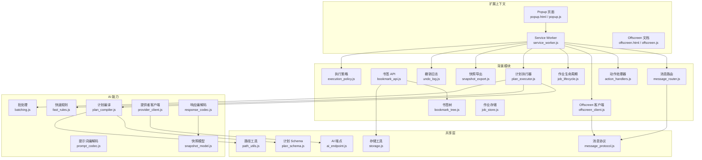

图表来源
- [manifest.json:1-200](file://extension/manifest.json#L1-L200)
- [service_worker.js:1-200](file://extension/service_worker.js#L1-L200)
- [popup.html:1-200](file://extension/popup.html#L1-L200)
- [popup.js:1-200](file://extension/popup.js#L1-L200)
- [offscreen.html:1-200](file://extension/offscreen.html#L1-L200)
- [offscreen.js:1-200](file://extension/offscreen.js#L1-L200)
- [background/message_router.js:1-200](file://extension/background/message_router.js#L1-L200)
- [background/bookmark_api.js:1-200](file://extension/background/bookmark_api.js#L1-L200)
- [background/bookmark_tree.js:1-200](file://extension/background/bookmark_tree.js#L1-L200)
- [background/offscreen_client.js:1-200](file://extension/background/offscreen_client.js#L1-L200)
- [background/action_handlers.js:1-200](file://extension/background/action_handlers.js#L1-L200)
- [background/job_lifecycle.js:1-200](file://extension/background/job_lifecycle.js#L1-L200)
- [background/job_store.js:1-200](file://extension/background/job_store.js#L1-L200)
- [background/plan_executor.js:1-200](file://extension/background/plan_executor.js#L1-L200)
- [background/snapshot_export.js:1-200](file://extension/background/snapshot_export.js#L1-L200)
- [background/undo_log.js:1-200](file://extension/background/undo_log.js#L1-L200)
- [background/execution_policy.js:1-200](file://extension/background/execution_policy.js#L1-L200)
- [shared/message_protocol.js:1-200](file://extension/shared/message_protocol.js#L1-L200)
- [shared/storage.js:1-200](file://extension/shared/storage.js#L1-L200)
- [shared/path_utils.js:1-200](file://extension/shared/path_utils.js#L1-L200)
- [shared/plan_schema.js:1-200](file://extension/shared/plan_schema.js#L1-L200)
- [shared/ai_endpoint.js:1-200](file://extension/shared/ai_endpoint.js#L1-L200)
- [ai/batching.js:1-200](file://extension/ai/batching.js#L1-L200)
- [ai/fast_rules.js:1-200](file://extension/ai/fast_rules.js#L1-L200)
- [ai/plan_compiler.js:1-200](file://extension/ai/plan_compiler.js#L1-L200)
- [ai/prompt_codec.js:1-200](file://extension/ai/prompt_codec.js#L1-L200)
- [ai/provider_client.js:1-200](file://extension/ai/provider_client.js#L1-L200)
- [ai/response_codec.js:1-200](file://extension/ai/response_codec.js#L1-L200)
- [ai/snapshot_model.js:1-200](file://extension/ai/snapshot_model.js#L1-L200)

章节来源
- [manifest.json:1-200](file://extension/manifest.json#L1-L200)
- [service_worker.js:1-200](file://extension/service_worker.js#L1-L200)
- [popup.html:1-200](file://extension/popup.html#L1-L200)
- [popup.js:1-200](file://extension/popup.js#L1-L200)
- [offscreen.html:1-200](file://extension/offscreen.html#L1-L200)
- [offscreen.js:1-200](file://extension/offscreen.js#L1-L200)

## 核心组件
- Service Worker（背景服务）
  - 职责：初始化消息路由、注册动作与事件监听、协调 Offscreen 文档、调度作业与计划执行、维护撤销日志与执行策略。
  - 关键文件：[service_worker.js](file://extension/service_worker.js)、[background/message_router.js](file://extension/background/message_router.js)、[background/action_handlers.js](file://extension/background/action_handlers.js)、[background/job_lifecycle.js](file://extension/background/job_lifecycle.js)、[background/plan_executor.js](file://extension/background/plan_executor.js)、[background/execution_policy.js](file://extension/background/execution_policy.js)
- Popup 页面
  - 职责：展示 UI、收集用户输入、发起请求、渲染结果与状态。
  - 关键文件：[popup.html](file://extension/popup.html)、[popup.js](file://extension/popup.js)、[popup/runtime_client.js](file://extension/popup/runtime_client.js)、[popup/job_state.js](file://extension/popup/job_state.js)、[popup/plan_view.js](file://extension/popup/plan_view.js)、[popup/settings_store.js](file://extension/popup/settings_store.js)、[popup/secrets.js](file://extension/popup/secrets.js)、[popup/i18n.js](file://extension/popup/i18n.js)
- Offscreen 文档
  - 职责：承载需要 DOM 或受限 API 的后台任务（例如导出快照），由 Background 按需创建与销毁。
  - 关键文件：[offscreen.html](file://extension/offscreen.html)、[offscreen.js](file://extension/offscreen.js)、[background/offscreen_client.js](file://extension/background/offscreen_client.js)
- 共享层
  - 职责：定义跨上下文消息协议、通用存储与路径工具、计划 Schema、AI 端点配置。
  - 关键文件：[shared/message_protocol.js](file://extension/shared/message_protocol.js)、[shared/storage.js](file://extension/shared/storage.js)、[shared/path_utils.js](file://extension/shared/path_utils.js)、[shared/plan_schema.js](file://extension/shared/plan_schema.js)、[shared/ai_endpoint.js](file://extension/shared/ai_endpoint.js)
- AI 能力
  - 职责：批处理、快速规则匹配、计划编译与校验、提示词与响应编解码、外部提供者调用、快照数据模型。
  - 关键文件：[ai/batching.js](file://extension/ai/batching.js)、[ai/fast_rules.js](file://extension/ai/fast_rules.js)、[ai/plan_compiler.js](file://extension/ai/plan_compiler.js)、[ai/prompt_codec.js](file://extension/ai/prompt_codec.js)、[ai/provider_client.js](file://extension/ai/provider_client.js)、[ai/response_codec.js](file://extension/ai/response_codec.js)、[ai/snapshot_model.js](file://extension/ai/snapshot_model.js)

章节来源
- [service_worker.js:1-200](file://extension/service_worker.js#L1-L200)
- [background/message_router.js:1-200](file://extension/background/message_router.js#L1-L200)
- [background/action_handlers.js:1-200](file://extension/background/action_handlers.js#L1-L200)
- [background/job_lifecycle.js:1-200](file://extension/background/job_lifecycle.js#L1-L200)
- [background/plan_executor.js:1-200](file://extension/background/plan_executor.js#L1-L200)
- [background/execution_policy.js:1-200](file://extension/background/execution_policy.js#L1-L200)
- [popup.js:1-200](file://extension/popup.js#L1-L200)
- [popup/runtime_client.js:1-200](file://extension/popup/runtime_client.js#L1-L200)
- [popup/job_state.js:1-200](file://extension/popup/job_state.js#L1-L200)
- [popup/plan_view.js:1-200](file://extension/popup/plan_view.js#L1-L200)
- [popup/settings_store.js:1-200](file://extension/popup/settings_store.js#L1-L200)
- [popup/secrets.js:1-200](file://extension/popup/secrets.js#L1-L200)
- [popup/i18n.js:1-200](file://extension/popup/i18n.js#L1-L200)
- [offscreen.js:1-200](file://extension/offscreen.js#L1-L200)
- [background/offscreen_client.js:1-200](file://extension/background/offscreen_client.js#L1-L200)
- [shared/message_protocol.js:1-200](file://extension/shared/message_protocol.js#L1-L200)
- [shared/storage.js:1-200](file://extension/shared/storage.js#L1-L200)
- [shared/path_utils.js:1-200](file://extension/shared/path_utils.js#L1-L200)
- [shared/plan_schema.js:1-200](file://extension/shared/plan_schema.js#L1-L200)
- [shared/ai_endpoint.js:1-200](file://extension/shared/ai_endpoint.js#L1-L200)
- [ai/batching.js:1-200](file://extension/ai/batching.js#L1-L200)
- [ai/fast_rules.js:1-200](file://extension/ai/fast_rules.js#L1-L200)
- [ai/plan_compiler.js:1-200](file://extension/ai/plan_compiler.js#L1-L200)
- [ai/prompt_codec.js:1-200](file://extension/ai/prompt_codec.js#L1-L200)
- [ai/provider_client.js:1-200](file://extension/ai/provider_client.js#L1-L200)
- [ai/response_codec.js:1-200](file://extension/ai/response_codec.js#L1-L200)
- [ai/snapshot_model.js:1-200](file://extension/ai/snapshot_model.js#L1-L200)

## 架构总览
下图展示了 MV3 下各上下文与模块之间的交互关系，以及消息流与控制流的关键路径。

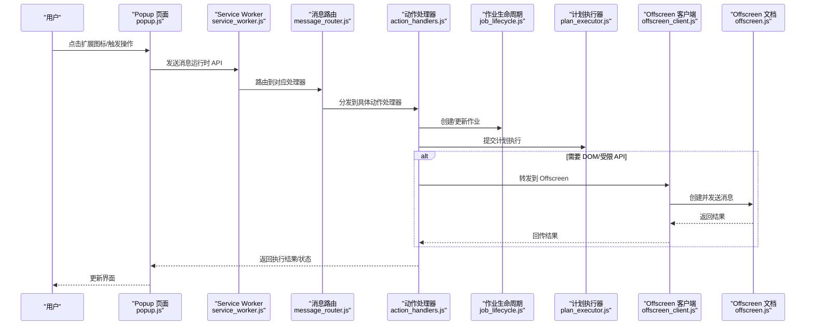

图表来源
- [service_worker.js:1-200](file://extension/service_worker.js#L1-L200)
- [background/message_router.js:1-200](file://extension/background/message_router.js#L1-L200)
- [background/action_handlers.js:1-200](file://extension/background/action_handlers.js#L1-L200)
- [background/job_lifecycle.js:1-200](file://extension/background/job_lifecycle.js#L1-L200)
- [background/plan_executor.js:1-200](file://extension/background/plan_executor.js#L1-L200)
- [background/offscreen_client.js:1-200](file://extension/background/offscreen_client.js#L1-L200)
- [offscreen.js:1-200](file://extension/offscreen.js#L1-L200)
- [popup.js:1-200](file://extension/popup.js#L1-L200)

## 详细组件分析

### Service Worker 与消息路由
- Service Worker 作为 MV3 的背景入口，负责：
  - 初始化全局消息路由
  - 注册动作与事件监听（如扩展图标点击、安装/更新等）
  - 协调 Offscreen 文档的生命周期
  - 启动作业管理与计划执行
- 消息路由将来自 Popup 或其他上下文的请求映射到具体处理器，确保单一入口与清晰职责分离。

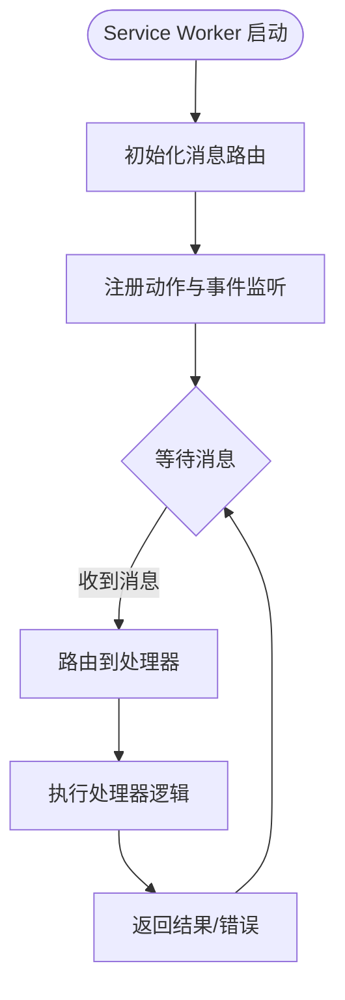

图表来源
- [service_worker.js:1-200](file://extension/service_worker.js#L1-L200)
- [background/message_router.js:1-200](file://extension/background/message_router.js#L1-L200)

章节来源
- [service_worker.js:1-200](file://extension/service_worker.js#L1-L200)
- [background/message_router.js:1-200](file://extension/background/message_router.js#L1-L200)

### Popup 与 Background 通信
- Popup 通过运行时 API 向 Service Worker 发送结构化消息，携带命令类型与参数。
- Background 根据消息协议进行解析与分发，保证跨上下文一致性与可测试性。
- 典型流程：
  - Popup 构建请求对象（包含命令、参数、可选回调标识）
  - 发送至 Background
  - Background 路由至动作处理器
  - 处理器执行业务逻辑（可能涉及书签 API、计划执行、Offscreen 调用）
  - 返回结果给 Popup，Popup 更新 UI

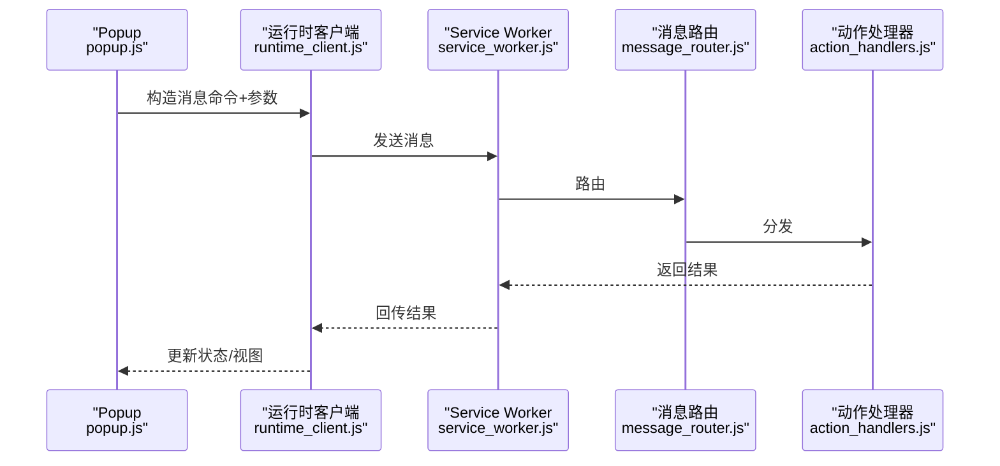

图表来源
- [popup.js:1-200](file://extension/popup.js#L1-L200)
- [popup/runtime_client.js:1-200](file://extension/popup/runtime_client.js#L1-L200)
- [service_worker.js:1-200](file://extension/service_worker.js#L1-L200)
- [background/message_router.js:1-200](file://extension/background/message_router.js#L1-L200)
- [background/action_handlers.js:1-200](file://extension/background/action_handlers.js#L1-L200)

章节来源
- [popup.js:1-200](file://extension/popup.js#L1-L200)
- [popup/runtime_client.js:1-200](file://extension/popup/runtime_client.js#L1-L200)
- [background/message_router.js:1-200](file://extension/background/message_router.js#L1-L200)
- [background/action_handlers.js:1-200](file://extension/background/action_handlers.js#L1-L200)

### Offscreen 文档与 Background 通信
- 当需要 DOM 或受限 API 时，Background 通过 Offscreen Client 创建并控制 Offscreen 文档。
- 两者通过共享消息协议进行双向通信，支持一次性调用与长连接场景。
- 典型流程：
  - Background 检查 Offscreen 是否已创建，未创建则创建
  - 发送任务消息（如导出快照）
  - Offscreen 执行任务并返回结果
  - Background 继续后续处理（如写入存储、记录撤销日志）

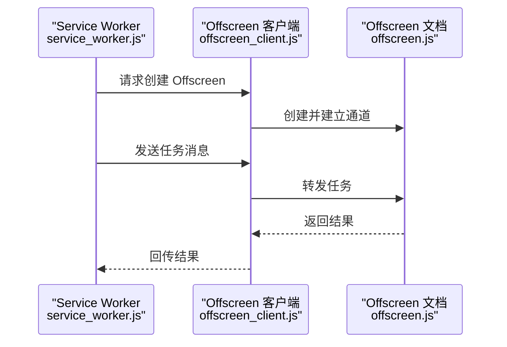

图表来源
- [background/offscreen_client.js:1-200](file://extension/background/offscreen_client.js#L1-L200)
- [offscreen.js:1-200](file://extension/offscreen.js#L1-L200)
- [service_worker.js:1-200](file://extension/service_worker.js#L1-L200)

章节来源
- [background/offscreen_client.js:1-200](file://extension/background/offscreen_client.js#L1-L200)
- [offscreen.js:1-200](file://extension/offscreen.js#L1-L200)

### 书签 API 与书签树
- 书签 API 封装提供对浏览器书签系统的统一访问，包括：
  - 读取整棵树结构
  - 查找节点、移动/复制/删除节点
  - 批量操作（合并、重排、清理）
- 书签树模块负责在内存中维护高效的数据结构与索引，以支持快速查询与变更。
- 典型流程：
  - 读取书签树（从浏览器 API 拉取）
  - 转换为内部表示（便于批量处理）
  - 应用变更（增删改）
  - 写回浏览器（事务化或分批提交）
  - 记录撤销日志以便回滚

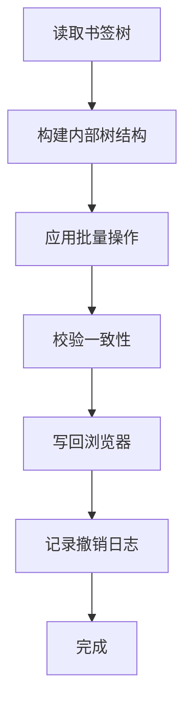

图表来源
- [background/bookmark_api.js:1-200](file://extension/background/bookmark_api.js#L1-L200)
- [background/bookmark_tree.js:1-200](file://extension/background/bookmark_tree.js#L1-L200)
- [background/undo_log.js:1-200](file://extension/background/undo_log.js#L1-L200)

章节来源
- [background/bookmark_api.js:1-200](file://extension/background/bookmark_api.js#L1-L200)
- [background/bookmark_tree.js:1-200](file://extension/background/bookmark_tree.js#L1-L200)
- [background/undo_log.js:1-200](file://extension/background/undo_log.js#L1-L200)

### 作业生命周期与计划执行
- 作业生命周期管理负责作业的创建、状态推进、失败重试与最终完成。
- 计划执行器接收编译后的计划，按步骤执行，并与书签 API、Offscreen 等协作。
- 执行策略决定并发度、超时、重试次数与幂等性保障。

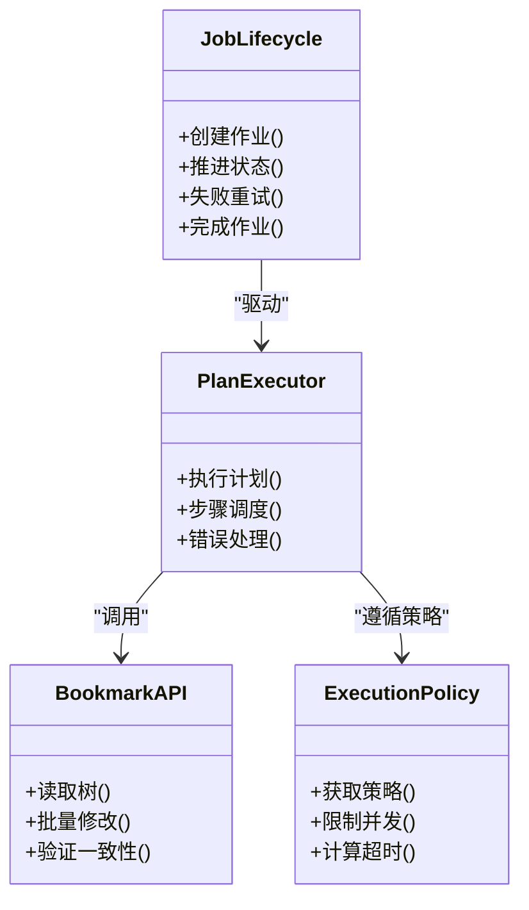

图表来源
- [background/job_lifecycle.js:1-200](file://extension/background/job_lifecycle.js#L1-L200)
- [background/plan_executor.js:1-200](file://extension/background/plan_executor.js#L1-L200)
- [background/bookmark_api.js:1-200](file://extension/background/bookmark_api.js#L1-L200)
- [background/execution_policy.js:1-200](file://extension/background/execution_policy.js#L1-L200)

章节来源
- [background/job_lifecycle.js:1-200](file://extension/background/job_lifecycle.js#L1-L200)
- [background/plan_executor.js:1-200](file://extension/background/plan_executor.js#L1-L200)
- [background/execution_policy.js:1-200](file://extension/background/execution_policy.js#L1-L200)

### 快照导出与撤销日志
- 快照导出模块负责将当前书签状态序列化为可持久化的格式，供备份或迁移使用。
- 撤销日志记录每次变更的前后状态，支持一键回滚。

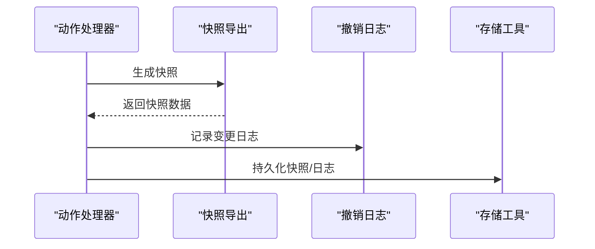

图表来源
- [background/snapshot_export.js:1-200](file://extension/background/snapshot_export.js#L1-L200)
- [background/undo_log.js:1-200](file://extension/background/undo_log.js#L1-L200)
- [shared/storage.js:1-200](file://extension/shared/storage.js#L1-L200)

章节来源
- [background/snapshot_export.js:1-200](file://extension/background/snapshot_export.js#L1-L200)
- [background/undo_log.js:1-200](file://extension/background/undo_log.js#L1-L200)
- [shared/storage.js:1-200](file://extension/shared/storage.js#L1-L200)

### AI 能力集成
- 批处理：聚合多个请求以降低网络开销与延迟抖动。
- 快速规则：基于预定义规则进行轻量决策，减少大模型调用。
- 计划编译：将高层意图编译为可执行的步骤序列，并进行 Schema 校验。
- 提示词与响应编解码：标准化输入输出格式，提升稳定性。
- 提供者客户端：封装外部 AI 服务的调用细节（认证、重试、限流）。
- 快照模型：定义快照数据结构，便于序列化与版本演进。

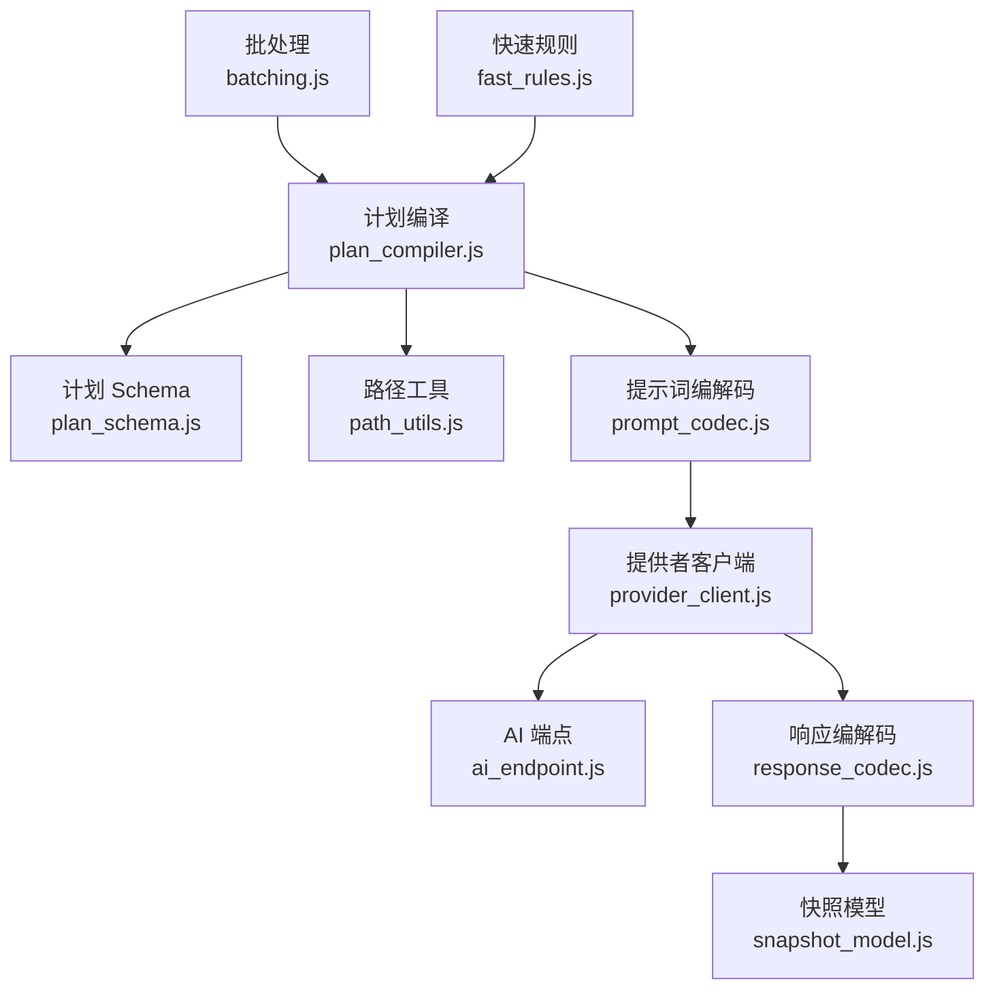

图表来源
- [ai/batching.js:1-200](file://extension/ai/batching.js#L1-L200)
- [ai/fast_rules.js:1-200](file://extension/ai/fast_rules.js#L1-L200)
- [ai/plan_compiler.js:1-200](file://extension/ai/plan_compiler.js#L1-L200)
- [ai/prompt_codec.js:1-200](file://extension/ai/prompt_codec.js#L1-L200)
- [ai/provider_client.js:1-200](file://extension/ai/provider_client.js#L1-L200)
- [ai/response_codec.js:1-200](file://extension/ai/response_codec.js#L1-L200)
- [ai/snapshot_model.js:1-200](file://extension/ai/snapshot_model.js#L1-L200)
- [shared/plan_schema.js:1-200](file://extension/shared/plan_schema.js#L1-L200)
- [shared/path_utils.js:1-200](file://extension/shared/path_utils.js#L1-L200)
- [shared/ai_endpoint.js:1-200](file://extension/shared/ai_endpoint.js#L1-L200)

章节来源
- [ai/batching.js:1-200](file://extension/ai/batching.js#L1-L200)
- [ai/fast_rules.js:1-200](file://extension/ai/fast_rules.js#L1-L200)
- [ai/plan_compiler.js:1-200](file://extension/ai/plan_compiler.js#L1-L200)
- [ai/prompt_codec.js:1-200](file://extension/ai/prompt_codec.js#L1-L200)
- [ai/provider_client.js:1-200](file://extension/ai/provider_client.js#L1-L200)
- [ai/response_codec.js:1-200](file://extension/ai/response_codec.js#L1-L200)
- [ai/snapshot_model.js:1-200](file://extension/ai/snapshot_model.js#L1-L200)
- [shared/plan_schema.js:1-200](file://extension/shared/plan_schema.js#L1-L200)
- [shared/path_utils.js:1-200](file://extension/shared/path_utils.js#L1-L200)
- [shared/ai_endpoint.js:1-200](file://extension/shared/ai_endpoint.js#L1-L200)

### 共享消息协议与存储
- 消息协议定义了跨上下文通信的命令类型、字段约束与错误码，确保 Popup、Background、Offscreen 之间的一致行为。
- 存储工具提供统一的读写接口，屏蔽底层差异（如 chrome.storage 或 IndexedDB）。

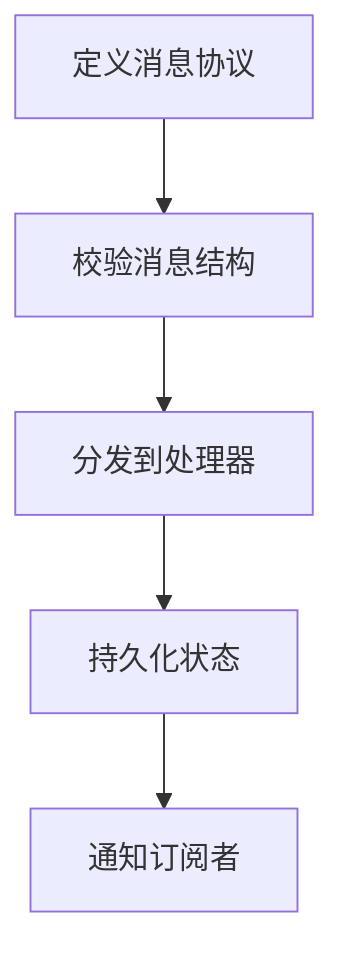

图表来源
- [shared/message_protocol.js:1-200](file://extension/shared/message_protocol.js#L1-L200)
- [shared/storage.js:1-200](file://extension/shared/storage.js#L1-L200)

章节来源
- [shared/message_protocol.js:1-200](file://extension/shared/message_protocol.js#L1-L200)
- [shared/storage.js:1-200](file://extension/shared/storage.js#L1-L200)

## 依赖关系分析
- 低耦合高内聚：
  - 消息路由与动作处理器解耦，新增命令只需注册新处理器
  - 计划执行器与书签 API 通过接口契约交互，便于替换实现
  - Offscreen 客户端抽象了创建与通信细节，降低上下文切换复杂度
- 潜在循环依赖：
  - 需避免 Action Handlers 直接依赖 Plan Executor 再反向依赖 Action Handlers
  - 建议通过消息协议与中间件层隔离
- 外部依赖：
  - 浏览器 API（书签、存储、运行时、Offscreen）
  - 外部 AI 服务（通过提供者客户端）

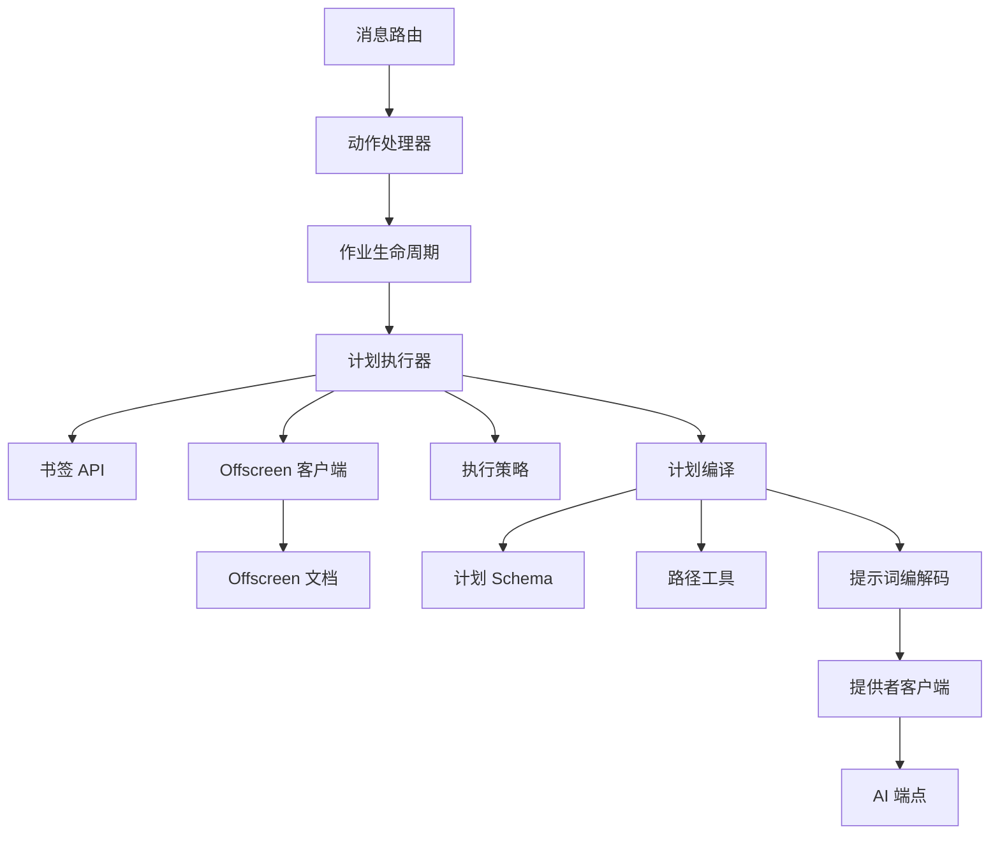

图表来源
- [background/message_router.js:1-200](file://extension/background/message_router.js#L1-L200)
- [background/action_handlers.js:1-200](file://extension/background/action_handlers.js#L1-L200)
- [background/job_lifecycle.js:1-200](file://extension/background/job_lifecycle.js#L1-L200)
- [background/plan_executor.js:1-200](file://extension/background/plan_executor.js#L1-L200)
- [background/bookmark_api.js:1-200](file://extension/background/bookmark_api.js#L1-L200)
- [background/offscreen_client.js:1-200](file://extension/background/offscreen_client.js#L1-L200)
- [offscreen.js:1-200](file://extension/offscreen.js#L1-L200)
- [background/execution_policy.js:1-200](file://extension/background/execution_policy.js#L1-L200)
- [ai/plan_compiler.js:1-200](file://extension/ai/plan_compiler.js#L1-L200)
- [shared/plan_schema.js:1-200](file://extension/shared/plan_schema.js#L1-L200)
- [shared/path_utils.js:1-200](file://extension/shared/path_utils.js#L1-L200)
- [ai/prompt_codec.js:1-200](file://extension/ai/prompt_codec.js#L1-L200)
- [ai/provider_client.js:1-200](file://extension/ai/provider_client.js#L1-L200)
- [shared/ai_endpoint.js:1-200](file://extension/shared/ai_endpoint.js#L1-L200)

章节来源
- [background/message_router.js:1-200](file://extension/background/message_router.js#L1-L200)
- [background/action_handlers.js:1-200](file://extension/background/action_handlers.js#L1-L200)
- [background/job_lifecycle.js:1-200](file://extension/background/job_lifecycle.js#L1-L200)
- [background/plan_executor.js:1-200](file://extension/background/plan_executor.js#L1-L200)
- [background/bookmark_api.js:1-200](file://extension/background/bookmark_api.js#L1-L200)
- [background/offscreen_client.js:1-200](file://extension/background/offscreen_client.js#L1-L200)
- [offscreen.js:1-200](file://extension/offscreen.js#L1-L200)
- [background/execution_policy.js:1-200](file://extension/background/execution_policy.js#L1-L200)
- [ai/plan_compiler.js:1-200](file://extension/ai/plan_compiler.js#L1-L200)
- [shared/plan_schema.js:1-200](file://extension/shared/plan_schema.js#L1-L200)
- [shared/path_utils.js:1-200](file://extension/shared/path_utils.js#L1-L200)
- [ai/prompt_codec.js:1-200](file://extension/ai/prompt_codec.js#L1-L200)
- [ai/provider_client.js:1-200](file://extension/ai/provider_client.js#L1-L200)
- [shared/ai_endpoint.js:1-200](file://extension/shared/ai_endpoint.js#L1-L200)

## 性能考虑
- 批处理与节流：
  - 使用批处理模块聚合多次调用，减少网络往返与 CPU 抖动
  - 对高频事件（如滚动、输入）进行节流与防抖
- 并发与限流：
  - 通过执行策略控制并发度与超时，避免阻塞 Service Worker
- 缓存与增量更新：
  - 对只读数据（如规则、Schema）进行缓存
  - 对书签树变更采用增量更新，避免全量重建
- Offscreen 文档复用：
  - 尽量复用已创建的 Offscreen 文档，减少创建/销毁开销
- 序列化与传输：
  - 使用紧凑的 JSON 结构，避免过大负载
  - 对大对象（如快照）采用分块传输或持久化后再引用

## 故障排查指南
- 常见问题定位：
  - 消息未到达：检查消息协议字段与路由注册是否正确
  - Offscreen 无法创建：确认权限与文档 URL 是否在白名单
  - 书签操作失败：查看撤销日志与错误码，定位不一致状态
- 调试技巧：
  - 使用浏览器开发者工具的“扩展”面板查看 Service Worker 与 Offscreen 日志
  - 在关键路径添加结构化日志（包含命令、参数、耗时、错误堆栈）
  - 使用单元测试覆盖消息路由、计划编译与书签树操作
- 恢复策略：
  - 利用撤销日志回滚到稳定状态
  - 对失败作业进行重试与降级处理

章节来源
- [background/message_router.js:1-200](file://extension/background/message_router.js#L1-L200)
- [background/undo_log.js:1-200](file://extension/background/undo_log.js#L1-L200)
- [background/execution_policy.js:1-200](file://extension/background/execution_policy.js#L1-L200)

## 结论
本指南基于实际代码库，系统梳理了 MV3 扩展的架构与实现要点。通过清晰的上下文划分、消息协议与模块化设计，扩展具备良好的可维护性与可扩展性。建议在后续迭代中持续完善错误处理、性能监控与自动化测试，以提升用户体验与稳定性。

## 附录
- 权限模型与安全
  - 最小权限原则：仅在 manifest.json 中声明所需权限，避免过度授权
  - 敏感操作保护：对高风险操作（如批量删除、导出）增加二次确认与审计日志
  - 输入校验：对所有外部输入（消息、URL、用户文本）进行严格校验与清洗
  - 安全通信：对外部 AI 服务调用启用 HTTPS 与鉴权，避免泄露密钥
- 调试与测试最佳实践
  - 使用断点与日志结合，逐步缩小问题范围
  - 编写端到端测试模拟用户操作，覆盖正常与异常路径
  - 性能基准测试评估批处理与并发策略的效果