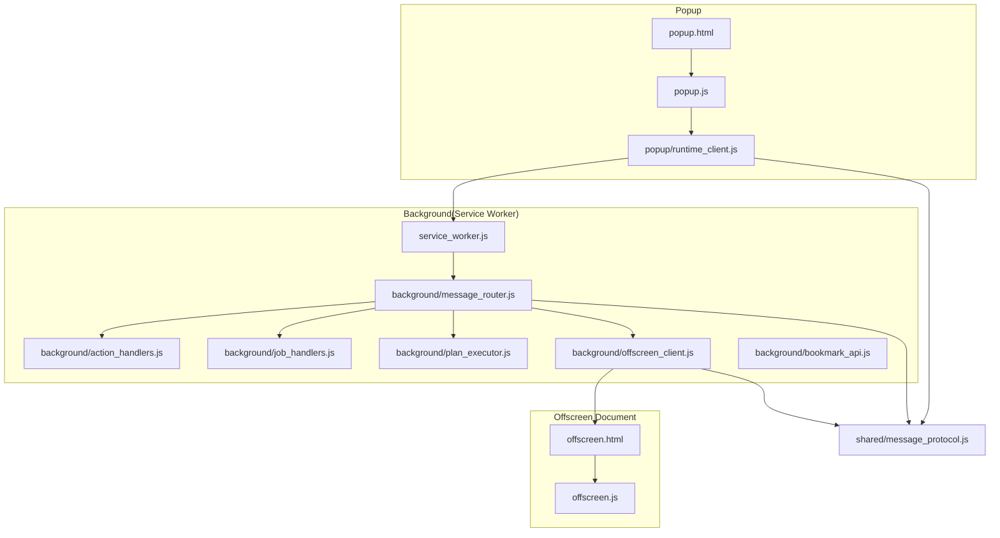
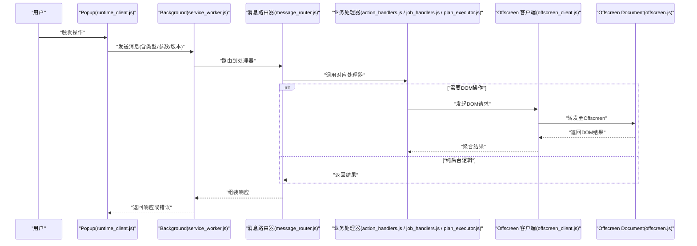
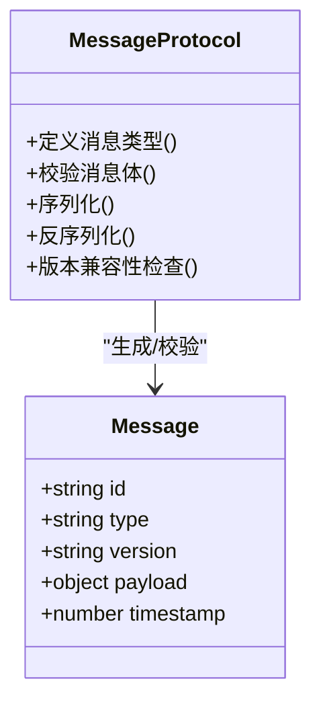
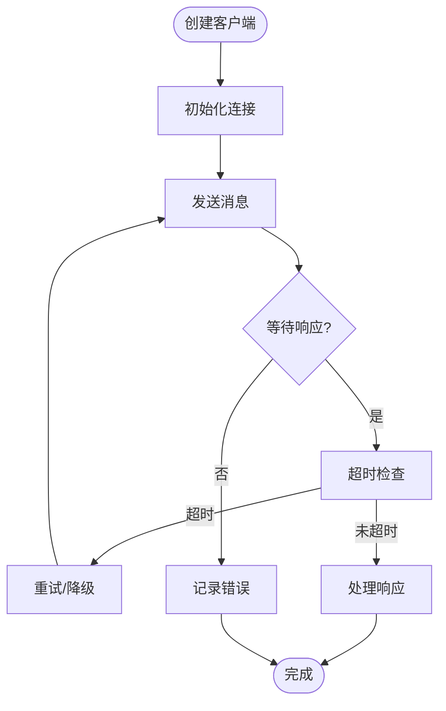
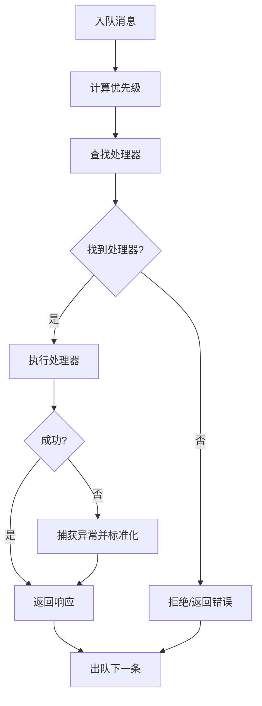
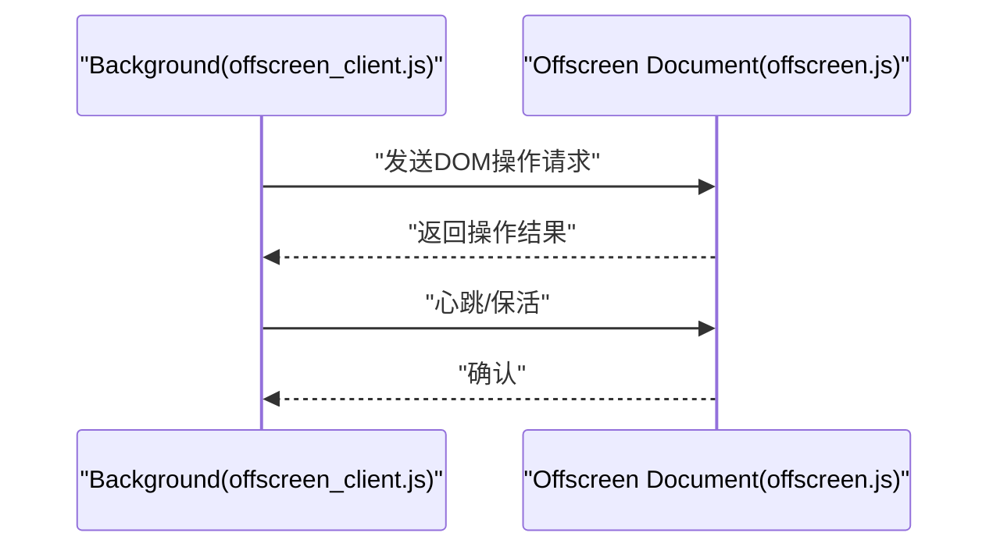
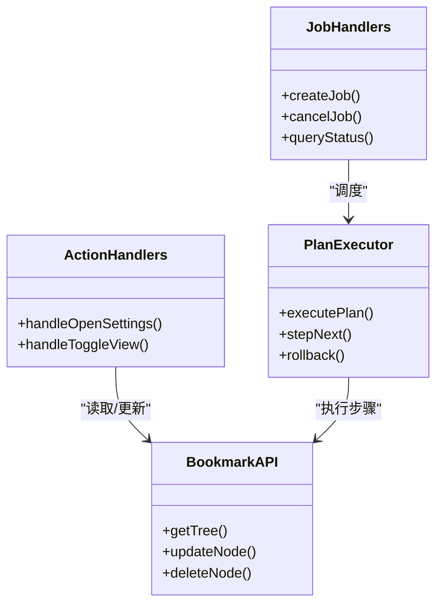
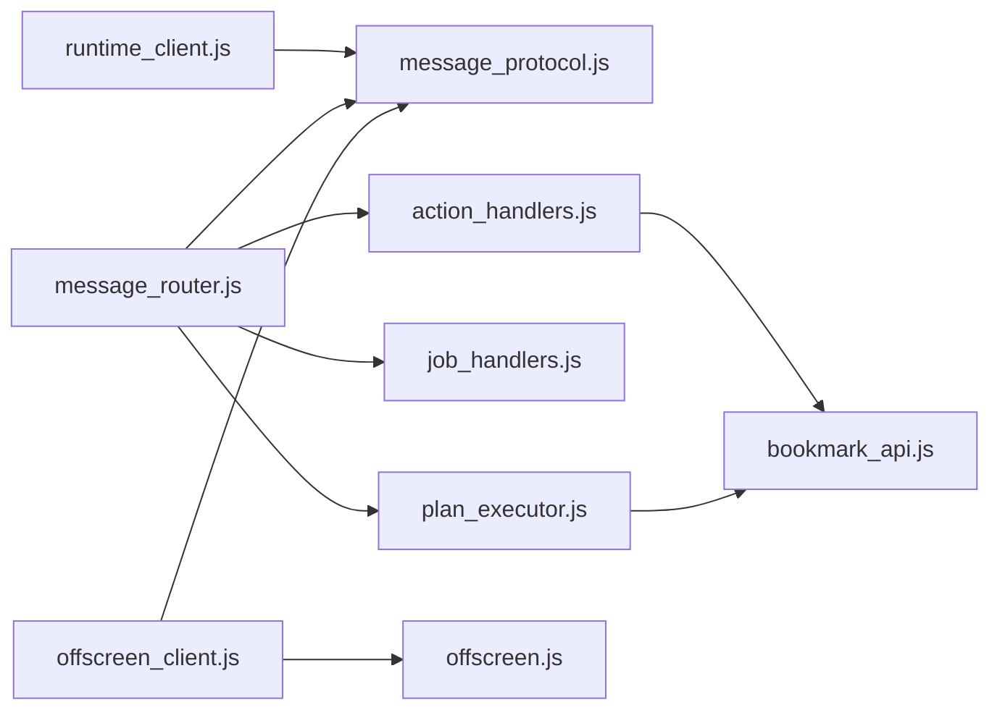

# 跨上下文通信

<cite>
**本文引用的文件**   
- [manifest.json](file://extension/manifest.json)
- [service_worker.js](file://extension/service_worker.js)
- [offscreen.html](file://extension/offscreen.html)
- [offscreen.js](file://extension/offscreen.js)
- [popup.html](file://extension/popup.html)
- [popup.js](file://extension/popup.js)
- [runtime_client.js](file://extension/popup/runtime_client.js)
- [message_protocol.js](file://extension/shared/message_protocol.js)
- [message_router.js](file://extension/background/message_router.js)
- [offscreen_client.js](file://extension/background/offscreen_client.js)
- [action_handlers.js](file://extension/background/action_handlers.js)
- [job_handlers.js](file://extension/background/job_handlers.js)
- [plan_executor.js](file://extension/background/plan_executor.js)
- [bookmark_api.js](file://extension/background/bookmark_api.js)
- [test_extension_message_router.js](file://tests/test_extension_message_router.js)
- [test_extension_offscreen_client.js](file://tests/test_extension_offscreen_client.js)
- [test_extension_popup_runtime_client.js](file://tests/test_extension_popup_runtime_client.js)
</cite>

## 目录
1. [简介](#简介)
2. [项目结构](#项目结构)
3. [核心组件](#核心组件)
4. [架构总览](#架构总览)
5. [详细组件分析](#详细组件分析)
6. [依赖关系分析](#依赖关系分析)
7. [性能考虑](#性能考虑)
8. [故障排查指南](#故障排查指南)
9. [结论](#结论)
10. [附录：消息协议规范与示例](#附录消息协议规范与示例)

## 简介
本文件系统性梳理浏览器扩展中 Popup、Background（Service Worker）、Offscreen Document 之间的跨上下文通信机制，覆盖消息协议定义、版本管理、运行时客户端实现、Offscreen Client 设计模式、消息路由与分发、错误处理与调试技巧，并给出完整的消息协议规范与实际使用示例。目标是帮助开发者在复杂扩展场景中稳定、高效地进行跨上下文协作。

## 项目结构
本项目采用分层与按功能域组织相结合的结构：
- shared：共享的消息协议、常量与工具
- background：后台逻辑（Service Worker）与 Offscreen 文档
- popup：用户界面与运行时客户端
- tests：针对关键模块的测试用例

图表来源
- [manifest.json:1-200](file://extension/manifest.json#L1-L200)
- [service_worker.js:1-200](file://extension/service_worker.js#L1-L200)
- [offscreen.html:1-200](file://extension/offscreen.html#L1-L200)
- [offscreen.js:1-200](file://extension/offscreen.js#L1-L200)
- [popup.html:1-200](file://extension/popup.html#L1-L200)
- [popup.js:1-200](file://extension/popup.js#L1-L200)
- [runtime_client.js:1-200](file://extension/popup/runtime_client.js#L1-L200)
- [message_protocol.js:1-200](file://extension/shared/message_protocol.js#L1-L200)
- [message_router.js:1-200](file://extension/background/message_router.js#L1-L200)
- [offscreen_client.js:1-200](file://extension/background/offscreen_client.js#L1-L200)

章节来源
- [manifest.json:1-200](file://extension/manifest.json#L1-L200)
- [service_worker.js:1-200](file://extension/service_worker.js#L1-L200)
- [offscreen.html:1-200](file://extension/offscreen.html#L1-L200)
- [offscreen.js:1-200](file://extension/offscreen.js#L1-L200)
- [popup.html:1-200](file://extension/popup.html#L1-L200)
- [popup.js:1-200](file://extension/popup.js#L1-L200)
- [runtime_client.js:1-200](file://extension/popup/runtime_client.js#L1-L200)
- [message_protocol.js:1-200](file://extension/shared/message_protocol.js#L1-L200)
- [message_router.js:1-200](file://extension/background/message_router.js#L1-L200)
- [offscreen_client.js:1-200](file://extension/background/offscreen_client.js#L1-L200)

## 核心组件
- 消息协议（shared/message_protocol.js）
  - 定义消息类型、字段约束、版本号与序列化策略
  - 提供校验与转换工具，确保跨上下文数据一致性
- 运行时客户端（popup/runtime_client.js）
  - 封装连接管理、请求-响应生命周期、重试与超时
  - 统一错误码与异常包装，便于上层 UI 展示
- 消息路由器（background/message_router.js）
  - 注册处理器、匹配消息类型、分派到具体业务模块
  - 维护消息队列、优先级与并发控制
- Offscreen 客户端（background/offscreen_client.js）
  - 面向 DOM 操作的代理层，封装异步调用与结果回传
  - 负责与 Offscreen Document 建立/恢复连接、心跳保活
- 业务处理器（action_handlers.js、job_handlers.js、plan_executor.js、bookmark_api.js）
  - 基于消息类型执行具体业务逻辑，读写书签、调度任务等

章节来源
- [message_protocol.js:1-200](file://extension/shared/message_protocol.js#L1-L200)
- [runtime_client.js:1-200](file://extension/popup/runtime_client.js#L1-L200)
- [message_router.js:1-200](file://extension/background/message_router.js#L1-L200)
- [offscreen_client.js:1-200](file://extension/background/offscreen_client.js#L1-L200)
- [action_handlers.js:1-200](file://extension/background/action_handlers.js#L1-L200)
- [job_handlers.js:1-200](file://extension/background/job_handlers.js#L1-L200)
- [plan_executor.js:1-200](file://extension/background/plan_executor.js#L1-L200)
- [bookmark_api.js:1-200](file://extension/background/bookmark_api.js#L1-L200)

## 架构总览
下图展示了 Popup 通过运行时客户端向 Background 发送消息，Background 的消息路由器将请求分发给相应处理器；当需要 DOM 操作时，Background 通过 Offscreen 客户端与 Offscreen Document 交互。

图表来源
- [service_worker.js:1-200](file://extension/service_worker.js#L1-L200)
- [message_router.js:1-200](file://extension/background/message_router.js#L1-L200)
- [offscreen_client.js:1-200](file://extension/background/offscreen_client.js#L1-L200)
- [offscreen.js:1-200](file://extension/offscreen.js#L1-L200)
- [action_handlers.js:1-200](file://extension/background/action_handlers.js#L1-L200)
- [job_handlers.js:1-200](file://extension/background/job_handlers.js#L1-L200)
- [plan_executor.js:1-200](file://extension/background/plan_executor.js#L1-L200)

## 详细组件分析

### 消息协议与版本管理（shared/message_protocol.js）
- 消息类型枚举与命名空间
  - 为不同上下文与业务域划分类型前缀，避免冲突
- 数据结构与字段约束
  - 每个消息体包含 id、type、version、payload、timestamp 等通用字段
  - payload 根据 type 进行差异化校验与转换
- 序列化格式
  - 统一 JSON 序列化，必要时对大对象进行压缩或分片
- 版本管理
  - 支持向后兼容的 version 字段，服务端可依据版本选择解析策略
  - 废弃字段与迁移策略由协议层集中管理

图表来源
- [message_protocol.js:1-200](file://extension/shared/message_protocol.js#L1-L200)

章节来源
- [message_protocol.js:1-200](file://extension/shared/message_protocol.js#L1-L200)

### 运行时客户端（popup/runtime_client.js）
- 连接管理
  - 自动重连、断线检测、连接池复用
- 消息发送与接收
  - 请求-响应模型，支持超时与重试
  - 批量发送与合并响应
- 错误处理
  - 统一错误码映射，网络错误、协议错误、业务错误分类
  - 可配置退避策略与降级路径

图表来源
- [runtime_client.js:1-200](file://extension/popup/runtime_client.js#L1-L200)

章节来源
- [runtime_client.js:1-200](file://extension/popup/runtime_client.js#L1-L200)

### 消息路由器（background/message_router.js）
- 处理器注册与查找
  - 基于消息类型注册处理器，支持通配与优先级
- 消息队列与调度
  - 入队、出队、优先级排序、限流与背压
- 负载均衡
  - 多实例场景下按负载分配处理器实例
- 错误传播
  - 捕获处理器异常，转换为标准错误响应

图表来源
- [message_router.js:1-200](file://extension/background/message_router.js#L1-L200)

章节来源
- [message_router.js:1-200](file://extension/background/message_router.js#L1-L200)

### Offscreen 客户端（background/offscreen_client.js）
- DOM 操作代理
  - 将 DOM API 调用封装为结构化消息，交由 Offscreen Document 执行
- 异步调用封装
  - Promise 化接口，统一错误与超时处理
- 连接与保活
  - 与 Offscreen Document 建立持久通道，心跳检测与自动恢复

图表来源
- [offscreen_client.js:1-200](file://extension/background/offscreen_client.js#L1-L200)
- [offscreen.js:1-200](file://extension/offscreen.js#L1-L200)

章节来源
- [offscreen_client.js:1-200](file://extension/background/offscreen_client.js#L1-L200)
- [offscreen.js:1-200](file://extension/offscreen.js#L1-L200)

### 业务处理器（action_handlers.js、job_handlers.js、plan_executor.js、bookmark_api.js）
- action_handlers.js：处理用户动作类消息，如打开设置、切换视图
- job_handlers.js：任务生命周期管理，包括创建、执行、取消、查询
- plan_executor.js：计划执行器，协调多个步骤与外部依赖
- bookmark_api.js：书签 API 封装，提供增删改查与树形结构访问

图表来源
- [action_handlers.js:1-200](file://extension/background/action_handlers.js#L1-L200)
- [job_handlers.js:1-200](file://extension/background/job_handlers.js#L1-L200)
- [plan_executor.js:1-200](file://extension/background/plan_executor.js#L1-L200)
- [bookmark_api.js:1-200](file://extension/background/bookmark_api.js#L1-L200)

章节来源
- [action_handlers.js:1-200](file://extension/background/action_handlers.js#L1-L200)
- [job_handlers.js:1-200](file://extension/background/job_handlers.js#L1-L200)
- [plan_executor.js:1-200](file://extension/background/plan_executor.js#L1-L200)
- [bookmark_api.js:1-200](file://extension/background/bookmark_api.js#L1-L200)

## 依赖关系分析
- 低耦合高内聚
  - 协议层独立于业务，处理器仅依赖协议与必要工具
- 直接依赖
  - runtime_client.js 依赖 message_protocol.js
  - message_router.js 依赖 message_protocol.js 与各业务处理器
  - offscreen_client.js 依赖 message_protocol.js 与 offscreen.js
- 间接依赖
  - 业务处理器可能通过 bookmark_api.js 访问存储层
- 潜在循环依赖
  - 需避免处理器之间互相引用，建议通过消息解耦

图表来源
- [runtime_client.js:1-200](file://extension/popup/runtime_client.js#L1-L200)
- [message_protocol.js:1-200](file://extension/shared/message_protocol.js#L1-L200)
- [message_router.js:1-200](file://extension/background/message_router.js#L1-L200)
- [offscreen_client.js:1-200](file://extension/background/offscreen_client.js#L1-L200)
- [offscreen.js:1-200](file://extension/offscreen.js#L1-L200)
- [action_handlers.js:1-200](file://extension/background/action_handlers.js#L1-L200)
- [job_handlers.js:1-200](file://extension/background/job_handlers.js#L1-L200)
- [plan_executor.js:1-200](file://extension/background/plan_executor.js#L1-L200)
- [bookmark_api.js:1-200](file://extension/background/bookmark_api.js#L1-L200)

章节来源
- [runtime_client.js:1-200](file://extension/popup/runtime_client.js#L1-L200)
- [message_protocol.js:1-200](file://extension/shared/message_protocol.js#L1-L200)
- [message_router.js:1-200](file://extension/background/message_router.js#L1-L200)
- [offscreen_client.js:1-200](file://extension/background/offscreen_client.js#L1-L200)
- [offscreen.js:1-200](file://extension/offscreen.js#L1-L200)
- [action_handlers.js:1-200](file://extension/background/action_handlers.js#L1-L200)
- [job_handlers.js:1-200](file://extension/background/job_handlers.js#L1-L200)
- [plan_executor.js:1-200](file://extension/background/plan_executor.js#L1-L200)
- [bookmark_api.js:1-200](file://extension/background/bookmark_api.js#L1-L200)

## 性能考虑
- 批处理与合并
  - 将多次小操作合并为批量消息，减少往返次数
- 优先级与背压
  - 高优先级消息优先处理，低优先级消息在拥塞时延迟
- 缓存与去重
  - 对幂等操作启用请求去重与结果缓存
- 序列化优化
  - 大对象分片传输，必要时启用压缩
- 连接复用
  - 保持长连接，避免频繁握手开销

[本节为通用指导，不直接分析具体文件]

## 故障排查指南
- 常见问题定位
  - 连接失败：检查运行时客户端的重连与超时配置
  - 协议不兼容：核对消息版本与字段约束
  - 处理器未注册：确认消息类型与处理器映射
  - Offscreen 不可用：验证 Offscreen 文档是否已加载且健康
- 日志与调试
  - 在消息入口与出口打印结构化日志
  - 使用测试用例复现问题，关注边界条件
- 参考测试
  - 消息路由器行为与错误路径
  - Offscreen 客户端的连接与调用流程
  - 运行时客户端的重试与超时策略

章节来源
- [test_extension_message_router.js:1-200](file://tests/test_extension_message_router.js#L1-L200)
- [test_extension_offscreen_client.js:1-200](file://tests/test_extension_offscreen_client.js#L1-L200)
- [test_extension_popup_runtime_client.js:1-200](file://tests/test_extension_popup_runtime_client.js#L1-L200)

## 结论
通过统一的协议层、健壮的运行时客户端、灵活的消息路由器与稳健的 Offscreen 客户端，本项目实现了 Popup、Background、Offscreen Document 之间的高效、可靠通信。遵循本文的最佳实践与协议规范，可在复杂业务场景中保持系统稳定性与可扩展性。

[本节为总结性内容，不直接分析具体文件]

## 附录：消息协议规范与示例

### 协议字段定义
- 通用字段
  - id：唯一标识，用于关联请求与响应
  - type：消息类型，带命名空间前缀
  - version：协议版本，用于兼容性与迁移
  - payload：业务数据，按类型定义
  - timestamp：时间戳，用于超时与排序
- 序列化格式
  - JSON，必要时对大对象进行分片或压缩

章节来源
- [message_protocol.js:1-200](file://extension/shared/message_protocol.js#L1-L200)

### 典型消息类型与用途
- 书签操作
  - 获取书签树、更新节点、删除节点
- 任务管理
  - 创建任务、取消任务、查询状态
- 计划执行
  - 执行计划、下一步、回滚
- 设置与视图
  - 打开设置、切换视图

章节来源
- [action_handlers.js:1-200](file://extension/background/action_handlers.js#L1-L200)
- [job_handlers.js:1-200](file://extension/background/job_handlers.js#L1-L200)
- [plan_executor.js:1-200](file://extension/background/plan_executor.js#L1-L200)
- [bookmark_api.js:1-200](file://extension/background/bookmark_api.js#L1-L200)

### 实际使用示例（端到端流程）
- Popup 发起“获取书签树”请求
  - runtime_client.js 构造消息并发送至 service_worker.js
  - message_router.js 路由到 bookmark_api.js
  - 返回书签树数据，runtime_client.js 解析并渲染 UI
- Popup 发起“创建任务”请求
  - 经 job_handlers.js 创建任务，返回任务 ID
  - 后续通过“查询状态”轮询或监听事件

章节来源
- [runtime_client.js:1-200](file://extension/popup/runtime_client.js#L1-L200)
- [message_router.js:1-200](file://extension/background/message_router.js#L1-L200)
- [bookmark_api.js:1-200](file://extension/background/bookmark_api.js#L1-L200)
- [job_handlers.js:1-200](file://extension/background/job_handlers.js#L1-L200)

### 最佳实践清单
- 明确消息类型与版本，避免破坏性变更
- 统一错误码与异常包装，便于前端展示
- 使用批处理与去重降低网络与 CPU 开销
- 为 Offscreen 操作设置超时与重试上限
- 在关键路径添加结构化日志与指标

[本节为通用指导，不直接分析具体文件]