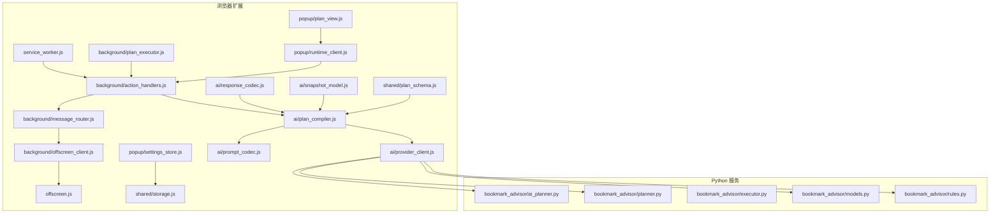
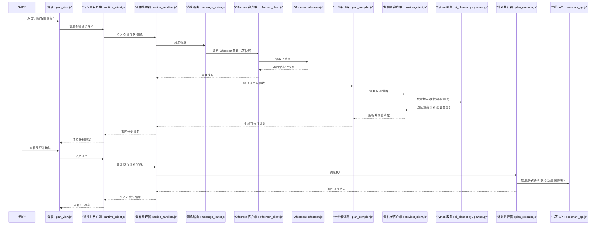
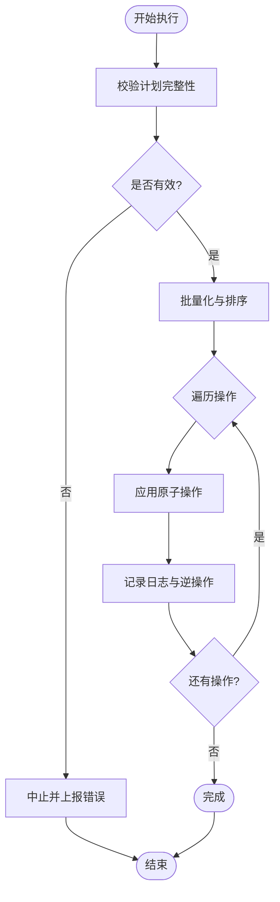
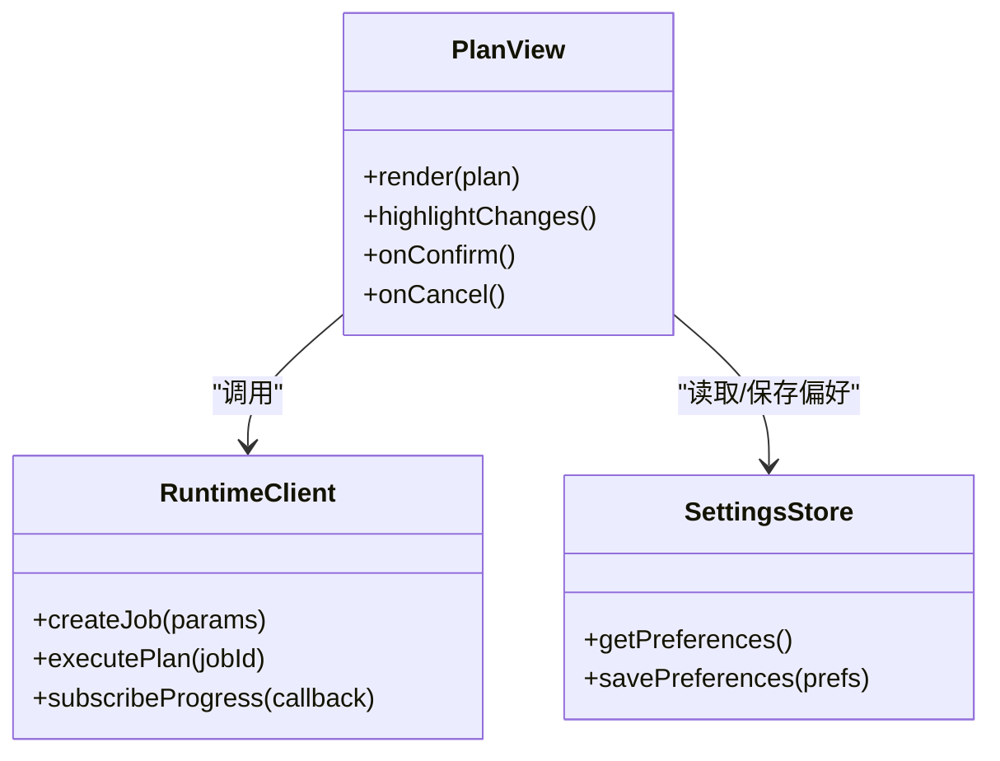
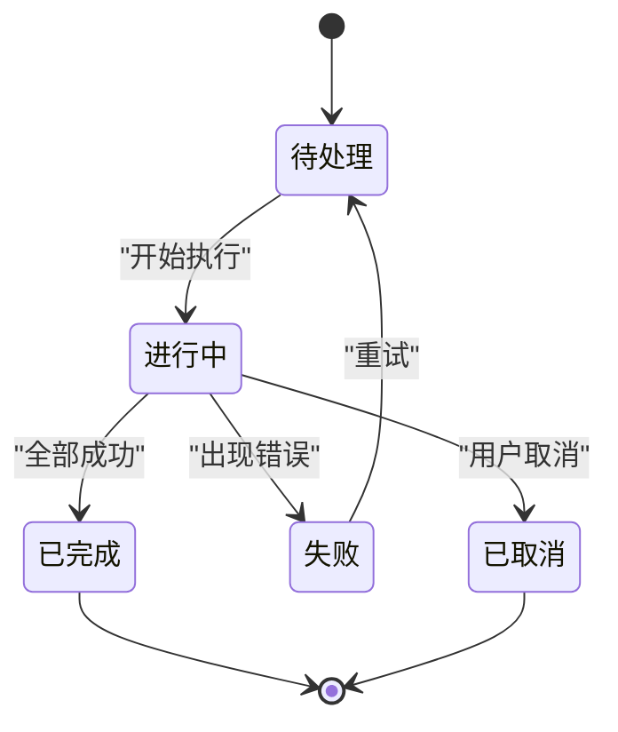
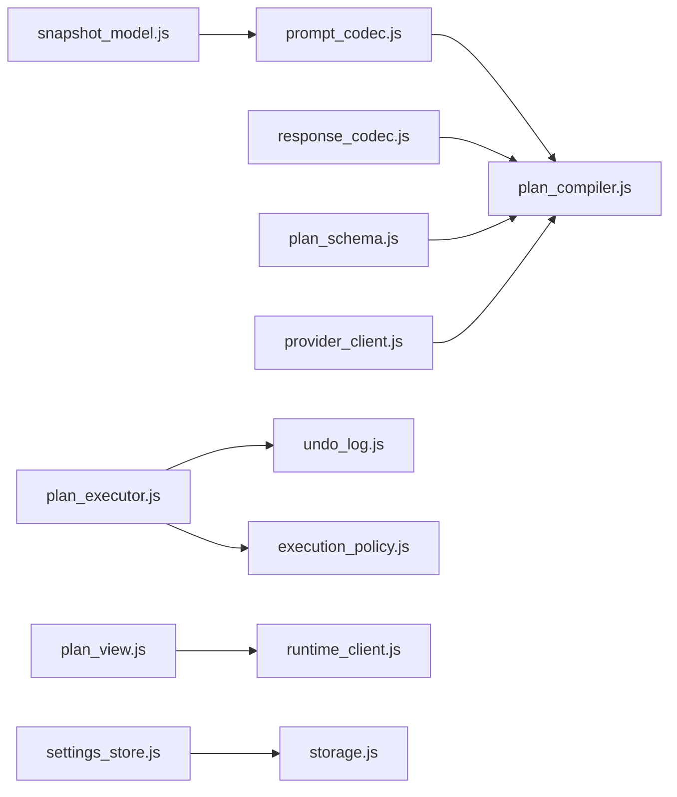

# 书签重组

<cite>
**本文引用的文件**   
- [extension/ai/batching.js](file://extension/ai/batching.js)
- [extension/ai/fast_rules.js](file://extension/ai/fast_rules.js)
- [extension/ai/plan_compiler.js](file://extension/ai/plan_compiler.js)
- [extension/ai/prompt_codec.js](file://extension/ai/prompt_codec.js)
- [extension/ai/provider_client.js](file://extension/ai/provider_client.js)
- [extension/ai/response_codec.js](file://extension/ai/response_codec.js)
- [extension/ai/snapshot_model.js](file://extension/ai/snapshot_model.js)
- [extension/background/action_handlers.js](file://extension/background/action_handlers.js)
- [extension/background/bookmark_api.js](file://extension/background/bookmark_api.js)
- [extension/background/bookmark_tree.js](file://extension/background/bookmark_tree.js)
- [extension/background/execution_policy.js](file://extension/background/execution_policy.js)
- [extension/background/job_handlers.js](file://extension/background/job_handlers.js)
- [extension/background/job_lifecycle.js](file://extension/background/job_lifecycle.js)
- [extension/background/job_store.js](file://extension/background/job_store.js)
- [extension/background/message_router.js](file://extension/background/message_router.js)
- [extension/background/offscreen_client.js](file://extension/background/offscreen_client.js)
- [extension/background/plan_executor.js](file://extension/background/plan_executor.js)
- [extension/background/snapshot_export.js](file://extension/background/snapshot_export.js)
- [extension/background/undo_log.js](file://extension/background/undo_log.js)
- [extension/popup/plan_view.js](file://extension/popup/plan_view.js)
- [extension/popup/runtime_client.js](file://extension/popup/runtime_client.js)
- [extension/popup/settings_store.js](file://extension/popup/settings_store.js)
- [extension/shared/plan_schema.js](file://extension/shared/plan_schema.js)
- [extension/shared/storage.js](file://extension/shared/storage.js)
- [extension/ai_planner.js](file://extension/ai_planner.js)
- [extension/fast_rules.json](file://extension/fast_rules.json)
- [extension/service_worker.js](file://extension/service_worker.js)
- [extension/offscreen.js](file://extension/offscreen.js)
- [src/bookmark_advisor/ai_planner.py](file://src/bookmark_advisor/ai_planner.py)
- [src/bookmark_advisor/planner.py](file://src/bookmark_advisor/planner.py)
- [src/bookmark_advisor/executor.py](file://src/bookmark_advisor/executor.py)
- [src/bookmark_advisor/models.py](file://src/bookmark_advisor/models.py)
- [src/bookmark_advisor/rules.py](file://src/bookmark_advisor/rules.py)
- [skills/bookmark-reorg/SKILL.md](file://skills/bookmark-reorg/SKILL.md)
</cite>

## 目录
1. [简介](#简介)
2. [项目结构](#项目结构)
3. [核心组件](#核心组件)
4. [架构总览](#架构总览)
5. [详细组件分析](#详细组件分析)
6. [依赖关系分析](#依赖关系分析)
7. [性能考虑](#性能考虑)
8. [故障排查指南](#故障排查指南)
9. [结论](#结论)
10. [附录](#附录)

## 简介
本指南面向希望使用“AI 驱动的智能书签重组”功能的用户与开发者。内容涵盖：
- AI 如何理解当前书签结构并生成优化建议
- 如何触发分析、预览重组计划、确认执行
- 不同场景下的重组策略（按主题分类、按使用频率整理、清理重复等）
- 自定义规则与偏好设置（命名约定、层级深度限制、特殊处理）
- 重组前后对比示例与最佳实践

## 项目结构
本项目由浏览器扩展与 Python 服务端两部分组成，围绕“快照—规划—执行—回滚”的闭环工作流展开。

图表来源
- [extension/service_worker.js](file://extension/service_worker.js)
- [extension/offscreen.js](file://extension/offscreen.js)
- [extension/background/action_handlers.js](file://extension/background/action_handlers.js)
- [extension/background/message_router.js](file://extension/background/message_router.js)
- [extension/background/offscreen_client.js](file://extension/background/offscreen_client.js)
- [extension/ai/plan_compiler.js](file://extension/ai/plan_compiler.js)
- [extension/ai/prompt_codec.js](file://extension/ai/prompt_codec.js)
- [extension/ai/provider_client.js](file://extension/ai/provider_client.js)
- [extension/ai/response_codec.js](file://extension/ai/response_codec.js)
- [extension/ai/snapshot_model.js](file://extension/ai/snapshot_model.js)
- [extension/background/plan_executor.js](file://extension/background/plan_executor.js)
- [extension/popup/plan_view.js](file://extension/popup/plan_view.js)
- [extension/popup/runtime_client.js](file://extension/popup/runtime_client.js)
- [extension/popup/settings_store.js](file://extension/popup/settings_store.js)
- [extension/shared/storage.js](file://extension/shared/storage.js)
- [extension/shared/plan_schema.js](file://extension/shared/plan_schema.js)
- [src/bookmark_advisor/ai_planner.py](file://src/bookmark_advisor/ai_planner.py)
- [src/bookmark_advisor/planner.py](file://src/bookmark_advisor/planner.py)
- [src/bookmark_advisor/executor.py](file://src/bookmark_advisor/executor.py)
- [src/bookmark_advisor/models.py](file://src/bookmark_advisor/models.py)
- [src/bookmark_advisor/rules.py](file://src/bookmark_advisor/rules.py)

章节来源
- [extension/service_worker.js](file://extension/service_worker.js)
- [extension/offscreen.js](file://extension/offscreen.js)
- [extension/background/action_handlers.js](file://extension/background/action_handlers.js)
- [extension/background/message_router.js](file://extension/background/message_router.js)
- [extension/background/offscreen_client.js](file://extension/background/offscreen_client.js)
- [extension/ai/plan_compiler.js](file://extension/ai/plan_compiler.js)
- [extension/ai/prompt_codec.js](file://extension/ai/prompt_codec.js)
- [extension/ai/provider_client.js](file://extension/ai/provider_client.js)
- [extension/ai/response_codec.js](file://extension/ai/response_codec.js)
- [extension/ai/snapshot_model.js](file://extension/ai/snapshot_model.js)
- [extension/background/plan_executor.js](file://extension/background/plan_executor.js)
- [extension/popup/plan_view.js](file://extension/popup/plan_view.js)
- [extension/popup/runtime_client.js](file://extension/popup/runtime_client.js)
- [extension/popup/settings_store.js](file://extension/popup/settings_store.js)
- [extension/shared/storage.js](file://extension/shared/storage.js)
- [extension/shared/plan_schema.js](file://extension/shared/plan_schema.js)
- [src/bookmark_advisor/ai_planner.py](file://src/bookmark_advisor/ai_planner.py)
- [src/bookmark_advisor/planner.py](file://src/bookmark_advisor/planner.py)
- [src/bookmark_advisor/executor.py](file://src/bookmark_advisor/executor.py)
- [src/bookmark_advisor/models.py](file://src/bookmark_advisor/models.py)
- [src/bookmark_advisor/rules.py](file://src/bookmark_advisor/rules.py)

## 核心组件
- 快照与模型
  - 将当前书签树导出为结构化快照，供 AI 分析与规划。
  - 提供统一的模型定义，确保前后端数据一致性。
- 提示与响应编解码
  - 将书签快照与用户偏好编码为 AI 可理解的提示；对返回结果进行校验与反序列化。
- 计划编译与执行
  - 将 AI 输出的高层意图编译为原子操作序列；在沙箱环境中安全执行，支持撤销。
- 交互界面
  - 弹窗视图用于展示计划、变更预览与确认；运行时客户端负责与后台通信。
- 规则与策略
  - 内置快速规则与可扩展规则集，支持按主题、频率、去重等策略。
- 任务与生命周期
  - 基于任务的异步编排，包含状态管理、重试、取消与日志记录。

章节来源
- [extension/ai/snapshot_model.js](file://extension/ai/snapshot_model.js)
- [extension/ai/prompt_codec.js](file://extension/ai/prompt_codec.js)
- [extension/ai/response_codec.js](file://extension/ai/response_codec.js)
- [extension/ai/plan_compiler.js](file://extension/ai/plan_compiler.js)
- [extension/background/plan_executor.js](file://extension/background/plan_executor.js)
- [extension/popup/plan_view.js](file://extension/popup/plan_view.js)
- [extension/popup/runtime_client.js](file://extension/popup/runtime_client.js)
- [extension/ai/fast_rules.js](file://extension/ai/fast_rules.js)
- [extension/fast_rules.json](file://extension/fast_rules.json)
- [extension/background/job_handlers.js](file://extension/background/job_handlers.js)
- [extension/background/job_lifecycle.js](file://extension/background/job_lifecycle.js)
- [extension/background/job_store.js](file://extension/background/job_store.js)
- [src/bookmark_advisor/models.py](file://src/bookmark_advisor/models.py)
- [src/bookmark_advisor/rules.py](file://src/bookmark_advisor/rules.py)

## 架构总览
下图展示了从“触发分析”到“预览—确认—执行—回滚”的端到端流程。

图表来源
- [extension/popup/plan_view.js](file://extension/popup/plan_view.js)
- [extension/popup/runtime_client.js](file://extension/popup/runtime_client.js)
- [extension/background/action_handlers.js](file://extension/background/action_handlers.js)
- [extension/background/message_router.js](file://extension/background/message_router.js)
- [extension/background/offscreen_client.js](file://extension/background/offscreen_client.js)
- [extension/offscreen.js](file://extension/offscreen.js)
- [extension/ai/plan_compiler.js](file://extension/ai/plan_compiler.js)
- [extension/ai/provider_client.js](file://extension/ai/provider_client.js)
- [src/bookmark_advisor/ai_planner.py](file://src/bookmark_advisor/ai_planner.py)
- [src/bookmark_advisor/planner.py](file://src/bookmark_advisor/planner.py)
- [extension/background/plan_executor.js](file://extension/background/plan_executor.js)
- [extension/background/bookmark_api.js](file://extension/background/bookmark_api.js)

## 详细组件分析

### 组件一：AI 提示与响应编解码
- 作用
  - 将书签快照与用户偏好编码为结构化提示，确保 AI 能准确理解上下文。
  - 对 AI 返回的计划进行严格校验与反序列化，防止非法或危险操作进入执行阶段。
- 关键点
  - 提示模板包含：当前书签树结构、用户偏好（如命名约定、层级深度）、目标策略（主题/频率/去重）。
  - 响应校验包括：节点路径合法性、目标文件夹存在性、操作类型白名单。
- 典型输入/输出
  - 输入：快照对象 + 配置项
  - 输出：经过校验的重组计划（节点级操作序列）

章节来源
- [extension/ai/prompt_codec.js](file://extension/ai/prompt_codec.js)
- [extension/ai/response_codec.js](file://extension/ai/response_codec.js)
- [extension/ai/snapshot_model.js](file://extension/ai/snapshot_model.js)
- [extension/shared/plan_schema.js](file://extension/shared/plan_schema.js)

### 组件二：计划编译与执行
- 计划编译
  - 将 AI 的高层意图转换为具体可执行的原子操作列表，并进行二次校验。
  - 支持批量合并与冲突检测，减少不必要的 I/O。
- 计划执行
  - 在沙箱中顺序执行，每步操作具备幂等性与可撤销能力。
  - 通过执行策略控制并发度、失败重试与超时。
- 撤销机制
  - 记录每一步操作的逆操作，支持一键回滚至重组前状态。

图表来源
- [extension/ai/plan_compiler.js](file://extension/ai/plan_compiler.js)
- [extension/background/plan_executor.js](file://extension/background/plan_executor.js)
- [extension/background/execution_policy.js](file://extension/background/execution_policy.js)
- [extension/background/undo_log.js](file://extension/background/undo_log.js)

章节来源
- [extension/ai/plan_compiler.js](file://extension/ai/plan_compiler.js)
- [extension/background/plan_executor.js](file://extension/background/plan_executor.js)
- [extension/background/execution_policy.js](file://extension/background/execution_policy.js)
- [extension/background/undo_log.js](file://extension/background/undo_log.js)

### 组件三：弹窗预览与确认
- 计划预览
  - 以树形结构展示新增/移动/删除等操作，支持折叠与高亮变更节点。
  - 显示影响范围统计（涉及文件夹数、节点数、潜在风险点）。
- 确认机制
  - 用户需显式确认后才允许执行；支持部分选择执行与跳过高风险操作。
  - 执行过程中实时反馈进度与异常信息。

图表来源
- [extension/popup/plan_view.js](file://extension/popup/plan_view.js)
- [extension/popup/runtime_client.js](file://extension/popup/runtime_client.js)
- [extension/popup/settings_store.js](file://extension/popup/settings_store.js)

章节来源
- [extension/popup/plan_view.js](file://extension/popup/plan_view.js)
- [extension/popup/runtime_client.js](file://extension/popup/runtime_client.js)
- [extension/popup/settings_store.js](file://extension/popup/settings_store.js)

### 组件四：任务与生命周期
- 任务创建
  - 前端发起任务创建，后台分配唯一 ID 并初始化状态。
- 状态流转
  - 包含待处理、进行中、已完成、失败、已取消等状态，持久化存储。
- 回调与通知
  - 通过消息通道向弹窗推送进度与结果，支持轮询与事件两种模式。

图表来源
- [extension/background/job_handlers.js](file://extension/background/job_handlers.js)
- [extension/background/job_lifecycle.js](file://extension/background/job_lifecycle.js)
- [extension/background/job_store.js](file://extension/background/job_store.js)

章节来源
- [extension/background/job_handlers.js](file://extension/background/job_handlers.js)
- [extension/background/job_lifecycle.js](file://extension/background/job_lifecycle.js)
- [extension/background/job_store.js](file://extension/background/job_store.js)

### 组件五：规则与策略
- 快速规则
  - 内置常用策略（如按主题归类、按访问频率整理、清理重复），可通过 JSON 配置启用/禁用。
- 可扩展规则
  - 支持在 Python 侧实现更复杂的语义规则，例如识别站点域、提取关键词、合并相似标题。
- 偏好设置
  - 命名约定（如“部门/项目/资料”）、层级深度上限、忽略特定标签或 URL 模式。

章节来源
- [extension/ai/fast_rules.js](file://extension/ai/fast_rules.js)
- [extension/fast_rules.json](file://extension/fast_rules.json)
- [src/bookmark_advisor/rules.py](file://src/bookmark_advisor/rules.py)
- [extension/popup/settings_store.js](file://extension/popup/settings_store.js)

### 组件六：Python 服务（AI 规划与执行）
- AI 规划
  - 接收结构化提示与快照，结合规则与模型，输出高层重组计划。
- 执行器
  - 在服务端也可独立执行计划，便于离线批处理与审计。
- 模型与数据契约
  - 统一的数据模型确保前后端一致，避免歧义。

章节来源
- [src/bookmark_advisor/ai_planner.py](file://src/bookmark_advisor/ai_planner.py)
- [src/bookmark_advisor/planner.py](file://src/bookmark_advisor/planner.py)
- [src/bookmark_advisor/executor.py](file://src/bookmark_advisor/executor.py)
- [src/bookmark_advisor/models.py](file://src/bookmark_advisor/models.py)

## 依赖关系分析
- 模块内聚与耦合
  - 提示/响应编解码与计划编译紧密耦合，形成稳定的“输入—校验—输出”管线。
  - 执行器与书签 API 解耦，通过原子操作接口隔离副作用。
- 外部依赖
  - AI 提供者通过抽象客户端接入，便于替换后端服务。
  - 存储与持久化通过共享模块统一管理。

图表来源
- [extension/ai/prompt_codec.js](file://extension/ai/prompt_codec.js)
- [extension/ai/plan_compiler.js](file://extension/ai/plan_compiler.js)
- [extension/ai/snapshot_model.js](file://extension/ai/snapshot_model.js)
- [extension/ai/response_codec.js](file://extension/ai/response_codec.js)
- [extension/shared/plan_schema.js](file://extension/shared/plan_schema.js)
- [extension/ai/provider_client.js](file://extension/ai/provider_client.js)
- [extension/background/plan_executor.js](file://extension/background/plan_executor.js)
- [extension/background/undo_log.js](file://extension/background/undo_log.js)
- [extension/background/execution_policy.js](file://extension/background/execution_policy.js)
- [extension/popup/plan_view.js](file://extension/popup/plan_view.js)
- [extension/popup/runtime_client.js](file://extension/popup/runtime_client.js)
- [extension/popup/settings_store.js](file://extension/popup/settings_store.js)
- [extension/shared/storage.js](file://extension/shared/storage.js)

章节来源
- [extension/ai/prompt_codec.js](file://extension/ai/prompt_codec.js)
- [extension/ai/plan_compiler.js](file://extension/ai/plan_compiler.js)
- [extension/ai/snapshot_model.js](file://extension/ai/snapshot_model.js)
- [extension/ai/response_codec.js](file://extension/ai/response_codec.js)
- [extension/shared/plan_schema.js](file://extension/shared/plan_schema.js)
- [extension/ai/provider_client.js](file://extension/ai/provider_client.js)
- [extension/background/plan_executor.js](file://extension/background/plan_executor.js)
- [extension/background/undo_log.js](file://extension/background/undo_log.js)
- [extension/background/execution_policy.js](file://extension/background/execution_policy.js)
- [extension/popup/plan_view.js](file://extension/popup/plan_view.js)
- [extension/popup/runtime_client.js](file://extension/popup/runtime_client.js)
- [extension/popup/settings_store.js](file://extension/popup/settings_store.js)
- [extension/shared/storage.js](file://extension/shared/storage.js)

## 性能考虑
- 批处理与合并
  - 将相邻的同类操作合并，降低书签 API 调用次数。
- 增量快照
  - 仅对变更区域重新计算，减少提示长度与网络传输开销。
- 并发与限流
  - 通过执行策略控制并发度，避免阻塞 UI 线程。
- 缓存与复用
  - 对频繁使用的规则与模板进行缓存，提升响应速度。

[本节为通用指导，不直接分析具体文件]

## 故障排查指南
- 常见问题
  - 计划校验失败：检查目标路径是否存在、操作类型是否在白名单内。
  - 执行中断：查看任务日志与撤销日志，定位失败步骤。
  - 网络异常：确认 AI 提供者可达性与鉴权配置。
- 诊断工具
  - 任务状态查询与历史回放
  - 计划预览中的“风险点”提示
  - 执行策略开关（重试次数、超时时间）

章节来源
- [extension/background/job_handlers.js](file://extension/background/job_handlers.js)
- [extension/background/job_lifecycle.js](file://extension/background/job_lifecycle.js)
- [extension/background/plan_executor.js](file://extension/background/plan_executor.js)
- [extension/background/undo_log.js](file://extension/background/undo_log.js)
- [extension/ai/provider_client.js](file://extension/ai/provider_client.js)

## 结论
通过“快照—规划—执行—回滚”的闭环设计，本功能在保证安全与可控的前提下，利用 AI 的智能理解能力，帮助用户高效地组织与管理大量书签。配合灵活的规则与偏好设置，可在多种场景下获得一致的优质体验。

[本节为总结性内容，不直接分析具体文件]

## 附录

### 使用流程速览
- 触发分析
  - 在弹窗中点击“开始智能重组”，系统自动抓取书签快照并生成提示。
- 预览与确认
  - 查看计划预览，关注变更范围与风险提示；确认后执行。
- 执行与回滚
  - 执行过程实时反馈；若出现问题，可使用撤销恢复。

章节来源
- [extension/popup/plan_view.js](file://extension/popup/plan_view.js)
- [extension/popup/runtime_client.js](file://extension/popup/runtime_client.js)
- [extension/background/plan_executor.js](file://extension/background/plan_executor.js)
- [extension/background/undo_log.js](file://extension/background/undo_log.js)

### 场景化策略指导
- 按主题分类
  - 适用：书签数量大且杂乱无章
  - 建议：启用“按主题归类”规则，设定顶层分类（如工作/学习/生活），限制层级深度不超过三级。
- 按使用频率整理
  - 适用：长期积累导致高频与低频混杂
  - 建议：开启“按访问频率分层”，将高频放入快捷区，低频归档至历史文件夹。
- 清理重复书签
  - 适用：多次收藏同一资源
  - 建议：启用“去重合并”，保留最新或最完整条目，删除冗余链接。

章节来源
- [extension/ai/fast_rules.js](file://extension/ai/fast_rules.js)
- [extension/fast_rules.json](file://extension/fast_rules.json)
- [skills/bookmark-reorg/SKILL.md](file://skills/bookmark-reorg/SKILL.md)

### 自定义规则与偏好设置
- 命名约定
  - 推荐采用“领域/子域/资源类型”三段式命名，避免过长名称。
- 层级深度限制
  - 建议最大深度为 3–4 层，超过时自动扁平化或归档。
- 特殊处理规则
  - 忽略特定域名或标签；对敏感站点保持原状不动。
- 偏好存储
  - 通过设置面板保存，重启后仍生效。

章节来源
- [extension/popup/settings_store.js](file://extension/popup/settings_store.js)
- [extension/shared/storage.js](file://extension/shared/storage.js)
- [extension/ai/fast_rules.js](file://extension/ai/fast_rules.js)
- [extension/fast_rules.json](file://extension/fast_rules.json)

### 重组前后对比示例（说明）
- 重组前
  - 根目录下大量无序书签，同名不同源，层级过深。
- 重组后
  - 按主题划分顶层文件夹，二级按用途细分，三级存放具体资源；重复项合并，低频归档。
- 效果评估
  - 查找效率提升、误删风险降低、维护成本下降。

[本节为概念性示例，不直接分析具体文件]

### 最佳实践建议
- 先预览再执行：务必审阅计划预览，必要时手动调整。
- 小步快跑：分批次执行，逐步验证效果。
- 定期维护：每月进行一次轻量重组，避免一次性大规模改动。
- 备份优先：在执行前导出快照，以便紧急恢复。

[本节为通用指导，不直接分析具体文件]