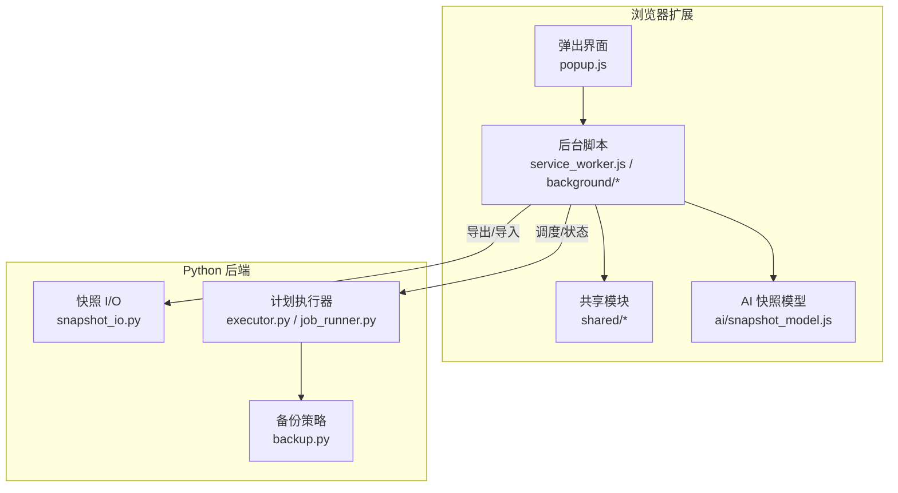
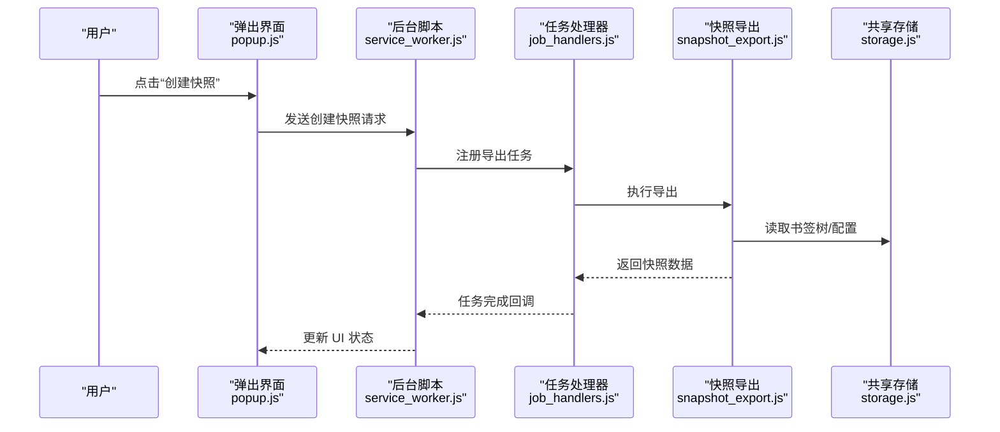
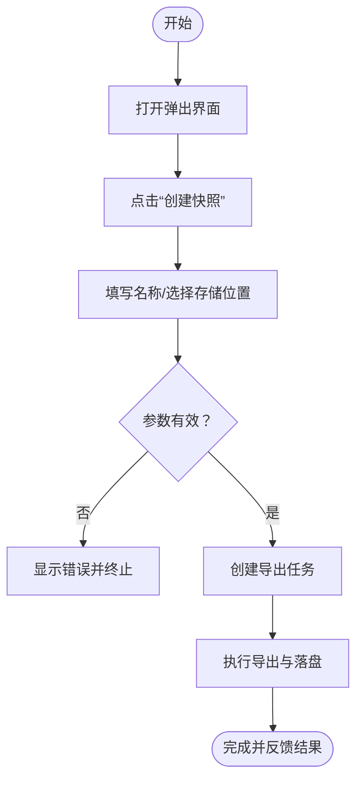
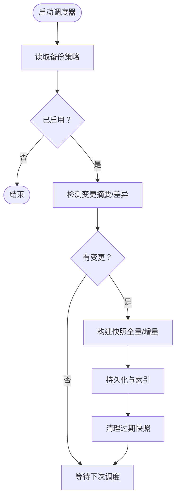
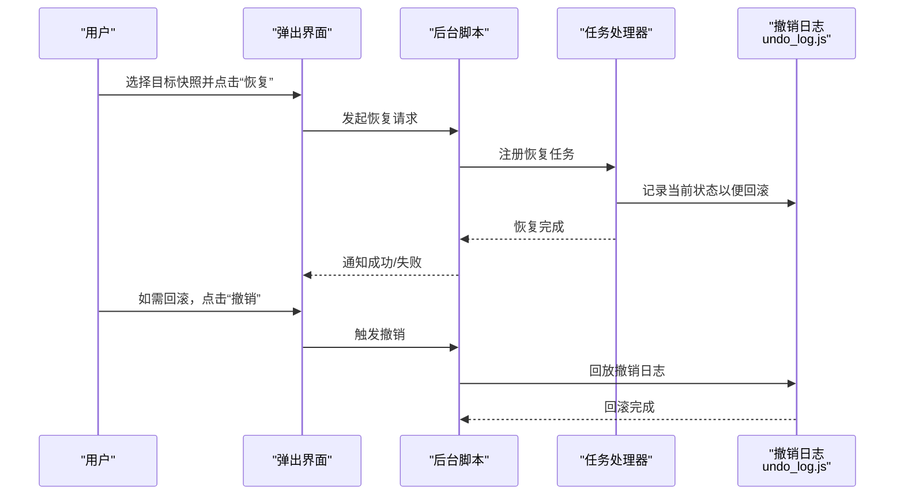
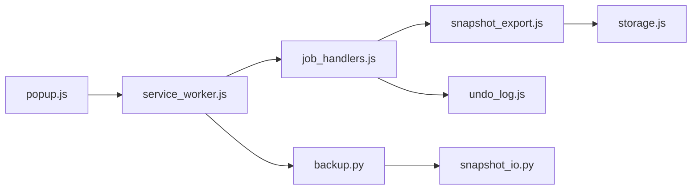

# 快照管理

<cite>
**本文引用的文件**   
- [README.md](file://README.md)
- [extension/background/snapshot_export.js](file://extension/background/snapshot_export.js)
- [src/bookmark_advisor/snapshot_io.py](file://src/bookmark_advisor/snapshot_io.py)
- [src/bookmark_advisor/backup.py](file://src/bookmark_advisor/backup.py)
- [extension/shared/storage.js](file://extension/shared/storage.js)
- [extension/popup/settings_store.js](file://extension/popup/settings_store.js)
- [extension/background/job_handlers.js](file://extension/background/job_handlers.js)
- [extension/background/job_lifecycle.js](file://extension/background/job_lifecycle.js)
- [extension/background/undo_log.js](file://extension/background/undo_log.js)
- [extension/ai/snapshot_model.js](file://extension/ai/snapshot_model.js)
- [tests/test_extension_background_snapshot.py](file://tests/test_extension_background_snapshot.py)
</cite>

## 目录
1. [简介](#简介)
2. [项目结构](#项目结构)
3. [核心组件](#核心组件)
4. [架构总览](#架构总览)
5. [详细组件分析](#详细组件分析)
6. [依赖关系分析](#依赖关系分析)
7. [性能考虑](#性能考虑)
8. [故障排查指南](#故障排查指南)
9. [结论](#结论)
10. [附录](#附录)

## 简介
本指南面向书签管理与自动化任务的用户与开发者，系统性说明“书签快照”的概念、数据内容、版本与兼容性策略，以及手动创建、自动备份、恢复流程、安全与隐私建议，并给出典型使用场景。文档同时提供架构图与流程图，帮助快速理解从浏览器扩展到后端处理的数据流与控制流。

## 项目结构
本项目包含浏览器扩展（前端）与 Python 后端两部分：
- 扩展侧负责采集书签树、导出快照、触发任务、持久化设置与撤销日志等。
- 后端提供快照 I/O、备份策略、计划执行与报告等能力。

图表来源
- [extension/background/snapshot_export.js](file://extension/background/snapshot_export.js)
- [src/bookmark_advisor/snapshot_io.py](file://src/bookmark_advisor/snapshot_io.py)
- [src/bookmark_advisor/backup.py](file://src/bookmark_advisor/backup.py)
- [extension/ai/snapshot_model.js](file://extension/ai/snapshot_model.js)

章节来源
- [README.md](file://README.md)

## 核心组件
- 快照导出与存储（扩展侧）
  - 负责将当前书签树序列化为结构化快照，写入本地存储或外部路径，并记录元信息（时间戳、版本、摘要）。
  - 参考实现位置：[extension/background/snapshot_export.js](file://extension/background/snapshot_export.js)
- 快照 I/O 与格式（后端）
  - 定义快照文件格式、读写接口、校验与兼容层，确保跨版本可读性。
  - 参考实现位置：[src/bookmark_advisor/snapshot_io.py](file://src/bookmark_advisor/snapshot_io.py)
- 备份策略与增量（后端）
  - 支持定时备份、变更检测与增量快照生成，便于长期保留与空间优化。
  - 参考实现位置：[src/bookmark_advisor/backup.py](file://src/bookmark_advisor/backup.py)
- 设置与持久化（扩展侧）
  - 保存用户偏好（如快照命名规则、存储位置、是否启用自动备份等）。
  - 参考实现位置：[extension/popup/settings_store.js](file://extension/popup/settings_store.js)、[extension/shared/storage.js](file://extension/shared/storage.js)
- 任务编排与生命周期（扩展侧）
  - 通过任务系统协调快照导出、导入、恢复等操作，并提供进度与错误上报。
  - 参考实现位置：[extension/background/job_handlers.js](file://extension/background/job_handlers.js)、[extension/background/job_lifecycle.js](file://extension/background/job_lifecycle.js)
- 撤销日志（扩展侧）
  - 为恢复操作提供细粒度回滚能力，保障数据安全。
  - 参考实现位置：[extension/background/undo_log.js](file://extension/background/undo_log.js)
- AI 快照模型（扩展侧）
  - 用于与 AI 组件交互的快照数据结构与编解码。
  - 参考实现位置：[extension/ai/snapshot_model.js](file://extension/ai/snapshot_model.js)

章节来源
- [extension/background/snapshot_export.js](file://extension/background/snapshot_export.js)
- [src/bookmark_advisor/snapshot_io.py](file://src/bookmark_advisor/snapshot_io.py)
- [src/bookmark_advisor/backup.py](file://src/bookmark_advisor/backup.py)
- [extension/popup/settings_store.js](file://extension/popup/settings_store.js)
- [extension/shared/storage.js](file://extension/shared/storage.js)
- [extension/background/job_handlers.js](file://extension/background/job_handlers.js)
- [extension/background/job_lifecycle.js](file://extension/background/job_lifecycle.js)
- [extension/background/undo_log.js](file://extension/background/undo_log.js)
- [extension/ai/snapshot_model.js](file://extension/ai/snapshot_model.js)

## 架构总览
下图展示一次“手动创建快照”的端到端调用链：从弹出界面触发，经后台脚本与共享存储，最终由快照导出模块完成序列化与落盘。

图表来源
- [extension/background/snapshot_export.js](file://extension/background/snapshot_export.js)
- [extension/shared/storage.js](file://extension/shared/storage.js)
- [extension/background/job_handlers.js](file://extension/background/job_handlers.js)

## 详细组件分析

### 快照概念与数据内容
- 概念与作用
  - 快照是对某一时刻书签集合及其结构的完整描述，用于备份、迁移、对比与恢复。
  - 在团队协作中，快照可作为“数据契约”，保证成员间对同一时间点书签状态的共识。
- 数据内容
  - 节点层级与属性（标题、URL、分组等）、时间戳、版本号、摘要哈希等元信息。
  - 可选：标签、备注、访问统计等扩展字段（取决于具体实现）。
- 版本管理与兼容性
  - 快照包含明确的版本标识；I/O 层提供向后兼容读取逻辑，允许旧版工具读取新版快照（在合理范围内）。
  - 升级时若引入破坏性变更，应在导出前进行转换或提示用户。

章节来源
- [src/bookmark_advisor/snapshot_io.py](file://src/bookmark_advisor/snapshot_io.py)
- [extension/ai/snapshot_model.js](file://extension/ai/snapshot_model.js)

### 手动创建快照
- 触发时机
  - 重大变更前、批量整理后、协作交接前、定期归档时。
- 操作步骤（概念流程）
  - 打开弹出界面，选择“创建快照”。
  - 输入快照名称（建议包含日期与变更主题）。
  - 选择存储位置（本地目录或受控共享位置）。
  - 确认并等待任务完成，查看结果与摘要。
- 命名规范建议
  - 采用“YYYYMMDD_主题_vX.Y.Z”形式，便于检索与排序。
- 存储位置配置
  - 可在设置中指定默认导出路径或目录模板，支持相对/绝对路径与环境变量替换（依实现而定）。

章节来源
- [extension/background/snapshot_export.js](file://extension/background/snapshot_export.js)
- [extension/popup/settings_store.js](file://extension/popup/settings_store.js)
- [extension/shared/storage.js](file://extension/shared/storage.js)
- [extension/background/job_handlers.js](file://extension/background/job_handlers.js)

### 自动备份策略
- 定时备份
  - 可配置周期（每日/每周/每月），在空闲时段执行，避免影响浏览体验。
- 变更检测
  - 基于快照摘要或差异比对，仅在检测到变化时生成新快照，减少冗余。
- 增量备份
  - 仅保存自上次快照以来的变更部分，配合基线快照实现高效恢复。
- 策略配置项（示例）
  - 启用开关、间隔时间、最大保留数量、是否启用增量、变更阈值等。

章节来源
- [src/bookmark_advisor/backup.py](file://src/bookmark_advisor/backup.py)
- [extension/popup/settings_store.js](file://extension/popup/settings_store.js)

### 快照恢复流程
- 浏览快照
  - 列出可用快照，按时间/版本/大小排序，查看元信息与摘要。
- 差异对比
  - 选择两个快照进行对比，高亮新增、删除、修改的节点。
- 选择性恢复
  - 勾选需要恢复的节点或子树，应用变更并生成撤销日志。
- 完全恢复
  - 以目标快照为准覆盖当前书签树，适用于灾难恢复。
- 撤销与回滚
  - 所有恢复操作均记录撤销日志，支持一键回滚至上一状态。

图表来源
- [extension/background/job_handlers.js](file://extension/background/job_handlers.js)
- [extension/background/undo_log.js](file://extension/background/undo_log.js)

章节来源
- [extension/background/job_handlers.js](file://extension/background/job_handlers.js)
- [extension/background/job_lifecycle.js](file://extension/background/job_lifecycle.js)
- [extension/background/undo_log.js](file://extension/background/undo_log.js)

### 数据安全与隐私保护
- 本地存储安全
  - 将快照保存在受保护的目录，限制非授权访问；避免放置在公共共享文件夹。
- 敏感信息处理
  - 建议在导出前移除或脱敏包含密码、令牌等敏感信息的 URL 查询参数或备注。
- 备份文件加密
  - 对导出的快照文件进行加密存储，密钥由用户保管；传输过程使用安全通道。
- 权限最小化
  - 仅授予必要的文件系统与网络权限；定期审计权限与访问日志。

章节来源
- [extension/popup/settings_store.js](file://extension/popup/settings_store.js)
- [extension/shared/storage.js](file://extension/shared/storage.js)

### 实际使用场景
- 重大变更前备份
  - 在执行大规模重组或迁移前，先创建全量快照，必要时开启增量策略以跟踪后续变更。
- 团队协作时的数据共享
  - 团队约定统一的快照命名与存放位置，作为协作基线；合并冲突时以差异对比为依据。
- 日常维护与归档
  - 启用定时备份与保留策略，定期清理过期快照，保持存储空间可控。

章节来源
- [src/bookmark_advisor/backup.py](file://src/bookmark_advisor/backup.py)
- [extension/background/snapshot_export.js](file://extension/background/snapshot_export.js)

## 依赖关系分析
- 组件耦合
  - 弹出界面依赖后台脚本与任务处理器；后台脚本依赖快照导出与共享存储；后端快照 I/O 与备份策略相互独立但共同服务于任务执行器。
- 关键依赖链
  - 导出：popup → service_worker → job_handlers → snapshot_export → storage
  - 恢复：popup → service_worker → job_handlers → undo_log
  - 备份：scheduler → backup → snapshot_io

图表来源
- [extension/background/snapshot_export.js](file://extension/background/snapshot_export.js)
- [extension/shared/storage.js](file://extension/shared/storage.js)
- [extension/background/job_handlers.js](file://extension/background/job_handlers.js)
- [extension/background/undo_log.js](file://extension/background/undo_log.js)
- [src/bookmark_advisor/backup.py](file://src/bookmark_advisor/backup.py)
- [src/bookmark_advisor/snapshot_io.py](file://src/bookmark_advisor/snapshot_io.py)

章节来源
- [extension/background/snapshot_export.js](file://extension/background/snapshot_export.js)
- [extension/shared/storage.js](file://extension/shared/storage.js)
- [extension/background/job_handlers.js](file://extension/background/job_handlers.js)
- [extension/background/undo_log.js](file://extension/background/undo_log.js)
- [src/bookmark_advisor/backup.py](file://src/bookmark_advisor/backup.py)
- [src/bookmark_advisor/snapshot_io.py](file://src/bookmark_advisor/snapshot_io.py)

## 性能考虑
- 增量优先
  - 在频繁变更场景下优先使用增量快照，降低 I/O 与 CPU 开销。
- 并发与批处理
  - 大书签树导出时采用分批处理与异步任务，避免阻塞主线程。
- 压缩与去重
  - 对快照文件进行压缩；对重复节点进行去重以减少体积。
- 缓存与索引
  - 建立快照索引，加速浏览与对比；对常用元信息做缓存。

## 故障排查指南
- 常见问题
  - 导出失败：检查存储路径权限、磁盘空间与文件名合法性。
  - 恢复失败：核对快照版本与当前工具兼容性，查看撤销日志是否完整。
  - 自动备份未触发：确认调度器运行状态与策略配置。
- 定位手段
  - 查看任务状态与错误码；导出/导入前后打印摘要哈希以验证一致性。
  - 使用单元测试辅助复现问题。

章节来源
- [tests/test_extension_background_snapshot.py](file://tests/test_extension_background_snapshot.py)

## 结论
快照管理为书签数据的稳定与可追溯提供了基础保障。通过明确的数据结构、严格的版本与兼容性策略、灵活的备份与恢复机制，以及完善的安全与隐私措施，用户可以在复杂工作流中从容应对变更与协作需求。建议结合团队规范与最佳实践，持续优化快照策略与操作流程。

## 附录
- 术语
  - 快照：某时刻书签集合的结构化描述。
  - 增量快照：仅包含自上次快照以来变更的部分。
  - 撤销日志：记录操作序列以支持回滚。
- 参考实现路径
  - 导出：[extension/background/snapshot_export.js](file://extension/background/snapshot_export.js)
  - I/O 与格式：[src/bookmark_advisor/snapshot_io.py](file://src/bookmark_advisor/snapshot_io.py)
  - 备份策略：[src/bookmark_advisor/backup.py](file://src/bookmark_advisor/backup.py)
  - 设置与持久化：[extension/popup/settings_store.js](file://extension/popup/settings_store.js)、[extension/shared/storage.js](file://extension/shared/storage.js)
  - 任务与撤销：[extension/background/job_handlers.js](file://extension/background/job_handlers.js)、[extension/background/undo_log.js](file://extension/background/undo_log.js)
  - AI 快照模型：[extension/ai/snapshot_model.js](file://extension/ai/snapshot_model.js)