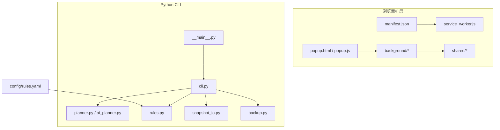
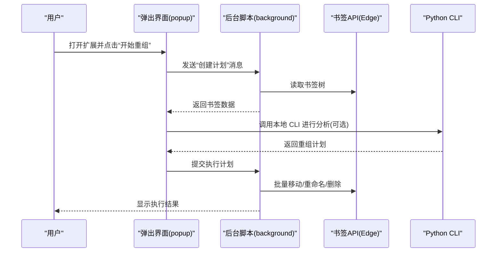
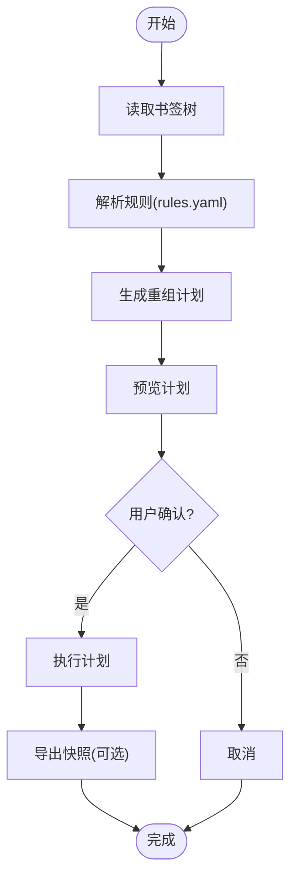
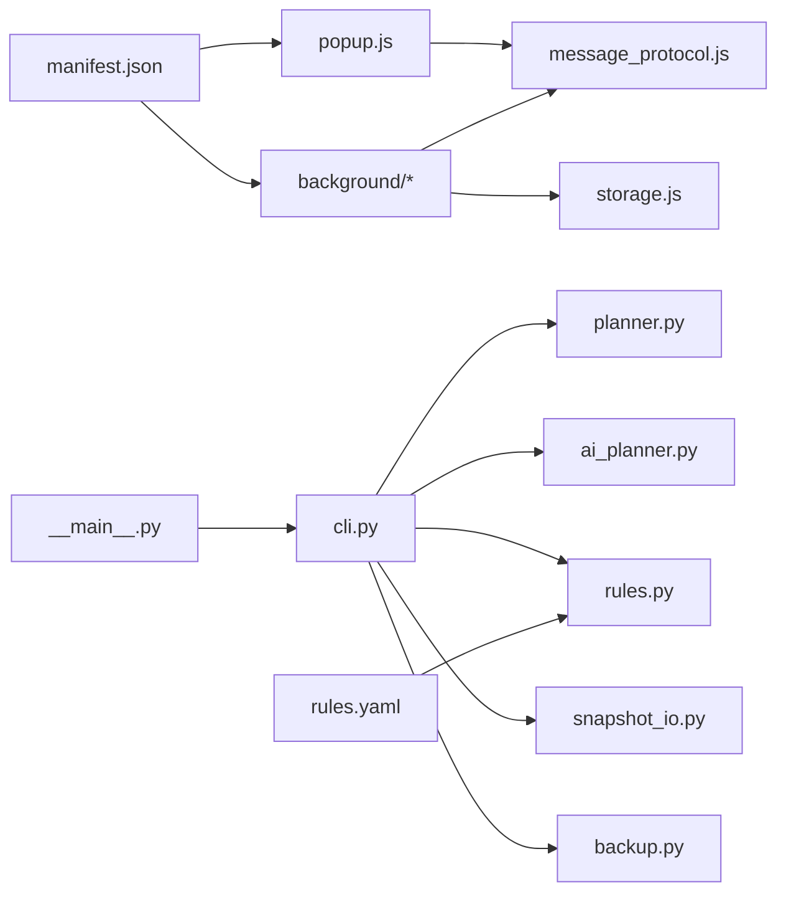

# 快速开始

<cite>
**本文引用的文件**   
- [README.md](file://README.md)
- [pyproject.toml](file://pyproject.toml)
- [src/bookmark_advisor/__main__.py](file://src/bookmark_advisor/__main__.py)
- [src/bookmark_advisor/cli.py](file://src/bookmark_advisor/cli.py)
- [src/bookmark_advisor/ai_planner.py](file://src/bookmark_advisor/ai_planner.py)
- [src/bookmark_advisor/planner.py](file://src/bookmark_advisor/planner.py)
- [src/bookmark_advisor/rules.py](file://src/bookmark_advisor/rules.py)
- [src/bookmark_advisor/snapshot_io.py](file://src/bookmark_advisor/snapshot_io.py)
- [src/bookmark_advisor/backup.py](file://src/bookmark_advisor/backup.py)
- [extension/manifest.json](file://extension/manifest.json)
- [extension/popup.html](file://extension/popup.html)
- [extension/popup.js](file://extension/popup.js)
- [extension/background/action_handlers.js](file://extension/background/action_handlers.js)
- [extension/background/plan_executor.js](file://extension/background/plan_executor.js)
- [extension/background/snapshot_export.js](file://extension/background/snapshot_export.js)
- [extension/shared/message_protocol.js](file://extension/shared/message_protocol.js)
- [extension/shared/storage.js](file://extension/shared/storage.js)
- [config/rules.yaml](file://config/rules.yaml)
</cite>

## 目录
1. [简介](#简介)
2. [项目结构](#项目结构)
3. [核心组件](#核心组件)
4. [架构总览](#架构总览)
5. [详细组件分析](#详细组件分析)
6. [依赖关系分析](#依赖关系分析)
7. [性能与使用建议](#性能与使用建议)
8. [故障排查指南](#故障排查指南)
9. [结论](#结论)
10. [附录](#附录)

## 简介
Edge Bookmark 是一个面向 Edge 书签的智能管理工具，提供 AI 驱动的书签智能重组、批量操作管理与快照备份等能力。它由两部分组成：
- 浏览器扩展：在 Edge 中运行，负责读取书签树、生成执行计划、执行批量操作与导出快照。
- Python CLI 工具：在本地运行，提供规则配置、AI 规划、执行与报告输出，支持从扩展或外部源导入书签进行离线处理。

本快速开始指南将帮助你在 5 分钟内完成首次安装、基础配置并执行一次书签重组任务。

## 项目结构
仓库采用“前端扩展 + 后端 CLI”的分层组织方式：
- extension：Edge 扩展源码，包含 Service Worker、弹出界面、后台脚本、共享协议与存储封装等。
- src/bookmark_advisor：Python CLI 工具实现，包括命令行入口、AI 规划器、规则解析、快照读写、备份与执行器等。
- config：默认规则配置文件（YAML）。
- tests：覆盖扩展与 CLI 的测试用例。

图表来源
- [extension/manifest.json](file://extension/manifest.json)
- [extension/popup.html](file://extension/popup.html)
- [extension/popup.js](file://extension/popup.js)
- [extension/background/action_handlers.js](file://extension/background/action_handlers.js)
- [extension/background/plan_executor.js](file://extension/background/plan_executor.js)
- [extension/shared/message_protocol.js](file://extension/shared/message_protocol.js)
- [extension/shared/storage.js](file://extension/shared/storage.js)
- [src/bookmark_advisor/__main__.py](file://src/bookmark_advisor/__main__.py)
- [src/bookmark_advisor/cli.py](file://src/bookmark_advisor/cli.py)
- [src/bookmark_advisor/planner.py](file://src/bookmark_advisor/planner.py)
- [src/bookmark_advisor/ai_planner.py](file://src/bookmark_advisor/ai_planner.py)
- [src/bookmark_advisor/rules.py](file://src/bookmark_advisor/rules.py)
- [src/bookmark_advisor/snapshot_io.py](file://src/bookmark_advisor/snapshot_io.py)
- [src/bookmark_advisor/backup.py](file://src/bookmark_advisor/backup.py)
- [config/rules.yaml](file://config/rules.yaml)

章节来源
- [README.md](file://README.md)
- [pyproject.toml](file://pyproject.toml)

## 核心组件
- 浏览器扩展
  - 服务工作者与弹出界面：提供用户交互入口，触发书签分析与执行。
  - 后台脚本：负责与书签 API 交互、消息路由、计划执行与快照导出。
  - 共享模块：定义消息协议、路径工具与本地存储封装。
- Python CLI
  - 命令入口与子命令：提供安装、配置、分析、执行、导出等操作。
  - AI 规划器与规则引擎：根据规则与上下文生成重组计划。
  - 快照与备份：读写书签快照，支持增量/全量备份策略。

章节来源
- [extension/manifest.json](file://extension/manifest.json)
- [extension/popup.js](file://extension/popup.js)
- [extension/background/action_handlers.js](file://extension/background/action_handlers.js)
- [extension/background/plan_executor.js](file://extension/background/plan_executor.js)
- [extension/shared/message_protocol.js](file://extension/shared/message_protocol.js)
- [extension/shared/storage.js](file://extension/shared/storage.js)
- [src/bookmark_advisor/__main__.py](file://src/bookmark_advisor/__main__.py)
- [src/bookmark_advisor/cli.py](file://src/bookmark_advisor/cli.py)
- [src/bookmark_advisor/ai_planner.py](file://src/bookmark_advisor/ai_planner.py)
- [src/bookmark_advisor/planner.py](file://src/bookmark_advisor/planner.py)
- [src/bookmark_advisor/rules.py](file://src/bookmark_advisor/rules.py)
- [src/bookmark_advisor/snapshot_io.py](file://src/bookmark_advisor/snapshot_io.py)
- [src/bookmark_advisor/backup.py](file://src/bookmark_advisor/backup.py)

## 架构总览
下图展示了扩展与 CLI 之间的协作关系：用户在扩展中发起任务，扩展通过消息协议与后台脚本交互；CLI 则用于离线分析、规则配置与批量执行。

图表来源
- [extension/popup.js](file://extension/popup.js)
- [extension/background/action_handlers.js](file://extension/background/action_handlers.js)
- [extension/shared/message_protocol.js](file://extension/shared/message_protocol.js)
- [src/bookmark_advisor/cli.py](file://src/bookmark_advisor/cli.py)

## 详细组件分析

### 安装与环境准备
- 系统要求
  - 操作系统：Windows/macOS/Linux
  - Python：满足 pyproject 中声明的版本范围
  - 浏览器：Microsoft Edge（启用开发者模式加载本地扩展）
- 安装步骤
  - 克隆仓库到本地目录
  - 使用包管理器安装 Python 依赖（参考 pyproject 中的依赖声明）
  - 在 Edge 中加载扩展：打开“扩展管理”，开启“开发者模式”，选择“加载解压缩的扩展”，指向 extension 目录
- 验证安装
  - 在 Edge 地址栏输入 edge://extensions，确认扩展已启用且无报错
  - 运行 CLI 命令查看版本信息，确保可正常启动

章节来源
- [pyproject.toml](file://pyproject.toml)
- [extension/manifest.json](file://extension/manifest.json)

### 首次启动与基本配置
- 设置 AI 提供商密钥
  - 在扩展弹出界面的“设置”中配置 AI 端点与密钥（如 OpenAI 兼容接口）
  - 或使用 CLI 的配置命令写入本地存储（具体键名见 shared/storage 与 popup/settings 相关实现）
- 初始规则配置
  - 编辑 config/rules.yaml，定义分组、匹配条件与目标路径
  - 使用 CLI 校验规则语法与兼容性
- 基本使用示例
  - 在扩展中点击“开始重组”，观察计划预览与执行结果
  - 或在 CLI 中运行分析/执行命令，查看报告与日志

章节来源
- [extension/popup.html](file://extension/popup.html)
- [extension/popup.js](file://extension/popup.js)
- [extension/shared/storage.js](file://extension/shared/storage.js)
- [extension/shared/message_protocol.js](file://extension/shared/message_protocol.js)
- [config/rules.yaml](file://config/rules.yaml)
- [src/bookmark_advisor/cli.py](file://src/bookmark_advisor/cli.py)

### 5 分钟入门教程：完成第一次书签重组
- 第 1 分钟：安装与加载
  - 安装 Python 依赖并加载扩展
- 第 2 分钟：配置 AI 密钥
  - 在扩展设置中填入 API 密钥与端点
- 第 3 分钟：编写规则
  - 在 rules.yaml 中添加一条简单规则（例如：将含特定关键词的书签移动到指定文件夹）
- 第 4 分钟：生成并预览计划
  - 在扩展中点击“开始重组”，查看生成的计划是否合理
- 第 5 分钟：执行与验证
  - 确认无误后执行，检查书签树是否按预期调整

章节来源
- [extension/popup.js](file://extension/popup.js)
- [extension/background/action_handlers.js](file://extension/background/action_handlers.js)
- [extension/background/plan_executor.js](file://extension/background/plan_executor.js)
- [config/rules.yaml](file://config/rules.yaml)

### 关键流程与数据结构
- 消息协议
  - 扩展内部通过统一的消息协议在不同脚本间传递指令与数据
- 计划执行
  - 后台脚本接收计划后，逐条执行移动、重命名、删除等操作，并记录撤销日志
- 快照与备份
  - 支持导出当前书签快照，便于回滚与审计

图表来源
- [extension/background/action_handlers.js](file://extension/background/action_handlers.js)
- [extension/background/plan_executor.js](file://extension/background/plan_executor.js)
- [extension/shared/message_protocol.js](file://extension/shared/message_protocol.js)
- [src/bookmark_advisor/rules.py](file://src/bookmark_advisor/rules.py)
- [src/bookmark_advisor/snapshot_io.py](file://src/bookmark_advisor/snapshot_io.py)

章节来源
- [extension/shared/message_protocol.js](file://extension/shared/message_protocol.js)
- [extension/background/plan_executor.js](file://extension/background/plan_executor.js)
- [src/bookmark_advisor/rules.py](file://src/bookmark_advisor/rules.py)
- [src/bookmark_advisor/snapshot_io.py](file://src/bookmark_advisor/snapshot_io.py)

## 依赖关系分析
- 扩展侧
  - manifest.json 声明权限与脚本入口
  - popup.js 与 background/* 通过 message_protocol.js 通信
  - storage.js 封装本地存储访问
- CLI 侧
  - __main__.py 与 cli.py 提供命令入口
  - planner.py 与 ai_planner.py 负责计划生成
  - rules.py 解析 YAML 规则
  - snapshot_io.py 与 backup.py 处理快照与备份

图表来源
- [extension/manifest.json](file://extension/manifest.json)
- [extension/popup.js](file://extension/popup.js)
- [extension/background/action_handlers.js](file://extension/background/action_handlers.js)
- [extension/shared/message_protocol.js](file://extension/shared/message_protocol.js)
- [extension/shared/storage.js](file://extension/shared/storage.js)
- [src/bookmark_advisor/__main__.py](file://src/bookmark_advisor/__main__.py)
- [src/bookmark_advisor/cli.py](file://src/bookmark_advisor/cli.py)
- [src/bookmark_advisor/planner.py](file://src/bookmark_advisor/planner.py)
- [src/bookmark_advisor/ai_planner.py](file://src/bookmark_advisor/ai_planner.py)
- [src/bookmark_advisor/rules.py](file://src/bookmark_advisor/rules.py)
- [src/bookmark_advisor/snapshot_io.py](file://src/bookmark_advisor/snapshot_io.py)
- [src/bookmark_advisor/backup.py](file://src/bookmark_advisor/backup.py)
- [config/rules.yaml](file://config/rules.yaml)

章节来源
- [extension/manifest.json](file://extension/manifest.json)
- [extension/popup.js](file://extension/popup.js)
- [extension/shared/message_protocol.js](file://extension/shared/message_protocol.js)
- [extension/shared/storage.js](file://extension/shared/storage.js)
- [src/bookmark_advisor/__main__.py](file://src/bookmark_advisor/__main__.py)
- [src/bookmark_advisor/cli.py](file://src/bookmark_advisor/cli.py)
- [src/bookmark_advisor/planner.py](file://src/bookmark_advisor/planner.py)
- [src/bookmark_advisor/ai_planner.py](file://src/bookmark_advisor/ai_planner.py)
- [src/bookmark_advisor/rules.py](file://src/bookmark_advisor/rules.py)
- [src/bookmark_advisor/snapshot_io.py](file://src/bookmark_advisor/snapshot_io.py)
- [src/bookmark_advisor/backup.py](file://src/bookmark_advisor/backup.py)
- [config/rules.yaml](file://config/rules.yaml)

## 性能与使用建议
- 批量操作优化
  - 尽量合并同类操作，减少与书签 API 的往返次数
- 规则设计
  - 规则应尽量精确，避免过度匹配导致大量变更
- 快照与回滚
  - 在执行大规模重组前导出快照，以便快速恢复
- 网络与 AI 调用
  - 合理设置超时与重试策略，避免长时间阻塞

[本节为通用指导，不直接分析具体文件]

## 故障排查指南
- 扩展无法加载
  - 确认开发者模式已开启，并正确选择 extension 目录
  - 检查 manifest.json 是否存在与权限声明是否完整
- 计划未生成或为空
  - 检查 rules.yaml 语法与匹配条件是否正确
  - 确认 AI 密钥与端点配置有效
- 执行失败或无变化
  - 查看执行日志与撤销记录，定位失败的步骤
  - 尝试先导出快照再执行，确保可回滚
- 获取帮助
  - 查阅 README 与文档目录下的说明
  - 在仓库 Issues 中搜索类似问题或提交新 Issue

章节来源
- [extension/manifest.json](file://extension/manifest.json)
- [config/rules.yaml](file://config/rules.yaml)
- [extension/background/plan_executor.js](file://extension/background/plan_executor.js)
- [extension/background/snapshot_export.js](file://extension/background/snapshot_export.js)
- [src/bookmark_advisor/snapshot_io.py](file://src/bookmark_advisor/snapshot_io.py)
- [src/bookmark_advisor/backup.py](file://src/bookmark_advisor/backup.py)
- [README.md](file://README.md)

## 结论
通过本快速开始指南，你已完成 Edge Bookmark 的安装、基础配置与首次书签重组任务。后续可根据实际需求完善规则、扩展批量操作与自动化流程，并结合快照与备份机制保障数据安全。

[本节为总结性内容，不直接分析具体文件]

## 附录
- 常用命令（CLI）
  - 查看版本与帮助
  - 初始化配置与校验规则
  - 执行分析与计划生成
  - 导出快照与备份
- 扩展快捷键与界面
  - 弹出界面按钮与状态提示
  - 设置页中的密钥与端点配置项

章节来源
- [src/bookmark_advisor/__main__.py](file://src/bookmark_advisor/__main__.py)
- [src/bookmark_advisor/cli.py](file://src/bookmark_advisor/cli.py)
- [extension/popup.html](file://extension/popup.html)
- [extension/popup.js](file://extension/popup.js)