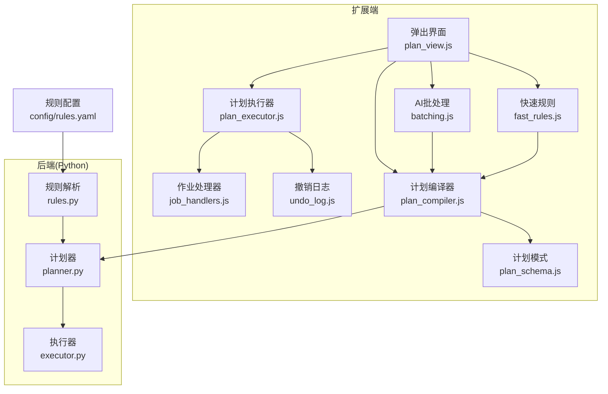
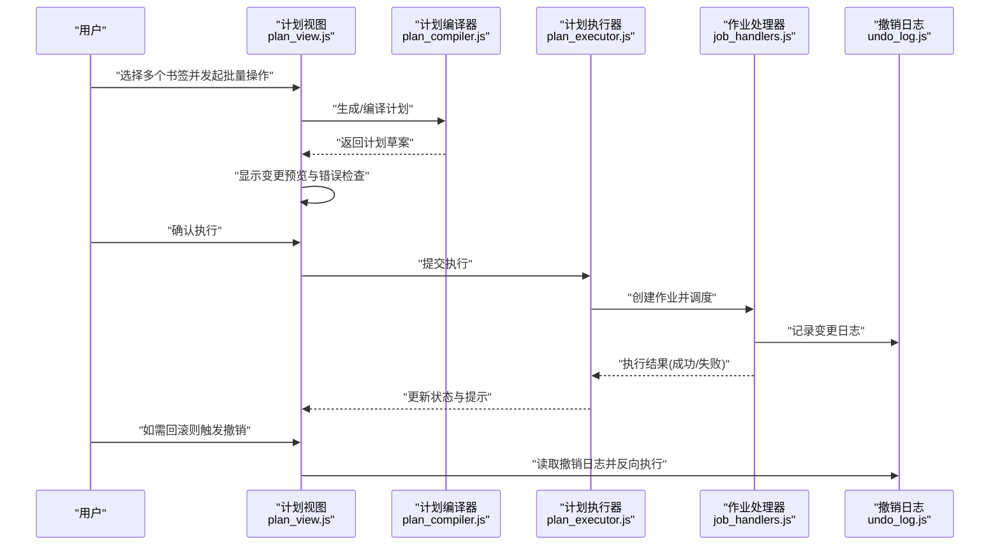
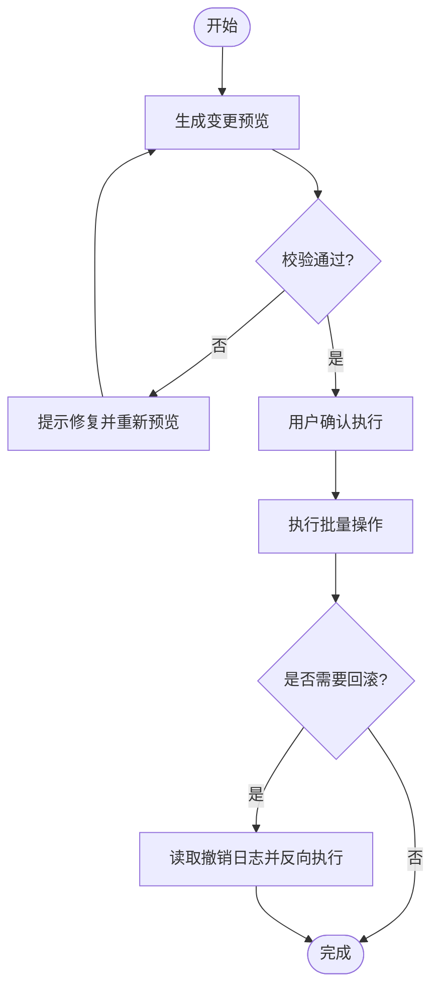
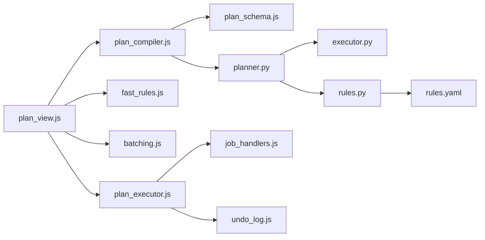

# 批量操作

<cite>
**本文引用的文件**   
- [extension/background/plan_executor.js](file://extension/background/plan_executor.js)
- [extension/background/job_handlers.js](file://extension/background/job_handlers.js)
- [extension/background/undo_log.js](file://extension/background/undo_log.js)
- [extension/popup/plan_view.js](file://extension/popup/plan_view.js)
- [extension/shared/plan_schema.js](file://extension/shared/plan_schema.js)
- [extension/ai/batching.js](file://extension/ai/batching.js)
- [extension/ai/fast_rules.js](file://extension/ai/fast_rules.js)
- [extension/ai/plan_compiler.js](file://extension/ai/plan_compiler.js)
- [src/bookmark_advisor/planner.py](file://src/bookmark_advisor/planner.py)
- [src/bookmark_advisor/executor.py](file://src/bookmark_advisor/executor.py)
- [src/bookmark_advisor/rules.py](file://src/bookmark_advisor/rules.py)
- [config/rules.yaml](file://config/rules.yaml)
</cite>

## 目录
1. [简介](#简介)
2. [项目结构](#项目结构)
3. [核心组件](#核心组件)
4. [架构总览](#架构总览)
5. [详细组件分析](#详细组件分析)
6. [依赖分析](#依赖分析)
7. [性能考虑](#性能考虑)
8. [故障排查指南](#故障排查指南)
9. [结论](#结论)
10. [附录](#附录)

## 简介
本指南面向需要高效整理大量书签的用户与开发者，聚焦“批量操作”能力：如何选择多个书签（单选、多选、范围选择）、支持哪些批量操作类型（移动、重命名、删除、添加标签等）、如何定义规则以条件筛选并批量应用操作、如何进行预览与确认、以及如何处理大规模数据时的性能优化与最佳实践。文档同时提供复杂场景的实际案例，如大规模书签整理与迁移到新文件夹结构。

## 项目结构
本项目在浏览器扩展侧与Python后端侧共同实现批量操作能力：
- 扩展侧负责用户交互、计划生成与执行、撤销日志、AI辅助与快速规则匹配。
- Python侧提供计划器、执行器与规则解析，用于离线或批处理场景。

图表来源
- [extension/popup/plan_view.js](file://extension/popup/plan_view.js)
- [extension/background/plan_executor.js](file://extension/background/plan_executor.js)
- [extension/background/job_handlers.js](file://extension/background/job_handlers.js)
- [extension/background/undo_log.js](file://extension/background/undo_log.js)
- [extension/ai/batching.js](file://extension/ai/batching.js)
- [extension/ai/fast_rules.js](file://extension/ai/fast_rules.js)
- [extension/ai/plan_compiler.js](file://extension/ai/plan_compiler.js)
- [extension/shared/plan_schema.js](file://extension/shared/plan_schema.js)
- [src/bookmark_advisor/planner.py](file://src/bookmark_advisor/planner.py)
- [src/bookmark_advisor/executor.py](file://src/bookmark_advisor/executor.py)
- [src/bookmark_advisor/rules.py](file://src/bookmark_advisor/rules.py)
- [config/rules.yaml](file://config/rules.yaml)

章节来源
- [extension/popup/plan_view.js](file://extension/popup/plan_view.js)
- [extension/background/plan_executor.js](file://extension/background/plan_executor.js)
- [extension/background/job_handlers.js](file://extension/background/job_handlers.js)
- [extension/background/undo_log.js](file://extension/background/undo_log.js)
- [extension/ai/batching.js](file://extension/ai/batching.js)
- [extension/ai/fast_rules.js](file://extension/ai/fast_rules.js)
- [extension/ai/plan_compiler.js](file://extension/ai/plan_compiler.js)
- [extension/shared/plan_schema.js](file://extension/shared/plan_schema.js)
- [src/bookmark_advisor/planner.py](file://src/bookmark_advisor/planner.py)
- [src/bookmark_advisor/executor.py](file://src/bookmark_advisor/executor.py)
- [src/bookmark_advisor/rules.py](file://src/bookmark_advisor/rules.py)
- [config/rules.yaml](file://config/rules.yaml)

## 核心组件
- 计划执行器：负责将“计划”转换为具体书签操作序列，管理事务与回滚。
- 作业处理器：协调异步任务生命周期，确保大批量操作的稳定性。
- 撤销日志：记录变更以便一键回滚。
- 计划视图：展示变更预览、错误检查与确认入口。
- 计划编译器：将自然语言或规则描述编译为可执行计划。
- 快速规则：基于预置规则进行高效匹配与批量应用。
- AI批处理：对大规模数据进行分批处理，降低内存与UI阻塞风险。
- Python计划器/执行器/规则：提供离线规划与规则解析能力。

章节来源
- [extension/background/plan_executor.js](file://extension/background/plan_executor.js)
- [extension/background/job_handlers.js](file://extension/background/job_handlers.js)
- [extension/background/undo_log.js](file://extension/background/undo_log.js)
- [extension/popup/plan_view.js](file://extension/popup/plan_view.js)
- [extension/ai/batching.js](file://extension/ai/batching.js)
- [extension/ai/fast_rules.js](file://extension/ai/fast_rules.js)
- [extension/ai/plan_compiler.js](file://extension/ai/plan_compiler.js)
- [src/bookmark_advisor/planner.py](file://src/bookmark_advisor/planner.py)
- [src/bookmark_advisor/executor.py](file://src/bookmark_advisor/executor.py)
- [src/bookmark_advisor/rules.py](file://src/bookmark_advisor/rules.py)

## 架构总览
下图展示了从用户选择到批量执行的关键流程，包括预览、确认、执行与回滚。

图表来源
- [extension/popup/plan_view.js](file://extension/popup/plan_view.js)
- [extension/ai/plan_compiler.js](file://extension/ai/plan_compiler.js)
- [extension/background/plan_executor.js](file://extension/background/plan_executor.js)
- [extension/background/job_handlers.js](file://extension/background/job_handlers.js)
- [extension/background/undo_log.js](file://extension/background/undo_log.js)

## 详细组件分析

### 选择多个书签的方法
- 单选：点击单个书签条目进入后续操作面板。
- 多选：按住修饰键后依次点击多个条目，或在列表中选择区间。
- 范围选择：通过起始与结束位置选择连续区间，适合大规模整理。

说明：上述交互由弹出界面与计划视图协同完成，最终转化为“计划”中的目标集合。

章节来源
- [extension/popup/plan_view.js](file://extension/popup/plan_view.js)

### 支持的批量操作类型
- 移动：将选中的书签移动到指定文件夹或路径。
- 重命名：批量修改标题或URL别名。
- 删除：移除选中书签（建议配合撤销日志）。
- 添加标签：为选中书签批量附加标签。
- 其他：根据计划模型可扩展更多原子操作。

章节来源
- [extension/shared/plan_schema.js](file://extension/shared/plan_schema.js)
- [extension/background/plan_executor.js](file://extension/background/plan_executor.js)

### 规则定义方法
- 条件筛选：基于名称、URL、父级路径、标签等条件筛选目标书签。
- 批量应用：对筛选结果统一应用同一操作（如移动到某文件夹）。
- 高级过滤：组合多条件、正则表达式与层级关系进行精准定位。
- 规则来源：
  - 内置快速规则：通过快速规则模块进行匹配与转换。
  - YAML配置：集中管理常用规则，便于复用与版本控制。
  - 自然语言转计划：通过计划编译器将意图转为可执行计划。

章节来源
- [extension/ai/fast_rules.js](file://extension/ai/fast_rules.js)
- [config/rules.yaml](file://config/rules.yaml)
- [extension/ai/plan_compiler.js](file://extension/ai/plan_compiler.js)
- [src/bookmark_advisor/rules.py](file://src/bookmark_advisor/rules.py)

### 操作预览与确认机制
- 变更预览：在执行前展示将要进行的移动、重命名、删除、添加标签等操作清单。
- 错误检查：校验目标路径合法性、冲突检测、权限与依赖关系。
- 确认执行：用户确认后进入执行阶段。
- 回滚选项：执行完成后支持一键撤销，恢复至变更前状态。

图表来源
- [extension/popup/plan_view.js](file://extension/popup/plan_view.js)
- [extension/background/plan_executor.js](file://extension/background/plan_executor.js)
- [extension/background/undo_log.js](file://extension/background/undo_log.js)

章节来源
- [extension/popup/plan_view.js](file://extension/popup/plan_view.js)
- [extension/background/plan_executor.js](file://extension/background/plan_executor.js)
- [extension/background/undo_log.js](file://extension/background/undo_log.js)

### 复杂批量操作案例
- 大规模书签整理：按主题与来源分类，批量移动至新文件夹，并为不同类别的书签添加相应标签。
- 批量迁移到新文件夹结构：依据旧路径规则与新路径映射表，批量重命名与移动，确保父子关系一致。
- 清理无效链接：批量删除长期未访问或失效的书签，并在撤销日志中保留变更记录。

章节来源
- [extension/ai/batching.js](file://extension/ai/batching.js)
- [extension/ai/plan_compiler.js](file://extension/ai/plan_compiler.js)
- [extension/background/plan_executor.js](file://extension/background/plan_executor.js)
- [extension/background/job_handlers.js](file://extension/background/job_handlers.js)

## 依赖分析
- 计划执行器依赖作业处理器进行任务调度，依赖撤销日志记录变更。
- 计划视图依赖计划编译器与快速规则生成计划草案。
- Python计划器与执行器提供离线能力，规则解析模块加载YAML配置。

图表来源
- [extension/popup/plan_view.js](file://extension/popup/plan_view.js)
- [extension/ai/plan_compiler.js](file://extension/ai/plan_compiler.js)
- [extension/shared/plan_schema.js](file://extension/shared/plan_schema.js)
- [extension/ai/fast_rules.js](file://extension/ai/fast_rules.js)
- [extension/ai/batching.js](file://extension/ai/batching.js)
- [extension/background/plan_executor.js](file://extension/background/plan_executor.js)
- [extension/background/job_handlers.js](file://extension/background/job_handlers.js)
- [extension/background/undo_log.js](file://extension/background/undo_log.js)
- [src/bookmark_advisor/planner.py](file://src/bookmark_advisor/planner.py)
- [src/bookmark_advisor/executor.py](file://src/bookmark_advisor/executor.py)
- [src/bookmark_advisor/rules.py](file://src/bookmark_advisor/rules.py)
- [config/rules.yaml](file://config/rules.yaml)

章节来源
- [extension/popup/plan_view.js](file://extension/popup/plan_view.js)
- [extension/ai/plan_compiler.js](file://extension/ai/plan_compiler.js)
- [extension/shared/plan_schema.js](file://extension/shared/plan_schema.js)
- [extension/ai/fast_rules.js](file://extension/ai/fast_rules.js)
- [extension/ai/batching.js](file://extension/ai/batching.js)
- [extension/background/plan_executor.js](file://extension/background/plan_executor.js)
- [extension/background/job_handlers.js](file://extension/background/job_handlers.js)
- [extension/background/undo_log.js](file://extension/background/undo_log.js)
- [src/bookmark_advisor/planner.py](file://src/bookmark_advisor/planner.py)
- [src/bookmark_advisor/executor.py](file://src/bookmark_advisor/executor.py)
- [src/bookmark_advisor/rules.py](file://src/bookmark_advisor/rules.py)
- [config/rules.yaml](file://config/rules.yaml)

## 性能考虑
- 分批处理：使用AI批处理模块对大规模数据集分片执行，避免一次性加载导致内存峰值与UI卡顿。
- 增量预览：仅计算差异变更，减少渲染开销。
- 并发控制：通过作业处理器限制并行度，防止浏览器API限流与资源争用。
- 索引与缓存：对频繁使用的规则与路径建立缓存，提升匹配速度。
- 撤销日志压缩：对大量相似变更合并记录，降低存储与回放成本。

[本节为通用指导，不直接分析具体文件]

## 故障排查指南
- 预览失败：检查计划模型是否符合规范；查看计划编译器输出与错误信息。
- 执行中断：关注作业处理器状态与异常堆栈；必要时启用重试策略。
- 回滚异常：核对撤销日志完整性；若日志损坏，尝试从最近快照恢复。
- 规则不生效：验证YAML语法与规则优先级；使用快速规则调试匹配过程。

章节来源
- [extension/background/plan_executor.js](file://extension/background/plan_executor.js)
- [extension/background/job_handlers.js](file://extension/background/job_handlers.js)
- [extension/background/undo_log.js](file://extension/background/undo_log.js)
- [extension/ai/plan_compiler.js](file://extension/ai/plan_compiler.js)
- [extension/ai/fast_rules.js](file://extension/ai/fast_rules.js)
- [config/rules.yaml](file://config/rules.yaml)

## 结论
通过计划驱动与规则引擎的结合，批量操作实现了高可用、可预览、可回滚的大规模书签管理能力。结合分批处理与并发控制，可在保证用户体验的同时稳定处理海量数据。建议在生产环境中完善规则库与撤销日志策略，持续优化性能与可靠性。

[本节为总结性内容，不直接分析具体文件]

## 附录
- 术语说明：
  - 计划：一组可执行的原子操作集合，包含目标集合与操作参数。
  - 撤销日志：记录每次变更的前后状态，用于回滚。
  - 快速规则：预置的规则模板，加速常见批量场景。
- 参考路径：
  - 计划模型定义：[extension/shared/plan_schema.js](file://extension/shared/plan_schema.js)
  - 规则配置示例：[config/rules.yaml](file://config/rules.yaml)
  - 计划编译器：[extension/ai/plan_compiler.js](file://extension/ai/plan_compiler.js)
  - 执行器与作业处理器：[extension/background/plan_executor.js](file://extension/background/plan_executor.js)、[extension/background/job_handlers.js](file://extension/background/job_handlers.js)
  - 撤销日志：[extension/background/undo_log.js](file://extension/background/undo_log.js)
  - Python计划器/执行器/规则：[src/bookmark_advisor/planner.py](file://src/bookmark_advisor/planner.py)、[src/bookmark_advisor/executor.py](file://src/bookmark_advisor/executor.py)、[src/bookmark_advisor/rules.py](file://src/bookmark_advisor/rules.py)