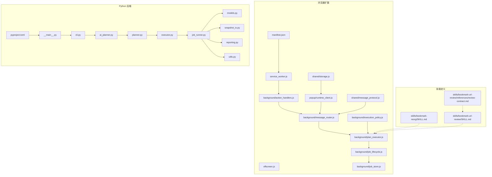
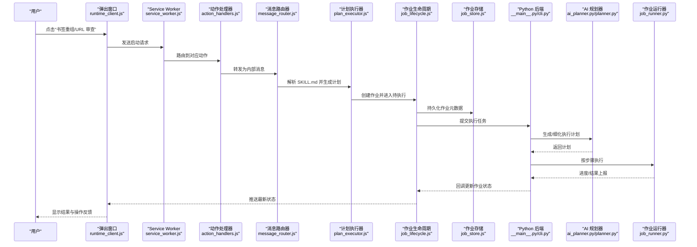
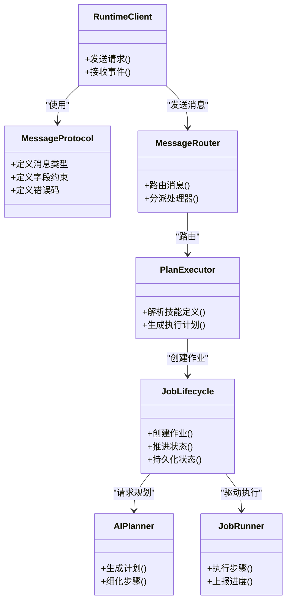
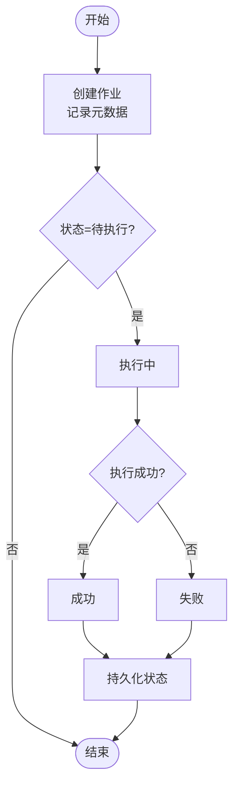
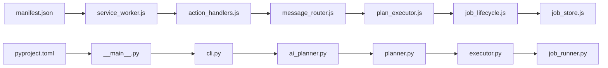

# 技能系统

<cite>
**本文引用的文件**   
- [README.md](file://README.md)
- [AGENTS.md](file://AGENTS.md)
- [CLAUDE.md](file://CLAUDE.md)
- [skills/bookmark-reorg/SKILL.md](file://skills/bookmark-reorg/SKILL.md)
- [skills/bookmark-url-review/SKILL.md](file://skills/bookmark-url-review/SKILL.md)
- [skills/bookmark-url-review/references/review-contract.md](file://skills/bookmark-url-review/references/review-contract.md)
- [extension/manifest.json](file://extension/manifest.json)
- [extension/service_worker.js](file://extension/service_worker.js)
- [extension/offscreen.js](file://extension/offscreen.js)
- [extension/background/action_handlers.js](file://extension/background/action_handlers.js)
- [extension/background/message_router.js](file://extension/background/message_router.js)
- [extension/background/plan_executor.js](file://extension/background/plan_executor.js)
- [extension/background/job_lifecycle.js](file://extension/background/job_lifecycle.js)
- [extension/background/job_store.js](file://extension/background/job_store.js)
- [extension/background/execution_policy.js](file://extension/background/execution_policy.js)
- [extension/popup/runtime_client.js](file://extension/popup/runtime_client.js)
- [extension/shared/message_protocol.js](file://extension/shared/message_protocol.js)
- [extension/shared/storage.js](file://extension/shared/storage.js)
- [src/bookmark_advisor/__main__.py](file://src/bookmark_advisor/__main__.py)
- [src/bookmark_advisor/cli.py](file://src/bookmark_advisor/cli.py)
- [src/bookmark_advisor/ai_planner.py](file://src/bookmark_advisor/ai_planner.py)
- [src/bookmark_advisor/planner.py](file://src/bookmark_advisor/planner.py)
- [src/bookmark_advisor/executor.py](file://src/bookmark_advisor/executor.py)
- [src/bookmark_advisor/job_runner.py](file://src/bookmark_advisor/job_runner.py)
- [src/bookmark_advisor/models.py](file://src/bookmark_advisor/models.py)
- [src/bookmark_advisor/snapshot_io.py](file://src/bookmark_advisor/snapshot_io.py)
- [src/bookmark_advisor/reporting.py](file://src/bookmark_advisor/reporting.py)
- [src/bookmark_advisor/utils.py](file://src/bookmark_advisor/utils.py)
- [pyproject.toml](file://pyproject.toml)
</cite>

## 目录
1. [简介](#简介)
2. [项目结构](#项目结构)
3. [核心组件](#核心组件)
4. [架构总览](#架构总览)
5. [详细组件分析](#详细组件分析)
6. [依赖分析](#依赖分析)
7. [性能考虑](#性能考虑)
8. [故障排查指南](#故障排查指南)
9. [结论](#结论)
10. [附录](#附录)

## 简介
本指南面向希望理解与使用“技能系统”的用户与开发者。该系统围绕浏览器扩展与 Python 后端协作，提供可插拔的“技能”能力，用于书签重组、URL 审查等任务。文档涵盖：
- 技能概念与架构设计（模块化结构、多代理协作、通信协议）
- 内置技能使用方法（书签重组、URL 审查）
- 第三方技能部署（安装、依赖管理、版本控制）
- 自定义技能开发（目录结构、SKILL.md、API 接口、测试）
- 生命周期管理（启用/禁用、更新升级、卸载清理）
- 最佳实践与常见问题

## 项目结构
仓库采用“前端扩展 + 后端服务 + 技能定义”的分层组织方式：
- skills：技能定义目录，每个技能一个子目录，包含 SKILL.md 与可选 references
- extension：浏览器扩展实现，负责 UI、消息路由、计划执行、作业生命周期等
- src/bookmark_advisor：Python 后端，提供 AI 规划、执行器、作业运行器等
- tests：覆盖扩展与后端的测试套件
- docs：设计与审计文档

图表来源
- [extension/manifest.json](file://extension/manifest.json)
- [extension/service_worker.js](file://extension/service_worker.js)
- [extension/background/action_handlers.js](file://extension/background/action_handlers.js)
- [extension/background/message_router.js](file://extension/background/message_router.js)
- [extension/background/plan_executor.js](file://extension/background/plan_executor.js)
- [extension/background/job_lifecycle.js](file://extension/background/job_lifecycle.js)
- [extension/background/job_store.js](file://extension/background/job_store.js)
- [extension/background/execution_policy.js](file://extension/background/execution_policy.js)
- [extension/popup/runtime_client.js](file://extension/popup/runtime_client.js)
- [extension/shared/message_protocol.js](file://extension/shared/message_protocol.js)
- [extension/shared/storage.js](file://extension/shared/storage.js)
- [src/bookmark_advisor/__main__.py](file://src/bookmark_advisor/__main__.py)
- [src/bookmark_advisor/cli.py](file://src/bookmark_advisor/cli.py)
- [src/bookmark_advisor/ai_planner.py](file://src/bookmark_advisor/ai_planner.py)
- [src/bookmark_advisor/planner.py](file://src/bookmark_advisor/planner.py)
- [src/bookmark_advisor/executor.py](file://src/bookmark_advisor/executor.py)
- [src/bookmark_advisor/job_runner.py](file://src/bookmark_advisor/job_runner.py)
- [src/bookmark_advisor/models.py](file://src/bookmark_advisor/models.py)
- [src/bookmark_advisor/snapshot_io.py](file://src/bookmark_advisor/snapshot_io.py)
- [src/bookmark_advisor/reporting.py](file://src/bookmark_advisor/reporting.py)
- [src/bookmark_advisor/utils.py](file://src/bookmark_advisor/utils.py)
- [pyproject.toml](file://pyproject.toml)
- [skills/bookmark-reorg/SKILL.md](file://skills/bookmark-reorg/SKILL.md)
- [skills/bookmark-url-review/SKILL.md](file://skills/bookmark-url-review/SKILL.md)
- [skills/bookmark-url-review/references/review-contract.md](file://skills/bookmark-url-review/references/review-contract.md)

章节来源
- [README.md](file://README.md)
- [AGENTS.md](file://AGENTS.md)
- [CLAUDE.md](file://CLAUDE.md)

## 核心组件
- 技能定义层
  - 每个技能位于 skills/<skill-name>/ 目录，必须包含 SKILL.md；可选包含 references 目录存放契约或参考材料
  - SKILL.md 描述技能用途、输入输出、配置项、调用约定与注意事项
- 扩展运行时层
  - service_worker 作为入口，action_handlers 处理用户动作，message_router 统一消息分发
  - plan_executor 根据 SKILL.md 解析并生成执行计划，job_lifecycle 管理作业状态机，job_store 持久化作业
  - execution_policy 控制执行策略（如并发、重试、超时）
  - popup/runtime_client 提供 UI 侧运行时客户端，通过 shared/message_protocol 与后台通信
- Python 后端层
  - __main__/cli 提供命令行入口
  - ai_planner/planner 负责将自然语言或结构化指令转化为可执行计划
  - executor/job_runner 驱动具体步骤执行，读写快照、生成报告
  - models/snapshot_io/reporting/utils 提供数据模型、I/O 与工具函数
- 多代理协作
  - 扩展侧与后端侧通过消息协议交互；AI 规划器与执行器形成“规划-执行”闭环

章节来源
- [extension/background/action_handlers.js](file://extension/background/action_handlers.js)
- [extension/background/message_router.js](file://extension/background/message_router.js)
- [extension/background/plan_executor.js](file://extension/background/plan_executor.js)
- [extension/background/job_lifecycle.js](file://extension/background/job_lifecycle.js)
- [extension/background/job_store.js](file://extension/background/job_store.js)
- [extension/background/execution_policy.js](file://extension/background/execution_policy.js)
- [extension/popup/runtime_client.js](file://extension/popup/runtime_client.js)
- [extension/shared/message_protocol.js](file://extension/shared/message_protocol.js)
- [src/bookmark_advisor/ai_planner.py](file://src/bookmark_advisor/ai_planner.py)
- [src/bookmark_advisor/planner.py](file://src/bookmark_advisor/planner.py)
- [src/bookmark_advisor/executor.py](file://src/bookmark_advisor/executor.py)
- [src/bookmark_advisor/job_runner.py](file://src/bookmark_advisor/job_runner.py)

## 架构总览
下图展示从用户触发到技能执行的端到端流程，包括扩展与后端的职责边界与数据流。

图表来源
- [extension/popup/runtime_client.js](file://extension/popup/runtime_client.js)
- [extension/service_worker.js](file://extension/service_worker.js)
- [extension/background/action_handlers.js](file://extension/background/action_handlers.js)
- [extension/background/message_router.js](file://extension/background/message_router.js)
- [extension/background/plan_executor.js](file://extension/background/plan_executor.js)
- [extension/background/job_lifecycle.js](file://extension/background/job_lifecycle.js)
- [extension/background/job_store.js](file://extension/background/job_store.js)
- [src/bookmark_advisor/__main__.py](file://src/bookmark_advisor/__main__.py)
- [src/bookmark_advisor/cli.py](file://src/bookmark_advisor/cli.py)
- [src/bookmark_advisor/ai_planner.py](file://src/bookmark_advisor/ai_planner.py)
- [src/bookmark_advisor/planner.py](file://src/bookmark_advisor/planner.py)
- [src/bookmark_advisor/job_runner.py](file://src/bookmark_advisor/job_runner.py)

## 详细组件分析

### 技能定义与加载
- 目录规范
  - 每个技能位于 skills/<skill-name>/，必须包含 SKILL.md
  - 可选 references 目录存放契约、参考文档等
- SKILL.md 内容建议
  - 名称、版本、作者、许可证
  - 功能描述、前置条件、输入参数、输出产物
  - 配置项清单与默认值
  - 调用约定（消息类型、字段约束）
  - 错误码与异常说明
  - 安全与权限要求
- 加载机制
  - 扩展在初始化时扫描 skills 目录，读取各 SKILL.md 构建技能注册表
  - 计划执行器依据目标技能名选择对应定义，校验必填字段后生成执行计划

章节来源
- [skills/bookmark-reorg/SKILL.md](file://skills/bookmark-reorg/SKILL.md)
- [skills/bookmark-url-review/SKILL.md](file://skills/bookmark-url-review/SKILL.md)
- [skills/bookmark-url-review/references/review-contract.md](file://skills/bookmark-url-review/references/review-contract.md)
- [extension/background/plan_executor.js](file://extension/background/plan_executor.js)

### 书签重组技能（bookmark-reorg）
- 功能特性
  - 基于规则或 AI 辅助对书签进行重排、合并、去重、分类
  - 支持批量操作与预览模式
- 配置选项
  - 分组策略、保留规则、冲突处理策略
  - 是否启用预览、是否允许自动应用
- 使用方式
  - 在弹出窗口中选择“书签重组”，填写必要参数后提交
  - 查看执行进度与变更摘要，支持回滚

章节来源
- [skills/bookmark-reorg/SKILL.md](file://skills/bookmark-reorg/SKILL.md)
- [extension/background/plan_executor.js](file://extension/background/plan_executor.js)
- [extension/background/job_lifecycle.js](file://extension/background/job_lifecycle.js)

### URL 审查技能（bookmark-url-review）
- 功能特性
  - 对书签中的 URL 进行有效性检查、重复检测、死链识别
  - 结合外部参考契约进行一致性校验
- 配置选项
  - 并发度、超时时间、重试次数、忽略域名列表
  - 输出格式（摘要/详细）、是否导出报告
- 使用方式
  - 在弹出窗口中选择“URL 审查”，设置阈值与范围
  - 查看问题清单与修复建议，支持一键修复或导出

章节来源
- [skills/bookmark-url-review/SKILL.md](file://skills/bookmark-url-review/SKILL.md)
- [skills/bookmark-url-review/references/review-contract.md](file://skills/bookmark-url-review/references/review-contract.md)
- [extension/background/plan_executor.js](file://extension/background/plan_executor.js)
- [extension/background/job_lifecycle.js](file://extension/background/job_lifecycle.js)

### 多代理协作与通信协议
- 角色划分
  - 扩展侧：UI 交互、消息路由、作业生命周期管理
  - 后端侧：AI 规划、任务调度、执行与报告
- 通信协议
  - 使用共享消息协议定义消息类型、字段语义与错误码
  - 通过 runtime_client 发起请求，后台通过 message_router 分发至相应处理器
- 协作流程
  - 规划阶段：AI 规划器产出可执行计划
  - 执行阶段：作业运行器按步骤执行，实时上报进度
  - 反馈阶段：状态与结果回传扩展，UI 呈现给用户

图表来源
- [extension/shared/message_protocol.js](file://extension/shared/message_protocol.js)
- [extension/popup/runtime_client.js](file://extension/popup/runtime_client.js)
- [extension/background/message_router.js](file://extension/background/message_router.js)
- [extension/background/plan_executor.js](file://extension/background/plan_executor.js)
- [extension/background/job_lifecycle.js](file://extension/background/job_lifecycle.js)
- [src/bookmark_advisor/ai_planner.py](file://src/bookmark_advisor/ai_planner.py)
- [src/bookmark_advisor/job_runner.py](file://src/bookmark_advisor/job_runner.py)

章节来源
- [extension/shared/message_protocol.js](file://extension/shared/message_protocol.js)
- [extension/popup/runtime_client.js](file://extension/popup/runtime_client.js)
- [extension/background/message_router.js](file://extension/background/message_router.js)
- [extension/background/plan_executor.js](file://extension/background/plan_executor.js)
- [extension/background/job_lifecycle.js](file://extension/background/job_lifecycle.js)
- [src/bookmark_advisor/ai_planner.py](file://src/bookmark_advisor/ai_planner.py)
- [src/bookmark_advisor/job_runner.py](file://src/bookmark_advisor/job_runner.py)

### 作业生命周期与执行策略
- 状态机
  - 待执行 -> 执行中 -> 成功/失败 -> 已取消
- 关键职责
  - 创建作业：记录元数据、初始状态
  - 推进状态：根据执行结果与回调更新
  - 持久化：落盘保存以便恢复与审计
- 执行策略
  - 并发度限制、重试与退避、超时控制、幂等性保障

图表来源
- [extension/background/job_lifecycle.js](file://extension/background/job_lifecycle.js)
- [extension/background/job_store.js](file://extension/background/job_store.js)
- [extension/background/execution_policy.js](file://extension/background/execution_policy.js)

章节来源
- [extension/background/job_lifecycle.js](file://extension/background/job_lifecycle.js)
- [extension/background/job_store.js](file://extension/background/job_store.js)
- [extension/background/execution_policy.js](file://extension/background/execution_policy.js)

### 插件化与第三方技能部署
- 安装
  - 将第三方技能目录放入 skills/<skill-name>/，确保包含 SKILL.md
  - 重启扩展以重新扫描技能
- 依赖管理
  - 若技能需要额外资源，可在 references 中声明并在 SKILL.md 中说明安装步骤
  - 建议在 CI 中验证依赖可用性与版本兼容性
- 版本控制
  - 在 SKILL.md 中声明版本号，遵循语义化版本
  - 变更日志与迁移说明应随版本发布

章节来源
- [skills/bookmark-reorg/SKILL.md](file://skills/bookmark-reorg/SKILL.md)
- [skills/bookmark-url-review/SKILL.md](file://skills/bookmark-url-review/SKILL.md)

### 自定义技能开发指南
- 目录结构
  - skills/<your-skill>/SKILL.md
  - skills/<your-skill>/references/（可选）
- SKILL.md 编写要点
  - 明确输入输出、配置项、错误码、权限与安全要求
  - 给出示例调用与预期结果
- API 接口定义
  - 使用 shared/message_protocol 定义消息类型与字段
  - 在 action_handlers 中注册新动作，交由 message_router 分发
- 测试方法
  - 针对计划生成与执行路径编写单元测试
  - 模拟网络与 I/O 错误，验证健壮性与回滚逻辑

章节来源
- [extension/shared/message_protocol.js](file://extension/shared/message_protocol.js)
- [extension/background/action_handlers.js](file://extension/background/action_handlers.js)
- [extension/background/plan_executor.js](file://extension/background/plan_executor.js)

### 生命周期管理（启用/禁用、更新升级、卸载清理）
- 启用/禁用
  - 在扩展设置中开关特定技能；未启用的技能不参与计划生成
- 更新升级
  - 替换 SKILL.md 与 references，保持向后兼容；必要时提供迁移脚本
- 卸载清理
  - 删除技能目录，清理相关缓存与持久化数据
  - 移除引用该技能的作业记录

章节来源
- [extension/background/plan_executor.js](file://extension/background/plan_executor.js)
- [extension/background/job_store.js](file://extension/background/job_store.js)

## 依赖分析
- 扩展依赖
  - manifest.json 声明权限与入口
  - service_worker 作为主入口，协调各模块
- 后端依赖
  - pyproject.toml 定义包元数据与依赖
  - __main__.py 与 cli.py 提供命令行入口
  - ai_planner/planner/executor/job_runner 构成核心流水线
- 技能依赖
  - 通过 SKILL.md 声明外部依赖与参考契约

图表来源
- [extension/manifest.json](file://extension/manifest.json)
- [extension/service_worker.js](file://extension/service_worker.js)
- [extension/background/action_handlers.js](file://extension/background/action_handlers.js)
- [extension/background/message_router.js](file://extension/background/message_router.js)
- [extension/background/plan_executor.js](file://extension/background/plan_executor.js)
- [extension/background/job_lifecycle.js](file://extension/background/job_lifecycle.js)
- [extension/background/job_store.js](file://extension/background/job_store.js)
- [pyproject.toml](file://pyproject.toml)
- [src/bookmark_advisor/__main__.py](file://src/bookmark_advisor/__main__.py)
- [src/bookmark_advisor/cli.py](file://src/bookmark_advisor/cli.py)
- [src/bookmark_advisor/ai_planner.py](file://src/bookmark_advisor/ai_planner.py)
- [src/bookmark_advisor/planner.py](file://src/bookmark_advisor/planner.py)
- [src/bookmark_advisor/executor.py](file://src/bookmark_advisor/executor.py)
- [src/bookmark_advisor/job_runner.py](file://src/bookmark_advisor/job_runner.py)

章节来源
- [extension/manifest.json](file://extension/manifest.json)
- [pyproject.toml](file://pyproject.toml)

## 性能考虑
- 并发与限流
  - 合理设置执行策略的并发度，避免阻塞 UI 与后端
- 批处理与增量
  - 对大规模书签操作采用分批与增量更新
- 缓存与幂等
  - 对只读查询结果进行缓存；执行步骤保证幂等以避免重复副作用
- 超时与重试
  - 为网络与 I/O 操作设置超时与退避重试，提升鲁棒性

[本节为通用指导，不直接分析具体文件]

## 故障排查指南
- 常见症状
  - 技能未生效：检查 SKILL.md 是否存在且语法正确
  - 作业卡住：查看 job_lifecycle 状态与 job_store 持久化记录
  - 通信失败：核对 message_protocol 字段与错误码
- 定位步骤
  - 在弹出窗口查看作业状态与错误信息
  - 在后端日志中检索对应作业 ID 的执行轨迹
  - 对比 SKILL.md 与 references 契约，确认输入输出一致
- 恢复措施
  - 回滚最近一次变更，清理无效作业记录
  - 降级执行策略（降低并发、缩短超时）

章节来源
- [extension/background/job_lifecycle.js](file://extension/background/job_lifecycle.js)
- [extension/background/job_store.js](file://extension/background/job_store.js)
- [extension/shared/message_protocol.js](file://extension/shared/message_protocol.js)

## 结论
本技能系统通过清晰的模块化结构与标准化的通信协议，实现了可扩展的技能生态。内置的书签重组与 URL 审查技能覆盖了常见场景，同时提供了完善的生命周期管理与测试支撑。遵循本文的开发与部署指南，可快速集成第三方技能并稳定运行。

[本节为总结性内容，不直接分析具体文件]

## 附录
- 术语
  - 技能：可插拔的能力单元，由 SKILL.md 定义
  - 作业：一次技能执行的实例，具有完整生命周期
  - 计划：由 AI 规划器生成的可执行步骤序列
- 参考
  - AGENTS.md、CLAUDE.md 提供整体工程规范与协作约定

章节来源
- [AGENTS.md](file://AGENTS.md)
- [CLAUDE.md](file://CLAUDE.md)