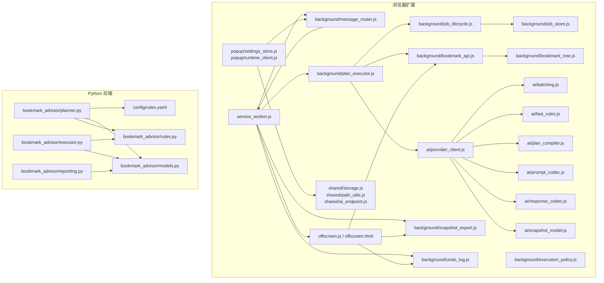
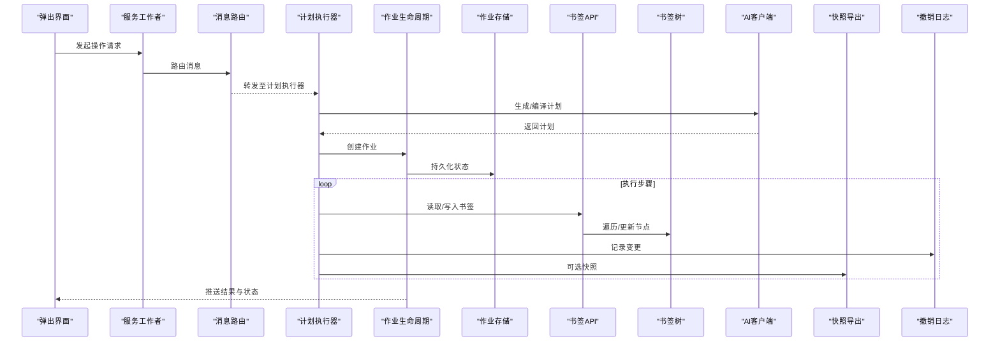
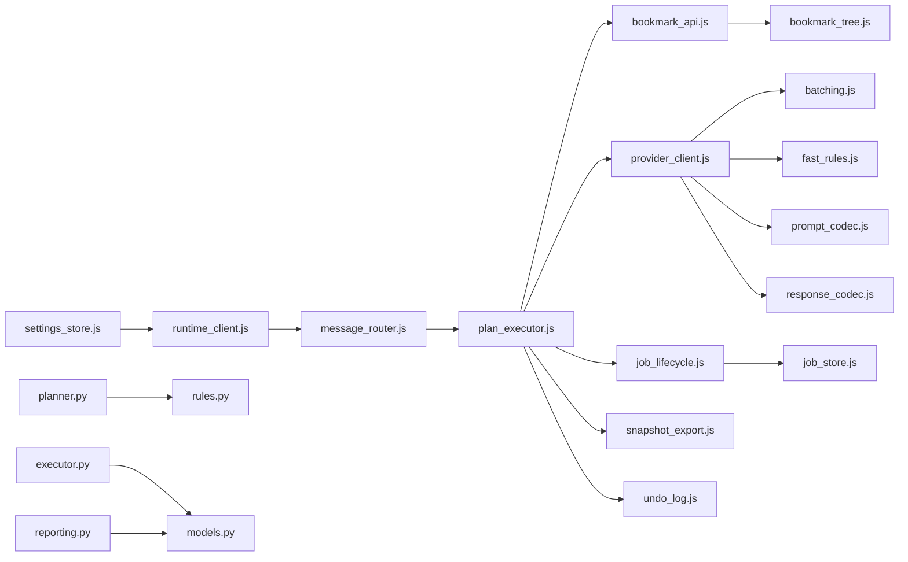

# 最佳实践

<cite>
**本文引用的文件**   
- [README.md](file://README.md)
- [AGENTS.md](file://AGENTS.md)
- [CLAUDE.md](file://CLAUDE.md)
- [extension/manifest.json](file://extension/manifest.json)
- [extension/service_worker.js](file://extension/service_worker.js)
- [extension/offscreen.html](file://extension/offscreen.html)
- [extension/offscreen.js](file://extension/offscreen.js)
- [extension/background/bookmark_api.js](file://extension/background/bookmark_api.js)
- [extension/background/bookmark_tree.js](file://extension/background/bookmark_tree.js)
- [extension/background/action_handlers.js](file://extension/background/action_handlers.js)
- [extension/background/message_router.js](file://extension/background/message_router.js)
- [extension/background/plan_executor.js](file://extension/background/plan_executor.js)
- [extension/background/job_lifecycle.js](file://extension/background/job_lifecycle.js)
- [extension/background/job_store.js](file://extension/background/job_store.js)
- [extension/background/execution_policy.js](file://extension/background/execution_policy.js)
- [extension/background/snapshot_export.js](file://extension/background/snapshot_export.js)
- [extension/background/undo_log.js](file://extension/background/undo_log.js)
- [extension/popup/settings_store.js](file://extension/popup/settings_store.js)
- [extension/popup/runtime_client.js](file://extension/popup/runtime_client.js)
- [extension/shared/storage.js](file://extension/shared/storage.js)
- [extension/shared/path_utils.js](file://extension/shared/path_utils.js)
- [extension/shared/ai_endpoint.js](file://extension/shared/ai_endpoint.js)
- [extension/ai/provider_client.js](file://extension/ai/provider_client.js)
- [extension/ai/batching.js](file://extension/ai/batching.js)
- [extension/ai/fast_rules.js](file://extension/ai/fast_rules.js)
- [extension/ai/plan_compiler.js](file://extension/ai/plan_compiler.js)
- [extension/ai/prompt_codec.js](file://extension/ai/prompt_codec.js)
- [extension/ai/response_codec.js](file://extension/ai/response_codec.js)
- [extension/ai/snapshot_model.js](file://extension/ai/snapshot_model.js)
- [skills/bookmark-reorg/SKILL.md](file://skills/bookmark-reorg/SKILL.md)
- [skills/bookmark-url-review/SKILL.md](file://skills/bookmark-url-review/SKILL.md)
- [src/bookmark_advisor/planner.py](file://src/bookmark_advisor/planner.py)
- [src/bookmark_advisor/executor.py](file://src/bookmark_advisor/executor.py)
- [src/bookmark_advisor/models.py](file://src/bookmark_advisor/models.py)
- [src/bookmark_advisor/rules.py](file://src/bookmark_advisor/rules.py)
- [src/bookmark_advisor/reporting.py](file://src/bookmark_advisor/reporting.py)
- [config/rules.yaml](file://config/rules.yaml)
</cite>

## 目录
1. [简介](#简介)
2. [项目结构](#项目结构)
3. [核心组件](#核心组件)
4. [架构总览](#架构总览)
5. [详细组件分析](#详细组件分析)
6. [依赖分析](#依赖分析)
7. [性能考虑](#性能考虑)
8. [故障排查指南](#故障排查指南)
9. [结论](#结论)
10. [附录](#附录)

## 简介
本指南面向 Edge Bookmark 的使用者与维护者，聚焦“书签管理”的最佳实践。内容覆盖：
- 组织原则与分类策略（文件夹结构、命名约定、检索方法）
- 大规模书签管理（维护计划、性能优化、存储管理）
- 团队协作（权限控制、版本同步、冲突解决）
- AI 提示词工程优化（重组质量、误操作减少、响应速度）
- 安全与数据保护（敏感信息、备份、灾难恢复）
- 常见工作流的设计模式与效率技巧

## 项目结构
Edge Bookmark 由浏览器扩展与 Python 后端两部分组成：
- 扩展侧负责 UI、消息路由、任务编排、与浏览器书签 API 交互、AI 能力集成与快照导出
- Python 侧提供规划器、执行器、规则与报告等离线处理能力

图表来源
- [extension/service_worker.js](file://extension/service_worker.js)
- [extension/offscreen.js](file://extension/offscreen.js)
- [extension/background/bookmark_api.js](file://extension/background/bookmark_api.js)
- [extension/background/bookmark_tree.js](file://extension/background/bookmark_tree.js)
- [extension/background/message_router.js](file://extension/background/message_router.js)
- [extension/background/plan_executor.js](file://extension/background/plan_executor.js)
- [extension/background/job_lifecycle.js](file://extension/background/job_lifecycle.js)
- [extension/background/job_store.js](file://extension/background/job_store.js)
- [extension/background/execution_policy.js](file://extension/background/execution_policy.js)
- [extension/background/snapshot_export.js](file://extension/background/snapshot_export.js)
- [extension/background/undo_log.js](file://extension/background/undo_log.js)
- [extension/popup/settings_store.js](file://extension/popup/settings_store.js)
- [extension/popup/runtime_client.js](file://extension/popup/runtime_client.js)
- [extension/shared/storage.js](file://extension/shared/storage.js)
- [extension/shared/path_utils.js](file://extension/shared/path_utils.js)
- [extension/shared/ai_endpoint.js](file://extension/shared/ai_endpoint.js)
- [extension/ai/provider_client.js](file://extension/ai/provider_client.js)
- [extension/ai/batching.js](file://extension/ai/batching.js)
- [extension/ai/fast_rules.js](file://extension/ai/fast_rules.js)
- [extension/ai/plan_compiler.js](file://extension/ai/plan_compiler.js)
- [extension/ai/prompt_codec.js](file://extension/ai/prompt_codec.js)
- [extension/ai/response_codec.js](file://extension/ai/response_codec.js)
- [extension/ai/snapshot_model.js](file://extension/ai/snapshot_model.js)
- [src/bookmark_advisor/planner.py](file://src/bookmark_advisor/planner.py)
- [src/bookmark_advisor/executor.py](file://src/bookmark_advisor/executor.py)
- [src/bookmark_advisor/models.py](file://src/bookmark_advisor/models.py)
- [src/bookmark_advisor/rules.py](file://src/bookmark_advisor/rules.py)
- [src/bookmark_advisor/reporting.py](file://src/bookmark_advisor/reporting.py)
- [config/rules.yaml](file://config/rules.yaml)

章节来源
- [extension/manifest.json](file://extension/manifest.json)
- [extension/service_worker.js](file://extension/service_worker.js)
- [extension/offscreen.html](file://extension/offscreen.html)
- [extension/offscreen.js](file://extension/offscreen.js)

## 核心组件
- 服务工作者与消息路由：统一入口，负责分发 UI 请求到后台任务与 Offscreen 文档
- 书签 API 与树构建：封装浏览器书签读写与层级遍历，为上层提供稳定接口
- 计划执行与作业生命周期：将高层意图编译为可执行计划，按策略调度并持久化状态
- AI 客户端与批处理：调用外部模型，支持批量压缩、快速规则与编解码
- 快照与撤销日志：导出一致性视图，记录变更以便回滚
- 设置与运行时客户端：管理用户偏好与跨上下文通信
- Python 规划器与执行器：离线规划、规则校验与报告生成

章节来源
- [extension/background/message_router.js](file://extension/background/message_router.js)
- [extension/background/bookmark_api.js](file://extension/background/bookmark_api.js)
- [extension/background/bookmark_tree.js](file://extension/background/bookmark_tree.js)
- [extension/background/plan_executor.js](file://extension/background/plan_executor.js)
- [extension/background/job_lifecycle.js](file://extension/background/job_lifecycle.js)
- [extension/background/job_store.js](file://extension/background/job_store.js)
- [extension/background/execution_policy.js](file://extension/background/execution_policy.js)
- [extension/ai/provider_client.js](file://extension/ai/provider_client.js)
- [extension/ai/batching.js](file://extension/ai/batching.js)
- [extension/ai/fast_rules.js](file://extension/ai/fast_rules.js)
- [extension/ai/prompt_codec.js](file://extension/ai/prompt_codec.js)
- [extension/ai/response_codec.js](file://extension/ai/response_codec.js)
- [extension/ai/plan_compiler.js](file://extension/ai/plan_compiler.js)
- [extension/ai/snapshot_model.js](file://extension/ai/snapshot_model.js)
- [extension/background/snapshot_export.js](file://extension/background/snapshot_export.js)
- [extension/background/undo_log.js](file://extension/background/undo_log.js)
- [extension/popup/settings_store.js](file://extension/popup/settings_store.js)
- [extension/popup/runtime_client.js](file://extension/popup/runtime_client.js)
- [src/bookmark_advisor/planner.py](file://src/bookmark_advisor/planner.py)
- [src/bookmark_advisor/executor.py](file://src/bookmark_advisor/executor.py)
- [src/bookmark_advisor/models.py](file://src/bookmark_advisor/models.py)
- [src/bookmark_advisor/rules.py](file://src/bookmark_advisor/rules.py)
- [src/bookmark_advisor/reporting.py](file://src/bookmark_advisor/reporting.py)

## 架构总览
下图展示从用户操作到书签变更的端到端流程，包括计划生成、执行与撤销能力。

图表来源
- [extension/popup/runtime_client.js](file://extension/popup/runtime_client.js)
- [extension/service_worker.js](file://extension/service_worker.js)
- [extension/background/message_router.js](file://extension/background/message_router.js)
- [extension/background/plan_executor.js](file://extension/background/plan_executor.js)
- [extension/background/job_lifecycle.js](file://extension/background/job_lifecycle.js)
- [extension/background/job_store.js](file://extension/background/job_store.js)
- [extension/background/bookmark_api.js](file://extension/background/bookmark_api.js)
- [extension/background/bookmark_tree.js](file://extension/background/bookmark_tree.js)
- [extension/ai/provider_client.js](file://extension/ai/provider_client.js)
- [extension/background/snapshot_export.js](file://extension/background/snapshot_export.js)
- [extension/background/undo_log.js](file://extension/background/undo_log.js)

## 详细组件分析

### 书签组织与分类策略
- 文件夹结构建议
  - 以“领域/项目/阶段”三级为主轴，避免过深嵌套；单级不超过合理数量，便于滚动与搜索
  - 使用固定前缀或标签区分类型（如“待办/参考/归档”），配合颜色标记提升可视性
- 命名约定
  - 动词+名词短语，突出动作与对象（例如“迁移数据库连接配置”）
  - 日期与版本号采用 ISO 格式，保证排序一致
  - 避免特殊字符与过长标题，提高可读性与兼容性
- 高效检索
  - 优先使用关键词与路径组合过滤
  - 对高频访问项置顶或使用收藏
  - 定期清理重复与过期条目，保持索引命中效率

章节来源
- [skills/bookmark-reorg/SKILL.md](file://skills/bookmark-reorg/SKILL.md)
- [skills/bookmark-url-review/SKILL.md](file://skills/bookmark-url-review/SKILL.md)

### 大规模书签管理
- 定期维护计划
  - 周度：清理无效链接、合并重复项、检查死链
  - 月度：重构顶层分类、归档历史、更新标签与颜色
  - 季度：全量快照与审计，输出健康度报告
- 性能优化
  - 批量操作优先，减少频繁 I/O
  - 延迟加载与分页浏览大目录
  - 限制单次计划规模，拆分复杂任务
- 存储空间管理
  - 控制快照大小与保留周期
  - 清理冗余日志与中间产物
  - 监控本地存储配额，必要时迁移归档

章节来源
- [extension/background/snapshot_export.js](file://extension/background/snapshot_export.js)
- [extension/background/undo_log.js](file://extension/background/undo_log.js)
- [extension/shared/storage.js](file://extension/shared/storage.js)

### 团队协作中的书签管理
- 权限控制
  - 基于角色分配编辑/只读权限
  - 关键目录锁定，仅管理员可修改
- 版本同步
  - 使用快照作为基线，合并差异
  - 明确冲突检测与合并策略
- 冲突解决
  - 引入“变更窗口”与“冻结期”
  - 通过作业队列串行化关键操作，避免并发写冲突

章节来源
- [extension/background/execution_policy.js](file://extension/background/execution_policy.js)
- [extension/background/job_lifecycle.js](file://extension/background/job_lifecycle.js)
- [extension/background/job_store.js](file://extension/background/job_store.js)

### AI 提示词工程优化
- 提高重组质量
  - 结构化输入：提供清晰的上下文、约束与目标
  - 分步指令：先分类再重命名，最后移动
  - 反馈闭环：根据执行结果迭代提示词
- 减少误操作
  - 预检与白名单：在计划阶段进行风险评估
  - 最小变更集：每次仅影响必要节点
  - 强制确认：高风险操作需二次确认
- 提升响应速度
  - 批量压缩与缓存：复用相似上下文
  - 快速规则：对常见场景直接匹配，跳过模型调用
  - 超时与重试：合理设置阈值与退避策略

章节来源
- [extension/ai/prompt_codec.js](file://extension/ai/prompt_codec.js)
- [extension/ai/response_codec.js](file://extension/ai/response_codec.js)
- [extension/ai/batching.js](file://extension/ai/batching.js)
- [extension/ai/fast_rules.js](file://extension/ai/fast_rules.js)
- [extension/ai/plan_compiler.js](file://extension/ai/plan_compiler.js)
- [extension/ai/snapshot_model.js](file://extension/ai/snapshot_model.js)
- [extension/ai/provider_client.js](file://extension/ai/provider_client.js)

### 安全考虑与数据保护
- 敏感信息管理
  - 不在标题或备注中存放密钥与令牌
  - 使用受保护的存储或凭据管理器
- 备份策略
  - 定期导出快照并异地保存
  - 保留多版本快照，支持时间点恢复
- 灾难恢复
  - 定义 RTO/RPO 指标
  - 演练恢复流程，确保可验证

章节来源
- [extension/background/snapshot_export.js](file://extension/background/snapshot_export.js)
- [extension/shared/storage.js](file://extension/shared/storage.js)

### 常见工作流设计模式
- 重组流水线
  - 扫描 -> 评估 -> 计划 -> 执行 -> 验证 -> 快照
- URL 审查
  - 收集 -> 去重 -> 有效性检查 -> 分类 -> 归档
- 增量更新
  - 监听变更 -> 生成差异 -> 应用策略 -> 合并冲突

章节来源
- [extension/background/plan_executor.js](file://extension/background/plan_executor.js)
- [extension/background/undo_log.js](file://extension/background/undo_log.js)
- [skills/bookmark-url-review/SKILL.md](file://skills/bookmark-url-review/SKILL.md)

## 依赖分析
扩展内部模块间职责清晰，AI 能力通过客户端抽象隔离，Python 后端提供离线规划与规则校验。

图表来源
- [extension/background/message_router.js](file://extension/background/message_router.js)
- [extension/background/plan_executor.js](file://extension/background/plan_executor.js)
- [extension/background/bookmark_api.js](file://extension/background/bookmark_api.js)
- [extension/background/bookmark_tree.js](file://extension/background/bookmark_tree.js)
- [extension/ai/provider_client.js](file://extension/ai/provider_client.js)
- [extension/ai/batching.js](file://extension/ai/batching.js)
- [extension/ai/fast_rules.js](file://extension/ai/fast_rules.js)
- [extension/ai/prompt_codec.js](file://extension/ai/prompt_codec.js)
- [extension/ai/response_codec.js](file://extension/ai/response_codec.js)
- [extension/background/job_lifecycle.js](file://extension/background/job_lifecycle.js)
- [extension/background/job_store.js](file://extension/background/job_store.js)
- [extension/background/snapshot_export.js](file://extension/background/snapshot_export.js)
- [extension/background/undo_log.js](file://extension/background/undo_log.js)
- [extension/popup/runtime_client.js](file://extension/popup/runtime_client.js)
- [extension/popup/settings_store.js](file://extension/popup/settings_store.js)
- [src/bookmark_advisor/planner.py](file://src/bookmark_advisor/planner.py)
- [src/bookmark_advisor/executor.py](file://src/bookmark_advisor/executor.py)
- [src/bookmark_advisor/models.py](file://src/bookmark_advisor/models.py)
- [src/bookmark_advisor/rules.py](file://src/bookmark_advisor/rules.py)
- [src/bookmark_advisor/reporting.py](file://src/bookmark_advisor/reporting.py)

章节来源
- [extension/manifest.json](file://extension/manifest.json)
- [extension/service_worker.js](file://extension/service_worker.js)

## 性能考虑
- 批处理与缓存
  - 合并多次小操作为大事务，降低系统调用次数
  - 缓存热点路径与常用规则，减少重复计算
- 异步与限流
  - 非阻塞执行，避免阻塞 UI 线程
  - 对 AI 调用实施速率限制与退避
- 内存与存储
  - 控制快照体积与日志长度
  - 及时释放临时对象，避免泄漏

[本节为通用指导，不直接分析具体文件]

## 故障排查指南
- 常见问题定位
  - 消息未到达：检查路由键与上下文
  - 计划失败：查看错误码与原因字段
  - 执行中断：核对作业状态与锁机制
- 诊断工具
  - 启用详细日志与追踪 ID
  - 导出快照与差异对比
  - 回放撤销日志验证修复效果
- 恢复策略
  - 回滚到最近稳定快照
  - 重新提交受限范围的重试作业

章节来源
- [extension/background/message_router.js](file://extension/background/message_router.js)
- [extension/background/job_lifecycle.js](file://extension/background/job_lifecycle.js)
- [extension/background/undo_log.js](file://extension/background/undo_log.js)
- [extension/background/snapshot_export.js](file://extension/background/snapshot_export.js)

## 结论
通过合理的组织策略、严格的维护计划、完善的协作机制与安全的备份方案，结合高效的 AI 提示词工程与可扩展的架构设计，Edge Bookmark 能够在大规模场景下保持稳定、可靠与高性能。建议持续迭代规则与提示词，定期审计与演练恢复流程，以确保长期可用性。

[本节为总结性内容，不直接分析具体文件]

## 附录
- 术语表
  - 快照：某一时刻书签集合的一致性视图
  - 作业：一次可追踪、可回滚的书签变更任务
  - 计划：由 AI 生成的步骤序列，描述如何达成目标
- 参考文档
  - 项目说明与总体设计
  - 技能说明与工作流规范

章节来源
- [README.md](file://README.md)
- [AGENTS.md](file://AGENTS.md)
- [CLAUDE.md](file://CLAUDE.md)
- [skills/bookmark-reorg/SKILL.md](file://skills/bookmark-reorg/SKILL.md)
- [skills/bookmark-url-review/SKILL.md](file://skills/bookmark-url-review/SKILL.md)