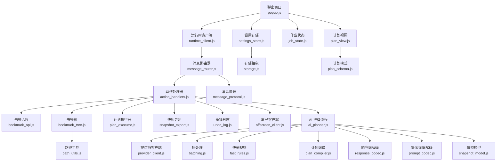
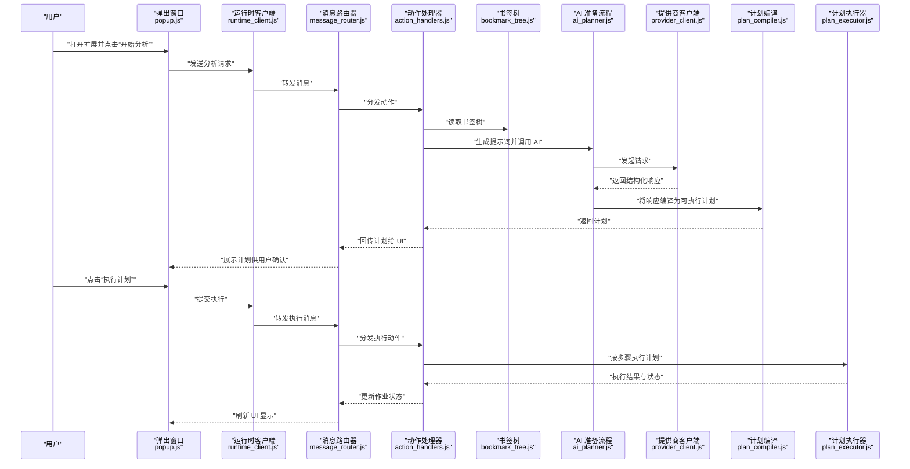
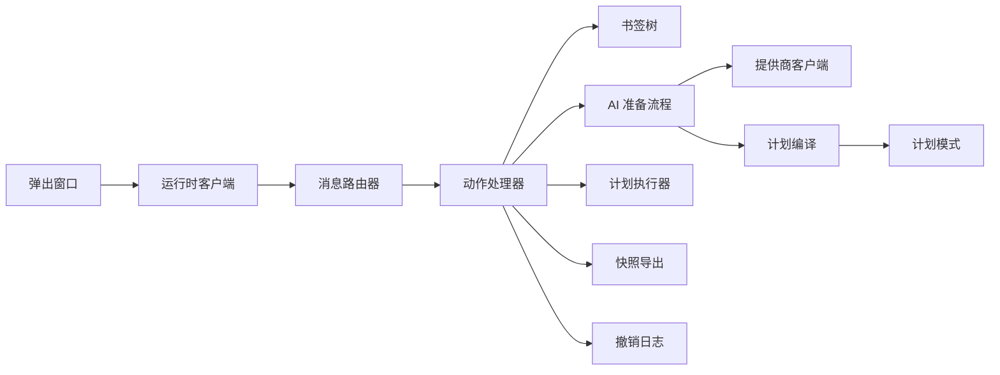

# 用户指南

<cite>
**本文引用的文件**   
- [README.md](file://README.md)
- [extension/manifest.json](file://extension/manifest.json)
- [extension/popup.html](file://extension/popup.html)
- [extension/popup.js](file://extension/popup.js)
- [extension/popup/runtime_client.js](file://extension/popup/runtime_client.js)
- [extension/popup/plan_view.js](file://extension/popup/plan_view.js)
- [extension/popup/job_state.js](file://extension/popup/job_state.js)
- [extension/popup/settings_store.js](file://extension/popup/settings_store.js)
- [extension/background/action_handlers.js](file://extension/background/action_handlers.js)
- [extension/background/message_router.js](file://extension/background/message_router.js)
- [extension/background/bookmark_api.js](file://extension/background/bookmark_api.js)
- [extension/background/bookmark_tree.js](file://extension/background/bookmark_tree.js)
- [extension/background/plan_executor.js](file://extension/background/plan_executor.js)
- [extension/background/snapshot_export.js](file://extension/background/snapshot_export.js)
- [extension/background/undo_log.js](file://extension/background/undo_log.js)
- [extension/background/offscreen_client.js](file://extension/background/offscreen_client.js)
- [extension/ai/provider_client.js](file://extension/ai/provider_client.js)
- [extension/ai/batching.js](file://extension/ai/batching.js)
- [extension/ai/fast_rules.js](file://extension/ai/fast_rules.js)
- [extension/ai/plan_compiler.js](file://extension/ai/plan_compiler.js)
- [extension/ai/response_codec.js](file://extension/ai/response_codec.js)
- [extension/ai/prompt_codec.js](file://extension/ai/prompt_codec.js)
- [extension/ai/snapshot_model.js](file://extension/ai/snapshot_model.js)
- [extension/shared/message_protocol.js](file://extension/shared/message_protocol.js)
- [extension/shared/storage.js](file://extension/shared/storage.js)
- [extension/shared/plan_schema.js](file://extension/shared/plan_schema.js)
- [extension/shared/path_utils.js](file://extension/shared/path_utils.js)
- [extension/ai_planner.js](file://extension/ai_planner.js)
- [extension/service_worker.js](file://extension/service_worker.js)
- [extension/offscreen.js](file://extension/offscreen.js)
- [config/rules.yaml](file://config/rules.yaml)
- [skills/bookmark-reorg/SKILL.md](file://skills/bookmark-reorg/SKILL.md)
- [skills/bookmark-url-review/SKILL.md](file://skills/bookmark-url-review/SKILL.md)
</cite>

## 目录
1. [简介](#简介)
2. [项目结构](#项目结构)
3. [核心组件](#核心组件)
4. [架构总览](#架构总览)
5. [详细组件分析](#详细组件分析)
6. [依赖关系分析](#依赖关系分析)
7. [性能与体验优化建议](#性能与体验优化建议)
8. [故障排查指南](#故障排查指南)
9. [结论](#结论)
10. [附录](#附录)

## 简介
本指南面向 Edge Bookmark 浏览器扩展的用户，帮助你快速上手并高效使用书签重组、批量操作、快照备份与恢复、自动化规则以及技能系统。文档从用户界面入手，逐步深入到工作流、配置与最佳实践，确保你既能完成日常任务，也能在复杂场景下稳定运行。

## 项目结构
Edge Bookmark 由以下主要部分组成：
- 弹出窗口（UI）：提供交互入口、计划预览、作业状态与设置管理
- 后台服务：负责消息路由、书签树构建、AI 编排、执行策略、快照导出与撤销日志
- AI 模块：封装与外部大模型提供商的通信、批处理、提示词与响应编解码、计划编译
- 共享层：消息协议、存储抽象、计划模式校验、路径工具
- 技能系统：内置“书签重组”和“URL 审查”技能，支持自定义扩展
- 配置：YAML 规则文件用于自动化规则

图表来源
- [extension/popup.js](file://extension/popup.js)
- [extension/popup/runtime_client.js](file://extension/popup/runtime_client.js)
- [extension/popup/plan_view.js](file://extension/popup/plan_view.js)
- [extension/popup/job_state.js](file://extension/popup/job_state.js)
- [extension/popup/settings_store.js](file://extension/popup/settings_store.js)
- [extension/background/message_router.js](file://extension/background/message_router.js)
- [extension/background/action_handlers.js](file://extension/background/action_handlers.js)
- [extension/background/bookmark_api.js](file://extension/background/bookmark_api.js)
- [extension/background/bookmark_tree.js](file://extension/background/bookmark_tree.js)
- [extension/background/plan_executor.js](file://extension/background/plan_executor.js)
- [extension/background/snapshot_export.js](file://extension/background/snapshot_export.js)
- [extension/background/undo_log.js](file://extension/background/undo_log.js)
- [extension/background/offscreen_client.js](file://extension/background/offscreen_client.js)
- [extension/ai_planner.js](file://extension/ai_planner.js)
- [extension/ai/provider_client.js](file://extension/ai/provider_client.js)
- [extension/ai/batching.js](file://extension/ai/batching.js)
- [extension/ai/fast_rules.js](file://extension/ai/fast_rules.js)
- [extension/ai/plan_compiler.js](file://extension/ai/plan_compiler.js)
- [extension/ai/response_codec.js](file://extension/ai/response_codec.js)
- [extension/ai/prompt_codec.js](file://extension/ai/prompt_codec.js)
- [extension/ai/snapshot_model.js](file://extension/ai/snapshot_model.js)
- [extension/shared/message_protocol.js](file://extension/shared/message_protocol.js)
- [extension/shared/storage.js](file://extension/shared/storage.js)
- [extension/shared/plan_schema.js](file://extension/shared/plan_schema.js)
- [extension/shared/path_utils.js](file://extension/shared/path_utils.js)

章节来源
- [extension/manifest.json](file://extension/manifest.json)
- [extension/popup.html](file://extension/popup.html)
- [extension/popup.js](file://extension/popup.js)
- [extension/background/message_router.js](file://extension/background/message_router.js)
- [extension/background/action_handlers.js](file://extension/background/action_handlers.js)
- [extension/ai_planner.js](file://extension/ai_planner.js)

## 核心组件
- 弹出窗口（UI）
  - 功能区域：触发 AI 分析、选择书签范围、查看与确认执行计划、预览变更、管理作业与设置
  - 关键文件：[popup.js](file://extension/popup.js)、[plan_view.js](file://extension/popup/plan_view.js)、[job_state.js](file://extension/popup/job_state.js)、[settings_store.js](file://extension/popup/settings_store.js)
- 后台服务
  - 消息路由与动作分发、书签树构建、计划执行、快照导出、撤销日志、离屏页面通信
  - 关键文件：[message_router.js](file://extension/background/message_router.js)、[action_handlers.js](file://extension/background/action_handlers.js)、[bookmark_tree.js](file://extension/background/bookmark_tree.js)、[plan_executor.js](file://extension/background/plan_executor.js)、[snapshot_export.js](file://extension/background/snapshot_export.js)、[undo_log.js](file://extension/background/undo_log.js)、[offscreen_client.js](file://extension/background/offscreen_client.js)
- AI 模块
  - 与外部大模型提供商通信、批处理请求、快速规则匹配、提示词与响应编解码、计划编译与快照模型
  - 关键文件：[provider_client.js](file://extension/ai/provider_client.js)、[batching.js](file://extension/ai/batching.js)、[fast_rules.js](file://extension/ai/fast_rules.js)、[prompt_codec.js](file://extension/ai/prompt_codec.js)、[response_codec.js](file://extension/ai/response_codec.js)、[plan_compiler.js](file://extension/ai/plan_compiler.js)、[snapshot_model.js](file://extension/ai/snapshot_model.js)
- 共享层
  - 消息协议、存储抽象、计划模式校验、路径工具
  - 关键文件：[message_protocol.js](file://extension/shared/message_protocol.js)、[storage.js](file://extension/shared/storage.js)、[plan_schema.js](file://extension/shared/plan_schema.js)、[path_utils.js](file://extension/shared/path_utils.js)
- 技能系统
  - 内置技能：书签重组、URL 审查；支持自定义技能
  - 关键文件：[SKILL.md](file://skills/bookmark-reorg/SKILL.md)、[SKILL.md](file://skills/bookmark-url-review/SKILL.md)
- 配置
  - YAML 规则文件用于自动化规则
  - 关键文件：[rules.yaml](file://config/rules.yaml)

章节来源
- [extension/popup.js](file://extension/popup.js)
- [extension/popup/plan_view.js](file://extension/popup/plan_view.js)
- [extension/popup/job_state.js](file://extension/popup/job_state.js)
- [extension/popup/settings_store.js](file://extension/popup/settings_store.js)
- [extension/background/message_router.js](file://extension/background/message_router.js)
- [extension/background/action_handlers.js](file://extension/background/action_handlers.js)
- [extension/background/bookmark_tree.js](file://extension/background/bookmark_tree.js)
- [extension/background/plan_executor.js](file://extension/background/plan_executor.js)
- [extension/background/snapshot_export.js](file://extension/background/snapshot_export.js)
- [extension/background/undo_log.js](file://extension/background/undo_log.js)
- [extension/background/offscreen_client.js](file://extension/background/offscreen_client.js)
- [extension/ai/provider_client.js](file://extension/ai/provider_client.js)
- [extension/ai/batching.js](file://extension/ai/batching.js)
- [extension/ai/fast_rules.js](file://extension/ai/fast_rules.js)
- [extension/ai/prompt_codec.js](file://extension/ai/prompt_codec.js)
- [extension/ai/response_codec.js](file://extension/ai/response_codec.js)
- [extension/ai/plan_compiler.js](file://extension/ai/plan_compiler.js)
- [extension/ai/snapshot_model.js](file://extension/ai/snapshot_model.js)
- [extension/shared/message_protocol.js](file://extension/shared/message_protocol.js)
- [extension/shared/storage.js](file://extension/shared/storage.js)
- [extension/shared/plan_schema.js](file://extension/shared/plan_schema.js)
- [extension/shared/path_utils.js](file://extension/shared/path_utils.js)
- [skills/bookmark-reorg/SKILL.md](file://skills/bookmark-reorg/SKILL.md)
- [skills/bookmark-url-review/SKILL.md](file://skills/bookmark-url-review/SKILL.md)
- [config/rules.yaml](file://config/rules.yaml)

## 架构总览
下图展示了从用户点击到计划执行的端到端流程，涵盖 UI、消息路由、书签树、AI 分析与计划执行等关键环节。

图表来源
- [extension/popup.js](file://extension/popup.js)
- [extension/popup/runtime_client.js](file://extension/popup/runtime_client.js)
- [extension/background/message_router.js](file://extension/background/message_router.js)
- [extension/background/action_handlers.js](file://extension/background/action_handlers.js)
- [extension/background/bookmark_tree.js](file://extension/background/bookmark_tree.js)
- [extension/ai_planner.js](file://extension/ai_planner.js)
- [extension/ai/provider_client.js](file://extension/ai/provider_client.js)
- [extension/ai/plan_compiler.js](file://extension/ai/plan_compiler.js)
- [extension/background/plan_executor.js](file://extension/background/plan_executor.js)

## 详细组件分析

### 弹出窗口（UI）
- 主要功能区域
  - 顶部：标题与状态指示（如“就绪”、“分析中”、“等待确认”、“执行中”）
  - 中部：书签选择区（按文件夹或关键词筛选）、规则与偏好设置入口
  - 下部：计划预览面板（步骤列表、影响范围、风险等级）、操作按钮（“重新分析”、“执行计划”、“取消”）
- 关键交互
  - 点击“开始分析”后，UI 进入“分析中”状态，禁用危险操作
  - 收到计划后，切换到“等待确认”，高亮受影响节点并提供“预览变更”
  - 确认后进入“执行中”，实时显示进度与失败重试信息
- 相关文件
  - [popup.js](file://extension/popup.js)
  - [plan_view.js](file://extension/popup/plan_view.js)
  - [job_state.js](file://extension/popup/job_state.js)
  - [settings_store.js](file://extension/popup/settings_store.js)

章节来源
- [extension/popup.js](file://extension/popup.js)
- [extension/popup/plan_view.js](file://extension/popup/plan_view.js)
- [extension/popup/job_state.js](file://extension/popup/job_state.js)
- [extension/popup/settings_store.js](file://extension/popup/settings_store.js)

### 消息路由与动作分发
- 作用
  - 统一接收来自 UI 的消息，根据类型分发至对应动作处理器
  - 维护消息协议版本与兼容性
- 关键点
  - 消息类型定义与路由表
  - 错误码与重试策略
- 相关文件
  - [message_router.js](file://extension/background/message_router.js)
  - [message_protocol.js](file://extension/shared/message_protocol.js)

章节来源
- [extension/background/message_router.js](file://extension/background/message_router.js)
- [extension/shared/message_protocol.js](file://extension/shared/message_protocol.js)

### 书签树与书签 API
- 作用
  - 构建书签树结构，提供增删改查接口
  - 支持批量操作与路径解析
- 关键点
  - 树形结构与缓存策略
  - 路径工具与层级计算
- 相关文件
  - [bookmark_tree.js](file://extension/background/bookmark_tree.js)
  - [bookmark_api.js](file://extension/background/bookmark_api.js)
  - [path_utils.js](file://extension/shared/path_utils.js)

章节来源
- [extension/background/bookmark_tree.js](file://extension/background/bookmark_tree.js)
- [extension/background/bookmark_api.js](file://extension/background/bookmark_api.js)
- [extension/shared/path_utils.js](file://extension/shared/path_utils.js)

### AI 分析与计划编译
- 工作流程
  - 收集上下文（书签树片段、规则、用户意图）
  - 构造提示词并调用外部提供商
  - 解析响应并编译为可执行计划
  - 通过计划模式进行校验
- 关键点
  - 批处理与快速规则提升效率
  - 提示词与响应的安全编码
  - 计划结构的合法性检查
- 相关文件
  - [ai_planner.js](file://extension/ai_planner.js)
  - [provider_client.js](file://extension/ai/provider_client.js)
  - [batching.js](file://extension/ai/batching.js)
  - [fast_rules.js](file://extension/ai/fast_rules.js)
  - [prompt_codec.js](file://extension/ai/prompt_codec.js)
  - [response_codec.js](file://extension/ai/response_codec.js)
  - [plan_compiler.js](file://extension/ai/plan_compiler.js)
  - [plan_schema.js](file://extension/shared/plan_schema.js)

章节来源
- [extension/ai_planner.js](file://extension/ai_planner.js)
- [extension/ai/provider_client.js](file://extension/ai/provider_client.js)
- [extension/ai/batching.js](file://extension/ai/batching.js)
- [extension/ai/fast_rules.js](file://extension/ai/fast_rules.js)
- [extension/ai/prompt_codec.js](file://extension/ai/prompt_codec.js)
- [extension/ai/response_codec.js](file://extension/ai/response_codec.js)
- [extension/ai/plan_compiler.js](file://extension/ai/plan_compiler.js)
- [extension/shared/plan_schema.js](file://extension/shared/plan_schema.js)

### 计划执行与撤销日志
- 作用
  - 按步骤执行计划，记录每一步的结果与副作用
  - 维护撤销日志，支持一键回滚
- 关键点
  - 原子性控制与失败重试
  - 执行策略与权限检查
- 相关文件
  - [plan_executor.js](file://extension/background/plan_executor.js)
  - [undo_log.js](file://extension/background/undo_log.js)

章节来源
- [extension/background/plan_executor.js](file://extension/background/plan_executor.js)
- [extension/background/undo_log.js](file://extension/background/undo_log.js)

### 快照备份与恢复
- 功能
  - 手动创建快照：导出当前书签树与元数据
  - 自动备份策略：基于事件或定时触发
  - 数据恢复：导入快照并合并或覆盖
- 关键点
  - 快照模型与增量差异
  - 导出格式与兼容性
- 相关文件
  - [snapshot_export.js](file://extension/background/snapshot_export.js)
  - [snapshot_model.js](file://extension/ai/snapshot_model.js)

章节来源
- [extension/background/snapshot_export.js](file://extension/background/snapshot_export.js)
- [extension/ai/snapshot_model.js](file://extension/ai/snapshot_model.js)

### 离屏页面与后台服务
- 作用
  - 提供离屏页面以执行长时间任务
  - 管理 Service Worker 生命周期与资源
- 关键点
  - 与后台服务的消息通道
  - 内存与并发限制
- 相关文件
  - [offscreen.js](file://extension/offscreen.js)
  - [service_worker.js](file://extension/service_worker.js)
  - [offscreen_client.js](file://extension/background/offscreen_client.js)

章节来源
- [extension/offscreen.js](file://extension/offscreen.js)
- [extension/service_worker.js](file://extension/service_worker.js)
- [extension/background/offscreen_client.js](file://extension/background/offscreen_client.js)

### 自动化规则（YAML）
- 用途
  - 定义书签重组的规则集，包括匹配条件、目标位置、优先级与约束
- 编写要点
  - 使用标准 YAML 语法
  - 明确规则名称、匹配表达式、目标路径与执行策略
  - 支持预定义规则的定制与组合
- 配置文件
  - [rules.yaml](file://config/rules.yaml)

章节来源
- [config/rules.yaml](file://config/rules.yaml)

### 技能系统
- 内置技能
  - 书签重组：根据规则与上下文自动生成重组计划
  - URL 审查：对书签链接进行健康度与有效性评估
- 自定义技能
  - 遵循 SKILL.md 规范，描述输入输出、执行步骤与依赖
  - 部署方法：将技能目录放入 skills 目录并按约定命名
- 参考文件
  - [SKILL.md](file://skills/bookmark-reorg/SKILL.md)
  - [SKILL.md](file://skills/bookmark-url-review/SKILL.md)

章节来源
- [skills/bookmark-reorg/SKILL.md](file://skills/bookmark-reorg/SKILL.md)
- [skills/bookmark-url-review/SKILL.md](file://skills/bookmark-url-review/SKILL.md)

## 依赖关系分析
- 组件耦合
  - UI 仅通过运行时客户端与后台通信，保持低耦合
  - 动作处理器集中协调书签树、AI、执行器与快照模块
- 外部依赖
  - 大模型提供商通过提供商客户端访问，支持多后端
  - 存储抽象屏蔽底层实现差异
- 潜在循环依赖
  - 通过消息协议与分层设计避免直接循环引用

图表来源
- [extension/popup.js](file://extension/popup.js)
- [extension/popup/runtime_client.js](file://extension/popup/runtime_client.js)
- [extension/background/message_router.js](file://extension/background/message_router.js)
- [extension/background/action_handlers.js](file://extension/background/action_handlers.js)
- [extension/background/bookmark_tree.js](file://extension/background/bookmark_tree.js)
- [extension/ai_planner.js](file://extension/ai_planner.js)
- [extension/ai/provider_client.js](file://extension/ai/provider_client.js)
- [extension/ai/plan_compiler.js](file://extension/ai/plan_compiler.js)
- [extension/shared/plan_schema.js](file://extension/shared/plan_schema.js)
- [extension/background/plan_executor.js](file://extension/background/plan_executor.js)
- [extension/background/snapshot_export.js](file://extension/background/snapshot_export.js)
- [extension/background/undo_log.js](file://extension/background/undo_log.js)

章节来源
- [extension/popup.js](file://extension/popup.js)
- [extension/popup/runtime_client.js](file://extension/popup/runtime_client.js)
- [extension/background/message_router.js](file://extension/background/message_router.js)
- [extension/background/action_handlers.js](file://extension/background/action_handlers.js)
- [extension/background/bookmark_tree.js](file://extension/background/bookmark_tree.js)
- [extension/ai_planner.js](file://extension/ai_planner.js)
- [extension/ai/provider_client.js](file://extension/ai/provider_client.js)
- [extension/ai/plan_compiler.js](file://extension/ai/plan_compiler.js)
- [extension/shared/plan_schema.js](file://extension/shared/plan_schema.js)
- [extension/background/plan_executor.js](file://extension/background/plan_executor.js)
- [extension/background/snapshot_export.js](file://extension/background/snapshot_export.js)
- [extension/background/undo_log.js](file://extension/background/undo_log.js)

## 性能与体验优化建议
- 批量操作
  - 优先选择最小必要范围的书签子树进行分析，减少提示词长度与网络往返
  - 利用快速规则进行预过滤，降低 AI 负载
- 计划执行
  - 启用分批执行与失败重试，避免长事务阻塞
  - 在执行前进行计划模式校验，提前发现非法步骤
- 快照管理
  - 使用增量差异导出，减少存储空间与传输开销
  - 定期自动备份，结合版本号与时间戳便于回溯
- 用户体验
  - 在 UI 中清晰展示状态与进度，提供“暂停/继续”与“回滚”能力
  - 对高风险操作增加二次确认与风险提示

## 故障排查指南
- 常见问题
  - 无法连接 AI 提供商：检查网络与凭据配置，确认提供商客户端可用
  - 计划编译失败：核对计划模式与响应结构，查看错误详情
  - 执行中断：查看撤销日志与执行器状态，必要时回滚
  - 快照导入异常：验证快照模型版本与完整性
- 定位手段
  - 查看作业状态与消息路由日志
  - 使用计划视图的“预览变更”对比差异
  - 检查离屏页面与 Service Worker 的生命周期状态

章节来源
- [extension/popup/job_state.js](file://extension/popup/job_state.js)
- [extension/background/message_router.js](file://extension/background/message_router.js)
- [extension/background/plan_executor.js](file://extension/background/plan_executor.js)
- [extension/background/undo_log.js](file://extension/background/undo_log.js)
- [extension/ai/plan_compiler.js](file://extension/ai/plan_compiler.js)
- [extension/ai/snapshot_model.js](file://extension/ai/snapshot_model.js)

## 结论
Edge Bookmark 通过清晰的 UI、稳健的后台服务与强大的 AI 能力，为用户提供高效的书签重组与批量管理能力。配合自动化规则与技能系统，你可以在保证安全的前提下，持续优化书签组织与质量。建议从小范围规则与技能开始，逐步扩展到更复杂的场景，并结合快照机制保障数据安全。

## 附录
- 安装与启动
  - 在 Edge 扩展管理中加载本地扩展目录，确认 manifest 配置正确
  - 首次使用时在弹出窗口中配置 AI 提供商与默认规则
- 常用快捷键
  - 在弹出窗口中可通过键盘导航快速切换功能区
- 参考文档
  - 项目说明与总体设计请参考 README 与设计文档

章节来源
- [README.md](file://README.md)
- [extension/manifest.json](file://extension/manifest.json)
- [extension/popup.html](file://extension/popup.html)