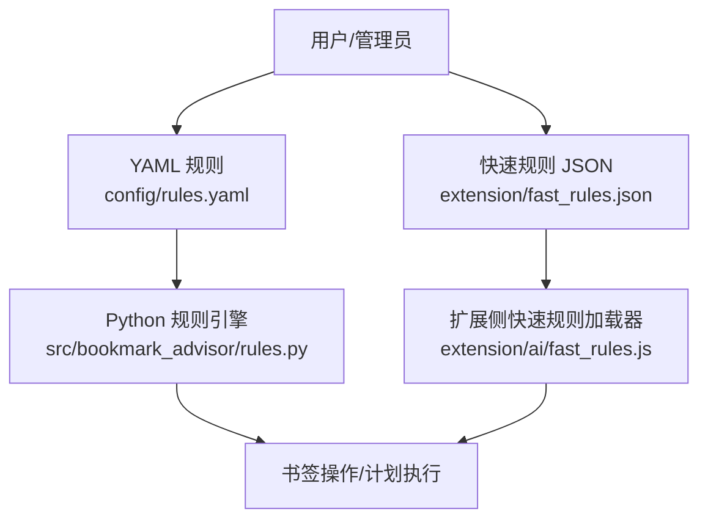
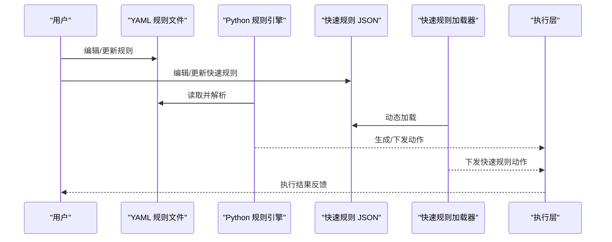
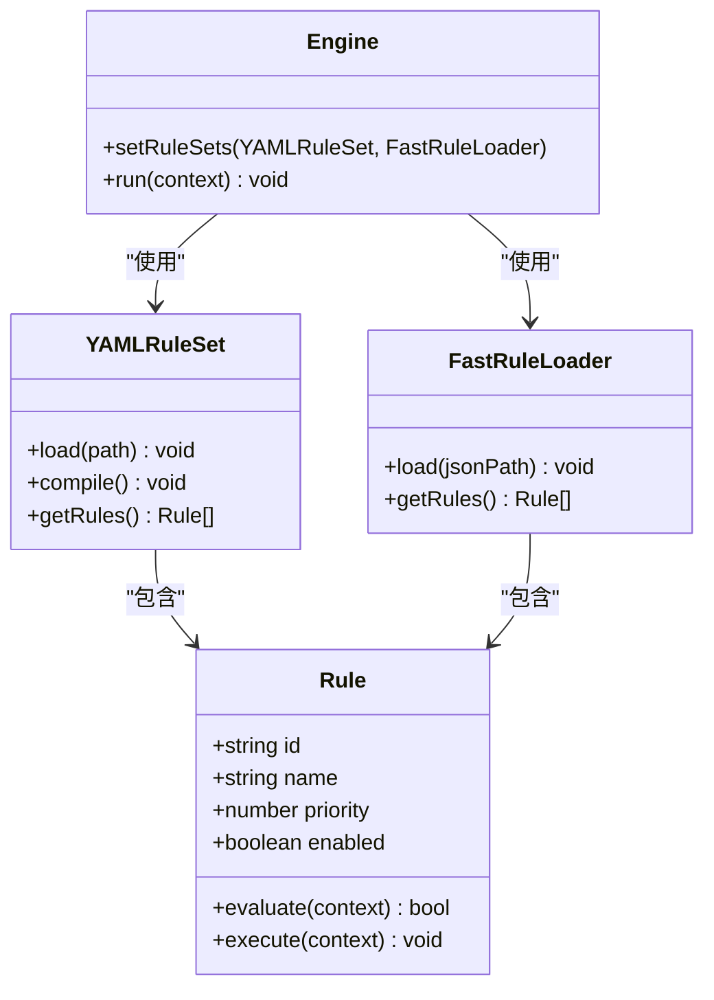
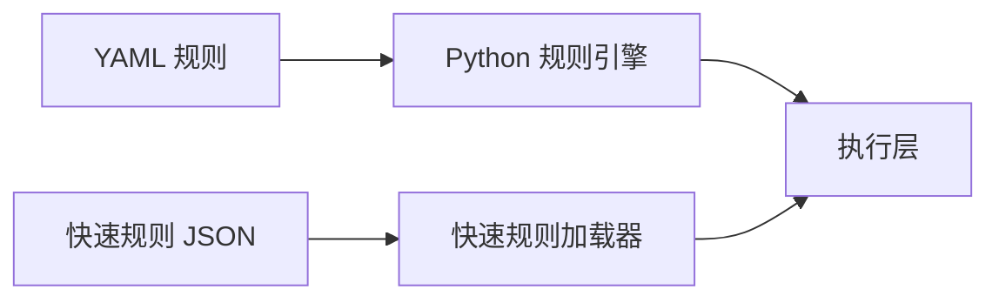

# 规则配置

<cite>
**本文引用的文件**   
- [config/rules.yaml](file://config/rules.yaml)
- [extension/fast_rules.json](file://extension/fast_rules.json)
- [extension/ai/fast_rules.js](file://extension/ai/fast_rules.js)
- [src/bookmark_advisor/rules.py](file://src/bookmark_advisor/rules.py)
- [tests/test_rules.py](file://tests/test_rules.py)
- [tests/test_extension_fast_rules.py](file://tests/test_extension_fast_rules.py)
</cite>

## 目录
1. [简介](#简介)
2. [项目结构](#项目结构)
3. [核心组件](#核心组件)
4. [架构总览](#架构总览)
5. [详细组件分析](#详细组件分析)
6. [依赖分析](#依赖分析)
7. [性能考虑](#性能考虑)
8. [故障排除指南](#故障排除指南)
9. [结论](#结论)
10. [附录](#附录)

## 简介
本指南面向需要配置和使用自动化规则的用户与开发者，聚焦以下目标：
- 解释自动化规则的工作原理与应用场景（触发条件、执行动作、优先级）
- 说明 YAML 规则文件的编写语法（基础语法、条件表达式、变量引用、函数调用）
- 介绍预定义规则的定制方法（修改现有规则、添加新规则、测试验证）
- 说明快速规则系统的配置与使用（JSON 格式的快速规则定义与动态加载）
- 提供复杂业务场景的规则设计示例（智能分类、自动清理、权限控制等）
- 给出规则调试与故障排除方法，以及性能优化建议

## 项目结构
本项目包含两套规则体系：
- YAML 规则：位于 config/rules.yaml，用于结构化、可维护的复杂规则编排
- 快速规则：位于 extension/fast_rules.json，由扩展侧 fast_rules.js 动态加载与执行

图表来源
- [config/rules.yaml](file://config/rules.yaml)
- [extension/fast_rules.json](file://extension/fast_rules.json)
- [extension/ai/fast_rules.js](file://extension/ai/fast_rules.js)
- [src/bookmark_advisor/rules.py](file://src/bookmark_advisor/rules.py)

章节来源
- [config/rules.yaml](file://config/rules.yaml)
- [extension/fast_rules.json](file://extension/fast_rules.json)
- [extension/ai/fast_rules.js](file://extension/ai/fast_rules.js)
- [src/bookmark_advisor/rules.py](file://src/bookmark_advisor/rules.py)

## 核心组件
- YAML 规则文件：集中管理规则集合、触发条件、动作与优先级
- Python 规则引擎：解析 YAML、评估条件、调度动作
- 快速规则 JSON：轻量级、热加载的规则定义，适合高频或简单场景
- 扩展侧快速规则加载器：在浏览器扩展环境中读取并应用快速规则

章节来源
- [config/rules.yaml](file://config/rules.yaml)
- [src/bookmark_advisor/rules.py](file://src/bookmark_advisor/rules.py)
- [extension/fast_rules.json](file://extension/fast_rules.json)
- [extension/ai/fast_rules.js](file://extension/ai/fast_rules.js)

## 架构总览
下图展示了从规则定义到执行的端到端流程。YAML 规则通过 Python 引擎处理；快速规则由扩展侧加载后直接参与执行。

图表来源
- [config/rules.yaml](file://config/rules.yaml)
- [extension/fast_rules.json](file://extension/fast_rules.json)
- [extension/ai/fast_rules.js](file://extension/ai/fast_rules.js)
- [src/bookmark_advisor/rules.py](file://src/bookmark_advisor/rules.py)

## 详细组件分析

### YAML 规则系统
- 作用：以声明式方式描述规则集合、触发条件、动作与优先级
- 典型字段（概念性说明）：
  - 规则标识与名称
  - 触发条件（基于上下文变量的布尔表达式）
  - 动作列表（如移动、重命名、打标签、创建计划等）
  - 优先级（数值越小越优先，或按语义排序）
  - 变量与作用域（上下文数据、书签属性、时间窗口等）
  - 函数调用（内置字符串/路径/日期/集合工具）
- 编写要点：
  - 使用缩进与键值对组织层级
  - 条件表达式支持比较、逻辑组合、集合匹配
  - 变量引用采用统一占位符语法
  - 函数调用遵循“函数名(参数)”形式，参数可为字面量或变量
- 示例场景：
  - 智能分类：根据 URL 模式、标题关键词、访问频率归类到指定文件夹
  - 自动清理：超过 N 天未访问且无标签的书签归档或删除
  - 权限控制：仅允许特定角色对某类书签进行写操作

章节来源
- [config/rules.yaml](file://config/rules.yaml)
- [src/bookmark_advisor/rules.py](file://src/bookmark_advisor/rules.py)
- [tests/test_rules.py](file://tests/test_rules.py)

### 快速规则系统（JSON）
- 作用：以 JSON 定义轻量规则，便于在扩展侧动态加载与即时生效
- 典型结构（概念性说明）：
  - 规则数组，每项包含 id、name、enabled、condition、actions、priority
  - condition 为对象或表达式字符串
  - actions 为动作数组，每个动作含 type 与参数
- 动态加载：
  - 扩展启动或热重载时读取 extension/fast_rules.json
  - 解析后注入执行管线，与 YAML 规则并行或合并执行
- 适用场景：
  - 高频短路径判断（如白名单/黑名单过滤）
  - 临时开关与灰度策略
  - 前端交互触发的即时规则

章节来源
- [extension/fast_rules.json](file://extension/fast_rules.json)
- [extension/ai/fast_rules.js](file://extension/ai/fast_rules.js)
- [tests/test_extension_fast_rules.py](file://tests/test_extension_fast_rules.py)

### 规则引擎与执行模型
- 解析阶段：
  - 读取 YAML/JSON 源
  - 校验结构与必填字段
  - 编译条件表达式与动作模板
- 评估阶段：
  - 构建上下文（当前书签、用户、时间、历史行为等）
  - 按优先级顺序评估规则，命中即执行对应动作
- 执行阶段：
  - 将动作转换为具体操作（如移动、重命名、打标签、创建任务）
  - 记录日志与审计信息，支持回滚与撤销

章节来源
- [src/bookmark_advisor/rules.py](file://src/bookmark_advisor/rules.py)
- [tests/test_rules.py](file://tests/test_rules.py)
- [tests/test_extension_fast_rules.py](file://tests/test_extension_fast_rules.py)

### 面向对象视角（概念类图）
下图展示规则系统中的关键抽象及其关系（概念性，非源码映射）。

[此图为概念性示意，不直接映射具体源码文件]

## 依赖分析
- YAML 规则依赖 Python 规则引擎进行解析与执行
- 快速规则依赖扩展侧加载器进行热加载与注入
- 两者最终都汇聚到统一的执行层，保证一致的行为与可观测性

图表来源
- [config/rules.yaml](file://config/rules.yaml)
- [extension/fast_rules.json](file://extension/fast_rules.json)
- [extension/ai/fast_rules.js](file://extension/ai/fast_rules.js)
- [src/bookmark_advisor/rules.py](file://src/bookmark_advisor/rules.py)

章节来源
- [config/rules.yaml](file://config/rules.yaml)
- [extension/fast_rules.json](file://extension/fast_rules.json)
- [extension/ai/fast_rules.js](file://extension/ai/fast_rules.js)
- [src/bookmark_advisor/rules.py](file://src/bookmark_advisor/rules.py)

## 性能考虑
- 规则评估顺序：
  - 合理设置优先级，将高命中率、低开销的规则前置
  - 避免在早期规则中进行昂贵 I/O 或网络请求
- 条件表达式优化：
  - 尽量使用索引友好的匹配（如前缀匹配、正则缓存）
  - 短路求值，尽早返回
- 批量处理：
  - 对大批量书签进行批量化评估与动作合并
- 缓存与增量更新：
  - 缓存热点上下文与中间结果
  - 变更驱动的重算而非全量重跑
- 快速规则与 YAML 规则协同：
  - 将高频简单判断下沉至快速规则，降低主引擎压力

[本节为通用指导，无需源码引用]

## 故障排除指南
- 常见问题定位：
  - YAML 语法错误：检查缩进、键名拼写、类型匹配
  - 条件表达式不生效：确认变量存在与作用域正确
  - 动作未执行：核对优先级与 enabled 状态
  - 快速规则未加载：检查 JSON 路径与权限
- 调试手段：
  - 启用详细日志，输出规则命中与跳过原因
  - 使用最小化规则集复现问题
  - 分步验证：先验证条件，再验证动作
- 回归与测试：
  - 使用单元测试覆盖边界条件与异常路径
  - 引入快照对比，确保规则变更不影响既有行为

章节来源
- [tests/test_rules.py](file://tests/test_rules.py)
- [tests/test_extension_fast_rules.py](file://tests/test_extension_fast_rules.py)

## 结论
通过 YAML 规则与快速规则的双轨机制，系统兼顾了复杂编排与轻量高效。合理的优先级与表达式设计、完善的测试与日志体系，是保障规则稳定性的关键。建议在复杂场景中分层设计规则，并将高频判断下沉至快速规则，以获得更好的性能与可维护性。

## 附录

### YAML 规则编写速查
- 基础语法：键值对、列表、嵌套对象
- 条件表达式：比较运算符、逻辑组合、集合匹配
- 变量引用：统一占位符，注意作用域
- 函数调用：内置工具函数，参数可为字面量或变量
- 优先级：数值越小越优先（或按语义排序），确保确定性

章节来源
- [config/rules.yaml](file://config/rules.yaml)
- [src/bookmark_advisor/rules.py](file://src/bookmark_advisor/rules.py)

### 快速规则 JSON 编写速查
- 结构：id、name、enabled、condition、actions、priority
- 动态加载：扩展侧读取并注入执行管线
- 适用：高频、简单、需热更新的规则

章节来源
- [extension/fast_rules.json](file://extension/fast_rules.json)
- [extension/ai/fast_rules.js](file://extension/ai/fast_rules.js)

### 复杂场景设计示例（概念性）
- 智能分类：URL 模式 + 标题关键词 + 访问频率 → 目标文件夹
- 自动清理：超时未访问 + 无标签 → 归档/删除
- 权限控制：角色 + 资源范围 + 操作类型 → 允许/拒绝

[本节为概念性示例，不直接映射具体源码文件]