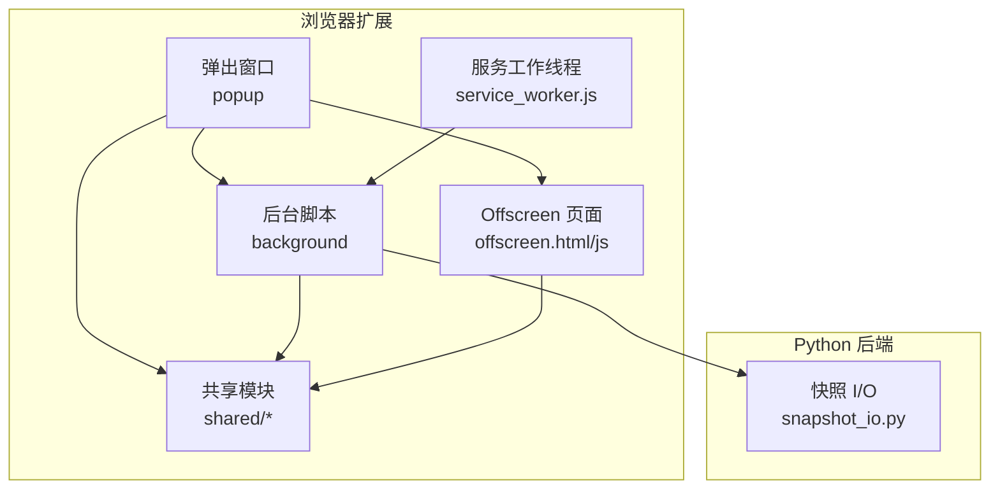
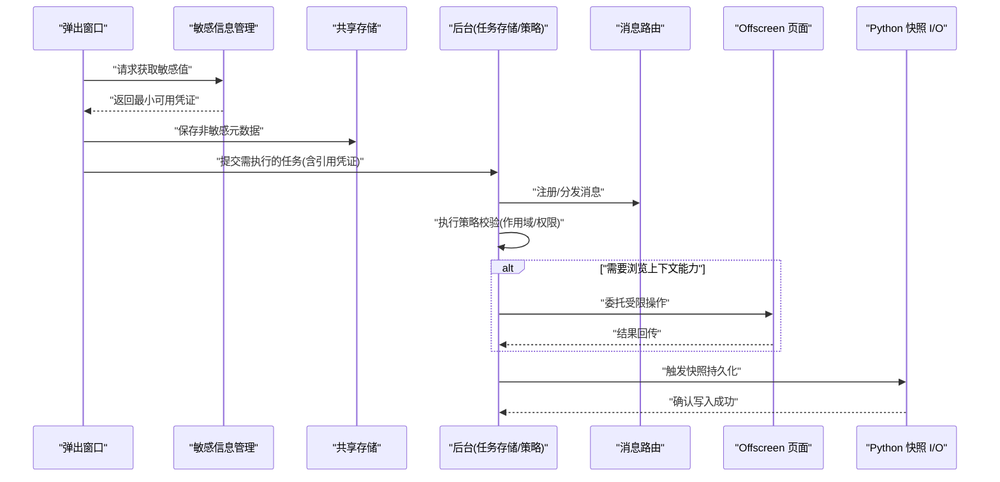
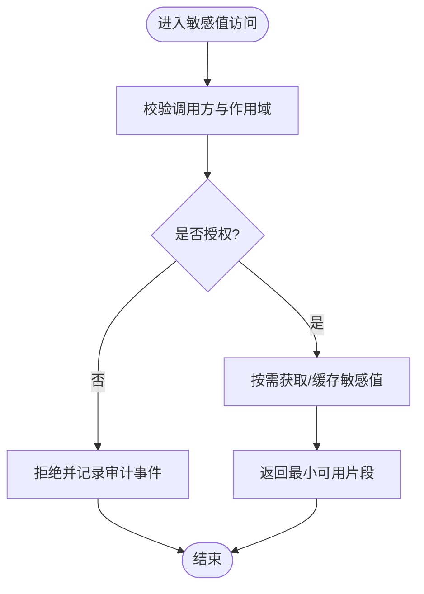
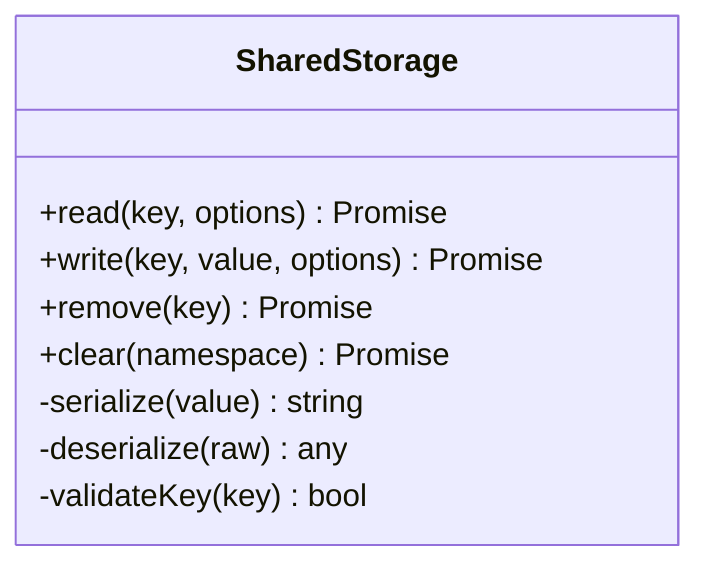
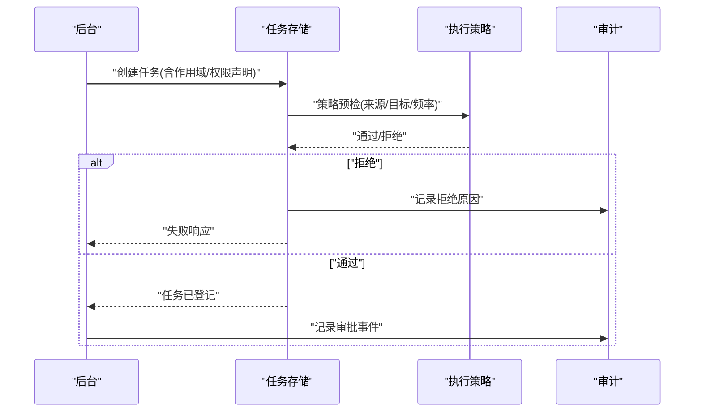
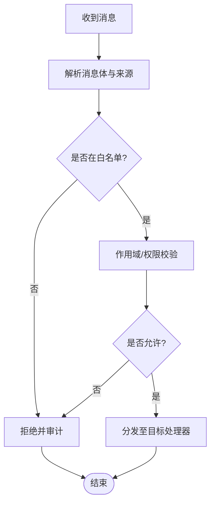
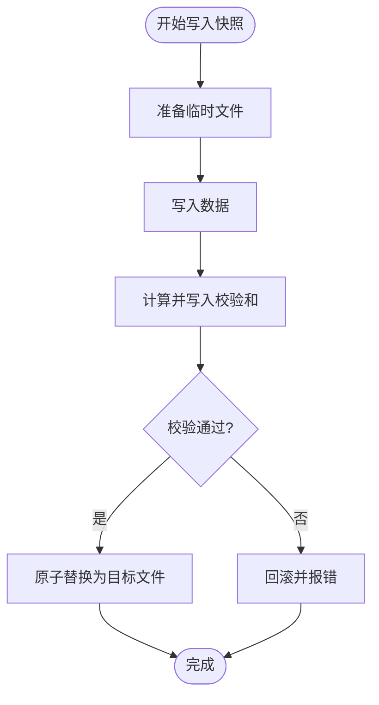
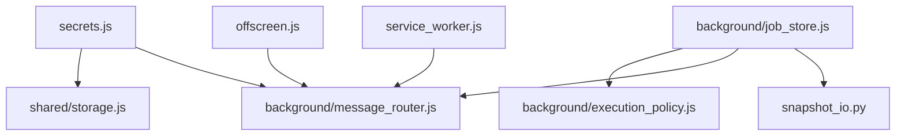

# 安全存储机制

<cite>
**本文引用的文件**   
- [extension/popup/secrets.js](file://extension/popup/secrets.js)
- [extension/shared/storage.js](file://extension/shared/storage.js)
- [extension/background/job_store.js](file://extension/background/job_store.js)
- [extension/background/execution_policy.js](file://extension/background/execution_policy.js)
- [extension/background/message_router.js](file://extension/background/message_router.js)
- [extension/offscreen.js](file://extension/offscreen.js)
- [extension/service_worker.js](file://extension/service_worker.js)
- [extension/popup/settings_store.js](file://extension/popup/settings_store.js)
- [src/bookmark_advisor/snapshot_io.py](file://src/bookmark_advisor/snapshot_io.py)
- [tests/test_extension_popup_secrets.py](file://tests/test_extension_popup_secrets.py)
- [tests/test_extension_job_store.py](file://tests/test_extension_job_store.py)
- [tests/test_extension_shared_contracts.py](file://tests/test_extension_shared_contracts.py)
</cite>

## 目录
1. [简介](#简介)
2. [项目结构](#项目结构)
3. [核心组件](#核心组件)
4. [架构总览](#架构总览)
5. [详细组件分析](#详细组件分析)
6. [依赖关系分析](#依赖关系分析)
7. [性能考虑](#性能考虑)
8. [故障排查指南](#故障排查指南)
9. [结论](#结论)
10. [附录](#附录)

## 简介
本文件围绕“安全存储机制”展开，聚焦敏感信息的加密存储方案、密钥管理、数据加密算法与安全存储后端的选择；同时覆盖访问控制（权限验证、作用域隔离、操作审计）、安全配置最佳实践（密码与 API 密钥保护、会话安全）、威胁防护（XSS、CSRF、数据泄露）以及安全审计与漏洞检测工具使用指南。文档以仓库中扩展端与 Python 后端的实际实现为依据，提供可落地的架构图、流程图与参考路径，帮助读者快速理解并落地安全存储能力。

## 项目结构
本项目包含浏览器扩展（JavaScript）与 Python 后端两部分：
- 扩展侧负责在浏览器环境中进行敏感信息处理、持久化与跨上下文通信，涉及弹出窗口、后台脚本、Offscreen 页面与服务工作线程。
- Python 侧负责快照数据的读写与持久化，作为安全存储的后端之一。

图表来源
- [extension/popup/secrets.js](file://extension/popup/secrets.js)
- [extension/shared/storage.js](file://extension/shared/storage.js)
- [extension/background/job_store.js](file://extension/background/job_store.js)
- [extension/offscreen.js](file://extension/offscreen.js)
- [extension/service_worker.js](file://extension/service_worker.js)
- [src/bookmark_advisor/snapshot_io.py](file://src/bookmark_advisor/snapshot_io.py)

章节来源
- [extension/popup/secrets.js](file://extension/popup/secrets.js)
- [extension/shared/storage.js](file://extension/shared/storage.js)
- [extension/background/job_store.js](file://extension/background/job_store.js)
- [extension/offscreen.js](file://extension/offscreen.js)
- [extension/service_worker.js](file://extension/service_worker.js)
- [src/bookmark_advisor/snapshot_io.py](file://src/bookmark_advisor/snapshot_io.py)

## 核心组件
- 敏感信息管理（弹出窗口）
  - 负责从受保护的上下文读取或生成敏感值（如令牌、密钥），并提供最小暴露面给 UI 层。
  - 关键路径参考：[extension/popup/secrets.js](file://extension/popup/secrets.js)
- 共享存储抽象（shared）
  - 封装浏览器存储接口，统一读写策略、序列化与错误处理，为上层提供一致的数据存取契约。
  - 关键路径参考：[extension/shared/storage.js](file://extension/shared/storage.js)
- 任务存储（后台）
  - 在后台上下文中维护任务状态与元数据，结合执行策略限制敏感操作的执行范围。
  - 关键路径参考：[extension/background/job_store.js](file://extension/background/job_store.js)
- 执行策略（后台）
  - 定义允许的操作类型、作用域与条件，用于约束敏感任务的运行环境。
  - 关键路径参考：[extension/background/execution_policy.js](file://extension/background/execution_policy.js)
- 消息路由（后台）
  - 集中处理跨上下文消息分发，对入站消息进行校验与鉴权，防止越权调用。
  - 关键路径参考：[extension/background/message_router.js](file://extension/background/message_router.js)
- Offscreen 页面
  - 承载受限但必要的 DOM/网络能力，配合服务工作者完成需要浏览上下文能力的敏感操作。
  - 关键路径参考：[extension/offscreen.js](file://extension/offscreen.js)
- 服务工作线程
  - 生命周期管理与事件入口，协调各子模块的启动与资源释放。
  - 关键路径参考：[extension/service_worker.js](file://extension/service_worker.js)
- Python 快照 I/O
  - 负责将结构化快照写入本地文件或远程存储，提供原子写入与一致性保障。
  - 关键路径参考：[src/bookmark_advisor/snapshot_io.py](file://src/bookmark_advisor/snapshot_io.py)

章节来源
- [extension/popup/secrets.js](file://extension/popup/secrets.js)
- [extension/shared/storage.js](file://extension/shared/storage.js)
- [extension/background/job_store.js](file://extension/background/job_store.js)
- [extension/background/execution_policy.js](file://extension/background/execution_policy.js)
- [extension/background/message_router.js](file://extension/background/message_router.js)
- [extension/offscreen.js](file://extension/offscreen.js)
- [extension/service_worker.js](file://extension/service_worker.js)
- [src/bookmark_advisor/snapshot_io.py](file://src/bookmark_advisor/snapshot_io.py)

## 架构总览
下图展示敏感数据在扩展中的流转路径与边界：弹出窗口仅持有最小必要能力，通过共享存储与后台模块交互；后台在执行前依据策略进行校验；必要时借助 Offscreen 页面完成受限能力；Python 后端负责持久化。

图表来源
- [extension/popup/secrets.js](file://extension/popup/secrets.js)
- [extension/shared/storage.js](file://extension/shared/storage.js)
- [extension/background/job_store.js](file://extension/background/job_store.js)
- [extension/background/execution_policy.js](file://extension/background/execution_policy.js)
- [extension/background/message_router.js](file://extension/background/message_router.js)
- [extension/offscreen.js](file://extension/offscreen.js)
- [src/bookmark_advisor/snapshot_io.py](file://src/bookmark_advisor/snapshot_io.py)

## 详细组件分析

### 敏感信息管理（弹出窗口）
- 职责
  - 在弹出窗口中提供安全的敏感值访问入口，避免直接暴露原始密钥。
  - 与后台协作，按需拉取或刷新凭证，减少驻留内存时间。
- 关键点
  - 最小暴露原则：对外只暴露必要方法，不暴露内部实现细节。
  - 输入校验：对所有外部传入参数进行白名单校验。
  - 日志脱敏：禁止记录任何敏感字段。
- 参考路径
  - [extension/popup/secrets.js](file://extension/popup/secrets.js)
  - [tests/test_extension_popup_secrets.py](file://tests/test_extension_popup_secrets.py)

图表来源
- [extension/popup/secrets.js](file://extension/popup/secrets.js)
- [tests/test_extension_popup_secrets.py](file://tests/test_extension_popup_secrets.py)

章节来源
- [extension/popup/secrets.js](file://extension/popup/secrets.js)
- [tests/test_extension_popup_secrets.py](file://tests/test_extension_popup_secrets.py)

### 共享存储抽象（shared）
- 职责
  - 统一封装浏览器存储接口，屏蔽底层差异，提供一致的读写语义。
  - 承担基础的数据序列化、反序列化与错误处理。
- 关键点
  - 幂等写入：重复写入不会产生副作用。
  - 错误分类：区分网络/IO/格式错误，便于上层重试与降级。
  - 作用域隔离：按命名空间隔离不同功能的数据。
- 参考路径
  - [extension/shared/storage.js](file://extension/shared/storage.js)
  - [tests/test_extension_shared_contracts.py](file://tests/test_extension_shared_contracts.py)

图表来源
- [extension/shared/storage.js](file://extension/shared/storage.js)
- [tests/test_extension_shared_contracts.py](file://tests/test_extension_shared_contracts.py)

章节来源
- [extension/shared/storage.js](file://extension/shared/storage.js)
- [tests/test_extension_shared_contracts.py](file://tests/test_extension_shared_contracts.py)

### 任务存储与执行策略（后台）
- 职责
  - 维护任务状态、上下文与作用域，确保敏感任务仅在受控环境下执行。
  - 基于策略对任务进行准入控制，包括来源、目标、频率与资源限制。
- 关键点
  - 作用域隔离：每个任务绑定到明确的作用域标识，禁止跨作用域访问。
  - 权限校验：在调度前检查调用者身份与能力。
  - 审计日志：记录关键决策点（批准/拒绝）与原因。
- 参考路径
  - [extension/background/job_store.js](file://extension/background/job_store.js)
  - [extension/background/execution_policy.js](file://extension/background/execution_policy.js)
  - [tests/test_extension_job_store.py](file://tests/test_extension_job_store.py)

图表来源
- [extension/background/job_store.js](file://extension/background/job_store.js)
- [extension/background/execution_policy.js](file://extension/background/execution_policy.js)
- [tests/test_extension_job_store.py](file://tests/test_extension_job_store.py)

章节来源
- [extension/background/job_store.js](file://extension/background/job_store.js)
- [extension/background/execution_policy.js](file://extension/background/execution_policy.js)
- [tests/test_extension_job_store.py](file://tests/test_extension_job_store.py)

### 消息路由（后台）
- 职责
  - 集中接收来自弹出窗口、Offscreen 页面与其他上下文的请求，进行鉴权与转发。
- 关键点
  - 白名单校验：仅允许已知方法与参数结构。
  - 上下文校验：严格校验发送方来源与作用域。
  - 限流与去重：防止滥用与重复提交。
- 参考路径
  - [extension/background/message_router.js](file://extension/background/message_router.js)

图表来源
- [extension/background/message_router.js](file://extension/background/message_router.js)

章节来源
- [extension/background/message_router.js](file://extension/background/message_router.js)

### Offscreen 页面与服务工作线程
- Offscreen 页面
  - 提供受限的 DOM/网络能力，用于必须依赖浏览上下文的安全操作。
  - 参考路径：[extension/offscreen.js](file://extension/offscreen.js)
- 服务工作线程
  - 管理扩展生命周期、事件订阅与资源清理。
  - 参考路径：[extension/service_worker.js](file://extension/service_worker.js)

图表来源
- [extension/service_worker.js](file://extension/service_worker.js)
- [extension/offscreen.js](file://extension/offscreen.js)
- [extension/background/message_router.js](file://extension/background/message_router.js)

章节来源
- [extension/offscreen.js](file://extension/offscreen.js)
- [extension/service_worker.js](file://extension/service_worker.js)

### Python 快照 I/O（后端）
- 职责
  - 将结构化快照数据持久化到本地或远端存储，保证原子性与一致性。
- 关键点
  - 原子写入：先写临时文件再替换，避免部分写入导致损坏。
  - 校验与回滚：写入前后校验完整性，失败时回滚。
  - 访问控制：服务端侧对写入路径与权限进行校验。
- 参考路径
  - [src/bookmark_advisor/snapshot_io.py](file://src/bookmark_advisor/snapshot_io.py)

图表来源
- [src/bookmark_advisor/snapshot_io.py](file://src/bookmark_advisor/snapshot_io.py)

章节来源
- [src/bookmark_advisor/snapshot_io.py](file://src/bookmark_advisor/snapshot_io.py)

## 依赖关系分析
- 组件耦合
  - 弹出窗口依赖共享存储与敏感信息管理，间接依赖后台的消息路由。
  - 后台任务存储依赖执行策略与消息路由，必要时委托 Offscreen 页面。
  - Python 快照 I/O 作为独立后端，通过后台触发调用。
- 外部依赖
  - 浏览器存储 API、Offscreen 页面能力、服务工作线程事件模型。
  - Python 文件系统与可能的远端存储驱动。

图表来源
- [extension/popup/secrets.js](file://extension/popup/secrets.js)
- [extension/shared/storage.js](file://extension/shared/storage.js)
- [extension/background/job_store.js](file://extension/background/job_store.js)
- [extension/background/execution_policy.js](file://extension/background/execution_policy.js)
- [extension/background/message_router.js](file://extension/background/message_router.js)
- [extension/offscreen.js](file://extension/offscreen.js)
- [extension/service_worker.js](file://extension/service_worker.js)
- [src/bookmark_advisor/snapshot_io.py](file://src/bookmark_advisor/snapshot_io.py)

章节来源
- [extension/popup/secrets.js](file://extension/popup/secrets.js)
- [extension/shared/storage.js](file://extension/shared/storage.js)
- [extension/background/job_store.js](file://extension/background/job_store.js)
- [extension/background/execution_policy.js](file://extension/background/execution_policy.js)
- [extension/background/message_router.js](file://extension/background/message_router.js)
- [extension/offscreen.js](file://extension/offscreen.js)
- [extension/service_worker.js](file://extension/service_worker.js)
- [src/bookmark_advisor/snapshot_io.py](file://src/bookmark_advisor/snapshot_io.py)

## 性能考虑
- 减少敏感值驻留时间：按需获取、用完即弃，避免长期缓存。
- 批量写入与合并：对高频小写进行批处理，降低 IO 次数。
- 异步与超时：所有 I/O 操作设置合理超时与重试上限，避免阻塞主流程。
- 作用域隔离带来的开销：通过命名空间与索引优化查询性能。

## 故障排查指南
- 常见问题定位
  - 权限拒绝：检查消息路由白名单与执行策略规则。
  - 存储异常：查看共享存储的错误分类与重试逻辑。
  - 快照写入失败：核对原子写入与校验和步骤，确认回滚是否生效。
- 建议的调试手段
  - 启用审计日志（不含敏感字段），记录关键决策点。
  - 使用单元测试复现问题，参考测试用例路径。
- 参考路径
  - [extension/background/message_router.js](file://extension/background/message_router.js)
  - [extension/shared/storage.js](file://extension/shared/storage.js)
  - [src/bookmark_advisor/snapshot_io.py](file://src/bookmark_advisor/snapshot_io.py)
  - [tests/test_extension_job_store.py](file://tests/test_extension_job_store.py)
  - [tests/test_extension_shared_contracts.py](file://tests/test_extension_shared_contracts.py)

章节来源
- [extension/background/message_router.js](file://extension/background/message_router.js)
- [extension/shared/storage.js](file://extension/shared/storage.js)
- [src/bookmark_advisor/snapshot_io.py](file://src/bookmark_advisor/snapshot_io.py)
- [tests/test_extension_job_store.py](file://tests/test_extension_job_store.py)
- [tests/test_extension_shared_contracts.py](file://tests/test_extension_shared_contracts.py)

## 结论
本项目的安全存储机制以“最小暴露、作用域隔离、策略驱动、审计可追溯”为核心原则，在扩展侧通过弹出窗口、共享存储、后台任务与策略、消息路由与 Offscreen 页面形成分层防御；在后端通过原子写入与校验保障数据一致性。建议在后续迭代中持续完善密钥轮换、传输加密与更细粒度的权限模型，并结合自动化安全扫描提升整体安全性。

## 附录

### 安全配置最佳实践清单
- 密码与 API 密钥
  - 不在代码与日志中硬编码；通过环境变量注入。
  - 使用平台提供的安全存储（如浏览器凭据管理器或系统密钥环）。
  - 定期轮换与最小权限分配。
- 会话安全
  - 短生命周期令牌；失效后立即撤销。
  - 绑定设备指纹或作用域标识，防止重用。
- 配置文件
  - 敏感项加密存储；加载时解密并在内存中使用。
  - 版本化与签名校验，防止篡改。
- 传输安全
  - 强制 HTTPS；证书固定（可选）；防中间人攻击。
- XSS 防护
  - 输出编码与内容安全策略（CSP）；禁用内联脚本。
- CSRF 防范
  - 同源策略与 SameSite Cookie；自定义请求头校验。
- 数据泄露预防
  - 最小化收集；脱敏展示；删除不再需要的数据。

### 安全审计与漏洞检测工具使用指南
- 静态分析
  - 使用 JavaScript/TypeScript 静态分析工具扫描潜在漏洞（如未校验输入、不安全 API 调用）。
- 依赖扫描
  - 对前端与 Python 依赖进行漏洞扫描，及时升级存在已知漏洞的版本。
- 运行时审计
  - 开启审计日志，记录关键操作与拒绝事件；定期审查异常模式。
- 渗透测试
  - 针对消息路由与存储接口进行越权与注入测试。
- 参考路径
  - [extension/background/message_router.js](file://extension/background/message_router.js)
  - [extension/shared/storage.js](file://extension/shared/storage.js)
  - [src/bookmark_advisor/snapshot_io.py](file://src/bookmark_advisor/snapshot_io.py)