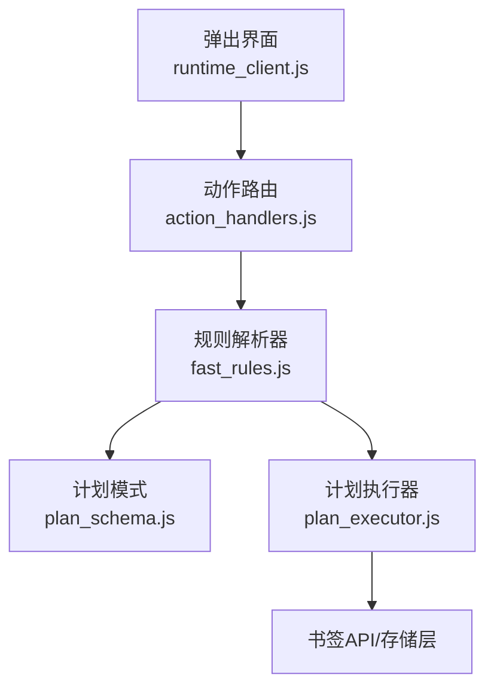
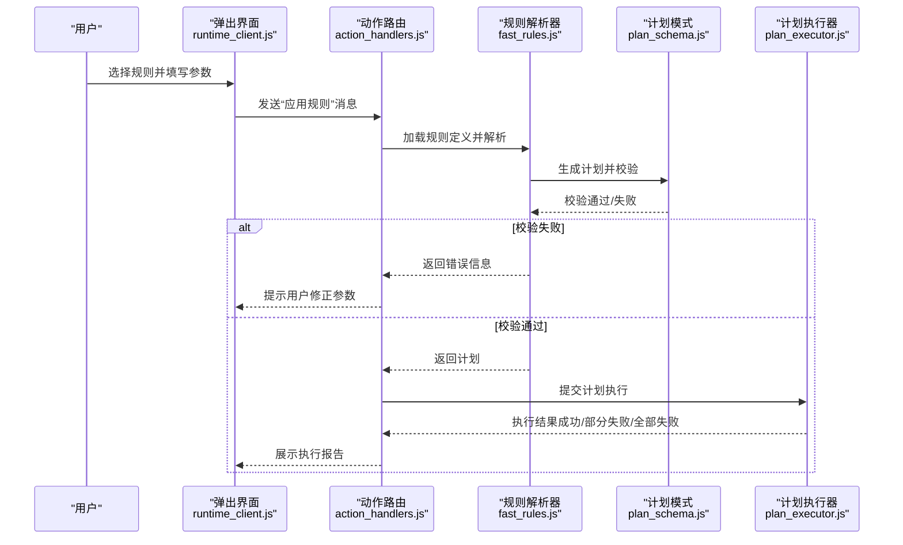
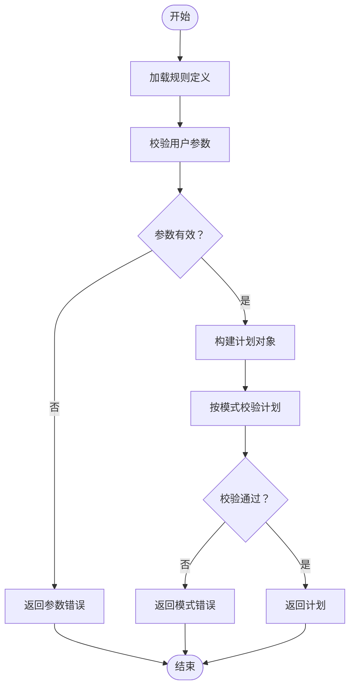
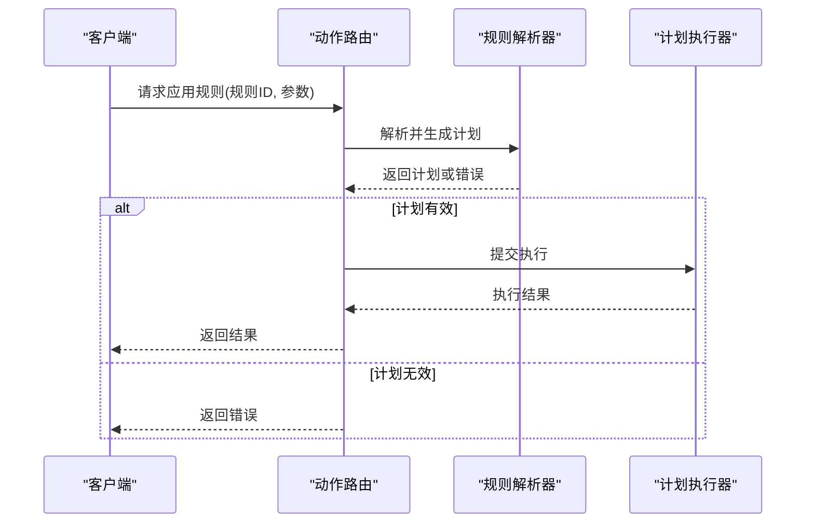
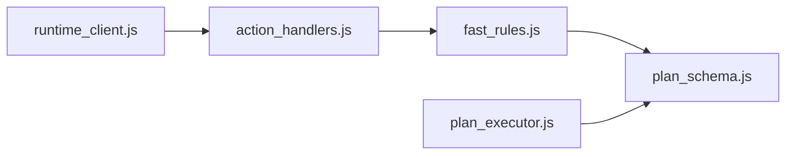

# 快速规则系统

<cite>
**本文引用的文件**   
- [extension/fast_rules.json](file://extension/fast_rules.json)
- [extension/ai/fast_rules.js](file://extension/ai/fast_rules.js)
- [extension/background/plan_executor.js](file://extension/background/plan_executor.js)
- [extension/shared/plan_schema.js](file://extension/shared/plan_schema.js)
- [extension/popup/runtime_client.js](file://extension/popup/runtime_client.js)
- [extension/background/action_handlers.js](file://extension/background/action_handlers.js)
- [tests/test_extension_fast_rules.py](file://tests/test_extension_fast_rules.py)
</cite>

## 目录
1. [简介](#简介)
2. [项目结构](#项目结构)
3. [核心组件](#核心组件)
4. [架构总览](#架构总览)
5. [详细组件分析](#详细组件分析)
6. [依赖关系分析](#依赖关系分析)
7. [性能考虑](#性能考虑)
8. [故障排查指南](#故障排查指南)
9. [结论](#结论)
10. [附录](#附录)

## 简介
本文件面向“快速规则系统”，聚焦以下目标：
- 解释设计理念：预定义规则的模板化与一键应用机制。
- 说明 fast_rules.json 的配置格式：规则分类、参数绑定与执行优先级。
- 阐述扩展机制：自定义规则添加、规则包共享与版本管理。
- 描述执行流程：规则匹配、参数验证与批量操作生成。
- 提供常用规则使用指南：书签整理、重复清理、标签管理等实际案例。
- 给出开发规范与测试方法，帮助开发者高质量地贡献规则。

## 项目结构
快速规则系统位于浏览器扩展中，关键位置如下：
- 规则定义：extension/fast_rules.json（JSON 配置）
- 规则解析与编译：extension/ai/fast_rules.js（将 JSON 转为可执行计划）
- 计划执行：extension/background/plan_executor.js（在后台服务中执行）
- 计划数据模型：extension/shared/plan_schema.js（计划结构与校验）
- 前端触发入口：extension/popup/runtime_client.js（从弹出界面发起）
- 动作路由：extension/background/action_handlers.js（消息分发与处理）
- 测试用例：tests/test_extension_fast_rules.py（覆盖规则解析与执行路径）

图表来源
- [extension/popup/runtime_client.js](file://extension/popup/runtime_client.js)
- [extension/background/action_handlers.js](file://extension/background/action_handlers.js)
- [extension/ai/fast_rules.js](file://extension/ai/fast_rules.js)
- [extension/shared/plan_schema.js](file://extension/shared/plan_schema.js)
- [extension/background/plan_executor.js](file://extension/background/plan_executor.js)

章节来源
- [extension/fast_rules.json](file://extension/fast_rules.json)
- [extension/ai/fast_rules.js](file://extension/ai/fast_rules.js)
- [extension/background/plan_executor.js](file://extension/background/plan_executor.js)
- [extension/shared/plan_schema.js](file://extension/shared/plan_schema.js)
- [extension/popup/runtime_client.js](file://extension/popup/runtime_client.js)
- [extension/background/action_handlers.js](file://extension/background/action_handlers.js)
- [tests/test_extension_fast_rules.py](file://tests/test_extension_fast_rules.py)

## 核心组件
- 规则定义（fast_rules.json）
  - 以 JSON 形式声明规则集合，包含分类、名称、描述、参数模板、匹配条件、执行步骤与优先级等元信息。
  - 支持分组与命名空间，便于组织与管理。
- 规则解析器（fast_rules.js）
  - 读取并校验规则定义，将规则实例化为中间表示（IR），再编译为“计划”对象。
  - 负责参数绑定、占位符替换、默认值填充与类型校验。
- 计划模式（plan_schema.js）
  - 定义计划的字段约束、必填项、枚举值与嵌套结构，用于静态检查与运行时保护。
- 计划执行器（plan_executor.js）
  - 在后台服务中按顺序执行计划中的原子操作，支持事务性回滚与错误恢复。
- 前端触发（runtime_client.js）
  - 暴露轻量接口供弹出界面调用，传入规则标识与用户参数，返回执行结果。
- 动作路由（action_handlers.js）
  - 接收来自弹出界面的消息，分派到规则解析与执行管线。

章节来源
- [extension/ai/fast_rules.js](file://extension/ai/fast_rules.js)
- [extension/shared/plan_schema.js](file://extension/shared/plan_schema.js)
- [extension/background/plan_executor.js](file://extension/background/plan_executor.js)
- [extension/popup/runtime_client.js](file://extension/popup/runtime_client.js)
- [extension/background/action_handlers.js](file://extension/background/action_handlers.js)

## 架构总览
快速规则的执行链路从用户点击“一键应用”开始，经过规则解析、计划生成与执行，最终完成对书签的批量操作。

图表来源
- [extension/popup/runtime_client.js](file://extension/popup/runtime_client.js)
- [extension/background/action_handlers.js](file://extension/background/action_handlers.js)
- [extension/ai/fast_rules.js](file://extension/ai/fast_rules.js)
- [extension/shared/plan_schema.js](file://extension/shared/plan_schema.js)
- [extension/background/plan_executor.js](file://extension/background/plan_executor.js)

## 详细组件分析

### 规则定义与配置格式（fast_rules.json）
- 规则分类
  - 通过分类键组织规则，如“书签整理”、“重复清理”、“标签管理”等，便于在 UI 中分组展示。
- 参数绑定
  - 每个规则可声明一组参数，包括类型、默认值、是否必填、取值范围或正则表达式等。
  - 支持占位符注入，在生成计划时进行替换。
- 执行优先级
  - 规则可设置优先级数值，用于排序与冲突消解；数值越小优先级越高（或反之，取决于实现约定）。
- 匹配条件
  - 可基于书签属性（如 URL 模式、标题、标签集合、创建时间等）进行筛选。
- 执行步骤
  - 以原子操作序列描述要执行的动作，例如移动、重命名、删除、打标签等。
- 版本与兼容性
  - 建议包含规则集版本字段，配合扩展的版本管理机制进行升级与回滚。

章节来源
- [extension/fast_rules.json](file://extension/fast_rules.json)

### 规则解析与编译（fast_rules.js）
- 读取与缓存
  - 启动时加载 fast_rules.json，并进行结构化缓存，避免重复 I/O。
- 参数校验
  - 根据规则定义的参数模式对用户输入进行强校验，缺失必填项或类型不匹配时立即报错。
- 占位符替换
  - 将用户提供的参数注入到匹配条件与执行步骤中，生成具体化的规则实例。
- 计划生成
  - 将规则实例转换为计划对象，遵循 plan_schema.js 的结构约束。
- 错误处理
  - 对解析异常、模式不匹配、非法操作等进行统一封装，向上游返回可读的错误信息。

图表来源
- [extension/ai/fast_rules.js](file://extension/ai/fast_rules.js)
- [extension/shared/plan_schema.js](file://extension/shared/plan_schema.js)

章节来源
- [extension/ai/fast_rules.js](file://extension/ai/fast_rules.js)
- [extension/shared/plan_schema.js](file://extension/shared/plan_schema.js)

### 计划模式（plan_schema.js）
- 字段约束
  - 定义计划根对象的必填字段、可选字段与嵌套结构。
- 类型与枚举
  - 明确各字段的类型（字符串、数字、布尔、数组、对象）与枚举取值。
- 校验策略
  - 提供静态校验函数，在计划生成阶段拦截非法结构，减少运行时错误。
- 扩展点
  - 预留扩展字段与兼容策略，允许未来新增操作类型而不破坏既有计划。

章节来源
- [extension/shared/plan_schema.js](file://extension/shared/plan_schema.js)

### 计划执行器（plan_executor.js）
- 执行引擎
  - 按顺序遍历计划中的操作列表，逐个执行原子动作。
- 事务与回滚
  - 记录已执行操作的逆操作，遇到失败时尝试回滚，保证一致性。
- 进度与日志
  - 输出阶段性结果与错误堆栈，便于调试与审计。
- 并发与限流
  - 对高开销操作进行节流或批处理，避免阻塞主线程或触发平台限制。

章节来源
- [extension/background/plan_executor.js](file://extension/background/plan_executor.js)

### 前端触发与路由（runtime_client.js / action_handlers.js）
- 前端接口
  - 暴露简洁的调用方法，接受规则标识与参数对象，返回 Promise 形式的结果。
- 消息协议
  - 与后台服务通过消息通道通信，确保跨上下文调用安全。
- 错误透传
  - 将后端错误信息映射为前端友好的提示文案。

章节来源
- [extension/popup/runtime_client.js](file://extension/popup/runtime_client.js)
- [extension/background/action_handlers.js](file://extension/background/action_handlers.js)

### 执行流程详解
- 规则匹配
  - 根据规则中的匹配条件筛选候选书签，支持多条件组合与正则表达式。
- 参数验证
  - 严格依据规则定义的参数模式进行校验，拒绝非法输入。
- 批量操作生成
  - 将匹配到的书签与执行步骤结合，生成完整的计划对象。
- 执行与反馈
  - 执行器按序执行计划，实时反馈进度与结果，必要时进行回滚。

图表来源
- [extension/background/action_handlers.js](file://extension/background/action_handlers.js)
- [extension/ai/fast_rules.js](file://extension/ai/fast_rules.js)
- [extension/background/plan_executor.js](file://extension/background/plan_executor.js)

## 依赖关系分析
- 模块耦合
  - 规则解析器依赖计划模式进行结构校验；执行器依赖计划对象与底层书签 API。
- 外部依赖
  - 浏览器扩展 API（书签、存储、消息通道）作为外部集成点。
- 潜在循环依赖
  - 当前设计采用单向依赖（UI -> 路由 -> 解析 -> 模式 -> 执行），避免循环。

图表来源
- [extension/ai/fast_rules.js](file://extension/ai/fast_rules.js)
- [extension/shared/plan_schema.js](file://extension/shared/plan_schema.js)
- [extension/background/action_handlers.js](file://extension/background/action_handlers.js)
- [extension/popup/runtime_client.js](file://extension/popup/runtime_client.js)
- [extension/background/plan_executor.js](file://extension/background/plan_executor.js)

章节来源
- [extension/ai/fast_rules.js](file://extension/ai/fast_rules.js)
- [extension/shared/plan_schema.js](file://extension/shared/plan_schema.js)
- [extension/background/action_handlers.js](file://extension/background/action_handlers.js)
- [extension/popup/runtime_client.js](file://extension/popup/runtime_client.js)
- [extension/background/plan_executor.js](file://extension/background/plan_executor.js)

## 性能考虑
- 规则定义缓存
  - 在内存中缓存 fast_rules.json 的解析结果，避免重复 I/O 与解析开销。
- 批量操作合并
  - 将多个相似操作合并为批量 API 调用，减少浏览器 API 调用次数。
- 异步与节流
  - 对耗时操作使用异步执行与节流策略，防止阻塞 UI 与触发平台限制。
- 增量更新
  - 仅对变更的规则进行重新编译，降低冷启动与热更新的成本。

[本节为通用指导，无需代码引用]

## 故障排查指南
- 常见错误
  - 参数校验失败：检查必填项、类型与取值范围。
  - 计划模式不匹配：确认生成的计划符合 plan_schema.js 的约束。
  - 执行失败：查看执行器的日志与回滚状态，定位失败的原子操作。
- 调试建议
  - 启用详细日志，捕获规则解析与执行的中间状态。
  - 使用最小复现数据集，逐步缩小问题范围。
- 回滚与恢复
  - 若执行中途失败，确认回滚是否完整；必要时手动撤销未生效的操作。

章节来源
- [extension/ai/fast_rules.js](file://extension/ai/fast_rules.js)
- [extension/shared/plan_schema.js](file://extension/shared/plan_schema.js)
- [extension/background/plan_executor.js](file://extension/background/plan_executor.js)

## 结论
快速规则系统通过“规则即配置 + 计划驱动执行”的方式，实现了书签管理的模板化与自动化。其优势在于：
- 易用性：用户只需选择规则并填写少量参数即可一键应用。
- 可扩展性：规则定义与执行分离，便于新增规则与操作类型。
- 可靠性：计划模式校验与执行器回滚保障一致性与安全性。

[本节为总结，无需代码引用]

## 附录

### 常用快速规则使用指南
- 书签整理
  - 场景：按主题或项目对书签进行归类与移动。
  - 步骤：选择“书签整理”规则，指定目标文件夹与匹配条件（如 URL 前缀或标签），预览后执行。
- 重复清理
  - 场景：识别并合并重复书签，保留最新或最完整条目。
  - 步骤：选择“重复清理”规则，设定去重策略（URL 精确匹配或域名级近似），确认后执行。
- 标签管理
  - 场景：批量添加、移除或替换标签，规范化标签命名。
  - 步骤：选择“标签管理”规则，配置标签映射与替换规则，预览变更并执行。

[本节为概念性内容，无需代码引用]

### 扩展机制：自定义规则、规则包与版本管理
- 自定义规则
  - 在 fast_rules.json 中添加新规则，遵循参数模式与计划结构。
  - 在规则解析器中注册新的操作类型（如需）。
- 规则包共享
  - 将一组相关规则打包为独立 JSON 文件，提供安装脚本或导入功能。
  - 在规则包中包含版本信息与依赖声明，便于管理与升级。
- 版本管理
  - 为规则集与规则包引入语义化版本号，支持向前兼容与回滚。
  - 在扩展内维护规则版本索引，检测并提示可用更新。

[本节为概念性内容，无需代码引用]

### 开发规范与测试方法
- 开发规范
  - 所有新增规则必须附带参数模式与示例用例。
  - 计划对象需通过 plan_schema.js 的静态校验。
  - 对高风险操作（删除、批量修改）增加二次确认与回滚能力。
- 测试方法
  - 单元测试：覆盖规则解析、参数校验、计划生成与模式校验。
  - 集成测试：模拟真实书签数据，端到端验证规则执行效果。
  - 回归测试：针对历史规则与边界条件建立稳定用例集。

章节来源
- [tests/test_extension_fast_rules.py](file://tests/test_extension_fast_rules.py)