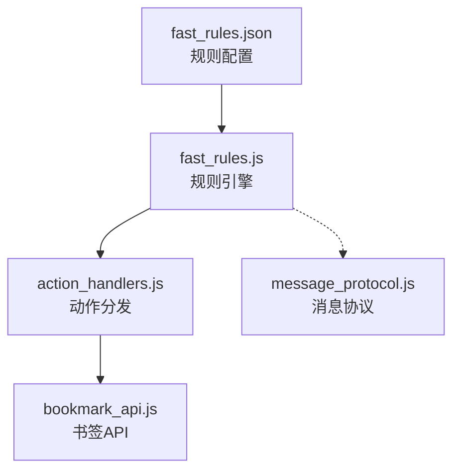
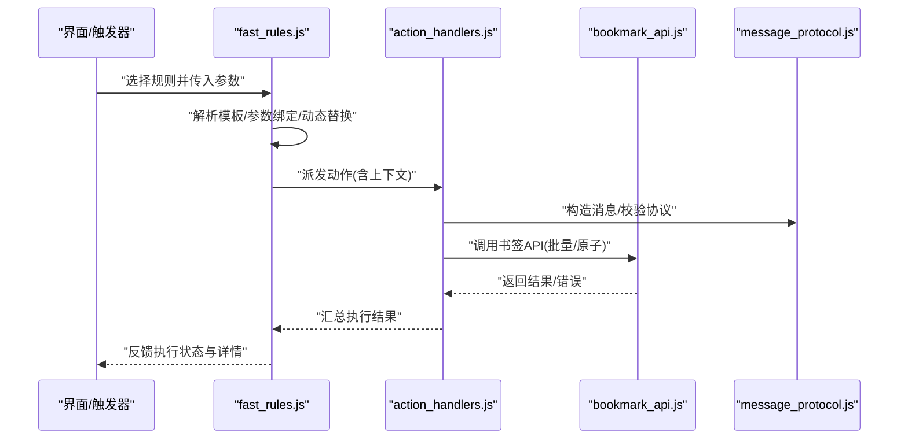
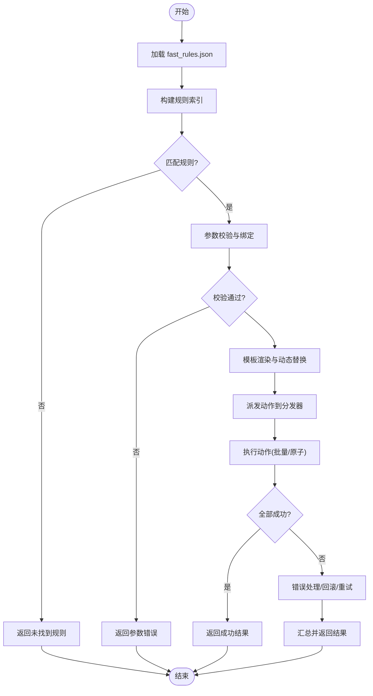
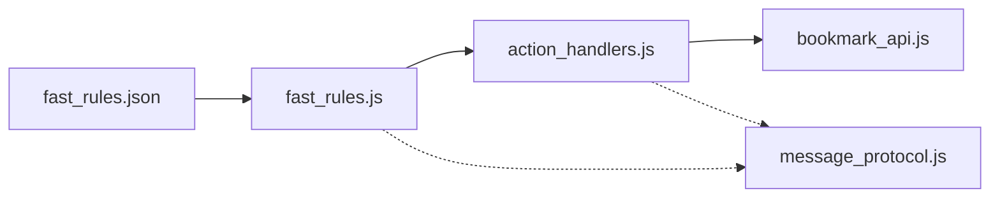

# 快速规则系统

<cite>
**本文引用的文件**   
- [extension/fast_rules.json](file://extension/fast_rules.json)
- [extension/ai/fast_rules.js](file://extension/ai/fast_rules.js)
- [extension/background/bookmark_api.js](file://extension/background/bookmark_api.js)
- [extension/background/action_handlers.js](file://extension/background/action_handlers.js)
- [extension/shared/message_protocol.js](file://extension/shared/message_protocol.js)
- [tests/test_extension_fast_rules.py](file://tests/test_extension_fast_rules.py)
</cite>

## 目录
1. [简介](#简介)
2. [项目结构](#项目结构)
3. [核心组件](#核心组件)
4. [架构总览](#架构总览)
5. [详细组件分析](#详细组件分析)
6. [依赖关系分析](#依赖关系分析)
7. [性能考虑](#性能考虑)
8. [故障排查指南](#故障排查指南)
9. [结论](#结论)
10. [附录](#附录)

## 简介
本文件面向“快速规则系统”，聚焦于预定义快速规则的设计理念、实现机制与使用方式。内容涵盖：
- 常用书签操作模式的抽象与封装
- fast_rules.json 的配置格式（规则模板、参数绑定、动态替换）
- 快速规则的注册与发现机制（插件化架构、版本兼容）
- 自定义快速规则的开发指南（接口规范、测试方法、发布流程）
- 使用示例与最佳实践

## 项目结构
快速规则系统位于浏览器扩展侧，核心由配置与运行时两部分组成：
- 配置层：fast_rules.json 提供预定义规则模板与元数据
- 运行层：fast_rules.js 负责加载、解析、匹配与执行规则
- 执行层：通过 action_handlers.js 与 bookmark_api.js 调用底层书签 API
- 通信协议：message_protocol.js 定义消息契约，便于跨上下文协作

图表来源
- [extension/fast_rules.json](file://extension/fast_rules.json)
- [extension/ai/fast_rules.js](file://extension/ai/fast_rules.js)
- [extension/background/action_handlers.js](file://extension/background/action_handlers.js)
- [extension/background/bookmark_api.js](file://extension/background/bookmark_api.js)
- [extension/shared/message_protocol.js](file://extension/shared/message_protocol.js)

章节来源
- [extension/fast_rules.json](file://extension/fast_rules.json)
- [extension/ai/fast_rules.js](file://extension/ai/fast_rules.js)
- [extension/background/action_handlers.js](file://extension/background/action_handlers.js)
- [extension/background/bookmark_api.js](file://extension/background/bookmark_api.js)
- [extension/shared/message_protocol.js](file://extension/shared/message_protocol.js)

## 核心组件
- 规则配置（fast_rules.json）
  - 描述：集中存放预定义快速规则模板、参数占位符、默认值、版本与兼容性信息
  - 要点：支持模板字符串、参数校验、条件分支、批量操作等
- 规则引擎（fast_rules.js）
  - 描述：加载并解析 fast_rules.json，提供规则发现、匹配、渲染与执行能力
  - 要点：缓存已加载规则、按名称或标签检索、参数绑定与动态替换、错误回退
- 动作分发（action_handlers.js）
  - 描述：将规则执行请求映射到具体动作处理器，协调异步任务与状态更新
  - 要点：幂等性保证、重试策略、事务边界
- 书签API（bookmark_api.js）
  - 描述：对浏览器书签 API 的封装，提供增删改查、移动、分组等原子操作
  - 要点：批量优化、并发控制、失败补偿
- 消息协议（message_protocol.js）
  - 描述：定义扩展内部各模块间通信的消息结构与字段约束
  - 要点：版本兼容、字段可选、错误码约定

章节来源
- [extension/fast_rules.json](file://extension/fast_rules.json)
- [extension/ai/fast_rules.js](file://extension/ai/fast_rules.js)
- [extension/background/action_handlers.js](file://extension/background/action_handlers.js)
- [extension/background/bookmark_api.js](file://extension/background/bookmark_api.js)
- [extension/shared/message_protocol.js](file://extension/shared/message_protocol.js)

## 架构总览
快速规则系统采用“配置驱动 + 插件化”的架构：
- 配置即规则：fast_rules.json 作为单一事实源，声明式定义所有可用规则
- 引擎即服务：fast_rules.js 暴露规则发现与执行接口，供 UI 或后台任务调用
- 分层解耦：动作分发与书签 API 分离，便于扩展新的动作类型与后端存储
- 协议先行：message_protocol.js 确保跨上下文通信稳定演进

图表来源
- [extension/ai/fast_rules.js](file://extension/ai/fast_rules.js)
- [extension/background/action_handlers.js](file://extension/background/action_handlers.js)
- [extension/background/bookmark_api.js](file://extension/background/bookmark_api.js)
- [extension/shared/message_protocol.js](file://extension/shared/message_protocol.js)

## 详细组件分析

### 规则配置（fast_rules.json）
- 设计目标
  - 以声明式方式表达常见书签操作模式，如“移动到指定文件夹”、“批量重命名”、“清理重复项”等
  - 通过参数占位符与动态替换，使同一模板适配多种场景
- 关键概念
  - 规则模板：包含 id、name、description、version、parameters、actions 等字段
  - 参数绑定：在 actions 中引用 parameters 定义的变量，支持默认值与校验
  - 动态替换：在模板文本中使用占位符，运行时根据上下文注入实际值
  - 版本与兼容：通过 version 字段与最小兼容版本约束，保障升级平滑
- 建议结构
  - 顶层数组或对象集合，每个元素为一个规则
  - 每个规则包含元数据、参数定义、动作序列、错误处理策略
  - 提供示例与注释，降低上手成本

章节来源
- [extension/fast_rules.json](file://extension/fast_rules.json)

### 规则引擎（fast_rules.js）
- 职责
  - 加载与解析 fast_rules.json
  - 提供规则发现（按名称、标签、版本过滤）
  - 执行前校验（参数完整性、类型检查、条件判断）
  - 渲染与替换（将参数注入模板，生成最终动作清单）
  - 执行编排（顺序/并行、重试、回滚）
- 关键流程
  - 初始化：读取配置、构建索引、缓存规则
  - 匹配：根据输入选择最合适的规则
  - 渲染：参数绑定与动态替换
  - 执行：调用动作分发器，收集结果
- 错误处理
  - 参数缺失或类型不匹配时给出明确提示
  - 执行失败时记录上下文，支持部分回滚或继续策略
  - 兼容性问题时降级到旧版行为或拒绝执行

图表来源
- [extension/ai/fast_rules.js](file://extension/ai/fast_rules.js)

章节来源
- [extension/ai/fast_rules.js](file://extension/ai/fast_rules.js)

### 动作分发（action_handlers.js）
- 职责
  - 接收来自规则引擎的动作清单
  - 将动作映射到具体处理器（创建、移动、删除、重命名、合并等）
  - 管理执行上下文（事务、日志、进度）
- 关键点
  - 幂等性：相同输入多次执行产生一致结果
  - 批量化：合并相邻同类操作，减少 API 调用次数
  - 可观测性：输出结构化日志，便于追踪与排障

章节来源
- [extension/background/action_handlers.js](file://extension/background/action_handlers.js)

### 书签API（bookmark_api.js）
- 职责
  - 封装浏览器书签 API，提供高层语义操作
  - 实现批量优化与并发控制
  - 提供失败补偿与重试机制
- 关键点
  - 原子性：单个动作要么全部成功，要么回滚
  - 一致性：保证树结构不变量（无环、唯一ID等）
  - 可扩展：新增操作只需实现对应方法并注册

章节来源
- [extension/background/bookmark_api.js](file://extension/background/bookmark_api.js)

### 消息协议（message_protocol.js）
- 职责
  - 定义跨上下文通信的消息结构
  - 规定字段类型、必填/可选、枚举值
  - 维护版本兼容策略（向后兼容、弃用标记）
- 关键点
  - 严格校验：入参与出参均进行结构校验
  - 错误码：统一错误码与消息体，便于前端展示
  - 扩展点：预留扩展字段，避免破坏现有消费者

章节来源
- [extension/shared/message_protocol.js](file://extension/shared/message_protocol.js)

### 单元测试（test_extension_fast_rules.py）
- 覆盖范围
  - 规则加载与解析
  - 参数绑定与动态替换
  - 错误路径与异常恢复
  - 版本兼容与降级
- 建议
  - 为每条规则编写正向与反向用例
  - 模拟书签API，隔离外部依赖
  - 断言中间状态与最终状态的一致性

章节来源
- [tests/test_extension_fast_rules.py](file://tests/test_extension_fast_rules.py)

## 依赖关系分析
- 模块耦合
  - fast_rules.js 依赖 fast_rules.json 与 message_protocol.js
  - action_handlers.js 依赖 bookmark_api.js 与 message_protocol.js
  - bookmark_api.js 依赖浏览器原生 API
- 潜在风险
  - 循环依赖：需避免 fast_rules.js 与 action_handlers.js 相互直接引用
  - 外部变更：书签 API 变更需通过 bookmark_api.js 屏蔽影响
- 扩展点
  - 新增规则无需改动引擎，仅需更新 fast_rules.json
  - 新增动作类型只需在 action_handlers.js 注册处理器

图表来源
- [extension/fast_rules.json](file://extension/fast_rules.json)
- [extension/ai/fast_rules.js](file://extension/ai/fast_rules.js)
- [extension/background/action_handlers.js](file://extension/background/action_handlers.js)
- [extension/background/bookmark_api.js](file://extension/background/bookmark_api.js)
- [extension/shared/message_protocol.js](file://extension/shared/message_protocol.js)

章节来源
- [extension/fast_rules.json](file://extension/fast_rules.json)
- [extension/ai/fast_rules.js](file://extension/ai/fast_rules.js)
- [extension/background/action_handlers.js](file://extension/background/action_handlers.js)
- [extension/background/bookmark_api.js](file://extension/background/bookmark_api.js)
- [extension/shared/message_protocol.js](file://extension/shared/message_protocol.js)

## 性能考虑
- 规则缓存：首次加载后缓存规则索引，避免重复解析
- 批量操作：合并相邻同类动作，减少 API 往返
- 懒加载：按需加载大型规则集，降低启动开销
- 并发控制：限制并行度，避免阻塞主线程
- 增量更新：仅重新渲染变更的规则，减少计算量

## 故障排查指南
- 常见问题
  - 规则未生效：检查 fast_rules.json 语法与版本兼容
  - 参数绑定失败：确认参数名与类型是否匹配
  - 执行中断：查看动作分发日志与书签 API 错误码
- 定位步骤
  - 启用详细日志，捕获完整上下文
  - 使用最小复现用例，逐步缩小范围
  - 隔离外部依赖，使用模拟书签 API 验证逻辑
- 恢复策略
  - 启用回滚与重试，保证数据一致性
  - 提供降级规则，维持基本功能可用

章节来源
- [extension/ai/fast_rules.js](file://extension/ai/fast_rules.js)
- [extension/background/action_handlers.js](file://extension/background/action_handlers.js)
- [extension/background/bookmark_api.js](file://extension/background/bookmark_api.js)

## 结论
快速规则系统通过“配置驱动 + 插件化”的设计，将常用书签操作抽象为可复用模板，借助参数绑定与动态替换提升灵活性。引擎层提供稳定的发现与执行能力，动作分发与书签 API 解耦，便于扩展与维护。配合完善的测试与协议约束，系统在易用性、可靠性与可演进性之间取得良好平衡。

## 附录

### 开发指南：自定义快速规则
- 接口规范
  - 在 fast_rules.json 中新增规则条目，遵循既有字段约定
  - 定义 parameters 与默认值，必要时添加校验规则
  - 在 actions 中引用参数，确保动态替换正确
- 测试方法
  - 编写单元与集成测试，覆盖正常与异常路径
  - 使用模拟书签 API，验证动作执行结果
  - 断言中间状态与最终状态的一致性
- 发布流程
  - 更新版本号与变更说明
  - 运行全量测试，确保无回归
  - 提交代码并通知相关方

### 使用示例与最佳实践
- 示例
  - 批量移动：选择多个书签，移动到指定文件夹
  - 智能重命名：基于 URL 或标题自动重命名
  - 清理重复：检测并合并重复书签
- 最佳实践
  - 保持规则小而专一，组合使用复杂场景
  - 为规则提供清晰描述与示例参数
  - 定期审查与归档过时规则