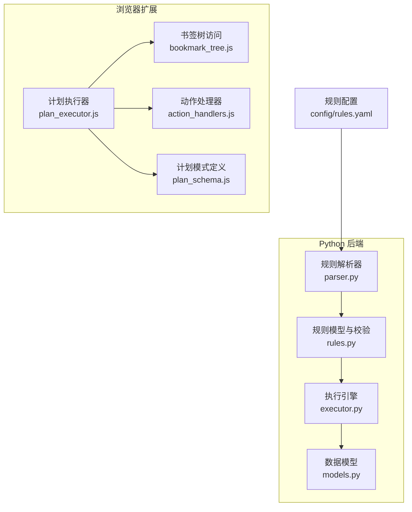
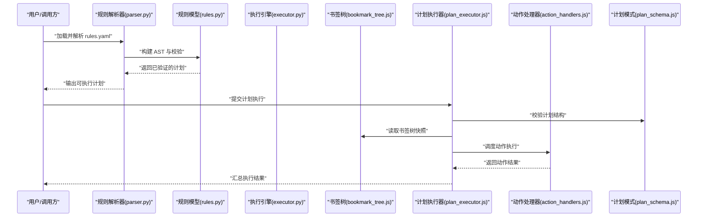
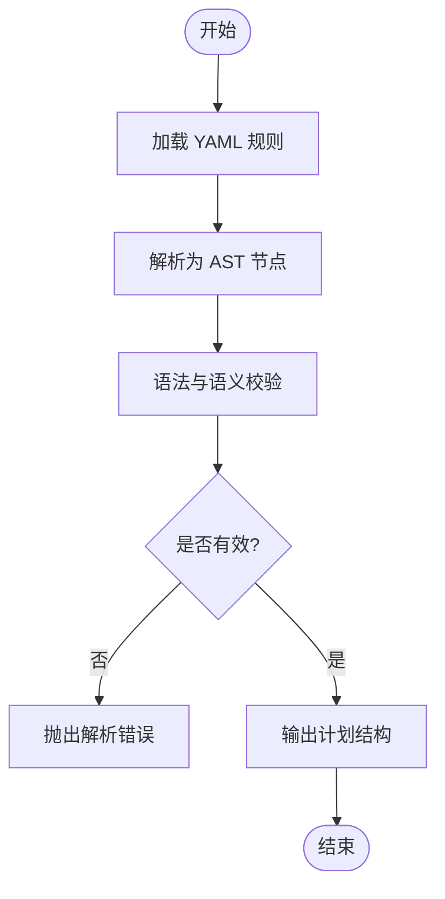
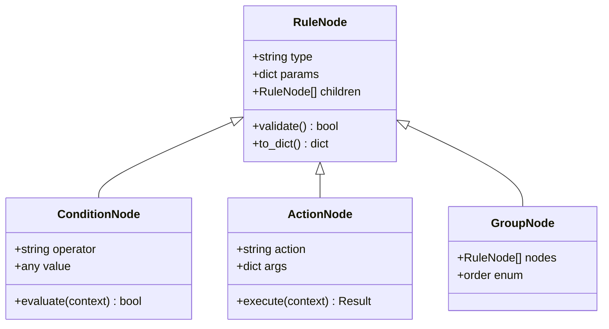
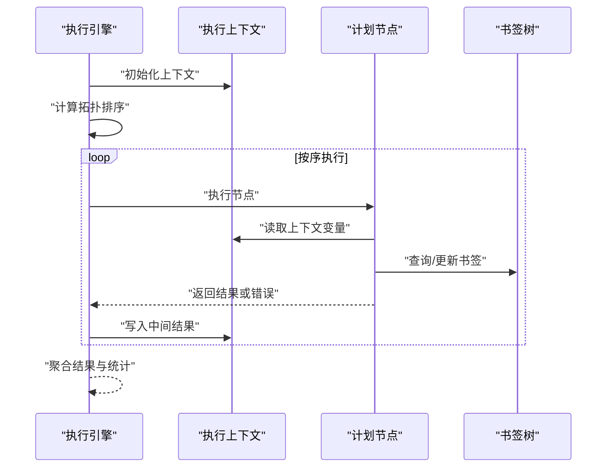
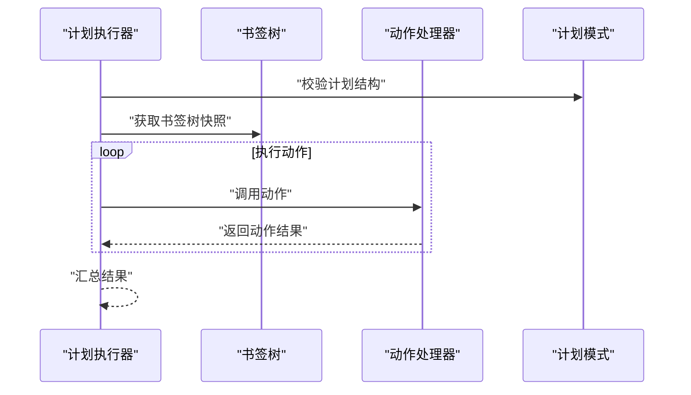
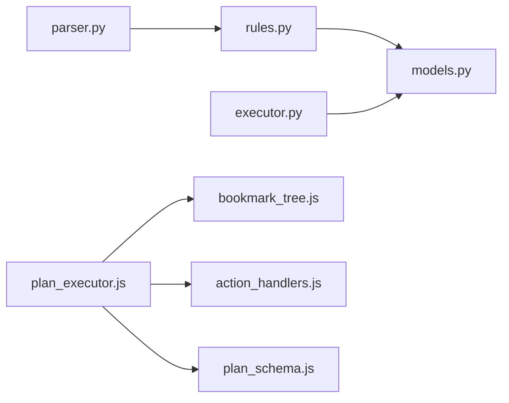

# 规则引擎设计

<cite>
**本文引用的文件**   
- [config/rules.yaml](file://config/rules.yaml)
- [src/bookmark_advisor/parser.py](file://src/bookmark_advisor/parser.py)
- [src/bookmark_advisor/rules.py](file://src/bookmark_advisor/rules.py)
- [src/bookmark_advisor/executor.py](file://src/bookmark_advisor/executor.py)
- [src/bookmark_advisor/models.py](file://src/bookmark_advisor/models.py)
- [extension/background/bookmark_tree.js](file://extension/background/bookmark_tree.js)
- [extension/background/plan_executor.js](file://extension/background/plan_executor.js)
- [extension/background/action_handlers.js](file://extension/background/action_handlers.js)
- [extension/shared/plan_schema.js](file://extension/shared/plan_schema.js)
- [tests/test_rules.py](file://tests/test_rules.py)
</cite>

## 目录
1. [简介](#简介)
2. [项目结构](#项目结构)
3. [核心组件](#核心组件)
4. [架构总览](#架构总览)
5. [详细组件分析](#详细组件分析)
6. [依赖关系分析](#依赖关系分析)
7. [性能考虑](#性能考虑)
8. [故障排查指南](#故障排查指南)
9. [结论](#结论)
10. [附录](#附录)

## 简介
本文件面向规则引擎的设计与实现，聚焦以下目标：
- 解释规则解析器、执行引擎与结果聚合机制的架构模式
- 给出 YAML 规则文件的语法规则参考（条件表达式、动作定义、嵌套结构）
- 说明规则的编译与优化过程（AST 构建、预检查、性能分析）
- 描述执行上下文（书签树遍历、状态管理、错误处理）
- 提供复杂规则编写实战指南（条件组合、循环处理、异常处理）
- 介绍调试工具与性能监控方法

## 项目结构
仓库采用前后端分离与多语言协作的方式：
- Python 后端负责规则解析、执行与报告
- 浏览器扩展侧负责书签树访问、计划执行与 UI 交互
- YAML 作为规则配置载体，供后端加载与校验

图表来源
- [src/bookmark_advisor/parser.py](file://src/bookmark_advisor/parser.py)
- [src/bookmark_advisor/rules.py](file://src/bookmark_advisor/rules.py)
- [src/bookmark_advisor/executor.py](file://src/bookmark_advisor/executor.py)
- [src/bookmark_advisor/models.py](file://src/bookmark_advisor/models.py)
- [extension/background/bookmark_tree.js](file://extension/background/bookmark_tree.js)
- [extension/background/plan_executor.js](file://extension/background/plan_executor.js)
- [extension/background/action_handlers.js](file://extension/background/action_handlers.js)
- [extension/shared/plan_schema.js](file://extension/shared/plan_schema.js)
- [config/rules.yaml](file://config/rules.yaml)

章节来源
- [config/rules.yaml](file://config/rules.yaml)
- [src/bookmark_advisor/parser.py](file://src/bookmark_advisor/parser.py)
- [src/bookmark_advisor/rules.py](file://src/bookmark_advisor/rules.py)
- [src/bookmark_advisor/executor.py](file://src/bookmark_advisor/executor.py)
- [src/bookmark_advisor/models.py](file://src/bookmark_advisor/models.py)
- [extension/background/bookmark_tree.js](file://extension/background/bookmark_tree.js)
- [extension/background/plan_executor.js](file://extension/background/plan_executor.js)
- [extension/background/action_handlers.js](file://extension/background/action_handlers.js)
- [extension/shared/plan_schema.js](file://extension/shared/plan_schema.js)

## 核心组件
- 规则解析器：将 YAML 规则转换为内部 AST，进行语法与语义校验，输出可执行的计划。
- 规则模型与校验：定义规则节点类型、字段约束与依赖关系，确保规则一致性。
- 执行引擎：在书签树上按拓扑顺序执行计划节点，维护执行上下文与中间结果。
- 结果聚合：汇总各节点执行结果，生成最终报告与统计信息。
- 扩展侧执行：通过计划执行器驱动书签树访问与动作处理器，完成跨端协同。

章节来源
- [src/bookmark_advisor/parser.py](file://src/bookmark_advisor/parser.py)
- [src/bookmark_advisor/rules.py](file://src/bookmark_advisor/rules.py)
- [src/bookmark_advisor/executor.py](file://src/bookmark_advisor/executor.py)
- [extension/background/plan_executor.js](file://extension/background/plan_executor.js)
- [extension/background/action_handlers.js](file://extension/background/action_handlers.js)

## 架构总览
整体流程从 YAML 规则到执行结果的端到端路径如下：

图表来源
- [src/bookmark_advisor/parser.py](file://src/bookmark_advisor/parser.py)
- [src/bookmark_advisor/rules.py](file://src/bookmark_advisor/rules.py)
- [src/bookmark_advisor/executor.py](file://src/bookmark_advisor/executor.py)
- [extension/background/bookmark_tree.js](file://extension/background/bookmark_tree.js)
- [extension/background/plan_executor.js](file://extension/background/plan_executor.js)
- [extension/background/action_handlers.js](file://extension/background/action_handlers.js)
- [extension/shared/plan_schema.js](file://extension/shared/plan_schema.js)

## 详细组件分析

### 规则解析器（YAML → AST）
职责与要点：
- 读取 YAML 规则文件，构建 AST 节点（如条件、动作、分组等）
- 进行语法校验（必填字段、类型约束、引用完整性）
- 输出标准化计划结构，供执行引擎消费

关键流程（概念图）：

章节来源
- [src/bookmark_advisor/parser.py](file://src/bookmark_advisor/parser.py)
- [config/rules.yaml](file://config/rules.yaml)

### 规则模型与校验（AST 节点定义）
职责与要点：
- 定义规则节点的数据结构与约束（字段名、类型、默认值、依赖）
- 提供统一的序列化/反序列化工具
- 支持规则间的引用与组合

类关系（概念图）：

章节来源
- [src/bookmark_advisor/rules.py](file://src/bookmark_advisor/rules.py)
- [src/bookmark_advisor/models.py](file://src/bookmark_advisor/models.py)

### 执行引擎（计划执行与上下文）
职责与要点：
- 基于拓扑顺序执行计划节点，保证依赖正确性
- 维护执行上下文（书签树快照、变量环境、中间结果）
- 收集执行结果与错误，支持重试与回滚策略

执行时序（概念图）：

章节来源
- [src/bookmark_advisor/executor.py](file://src/bookmark_advisor/executor.py)
- [src/bookmark_advisor/models.py](file://src/bookmark_advisor/models.py)

### 扩展侧执行（书签树与动作）
职责与要点：
- 计划执行器负责协调书签树访问与动作处理器
- 动作处理器实现具体业务动作（移动、重命名、删除等）
- 计划模式定义用于前端校验与提示

交互时序（概念图）：

章节来源
- [extension/background/plan_executor.js](file://extension/background/plan_executor.js)
- [extension/background/bookmark_tree.js](file://extension/background/bookmark_tree.js)
- [extension/background/action_handlers.js](file://extension/background/action_handlers.js)
- [extension/shared/plan_schema.js](file://extension/shared/plan_schema.js)

### YAML 规则语法参考
以下为规则文件的通用语法约定（以实际实现为准）：
- 顶层结构
  - 规则列表：数组形式，每个元素为一个规则对象
  - 全局配置：可选，包含执行策略、超时、重试等
- 规则对象
  - name: 字符串，规则名称
  - description: 字符串，规则描述
  - enabled: 布尔，是否启用
  - conditions: 条件集合（AND/OR 组合）
  - actions: 动作集合（顺序执行）
  - context: 上下文变量（键值对）
- 条件表达式
  - operator: 比较或逻辑操作符（如 equals、contains、gt、lt、and、or）
  - field: 目标字段路径（支持点号分隔）
  - value: 期望值（支持标量、数组、正则表达式）
  - not: 布尔，取反
- 动作定义
  - action: 动作名称（如 move、rename、delete、tag）
  - args: 参数映射（目标位置、新名称、标签等）
  - on_error: 错误策略（continue、abort、retry）
- 嵌套结构
  - groups: 分组容器，支持 order（sequential/parallel）
  - depends_on: 依赖其他规则 ID，形成 DAG
- 示例路径
  - 参考配置文件：[config/rules.yaml](file://config/rules.yaml)

章节来源
- [config/rules.yaml](file://config/rules.yaml)

### 编译与优化（AST 构建、预检查、性能分析）
- AST 构建
  - 将 YAML 解析为结构化 AST，保留源位置信息便于诊断
- 预检查
  - 字段存在性与类型校验
  - 引用完整性（depends_on 指向的规则必须存在）
  - 循环依赖检测（DAG 无环）
- 性能分析
  - 估算节点数量与深度
  - 识别并行化机会（无依赖的组）
  - 缓存热点字段（频繁访问的书签属性）

章节来源
- [src/bookmark_advisor/parser.py](file://src/bookmark_advisor/parser.py)
- [src/bookmark_advisor/rules.py](file://src/bookmark_advisor/rules.py)

### 执行上下文（书签树遍历、状态管理、错误处理）
- 书签树遍历
  - 提供快照式读取，避免执行期间结构变化导致不一致
  - 支持路径匹配与过滤，减少不必要遍历
- 状态管理
  - 上下文变量作用域：全局、规则级、节点级
  - 中间结果持久化：用于后续节点复用
- 错误处理
  - 节点级错误策略：继续、中止、重试
  - 全局错误策略：失败阈值、告警上报
  - 日志与追踪：记录关键步骤与耗时

章节来源
- [src/bookmark_advisor/executor.py](file://src/bookmark_advisor/executor.py)
- [extension/background/bookmark_tree.js](file://extension/background/bookmark_tree.js)

### 复杂规则编写实战指南
- 条件组合
  - 使用 and/or 组合多个条件，注意优先级与括号
  - 利用 not 表达否定条件
- 循环处理
  - 通过分组与顺序控制模拟循环
  - 对大规模集合建议分批执行，避免内存峰值
- 异常情况处理
  - 设置 on_error 策略，区分可恢复与不可恢复错误
  - 使用重试与退避策略提升鲁棒性
- 性能优化
  - 尽量前置过滤条件，减少后续动作范围
  - 合并相似动作，降低 I/O 次数

章节来源
- [config/rules.yaml](file://config/rules.yaml)
- [src/bookmark_advisor/executor.py](file://src/bookmark_advisor/executor.py)

### 调试工具与性能监控
- 调试工具
  - 解析阶段：输出 AST 与校验错误详情
  - 执行阶段：打印节点执行顺序与上下文快照
  - 扩展侧：记录动作调用链与返回值
- 性能监控
  - 指标：节点数、执行时间、错误率、I/O 次数
  - 采样：对热点路径进行采样分析
  - 对比：不同规则集的执行效果对比

章节来源
- [src/bookmark_advisor/parser.py](file://src/bookmark_advisor/parser.py)
- [src/bookmark_advisor/executor.py](file://src/bookmark_advisor/executor.py)
- [extension/background/plan_executor.js](file://extension/background/plan_executor.js)

## 依赖关系分析
组件间依赖关系如下：

图表来源
- [src/bookmark_advisor/parser.py](file://src/bookmark_advisor/parser.py)
- [src/bookmark_advisor/rules.py](file://src/bookmark_advisor/rules.py)
- [src/bookmark_advisor/models.py](file://src/bookmark_advisor/models.py)
- [src/bookmark_advisor/executor.py](file://src/bookmark_advisor/executor.py)
- [extension/background/plan_executor.js](file://extension/background/plan_executor.js)
- [extension/background/bookmark_tree.js](file://extension/background/bookmark_tree.js)
- [extension/background/action_handlers.js](file://extension/background/action_handlers.js)
- [extension/shared/plan_schema.js](file://extension/shared/plan_schema.js)

章节来源
- [src/bookmark_advisor/parser.py](file://src/bookmark_advisor/parser.py)
- [src/bookmark_advisor/rules.py](file://src/bookmark_advisor/rules.py)
- [src/bookmark_advisor/executor.py](file://src/bookmark_advisor/executor.py)
- [extension/background/plan_executor.js](file://extension/background/plan_executor.js)

## 性能考虑
- 规则规模
  - 控制规则数量与复杂度，避免过深嵌套
- 执行策略
  - 合理设置并行度，平衡吞吐与资源占用
- I/O 优化
  - 批量操作与去重，减少重复读写
- 缓存策略
  - 缓存常用查询结果，缩短响应时间

## 故障排查指南
- 常见问题
  - YAML 语法错误：检查缩进与键名拼写
  - 字段缺失或类型不匹配：对照规则模型校验
  - 循环依赖：检查 depends_on 是否形成环
  - 执行超时：调整超时与重试策略
- 定位方法
  - 查看解析与执行日志
  - 导出 AST 与执行轨迹
  - 使用最小复现规则集隔离问题

章节来源
- [tests/test_rules.py](file://tests/test_rules.py)
- [src/bookmark_advisor/parser.py](file://src/bookmark_advisor/parser.py)
- [src/bookmark_advisor/executor.py](file://src/bookmark_advisor/executor.py)

## 结论
本规则引擎通过清晰的解析—执行—聚合分层，结合可扩展的 AST 与上下文管理，实现了高内聚、低耦合的规则处理能力。配合完善的调试与监控手段，可在复杂场景下保持稳定性与可观测性。

## 附录
- 术语表
  - AST：抽象语法树
  - DAG：有向无环图
  - 上下文：执行期间的变量与环境状态
- 参考实现
  - 规则配置样例：[config/rules.yaml](file://config/rules.yaml)
  - 单元测试用例：[tests/test_rules.py](file://tests/test_rules.py)