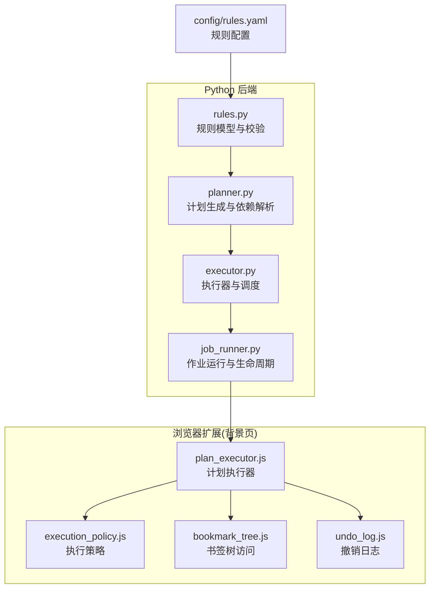
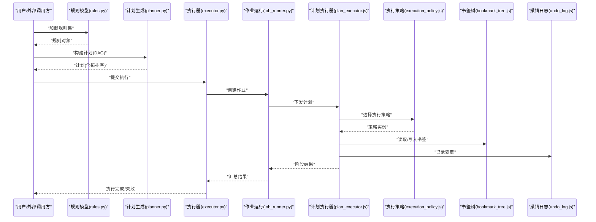
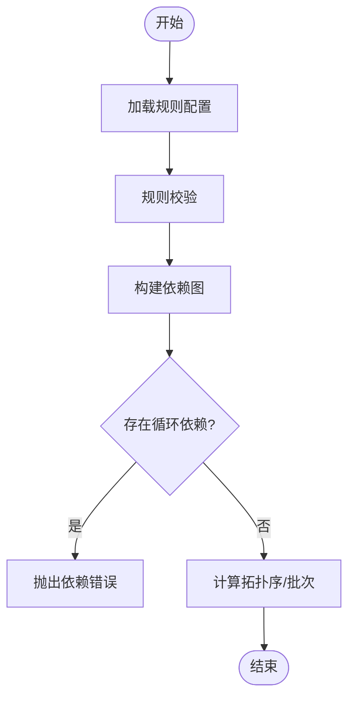
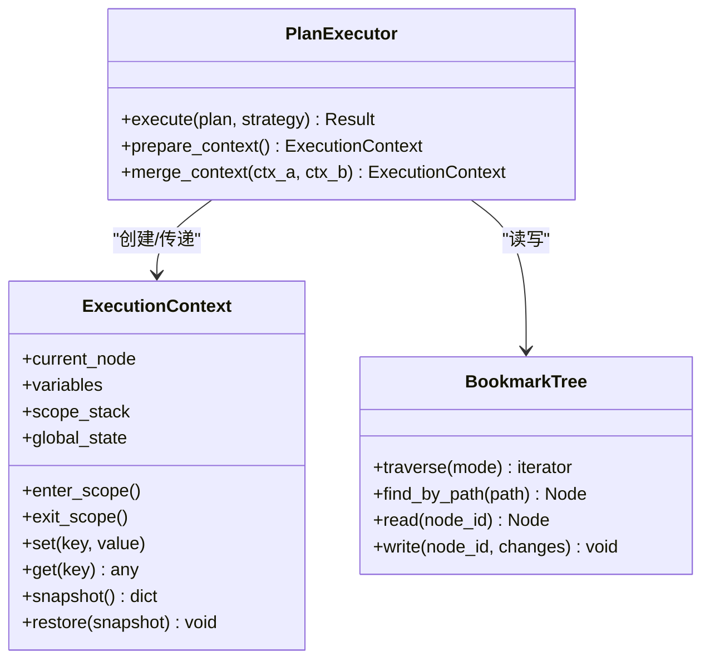
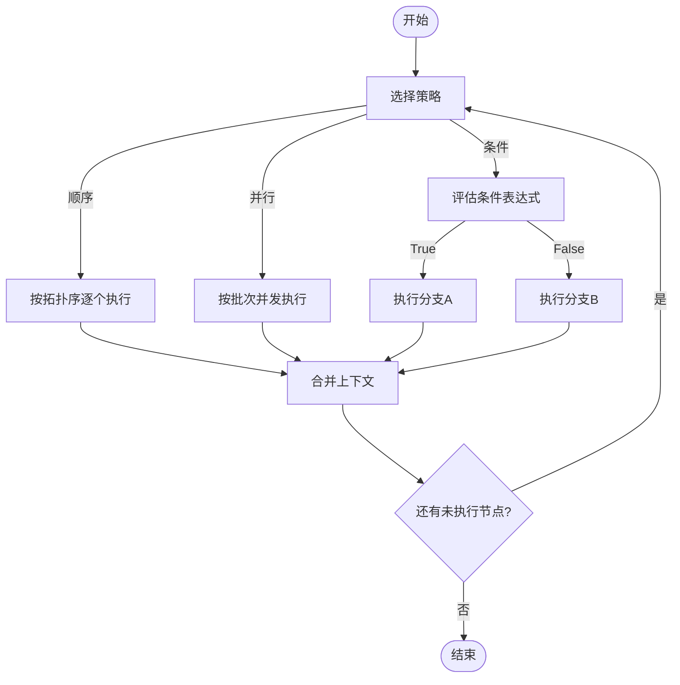
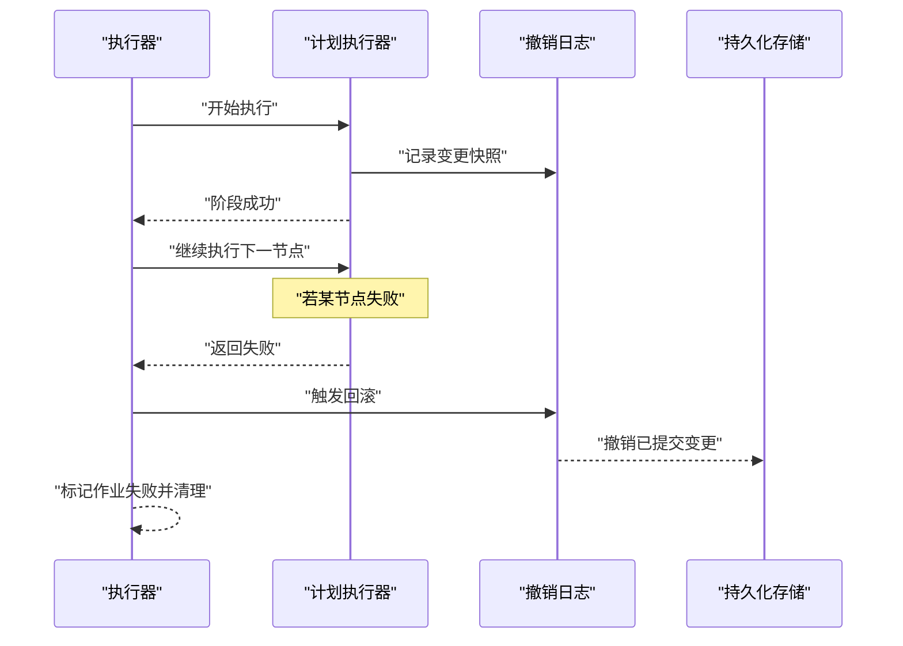
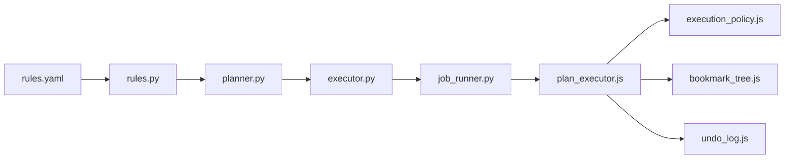

# 规则执行引擎

<cite>
**本文引用的文件**   
- [src/bookmark_advisor/executor.py](file://src/bookmark_advisor/executor.py)
- [src/bookmark_advisor/rules.py](file://src/bookmark_advisor/rules.py)
- [src/bookmark_advisor/planner.py](file://src/bookmark_advisor/planner.py)
- [src/bookmark_advisor/job_runner.py](file://src/bookmark_advisor/job_runner.py)
- [extension/background/plan_executor.js](file://extension/background/plan_executor.js)
- [extension/background/execution_policy.js](file://extension/background/execution_policy.js)
- [extension/background/bookmark_tree.js](file://extension/background/bookmark_tree.js)
- [extension/background/undo_log.js](file://extension/background/undo_log.js)
- [config/rules.yaml](file://config/rules.yaml)
</cite>

## 目录
1. [简介](#简介)
2. [项目结构](#项目结构)
3. [核心组件](#核心组件)
4. [架构总览](#架构总览)
5. [详细组件分析](#详细组件分析)
6. [依赖关系分析](#依赖关系分析)
7. [性能考量](#性能考量)
8. [故障排查指南](#故障排查指南)
9. [结论](#结论)
10. [附录](#附录)

## 简介
本文件面向“规则执行引擎”的设计与实现，聚焦以下目标：
- 规则加载、依赖解析与执行调度流程
- 执行上下文管理（书签树遍历、状态传递、变量作用域）
- 执行策略模式（顺序、并行、条件分支）
- 异常处理与回滚机制（原子性与一致性保障）
- 执行监控与调试（日志、性能统计、断点调试）

该引擎同时覆盖后端 Python 侧与前端扩展 JS 侧的协同工作流，确保跨端一致的执行语义。

## 项目结构
与规则执行引擎直接相关的代码分布在两个主要区域：
- Python 后端：负责规则定义、计划生成、任务编排与执行
- 浏览器扩展（JS）：负责在书签环境中执行计划、维护执行上下文与撤销日志

图示来源
- [src/bookmark_advisor/rules.py](file://src/bookmark_advisor/rules.py)
- [src/bookmark_advisor/planner.py](file://src/bookmark_advisor/planner.py)
- [src/bookmark_advisor/executor.py](file://src/bookmark_advisor/executor.py)
- [src/bookmark_advisor/job_runner.py](file://src/bookmark_advisor/job_runner.py)
- [extension/background/plan_executor.js](file://extension/background/plan_executor.js)
- [extension/background/execution_policy.js](file://extension/background/execution_policy.js)
- [extension/background/bookmark_tree.js](file://extension/background/bookmark_tree.js)
- [extension/background/undo_log.js](file://extension/background/undo_log.js)
- [config/rules.yaml](file://config/rules.yaml)

章节来源
- [src/bookmark_advisor/executor.py](file://src/bookmark_advisor/executor.py)
- [src/bookmark_advisor/rules.py](file://src/bookmark_advisor/rules.py)
- [src/bookmark_advisor/planner.py](file://src/bookmark_advisor/planner.py)
- [src/bookmark_advisor/job_runner.py](file://src/bookmark_advisor/job_runner.py)
- [extension/background/plan_executor.js](file://extension/background/plan_executor.js)
- [extension/background/execution_policy.js](file://extension/background/execution_policy.js)
- [extension/background/bookmark_tree.js](file://extension/background/bookmark_tree.js)
- [extension/background/undo_log.js](file://extension/background/undo_log.js)
- [config/rules.yaml](file://config/rules.yaml)

## 核心组件
- 规则模型与校验：提供规则的数据结构与约束，支撑后续计划生成与执行期校验
- 计划生成与依赖解析：将规则集合转换为可执行的有向无环图（DAG），并计算拓扑序
- 执行器与调度：根据策略对 DAG 节点进行顺序或并行调度，维护执行上下文
- 作业运行与生命周期：封装单次执行的生命周期，包括开始、完成、失败与清理
- 计划执行器（JS）：在浏览器环境中读取书签树、应用变更、记录撤销日志
- 执行策略：支持顺序、并行与条件分支等策略
- 书签树访问：提供只读/写操作封装，屏蔽底层 API 差异
- 撤销日志：记录变更以便回滚，保证原子性

章节来源
- [src/bookmark_advisor/rules.py](file://src/bookmark_advisor/rules.py)
- [src/bookmark_advisor/planner.py](file://src/bookmark_advisor/planner.py)
- [src/bookmark_advisor/executor.py](file://src/bookmark_advisor/executor.py)
- [src/bookmark_advisor/job_runner.py](file://src/bookmark_advisor/job_runner.py)
- [extension/background/plan_executor.js](file://extension/background/plan_executor.js)
- [extension/background/execution_policy.js](file://extension/background/execution_policy.js)
- [extension/background/bookmark_tree.js](file://extension/background/bookmark_tree.js)
- [extension/background/undo_log.js](file://extension/background/undo_log.js)

## 架构总览
下图展示了从规则到执行的端到端流程，以及前后端的职责边界。

图示来源
- [src/bookmark_advisor/rules.py](file://src/bookmark_advisor/rules.py)
- [src/bookmark_advisor/planner.py](file://src/bookmark_advisor/planner.py)
- [src/bookmark_advisor/executor.py](file://src/bookmark_advisor/executor.py)
- [src/bookmark_advisor/job_runner.py](file://src/bookmark_advisor/job_runner.py)
- [extension/background/plan_executor.js](file://extension/background/plan_executor.js)
- [extension/background/execution_policy.js](file://extension/background/execution_policy.js)
- [extension/background/bookmark_tree.js](file://extension/background/bookmark_tree.js)
- [extension/background/undo_log.js](file://extension/background/undo_log.js)

## 详细组件分析

### 规则加载与依赖解析
- 规则加载
  - 从配置文件加载规则集合，并进行基础校验（类型、必填字段、引用完整性）
  - 将规则映射为内部模型，供计划生成使用
- 依赖解析
  - 基于规则间的输入输出关系构建有向无环图（DAG）
  - 计算拓扑序，确定可并行执行的批次
  - 检测循环依赖并报错，避免死锁

图示来源
- [src/bookmark_advisor/rules.py](file://src/bookmark_advisor/rules.py)
- [src/bookmark_advisor/planner.py](file://src/bookmark_advisor/planner.py)
- [config/rules.yaml](file://config/rules.yaml)

章节来源
- [src/bookmark_advisor/rules.py](file://src/bookmark_advisor/rules.py)
- [src/bookmark_advisor/planner.py](file://src/bookmark_advisor/planner.py)
- [config/rules.yaml](file://config/rules.yaml)

### 执行调度与上下文管理
- 执行调度
  - 按拓扑序逐批执行，同批内可根据策略并行
  - 每步执行前准备上下文，执行后合并上下文
- 执行上下文
  - 包含当前书签节点指针、中间变量与作用域、全局状态
  - 支持子作用域隔离（如每个步骤局部变量不泄漏）
  - 支持书签树遍历（深度优先/广度优先）与路径定位

图示来源
- [extension/background/plan_executor.js](file://extension/background/plan_executor.js)
- [extension/background/bookmark_tree.js](file://extension/background/bookmark_tree.js)
- [src/bookmark_advisor/executor.py](file://src/bookmark_advisor/executor.py)

章节来源
- [extension/background/plan_executor.js](file://extension/background/plan_executor.js)
- [extension/background/bookmark_tree.js](file://extension/background/bookmark_tree.js)
- [src/bookmark_advisor/executor.py](file://src/bookmark_advisor/executor.py)

### 执行策略模式（顺序、并行、条件分支）
- 顺序执行：严格按拓扑序依次执行，适合强依赖场景
- 并行执行：对同一拓扑批次内的节点并发执行，提升吞吐
- 条件分支：根据上下文变量动态决定下一步执行路径

图示来源
- [extension/background/execution_policy.js](file://extension/background/execution_policy.js)
- [src/bookmark_advisor/executor.py](file://src/bookmark_advisor/executor.py)

章节来源
- [extension/background/execution_policy.js](file://extension/background/execution_policy.js)
- [src/bookmark_advisor/executor.py](file://src/bookmark_advisor/executor.py)

### 异常处理与回滚机制（原子性与一致性）
- 异常捕获
  - 在执行器层统一捕获异常，记录错误上下文与堆栈
  - 区分可恢复与不可恢复错误，决定是否继续或中止
- 回滚机制
  - 通过撤销日志记录每一步变更（增删改）
  - 失败时按逆序回放撤销日志，恢复到执行前状态
  - 支持事务式提交：全部成功才持久化，否则整体回滚

图示来源
- [src/bookmark_advisor/executor.py](file://src/bookmark_advisor/executor.py)
- [extension/background/undo_log.js](file://extension/background/undo_log.js)
- [src/bookmark_advisor/job_runner.py](file://src/bookmark_advisor/job_runner.py)

章节来源
- [src/bookmark_advisor/executor.py](file://src/bookmark_advisor/executor.py)
- [extension/background/undo_log.js](file://extension/background/undo_log.js)
- [src/bookmark_advisor/job_runner.py](file://src/bookmark_advisor/job_runner.py)

### 执行监控与调试工具
- 执行日志
  - 结构化日志记录关键事件（开始、节点执行、上下文快照、错误）
  - 支持分级日志与采样，便于生产环境观测
- 性能统计
  - 统计各节点耗时、吞吐、并发度与资源占用
  - 暴露指标用于告警与容量规划
- 断点调试
  - 在执行器中注入断点钩子，支持暂停、单步执行与变量检查
  - 结合日志与快照，快速定位问题根因

章节来源
- [src/bookmark_advisor/executor.py](file://src/bookmark_advisor/executor.py)
- [extension/background/plan_executor.js](file://extension/background/plan_executor.js)

## 依赖关系分析
- 模块耦合
  - 计划生成依赖规则模型；执行器依赖计划与策略；JS 执行器依赖书签树与撤销日志
- 外部依赖
  - 浏览器书签 API（由 bookmark_tree.js 封装）
  - 文件系统/配置（rules.yaml）
- 潜在风险
  - 循环依赖需在计划阶段严格检测
  - 并发执行需保证上下文合并的幂等性

图示来源
- [src/bookmark_advisor/rules.py](file://src/bookmark_advisor/rules.py)
- [src/bookmark_advisor/planner.py](file://src/bookmark_advisor/planner.py)
- [src/bookmark_advisor/executor.py](file://src/bookmark_advisor/executor.py)
- [src/bookmark_advisor/job_runner.py](file://src/bookmark_advisor/job_runner.py)
- [extension/background/plan_executor.js](file://extension/background/plan_executor.js)
- [extension/background/execution_policy.js](file://extension/background/execution_policy.js)
- [extension/background/bookmark_tree.js](file://extension/background/bookmark_tree.js)
- [extension/background/undo_log.js](file://extension/background/undo_log.js)
- [config/rules.yaml](file://config/rules.yaml)

章节来源
- [src/bookmark_advisor/rules.py](file://src/bookmark_advisor/rules.py)
- [src/bookmark_advisor/planner.py](file://src/bookmark_advisor/planner.py)
- [src/bookmark_advisor/executor.py](file://src/bookmark_advisor/executor.py)
- [src/bookmark_advisor/job_runner.py](file://src/bookmark_advisor/job_runner.py)
- [extension/background/plan_executor.js](file://extension/background/plan_executor.js)
- [extension/background/execution_policy.js](file://extension/background/execution_policy.js)
- [extension/background/bookmark_tree.js](file://extension/background/bookmark_tree.js)
- [extension/background/undo_log.js](file://extension/background/undo_log.js)
- [config/rules.yaml](file://config/rules.yaml)

## 性能考量
- 并行度控制：依据 CPU 与 I/O 特性调整并发度，避免过度竞争
- 批量操作：合并多次书签写入，减少 API 调用次数
- 上下文复用：避免重复构建大对象，采用增量更新
- 缓存与去重：对只读查询结果进行缓存，降低重复开销
- 超时与重试：对不稳定操作设置超时与退避重试

## 故障排查指南
- 常见问题
  - 循环依赖导致计划失败：检查规则间输入输出关系
  - 上下文变量冲突：确认作用域隔离与命名空间
  - 并发竞态：核对合并策略是否幂等
  - 回滚不完整：检查撤销日志是否完整记录所有变更
- 诊断手段
  - 启用详细日志与指标采集
  - 使用断点与快照对比定位差异
  - 复现最小用例，逐步缩小范围

章节来源
- [src/bookmark_advisor/executor.py](file://src/bookmark_advisor/executor.py)
- [extension/background/undo_log.js](file://extension/background/undo_log.js)

## 结论
本引擎通过“规则建模—计划生成—策略调度—上下文管理—回滚保障—监控调试”的闭环设计，实现了高可靠、可扩展的规则执行能力。建议在大规模部署中重点关注并发安全、上下文合并幂等性与回滚完备性，并通过完善的监控与调试体系持续优化稳定性与性能。

## 附录
- 术语
  - 规则：描述数据转换或动作的可执行单元
  - 计划：由规则构成的可执行 DAG
  - 上下文：执行期的状态与作用域集合
  - 撤销日志：记录变更以便回滚的结构化日志
- 最佳实践
  - 明确输入输出契约，减少隐式依赖
  - 尽量保持步骤幂等，便于重试与回滚
  - 合理划分批次，平衡吞吐与资源占用
  - 完善日志与指标，建立可观测性基线