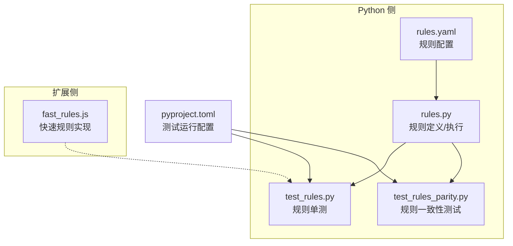
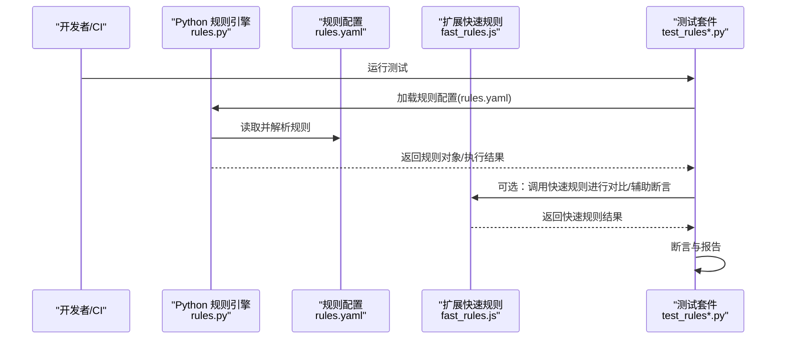
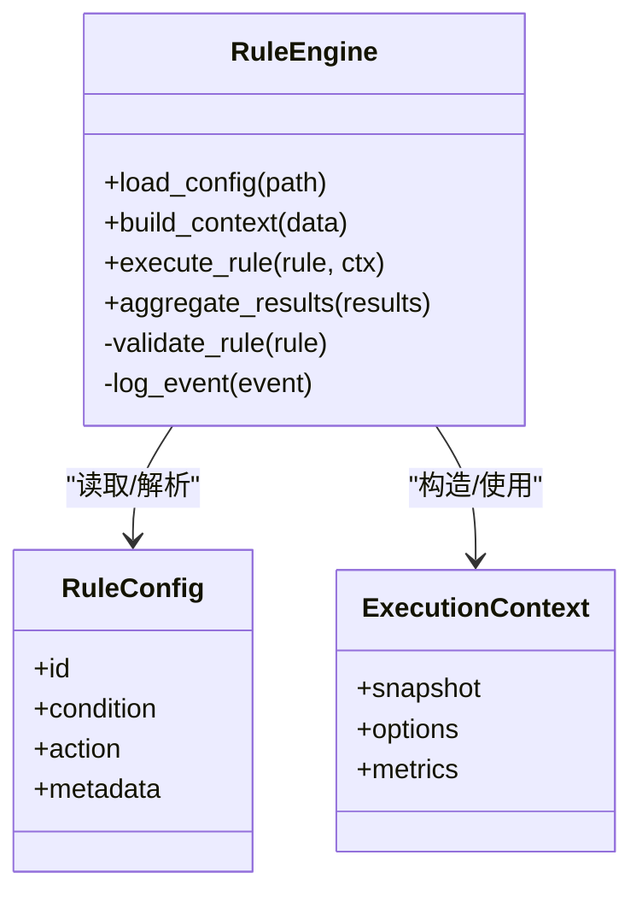
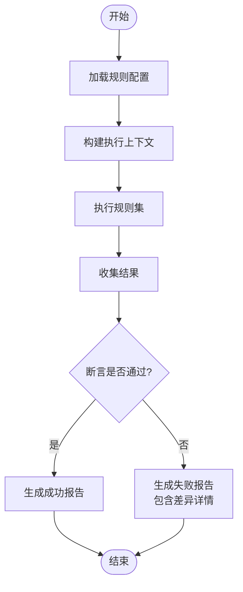
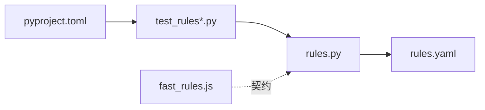

# 规则测试与调试

<cite>
**本文引用的文件**   
- [src/bookmark_advisor/rules.py](file://src/bookmark_advisor/rules.py)
- [tests/test_rules.py](file://tests/test_rules.py)
- [tests/test_rules_parity.py](file://tests/test_rules_parity.py)
- [extension/fast_rules.js](file://extension/fast_rules.js)
- [config/rules.yaml](file://config/rules.yaml)
- [pyproject.toml](file://pyproject.toml)
</cite>

## 目录
1. [简介](#简介)
2. [项目结构](#项目结构)
3. [核心组件](#核心组件)
4. [架构总览](#架构总览)
5. [详细组件分析](#详细组件分析)
6. [依赖关系分析](#依赖关系分析)
7. [性能考虑](#性能考虑)
8. [故障排查指南](#故障排查指南)
9. [结论](#结论)
10. [附录](#附录)

## 简介
本文件面向“规则测试与调试”主题，围绕规则引擎的单元测试、集成测试与端到端测试策略展开，结合现有代码库中的规则实现与测试用例，提供可操作的调试方法（执行追踪、AST 可视化、性能分析与错误诊断），并给出测试编写规范、性能优化建议与常见问题排查方案。目标是帮助读者快速定位问题、提升规则质量与稳定性。

## 项目结构
本项目包含 Python 侧的规则定义与执行逻辑，以及浏览器扩展侧的快速规则实现；同时存在多份针对规则与相关模块的测试文件。关键位置如下：
- 规则定义与执行：Python 侧位于 src/bookmark_advisor/rules.py
- 规则配置：config/rules.yaml
- 快速规则（扩展侧）：extension/fast_rules.js
- 规则相关测试：tests/test_rules.py、tests/test_rules_parity.py
- 测试运行配置：pyproject.toml

图表来源
- [src/bookmark_advisor/rules.py](file://src/bookmark_advisor/rules.py)
- [config/rules.yaml](file://config/rules.yaml)
- [extension/fast_rules.js](file://extension/fast_rules.js)
- [tests/test_rules.py](file://tests/test_rules.py)
- [tests/test_rules_parity.py](file://tests/test_rules_parity.py)
- [pyproject.toml](file://pyproject.toml)

章节来源
- [src/bookmark_advisor/rules.py](file://src/bookmark_advisor/rules.py)
- [config/rules.yaml](file://config/rules.yaml)
- [extension/fast_rules.js](file://extension/fast_rules.js)
- [tests/test_rules.py](file://tests/test_rules.py)
- [tests/test_rules_parity.py](file://tests/test_rules_parity.py)
- [pyproject.toml](file://pyproject.toml)

## 核心组件
- 规则定义与执行（Python）
  - 负责加载规则配置、解析规则、对书签数据执行匹配与判定、输出结果或变更建议。
  - 典型职责包括：规则加载、上下文构建、匹配器调用、结果聚合、错误处理。
- 规则配置（YAML）
  - 以声明式方式描述规则条目、条件与动作，便于非代码维护与版本管理。
- 快速规则（JS）
  - 在浏览器扩展环境中提供轻量级规则能力，通常用于前端快速判断与提示。
- 测试套件
  - 单测：覆盖规则解析、匹配逻辑、边界条件等。
  - 一致性测试：对比不同实现或输入下的行为差异，确保稳定。
  - 端到端：通过真实或模拟的书签快照验证规则链路的正确性。

章节来源
- [src/bookmark_advisor/rules.py](file://src/bookmark_advisor/rules.py)
- [config/rules.yaml](file://config/rules.yaml)
- [extension/fast_rules.js](file://extension/fast_rules.js)
- [tests/test_rules.py](file://tests/test_rules.py)
- [tests/test_rules_parity.py](file://tests/test_rules_parity.py)

## 架构总览
下图展示规则从配置到执行的端到端流程，以及测试如何介入验证。

图表来源
- [src/bookmark_advisor/rules.py](file://src/bookmark_advisor/rules.py)
- [config/rules.yaml](file://config/rules.yaml)
- [extension/fast_rules.js](file://extension/fast_rules.js)
- [tests/test_rules.py](file://tests/test_rules.py)
- [tests/test_rules_parity.py](file://tests/test_rules_parity.py)

## 详细组件分析

### 规则引擎（Python）
- 设计要点
  - 将规则配置与执行解耦，便于替换实现与并行测试。
  - 为每条规则提供清晰的输入/输出契约，利于断言与回归。
  - 支持可扩展的匹配器与动作，避免硬编码分支。
- 数据结构与复杂度
  - 规则集合通常为列表/映射结构，遍历与查找复杂度取决于索引策略。
  - 大规模规则场景下，建议引入缓存或预编译以提升匹配效率。
- 错误处理
  - 对缺失字段、类型不匹配、外部依赖异常等进行统一捕获与上报。
  - 提供结构化错误信息，便于测试断言与用户反馈。
- 性能特征
  - I/O 主要集中于规则配置读取与日志记录；CPU 密集点在于规则匹配循环。
  - 可通过批量处理、短路求值与惰性计算降低开销。

图表来源
- [src/bookmark_advisor/rules.py](file://src/bookmark_advisor/rules.py)

章节来源
- [src/bookmark_advisor/rules.py](file://src/bookmark_advisor/rules.py)

### 规则配置（YAML）
- 组织方式
  - 按功能域分组，每个规则包含标识、条件表达式、动作与元数据。
- 校验与迁移
  - 建议在启动时进行 schema 校验，失败则快速报错。
  - 提供向后兼容策略，避免破坏既有规则。
- 与测试的关系
  - 测试可直接引用 YAML 片段作为输入，保证配置与实现同步演进。

章节来源
- [config/rules.yaml](file://config/rules.yaml)

### 快速规则（JS）
- 适用场景
  - 在浏览器扩展中快速判断 URL/标题/标签等属性，减少后端往返。
- 与 Python 规则的协作
  - 可作为一致性测试的参考实现，或在 UI 层提供即时反馈。
- 注意事项
  - 保持接口契约一致，避免两端行为漂移。

章节来源
- [extension/fast_rules.js](file://extension/fast_rules.js)

### 测试套件（Python）
- 单测（test_rules.py）
  - 覆盖规则解析、匹配分支、异常路径与边界条件。
  - 建议使用参数化用例覆盖多种输入组合。
- 一致性测试（test_rules_parity.py）
  - 对比 Python 与 JS 快速规则在不同输入下的输出一致性。
  - 有助于发现实现差异与回归问题。
- 端到端测试
  - 基于真实或模拟的书签快照，验证整条规则链路的行为是否符合预期。
- 断言与报告
  - 明确断言粒度（逐条规则、聚合结果、副作用）。
  - 输出可读性强的失败信息，包含输入快照与期望结果。

图表来源
- [tests/test_rules.py](file://tests/test_rules.py)
- [tests/test_rules_parity.py](file://tests/test_rules_parity.py)

章节来源
- [tests/test_rules.py](file://tests/test_rules.py)
- [tests/test_rules_parity.py](file://tests/test_rules_parity.py)

## 依赖关系分析
- 模块耦合
  - 规则引擎依赖配置加载器与上下文构建器；测试依赖规则引擎与配置。
  - 快速规则与 Python 规则通过一致的输入/输出契约间接耦合。
- 外部依赖
  - 配置文件格式（YAML）、测试框架（由 pyproject.toml 指定）。
- 潜在风险
  - 若配置 schema 变更未同步更新测试与快速规则，可能导致不一致。
  - 大量规则导致匹配耗时上升，需关注性能瓶颈。

图表来源
- [src/bookmark_advisor/rules.py](file://src/bookmark_advisor/rules.py)
- [config/rules.yaml](file://config/rules.yaml)
- [extension/fast_rules.js](file://extension/fast_rules.js)
- [tests/test_rules.py](file://tests/test_rules.py)
- [tests/test_rules_parity.py](file://tests/test_rules_parity.py)
- [pyproject.toml](file://pyproject.toml)

章节来源
- [pyproject.toml](file://pyproject.toml)

## 性能考虑
- 执行时间分析
  - 对规则匹配热点路径添加计时点，统计平均/分位耗时。
  - 使用基准测试对比优化前后差异。
- 内存使用监控
  - 监控快照与中间结果的内存占用，避免大对象长期驻留。
  - 及时释放不再使用的上下文与临时变量。
- 瓶颈识别
  - 优先优化 I/O（如配置加载、日志写入）与 CPU 热点（规则匹配循环）。
  - 引入缓存与预编译策略，减少重复计算。
- 优化建议
  - 短路求值：命中即停，避免不必要的后续规则评估。
  - 批量处理：合并多次小操作，降低系统调用开销。
  - 惰性计算：按需构建上下文与中间结果。

[本节为通用指导，无需特定文件来源]

## 故障排查指南
- 规则执行追踪
  - 在关键步骤插入结构化日志（进入/退出、输入摘要、耗时、异常堆栈）。
  - 为每条规则分配唯一 ID，便于关联日志与测试结果。
- AST 可视化
  - 将条件表达式解析为 AST 后导出为文本或图形，辅助理解复杂条件。
  - 在测试失败时附带 AST 快照，便于对比差异。
- 错误诊断
  - 统一错误码与消息模板，区分配置错误、运行时异常与业务校验失败。
  - 提供最小复现用例与输入快照，加速定位问题。
- 常见症状与对策
  - 规则不生效：检查配置 schema、上下文字段是否存在、匹配优先级。
  - 性能退化：定位热点规则，评估是否可短路或缓存。
  - 两端不一致：对齐契约，补充一致性测试用例。

章节来源
- [src/bookmark_advisor/rules.py](file://src/bookmark_advisor/rules.py)
- [tests/test_rules.py](file://tests/test_rules.py)
- [tests/test_rules_parity.py](file://tests/test_rules_parity.py)

## 结论
通过明确的规则契约、完善的测试分层与系统的调试手段，可以显著提升规则的质量与可维护性。建议持续完善一致性测试与性能基线，配合可视化与结构化日志，形成闭环的问题定位与优化机制。

[本节为总结性内容，无需特定文件来源]

## 附录
- 测试编写规范
  - 模拟数据准备：使用最小必要数据集，覆盖正常、异常与边界情况。
  - 断言验证：逐条规则断言与整体结果断言相结合，必要时断言副作用。
  - 边界情况：空输入、超大输入、缺失字段、非法类型等。
- 性能测试
  - 建立基准用例，定期运行并比较趋势。
  - 关注长尾延迟与峰值内存。
- 工具与命令
  - 使用 pyproject.toml 指定的测试运行器执行单测与一致性测试。
  - 在 CI 中开启覆盖率与性能基线检查。

章节来源
- [pyproject.toml](file://pyproject.toml)