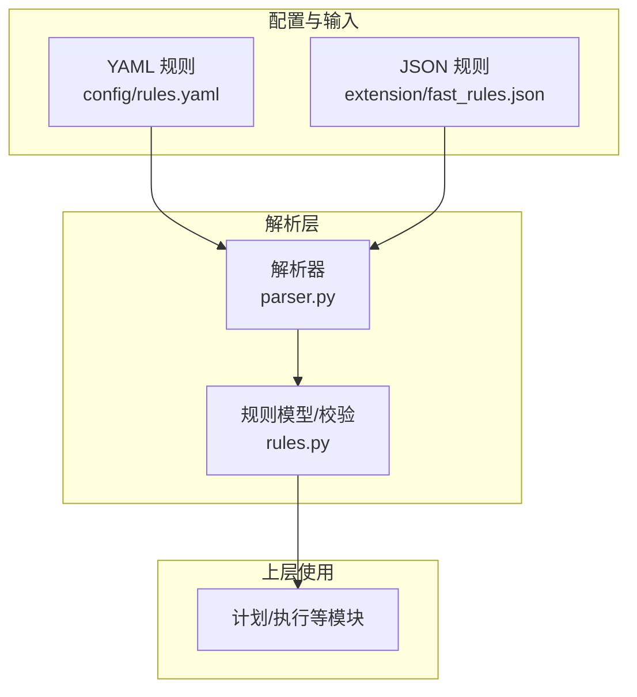
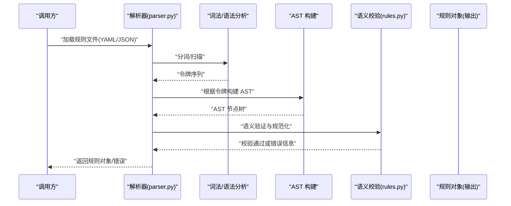
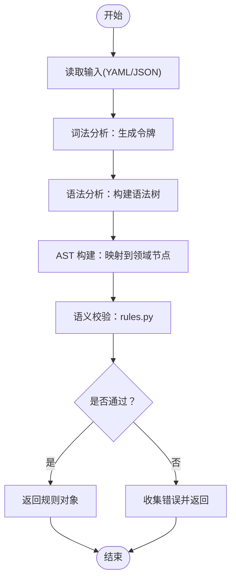
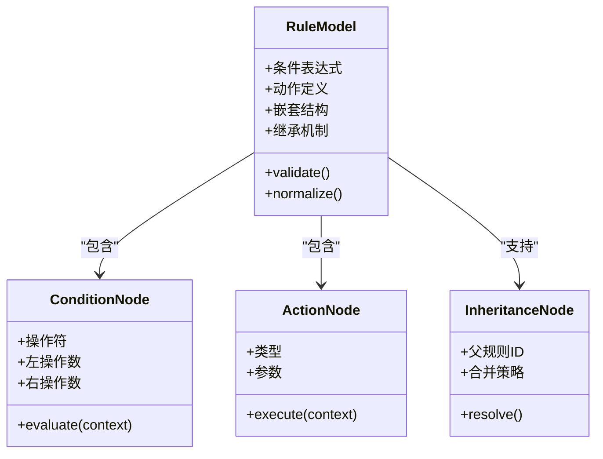
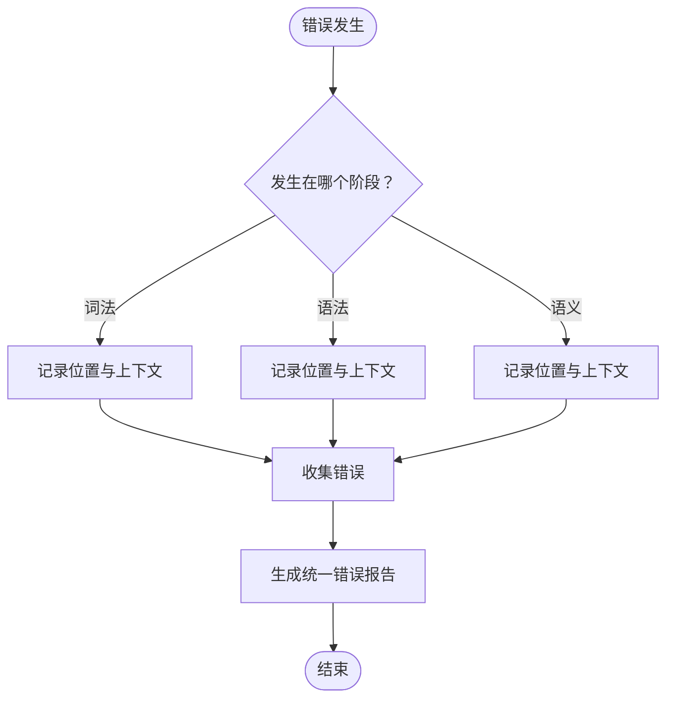
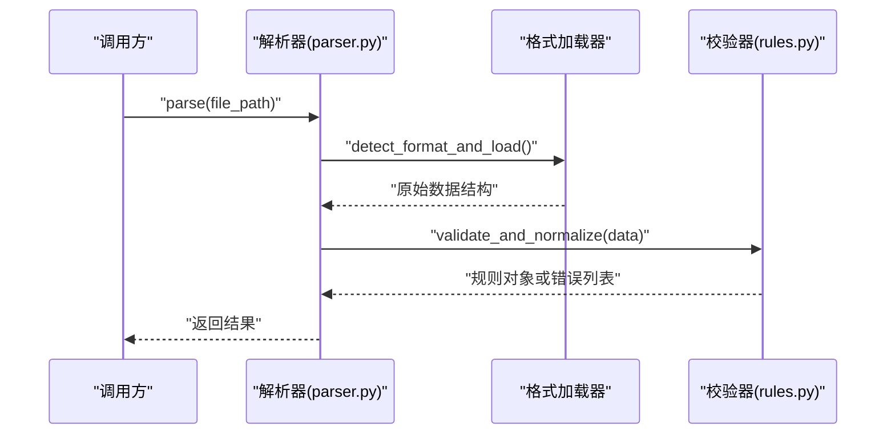
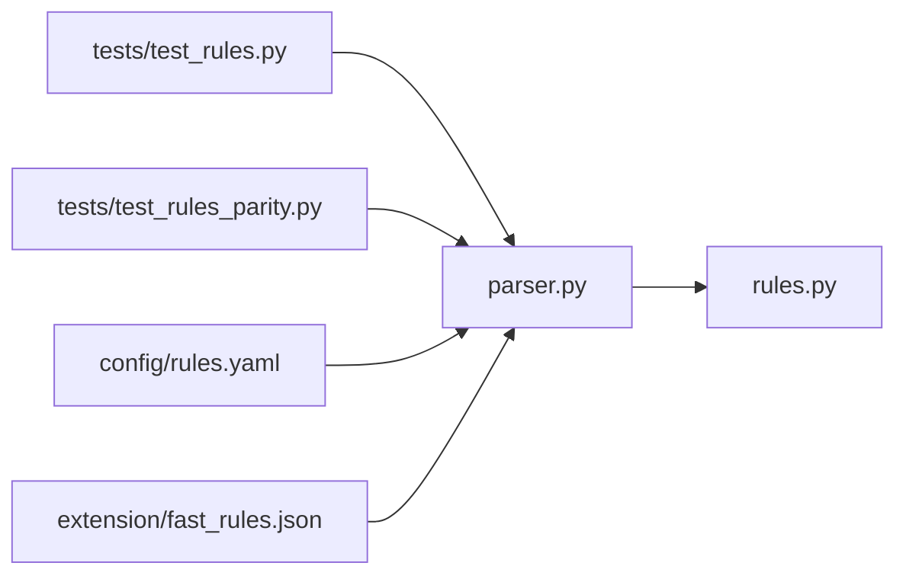

# 规则解析器

<cite>
**本文引用的文件**   
- [src/bookmark_advisor/parser.py](file://src/bookmark_advisor/parser.py)
- [src/bookmark_advisor/rules.py](file://src/bookmark_advisor/rules.py)
- [config/rules.yaml](file://config/rules.yaml)
- [extension/fast_rules.json](file://extension/fast_rules.json)
- [tests/test_rules.py](file://tests/test_rules.py)
- [tests/test_rules_parity.py](file://tests/test_rules_parity.py)
</cite>

## 目录
1. [简介](#简介)
2. [项目结构](#项目结构)
3. [核心组件](#核心组件)
4. [架构总览](#架构总览)
5. [详细组件分析](#详细组件分析)
6. [依赖关系分析](#依赖关系分析)
7. [性能考虑](#性能考虑)
8. [故障排查指南](#故障排查指南)
9. [结论](#结论)
10. [附录](#附录)

## 简介
本文件面向“规则解析器”的完整技术文档，聚焦于 YAML 与 JSON 规则文件的语法解析过程（词法分析、语法分析与 AST 构建）、规则语法规则（条件表达式、动作定义、嵌套结构与继承机制）、错误处理机制（语法错误检测、语义验证与友好提示），以及编写最佳实践、常见陷阱规避、性能优化策略与内存管理考量。文档同时提供可视化图示帮助理解系统架构与数据流。

## 项目结构
与规则解析相关的关键位置：
- Python 后端解析与模型：src/bookmark_advisor/parser.py、src/bookmark_advisor/rules.py
- 示例规则文件：config/rules.yaml（YAML）、extension/fast_rules.json（JSON）
- 测试用例：tests/test_rules.py、tests/test_rules_parity.py（覆盖解析、校验与兼容性）

图表来源
- [src/bookmark_advisor/parser.py](file://src/bookmark_advisor/parser.py)
- [src/bookmark_advisor/rules.py](file://src/bookmark_advisor/rules.py)
- [config/rules.yaml](file://config/rules.yaml)
- [extension/fast_rules.json](file://extension/fast_rules.json)

章节来源
- [src/bookmark_advisor/parser.py](file://src/bookmark_advisor/parser.py)
- [src/bookmark_advisor/rules.py](file://src/bookmark_advisor/rules.py)
- [config/rules.yaml](file://config/rules.yaml)
- [extension/fast_rules.json](file://extension/fast_rules.json)

## 核心组件
- 解析器（parser.py）
  - 负责读取并解析 YAML/JSON 规则文件，完成词法与语法分析，生成结构化 AST。
  - 提供统一的入口函数，屏蔽不同格式的差异，向上层返回一致的规则对象。
- 规则模型与校验（rules.py）
  - 定义规则的领域模型（如条件、动作、继承等）。
  - 对 AST 进行语义验证（类型检查、必填字段、引用有效性等），并输出规范化结果。
- 示例规则文件
  - config/rules.yaml：展示 YAML 风格的条件与动作定义。
  - extension/fast_rules.json：展示 JSON 风格的等价表达。
- 测试
  - tests/test_rules.py：覆盖解析流程、错误路径与边界情况。
  - tests/test_rules_parity.py：确保 YAML 与 JSON 解析结果一致。

章节来源
- [src/bookmark_advisor/parser.py](file://src/bookmark_advisor/parser.py)
- [src/bookmark_advisor/rules.py](file://src/bookmark_advisor/rules.py)
- [config/rules.yaml](file://config/rules.yaml)
- [extension/fast_rules.json](file://extension/fast_rules.json)
- [tests/test_rules.py](file://tests/test_rules.py)
- [tests/test_rules_parity.py](file://tests/test_rules_parity.py)

## 架构总览
下图展示了从规则文件到可执行规则的端到端流程，包括解析、AST 构建、语义校验与产物输出。

图表来源
- [src/bookmark_advisor/parser.py](file://src/bookmark_advisor/parser.py)
- [src/bookmark_advisor/rules.py](file://src/bookmark_advisor/rules.py)

## 详细组件分析

### 解析器（parser.py）
职责与流程
- 输入：YAML/JSON 文本或文件路径。
- 词法分析：将输入文本切分为最小语法单元（键、值、分隔符、字面量等）。
- 语法分析：依据规则语法将令牌组织为语法树。
- AST 构建：将语法树转换为领域相关的抽象语法树（包含条件、动作、继承等节点）。
- 统一接口：对外暴露统一的解析函数，隐藏 YAML/JSON 差异。

关键实现要点
- 支持多格式输入：内部根据扩展名或内容特征选择对应解析器。
- 错误定位：在词法/语法阶段记录行号与列号，便于后续生成友好错误消息。
- 可扩展性：新增规则语法时，优先扩展 AST 节点与校验逻辑，避免侵入式修改。

图表来源
- [src/bookmark_advisor/parser.py](file://src/bookmark_advisor/parser.py)
- [src/bookmark_advisor/rules.py](file://src/bookmark_advisor/rules.py)

章节来源
- [src/bookmark_advisor/parser.py](file://src/bookmark_advisor/parser.py)

### 规则模型与校验（rules.py）
职责与流程
- 定义规则领域模型：条件表达式、动作定义、嵌套结构、继承机制等。
- 语义验证：检查类型、必填项、引用存在性、作用域与冲突。
- 规范化：将 AST 转换为运行时可直接消费的结构（例如扁平化继承、合并默认值等）。

关键实现要点
- 类型安全：对每个字段进行严格类型约束，失败时给出明确错误信息。
- 继承与合并：支持规则间的继承与字段合并，需保证无环依赖与优先级清晰。
- 错误聚合：一次性收集所有语义错误，便于用户批量修复。

图表来源
- [src/bookmark_advisor/rules.py](file://src/bookmark_advisor/rules.py)

章节来源
- [src/bookmark_advisor/rules.py](file://src/bookmark_advisor/rules.py)

### 规则语法规则
- 条件表达式语法
  - 支持基本比较、逻辑组合、集合匹配与字符串模式匹配。
  - 支持上下文变量访问（如书签属性、环境信息等）。
  - 建议保持表达式幂等与可观测，便于调试与测试。
- 动作定义格式
  - 动作由类型与参数组成，类型决定执行行为，参数决定具体效果。
  - 支持可选参数的默认值与校验。
- 嵌套结构
  - 允许在规则中嵌套子规则或分组，提升可读性与复用性。
  - 嵌套层级不宜过深，避免维护成本上升。
- 继承机制
  - 支持规则间继承与字段合并，需避免循环依赖。
  - 建议显式声明继承关系与合并策略，减少歧义。

章节来源
- [config/rules.yaml](file://config/rules.yaml)
- [extension/fast_rules.json](file://extension/fast_rules.json)
- [src/bookmark_advisor/rules.py](file://src/bookmark_advisor/rules.py)

### 错误处理机制
- 语法错误检测
  - 词法阶段：非法字符、未闭合引号、不合法字面量等。
  - 语法阶段：缺少键值、多余逗号、非法缩进（YAML）等。
- 语义验证
  - 类型不匹配、必填字段缺失、引用不存在、作用域越界等。
- 友好错误提示
  - 提供文件路径、行号、列号与上下文片段。
  - 给出修复建议（如“请检查键名拼写”、“补全必填字段”）。

图表来源
- [src/bookmark_advisor/parser.py](file://src/bookmark_advisor/parser.py)
- [src/bookmark_advisor/rules.py](file://src/bookmark_advisor/rules.py)

章节来源
- [src/bookmark_advisor/parser.py](file://src/bookmark_advisor/parser.py)
- [src/bookmark_advisor/rules.py](file://src/bookmark_advisor/rules.py)

### 解析流程时序（YAML/JSON 统一入口）

图表来源
- [src/bookmark_advisor/parser.py](file://src/bookmark_advisor/parser.py)
- [src/bookmark_advisor/rules.py](file://src/bookmark_advisor/rules.py)

## 依赖关系分析
- 模块耦合
  - parser.py 依赖 rules.py 的模型与校验能力。
  - 测试模块依赖解析器与规则模型，用于断言正确性与一致性。
- 外部依赖
  - YAML/JSON 标准库或第三方解析库（由解析器内部封装）。
- 潜在风险
  - 若新增语法或模型变更，需同步更新解析器与校验逻辑，并保持测试覆盖。

图表来源
- [src/bookmark_advisor/parser.py](file://src/bookmark_advisor/parser.py)
- [src/bookmark_advisor/rules.py](file://src/bookmark_advisor/rules.py)
- [tests/test_rules.py](file://tests/test_rules.py)
- [tests/test_rules_parity.py](file://tests/test_rules_parity.py)
- [config/rules.yaml](file://config/rules.yaml)
- [extension/fast_rules.json](file://extension/fast_rules.json)

章节来源
- [src/bookmark_advisor/parser.py](file://src/bookmark_advisor/parser.py)
- [src/bookmark_advisor/rules.py](file://src/bookmark_advisor/rules.py)
- [tests/test_rules.py](file://tests/test_rules.py)
- [tests/test_rules_parity.py](file://tests/test_rules_parity.py)
- [config/rules.yaml](file://config/rules.yaml)
- [extension/fast_rules.json](file://extension/fast_rules.json)

## 性能考虑
- 解析性能优化
  - 增量解析：对大型规则文件采用分块或懒加载，减少首屏延迟。
  - 缓存 AST：对未变更的规则文件缓存 AST，避免重复解析。
  - 并行校验：对独立规则进行并发语义校验，缩短整体耗时。
- 内存管理
  - 流式读取：大文件使用迭代器逐行/逐段处理，降低峰值内存。
  - 对象复用：重用公共节点（如常量、默认动作），减少分配开销。
  - 及时释放：解析完成后尽早释放中间结构（令牌、临时树）。
- 基准与回归
  - 建立性能基线，定期回归测试，防止引入性能退化。

[本节为通用指导，无需特定文件来源]

## 故障排查指南
- 常见问题
  - 语法错误：检查引号、括号、缩进与分隔符。
  - 语义错误：核对字段类型、必填项与引用是否存在。
  - 继承冲突：确认无环依赖与合并策略是否符合预期。
- 定位技巧
  - 利用错误报告中的行号与列号快速定位问题。
  - 使用最小复现案例隔离问题范围。
  - 开启详细日志，观察解析各阶段的中间状态。
- 恢复步骤
  - 先修复语法错误，再处理语义错误。
  - 逐步启用规则，定位引发问题的具体规则。

章节来源
- [src/bookmark_advisor/parser.py](file://src/bookmark_advisor/parser.py)
- [src/bookmark_advisor/rules.py](file://src/bookmark_advisor/rules.py)

## 结论
规则解析器通过统一的解析入口与清晰的 AST 模型，实现了 YAML/JSON 双格式的无缝解析与强语义校验。良好的错误定位与友好的提示信息显著提升了开发体验。结合性能优化与内存管理策略，可在大规模规则场景下保持稳定与高效。建议在团队内推广最佳实践，持续完善测试覆盖与性能基线。

[本节为总结性内容，无需特定文件来源]

## 附录
- 编写最佳实践
  - 保持条件表达式简洁、可测试；复杂逻辑拆分为子规则。
  - 动作参数尽量使用默认值，减少冗余配置。
  - 合理使用继承，避免深层嵌套与循环依赖。
- 常见陷阱
  - 忽略大小写敏感性与类型转换导致的隐式错误。
  - 过度嵌套导致难以维护与调试。
  - 未充分测试继承合并后的最终效果。

[本节为通用指导，无需特定文件来源]