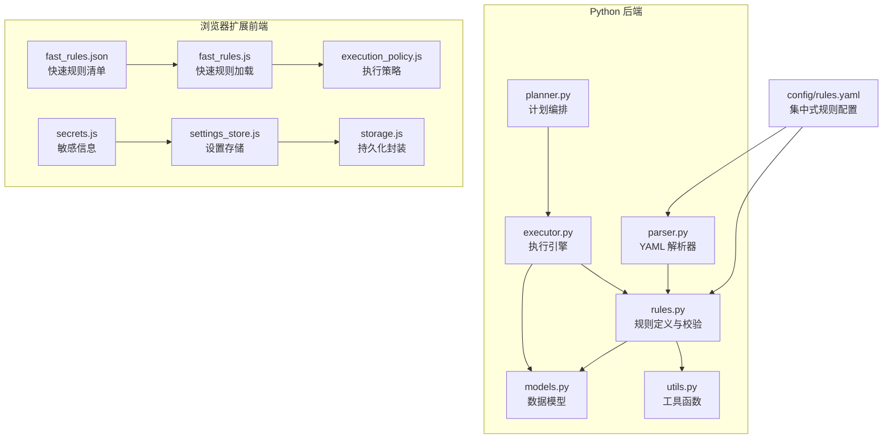
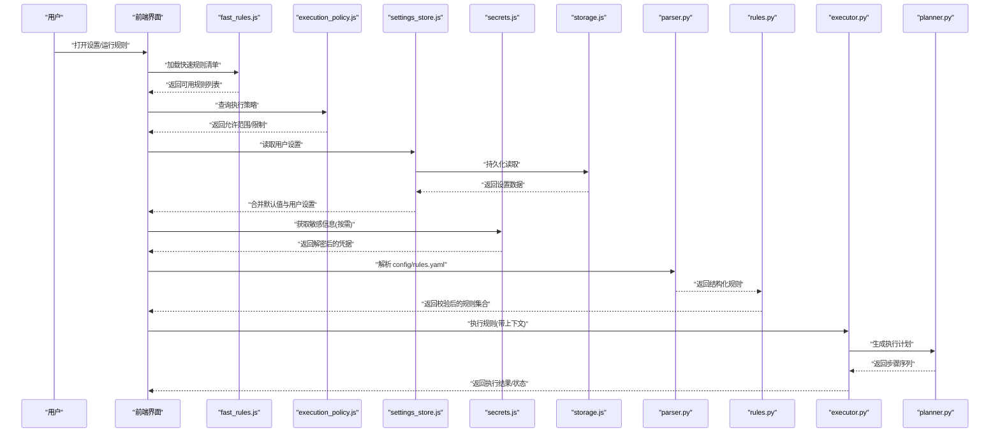
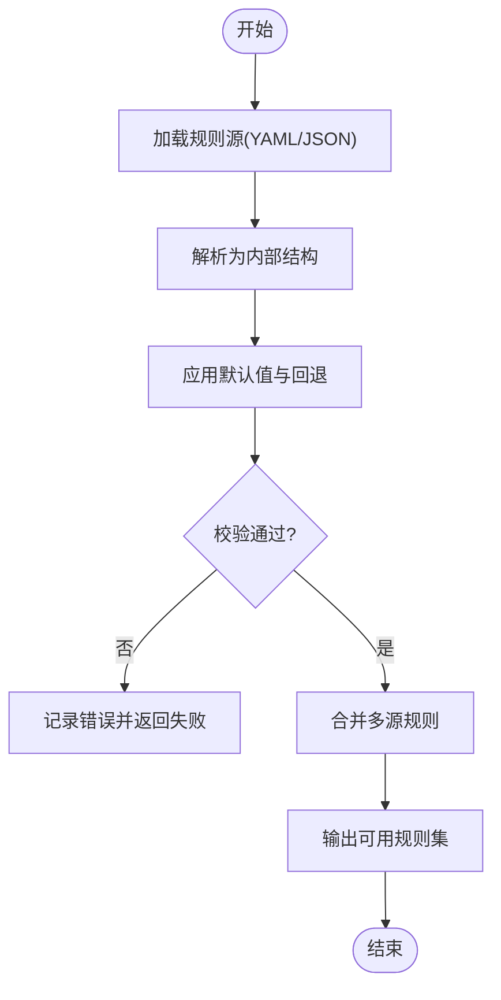
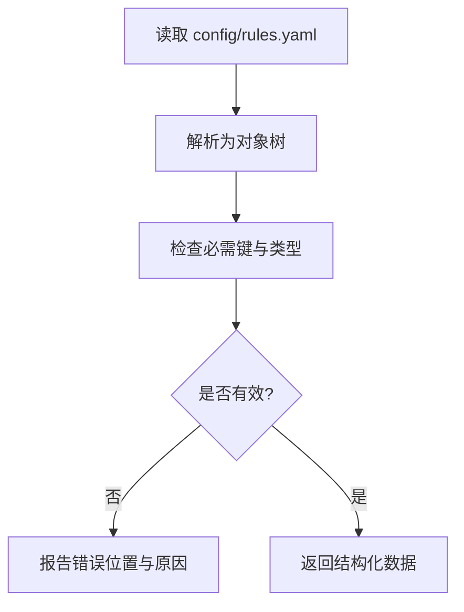
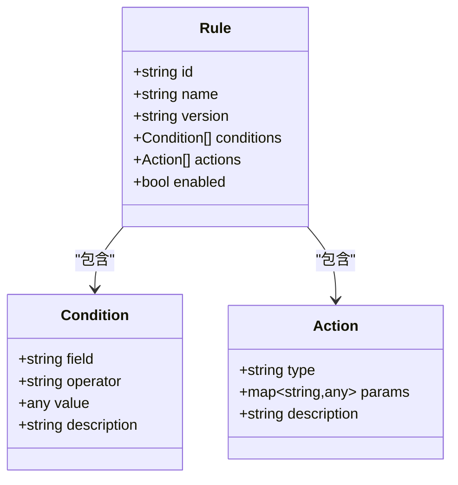
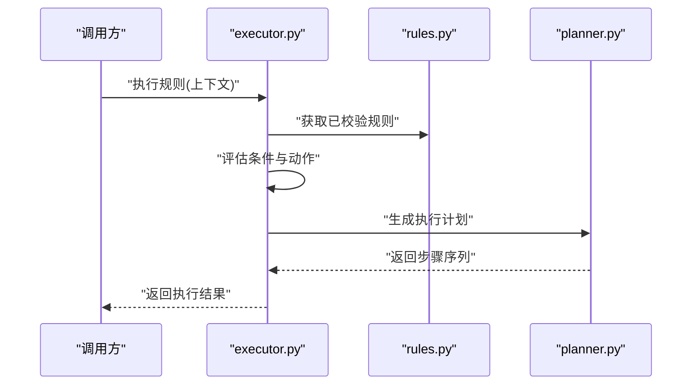
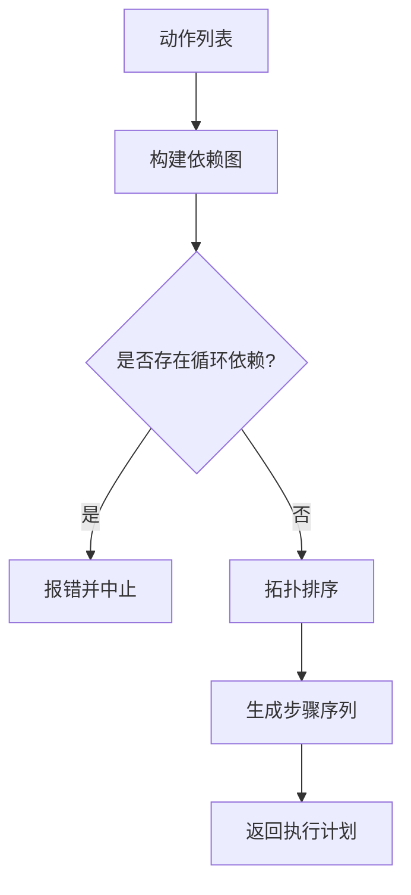
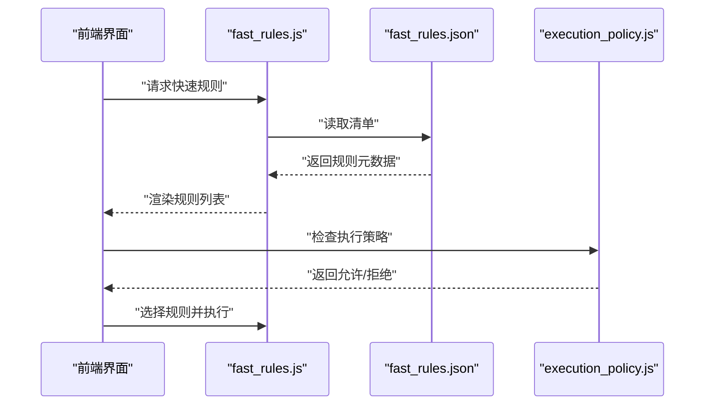
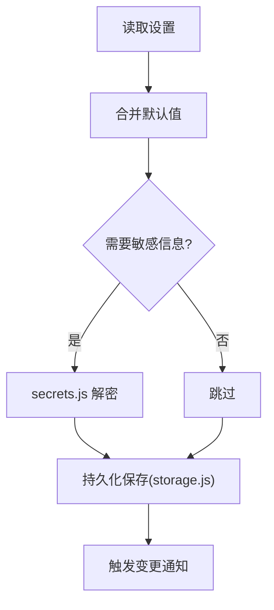
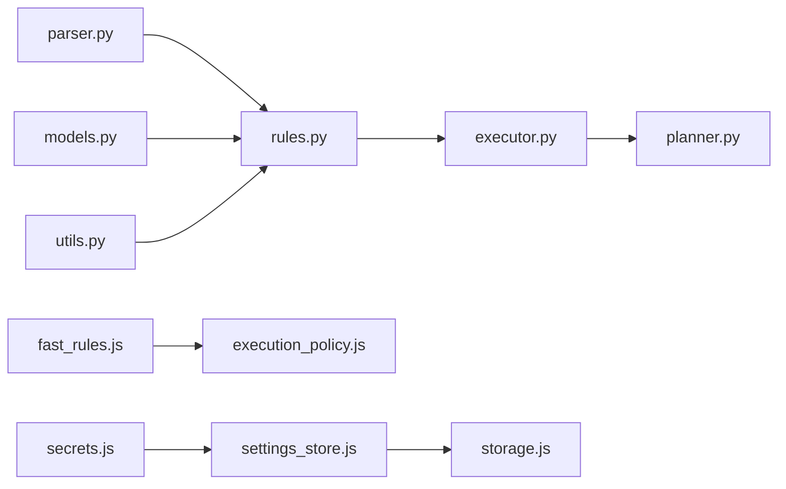

# 配置和规则系统

<cite>
**本文引用的文件**   
- [config/rules.yaml](file://config/rules.yaml)
- [extension/fast_rules.json](file://extension/fast_rules.json)
- [src/bookmark_advisor/rules.py](file://src/bookmark_advisor/rules.py)
- [src/bookmark_advisor/parser.py](file://src/bookmark_advisor/parser.py)
- [src/bookmark_advisor/executor.py](file://src/bookmark_advisor/executor.py)
- [src/bookmark_advisor/planner.py](file://src/bookmark_advisor/planner.py)
- [src/bookmark_advisor/models.py](file://src/bookmark_advisor/models.py)
- [src/bookmark_advisor/utils.py](file://src/bookmark_advisor/utils.py)
- [extension/popup/settings_store.js](file://extension/popup/settings_store.js)
- [extension/popup/secrets.js](file://extension/popup/secrets.js)
- [extension/shared/storage.js](file://extension/shared/storage.js)
- [extension/background/execution_policy.js](file://extension/background/execution_policy.js)
- [extension/ai/fast_rules.js](file://extension/ai/fast_rules.js)
- [tests/test_rules.py](file://tests/test_rules.py)
- [tests/test_extension_fast_rules.py](file://tests/test_extension_fast_rules.py)
- [tests/test_extension_popup_settings_store.py](file://tests/test_extension_popup_settings_store.py)
- [tests/test_extension_popup_secrets.py](file://tests/test_extension_popup_secrets.py)
</cite>

## 目录
1. [简介](#简介)
2. [项目结构](#项目结构)
3. [核心组件](#核心组件)
4. [架构总览](#架构总览)
5. [详细组件分析](#详细组件分析)
6. [依赖关系分析](#依赖关系分析)
7. [性能考虑](#性能考虑)
8. [故障排除指南](#故障排除指南)
9. [结论](#结论)
10. [附录](#附录)

## 简介
本文件面向“配置与规则系统”的设计与实现，覆盖以下主题：
- 集中式配置存储、动态加载与热重载机制
- 规则引擎（YAML 规则语法、解析器与执行引擎）
- 快速规则系统（预定义规则扩展与自定义规则添加）
- 设置存储的安全机制（敏感信息加密与访问控制）
- 配置验证与默认值处理、迁移与向后兼容
- 规则编写指南（语法规则、条件表达式、动作示例）
- 最佳实践与常见问题排查

## 项目结构
本项目在 Python 后端与浏览器扩展前端两侧分别实现了配置与规则能力。关键位置如下：
- 规则定义与数据模型：Python 侧的 rules.py、parser.py、models.py、utils.py
- 规则执行与计划生成：executor.py、planner.py
- 前端快速规则与设置存储：fast_rules.json、fast_rules.js、settings_store.js、secrets.js、storage.js
- 执行策略与集成点：execution_policy.js
- 测试用例：test_rules.py、test_extension_fast_rules.py、test_extension_popup_settings_store.py、test_extension_popup_secrets.py

图表来源
- [config/rules.yaml:1-200](file://config/rules.yaml#L1-L200)
- [src/bookmark_advisor/rules.py:1-200](file://src/bookmark_advisor/rules.py#L1-L200)
- [src/bookmark_advisor/parser.py:1-200](file://src/bookmark_advisor/parser.py#L1-L200)
- [src/bookmark_advisor/models.py:1-200](file://src/bookmark_advisor/models.py#L1-L200)
- [src/bookmark_advisor/utils.py:1-200](file://src/bookmark_advisor/utils.py#L1-L200)
- [src/bookmark_advisor/executor.py:1-200](file://src/bookmark_advisor/executor.py#L1-L200)
- [src/bookmark_advisor/planner.py:1-200](file://src/bookmark_advisor/planner.py#L1-L200)
- [extension/fast_rules.json:1-200](file://extension/fast_rules.json#L1-L200)
- [extension/ai/fast_rules.js:1-200](file://extension/ai/fast_rules.js#L1-L200)
- [extension/popup/settings_store.js:1-200](file://extension/popup/settings_store.js#L1-L200)
- [extension/popup/secrets.js:1-200](file://extension/popup/secrets.js#L1-L200)
- [extension/shared/storage.js:1-200](file://extension/shared/storage.js#L1-L200)
- [extension/background/execution_policy.js:1-200](file://extension/background/execution_policy.js#L1-L200)

章节来源
- [config/rules.yaml:1-200](file://config/rules.yaml#L1-L200)
- [src/bookmark_advisor/rules.py:1-200](file://src/bookmark_advisor/rules.py#L1-L200)
- [src/bookmark_advisor/parser.py:1-200](file://src/bookmark_advisor/parser.py#L1-L200)
- [src/bookmark_advisor/models.py:1-200](file://src/bookmark_advisor/models.py#L1-L200)
- [src/bookmark_advisor/utils.py:1-200](file://src/bookmark_advisor/utils.py#L1-L200)
- [src/bookmark_advisor/executor.py:1-200](file://src/bookmark_advisor/executor.py#L1-L200)
- [src/bookmark_advisor/planner.py:1-200](file://src/bookmark_advisor/planner.py#L1-L200)
- [extension/fast_rules.json:1-200](file://extension/fast_rules.json#L1-L200)
- [extension/ai/fast_rules.js:1-200](file://extension/ai/fast_rules.js#L1-L200)
- [extension/popup/settings_store.js:1-200](file://extension/popup/settings_store.js#L1-L200)
- [extension/popup/secrets.js:1-200](file://extension/popup/secrets.js#L1-L200)
- [extension/shared/storage.js:1-200](file://extension/shared/storage.js#L1-L200)
- [extension/background/execution_policy.js:1-200](file://extension/background/execution_policy.js#L1-L200)

## 核心组件
- 规则定义与校验模块：负责规则结构的声明、字段约束、类型检查与错误提示
- YAML 解析器：将 config/rules.yaml 转换为内部数据结构，并做基础格式校验
- 数据模型：为规则、动作、条件等提供统一的数据结构定义
- 执行引擎：根据规则与上下文计算匹配结果，触发相应动作或生成执行计划
- 计划编排：将规则执行结果转化为可执行的步骤序列
- 快速规则系统：前端通过 fast_rules.json 与 fast_rules.js 提供轻量级规则入口
- 设置存储与安全：settings_store.js 管理用户设置，secrets.js 管理敏感信息，storage.js 提供持久化封装
- 执行策略：execution_policy.js 控制规则执行的范围、权限与限制

章节来源
- [src/bookmark_advisor/rules.py:1-200](file://src/bookmark_advisor/rules.py#L1-L200)
- [src/bookmark_advisor/parser.py:1-200](file://src/bookmark_advisor/parser.py#L1-L200)
- [src/bookmark_advisor/models.py:1-200](file://src/bookmark_advisor/models.py#L1-L200)
- [src/bookmark_advisor/executor.py:1-200](file://src/bookmark_advisor/executor.py#L1-L200)
- [src/bookmark_advisor/planner.py:1-200](file://src/bookmark_advisor/planner.py#L1-L200)
- [extension/ai/fast_rules.js:1-200](file://extension/ai/fast_rules.js#L1-L200)
- [extension/popup/settings_store.js:1-200](file://extension/popup/settings_store.js#L1-L200)
- [extension/popup/secrets.js:1-200](file://extension/popup/secrets.js#L1-L200)
- [extension/shared/storage.js:1-200](file://extension/shared/storage.js#L1-L200)
- [extension/background/execution_policy.js:1-200](file://extension/background/execution_policy.js#L1-L200)

## 架构总览
下图展示了从配置到规则执行的整体流程，包括集中式配置、解析、校验、执行与前端快速规则的协作。

图表来源
- [extension/ai/fast_rules.js:1-200](file://extension/ai/fast_rules.js#L1-L200)
- [extension/background/execution_policy.js:1-200](file://extension/background/execution_policy.js#L1-L200)
- [extension/popup/settings_store.js:1-200](file://extension/popup/settings_store.js#L1-L200)
- [extension/popup/secrets.js:1-200](file://extension/popup/secrets.js#L1-L200)
- [extension/shared/storage.js:1-200](file://extension/shared/storage.js#L1-L200)
- [src/bookmark_advisor/parser.py:1-200](file://src/bookmark_advisor/parser.py#L1-L200)
- [src/bookmark_advisor/rules.py:1-200](file://src/bookmark_advisor/rules.py#L1-L200)
- [src/bookmark_advisor/executor.py:1-200](file://src/bookmark_advisor/executor.py#L1-L200)
- [src/bookmark_advisor/planner.py:1-200](file://src/bookmark_advisor/planner.py#L1-L200)

## 详细组件分析

### 规则定义与校验（rules.py）
- 职责
  - 定义规则的结构与字段约束
  - 提供规则加载、合并与校验逻辑
  - 暴露统一的规则接口供执行引擎使用
- 设计要点
  - 采用强类型模型与校验器，确保规则文件的正确性
  - 支持多源规则合并（集中式 YAML + 快速规则 JSON）
  - 对缺失字段提供默认值与回退策略
- 典型流程
  - 加载 YAML 规则 -> 解析为内部结构 -> 应用默认值 -> 校验字段类型与约束 -> 输出可用规则集

图表来源
- [src/bookmark_advisor/rules.py:1-200](file://src/bookmark_advisor/rules.py#L1-L200)

章节来源
- [src/bookmark_advisor/rules.py:1-200](file://src/bookmark_advisor/rules.py#L1-L200)

### YAML 解析器（parser.py）
- 职责
  - 读取 config/rules.yaml
  - 将 YAML 文本解析为 Python 对象
  - 进行基础格式校验（键存在性、类型、枚举值等）
- 设计要点
  - 与 rules.py 解耦，仅负责解析与基础校验
  - 提供清晰的错误定位（行号、路径），便于调试
- 典型流程
  - 读取文件 -> 解析 YAML -> 校验结构 -> 返回结构化数据

图表来源
- [src/bookmark_advisor/parser.py:1-200](file://src/bookmark_advisor/parser.py#L1-L200)
- [config/rules.yaml:1-200](file://config/rules.yaml#L1-L200)

章节来源
- [src/bookmark_advisor/parser.py:1-200](file://src/bookmark_advisor/parser.py#L1-L200)
- [config/rules.yaml:1-200](file://config/rules.yaml#L1-L200)

### 数据模型（models.py）
- 职责
  - 定义规则、条件、动作、上下文等核心数据结构
  - 提供序列化/反序列化方法
- 设计要点
  - 使用强类型与可选字段，保证向后兼容
  - 提供默认值与版本字段，支持迁移
- 典型用法
  - 规则对象包含 id、name、version、conditions、actions 等字段
  - 条件对象包含操作符、目标字段、期望值等
  - 动作对象包含类型、参数、副作用说明等

图表来源
- [src/bookmark_advisor/models.py:1-200](file://src/bookmark_advisor/models.py#L1-L200)

章节来源
- [src/bookmark_advisor/models.py:1-200](file://src/bookmark_advisor/models.py#L1-L200)

### 执行引擎（executor.py）
- 职责
  - 基于规则与上下文计算匹配结果
  - 触发动作或生成执行计划
- 设计要点
  - 支持并行评估条件与动作
  - 提供执行日志与错误恢复
- 典型流程
  - 接收规则集与上下文 -> 评估条件 -> 收集动作 -> 调用计划编排 -> 返回结果

图表来源
- [src/bookmark_advisor/executor.py:1-200](file://src/bookmark_advisor/executor.py#L1-L200)
- [src/bookmark_advisor/rules.py:1-200](file://src/bookmark_advisor/rules.py#L1-L200)
- [src/bookmark_advisor/planner.py:1-200](file://src/bookmark_advisor/planner.py#L1-L200)

章节来源
- [src/bookmark_advisor/executor.py:1-200](file://src/bookmark_advisor/executor.py#L1-L200)
- [src/bookmark_advisor/planner.py:1-200](file://src/bookmark_advisor/planner.py#L1-L200)

### 计划编排（planner.py）
- 职责
  - 将动作序列编排为可执行的步骤
  - 处理依赖、顺序与并发
- 设计要点
  - 支持拓扑排序与冲突检测
  - 提供回滚与重试策略
- 典型流程
  - 输入动作列表 -> 构建依赖图 -> 生成步骤序列 -> 返回执行计划

图表来源
- [src/bookmark_advisor/planner.py:1-200](file://src/bookmark_advisor/planner.py#L1-L200)

章节来源
- [src/bookmark_advisor/planner.py:1-200](file://src/bookmark_advisor/planner.py#L1-L200)

### 快速规则系统（fast_rules.json 与 fast_rules.js）
- 职责
  - 提供轻量级规则清单与前端加载逻辑
  - 与执行策略联动，控制规则可见性与可用性
- 设计要点
  - fast_rules.json 作为静态清单，描述可用规则及其元数据
  - fast_rules.js 负责加载、缓存与更新
- 典型流程
  - 启动时加载 fast_rules.json -> 渲染可用规则 -> 用户选择后交由执行策略判断 -> 触发执行

图表来源
- [extension/fast_rules.json:1-200](file://extension/fast_rules.json#L1-L200)
- [extension/ai/fast_rules.js:1-200](file://extension/ai/fast_rules.js#L1-L200)
- [extension/background/execution_policy.js:1-200](file://extension/background/execution_policy.js#L1-L200)

章节来源
- [extension/fast_rules.json:1-200](file://extension/fast_rules.json#L1-L200)
- [extension/ai/fast_rules.js:1-200](file://extension/ai/fast_rules.js#L1-L200)
- [extension/background/execution_policy.js:1-200](file://extension/background/execution_policy.js#L1-L200)

### 设置存储与安全（settings_store.js、secrets.js、storage.js）
- 职责
  - settings_store.js：管理用户设置，提供默认值合并与变更通知
  - secrets.js：管理敏感信息（如密钥），提供加密存储与受控访问
  - storage.js：封装持久化读写，提供原子写入与错误恢复
- 设计要点
  - 敏感信息不直接暴露，通过 secrets.js 的 API 访问
  - 设置变更事件驱动 UI 更新与规则重加载
- 典型流程
  - 读取设置 -> 合并默认值 -> 按需解密敏感信息 -> 持久化保存

图表来源
- [extension/popup/settings_store.js:1-200](file://extension/popup/settings_store.js#L1-L200)
- [extension/popup/secrets.js:1-200](file://extension/popup/secrets.js#L1-L200)
- [extension/shared/storage.js:1-200](file://extension/shared/storage.js#L1-L200)

章节来源
- [extension/popup/settings_store.js:1-200](file://extension/popup/settings_store.js#L1-L200)
- [extension/popup/secrets.js:1-200](file://extension/popup/secrets.js#L1-L200)
- [extension/shared/storage.js:1-200](file://extension/shared/storage.js#L1-L200)

### 工具函数（utils.py）
- 职责
  - 提供通用工具：路径处理、时间格式化、错误包装等
- 设计要点
  - 无状态、纯函数为主，便于测试与复用
- 典型用法
  - 在规则解析、执行与存储中广泛使用

章节来源
- [src/bookmark_advisor/utils.py:1-200](file://src/bookmark_advisor/utils.py#L1-L200)

## 依赖关系分析
下图展示各模块之间的依赖关系与耦合度，有助于识别潜在循环依赖与优化点。

图表来源
- [src/bookmark_advisor/parser.py:1-200](file://src/bookmark_advisor/parser.py#L1-L200)
- [src/bookmark_advisor/rules.py:1-200](file://src/bookmark_advisor/rules.py#L1-L200)
- [src/bookmark_advisor/models.py:1-200](file://src/bookmark_advisor/models.py#L1-L200)
- [src/bookmark_advisor/utils.py:1-200](file://src/bookmark_advisor/utils.py#L1-L200)
- [src/bookmark_advisor/executor.py:1-200](file://src/bookmark_advisor/executor.py#L1-L200)
- [src/bookmark_advisor/planner.py:1-200](file://src/bookmark_advisor/planner.py#L1-L200)
- [extension/ai/fast_rules.js:1-200](file://extension/ai/fast_rules.js#L1-L200)
- [extension/background/execution_policy.js:1-200](file://extension/background/execution_policy.js#L1-L200)
- [extension/popup/settings_store.js:1-200](file://extension/popup/settings_store.js#L1-L200)
- [extension/shared/storage.js:1-200](file://extension/shared/storage.js#L1-L200)
- [extension/popup/secrets.js:1-200](file://extension/popup/secrets.js#L1-L200)

章节来源
- [src/bookmark_advisor/parser.py:1-200](file://src/bookmark_advisor/parser.py#L1-L200)
- [src/bookmark_advisor/rules.py:1-200](file://src/bookmark_advisor/rules.py#L1-L200)
- [src/bookmark_advisor/models.py:1-200](file://src/bookmark_advisor/models.py#L1-L200)
- [src/bookmark_advisor/utils.py:1-200](file://src/bookmark_advisor/utils.py#L1-L200)
- [src/bookmark_advisor/executor.py:1-200](file://src/bookmark_advisor/executor.py#L1-L200)
- [src/bookmark_advisor/planner.py:1-200](file://src/bookmark_advisor/planner.py#L1-L200)
- [extension/ai/fast_rules.js:1-200](file://extension/ai/fast_rules.js#L1-L200)
- [extension/background/execution_policy.js:1-200](file://extension/background/execution_policy.js#L1-L200)
- [extension/popup/settings_store.js:1-200](file://extension/popup/settings_store.js#L1-L200)
- [extension/shared/storage.js:1-200](file://extension/shared/storage.js#L1-L200)
- [extension/popup/secrets.js:1-200](file://extension/popup/secrets.js#L1-L200)

## 性能考虑
- 规则解析与校验
  - 建议对大型 YAML 文件进行分块解析与增量校验，避免一次性加载导致内存峰值
  - 使用缓存减少重复解析开销
- 执行引擎
  - 条件评估可并行化，注意线程安全与资源竞争
  - 动作执行应支持批处理与去重，降低 I/O 压力
- 前端快速规则
  - fast_rules.json 应尽可能小且稳定，频繁变更时使用增量更新
  - 执行策略判断尽量本地完成，减少跨进程通信
- 设置存储
  - 使用原子写入避免部分写入导致的损坏
  - 对敏感信息进行懒加载与最小权限访问

[本节为通用指导，无需具体文件引用]

## 故障排除指南
- 规则解析失败
  - 检查 YAML 语法与缩进
  - 查看 parser.py 的错误定位信息（行号、路径）
  - 确认 models.py 定义的字段与类型一致
- 规则校验失败
  - 核对 rules.py 的约束与默认值
  - 使用测试用例 test_rules.py 复现问题
- 执行异常
  - 检查 executor.py 的执行日志与错误堆栈
  - 确认 planner.py 的依赖图无环
- 前端快速规则不可用
  - 检查 fast_rules.json 的清单结构与 fast_rules.js 的加载逻辑
  - 确认 execution_policy.js 的策略未阻止执行
- 设置与敏感信息问题
  - 检查 settings_store.js 的默认值合并逻辑
  - 确认 secrets.js 的解密流程与权限控制
  - 使用 storage.js 的原子写入与错误恢复

章节来源
- [src/bookmark_advisor/parser.py:1-200](file://src/bookmark_advisor/parser.py#L1-L200)
- [src/bookmark_advisor/models.py:1-200](file://src/bookmark_advisor/models.py#L1-L200)
- [src/bookmark_advisor/rules.py:1-200](file://src/bookmark_advisor/rules.py#L1-L200)
- [src/bookmark_advisor/executor.py:1-200](file://src/bookmark_advisor/executor.py#L1-L200)
- [src/bookmark_advisor/planner.py:1-200](file://src/bookmark_advisor/planner.py#L1-L200)
- [extension/ai/fast_rules.js:1-200](file://extension/ai/fast_rules.js#L1-L200)
- [extension/background/execution_policy.js:1-200](file://extension/background/execution_policy.js#L1-L200)
- [extension/popup/settings_store.js:1-200](file://extension/popup/settings_store.js#L1-L200)
- [extension/popup/secrets.js:1-200](file://extension/popup/secrets.js#L1-L200)
- [extension/shared/storage.js:1-200](file://extension/shared/storage.js#L1-L200)
- [tests/test_rules.py:1-200](file://tests/test_rules.py#L1-L200)
- [tests/test_extension_fast_rules.py:1-200](file://tests/test_extension_fast_rules.py#L1-L200)
- [tests/test_extension_popup_settings_store.py:1-200](file://tests/test_extension_popup_settings_store.py#L1-L200)
- [tests/test_extension_popup_secrets.py:1-200](file://tests/test_extension_popup_secrets.py#L1-L200)

## 结论
本系统通过集中式 YAML 配置与前端快速规则相结合，提供了灵活、可扩展的规则管理能力。规则解析与校验严格，执行引擎与计划编排保证了可靠执行；设置存储与安全机制保障了敏感信息的安全。建议在大规模场景下引入缓存与并行优化，并通过完善的测试覆盖保障向后兼容与稳定性。

[本节为总结，无需具体文件引用]

## 附录

### 规则编写指南
- 基本结构
  - 每个规则包含 id、name、version、enabled 等元数据
  - conditions 数组定义匹配条件，actions 数组定义触发动作
- 条件表达式
  - 支持常见操作符（等于、包含、正则匹配等）
  - 支持嵌套条件与布尔组合
- 动作定义
  - 动作类型需与执行引擎内置类型一致
  - 参数应遵循 models.py 的定义，必要时提供默认值
- 示例参考
  - 参考 tests/test_rules.py 中的用例，了解不同条件的写法
  - 参考 extension/fast_rules.json 与 extension/ai/fast_rules.js，了解快速规则的清单与加载方式

章节来源
- [src/bookmark_advisor/models.py:1-200](file://src/bookmark_advisor/models.py#L1-L200)
- [tests/test_rules.py:1-200](file://tests/test_rules.py#L1-L200)
- [extension/fast_rules.json:1-200](file://extension/fast_rules.json#L1-L200)
- [extension/ai/fast_rules.js:1-200](file://extension/ai/fast_rules.js#L1-L200)

### 配置最佳实践
- 将大配置文件拆分为多个子文件，按功能域组织
- 使用版本字段与迁移脚本保证向后兼容
- 对敏感信息使用 secrets.js 管理，避免硬编码
- 启用执行策略限制，防止误操作
- 定期运行测试用例，确保规则与配置的稳定性

[本节为通用指导，无需具体文件引用]